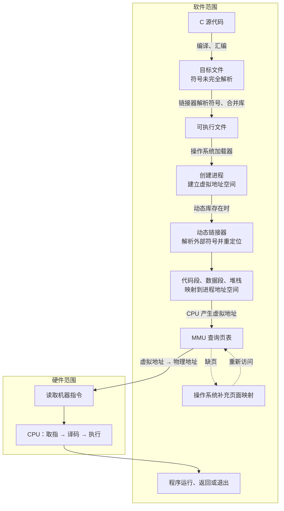

---
{"dg-publish":true,"permalink":"/Learn/C 语言的演化历史/","title":"C 语言的演化历史","tags":["flashcards"],"noteIcon":"","created":"2026-09-05T09:44:37.000+08:00","updated":"2026-09-05T09:44:37.000+08:00","dg-note-properties":{"title":"C 语言的演化历史","tags":["flashcards"]}}
---

# C 语言的演化历史（Evolution）
C 语言是在 1970 年代早期由==1;;丹尼斯·里奇（Dennis Ritchie）== 在贝尔实验室开发的，用于编写 ==1;;UNIX== 操作系统。它的发展是一个继承和改进的过程：

| 阶段                     | 语言名称                                           | 主要特点和贡献                                                                                 |
| :--------------------- | :--------------------------------------------- | :-------------------------------------------------------------------------------------- |
| **I. 根基 (1960s)**      | **ALGOL 60**                                   | 确立了现代程序设计语言的许多**结构化编程**概念，但没有直接影响 C 语言的语法。                                              |
| **II. 前身 (1967)**      | **BCPL (Basic Combined Programming Language)** | 由 Martin Richards 开发，是一种**无类型**的系统编程语言。它影响了 C 语言的早期语法和结构。                               |
| **III. 直接前驱 (1970)**   | **B 语言**                                       | 由 Ken Thompson 在 BCPL 基础上为早期 UNIX 系统开发。它非常简单，但在处理**数据类型**方面存在缺陷。                        |
| **IV. 诞生 (1972)**      | **C 语言**                                       | 丹尼斯·里奇在 B 语言的基础上，加入了==1;;数据类型(如 `int`, `char`)==和==1;;结构体==等特性，使其成为一种强大、高效且更安全的系统级编程语言。 |
| **V. 标准化 (1989/1990)** | **ANSI C / C89/C90**                           | 由美国国家标准协会（ANSI）和国际标准化组织（ISO）制定，确保了 C 语言在不同平台上的**可移植性**和**兼容性**。                         |
**总结：** C 语言是==1;;中==级语言，它并不是从机器语言“演化”而来，而是在一系列抽象程度更高的**结构化**编程语言（BCPL $\rightarrow$ B）的基础上，通过加入==1;;强类型==特性和系统编程能力而**发明**出来的。
<!--SR:!2026-10-13,43,250-->
<?e?>
# C 语言转化为机器语言的步骤（Compilation）
C 语言源代码不能被 CPU 直接执行。它必须经过一个复杂的过程，通常由==1;;编译器（Compiler）== 完成，才能生成最终的==1;;机器语言==代码。
现代编译过程通常可以分解为以下几个主要阶段：
## 语言转换逻辑对比
| **语言维度** | **C 语言 (中级)**    | **汇编语言 (低级)**   | **机器码 (底层)** |
| -------- | ---------------- | --------------- | ------------ |
| **可读性**  | 极高，逻辑清晰          | 一般，需了解硬件架构      | 极低，仅限机器读取    |
| **可移植性** | 高（跨平台通用）         | 差（绑定特定 CPU）     | 无（绑定特定指令集）   |
| **表示形式** | 文本 (UTF-8/ASCII) | 文本 (助记符)        | 二进制 (数值)     |
| **转换工具** | 编译器 (Compiler)   | 汇编器 (Assembler) | N/A (直接运行)   |
### 阶段一：预处理 (Preprocessing)
- **输入：** ==1;;C 源代码（`.c` 文件）==
- **操作：** 处理源代码中以 `#` 开头的指令，如：
	- **宏展开：** 将 `#define` 定义的宏替换为实际文本。
	- **文件包含：** 将 `#include` 指定的文件（如头文件）内容插入到源代码中。
	- **条件编译：** 根据 `#if` 等指令删除或保留部分代码。
- **输出：** 经过处理的==1;;纯 C==源代码。
- **如何理解：**
	- 预处理器只改写文本，不生成机器指令。
	- 例如 `#define N 10` 会先把 `N` 替换为 `10`，`#include` 会展开为头文件内容；这一阶段仍然是 C 文本。
### 阶段二：编译 (Compiling)
- **输入：** 经过处理的 ==1;;纯 C== 源代码。
- **操作：** 这是最复杂的一步，包括**词法、语法、语义分析、代码优化**。
	- 编译器将 C 语言代码翻译成与特定 CPU 架构（如 x86、ARM）相对应的==1;;汇编==语言代码。
- **输出：** ==1;;汇编==语言代码，通常是 `.s`、`.asm` 文件。
- **如何理解：** 编译器把 C 的变量、表达式和控制流翻译成特定 CPU 的汇编指令。例如 `add(1, 2)` 可能变成 `call add`，`total` 可能变成 `mov eax, [total]`；此时 `add` 和 `total` 仍是**符号名**，还没有确定最终位置。
### 阶段三：汇编 (Assembling)
- **输入：** ==1;;汇编==语言代码。
- **操作：** 汇编器将人类可读的==1;;汇编==助记符（如 `mov`、`jmp`、`add`）直接翻译成 CPU 能够识别的==1;;机器（二进制）==语言代码。
- **输出：** ==1;;机器==代码，但尚未完全==1;;链接==，通常是 `.obj`、`.o` 文件。
- **如何理解：**
	- **符号表(有哪些函数和变量)：** 记录函数、变量等**符号名**及其在目标文件中的位置，供链接器查找。
	- **重定位项(哪些地址以后需要补全)：** **记录**机器码中哪些**位置**仍需**填入目标地址**或**相对偏移**，例如 `call add` 的跳转位置。
	- 因此目标文件已经包含机器码，但 `call add` 中的目标位置、`total` 的访问地址仍可能等待链接器补全。
- **例如：**
```asm
call add
```
汇编后，机器码中可能只留下一个占位值，同时重定位表记录：
> “这里引用了 `add`，链接时需要修正。”
### 阶段四：链接 (Linking)
- **输入：** 多个==1;;目标（`.obj`、`.o`）==文件和程序所需的==1;;库（Library）==文件。
- **操作：**
	- **地址解析：** 解决代码中所有函数调用和变量引用的最终==1;;地址==或相对==1;;偏移==。
	- **合并：** 将程序自身的代码和所有需要的库代码（如 `printf` 库函数）合并在一起。
- **输出：** 可==1;;执行==文件（Executable File，如 Windows 的 `.exe` 或 Linux 的无后缀文件），可以直接在操作系统上运行。
- **如何理解：**
	- 链接器先为**函数和变量安排位置**，再**根据重定位项修正引用**。
	- 把多个目标文件和库文件合并起来，并**补全**函数、变量的**最终地址**或**偏移量**，生成**可运行的程序**。
	- 假设 `main` 位于 `0x401000`、`add` 位于 `0x401150`，它可以写入 `add` 的虚拟地址 `0x401150`，也可以写入从下一条指令到 `add` 的相对偏移 `0x130`。这一步由链接器软件完成，不是 CPU 或 MMU 完成。
- **例如：**
```shell
下一条指令地址 = 0x401020
add 地址     = 0x401150
相对偏移     = 0x130
```
链接器可能把 `0x130` 写入 `call` 指令，而不是直接写入 `0x401150`。
但要区分：
- **静态链接**：链接器通常可以完成**大部分地址解析**和**重定位**。
- **动态链接**：共享库函数如 `printf` 的**最终地址**可能**要等**装载器在**程序启动时**完成。
- **ASLR**：程序加载到内存后，**实际虚拟地址**可能与链接时预想的地址**不同**，装载器还可能进行**动态重定位**。
### 阶段五：加载与动态链接 (Loading)
- **输入：** 可==1;;执行==文件及其依赖的动态库。
- **操作：** 操作系统**创建进程**，分配虚拟地址空间，将代码段、数据段、堆栈映射到进程空间；使用动态库时，动态链接器解析外部符号并完成重定位。
- **地址转换：** CPU 产生虚拟地址后，由 ==1;;MMU== 根据页表转换为物理地址；缺页时由操作系统补充页面映射。
- **输出：** 已装入内存、入口地址已确定的==1;;进程==。
- **如何理解：** 加载器把可执行文件映射为进程的代码段、数据段和栈，并设置入口地址；动态库符号可能在此时才解析。程序使用的是进程虚拟地址，CPU 发出访问后，==1;;MMU== 再依据页表转换为物理地址；页面不存在时由操作系统处理缺页。
### 阶段六：CPU 执行机器码 (Execution)
- **输入：** 进程入口地址和内存中的==1;;机器==指令。
- **操作：** CPU 循环执行**取指 → 译码 → 执行**：从指令指针读取机器码，**译码为硬件操作**，访问**寄存器**或**内存**并**更新指令指针**。
- **输出：** 程序按机器指令运行，直到返回、退出或被操作系统终止。
- **如何理解：** CPU 不再进行链接，只执行已经准备好的指令：从指令指针取出机器码，译码后执行加法、跳转或访存。遇到内存访问时产生虚拟地址，由 ==1;;MMU== 查页表转换；若缺页，操作系统补充映射后，CPU 重新执行被暂停的指令。


### 结论
C 语言转化成机器语言**必须**经过**编译器**和**汇编器**等**中间工具**的复杂转换，**汇编语言**是这个过程中一个关键的**中间表示层**。C 语言之所以强大，正是因为它既足够抽象（中级语言），又可以有效率地编译成紧凑的机器码。
<!--SR:!2026-09-12,7,130-->
