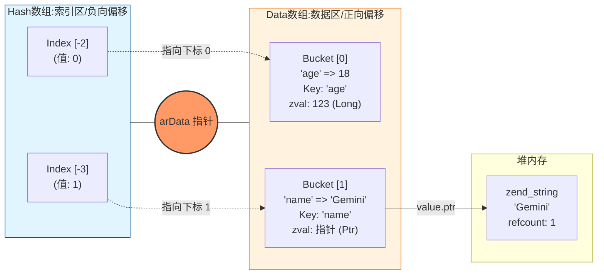

---
{"dg-publish":true,"permalink":"/Learn/Hash算法与数据库实现/","title":"Hash算法与数据库实现","tags":["flashcards"],"noteIcon":"","created":"2026-03-10T22:34:02.000+08:00","updated":"2026-03-11T15:18:15.843+08:00"}
---

# Hash函数
### Hash 函数的作用
* **功能**：将**任意长度的输入** 通过 Hash 算法转换成==1;;固定长度的输出==（即 Hash 值）。
* **特性**：这是一种==1;;压缩映射==。Hash 值的空间远小于输入的空间，因此不同的输入**可能散列成相同的输出**，这种现象称之为==1;;冲突==，且**不能**从 Hash 值唯一确定输入值。
<!--SR:!2026-03-13,7,250-->
<?e?>
### Hash 函数的要求 (理想情况)
一个好的 Hash 函数应该满足：
<?l?>
* **均匀分布**：每个关键字都能均匀地分布到 Hash 表的任意位置。
* **无冲突**：与 Hash 表中已有的关键字**不发生冲突**。
<!--SR:!2026-03-18,12,270-->
<?e?>
> **注意**：实现一个完全无冲突的 Hash 函数是极具挑战性的。
# 取模算法（Modulo Operation）
### 1. 定义与公式
取模运算返回两数相除后的**余数**。
- **数学表示**：<?:?>$a \bmod n = r$
<!--SR:!2026-03-15,7,250-->
- **通用公式**：<?:?>$r = a - (n \times \lfloor a / n \rfloor)$ 其中 $\lfloor x \rfloor$ 是向下取整函数。
<!--SR:!2026-03-14,8,250-->
- **位运算替代**：<?:?>当除数 $n$ 是 $2$ 的幂次（如 $2, 4, 8, 16...$）时：优化公式：`a % n == a & (n - 1)`，原因：按位与（AND）比除法指令快得多。
<!--SR:!2026-03-13,7,250-->
<?e?>
### 2. 负数取模的差异
| **类型**               | **代表语言**     | **结果符号**      | **公式**                                             | **示例 (−7mod3)**                  |
| -------------------- | ------------ | ------------- | -------------------------------------------------- | -------------------------------- |
| **截断取整** (Truncated) | C, Java, JS  | 与==1;;被除数==一致 | 使用 ==1;;`(int)(a/n)`== 这种==1;;向零取整==的方式。           | $-1$                             |
| **地板取整** (Floored)   | Python, Ruby | 与==1;;除数==一致  | 使用 ==1;;$\lfloor a / n \rfloor$==这种==1;;向下取整==的方式。 | $2$（因为 $-7 = 3 \times (-3) + 2$） |
为什么 Python 中 $-7 \bmod 3 = 2$？<?:?> 因为 Python 向下取整，$-7 / 3 \approx -2.33 \rightarrow -3$。公式计算：$-7 - (3 \times -3) = 2$。
<!--SR:!2026-03-21,10,273-->
<?e?>
### 3. 核心算法性质
在处理大数运算（如加密算法）时，以下性质至关重要：
- **加法**：$(a + b) \bmod n = ((a \bmod n) + (b \bmod n)) \bmod n$
- **乘法**：$(a \times b) \bmod n = ((a \bmod n) \times (b \bmod n)) \bmod n$
- **幂运算**：$a^b \bmod n = (a \bmod n)^b \bmod n$
### 4. 典型应用场景
- **循环/环形结构**：<?:?>当一个数字不断增长，但你希望它在一个范围内循环（比如 $0$ 到 $11$ 代表月份），可以使用 `index = count % 12`。
<!--SR:!2026-03-17,11,270-->
- **奇偶判断**：<?:?>`n % 2 == 0` 为偶数，`n % 2 != 0` 为奇数。
<!--SR:!2026-03-17,11,270-->
- **哈希散列**：<?:?>在哈希表中，通过 `hash(key) % table_size` 将任意大的键值映射到有限的数组索引中。
<!--SR:!2026-03-14,8,250-->
- **单位换算**： <?:?>例如将秒数转换为分秒：`minutes = total_seconds / 60`，`seconds = total_seconds % 60`。
<!--SR:!2026-03-15,9,250-->
# Hash算法
## 概念
Hash 算法（散列函数）将关键字 $k$ 映射到 Hash 表中的一个存储地址 $h(k)$。关键字 $k$ 可以是==1;;整数==或==1;;字符串==。
<!--SR:!2026-03-19,12,270-->
<?e?>
### Hash 冲突 (Collision)
不同的关键字 $k_1 \ne k_2$ 经过 Hash 算法计算后得到相同的地址 ==1;;$h(k_1) = h(k_2)$==。
### Hash 表的装填因子 ($\alpha$)
衡量 Hash 表被==1;;填满程度==的指标。$\alpha$ 越大，Hash 冲突的概率越==1;;高==，查找效率越==1;;低==，公式：==1;;$\alpha = \frac{\text{表中已存关键字个数 } n}{\text{Hash 表的长度 } m}$==
- **理想状态：** 每个键都映射到不同的索引，没有冲突，此时查找时间复杂度是 ==1;;$O(1)$==。
- **现实状态：** 随着装填因子 $\alpha$ 的增加（即存储的数据越来越多），多个键映射到同一个索引的概率（**哈希冲突**）呈==1;;指数==级上升。
<!--SR:!2026-03-18,9,252-->
<?e?>
## 整数关键字的 Hash 算法
### 直接取余法 (Division Method)
- **原理:** 直接用关键字 $k$ 除以 Hash 表的大小 $m$ 取余数。
- **公式:** $h(k) = k \mod m$
- **示例:** 如果 Hash 表大小 $m = 12$，关键字 $k = 100$，则 $h(k) = 100 \mod 12 = 4$。
- **优点:** 算法简单，只需要一个求余操作，速度快。
- **缺点:** 对 $m$ 的选择很敏感。通常建议 $m$ 选择一个==1;;素数（质数）==，且不能接近 ==1;;$2^p$ 或 $10^p$（因为 $k \mod 2^p$ 仅依赖于 $k$ 的低 $p$ 位）==。
> [!QUESTION]- $m$ 接近 $10^p$ 的情况
> 如果关键字 $k$ 是以十进制表示的，**且 $k$ 的变化主要集中在较高的数位上**（例如，员工 ID $10001, 10002, 20001, 20002$），
> 而 Hash 表大小 $m$ 是 $10^p$（例如 $m=1000=10^3$，此时 $p=3$），计算 $k \mod 1000$ 得到的结果就是 $k$ 的**后三位数**。这种情况下，
> 不同的高位（如 $1111$ 和 $10111$）会被映射到相同的结果（$111$），同样会 **导致 Hash 冲突**。
- **总结：** $p$ 在这里代表的是幂指数，用来强调 Hash 表大小 $m$ 不应是某些数的整数幂次，以避免 Hash 地址仅仅依赖于关键字 $k$ 的低位，从而降低冲突率。因此，**直接取余法推荐使用一个素数作为 $m$**。
<!--SR:!2026-03-15,8,250-->
<?e?>
#### 速度对比和原理
##### 1. 模运算 (`%`)
* **表达式:** ==1;;$hash\_value \% HASH\_TABLE\_SIZE$==
* **速度:** 相对较==1;;慢==。
* **原理:** 模运算（取余）在底层 CPU 中通常需要执行一个==1;;整数除法==指令是CPU上最==1;;慢（通常比加法、乘法、位移慢几个数量级）==的基本算术操作之一。它适用于任何正整数的 `HASH_TABLE_SIZE`。
##### 2. 位与运算 (`&`)
* **表达式:** ==1;;$hash\_value \ \& \ (HASH\_TABLE\_SIZE-1)$==
* **前提条件:** `HASH_TABLE_SIZE` **必须**是 ==1;;$2^N$ (如 $1024, 2048, 4096$)==。
* **速度:** 极==1;;快==。
* **原理:** 位与操作是 CPU 上最==1;;快==的位操作指令之一。
    * 当 $M$ 是 $2^N$ 时，`M - 1` 的二进制表示是 $N$ 个连续的 `1` (例如 $1024 - 1 = 1023$，二进制是 $1111111111_2$)。
    * 对一个数 $X$ 进行 $X \ \& \ (2^N - 1)$ 操作，实际上就是保留 $X$ 的==1;;**最低 $N$ 位，并将所有更高的位清零**==。
    * 数学上，保留最==1;;低 $N$== 位，与对 $2^N$ 取模的效果是完全==1;;相同==的。因此，它用一个极其快速的位操作完成了原本复杂的整数除法，实现了性能上的巨大提升。
##### 结论
| 表达式                        | 适用条件           | 速度       | 底层操作        |
| :------------------------- | :------------- | :------- | :---------- |
| **$hash\_value \% M$**     | 适用于任何 $M > 0$  | ==1;;慢== | 整数除法 (代价高)  |
| **$hash\_value \& (M-1)$** | 仅适用于 $M = 2^N$ | ==1;;快== | 位与操作 (代价极低) |
<!--SR:!2026-03-15,8,250-->
<?e?>
### 乘积取整法 (Multiplication Method)
* **原理:** 将关键字 $k$ 乘以一个==1;;常数 $A$（$0 < A < 1$）==，提取乘积 $kA$ 的==1;;小数==部分，再乘以 ==1;;Hash 表的大小 $m$== 并向==1;;下==取整。
* **公式:** ==1;;$h(k) = \lfloor m (kA \mod 1) \rfloor$== 其中，$kA \mod 1$ 表示 $kA$ 的==1;;小数==部分。
- **优点:**
	- 对 $m$ 的选择不那么敏感，$m$ 可以是==1;;任意值==（通常取 $2^p$ 便于计算机进行位运算计算）。
	- Hash 结果与关键字 $k$ 的所有位都有关系。
- **缺点:**
	- **需要浮点数运算**：在计算 $k \cdot A$ 时涉及浮点数乘法，这在早期的硬件上或某些嵌入式系统中可能比整数运算（如直接取余法）==1;;慢==。
	- **常数 $A$ 的选取**：算法性能很大程度上依赖于常数 $A$ 的选取。虽然有推荐值（如**黄金分割率倒数**==1;;$A \approx 0.6180339887$==），但选择不当仍可能导致冲突。
	- **精度问题**：浮点数的精度限制（特别是在使用单精度浮点数时）可能导致散列值的微小偏差，影响散列的均匀性。
#### 代码实例
```c
#include <stdio.h>
#include <math.h>

// 推荐常数 A：黄金分割率的倒数
#define A_CONSTANT 0.6180339887

/**
 * 乘积取整法 Hash 函数
 * @param key 关键字 (整数)
 * @param m Hash 表的大小
 * @return int Hash 表的地址 (0 到 m-1)
 */
int multiplicationHash(int key, int m)
{
    // 提取小数部分 (kA mod 1)：fmod(kA, 1.0) 计算 kA 除以 1.0 的余数，即小数部分。「或者使用 kA - floor(kA);」
    return (int)floor(m * fmod((double)key * A_CONSTANT, 1.0));
}

int main()
{
    // 假设 Hash 表大小为 m=1000
    int m = 1000;
    // 示例关键字
    int keys[] = {12345, 98765, 42};
    /* 解释：
     * sizeof(keys) 返回整个数组占用的字节数：数组包含 3 个元素，每个元素类型为 int（在常见平台上为 4 字节），因此整个数组大小为 3 * 4 = 12 字节。
     * sizeof(keys[0]) 返回数组第一个元素的字节数，即 sizeof(int)，通常为 4。
     * 注意：当数组传入函数时会退化为指针（array-to-pointer decay），在函数内部对参数使用 sizeof 会得到指针大小（例如 8），而不是数组总大小。
     */
    int num_keys = sizeof(keys) / sizeof(keys[0]);
    printf("--- 乘积取整法 Hash 示例 (m=%d) ---\n", m);
    for (int i = 0; i < num_keys; i++)
    {
        int hash_address = multiplicationHash(keys[i], m);
        printf("Key: %d -> Hash Address: %d\n", keys[i], hash_address);
    }
    return 0;
}
```
示例输出 (可能的运行结果):
```
--- 乘积取整法 Hash 示例 (m=1000) ---
Key: 12345 -> Hash Address: 629
Key: 98765 -> Hash Address: 126
Key: 42 -> Hash Address: 957
```
<!--SR:!2026-03-14,7,250-->
<?e?>
## 字符串关键字的 Hash 算法
当关键字是字符串的时候，需要先将所有字符的==1;;ASCII码==转成整数，然后再使用整数关键字的Hash算法
### Times33 (T33 / DJB Hash)
#### 核心原理
Times33 算法是一种基于加权==1;;累加==的迭代算法。它将字符串 $S = s_0s_1s_2...s_{n-1}$ 视为一个以==1;;33==为基数的数字，其中每个字符的 ASCII 值 $s_i$ 是该数字的一位。
* **迭代公式（核心）：**==1;;$H_{i} = H_{i-1} \times 33 + \text{ASCII}(s_i)$==
* **初始值：** $H_0$ 通常设置为 ==1;;5381==（一个奇素数）因为它能提供更==1;;均匀==的分布。
* **乘 33 的高效实现：** 在二进制中，乘以 33 可以通过==1;;位==运算高效实现：$H_{i-1} \times 33$ = $H_{i-1} \times (32 + 1)$ = ==1;;$(H_{i-1} \ll 5) + H_{i-1}$==
* **优点:** 运算简单，速度快，在实际应用中（如 SDBM、Apache、PHP）表现出良好的散列特性。
#### 使用场景
| **需求维度**       | **适用程度** | **核心原因（为什么使用）**                                                       | **潜在风险（为什么不适用）**                                                      |
| -------------- | -------- | --------------------------------------------------------------------- | --------------------------------------------------------------------- |
| **追求计算速度**     | **极度适用** | **指令级优化**：仅需位移（`<< 5`）和加法，不依赖昂贵的硬件乘法器，CPU 周期消耗极低。                     | **过于简单**：在现代高性能 CPU 上，虽然快，但相比 MurmurHash3 等算法，它缺乏复杂的位混淆步骤。            |
| **短字符串随机化**    | **非常适用** | **ASCII 亲和力**：初始值 ==1;;`5381`== 配合乘数 `33` 能迅速扩散短字符（如变量名、URL）的差异，分布均匀。 | **规律性数据**：如果输入是具有极强数学规律的序列（如纯数字递增），可能会出现局部聚簇。                         |
| **处理超长文本**     | **不推荐**  | **无**                                                                 | **高位溢出丢失**：长文本前面的字符信息会因多次位移从寄存器左侧溢出，导致哈希值只取决于末尾文本，碰撞率激增。              |
| **抗碰撞攻击 (安全)** | **禁止使用** | **无**                                                                 | **确定性危机**：算法固定且线性，攻击者可轻易构造大量哈希值相同的字符串，触发“哈希洪水攻击”使服务瘫痪。                |
| **分布式负载均衡**    | **基本适用** | **计算一致性**：算法实现简单，各语言版本一致，能确保同一个 Key 始终映射到同一个节点。                       | **节点倾斜**：若 Key 的特征分布不均，简单的 Times33 可能导致某些节点压力过大，不如一致性哈希配合 MurmurHash。 |
```c
/**
 * DJBHash - 字符串 Hash 算法 (Times33)
 * @param str 要计算 Hash 值的字符串
 * @return unsigned int 计算得到的 Hash 值
 */
unsigned int DJBHash(char *str)
{
    // 初始种子值，常用奇素数 5381。
    unsigned int hash = 5381;
    // 循环遍历字符串，直到字符串结束符 '\0'。
    while (*str)
    {
        // 核心计算: hash = hash * 33 + 字符ASCII码
        // hash << 5 即 hash * 32。利用位运算实现高效乘 33。
        // *str++ 获取当前字符并使指针前进。
        hash += (hash << 5) + (*str++);
    }
    // 返回非负值：清除最高位，确保结果为正数。
    return (hash & 0x7FFFFFFF);
}

int main()
{
    char *test_str = "Hello, World!";
    unsigned int hash_value = DJBHash(test_str);
    printf("DJBHash of \"%s\" is: %u\n", test_str, hash_value); // DJBHash of "Hello, World!" is: 383943310
    return 0;
}
```
<!--SR:!2026-03-16,9,250-->
<?e?>
#### 初始值 0 vs 5381
这是一个关于哈希算法初始化值（Seed）的经典问题，特别是针对 **Times33（或称为 DJB2 算法）**。
在 Times33 算法中，初始值（种子，Seed）的选择对最终的哈希分布影响很大。对于 `0` 和 `5381` 这两个值，**`5381` 被认为是更好的选择。**
以下是对比和原因的详细解释：
##### 1. 初始值 $\text{hash} = 0$
如果将初始哈希值设置为 $0$，则：
* **第一次迭代**：$\text{hash} = 0 \times 33 + \text{char}_1 = \text{char}_1$。
这导致生成的哈希值**严重依赖第一个字符**的 ASCII 值。如果输入字符串的第一个字符相同，那么在第一次迭代之后它们的哈希值就是相同的，这会增加在哈希表中的碰撞概率，尤其是在键值相似的情况下。
##### 2. 初始值 $\text{hash} = 5381$ (推荐)
$5381$ 是一个经验上被证明效果非常好的初始值（或称为魔法数字）。它在 DJB2 算法中被广泛采用。
* **原因 1：引入随机性**：$5381$ 是一个较大的素数，它为哈希计算提供了一个**高位非零的初始状态**，立即打破了哈希值对第一个字符的简单依赖。
* **原因 2：利用乘法特性**：
$$\text{hash} = \text{hash} \times 33 + \text{char}$$
当 $\text{hash}$ 已经是一个大数值（如 $5381$）时，乘法操作会更有效地将输入字符的位分布散布到哈希值的各个位上，从而获得更均匀的分布。
##### 💡举例说明
##### 总结对比
| 特性        | 初始值 $\text{hash} = 0$ | 初始值 $\text{hash} = 5381$              |
| :-------- | :-------------------- | :------------------------------------ |
| **第一次迭代** | 哈希值等于第一个字符的 ASCII 值   | 哈希值是 $5381 \times 33 + \text{char}_1$ |
| **碰撞风险**  | 高，尤其对于第一个字符相同的键       | 低，分布更均匀                               |
| **分布均匀性** | 较差                    | **更好（推荐）**                            |
| **实际应用**  | 不常用，仅用于简单示例           | 广泛用于 DJB2 和 Times33 算法                |
> **结论：** 在实际应用中，如果使用 Times33 或 DJB2 哈希算法，**初始值 $5381$ 明显优于 $0$**，因为它能带来更优异的哈希分布性能。
#### 计算步骤示例
假设我们要计算字符串 **`"cat"`** 的 Hash 值。Hash 表大小 $m$ 假设为 $1000$。
我们从左到右处理字符，并设置初始 Hash 值 $H_{\text{init}} = 5381$。

| 步骤 ($i$) | 字符 ($s_i$) | ASCII 值 ($\text{ASCII}(s_i)$) | **计算 ($H_{i-1} \times 33 + \text{ASCII}(s_i)$)** | Hash 值 ($H_i$) |
| :---: | :---: | :---: | :--- | :---: |
| **0 (Init)** | - | - | 初始值 | 5381 |
| **1 ('c')** | 'c' | 99 | $5381 \times 33 + 99$ | **177672** |
| **2 ('a')** | 'a' | 97 | $177672 \times 33 + 97$ | **5863263** |
| **3 ('t')** | 't' | 116 | $5863263 \times 33 + 116$ | **193487775** |
最终得到的整数 Hash Code 是 $193,487,775$。
#### 映射到 Hash 表地址
为了得到 Hash 表地址 $h(k)$，我们使用**直接取余法**：$h(k) = H_n \mod m$
继续以上示例，如果 Hash 表大小 $m = 1000$：$h(\text{"cat"}) = 193487775 \mod 1000 = 775$
Hash 地址为 **775**。
#### `($m & ($m - 1)) === 0` 是一个经典的位运算技巧
| **m (十进制)** | **m (二进制)** | **m−1 (二进制)** | **m&(m−1) (二进制)**    |
| ----------- | ----------- | ------------- | -------------------- |
| 1 ($2^0$)   | `0001`      | `0000`        | `0001 & 0000 = 0000` |
| 2 ($2^1$)   | `0010`      | `0001`        | `0010 & 0001 = 0000` |
| 4 ($2^2$)   | `0100`      | `0011`        | `0100 & 0011 = 0000` |
| 8 ($2^3$)   | `1000`      | `0111`        | `1000 & 0111 = 0000` |
#### PHP 伪代码实现
```php
/**
 * Times33 Hash 算法 - 优化后的 PHP 实现 (解决浮点溢出)
 * * @param string $key 要计算 Hash 值的字符串
 * @param int $m Hash 表的长度 (模数)
 * @return int Hash 表的地址 (0 到 $m-1)
 */
function fastTimes33HashOptimized(string $key, int $m): int
{
    // 1. 哈希值计算（循环累积）
    $hash = 5381;
    $i    = 0;
    while (isset($key[$i])) {
        $char_ascii = ord($key[$i++]);
        // 核心迭代: hash = hash * 33 + char_ascii
        // 使用位运算模拟: hash = (hash << 5) + hash + char_ascii
        $hash += ($hash << 5) + $char_ascii;
        // 0xFFFFFFFF 确保了 $hash$ 始终保持在 [0, 2^32 - 1] 范围内，防止溢出到 float。
        $hash = $hash & 0xFFFFFFFF;
    }
    // **注意:** 此时 $hash 已经是正数，且其值在 [0, 4294967295] 之间。
    // 检查 $m$ 是否为 2 的幂次 (标准位操作检查)
    if (($m > 0) && (($m & ($m - 1)) === 0)) {
        // M 是 2 的幂次，使用快速的位与操作
        $address = $hash & ($m - 1);
    } else {
        // M 不是 2 的幂次，使用标准的取模。
        // 因为 $hash$ 已经被约束为正数，所以直接取模即可。
        $address = $hash % $m;
    }
    return $address;
}
// 示例调用
$key2 = "hello world";
$m2   = 1024;
$m3   = 1009; // 素数
echo "使用位与 (M=$m2): " . fastTimes33HashOptimized($key2, $m2) . "\n";
echo "使用取模 (M=$m3): " . fastTimes33HashOptimized($key2, $m3) . "\n";
/*
使用位与 (M=1024): 193
使用取模 (M=1009): 100
*/
```
# Hash表
## Hash表结构
### 基本概念与结构
**时间复杂度**：Hash 表的时间复杂度为 $O(1)$。
**散列函数作用**：将关键字 Key 映射到数组的某个位置。
**Hash 表结构**：Hash 表结构可以用图13-1展示。它由两个主要部分构成：
- 存放数据的==1;;数组==（即散列表）
- 将关键字 Key 映射到数组位置的==1;;散列函数 (Hash Function)==。

### Hash 表实现步骤
要实现一个 Hash 表，需要遵循以下三个主要步骤：
1.  **创建数组：** 创建一个固定大小的数组用于存放数据。
2.  **设计函数：** 设计 Hash 函数（散列函数）。
3.  **数据存取：** 通过 Hash 函数把关键字映射到数组的某个位置，并在此位置上进行数据存取。
## 使用PHP实现Hash表
首先创建一个 `HashTable` 类，包含 `$buckets`（存储数据的数组）和 `$size`（数组大小）两个属性。在构造函数中，为 `$buckets` 分配内存。
* **`$buckets`**: 用于存储数据的数组。
* **`$size`**: 用于记录 `$buckets` 数组的大小，这里初始化为 10。
* **数组选择**: 使用 SPL 扩展的 `SplFixedArray` 数组。这更接近 C 语言的数组，效率更高。创建时需要提供一个初始化的大小。
>*注意*: `SplFixedArray` 需安装并开启 SPL 扩展（PHP 5.3+ 默认开启）。
### 代码实例
```php
class HashTable
{
    private SplFixedArray $buckets;
    private int           $size = 10;

    public function __construct()
    {
        // 为 $buckets 数组分配一个大小为 10 的内存
        $this->buckets = new SplFixedArray($this->size);
    }

    private function hashFunc($key): int
    {
        $strlen  = strlen($key);
        $hashVal = 0;
        // 累加所有字符的 ASCII 码
        for ($i = 0; $i < $strlen; $i++) {
            $hashVal += ord($key[$i]);
        }
        // 对 Hash 表大小取余，得到数组索引
        return $hashVal % $this->size;
    }

    public function insert($key, $val): void
    {
        // 1. 计算 Hash 索引
        $index = $this->hashFunc($key);
        // 2. 将值保存到对应的桶中
        $this->buckets[$index] = $val;
    }

    public function find($key)
    {
        // 1. 计算 Hash 索引
        $index = $this->hashFunc($key);
        // 2. 返回对应桶中的数据
        return $this->buckets[$index];
    }
}
```
### 测试代码
```php
$ht = new HashTable();
// 插入 key1 => value1
$ht->insert('key1', 'value1');
// 插入 key2 => value2
$ht->insert('key2', 'value2');
// 查找 key1 对应的数据
echo $ht->find('key1');
// 查找 key2 对应的数据
echo $ht->find('key2');
```
#### 输出结果
```
value1
value2
```
## Hash 冲突
```php
$ht = new HashTable();
// 插入 key1 => value1
$ht->insert('key1', 'value1');
// 插入 key2 => value2
$ht->insert('key12', 'value2');
// 查找 key1 对应的数据
echo $ht->find('key1');
// 查找 key2 对应的数据
echo $ht->find('key12');
```
#### 输出结果
```
value2
value2
```
好的，我将根据您提供的关于“拉链法解决冲突”的描述和图片中的代码，整理出一份完整的技术笔记。
## 拉链法解决冲突 (Separate Chaining)
### 拉链法原理与结构
  * **原理**: 拉链法是解决 Hash 冲突的一种常用方法。它的做法是：将所有具有**相同 Hash 值**的关键字节点链接在**同一个链表**中。
  * **结构**: 散列表的每个位置（桶/Bucket）不再直接存储数据，而是存储一个链表的**头指针**。
      * 在查找元素时，必须遍历这条链表。
      * 通过比较链表中每个元素的关键字与查找的关键字是否相等，来确定是否找到目标元素.
### 代码实例
通过插入 `key1` 和 `key12`（假设它们发生冲突，映射到同一个地址）并查找，可以验证拉链法是否成功解决了冲突问题.
#### 代码清单 (测试代码)
```php
/**
 * 由于节点需要保存关键字（Key）和数据（Value），同时还要记录具有相同 Hash 值的下一个节点，因此需要创建一个 `HashNode` 类。
 */
class HashNode
{
    public $key; // 节点的关键字。
    public $value; // 节点的值。
    public $nextNode; // 指向具有相同 Hash 值链表中下一个节点的指针。

    public function __construct($key, $value, $nextNode = null)
    {
        $this->key      = $key;
        $this->value    = $value;
        $this->nextNode = $nextNode;
    }
}

class HashTable
{
    private SplFixedArray $buckets;
    private int           $size = 10;

    public function __construct()
    {
        // 为 $buckets 数组分配一个大小为 10 的内存
        $this->buckets = new SplFixedArray($this->size);
    }

    // 为了简化，这里使用一种基本的 Hash 算法：将字符串的所有字符 ASCII 码相加，再对 `$this->size` 取余（直接取余法）。
    private function hashFunc($key): int
    {
        $strlen  = strlen($key);
        $hashVal = 0;
        // 累加所有字符的 ASCII 码
        for ($i = 0; $i < $strlen; $i++) {
            $hashVal += ord($key[$i]);
        }
        // 对 Hash 表大小取余，得到数组索引
        return $hashVal % $this->size;
    }

    /**
     * 插入数据时，新节点总是插入到链表的"头部"，以保持 O(1) 的插入时间。
     * 插入算法流程
     *   1.使用 Hash 函数计算关键字的 Hash 值，通过 Hash 值定位到 Hash 表的指定位置。
     *   2.如果此位置已经被其他节点占用，将新节点的 `$nextNode` 指向此节点（即旧的头节点）。
     *   3.否则，将新节点的 `$nextNode` 设置为 `NULL`。
     *   4.将新节点保存到 Hash 表的当前位置，使其成为新的链表头。
     *   经过这 4 个步骤，相同 Hash 值的节点会被连接在同一个链表.
     */
    public function insert($key, $value)
    {
        $index = $this->hashfunc($key);
        /* 新创建一个节点 */
        if (isset($this->buckets[$index])) {
            // 如果桶中已有节点，将新节点插到链表头部
            $newNode = new HashNode($key, $value, $this->buckets[$index]);
        } else {
            // 如果桶中没有节点，新节点是链表尾部（下一个节点为NULL）
            $newNode = new HashNode($key, $value, null);
        }
        $this->buckets[$index] = $newNode; /* 保存新节点，使其成为新的链表头 */
    }

    /**
     * 查找算法流程
     *   1.使用 Hash 函数计算关键字的 Hash 值，通过 Hash 值定位到 Hash 表的指定位置。
     *   2.获取该位置的链表头节点 `$current`.
     *   3.遍历当前链表，比较链表中每个节点的关键字 `$current->key` 与查找关键字 `$key` 是否相等。
     *   4.如果相等，返回该节点的值 (`$current->value`)，查找成功。
     *   5.如果整个链表遍历完毕都没有找到，返回 `NULL`，查找失败.
     */
    public function find($key)
    {
        $index   = $this->hashfunc($key);
        $current = $this->buckets[$index];
        while (isset($current)) { /* 遍历当前链表 */
            if ($current->key == $key) { /* 比较当前节点的关键字 */
                return $current->value; /* 查找成功 */
            }
            $current = $current->nextNode; /* 比较下一个节点 */
        }
        return null; /* 查找失败 */
    }
}

$ht = new HashTable();
// 插入 key1 => value1
$ht->insert('key1', 'value1');
// 插入 key2 => value2
$ht->insert('key12', 'value2');
// 查找 key1 对应的数据
echo $ht->find('key1');
// 查找 key2 对应的数据
echo $ht->find('key12');
```
#### 输出结果
运行测试代码后，输出结果为:
```
value1
value12
```
<?e?>
# Hash方案对比(PHP/Java/Go)
| **特性**       | **PHP 8.5.3 (Zend HashTable)**                                                                        | **Java (HashMap)**                                                  | **Go (map)**                                                           |
| ------------ | ----------------------------------------------------------------------------------------------------- | ------------------------------------------------------------------- | ---------------------------------------------------------------------- |
| **底层结构**     | ==1;;Index数组== + ==1;;Data 连续数组<br>通过 `arData` 正负偏移访问==                                               | ==1;;数组== + ==1;;单向链表 -> 红黑树==                                      | ==1;;数组== + ==1;;桶（Bucket）<br>每个桶存 8 个键值对==                            |
| **顺序保证**     | ==1;;物理顺序维护<br>按 Data 数组下标顺序遍历==                                                                      | ==1;;无序==                                                           | ==1;;无序<br>迭代起始点随机==                                                   |
| **冲突解决方法**   | ==1;;逻辑==拉链法 (Chaining)<br>利用 ==1;;`zval.u2.next`== 存储下标                                              | 拉链法(Chaining)<br>链表长度 $\ge$ ==1;;8== 且数组 $\ge$ ==1;;64== 转红黑树<br>   | ==1;;**拉链法** (Chaining)== + ==1;;溢出桶 (Overflow Bucket)==               |
| **初始容量**     | ==1;;8==                                                                                              | ==1;;16==                                                           | ==1;;8（1个桶）==                                                          |
| **触发扩容阈值**   | ==1;;1.0 (即 $n = m$)==                                                                                | ==1;;0.75==                                                         | ==1;;6.5 (基于桶填充程度计算)==                                                 |
| **扩容阈值触发条件** | 当 $n/m$ > ==1;;1==                                                                                    | 当已存元素数 $n/m$ > ==1;;0.75==                                          | 当 $n/m$ > ==1;;6.5== 或溢出桶过多                                            |
| **扩容倍数**     | ==1;;2 倍 (且必须是 2 的幂次)==                                                                               | ==1;;2 倍==                                                          | ==1;;2 倍（翻倍扩容）或 1 倍（等量重排）==                                            |
| **扩容方式**     | ==1;;物理全量拷贝（memcpy）== + ==1;;延迟映射/紧缩重排（arHash）==                                                      | ==1;;全量 Rehash==                                                    | ==1;;双表渐进式 Rehash==                                                    |
| **扩容过程**     | ==1;;全量==搬迁：利用 memcpy 快速搬迁 Bucket 数组。<br><br>索引==1;;延迟==重建：扩容瞬间清空索引表，在随后的存取中逐步重建映射或在必要时触发紧缩（Rebuild）。 | ==1;;全量==搬迁：在单次 put 触发阈值时，立即创建新数组并重新计算所有元素的 Hash 位置并分配，可能造成明显的响应抖动。 | ==1;;逐步==搬迁：扩容期间新旧表共存。每次进行写入或删除操作时，顺带触发 1-2 个桶（Bucket）的迁移，将压力平摊到多次操作中。 |
| **性能表现**     | 极高的物理搬迁速度，由于索引重建的延迟性，用户侧感知的卡顿极小。                                                                      | 海量数据下扩容会有明显的毫秒级==1;;“毛刺”==感。                                        | 响应时间极度平稳，消灭了扩容引起的延迟波峰，但内部逻辑最复杂。                                        |
> [!tip]- 扩容机制
> 1. PHP：极致的内存连续性与“懒加载”索引
> PHP 扩容时，`arData` 指向的 Bucket 数组是**一次性**搬到新内存地址的。
> 	- **为什么不卡？** 因为它是**连续内存**，利用了 OS 层面的 **Sequential Access（顺序访问）** 优化，CPU 使用 `memcpy` 指令拷贝 10MB 数据的速度极快（纳秒级）。
> 	- **延迟映射/紧缩重排（arHash）：** 扩容后，将 `arHash` 全部设为 `-1`（清空） 是一个 $O(1)$ 或极快 $O(n)$ 的清零操作。这意味着 PHP 把原本沉重的 **Rehash（哈希再计算）** 压力，摊销到了扩容后的每一次 `Lookup`（查找）或 `Insert`（插入）中。当你访问某个 Key 时，它发现索引是空的，才会现场计算哈希并填入 `arHash`。
> 	- **对缓存友好**：即便在扩容后，由于数据区依然连续，PHP 遍历数组的性能依然是 $O(n)$ 且 Cache Miss 极低。
> 	- **内存整理：紧缩重排 (Rebuild)** 若数组空洞（**IS_UNDEF**）过多，PHP 会在扩容时顺带触发“**碎片整理**”，使 `arData` 重新紧凑，提高缓存命中率。
> 2. Go：平滑抖动的“影子拷贝”策略
> Go 扩容时，`oldbuckets` 和 `buckets` 是**物理隔离**的两个数组。
> 	- **双表查询：** 在搬迁未完成前，读取操作会变慢，因为查询一个 Key 可能要查两个地方（先检查 `oldbuckets`，如果没找到，再检查 `buckets`）这是一种用**查询性能的微量下降**换取**写入操作稳定性**的权衡。
> 	- **写放大控制**：Go 每次写操作只迁移 1~2 个桶。这种“增量搬迁”保证了单次操作的时间复杂度被严格控制在常数级，非常适合微服务高并发场景，避免了 Java 式的瞬时卡死。
> 	- **分批搬迁：** 只有当旧桶里的 8 个元素全部搬到新桶后，旧桶才会失效。这种机制是为了严格控制单次写操作的最坏延迟。
> 	- **状态标记**：Go 使用 `evacuated` 标记位来追踪哪些桶已经搬迁。这种精细的状态机管理是其逻辑复杂度的来源。
> 3. Java：对象模型约束下的“重计算”负担
> Java 没有 PHP 那种连续内存的偏移红利，也没有 Go 的双表保护。
> 	- **内存离散的死穴**：Java `HashMap` 数组里存的是对象的**引用**。扩容时，虽然 `Node[]` 数组搬迁很快，但要重新**计算**每一个 `Node` 的 **下标`(n - 1) & hash`** 并**更新引用**。由于 `Node` 对象**散落在堆各处**，CPU 无法预取，会导致大量的 **Cache Miss**。
> 	- **红黑树的沉重代价**：如果桶内已经转化成了红黑树，扩容时需要执行 `split` 操作（**拆分树**）。这涉及到大量的对象拆解、重新染色（Red-Black Coloring）和平衡旋转，这些都是昂贵的计算任务。
> 	- **GC 交互**：Java 的全量扩容会产生大量临时引用的变化，这会给垃圾回收器（GC）带来瞬间的压力，尤其是在并发标记阶段。
<!--SR:!2026-03-20,9,253-->
<?e?>
## PHP8：兼顾顺序与速度

### 底层数据结构 (C 语言)
PHP 的哈希表（Zend **HashTable**）在内存中是==1;;连续==的是整个内存块的==1;;持有者==，由 **Index Table** 和 **Bucket 数组** 组成。
* **顺序维护（物理顺序）：** PHP 8 不再使用双向链表指针，默认按照==1;;插入时间==顺序将元素填入 Data 数组的 `0, 1, 2...n` 位置。
	* `foreach` 遍历时，直接从 `arData[0]` 顺序读到 `arData[n]`，因此遍历顺序与插入顺序天然一致。
* **逻辑链表（解决冲突）：** 当两个不同的 Key 映射到同一个 Index 位置时，PHP 会利用 `zval` 内部的 `u2.next` 字段记录前一个冲突元素的下标，形成一个隐藏的==1;;逻辑单向==链表。
#### HashTable、IndenTable、Bucket 数组之间的关系
- **Header（中央控制器）**：即 ==1;;56== 字节的 `HashTable` 结构体，它不存数据，仅通过 `arData` 指针握住内存 Body 的“中心原点”。
- **Index Table（逻辑地图）**：位于 `arData` **左侧**的负偏移区域（如 -32 字节），负责将 Key 的哈希值映射为具体的数组下标。
- **Bucket 数组（物理仓库）**：位于 `arData` **右侧**的正向存储区域（如 +256 字节），按插入顺序存放真实的 Key、Value 及冲突链指针。
#### HashTable「控制器」
```c
typedef struct _zend_array HashTable; // 为结构体 struct _zend_array 取一个别名，叫做 HashTable。

/* 引用计数头：总大小 8 字节，用于实现 COW（写时复制）和垃圾回收 */
typedef struct _zend_refcounted_h {
    uint32_t         refcount;          /* 4 字节 | 引用计数数值 */
    union {
        uint32_t     type_info;         /* 4 字节 | 类型信息标志 */
    } u;
} zend_refcounted_h;

// HashTable 结构：总大小 56 字节 (64-bit 系统)
struct _zend_array {
    zend_refcounted_h gc;               /* 8 字节 | 偏移 0  | 垃圾回收与引用计数头 */
    union {
        struct {
            /* 合计 4 字节，用于适配大小端，确保字节布局一致 */
            ZEND_ENDIAN_LOHI_4(
                uint8_t    flags,        /* 1 字节 | 数组标志：如 HASH_FLAG_INITIALIZED */
                uint8_t    _unused,      /* 1 字节 */
                uint8_t    nIteratorsCount, /* 1 字节 | 当前数组正在被多少个迭代器使用 */
                uint8_t    _unused2)     /* 1 字节 */
        } v;
        uint32_t flags;                 /* 4 字节 | 偏移 8  | 标志位的统一读写视图 */
    } u;
    uint32_t          nTableMask;       /* 4 字节 | 偏移 12 | 掩码：用于将 Hash 值映射到索引区。通常为 -nTableSize */
    union {
        uint32_t     *arHash;           /* 8 字节 | 偏移 16 | 💡指向索引映射区（Index Table）。注意：物理地址在 arData 之前 */
        Bucket       *arData;           /* 8 字节 | 偏移 16 | 💡指向数据存储区（Bucket 数组）。这是哈希表的基准指针 */
        zval         *arPacked;         /* 8 字节 | 偏移 16 | 💡指向连续数字索引数组的视图（Packed Array） */
    };
    uint32_t          nNumUsed;         /* 4 字节 | 偏移 24 | Data 数组中已使用的槽位数（含已经删除「IS_UNDEF」的空洞） */
    uint32_t          nNumOfElements;   /* 4 字节 | 偏移 28 | 实际存储的有效元素个数 */
    uint32_t          nTableSize;       /* 4 字节 | 偏移 32 | 数组的总容量（始终为 2 的幂） */
    uint32_t          nInternalPointer; /* 4 字节 | 偏移 36 | 内部遍历指针（用于 current(), next() 等） */
    zend_long         nNextFreeElement; /* 8 字节 | 偏移 40 | 下一个可用的数字下标（用于 $arr[] = ...） */
    dtor_func_t       pDestructor;      /* 8 字节 | 偏移 48 | 元素销毁时的析构函数指针 */
};
```
##### 为什么 `arHash` 必须是 8 字节？
| **成员**       | **类型**       | **变量自身大小**          | **它的作用**           | **指向的内容大小**              |
| ------------ | ------------ | ------------------- | ------------------ | ------------------------ |
| **`arHash`** | `uint32_t *` | ==1;;8== 字节 (64位系统) | 存储索引映射区的==1;;末==地址 | ==1;;4== 字节 (`uint32_t`) |
| **`arData`** | `Bucket *`   | ==1;;8== 字节 (64位系统) | 存储数据存储区的==1;;首==地址 | ==1;;32== 字节 (`Bucket`)  |
**指针的容器本质**：
- 在 ==1;;64== 位系统下，无论是 C 还是 Go，所有的==1;;指针（无论是指向 `uint32`、`uint64` 还是一个巨大的 `struct`）==变量本身就是一个存储==1;;地址==的容器，在物理上统一是 ==1;;64== 位（==1;;8== 字节）。
##### `union` 的设计
1. **语法本质**：内存复用，内存大小取决于最==1;;大==的元素
	- **物理同体：**`union` 强制让 `arHash`、`arData` 和 `arPacked` ==1;;共享==同一个==1;;8==字节的==1;;起始==内存地址（当你给其中一个赋值（地址原点）时，另外两个自动获得了==1;;相同==的地址数值。），在 64 位系统下，这个 `union` 只占用 ==1;;8== 个字节，而不是 ==1;;24== 个字节。
	- **无需赋值：** 不存在 `ht->arHash = ht->arData` 这样的显式操作。PHP 只需要通过 `malloc` 计算好偏移量，将 Body 的“中轴线地址”存入这个 `union` 空间，三者便同时“激活”。
2. **逻辑分身**：多态视图
	虽然物理地址相同，但编译器根据指针类型赋予了它们不同的“观察视角”：
	- **`arData` 视角**：将内存看作 ==1;;`Bucket`结构体== 数组，用于处理带==1;;字符串==键名的==1;;关联==数组。用 `Bucket*` 步长（32B）访问正向数据区。
	- **`arPacked` 视角**：将内存看作==1;;连续==的 `zval`数组，用于处理==1;;纯数字==索引的==1;;紧凑==数组，跳过哈希计算以提升性能。
	- **`arHash` 视角**：专门用于定位==1;;索引映射区==（Hash 查找的入口）。用 `uint32_t*` 步长（4B）访问负偏移索引区。
3. **逻辑本质：** PHP 并不是在三者间做选择题，而是把它们当作 **同一原点上的三把不同尺寸的刻度尺**。通过这种设计，PHP 在 56 字节的 Header 内，仅靠一个指针地址就远程遥控了整块复杂的 Body 内存。
##### 特殊模式：Packed Array（arPacked）
`arPacked` 被激活时：
- 索引是连续的整数（0, 1, 2...）。
- 此时 `nTableMask` 会被设置为特殊值，==1;;`arHash`（索引区）==不再被分配内存。
- PHP 直接使用 `arPacked` 指针。由于 `zval` 只有 16 字节，比起 32 字节的 `Bucket` 节省了一半空间，且由于没有 `arHash` 的查找过程，速度接近原生的 C 数组。
<!--SR:!2026-03-10,3,253-->
<?e?>
#### Hash 数组 (Index Table)「数据区」
`*arData` 之前的==1;;负==向偏移 ==1;;整型==数组，存放 ==1;;8== 个 ==1;;`int32_t`==(占用 ==1;;$8 \times 4 = 32$== 字节)。通过`uint32_t *arHash`指针来操作数组。
- **位置：** 位于 `*arData` 指针==1;;左（负偏移）==侧。
- **作用：** 解决哈希映射。它存储的是 ==1;;`int32_t`== 类型的 Data 数组==1;;下标==。
```c
uint32_t     *arHash;
```
<!--SR:!2026-03-10,3,253-->
<?e?>
#### Data 数组(Bucket 数组)「数据区」
`*arData` 之后的==1;;正向偏移结构体==数组，存放 ==1;;8== 个 `Bucket`，占用 ==1;;$8 \times 32 = 256$== 字节。
- PHP 8 的==1;;每个==数组元素都存放在 `Bucket` 结构体中，在 64 位系统中经过严格的内存对齐，固定占用==1;;32==字节这保证了 `arData + data_index` 的操作只需要一次简单的 ==1;;`data_index << 5`==（即乘以 32）即可完成寻址。
* **位置：** 位于 `*arData` 指针==1;;右（正偏移）==侧。
* **作用：** 存储真正的 ==1;;Key、Value==。
```c
// 数据桶结构 (32 字节)
typedef struct _Bucket {
    zval              val; // 16 字节：值（或指向大数据的指针）
    zend_ulong        h;   // 8 字节：原始 Hash 值
    zend_string      *key; // 8 字节：字符串键指针（数字索引则为 NULL）
} Bucket;
```
##### `_zval_struct`：变量容器 (16 字节)
这是包装变量的“盒子”：包含值、类型信息、链表「哈希表查找」。
```c
struct _zval_struct {
    zend_value        value;            /* 存储实际的值 (下述 8 字节 union) */
    union {
        uint32_t type_info;             /* 类型信息总和 (可一次性读写 4 字节) */
        struct {
            ZEND_ENDIAN_LOHI_3(         /* 适配大小端序的宏 */
                uint8_t    type,        /* 变量的当前类型 (如 IS_STRING, IS_LONG) */
                uint8_t    type_flags,  /* 类型标记 (如：是否可引用计数, 是否常驻内存) */
                union {
                    uint16_t  extra;    /* 额外信息，未进一步细化 */
                } u)
        } v;
    } u1;                               /* 辅助信息块 1 (4 字节) */
    union {
        uint32_t     next;                 /* 【💡关键】哈希冲突链：指向冲突链中的下一个元素下标 */
        uint32_t     cache_slot;           /* 缓存槽位 (用于参数初始化) */
        uint32_t     opline_num;           /* opline 编号 (用于快速调用) */
        uint32_t     lineno;               /* 行号 (用于 AST 节点) */
        uint32_t     num_args;             /* 参数数量 (用于 EX(This)) */
        uint32_t     fe_pos;               /* foreach 遍历位置 */
        uint32_t     fe_iter_idx;          /* foreach 迭代器索引 */
        uint32_t     guard;                /* 保护位 (防止循环递归和单一属性冲突) */
        uint32_t     constant_flags;       /* 常量标记 */
        uint32_t     extra;                /* 额外空间 */
    } u2;                               /* 辅助信息块 2 (4 字节) */
};
```
##### `zend_value`：数据的实际载体 (8 字节)
这是一个 `union`，意味着它在内存中只占用 8 字节。根据变量类型的不同，这 8 字节会被解析为不同的含义（直接存==1;;值==或==1;;指针==）。
```c
typedef union _zend_value {
    zend_long         lval;             /* 💡长整型值 (Integer) */
    double            dval;             /* 双精度浮点值 (Float) */
    zend_refcounted  *counted;          /* 💡引用计数头指针 (通用) */
    zend_string      *str;              /* 字符串指针 */
    zend_array       *arr;              /* 数组指针 (HashTable) */
    zend_object      *obj;              /* 对象指针 */
    zend_resource    *res;              /* 资源类型指针 */
    zend_reference   *ref;              /* 引用类型指针 (&$var) */
    zend_ast_ref     *ast;              /* 抽象语法树节点指针 */
    zval             *zv;               /* 指向另一个 zval 的指针 */
    void             *ptr;              /* 通用指针 (底层内部使用) */
    zend_class_entry *ce;               /* 类定义指针 */
    zend_function    *func;             /* 函数定义指针 */
    struct {
        uint32_t w1;                    /* 两个 32 位字，用于直接操作 64 位空间 */
        uint32_t w2;
    } ww;
} zend_value;
```
- **为什么 `u2.next` 非常重要？**
	当你查阅 PHP 8.5.3 的 `HashTable` 冲突处理时，你会发现它使用的是==1;;拉链==法。但为了节省空间，它没有在 `Bucket` 结构体里放 ==1;;`struct Bucket *next` 指针==。
	- **做法：** 它利用了 `zval` 结构体中空闲的 4 字节 `u2.next`。
	- **逻辑：** 所有的冲突链都是通过==1;;数组下标==而非物理地址串联的。这使得 `zval` 在不需要处理冲突时（比如普通的局部变量），这 4 字节可以挪作他用（如 `fe_pos`），极大提高了内存利用率。
- **举例：**
	- **示例 1：标量类型（==1;;直接存储==）**
		- 对于简单的数据类型，`zval` 直接将数据存储在内部的 ==1;;8==字节空间中，无需额外的内存寻址。
		- **PHP 代码**：`$a = 123;`
		- **底层表现**：
		    - **`value.lval`**: 直接存放整数值 `123`。
		    - **`u1.v.type`**: 标记为 `IS_LONG`。
		    - **`u2.next`**: 默认为 `0`（若在哈希表中未冲突）。
		- **特点**：**零内存开销**。除了 `zval` 自身的 16 字节外，不占用任何堆内存，读取速度最快。
	- **示例 2：复杂类型（==1;;指针引用==）**
		- 对于字符串、数组或对象，`zval` 内部的 ==1;;8==字节无法容纳全部数据，因此指向实际的数据结构。
		- **PHP 代码**：`$a = "Gemini";`
		- **底层表现**：
		    1. **`value.ptr` (或 `value.str`)**: 存放一个 ==1;;8==字节的==1;;内存==地址（如 `0x00007f...`），该地址指向堆内存中真实的 `zend_string` 结构。
		    2. **`u1.v.type`**: 标记为 `IS_STRING`。
		    3. **`u1.v.type_flags`**: 设置为 `IS_TYPE_REFCOUNTED`。这告诉 PHP：该数据被外部引用，销毁前需检查==1;;引用==计数（Refcount）。
		    4. **`u2.next`**: 若此变量作为关联数组的 Key 且发生哈希冲突，此处存放冲突链中下一个元素的数组==1;;下标==。
		- **特点**：**解耦存储**。`zval` 保持固定大小，而实际数据可以无限大。通过指针跳转，PHP 实现了动态类型的灵活性。

| **特性**              | **标量类型 (如 Integer/Float)** | **复杂类型 (如 String/Array)** |
| ------------------- | -------------------------- | ------------------------- |
| **8 字节 `value` 内容** | 存储**真实数值**                 | 存储**内存指针**                |
| **内存分配**            | 仅 `zval` 空间                | `zval` + 堆内存空间            |
| **引用计数**            | 不涉及                        | 涉及 (管理内存释放)               |
| **寻址次数**            | 0 次 (直接读取)                 | 1 次 (通过指针跳转)              |
<!--SR:!2026-03-19,8,253-->
<?e?>
### PHP 8.5.3 HashTable 存取全生命周期剖析
假设定义一个容量为 **8** 的数组，并执行：`$a = ["id" => 123, "name" => "Gemini"];`
#### 内存申请：一体化连续布局
PHP 不会为索引和数据分别申请内存，而是通过一次 `malloc` 分配一块完整的物理空间。
* **Index Table (索引映射区)**：位于==1;;前半==部分。存放 8 个 `uint32_t`（用于映射哈希冲突），占用 $8 \times 4 = 32$ 字节。
* **Data Array (Bucket 数组)**：位于==1;;后半==部分。存放 8 个 `Bucket` 结构体，每个 32 字节，占用 $8 \times 32 = 256$ 字节。
* **指针归位**：核心指针 `arData` 会偏移到第 ==1;;33== 字节处，即指向第一个 Bucket 的起始地址。
#### 数据扭转过程：标量 vs 复杂类型
##### 场景 1：存储标量类型 `$a["id"] = 123;`
1. **哈希映射**：计算 `"id"` 的哈希值(`DJBX33A` 算法处理) $h$，通过掩码运算 `nIndex = h | ht->nTableMask` 映射到索引区的 `-2` 位置。
2. **获取槽位**：从 `ht->nNumUsed` 获取当前 Data 数组的空闲下标（假设为 `0`）。
3. **建立连接**：在索引区执行 `((int32_t*)arData)[nIndex] = 0`。
4. **数据落盘**：定位到 `arData[0]`。
	* **Bucket 填充**：存入原始哈希值 $h$ 和键名 `"id"` 的指针。
	* **zval 填充**：将 `123` 直接写入 `zval.value.lval`。
	* **状态标记**：`u1.type` 设为 `IS_LONG`。
5. **专业特征**：**原地存储**。数据流终止于 `arData` 块内部，无外部寻址，效率极高。
##### 场景 2：存储复杂类型 `$a["name"] = "Gemini";`
1. **外部准备**：Zend 内存管理器先在堆（Heap）上申请一块内存，创建 `zend_string` 结构存储 `"Gemini"`，并初始化 `gc.refcount = 1`。
2. **哈希映射**：计算 `"name"` 的哈希映射位置为 **-1**。
3. **建立连接**：在 `arData[-1]` 处存入下标 **1**。
4. **数据落盘**：定位到 `arData[1]`。
	* **zval 填充**：`zval.value.ptr` 存入堆内存中 `zend_string` 的 **8 字节物理地址**。
	* **状态标记**：`u1.type` 设为 `IS_STRING`，并开启 `IS_TYPE_REFCOUNTED` 标记。
5. **专业特征**：**间接寻址**。`HashTable` 仅作为索引网格，通过指针控制堆区的真实数据。
##### 场景 3：读取 `$a["name"]`
当代码尝试读取变量时，CPU 经历以下精密步骤：
1. **哈希定位**：根据 `"name"` 再次算出索引区下标 **-1**。
2. **获取偏移**：从 `arData[-1]` 读出 4 字节的 `int32_t` 数值 **1**。
3. **物理跳转**：
	* **计算公式**：$\text{TargetAddress} = \text{arData} + (1 \times 32 \text{ bytes})$。
	* 由于 `Bucket` 大小固定为 32 字节，CPU 只需通过位移指令即可瞬间定位。
4. **数据解析**：
	* 进入 `Bucket[1]` 访问 `zval`。
	* 检查 `u1.type` 确认是字符串。
	* 读取 `value.ptr` 拿到 8 字节地址，跳转至堆内存取出 `"Gemini"`。
#### 核心设计总结：为什么这样最快？
* **4 字节索引 vs 8 字节指针**：Index Table 存储下标（==1;;4== 字节）而非物理指针（==1;;8== 字节），在海量数据下节省了 50% 的索引空间。
* **32 字节对齐**：`Bucket` 的大小（16 字节 zval + 8 字节哈希 + 8 字节 Key 指针）完美适配 64 位 CPU 的缓存行，极大提升了缓存命中率。
* **统一内存块**：通过 `arData` 的正负偏移，将查询映射和顺序存储压缩在同一块内存中，减少了内存碎片。
#### 冲突扭转：当 `$a["other"]` 也映射到 `-1` 时
如果发生哈希碰撞，扭转过程会增加一个**逻辑拉链**环节：
1. **读取旧主**：从 `arHash[-1]` 取出当前值 `1`。
2. **插入新贵**：新数据存入 `Bucket[2]`。
3. **链条连接**：将旧的下标 `1` 写入 `Bucket[2].val.u2.next`。
4. **更新索引**：将 `arHash[-1]` 更新为 `2`。
**读取逻辑**： 查询 `-1` -> 得到 `2` -> 检查 `Bucket[2]` -> Key 不匹配 -> 读取 `Bucket[2].val.u2.next` 得到 `1` -> 检查 `Bucket[1]` -> Key 匹配 -> 返回数据。
<!--SR:!2026-03-10,3,253-->
<?e?>
### 指针原点，左右开弓——PHP HashTable 负偏移寻址的内存哲学
理解 `(ht)->arHash` 怎么变成“数组”并取出数据，关键在于理解：**在 C 语言中，指针和数组在内存寻址上的本质是完全等价的。**
#### 1. 物理真相：指针即“基准地址”
`uint32_t *arHash` 是一个指针（占用 8 字节），存储的是==1;;内存==地址（`0x1000`）。
在 C 语言中，编译器会将`ptr[idx]`翻译为：==1;;$\text{目标地址} = \text{ptr} + (\text{idx} \times \text{sizeof(类型)})$==
**执行过程拆解：**
- **第一步**：拿到 `arHash` 指向的地址（由于 `union` 关系，它和 `arData` 地址相同，假设是 `0x1000`）。
- **第二步**：由于 `arHash` 被强转为 `uint32_t*`，==1;;步长（标尺）== 固定为 4 字节。
- **第三步**：计算偏移。这里的 `nIndex` 是负数（如 `-1`）。
- **计算**：$0x1000 + (-1 \times 4 \text{ 字节}) = 0x0FFC$。
此时，CPU 会去 `0x0FFC` 这个位置执行==1;;解引用==（取数），读取 4 个字节的内容。这就是为什么即使它是指针，也能像数组一样取数。
#### 2. 内存布局：谁给指针准备了数据？
你可能会问：**“指针指向的负数区域明明没定义数组，怎么会有数据？”**
这是因为 PHP 申请的是==1;;连续==内存。
```c
// 1. 申请的总大小 = 索引区(32B) + 数据区(256B)
void *mem = malloc(32 + 256);
// 2. arData 指向中间位置（跳过索引区）
ht->arData = (Bucket *)((char *)mem + 32);
// 3. 💡因为是 union 共用一块内存，会使变量 arHash 也指向这里 (0x1020)
ht->arHash = (uint32_t *)ht->arData;
```
由于 `malloc` 申请的是一整块连续空间，`arData` 左边的 32 字节是**合法分配**给这个 HashTable 使用的。`arHash` 指针只是这块连续内存的一个“反向访问入口”。
#### 3. C 语言与 Go 语言的语法对比
| **操作层面** | **PHP (C 语言实现)**         | **Go (Golang 实现)**                             |
| -------- | ------------------------ | ---------------------------------------------- |
| **指针下标** | `ptr[-1]` (合法且常用)        | **不允许** (指针不支持 `[]` 运算)                        |
| **负向寻址** | 自由偏移，直接物理取数              | 严禁越过指针起始点往回找                                   |
| **解引用**  | `((uint32_t*)data)[idx]` | `*(*uint32)(unsafe.Pointer(uintptr(ptr) - 4))` |
**Go 的哲学**：如果你想访问内存，必须从 0 开始往后数。
**C 的哲学**：我给你一个地址（指针），只要你别把系统搞崩，你想往回数（负索引）还是往前数（正索引）随你便。
#### 💡 形象比喻
想象一把尺子：
- **指针 `arHash`** 是尺子上的 **0 刻度**。
- **索引表** 是 0 刻度左边的“负数区”（-1cm, -2cm...）。
- **数据表** 是 0 刻度右边的“正数区”（1cm, 2cm...）。
虽然你手里只拿着一个指向“0 刻度”的标记（指针），但只要尺子足够长（`malloc` 申请的空间够大），你往左数（负索引）还是往右数，都能读到刻度上的数字。
**一句话总结：**
`HT_HASH` 利用了 C 语言中 **“指针 + 负数下标 = 向左解引用”** 的特性，实现了在==1;;同一块连续==内存中==1;;索引==和==1;;数据==的快速切换。
### 总结
PHP 的设计是非常 **“务实主义”** 的：
1. 用 **Index Table** 保证了查询是 $O(1)$。
2. 用 **Data 数组物理顺序** 保证了 `foreach` 的有序性且无需额外指针。
3. 用 **32 字节对齐** 保证了 CPU 寻址的高效。
<!--SR:!2026-03-12,3,254-->
<?e?>
## Java：引入红黑树优化
**底层结构**：Node 数组 + 单向链表/红黑树
- **Node 数组 (Table)：** 这是一个物理上的数组，初始长度为 ==1;;16==。
- **填充物：** 每个数组槽位（Bucket）存放的是一个 ==1;;`Node` 对象==。
    - 如果没冲突，这个槽位就只存一个 Node。
    - 如果冲突，Node 会通过 `next` 指针连成==1;;单向链表==。
    - 如果链表长度超过 ==1;;8== 且数组长度大于 ==1;;64== 时，会把 `Node` 替换为 `TreeNode`，结构变为==1;;红黑树==，最低查找时间复杂度从 $O(n)$ 降低到 ==1;;$O(\log n)$==。
- **扩容抖动：** 相比 PHP 和 Go，Java 在触发扩容时通常是==1;;一次性==迁移，这在处理超大规模 Map 时可能会产生明显的性能==1;;毛刺==。
<!--SR:!2026-03-19,8,253-->
<?e?>
## Go：紧凑的桶设计
**底层结构**：hmap 结构体 + bmap (桶) 数组
- **桶数组 (Buckets)：** 一个==1;;连续的==物理数组。
- **bmap (Bucket)：** 这是 Go 的特色。一个桶不是只存一个键值对，而是固定存 ==1;;8 个键和 8 个值==。
- **溢出桶 (Overflow Bucket)：** 如果一个桶的 8 个位置都占满了，它会挂载一个“溢出桶”，这部分才是传统的拉链法。
- **双重扩容策略：**
    - **翻倍扩容：** 当元素太多（==1;;$\alpha > 6.5$==）时，开辟两倍空间。
    - **等量扩容（Same-size grow）：** 如果 $\alpha$ 并不大，但==1;;溢出桶（Overflow Buckets）==过多，说明哈希表由于大量删除变得很“稀疏”且冲突链长。此时会进行等量扩容，通过重新排列数据使其更紧凑。
		- **场景：** 存入 1000 个数据引发多次哈希冲突，产生大量==1;;溢出桶==；随后删除 900 个数据。
		- **痛点：** 此时装填因子 $\alpha$ 虽然极低，但物理上的==1;;溢出桶链条==依然存在。有效数据散落在长链末端，导致查询时 CPU 需遍历大量空位或死节点，查找效率退化。
		- **方案：** 触发==1;;等量扩容==，在容量不变的前提下重新排列数据，将散落在外的元素搬回主桶并回收溢出桶，实现内存==1;;紧凑==化。
## 总结
- **Java** 侧重于**算法复杂度的下限保证**，通过红黑树防止恶意哈希碰撞。
- **PHP 和 Go** 侧重于**响应平滑性**，通过渐进式 Rehash 将扩容压力分摊到日常操作中。
- **Go** 的装填因子计算基数不同（以桶为单位），所以其 $\alpha$ 看起来比 Java 的 0.75 大很多，但实际上内存利用率极高。
<!--SR:!2026-03-17,8,252-->
<?e?>
# 小型数据库实现
## 索引文件和数据文件
### 基于文件的 Hash 数据库（DB 类）核心结构精简描述
1.  **文件存储结构**：数据存储分离为两个文件：
    * **索引文件 (`.idx`)**：由三部分组成：**空闲链表指针**、**Hash 表（桶）** 和 **索引记录**。所有指针（文件偏移量）均存储为**4字节的 `int` 类型整数**
		- **索引记录结构**：
			* **链表指针**：指向**下一条索引记录**的**文件偏移量**（4字节）
			* **键**：固定为**128字节**
				- 键的长度限制为 **128个字节** 以内
				- 存储时，键必须以 **NULL（二进制0）** 作为结束标记
				- 数据库要求**键是唯一的**，以确保查询效率和数据完整性
			* **数据偏移量**：数据记录在**数据文件**中的**文件偏移量**（4字节）
			* **数据记录长度**：4字节
    * **数据文件 (`.dat`)**：存储实际的用户数据记录
2.  **索引组织方式**：索引文件采用**固定大小的 Hash 表**来组织，并使用**拉链法**（通过指针字段连接索引记录）来解决 Hash 冲突

3.  **数据查找过程**：
    * 程序对给定键计算出 Hash 值。
    * 根据 Hash 值定位到 Hash 表中的**对应 Hash 链表头指针**。
    * 沿着 Hash 链表，逐条读取和比较索引记录中的键。
    * 查找直到找到匹配的键，或遇到链表指针字段为 **0**（表示链表末尾）为止。

## 基于文件的 Hash 数据库 (DB Class) 完整代码
这是一个将索引和数据存储在 `.idx` 和 `.dat` 文件中的复杂实现，用于处理大量数据和 Hash 冲突。
```php
class HashTable
{
    // 常量保持不变，但为了简洁，DB_BUCKET_SIZE 改为 2^N 形式，利于位运算
    public const int     DB_BUCKET_SIZE      = 2 ** 18;          // Hash表的桶大小 (262144)
    public const int     DB_POINTER_SIZE     = 4;                // 指针大小(4 字节)
    public const int     DB_KEY_SIZE         = 128;              // 键大小(128 字节)
    public const int     DB_DATA_OFFSET_SIZE = 4;                // 数据偏移量(4 字节)
    public const int     DB_DATA_LENGTH_SIZE = 4;                // 数据长度(4 字节)
    public const int     INIT                = 5381;             // 初始化 Hash 值

    public const int DB_INDEX_SIZE = self::DB_POINTER_SIZE + self::DB_KEY_SIZE + self::DB_DATA_OFFSET_SIZE + self::DB_DATA_LENGTH_SIZE;

    public const bool DB_SUCCESS = true;

    private mixed $idxFp;
    private mixed $datFp;
    private bool  $closed = false;

    /**
     * 获取Hash值方法（Times33 算法 + 映射）
     * @param string $string Key
     * @return int 索引文件中的指针偏移量
     */
    private function getHash(string $string): int
    {
        $hash   = self::INIT;
        $strLen = strlen($string);
        for ($i = 0; $i < $strLen; $i++) {
            // Times33 算法核心
            // hash = hash * 33 + char
            $hash += ($hash << 5) + ord($string[$i]);
            // Hash值：返回32位无符号整数 (防止PHP溢出到float)
            $hash &= 0xFFFFFFFF;
        }

        // 映射到索引文件中的指针偏移量： (hash % DB_BUCKET_SIZE) * 4 (每个指针4字节)
        return ($hash % self::DB_BUCKET_SIZE) << 2;
    }

    public function open($fileName): bool
    {
        $idxPath = $fileName . '.idx';     // 索引文件路径
        $datPath = $fileName . '.dat';     // 数据文件路径
        $init    = !file_exists($idxPath); // 判断索引文件是否存在
        $mode    = $init ? "w+b" : "r+b";  // w+b: 创建文件并打开文件, r+b: 打开文件并读取文件
        // 打开索引文件
        $this->idxFp = fopen($idxPath, $mode);
        if (!$this->idxFp) {
            throw new Exception('idxFp Open file failure');
        }
        // 初始化索引文件
        if ($init) {
            // 使用 fseek 和 fwrite 写入零字节
            fseek($this->idxFp, self::DB_BUCKET_SIZE * 4 - 1);
            fwrite($this->idxFp, "\0");
        }
        // 打开数据文件
        $this->datFp = fopen($datPath, $mode);
        if (!$this->datFp) {
            throw new Exception('datFp Open file failure');
        }

        return self::DB_SUCCESS;
    }

    // 插入记录方法
    public function insert($key, $data): bool
    {
        $keyLen = strlen($key);
        if ($keyLen > self::DB_KEY_SIZE) {
            throw new Exception('Key length too long');
        }

        // 1. 准备工作
        // Hash 链表指针在索引文件中的偏移量
        $hashOffset = $this->getHash($key);

        // 获取新记录的写入偏移量
        $idxOffset = intval(fstat($this->idxFp)['size']);
        $datOffset = intval(fstat($this->datFp)['size']);

        // 2. 构造新索引记录块 ($block)
        // 指针(0) + Key(填充) + 数据偏移量 + 数据长度
        // 优化：使用 str_pad 替换 for 循环填充
        $block = pack('L', 0x00000000);
        $block .= str_pad($key, self::DB_KEY_SIZE, "\0");
        $block .= pack('L', $datOffset);
        $block .= pack('L', strlen($data));

        // 3. 获取链表头节点偏移量 ($headPos)「unpack的结果默认数组索引从1开始」
        // 移动文件指针到Hash链表的偏移量
        fseek($this->idxFp, $hashOffset);
        $headPos = unpack('L', fread($this->idxFp, 4))[1];

        // 4. 遍历链表查找冲突/确定尾部
        $curr = $headPos;
        $prev = 0; // 记录前一个节点的偏移量

        while ($curr) {
            // 移动文件指针索引记录的偏移量
            fseek($this->idxFp, $curr);
            // 读取索引记录
            $tmpBlock = fread($this->idxFp, self::DB_INDEX_SIZE);
            // 获取索引记录的Key
            $tmpKey = substr($tmpBlock, 4, self::DB_KEY_SIZE);
            // 比较键是否相等 (Key 冲突检查)
            if (!strncmp($key, $tmpKey, $keyLen)) {
                throw new Exception('Key already exists');
            }
            // 记录当前节点为下一个循环的前一个节点
            $prev = $curr;
            // 下一个节点偏移量
            $curr = unpack('L', substr($tmpBlock, 0, 4))[1];
        }

        // 5. 写入新记录
        // 将新索引记录写入索引文件的末尾
        fseek($this->idxFp, 0, SEEK_END);
        fwrite($this->idxFp, $block, self::DB_INDEX_SIZE);

        // 将数据写入数据文件的末尾
        fseek($this->datFp, 0, SEEK_END);
        fwrite($this->datFp, $data, strlen($data));

        // 6. 更新指针
        if ($prev == 0) {
            // 链表为空，更新 Hash 链表头指针
            fseek($this->idxFp, $hashOffset);
        } else {
            // 链表不为空，更新链表最后一个节点 ($prev) 的 next 指针
            fseek($this->idxFp, $prev);
        }
        // 修改指针指向新记录
        fwrite($this->idxFp, pack('L', $idxOffset), 4);

        return self::DB_SUCCESS;
    }

    // 查找记录方法
    public function fetch($key): false|string|null
    {
        $hashOffset = $this->getHash($key);
        fseek($this->idxFp, $hashOffset);
        $pos    = unpack('L', fread($this->idxFp, 4))[1];
        $keyLen = strlen($key);
        // 遍历Hash链表 (直到偏移量为0)
        while ($pos) {
            // 移动到当前索引记录位置
            fseek($this->idxFp, $pos);
            // 读取一条索引记录大小的数据块
            $block = fread($this->idxFp, self::DB_INDEX_SIZE);
            // 获取索引记录的Key
            $tmpKey = substr($block, 4, self::DB_KEY_SIZE);
            // 比较键是否相等「相等返回 0」
            if (!strncmp($key, $tmpKey, $keyLen)) {
                // 获取数据偏移量和长度
                $keyOffset  = self::DB_POINTER_SIZE + self::DB_KEY_SIZE;
                $dataOffset = unpack('L', substr($block, $keyOffset, 4))[1];
                $dataLength = unpack('L', substr($block, $keyOffset + self::DB_DATA_OFFSET_SIZE, 4))[1];
                // 从数据文件读取数据
                fseek($this->datFp, $dataOffset);

                return fread($this->datFp, $dataLength);
            }
            // 下一条索引记录的偏移量
            $pos = unpack('L', substr($block, 0, 4))[1];
        }

        return null;
    }

    // 删除记录方法
    public function delete($key): bool
    {
        // Hash 链表指针在索引文件中的偏移量
        $hashOffset = $this->getHash($key);
        // 移动文件指针到Hash链表的偏移量
        fseek($this->idxFp, $hashOffset);
        // 读取链表头节点偏移量
        $head = unpack('L', fread($this->idxFp, 4))[1];
        // 当前节点偏移量
        $curr = $head;
        // 上一个节点偏移量 (0表示Hash链表指针)
        $prev = 0;
        // 键长度
        $keyLen = strlen($key);
        // 遍历链表
        while ($curr) {
            // 移动文件指针索引记录的偏移量
            fseek($this->idxFp, $curr);
            // 读取索引记录
            $block = fread($this->idxFp, self::DB_INDEX_SIZE);
            // 下一条索引记录的偏移量
            $next = unpack('L', substr($block, 0, 4))[1];
            // 获取索引记录的Key
            $tmpKey = substr($block, 4, self::DB_KEY_SIZE);
            // 比较键是否相等「相等返回 0」
            if (!strncmp($key, $tmpKey, $keyLen)) {
                break; // 找到记录，退出循环
            }
            $prev = $curr;
            $curr = $next;
        }
        // 如果循环结束 curr 为 0，说明未找到
        if (!$curr) {
            throw new Exception('Key not found');
        }
        // 更新链表指针，移除当前节点
        if ($prev == 0) { // 删除的是头节点
            fseek($this->idxFp, $hashOffset);
        } else { // 删除的是非头节点
            fseek($this->idxFp, $prev);
        }
        // 将 next 指针写入
        fwrite($this->idxFp, pack('L', $next), 4);

        return self::DB_SUCCESS;
    }

    // 关闭数据库方法
    public function close()
    {
        if (!$this->closed) {
            fclose($this->idxFp);
            fclose($this->datFp);
            $this->closed = true;
        }
    }

    // 析构方法
    public function __destruct()
    {
        $this->close();
    }
}

// 示例调用保持不变
$db = new HashTable();
$db->open(__FILE__);
$list = ['test0' => 'aaa', 'test1' => 'bbb', 'test2' => 'ccc', 'test3' => 'ddd', 'test4' => 'eee'];
foreach ($list as $key => $value) {
    $db->insert($key, $value);
}
$result = [];
foreach ($list as $key => $value) {
    $result[] = $db->fetch($key);
}
var_dump($result);
/*
array(5) {
  [0]=>
  string(3) "aaa"
  [1]=>
  string(3) "bbb"
  [2]=>
  string(3) "ccc"
  [3]=>
  string(3) "ddd"
  [4]=>
  string(3) "eee"
}
*/
```
<!--SR:!2026-03-06,3,250-->