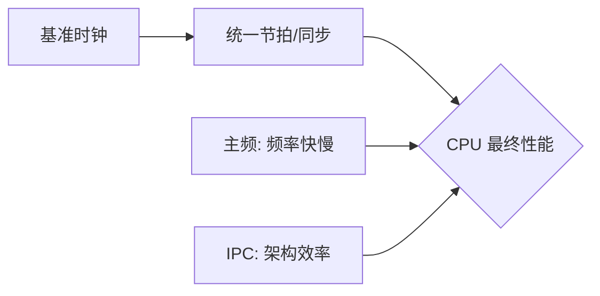
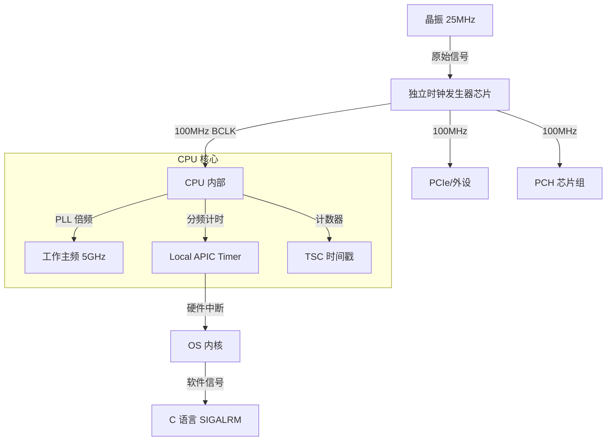
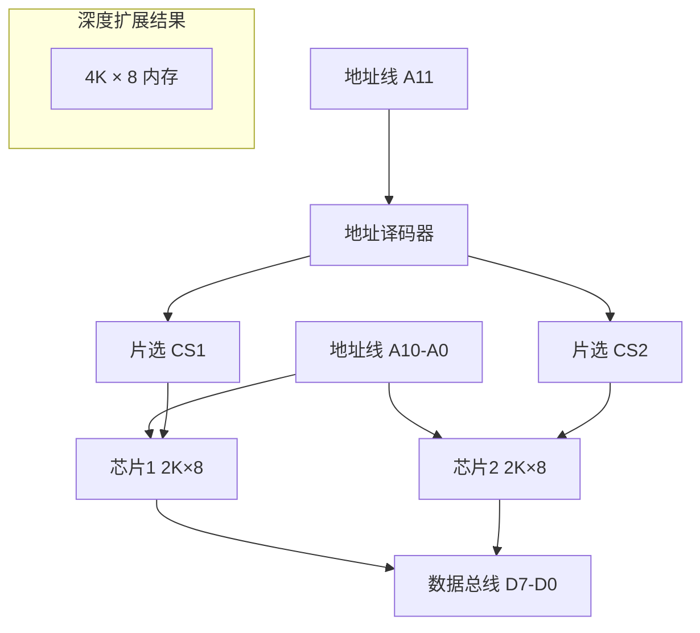
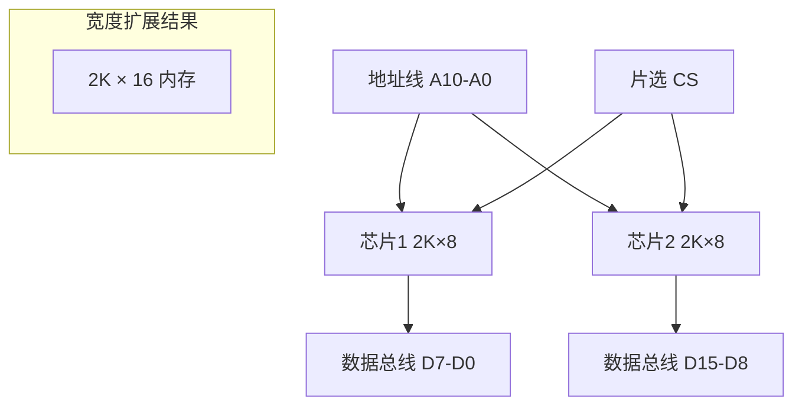

---
{"dg-publish":true,"permalink":"/Learn/计算机是怎样跑起来的/","title":"计算机是怎样跑起来的","tags":["flashcards"],"noteIcon":"","created":"2026-03-12T10:27:16.000+08:00","updated":"2026-03-12T10:27:16.000+08:00"}
---


# 第1章：计算机的三大原则
> [!question]- 初级问题： 硬件和软件的区别是什么？
> 硬件（Hardware）：“硬的东西”，能看到，能摸到。
> 软件（Software）：“软的东西”，看不到，摸不到。

> [!help]- 中级问题：存储字符串“中国”需要几个字节？
> 存储汉字时， 字符编码不同， 汉字所占用的字节数也就不同。 
> GBK 字符编码：1个汉字占用 2 个字节。
> UTF-8 字符编码：1个汉字占用 3 个字节。 

> [!faq]- 高级问题：什么是编码（Code）？
> 计算机内部会把所有的信息都当成**数字**来处理， 尽管有些信息本来不是数字。
> 用于表示**字符**的数字是“**字符编码**”，用于表示**颜色**的数字是“**颜色编码**”。
## 1.1 计算机的三个根本性基础
1. 计算机是执行**输入**、**运算**、**输出**的机器
2. 程序是**指令**和**数据**的集合
3. 计算机的处理方式有时与人们的思维习惯不同
## 1.2 输入、运算、输出是硬件的基础
**IC**：Integrated Circuit「集成电路」


输入、 运算、 输出

## 1.3 软件是指令和数据的集合
代码清单 1.1 C 语言的程序示例片段
```c
int a, b ,c;
a = 10;
b = 20;
c = Average(a, b);
```

将代码清单 1.1 的内容保存为 MyProg.c，编译后会生成可执行文件 MyProg.exe。
用文件查看器打开 MyProg.exe，会看到类似代码清单 1.2 的十六进制数值。

代码清单 1.2　机器语言的程序示例
```c
C7 45 FC 01 00 00 00 C7 45 F8 02 00 00 00 8B 45
F8 50 8B 4D FC 51 E8 82 FF FF FF 83 C4 08 89 45
F4 8B 55 F4 52 68 1C 30 42 00 E8 B9 03 00 00 83
```
无论是哪个程序，其内容都是数值的罗列，每个**数值**要么是**指令**，要么是**数据**。
## 1.4 对计算机来说什么都是数字
计算机术语，如“文件句柄”、“公钥”和“私钥”，本质上都是**数字**。
尽管这与人类的思维习惯不同，但将所有信息都视为数字，能让计算机更高效地处理它们。
## 1.5 只要理解了三大原则，即使遇到难懂的最新技术，也能轻松应对
 计算机是执行**程序**的机器。 程序是**指令**和**数据**的集合。 
 为了使互 联网上相互连接的计算机能通过程序协同工作，微软公司采用了 SOAP 以及 XML 规范。
 SOAP 是关于调用指令的规范，XML 则是定义数据 格式的规范。
## 1.6 为了贴近人类，计算机在不断地进化
Windows XP 和 Office XP 末尾的 XP， 代表的就是 **Experience**（体验）。
面向组件编程：Component BasedProgramming
面向对象编程：Object Oriented Programming

## 1.7 稍微预习一下第2章

一台基本的计算机硬件，只需将 **CPU**、**内存** 和 **I/O** 用电路连接起来，并提供**电源**和**时钟信号** 即可。
**时钟信号「内含晶振发出电信号」** 由时钟发生器发出，其频率（如Pentium CPU，几百MHz到2GHz）决定了CPU的工作速度。
>晶振：一种利用石英晶体（又称水晶）的压电效应产生高精度振荡频率的电子元 件。
# 第2章：试着制造一台计算机吧
> [!question]- 初级问题： CPU 是什么的缩写？
> **CPU**（Central Processing Unit），即**中央处理器**，是计算机的“大脑”，负责执行程序指令。

> [!help]- 中级问题：Hz 是表示什么的单位？
> **Hz**（赫兹）是表示**时钟信号频率**的单位。1 Hz 表示每秒产生1次信号，因此 **100 MHz**（兆赫兹）相当于每秒**1亿**次信号。

> [!faq]- 高级问题：Z80 CPU 是多少比特的 CPU？
> **Z80**是**8比特**CPU。CPU的比特数通常由其**通用寄存器**决定。Windows电脑中常见的奔腾（Pentium）CPU则是32比特。
## 2.0 计算机术语和概念
### 术语
- **CPU**：Central Processing Unit「中央处理器」
- **PIO**：Parallel Input/Output「并行输入/输出」
	- 它是由 Zilog 公司为 Z80 CPU 设计的一款配套芯片，主要作用是提供两个可编程的 8 位并行 I/O 端口，用于在 **CPU** 和**外部设备**（如键盘、打印机等）**之间**进行数据传输。
- **RAM**：Random-Access Memory「随机存取存储器」
- **DRAM**：Dynamic Random-Access Memory「动态随机存取存储器」
	- 它之所以被称为“动态（Dynamic）”，是因为它需要持续刷新来维持数据。每个 DRAM 单元都由一个电容器和一个晶体管组成。电容器会存储电荷来代表一个数据位（1 或 0），但电容器会随着时间**慢慢漏电**，因此需要每隔几毫秒就对其中的数据进行一次刷新（**充电**），以**防止数据丢失**。
- **SRAM**：Static Random-Access Memory「静态随机存取存储器」
	- DRAM 与 SRAM 的区别
		- **DRAM (动态 RAM):**
		    - **特点：** 需要刷新，结构简单，集成度高。
		    - **优势：** 成本低，容量大。
		    - **用途：** 主要用作**电脑**的**主内存**（即我们通常所说的“内存条”）。
		- **SRAM (静态 RAM):**
		    - **特点：** 无需刷新，结构复杂，集成度低。
		    - **优势：** 速度快，功耗低。
		    - **用途：** 主要用作 **CPU** 的**高速缓存**（Cache），因为速度对于缓存至关重要。
- **DMA**：Direct Memory Access「直接存储器访问」  
- **BUSRQ**：Bus Request「总线请求」  
- **BUSAK**：Bus Acknowledge「响应总线请求」
- **Pull-up**：上拉
- **Address Bus**：地址总线
- **Data Bus**：数据总线
- **M1**：Machine Cycle 1
- **INT**：Interrupt
- **NC**：No Connection「未连接 悬空」
- **CE**：Chip Enable「芯片选通」
- **CS**：Chip Select「片选」
- **MT**：Million Transfers per second「百万次传输/秒」
- **ALU**：Arithmetic Logic Unit 「算术逻辑单元」
- **DDR**：Double Data Rate「双倍数据速率」
### CPU 的位数
CPU 的**位数**（或称**位宽**、**字长**）是一个**系统性**的概念，它主要由 CPU **内部核心部件**的宽度共同决定，是其**指令集架构 (ISA)** 在底层设计中的体现。
我们可以从以下三个核心维度来理解和定义 CPU 的位数：
#### 1. 核心决定因素：通用寄存器的宽度
>**结论：** 我们通常所说的 CPU 位数（如 32 位、64 位），**最直接、最核心**的定义就是其 **通用寄存器（General-Purpose Registers）** 的宽度。
* **通用寄存器：** 这是 CPU 内部用于暂时存放参与**运算数据**和**指令地址**的**极高速存储单元**。
    * **32 位 CPU：** 拥有 32 位宽的寄存器（如 EAX、EBX寄存器），**32 位寄存器** → **4 字节** 的存储空间 → $2^{32}$ 不同的数值组合。
    * **64 位 CPU：** 拥有 64 位宽的寄存器（如 RAX、RBX寄存器），**64 位寄存器** → **8 字节** 的存储空间 → $2^{64}$不同的数值组合。
	- CPU内部有**多个**这样的寄存器。
- **通用寄存器的总字节数：** 以常见的x86-64架构为例，它有 **16 个** 核心的通用寄存器（RAX, RBX, RCX, RDX, RSP, RBP, RSI, RDI, R8-R15）。
	- 每个寄存器容量：**8 字节**
	- 总容量：16 寄存器 × 8 字节/寄存器 = **128 字节**
	- 这 **128 字节** 是CPU最顶层、最快、无需访问缓存或内存就能直接使用的数据存储空间。
- **其他寄存器：** 除了通用寄存器，CPU内部还有更多种类、数量庞大的寄存器，它们共同构成了CPU内部的存储空间。
	- **指令指针（RIP）**：64位，存放下一条要执行的指令地址。
	- **标志寄存器（RFLAGS）**：64位，存放运算结果的状态（如是否为0、是否溢出等）。
	- **浮点/向量寄存器**：用于高性能计算，容量更大。
	    - **x87 FPU 寄存器**：80位宽，有8个。
	    - **SSE/AVX 寄存器**（如XMM0-XMM15, YMM0-YMM15）：
	        - XMM寄存器：128位（16字节）
	        - YMM寄存器：256位（32字节）
	        - （在支持AVX-512的CPU上）ZMM寄存器：512位（64字节）
	
如果把这些**所有类型的寄存器都加起来**，总的 **“寄存器空间”** 会远大于通用寄存器的128字节，可能达到**几千字节**的量级。
#### 2. 性能支撑因素：ALU 与数据总线的宽度
这两个部件的宽度必须与寄存器宽度**协同一致**，才能确保 CPU 的高效运行。
##### A. 算术逻辑单元（ALU）的宽度
* **作用：** $\text{ALU}$ 是 CPU 中实际执行所有算术（加、减、乘、除）和逻辑（与、或、非）运算的部件。
* **匹配性：** $\text{ALU}$ 的宽度**必须**与通用寄存器宽度匹配。一个 **64 位**的 $\text{ALU}$ 才能在一个时钟周期内完成 **64 位**数据的运算。如果 $\text{ALU}$ 宽度不足，数据需要拆分成多次运算，效率将大打折扣。
##### B. 数据总线的宽度
* **作用：** 数据总线是 CPU 与内存等外部部件之间传输数据的通道。
* **影响：** 它的宽度决定了 CPU **每次**从内存中读取或写入的数据量（即**数据吞吐量**）。
* **理想状态：** 为了达到最高效率，数据总线宽度应**尽可能等于**寄存器的宽度。例如，64 位 CPU 搭配 64 位数据总线，一次可传输 8 字节数据，实现高效的数据填充。
#### 3. 限制性因素：地址总线的宽度
地址总线的宽度**不直接定义** CPU 的位数，但它决定了 CPU 的**寻址能力**，即能访问的**最大内存容量**。
* **决定因素：** 可寻址内存大小 = $2^{\text{(地址总线位数)}}$
* **32 位系统：** 经典的 32 位 CPU 通常搭配 32 位地址总线，最大可寻址 $2^{32}$ 字节，即 **4 GB** 内存。
* **64 位系统：** 64 位 CPU 的地址总线远超 32 位（实际实现通常为 48 位或 52 位），使其能够支持 $\text{TB}$ 级别的海量内存。
##### 总结比喻：CPU 的位数就像一个工厂
| 部件         | 作用                | 对应比喻                    |
| :--------- | :---------------- | :---------------------- |
| **通用寄存器**  | **定义**位数；一次处理的数据量 | **加工台的大小**（最直接的标准）      |
| **ALU 宽度** | 支撑运算能力            | 机器手臂的力量（一次能处理多大的原材料）    |
| **数据总线**   | 决定数据吞吐效率          | 进出工厂的**传送带宽度**          |
| **地址总线**   | 决定可访问的内存范围        | **仓库的地址编号范围**（能管理多大的仓库） |
因此，一个 CPU 被定义为 $N$ 位，是因为它的**通用寄存器**是 $N$ 位宽的，并有 $N$ 位宽的 $\text{ALU}$ 和指令集来支持其高效运行。
### CPU存储层次结构
#### 一、 核心图示：存储金字塔
**速度由快至慢，容量由小至大**
```
      / \
     /   \   速度最快，成本最高
    /寄存器\   (CPU核心内部工作区)
   /-------\
  /  L1缓存 \   (每个核心的私人工作台)
 /-----------\
/    L2缓存   \  (每个核心的私人仓库)
------------- \
\    L3缓存    /  (所有核心共享的中央仓库)
 \-----------/
  \  内存   /    (主存，所有程序的工作区域)
   \------/
    \硬盘/       (永久存储，速度最慢)
     \ /
```
#### 二、 详细对比表格
| 特性      | **寄存器**                    | **L1 缓存**                  | **L2 缓存**                 | **L3 缓存**                        | **内存**                | **硬盘/SSD**              |
| :------ | :------------------------- | :------------------------- | :------------------------ | :------------------------------- | :-------------------- | :---------------------- |
| **位置**  | CPU核心**内部**                | 每个CPU核心**内部**              | 每个CPU核心**内部/外部**          | CPU芯片上，**所有核心共享**                | **主板**插槽上             | 机箱内，通过线缆连接              |
| **功能**  | **直接参与运算**<br>(存放指令、数据、地址) | **核心专用高速缓存**<br>分指令缓存和数据缓存 | **核心专用后备缓存**<br>弥补L1容量不足  | **所有核心共享缓存**<br>作为CPU与内存间的最后缓冲   | **程序运行时的临时工作区**       | **永久存储**操作系统、程序、文件      |
| **容量**  | **极小**<br>（几百字节 ~ 几KB）     | **很小**<br>（几十KB ~ 几百KB/核心） | **较小**<br>（几百KB ~ 几MB/核心） | **大**<br>（几MB ~ 几百MB，**所有核心共享**） | **很大**<br>（几GB ~ 几TB） | **极大**<br>（几百GB ~ 几十TB） |
| **速度**  | **最快**<br>（与CPU时钟同步，0延迟）   | **极快**<br>（1-4个时钟周期）       | **很快**<br>（10-20个时钟周期）    | **快**<br>（20-50个时钟周期）            | **慢**<br>（200+个时钟周期）  | **极慢**<br>（数百万个时钟周期）    |
| **管理方** | **编译器/程序员**<br>（通过汇编指令）    | **CPU硬件自动管理**              | **CPU硬件自动管理**             | **CPU硬件自动管理**                    | **操作系统**              | **操作系统 & 文件系统**         |
#### 三、 关键知识点总结
1.  **设计哲学**：这个分层结构是基于**局部性原理**（时间和空间局部性），用较小的成本，在速度和容量之间取得最佳平衡。
2.  **数据流**：
    *   当CPU需要数据时，它按照 **寄存器 → L1 → L2 → L3 → 内存 → 硬盘** 的顺序逐级查找。
    *   找到数据后，会将其**复制**到上一级更快的存储中，以便后续快速访问。这个过程对程序是**透明**的。
3.  **寄存器与缓存的本质区别**：
    *   **寄存器**是**运算部件**，是CPU指令直接操作的对象。
    *   **缓存**是**存储部件/缓冲区**，目的是**加速**对内存的访问。
4.  **缓存层级分工**：
    *   **L1**：追求**极致速度**，分为指令缓存和数据缓存，专核心专用。
    *   **L2**：平衡速度和容量，作为L1的**后备**，专核心专用。
    *   **L3**：追求**大容量和共享**，解决多核心数据同步与冲突问题，是内存前的**最后一道屏障**。
5.  **性能影响**：
    *   缓存命中率的高低直接决定了CPU的“实际工作效率”。缓存越大、越快，CPU“等待”数据的时间就越少，性能就越强。这就是为什么同架构的CPU，缓存大小是关键的性能指标。
### 计算机时钟频率
#### 核心逻辑：同步与性能
1. **核心作用：系统的“统一节拍”** CPU内部数十亿晶体管必须步调一致。确保所有部件在每一个“滴答”瞬间**同步完成**取指、计算或存取，防止逻辑出错。
2. **同步基准：协调多样频率** 尽管 CPU、内存等组件工作速度不同，但它们都源于同一个基准时钟（BCLK）。这种同步机制确保了不同组件间数据交换的准确性。
3. **运行逻辑：频率不等于速度** 主频（如 5.0GHz）代表每秒的周期数。但受限于架构，**“一个时钟周期”不等于“执行一条指令”**。
4. **效率关键：IPC（每周期指令数）** 现代 CPU 利用**流水线**和**超标量**技术，能在一个周期内处理多条指令。**IPC** 是衡量架构先进程度的核心指标。
5. **性能判定公式：**
$$\text{CPU 性能} \approx \text{主频} \times \text{IPC(每周期指令数)}$$
性能由“节奏快慢”与“架构效率”共同决定。主频稍低但 IPC 极高的现代处理器，实际性能往往优于高主频的陈旧处理器。
##### 逻辑流程图

#### 硬件架构：从“中央集权”到“分布式”
| **阶段**       | **组件**                        | **物理位置**       | **作用与原理**                                                             |
| ------------ | ----------------------------- | -------------- | --------------------------------------------------------------------- |
| **1. 物理源头**  | **石英晶振** (Crystal)            | 主板 (金属胶囊)      | **产生脉冲**：利用压电效应产生极其稳定的 **25MHz** 原始物理频率（系统的“心脏”）。                     |
| **2. 总指挥**   | **时钟发生器芯片** (Clock Generator) | 主板 (CPU/PCH 旁) | **时钟合成 (Synthesis)**：通过内部 PLL 接收原始频率，消除抖动并加工成标准 **100MHz BCLK 差分信号**。 |
| **3. 分布式执行** | **零件内部 PLL** (锁相环)            | CPU / 内存内部     | **自主倍频**：接收 100MHz 基准，各自按需翻倍。如 CPU 将其乘以 50 得到 **5.0GHz** 工作主频。        |
#### 逻辑链路图 (从物理震动到 C 语言信号)

#### 术语演进：FSB (外频) vs BCLK (基频)
| 特征       | 历史上的“外频” (FSB) 时代 (如 Pentium 4)                  | 现代的“基准频率” (BCLK) 时代 (2008 年后)                            |
| -------- | ------------------------------------------------ | -------------------------------------------------------- |
| **术语**   | **外频** (Front-Side Bus Frequency)                | **基准频率** (Base Clock)                                    |
| **硬件架构** | **中央总线**：CPU、内存、芯片组共享一根总线 (FSB)。                 | **点对点连接**：使用 QPI / DMI / Infinity Fabric 等高速串行总线取代 FSB。  |
| **关键变革** | 内存控制器在**主板芯片组**内。                                | **内存控制器集成**到 CPU 内部 (IMC)。                               |
| **时钟关系** | **同步锁定**：所有主要部件（核心、内存、PCI）的频率都必须基于 FSB **同步运行**。 | **时钟分离**：CPU 核心、内存、I/O 运行在**各自独立的频率**上。                  |
| **物理含义** | **总线的实际工作频率**：是 CPU 与主板交换数据的**物理速度**。            | **基础时钟参考点**：是一个低速 (100MHz) 的参考信号，**本身不代表任何数据总线的实际运行速度**。 |
| **核心公式** | CPU 核心频率 = **外频** × **倍频**                       | CPU 核心频率 = **基准频率** × **倍频**                             |
>1. **外频** 在现代硬件中被称为 **BCLK (Base Clock)**，是所有设备的基础同步时钟，标准值是 **100 MHz**
>2. “**基准频率**”和“**外频率**”指的其实是**同一个概念**，即 **BCLK (Base Clock)**，但“**外频**”这个术语在**过去**更为**常见**
>3. 现代计算机系统通过将内存控制器集成到 CPU 内部并使用点对点总线，实现了**时钟域的解耦**。因此，**“外频”** 这个描述总线速度的旧术语已经过时。**“基准频率” (BCLK)** 是更准确的名称，因为它代表了一个**统一的时钟源**，用于通过不同的倍率和分频器，生成 CPU 核心、内存和 I/O 等所有部件所需的工作频率。
#### CPU与内存频率
CPU 和内存的频率**不同**，但两者都以**时钟发生器**生成的**基准频率**为基础，通过各自的**倍频/分频器**工作。
##### 1. CPU 核心频率
| 特点       | 说明                                                                      |
| :------- | :---------------------------------------------------------------------- |
| **作用**   | 决定 **CPU 内部执行指令**和**处理数据的速度**。                                          |
| **计算方式** | 通过**倍频系数**从基准频率衍生： $$\text{CPU 核心频率} = \text{基准频率} \times \text{倍频系数}$$ |
| **频率高低** | 系统中**最高**的频率之一（目前通常为数 $\text{GHz}$），追求**单线程处理速度**。                      |
##### 2. 内存工作频率
| 特点       | 说明                                             |
| :------- | :--------------------------------------------- |
| **作用**   | 决定内存**数据传输的物理速度和带宽**，与 CPU 的内存控制器同步。           |
| **计算方式** | 通过**分频/倍频比例（Memory Ratio）**从基准频率衍生出**内存时钟频率**。 |
| **频率高低** | **适中**。它的带宽吞吐量更重要，受**数据总线宽度**和 **DDR 技术**影响。   |
#### 带宽计算中的「频率」与 DDR 技术
在计算内存带宽时，使用的频率**必须**是**有效数据传输速率 (Data Rate)**。
##### 1. 带宽公式
$$\text{带宽 (MB/s)} = \frac{\text{数据总线宽度 (bit)} \times \text{频率 (MHz/MT/s)}}{8 \text{ (bit/Byte)}}$$
##### 2. 频率的实际意义（DDR 技术）
核心区别：时钟频率 vs. 有效数据速率
对于 DDR (Double Data Rate) 内存技术，我们需要区分两个关键数值：
###### 1. 内存时钟频率（Clock Frequency）
* **定义：** 这是内存芯片和内存总线**实际**的**物理振荡频率**，通常以 **MHz** 为单位。
* **示例：** 对于 **DDR4 3200** 内存，其**基础时钟频率**是 $1600 \text{ MHz}$。
###### 2. 有效数据速率（Effective Data Rate / Transfer Rate）
* **定义：** 这是内存**每秒实际进行数据传输的次数**，通常以 **MT/s**（Million Transfers per second，百万次传输/秒）为单位。
* **DDR 技术：** 因为 **D**ouble **D**ata **R**ate（双倍数据速率），它在一个时钟周期内，通过时钟的上升沿和下降沿进行**两次**数据传输。
* **计算：** 有效数据速率 = 内存时钟频率 $\times 2$
* **示例：** $1600 \text{ MHz} \times 2 = 3200 \text{ MT/s}$。
###### 术语的简化和约定
在市场营销和口语交流中，人们常常用 **$\text{MT/s}$ 的数值**来命名和指代内存，并习惯性地将其单位**简化为 $\text{MHz}$**，以方便计算带宽：
* 当人们说 "**DDR4 3200**" 时，这个 "3200" 指的就是它的**有效数据速率**（$3200 \text{ MT/s}$）。
* 在带宽计算公式中，我们需要的正是这个**每秒传输次数**的数值。

| 频率数值       | 含义                                    | 如何在公式中使用                                                                             |
| :--------- | :------------------------------------ | :----------------------------------------------------------------------------------- |
| **内存时钟频率** | 实际的**物理振荡频率**（例如 $1600 \text{ MHz}$）。 | **必须**乘以 2（因为 DDR）。$$\text{带宽} = \frac{\text{宽度} \times (\text{时钟频率} \times 2)}{8}$$ |
| **有效数据速率** | **每秒实际传输次数**（例如 $3200 \text{ MT/s}$）。 | **直接**代入公式，**无需**再乘以 2。$$\text{带宽} = \frac{\text{宽度} \times \text{数据速率}}{8}$$        |
#### 计算机频率进阶与超频要点
##### 1. 超频（Overclocking）基础
* **本质：** 频率不是固定的，而是**人为设定**的。超频就是手动修改 $\text{CPU}$ 的**倍频**或**基准频率 ($\text{BCLK}$)**，将其工作频率拉高，以提高电脑性能。
* **公式：** $\text{CPU}$ 核心频率 = **基准频率** $\times$ **倍频**。
##### 2. $\text{CPU}$ 超频策略（现代架构）
| 方式       | 调整项                                                            | 影响范围                                                                                     | 稳定性                                               | 推荐度               |
| :------- | :------------------------------------------------------------- | :--------------------------------------------------------------------------------------- | :------------------------------------------------ | :---------------- |
| **倍频超频** | **$\text{CPU}$ 倍频**（如 $\times 40$ 设为 $\times 50$）              | **仅影响 $\text{CPU}$ 核心和缓存**。                                                              | **高**：由于 $\text{BCLK}$ 不变，内存、$\text{PCIe}$ 等时钟稳定。 | **首选**：简单、安全。     |
| **基频超频** | **基准频率 ($\text{BCLK}$)**（如 $\text{100MHz}$ 设为 $\text{103MHz}$） | **波及整个平台**：同时影响 $\text{CPU}$ 核心、内存、$\text{PCIe}$、$\text{SATA}$ 等所有依赖 $\text{BCLK}$ 的时钟域。 | **低**：牵一发动全身，极易造成系统不稳定。                           | **不推荐**：除非追求极限性能。 |
##### 3. 内存与频率异步
* **内存频率来源：** 现代内存频率通常由 $\text{BCLK}$ 经过一个特定的**分频系数 (Ratio)** 衍生而来。
* **异步运行 ($\text{Ratio}$)：** 内存可以设置一个**非整数倍**的 $\text{Ratio}$，使其运行频率不必是 $\text{BCLK}$ 的整数倍。
    * *示例：* 内存工作在 $\text{2133MHz}$ 或 $\text{2666MHz}$ 等非整数倍值，就是利用了这种高级的 $\text{Ratio}$ (分频比) 功能，实现了**异步运作**，以获得更高的带宽。
##### 4. 显卡频率的独立性
* **不受 $\text{BCLK}$ 影响：** 显卡（$\text{GPU}$）的**核心频率**和**显存频率**完全由其自身集成的时钟发生器控制。
* **时钟域隔离：** 显卡频率是**独立**的时钟域，它不依赖于 $\text{CPU}$ 的基准频率 ($\text{BCLK}$) 或内存频率，因此可以**随意设置**，不需要是 $\text{BCLK}$ 的整数倍。
#### 超频的核心限制因素
超频受到硬件本身的物理极限和系统支持能力的严格限制，主要集中在以下三个方面：
##### 1. 硬件体质（芯片的物理极限）
这是决定超频幅度的**最根本因素**。
* **频率上限：** 每个 $\text{CPU}$ 芯片的晶体管开关速度有其固有的**物理上限**，超过该频率，芯片就无法保证计算的正确性，导致系统崩溃。
* **耐压上限：** 芯片能安全承受的**最高电压**是固定的。高电压会急剧增加热量和漏电，如果超出安全值，会永久性损坏 $\text{CPU}$ 寿命。
##### 2. 散热能力（温度限制）
散热是超频最实际的障碍，因为更高的频率和电压必然产生更多热量。
* **温度墙：** $\text{CPU}$ 有一个**最高安全温度** ($\text{Tj}$ Max)。一旦核心温度触及此限制，$\text{CPU}$ 会自动触发**热保护机制（降频）**，使超频失效，性能反而下降。
* **散热系统：** 散热器（风冷或水冷）的**效率**直接决定了系统能承受的最大功耗。散热能力不足，超频就无法稳定运行。
##### 3. 供电与主板设计（$\text{VRM}$ 限制）
主板的质量决定了能否为超频后的 $\text{CPU}$ 提供稳定、充足的电力。
* **$\text{VRM}$ 供电能力：** 主板上的**电压调节模块** ($\text{VRM}$) 必须能够稳定地提供超频所需的**大电流**。$\text{VRM}$ 用料不足或散热不良会导致供电不稳或自身过热保护，限制超频。
* **$\text{BIOS}$ 限制：** 非高端的主板（如 $\text{Intel}$ 的 $\text{H}$/$\text{B}$ 系列芯片组）通常会在 $\text{BIOS}$ 中**锁定倍频或 $\text{BCLK}$ 调节**功能，从软件层面禁止超频。

**简而言之：** 芯片体质决定了你的**理论上限**；散热能力决定了你的**实际运行上限**；而主板供电则决定了你的**稳定运行下限**。
### 总线的定义
**总线** 是计算机内部多个部件之间共享的公共通信通道。它是一组信号线的集合，定义了各部件间传输信息的标准。
>总线技术是计算机的“血液循环系统”
#### 一、按总线所处的**位置**和**功能**分类（最核心的分类方式）
| 类别       | 英文                | 功能描述                                              | 连接对象举例               | 特点                                                        |
| :--------------- | :---------------- | :------------------------------------------------ | :------------------- | :-------------------------------------------------------- |
| **片内总线** | Chip Internal Bus | **CPU内部**的总线，连接CPU内部各部件（如寄存器、ALU、控制器）。 | 连接CPU内部的运算器、控制器、寄存器组 | **速度极快**，与CPU工艺和内部结构紧密相关，对用户不可见。 |
| **系统总线** | System Bus        | **计算机主板**上的总线，连接CPU、内存、I/O通道等核心部件。**这是最重要的一类总线。** | CPU ↔ 内存、CPU ↔ I/O接口 | 是计算机系统的**主干道**，其性能直接影响整机性能。<br>通常又细分为：**数据总线、地址总线、控制总线**。 |
| **外部总线** | External Bus      | **计算机内部**用于连接**外部设备**的总线，又称**I/O总线**。 | 主板 ↔ 硬盘、显卡、网卡等外部设备   | 注重**通用性、可扩展性和兼容性**。速度通常低于系统总线。如PCIe, SATA, USB等。|
#### 二、系统总线的细分（三总线结构）
| 类型       | 英文          | 传输方向                          | 功能                                    | 特点                                                                                                                                |
| :------- | :---------- | :---------------------------- | :------------------------------------ | :-------------------------------------------------------------------------------------------------------------------------------- |
| **数据总线** | Data Bus    | **双向**（可在CPU、存储器、I/O设备之间来回传输） | 在系统部件之间传输**实际数据**<br>（**指令**或**数据**）。 | **宽度（位数）** 决定了一次能传输**多少的数据**，是**字长**的关键指标（如64位CPU）。<br>**一次能处理多少数据**：$带宽(MB/s)=\frac{{数据总线宽度(bit)}\times{频率(MHz)}}{8(bit/Byte)}​$ |
| **地址总线** | Address Bus | **单向**（从CPU到存储器/I/O设备）        | 指定**存储器**或**I/O设备**中**数据的位置**（地址）。    | **宽度（位数）** 决定了CPU的**寻址能力**。<br>**能管理多大内存**：$最大寻址空间=2^{地址总线宽度}$                                                                    |
| **控制总线** | Control Bus | **部分入、部分出**                   | 传输各种**控制信号**，协调各部件的工作。                | 信号种类多（读、写、中断、时钟、复位等），<br>决定了总线的**控制和协调能力**。                                                                                       |
我们通常说的“数据总线、地址总线、控制总线”指的是**系统总线**的三个功能组成部分。
#### 三、常见外部总线（I/O总线）对比
| 总线标准     | 中文名         | 类型        | 特点                                                       | 主要应用                        |
| :------- | :---------- | :-------- | :------------------------------------------------------- | :-------------------------- |
| **PCIe** | PCI-Express | **并行串行化** | **当前主流**。采用**点对点**串行连接，带宽高、扩展性强。版本迭代快（PCIe 3.0/4.0/5.0）。 | **独立显卡、高速固态硬盘(SSD)、高端网卡**   |
| **SATA** | 串行ATA       | 串行        | 取代了旧的PATA（IDE）。结构简单，线缆小巧。                                | **机械硬盘、SATA接口固态硬盘、光驱**      |
| **USB**  | 通用串行总线      | 串行        | **应用最广泛**的外部总线。支持热插拔、即插即用、可对外供电。                         | **键盘、鼠标、U盘、移动硬盘、手机等几乎所有外设** |
| **PCI**  | 外围组件互联      | 并行        | **上一代**主流总线标准，已被PCIe取代。                                  | 老式的声卡、网卡等扩展卡                |
| **M.2**  | -           | 接口规范      | **不是总线，是一种物理接口形式**。它可以使用**PCIe**或**SATA**总线。             | **现代NVMe固态硬盘**（走PCIe通道）     |
**笔记点睛**：外部总线的发展趋势是 **从并行转向串行**。虽然串行一次只传输1位数据，但可以通过提高时钟频率和采用**多通道**（Lanes，如PCIe x4, x16）来轻松实现超高带宽，而**并行总线**在**高频率**下**信号同步**和**干扰问题**严重。
#### 四、按数据传输方式分类
| 类型       | 原理                          | 优点                         | 缺点                                | 举例                          |
| :------- | :-------------------------- | :------------------------- | :-------------------------------- | :-------------------------- |
| **串行总线** | 数据位**逐位**依次传输               | 线数少，成本低，**抗干扰能力强**，适合长距离传输 | 理论上同一时钟下速度低于并行                    | **USB, SATA, PCIe, 网线**     |
| **并行总线** | 数据位**多位**（如8位、16位）同时通过多根线传输 | 理论上在同一时钟周期内数据传输率更高         | 线数多，成本高，各信号线间**易产生干扰（串扰）**，频率难以提升 | **早期的PCI、PATA(IDE)、LPT打印口** |
#### 总结笔记表格
| **分类维度**   | **总线类型**  | **核心特点**           | **典型代表**            |
| :--------- | :-------- | :----------------- | :------------------ |
| **按位置功能**  | 片内总线      | CPU内部，速度最快         | (CPU内部设计，无通用标准)     |
|            | 系统总线      | 主板主干道，三结构          | 数据/地址/控制总线          |
|            | 外部总线(I/O) | 连接外设，通用性强          | **PCIe, SATA, USB** |
| **按传输方式**  | 串行总线      | 逐位传输，抗干扰，主流        | USB, SATA, **PCIe** |
|            | 并行总线      | 多位同时传输，已渐淘汰        | PATA(IDE), PCI      |
| **系统总线组成** | 数据总线      | **双向**，传输数据，决定字长   | 64位, 32位            |
|            | 地址总线      | **单向**，传输地址，决定寻址空间 | 32位(4GB), 64位       |
|            | 控制总线      | **双向**，传输控制信号      | 读/写/中断信号            |
### 存储容量：CPU 寻址能力 vs 内存芯片容量
存储容量的计算核心原则是：**地址线决定单元数量，数据线决定单元位宽。** 但这套原则应用在 CPU 和内存 IC 上，代表着不同的容量概念。
#### 1. 核心概念对比
| 总线类型    | 作用        | 决定因素              | 公式                              |
| :------ | :-------- | :---------------- | :------------------------------ |
| **地址线** | 寻址，指定数据位置 | **可寻址的单元数量**      | $\text{单元数} = 2^{\text{地址线数量}}$ |
| **数据线** | 传输数据      | **每个存储单元的位数（位宽）** | N/A                             |
#### 2. 场景一：CPU 的最大寻址能力（系统内存上限）
这是从**系统宏观**的角度，衡量 **CPU** 能控制的**最大内存空间**。

| 计算对象         | **CPU** 的最大寻址能力                                   |
| :----------- | :------------------------------------------------ |
| **决定因素**     | **仅由 CPU 地址总线宽度**决定。                              |
| **数据线影响**    | **CPU 数据总线**宽度**与系统最大内存容量无关**。它只影响数据传输速度，不影响寻址范围。 |
| **计算公式（字节）** | $$\text{系统最大内存 (Byte)} = 2^{\text{CPU地址总线宽度}}$$   |
| **实例**       | **32 位**地址总线：$2^{32} \text{ Byte} = 4 \text{ GB}$ |
| **关键意义**     | 设定了系统能“看到”和使用的**理论内存上限**。                         |
#### 3. 场景二：内存芯片（IC）的物理容量
这是从**芯片微观**的角度，衡量**单个内存 IC** 的**实际存储量**。

| 计算对象           | **单个内存芯片**的物理容量                                                                                   |     |
| :------------- | :------------------------------------------------------------------------------------------------ | --- |
| **决定因素**       | **芯片自身的地址引脚**和**数据引脚**数量共同决定。                                                                     |     |
| **单元数**        | $2^{\text{芯片地址引脚}}$（如 $A_0 \sim A_{10}$ 共 11 根线，则有 $2^{11}$ 个单元）                                  |     |
| **位宽**         | $\text{芯片数据引脚}$（如 $D_0 \sim D_7$ 共 8 根线，则位宽为 8 bit）                                               |     |
| **容量计算公式（字节）** | $$\text{芯片总容量 (Byte)} = \frac{2^{\text{芯片地址引脚}} \times \text{芯片数据引脚}}{8}$$                        |     |
| **实例**         | $$\frac{2^{20} \times 4}{8} = \frac{1048576 \times 4}{8} = 524288 \text{ Byte} = 512 \text{ KB}$$ |     |
| **关键意义**       | 决定了该芯片实际能存储的**数据总量**。                                                                             |     |
### 存储器容量与引脚关系
#### 1. 存储矩阵容量的物理限制
**核心原理：** 单个存储芯片（如 SRAM/DRAM）的存储矩阵容量**不可能**大于由其地址引脚和数据引脚决定的**理论容量**。
  * **限制来源：** 芯片的引脚是与外界交互的**物理接口规格**，它决定了芯片的寻址能力和数据传输宽度。

| 限制类型 | 限制引脚 | 限制公式/能力 | 结果 |
| :--- | :--- | :--- | :--- |
| **寻址深度** | **$N$ 根地址引脚 ($A_i$)** | $\text{最大存储单元数} = 2^N$ | 如果内部单元 $> 2^N$，多余部分将成为**不可访问的“孤岛”**。 |
| **数据宽度** | **$M$ 根数据引脚 ($D_i$)** | **每个单元宽度**必须是 $M$ 位 | 如果内部单元宽度 $> M$，读写时**多余的位将丢失**或无法同步传输。 |
#### 2. TC5517 示例（2K $\times$ 8）
**芯片容量：** 2048 个单元 $\times$ 8 位/单元 = 2KB。
  * **地址引脚：** $2^{11} = 2048$ $\implies$ 需要 **11 根地址引脚** ($A_0 \sim A_{10}$)。
  * **数据引脚：** 8 位宽 $\implies$ 需要 **8 根数据引脚** ($D_0 \sim D_7$ )。
**存储位置：** 程序和数据**存储在芯片内部的存储矩阵**中。引脚仅是传输地址和数据的**通道**。
#### 3. 系统级容量扩展（突破单芯片限制）
在更大的计算机系统中，通过使用**多片芯片**并结合**外部译码电路**可以扩展总容量。
##### 深度扩展（字扩展/级联）4K × 8（增加寻址单元数）
| 目标             | 方法       | 关键组件                                                                    | 示例                                                   |
| :------------- | :------- | :---------------------------------------------------------------------- | :--------------------------------------------------- |
| 增加可寻址的**单元总数** | **多片级联** | 1. **额外地址引脚**（由 CPU 提供）。<br>2. **地址译码器**（用 CPU 地址高位控制 $\overline{CS}$）。 | 2 块 $2K \times 8$ 芯片 $\implies$ **$4K \times 8$ 系统** |

**核心原理：** 芯片**分时工作**，利用CPU提供的**额外地址线**来**选择**不同的芯片。
- **以 2 块 2K×8 芯片扩展成 4K×8 系统为例：**
    - 2K=$2^{11}$，所以单个 2K×8 芯片需要 **11根地址线**（A10​∼A0​）来寻址其内部的 2048 个单元。
    - 目标系统是 4K×8，需要 4K=$2^{12}$，即需要 **12根地址线**（A11​∼A0​）。
    - **连接方式：**
        1. **低位地址线** (A10​∼A0​) **并联**到所有芯片的地址引脚上，用于选择芯片内部的单元。
        2. **高位地址线** (A11​) **接入**一个**地址译码器**，该译码器的输出分别连接到两块芯片的**片选引脚** ($\overline{CS}$) 上。
            - 当 A11​=0 时，译码器选中**芯片1** ($\overline{CS1}$=0,$\overline{CS2}$=1)。
            - 当 A11​=1 时，译码器选中**芯片2** ($\overline{CS1}$=1,$\overline{CS2}$=0)。
        3. 两块芯片的**数据引脚** (D7​∼D0​) **并联**后接上系统的数据总线。
    - **工作方式：** 
		- 任何时刻，**只有一块芯片被片选信号选中**（即处于工作状态），另一块芯片处于非工作状态（数据总线呈高阻态，不影响数据）。CPU通过 A11​ 来决定访问哪个 2K 的地址范围。
			- 高位地址A11**通过译码器选择不同芯片**
			- 低位地址A10-A0并行连接到所有芯片
			- 数据总线共享，通过片选信号隔离
			- **结果**：2K×8 + 2K×8 = **4K×8**
##### 宽度扩展（位扩展/并联）2K × 16（增加数据总线宽度）
| 目标           | 方法       | 关键组件                                                             | 示例                                                    |
| :----------- | :------- | :--------------------------------------------------------------- | :---------------------------------------------------- |
| 增加**数据总线宽度** | **多片并联** | 1. **地址引脚并联**（接到 CPU 地址总线）。<br>2. **数据引脚连接**到 CPU 数据总线的**不同部分**。 | 2 块 $2K \times 8$ 芯片 $\implies$ **$2K \times 16$ 系统** |

**核心原理：** 芯片**同时工作**，每块芯片负责数据总线的**不同位段**。
- **以 2 块 2K×8 芯片扩展成 2K×16 系统为例：**
    - 目标系统是 2K×16，其字数仍是 2K，只需要 **11根地址线** (A10​∼A0​)。
    - **连接方式：**
        1. **所有地址线** (A10​∼A0​) **并联**到所有芯片的地址引脚上，以确保同时访问到两块芯片的**同一个地址单元**。
        2. **片选信号** ($\overline{CS}$) **并联**到所有芯片的片选引脚上，使**所有芯片同时被选中**。
        3. **数据引脚**连接到系统数据总线的**不同位段**：
            - **芯片1**的 D7​∼D0​ 接系统数据总线的**低8位** (D7​∼D0​)。
            - **芯片2**的 D7​∼D0​ 接系统数据总线的**高8位** (D15​∼D8​)。
    - **工作方式：** 
		- CPU存取一个16位数据时，片选信号**同时选中**两块芯片，向地址线发送一个地址，两块芯片**同时**读出或写入数据。芯片1负责低8位，芯片2负责高8位。
			- 所有地址线和控制线完全并联
			- 每个芯片负责数据总线的不同位段
			- 所有芯片同时被选中工作
			- **结果**：2K × (8+8) = **2K × 16**
##### 核心区别总结
| 扩展方式     | **深度扩展（级联）**                    | **宽度扩展（并联）**                    |
| -------- | ------------------------------- | ------------------------------- |
| **目的**   | **增加地址空间**（增加字数 N）              | **增加数据位宽**（增加位数 M）              |
| **结果容量** | N1​×M + N2​×M ⟹ **(N1​+N2​)×M** | N×M1​ + N×M2​ ⟹ **N×(M1​+M2​)** |
| **芯片工作** | **芯片分时工作**（某一时刻只有一块芯片工作）        | **芯片同时工作**（所有芯片同时工作）            |
| **地址连接** | **低位地址**并联用于片内寻址，**高位地址**用于选片。  | **全部地址**完全并联。                   |
| **片选逻辑** | **需要地址译码**，由地址高位控制 CS。          | **共享片选信号**，所有芯片 CS 信号并联。        |
| **数据连接** | 数据总线共享。                         | 各自连接到数据总线的不同位段。                 |
## 2.1 制作微型计算机所必需的元件
### 制作微型计算机需要三种基本元件：
* **CPU**：计算机的“大脑”，用于执行程序。
* **内存**：用于存储程序和数据。
* **I/O**（输入/输出）：用于连接计算机与外部设备。
### Z80 微型计算机的电路图

### 微型计算机元件
为了构建一台简单的微型计算机，我们使用了以下核心组件：
* **Z80 CPU**: 一款在8位计算机时代广泛应用的经典CPU。
* **TC5517 内存**: 容量为2KB（2 x 1024 字节），足以满足学习需求。
* **Z80 PIO**: 一种常与Z80 CPU搭配使用的**并行**输入/输出芯片，能一次性处理**8位**数据。
### 辅助元件
为了驱动 CPU 运转，还需要一个**时钟发生器**。该元件通过晶振产生**时钟信号**，这种“滴答”的**电信号**决定了CPU的**运行速度**。我们使用的时钟发生器频率为2.5MHz。
**注意**：这台微型计算机仅作为学习模型，不具备实用价值。


用于输入程序的装置也是必不可少的。
* **输入/输出设备**：用**指拨开关**（如照片 2.1(a) 所示）作为**输入**装置来编写程序，用8个**LED**作为**输出**装置显示结果。
* **辅助元件**：一些**IC**（如74367和7404）来增强外部设备连接的**稳定性**。
* **其他元件**：
    * **电阻**：单位：Ω（欧姆）用来控制电流（如照片 2.1(b) 所示），我们使用集成电阻来简化布线。
    * **电容**：单位：F（法拉）用来储存电荷。
* **电源**：需要一个能将220V交流电转换为5V直流电的**开关式稳压电源**。


## 2.2 电路图的读法
在电路图中，连接元件符号的直线代表导线。导线交叉但没有黑点，表示没有连接。只有在交叉处画上一个黑点，才代表此处是连接点。


为了简化电路图，+5V 和 0V 的**连接**会用专门的**符号表示**（如图 2.4），而不是直接画出导线。
IC 的**引脚**是从 **1** 开始**递增**按**逆时针**顺序编号的。数引脚时，需将 IC 上的正方向标志（如**半圆形缺口**）朝向**左边**。
举例来说， 带有 14 个引脚的 7404，其引脚序号就如图 2.5 所示。


在**电路图**中，IC 的引脚排列方式**不受物理顺序的限制**，而是根据布线方便来布局。
通常会在引脚旁边**标注序号**，并在IC的矩形符号中用缩写代号（例如：**RD**代表读取，**WR**代表写入）来表示引脚的功能。具体代号的含义会在布线时详细解释。
>有的电路图会按照引脚的实际物理顺序来绘制，这种图被称为**实物布线图**。
>为了便于理解，本书对部分引脚的功能代号进行了修改。例如，厂商资料中 TC5517 芯片的 **OE**（Output Enable，输出使能）引脚在这里被改为了 **RD**（Read，读取）。
## 2.3 连接电源、数据总线和地址总线
- **Vcc** = Voltage at the Common Collector（集电极公共电压）**正电源**输入，提供工作电压。
- **GND** = Ground（接地），是电路的共同参考点，通常为 0V。
### 开始布线
请用红铅笔在电路图上完成以下连接：
1.  **电源连接**：将 **+5V** 连接到 各个IC「Z80 CPU、TC5517、Z80 PIO、时钟发生器...」 的 **Vcc** 引脚，并将 **0V** 连接到它们的 **GND** 引脚。
2.  连接**数据总线**和**地址总线**：
    * 将 **Z80 CPU** 的 **D0~D7** 引脚连接到 **TC5517** 的 **D0~D7** 引脚。
    * 将 **Z80 CPU** 的 **A0~A7** 引脚连接到 **TC5517** 的 **A0~A7** 引脚。
    * 将 **TC5517** 的 **A8~A10** 引脚连接到 **0V**。
### 数字IC
* **工作原理**：数字 IC 通过 **0V**（表示数字 0）和 **+5V**（表示数字 1）这两种电压来传输电信号，即以**二进制**形式收发信息。
* **信息单位**：
    * **1 比特（bit）**：表示 1 个二进制数（0 或 1），是信息的**最小单位**。
    * **1 字节（byte）**：等于 8 比特，是信息的**基本单位**。本次制作的微型计算机就是一台 8 比特计算机。

>给 IC 供电的 **Vcc** 和 **GND** 引脚电压是**固定**的（+5V 和 0V），而**其他引脚**的**电压**则在 **+5V 和 0V 之间变化**，以此传输信息。
### CPU 的引脚作用
* **地址总线引脚（A0~A15）**：Z80 CPU 共有 16 个地址总线引脚，可以寻址 $2^{16}=65536$ 个数据单元「可以寻址 65536 Byte(64KB)」。
	* **A** 表示 **Address**（地址）
* **数据总线引脚（D0~D7）**：Z80 CPU 共有 8 个数据总线引脚，每次能**输入输出 8 比特**（1 字节）的数据。
	- **D** 表示 **Data**（数据）
	* 如果想要输入输出大于 8 比特的数据， 就要以 **8 比特**为单位**切分**这个数据。
- **Z80 CPU**是**小端序**：**低位**在**前**，**高位**在**后**。
	- **低位字节**（Least Significant Byte, LSB）存储在**较低的内存地址**。
	- **高位字节**（Most Significant Byte, MSB）存储在**较高的内存地址**。
	- **16** 个地址总线引脚所能指定的地址共有 **65536** 个，用二进制 数表示的话就是 **0000000000000000～1111111111111111**。
#### Z80 CPU 地址总线与寻址容量
##### 核心结论
Z80 CPU 地址引脚的单位是**位 (bit)**，而 CPU 寻址的最小单位是**字节 (Byte)**。这两者共同决定了系统的最大内存容量。
##### 1. Z80 地址总线规格
| 特性          | 数值                          | 解释                               |
| :---------- | :-------------------------- | :------------------------------- |
| **地址总线宽度**  | **16 位** ($A_0$ 到 $A_{15}$) | Z80 处理器拥有 16 根地址引脚，每根引脚传输 1 位信号。 |
| **可表示的地址数** | **$2^{16}$**                | 16 位可以组合出 $65,536$ 种不同的地址编号。     |
##### 2. 寻址单位：为什么是 Byte？
* **引脚单位**：CPU 的地址引脚的单位是 **位 (bit)**。
* **寻址单位**：在 Z80 及其**绝大多数计算机架构**中，**最小的内存访问单位**是 **1 个字节 (Byte)**。
* **原因**：字节（8 bit）是计算机中存储和处理基本数据（如一个字符、一条指令操作码）的**最小标准单元**。因此，CPU 发出的每个地址编号都对应内存中的 $1 \text{ Byte}$ 存储空间。
##### 3. 最大寻址容量计算
地址总线决定了**最多能寻址多少个单元**，而寻址单位决定了**每个单元有多大**。
$$\text{最大寻址容量} = 2^{\text{地址总线宽度}} \times \text{寻址单位}$$
代入 Z80 的数值：
$$\text{容量} = 2^{16} \times 1 \text{ Byte}$$$$\text{容量} = 65536 \text{ Bytes}$$$$\text{容量} = 64 \text{ KB}$$**准确表述：** 16 根地址总线赋予 Z80 **$64 \text{KB}$** 的最大内存寻址容量。
理解了地址引脚的“位”和寻址单位的“字节”的区别，有助于准确计算任何处理器的最大内存上限。
### TC5517 内存芯片
TC5517 共有 A0~A10 **地址引脚和** D0~D7 **数据引脚**。
虽然它有 2^11=2048 个存储单元，但本次制作中，我们只使用其 A0~A7 引脚，因此只能用到 2^8=256 个存储单元。

#### 内存芯片容量的计算
内存芯片的容量是其**可存储的总位数（bit）** 或 **总字节数（Byte）**。计算公式如下：
$$\text{容量} = 2^{\text{地址引脚数}} \times \text{数据引脚数}$$
##### 1. 确定地址引脚数
地址引脚（Address Pins，通常标记为 $A_0, A_1, A_2, \dots$）决定了芯片内部有多少个**存储单元**（或称**字**，Word）。
$$\text{存储单元数} = 2^{\text{地址引脚数}}$$
##### 2. 确定数据引脚数
数据引脚（Data Pins，通常标记为 $D_0, D_1, D_2, \dots$）决定了**每个存储单元**可以存储的**位数**。
##### 3. 计算容量
将两者相乘，得出总容量（以 $bit$ 为单位）。再除以 8，即可得出常用的字节（Byte）容量。
##### 以 TC5517 芯片为例
我们以 **TC5517**（如 TC5517APL-10）为例，它是一款典型的 $2\text{K} \times 8 \text{ bit}$ SRAM 芯片。
1.  **确定数据结构：**
    * 芯片规格通常表示为： $2\text{K} \times 8 \text{ bit}$。
    * $\text{存储单元数 (字数)} = 2\text{K} = 2 \times 1024 = 2048$ 个。
    * $\text{每个单元的位数} = 8 \text{ bit}$。
2.  **计算地址引脚数 ($N$)：**
    * 要表示 2048 个不同的地址，需要的地址引脚数为 $N$ 满足 $2^N = 2048$。
    * $2^{10} = 1024$
    * $2^{11} = 2048$
    * 所以，$\text{地址引脚数} = 11$ 个（即 $A_0$ 到 $A_{10}$）。
3.  **确定数据引脚数 ($M$)：**
    * 芯片可以直接存取 8 位数据，所以 $\text{数据引脚数} = 8$ 个（即 $D_0$ 到 $D_7$）。
4.  **计算容量：**
    * **总位数容量 (bit):** $$\text{容量}_{\text{bit}} = 2048 \times 8 = 16384 \text{ bit}$$
    * **总字节容量 (Byte):** $$\text{容量}_{\text{Byte}} = \frac{16384}{8} = 2048 \text{ Byte} \quad \text{或} \quad 2\text{KB}$$
在实际的计算机系统中，主内存（DRAM）通常由多片这样的芯片**并行组合**起来，以满足CPU地址总线和数据总线的宽度要求（例如，将多片 $\times 8$ bit 的芯片并联，组成一个 $\times 64$ bit 的内存条）。

| 技术      | 核心思想        | 等效数据总线宽度  | 效果        |
| :------ | :---------- | :-------- | :-------- |
| **单通道** | 单条 64 位通道   | 64 位      | 基础带宽      |
| **双通道** | 两条 64 位通道并行 | **128 位** | 带宽几乎翻倍    |
| **四通道** | 四条 64 位通道并行 | **256 位** | 带宽是单通道的四倍 |
#### 内存芯片速率的计算
计算理论上的**数据传输带宽**或**数据总线吞吐量**：
$$\text{带宽 (MB/s)} = \frac{\text{数据总线宽度 (bit)} \times \text{频率 (MHz)}}{8 \text{ (bit/Byte)}}$$

| 项                | 含义                           | 作用               |
| :--------------- | :--------------------------- | :--------------- |
| **数据总线宽度 (bit)** | 总线可以**一次并行传输**的位数（如 32, 64）。 | 决定了每次传输的数据量。     |
| **频率 (MHz)**     | 数据总线**每秒传输数据的次数**。           | 决定了每秒能进行多少次传输操作。 |
| **8 (bit/Byte)** | **转换因子**，将 $bit$ 转换为 $Byte$。 | 确保最终单位为 $MB/s$。  |
##### 关于「时钟频率」的精确性
在这个**带宽计算公式中**的频率，指的必须是**数据总线在单位时间内传输数据的次数**：
* **对于早期的系统：** 这个频率通常与**总线时钟频率 (Bus Clock)** 相同。
* **对于现代内存（如 DDR SDRAM）：** 现代内存技术（DDR, DDR2, DDR3, DDR4 等，DDR = Double Data Rate）在**一个时钟周期内**可以进行**两次**数据传输（时钟上升沿和下降沿）。因此，实际的**数据传输速率 (Data Rate)** 是**时钟频率的两倍**。

**因此，公式应该为：**
$$\text{带宽 (MB/s)} = \frac{\text{数据总线宽度 (bit)} \times (\text{频率 (MHz)}= \text{时钟频率} \times \text{数据传输倍数})}{8 \text{ (bit/Byte)}}$$

例如，如果一个 **DDR4 内存**的**时钟频率**是 $1600 \text{ MHz}$，那么它的**数据传输速率**（等效频率）是 $1600 \text{ MHz} \times 2 = 3200 \text{ MT/s}$（Million Transfers per second，百万次传输/秒）。计算带宽时，应使用 $3200 \text{ MHz}$。
##### 示例计算（以 DDR4 内存条为例）
假设有一个现代内存模块（如 DDR4 3200）：
1.  **数据总线宽度：** 内存控制器到内存模块通常是 **64 bit**。
2.  **数据传输速率：** $3200 \text{ MT/s}$（相当于 $3200 \text{ MHz}$ 频率）。
$$\text{带宽 (MB/s)} = \frac{64 \text{ bit} \times 3200 \text{ MHz}}{8 \text{ bit/Byte}}$$
$$\text{带宽 (MB/s)} = 8 \times 3200$$
$$\text{带宽} = 25600 \text{ MB/s} \approx 25.6 \text{ GB/s}$$
这个结果 $25.6 \text{ GB/s}$ 正是该内存模块的**理论峰值带宽**。
## 2.4 连接I/O
### PIO 芯片概述
Z80 PIO 包含 4 个 CPU 可寻址的 8 位寄存器，分为 **控制** 和 **数据** 两类：
- **功能：** 充当 **Z80 CPU** 与 **外部设备** 之间的并行数据接口。
- **连接能力：** 提供 **2 个独立** 的 **8 位** I/O 端口（**端口 A** 和 **端口 B**），最多可连接 **2 个** 外部设备（如图 2.7 所示）。
- **数据宽度：** 每个端口都是一个 **8 位** 数据通道。

>划有**横线**的引脚代号表示其在电压为 **0V** 时**有效**；没有横线的则在电压为 +5V 时有效。
### 内部 4 个寄存器及其作用
| 寄存器名称             | 作用类别 | 主要功能                                            |
| :---------------- | :--- | :---------------------------------------------- |
| 端口 A 控制 (Control) | 控制   | 存储配置信息，用于设定 A 端口的**工作模式**（输入/输出/双向）、中断方式、握手信号等。 |
| 端口 A 数据 (Data)    | 数据   | 存储与 A 端口连接的**外部设备**（如指拨开关）交换的 **8 位数据**。        |
| 端口 B 控制 (Control) | 控制   | 存储配置信息，用于设定 B 端口的**工作模式**（输入/输出/双向）和相关控制逻辑。     |
| 端口 B 数据 (Data)    | 数据   | 存储与 B 端口连接的**外部设备**（如 LED）交换的 **8 位数据**。        |
### Z80 CPU 寻址机制（选中寄存器）
| CPU 地址 | $\text{A1}$ | $\text{A0}$ | 选中端口（$\text{B/}\overline{\text{A}}$）      | 选中模式（$\text{C/}\overline{\text{D}}$）                | **被选中的 Z80 PIO 寄存器** |
| :----- | :---------- | :---------- | :---------------------------------------- | :-------------------------------------------------- | :------------------- |
| **00** | **0**       | **0**       | 选中 A ($\text{B/}\overline{\text{A}}$ 为 0) | 选中 D (Data) ($\text{C/}\overline{\text{D}}$ 为 0)    | **端口 A 数据**          |
| **01** | **0**       | **1**       | 选中 A ($\text{B/}\overline{\text{A}}$ 为 0) | 选中 C (Control) ($\text{C/}\overline{\text{D}}$ 为 1) | **端口 A 控制**          |
| **10** | **1**       | **0**       | 选中 B ($\text{B/}\overline{\text{A}}$ 为 1) | 选中 D (Data) ($\text{C/}\overline{\text{D}}$ 为 0)    | **端口 B 数据**          |
| **11** | **1**       | **1**       | 选中 B ($\text{B/}\overline{\text{A}}$ 为 1) | 选中 C (Control) ($\text{C/}\overline{\text{D}}$ 为 1) | **端口 B 控制**          |
CPU 通过操作 **Z80 地址总线的 A0 和 A1 引脚**来选择这 4 个寄存器。这两个引脚分别连接到 PIO 的 $\text{B/}\overline{\text{A}}$ 和 $\text{C/}\overline{\text{D}}$ 控制引脚上：
#### Z80 PIO 与 CPU 连接方法
1. **数据总线对接**：将 Z80 PIO 的 D0～D7 数据引脚与 Z80 CPU 同名引脚直接相连，实现**数据交换**。
2. **地址线选择**：
   - PIO 的 $B/\overline{A}$ 引脚接 CPU `A0`：`A0=0` 选端口A，`A0=1` 选端口B。
   - PIO 的 $C/\overline{D}$ 引脚接 CPU `A1`：`A1=0` 选数据寄存器，`A1=1` 选控制寄存器。
1. **地址空间**：CPU 通过 `A0～A1` 的4种状态（00/01/10/11）选择PIO的4个寄存器。
2. **未用引脚处理**：
   - CPU 的 `A8～A15` 地址线未使用，标记为 NC（No Connection，未连接）。
   - 输出引脚可悬空（NC），输入或双向引脚必须固定接 +5V 或 0V 避免悬空。
### 重点概念示例：控制 LED (输出)
以配置端口 B 为输出并控制 LED 为例：
1. **配置端口 B (控制)**：
    - CPU 设置 A1A0=`11`（选中**端口 B 控制**寄存器）。
    - CPU 通过数据总线 **写入** 配置值（例如 C3H​），设定端口 B 为**输出模式**。
2. **输出数据 (数据)**：
    - CPU 设置 A1A0=`10`（选中**端口 B 数据**寄存器）。
    - CPU 通过数据总线 **写入** 要输出的数据（例如 0FH​），该**数据立即从端口 B** 的 PB0∼PB7 引脚输出，控制 LED 状态。
### Z80 PIO 与 CPU 连接简图
| PIO 引脚 | 连接 CPU 引脚 | 作用                 |
| ------ | --------- | ------------------ |
| D0∼D7  | D0∼D7     | **数据交换**（双向）       |
| B/A    | A0        | **选择端口** (A 或 B)   |
| C/D    | A1        | **选择模式** (数据 或 控制) |
>**注：** I/O 操作时，CPU 还会使用 IORQ​（I/O 请求）和 WR/RD（写/读）信号来完成总线操作时序。
### PIO 连接到 RAM (TC5517/TC55617) 的原因：中断和数据处理
PIO 连接到 RAM（存储器芯片）并非是为了直接读写数据(**PIO 不直接操作内存**)，而是为了实现 **中断处理** 机制和**数据暂存**：
#### 1. 中断向量（重要）
Z80 PIO 是一个支持**中断**的设备。当外部设备（如指拨开关）的状态发生变化时，PIO 可以向 CPU 发出中断请求 (INT)。
- 当 CPU 响应中断时，它会向 PIO 发送一个**中断响应信号** (M1 和 IORQ​ 组合)。
- 此时，PIO 需要将一个**中断向量**（一个 8 位数值，用于指向中断服务程序的入口地址）放到**数据总线 (D0−D7)** 上。
- 这个中断向量**本身是存储在PIO内部的（通过CPU初始化时写入）**。在 Z80 的**中断模式2(IM 2)** 下，CPU 会使用这个向量来**查阅 RAM 中的中断向量表**，从而找到具体的**中断服务程序**的地址。
因此，PIO 必须连接到**数据总线**上，而数据总线同时连接着 RAM，以确保在中断响应过程中，CPU 能从 RAM 正确获取程序地址。
#### 2. 数据暂存和程序运行
虽然 PIO 不会主动直接操作 RAM，但 CPU 从 PIO **读取的输入数据**最终要被 CPU 拿到**内存**中进行处理、比较或暂存，而 CPU **输出给 PIO 的数据**也是从**内存**或内部寄存器中取出的。因此，作为整个数据总线上的设备，PIO 间接地参与了与 RAM 的交互过程。
>所有设备间的数据流转（PIO→CPU→RAM 或 RAM→CPU→PIO）都依赖于这条总线

**总结：** PIO 连接到 CPU 是为了**直接的 I/O 控制**，而它与 RAM 的联系主要是通过**共享数据总线**来实现**中断向量的传递**和**程序运行所需的数据流**。
## 2.5 连接时钟信号
Z80 CPU 和 Z80 PIO 需**共享时钟信号**以同步工作。
- **连接方法：**
	将时钟发生器的**输出引脚（8号）** 同时连接到 **Z80 CPU** 和 **Z80 PIO** 的 **CLK (Clock) 引脚**。在时钟信号线与+5V电源之间连接一个**电阻**，用于稳定和清理时钟信号波形。
- **题外话：**
	计算机部件在时钟信号下的同步运作，可类比于19 世纪英国的查尔斯· 巴贝奇（Charles Babbage）设计的机械式分析机由齿轮驱动。若将其机械部件替换为电子元件，其同步工作的基本**原理与现代计算机是相通的**。
## 2.6 连接用于**区分读写**对象是**内存**还是**I/O**的引脚
连接**内存**(TC5517)和**I/O**(Z80 PIO)时，地址总线A0-A1冲突，需通过**控制信号区分**。

**解决方案：使用CPU的专用请求引脚**
- $\overline{MREQ}$ (内存请求)：CPU与内存**传输数据**时置**0**，否则为1
- $\overline{IORQ}$ (I/O请求)：CPU与I/O**传输数据**时置**0**，否则为1

**具体连接：**
1.  **内存(TC5517)片选**：将CPU的 $\overline{MREQ}$ 引脚连接至TC5517的 $\overline{CE}$ 引脚
    - $\overline{MREQ}=0$ 时**激活内存芯片**，$\overline{MREQ}=1$ 时隔离（高阻态）
2.  **I/O(Z80 PIO)片选**：将CPU的 $\overline{IORQ}$ 引脚连接至Z80 PIO的 $\overline{CE}$ 和 $\overline{IORQ}$ 引脚
    - $\overline{IORQ}=0$ 时**激活PIO芯片**，$\overline{IORQ}=1$ 时隔离（高阻态）（两个引脚是因为这样更适用于多I/O场景）

**数据方向控制：**
- **TC5517 (内存)**：连接CPU的 $\overline{RD}$ (读/输入) 和 $\overline{WR}$ (写/输出) 引脚至内存同名引脚
- **Z80 PIO (I/O)**：仅连接CPU的 $\overline{RD}$ 引脚至PIO的 $\overline{RD}$ 引脚
    - $\overline{RD}=0$ 表示CPU从PIO**输入**数据
    - $\overline{RD}=1$ 表示CPU向PIO**输出**数据（通过数据总线）


## 2.7 连接剩余的控制引脚
CPU、内存和I/O上除地址/数据总线外的引脚统称为**控制引脚**，用于控制IC功能。
### 剩余控制引脚连接：
-  **M1**：将Z80 CPU的 $\overline{M1}$ 引脚与Z80 PIO的 $\overline{M1}$ 引脚连接。
    - 功能：用于同步操作，标识机器周期的开始。
-  **INT**：将Z80 CPU的 $\overline{INT}$ 引脚与Z80 PIO的 $\overline{INT}$ 引脚连接。
    - 功能：I/O（PIO）通过此引脚向CPU发送**中断请求**，强制CPU暂停当前程序，转去执行特定中断处理程序（详细机制见第4章）。
    - 核心概念：中断允许外部设备主动通知CPU处理紧急任务。
- **WAIT**：当这个引脚被拉低时，CPU 会进入等待状态，暂停执行指令，直到引脚恢复高电平。
- **NMI**：`NMI` 是 **Non-Maskable Interrupt**（不可屏蔽中断）。当这个引脚被拉低时，会触发一个最高优先级的中断，CPU 必须立即响应。
- **HALT**：当这个引脚被拉低时，CPU 会暂停执行，进入“暂停”状态。
- **RFSH**：用于刷新 DRAM 内存。

**总结：**  
通过连接 $\overline{M1}$ 实现同步，连接 $\overline{INT}$ 使I/O能**中断CPU流程**。其他未提及控制引脚需根据具体电路需求处理。
### RESET（重置）引脚操作：
1.  **功能**：将Z80 CPU的 $\overline{RESET}$ 引脚先置 **0** 再恢复 **1**，可使CPU重置并从内存**0号地址**重新开始执行指令。
2.  **实现方式**：通过按键开关电路实现：
    - **默认状态**：$\overline{RESET}$ 引脚通过电阻上拉至 **+5V（逻辑1）**。
    - **按下按键**：开关闭合，$\overline{RESET}$ 引脚被短接至 **0V（逻辑0）**。
    - **释放按键**：开关断开，$\overline{RESET}$ 引脚恢复 **+5V（逻辑1）**。
3.  **电阻作用**：串联在+5V与开关之间，**防止短路**（避免开关按下时+5V与0V直接相连导致电源短路）。
4.  **常见设计**：这种“**上拉电阻+开关接地**”的结构是数字电路中实现复位、控制等功能的典型设计，广泛用于电路图中。

### 上拉电阻+开关接地详细解析
<?e?>
#### 产生电流的条件
<?l?>
1. **有电压**：就像水流需要有水压差一样，电流需要有电压差来驱动。
2. **有闭合回路**：电流需要一个完整、不间断的路径来流动。
<!--SR:!2026-06-18,106,290-->
<?e?>
##### 闭合回路的作用
**闭合回路（Closed Circuit）** 是电流得以流动的**通路**。
在闭合回路中，电子可以从电源负极出发，流经所有元件，最终回到电源正极，形成一个连续的循环。只有在这样的回路中，元件才能正常工作，例如灯泡发光、电机转动。
##### 断开回路的作用
**断开回路（Open Circuit）** 是电流流动的**中断**。
断开回路通常由开关控制，它的主要作用是**停止电流流动**。当回路断开时，即使有电压存在，电子也无法形成完整的通路，因此电流为零。这使得我们可以安全地控制和关闭电路中的设备，避免不必要的能耗或危险。
<?e?>
#### 电压降
<?l?>
电压降是指电流流经电路中的某个元件时，这个元件两端的电压会降低的现象。
当电流流过一个电阻时，电阻会消耗一部分电能，导致其两端的电压产生差异，这部分被消耗的电压就是**电压降（Voltage Drop）**。
>要计算电阻的电压降，你不仅需要知道电阻值，还需要知道**流经它的电流**。**仅仅提供电源电压和电阻值，我们无法直接计算电压降**

电压降的计算遵循**欧姆定律**：
$V_{降} = I \times R$
* $I$ 是流过电阻的电流。
* $R$ 是电阻的阻值。
>简单来说：**电阻只有在有电流流过时才会产生电压降，如果电流是0，那么电阻就相当于一根普通的导线，不消耗任何电压。**
<!--SR:!2026-05-18,76,270-->

<?e?>
#### 左图电路**闭合**时「**有电流流过**」：输入0

这幅图展示了如何将一个 **逻辑0（0V）** 输入到IC的引脚。
* **按键按下（开关闭合）**：当你按下开关时，电路中产生了一个从 **+5V** 经过电阻，再通过开关到达 **0V** 的**完整回路**，根据**欧姆定律**计算出**流过电阻的电流**是$I=\frac{5V}{4700Ω}​≈0.00106A≈1.06mA$ 此时，电阻两端的**电压降**就是**电源电压**，为 **5V**。
* **防止短路的关键**：如果这个电阻不存在，你按下开关的瞬间，**+5V** 会直接与 **0V** 连接在一起。这相当于在电源两极之间用一根没有电阻的导线直接相连，会产生巨大的**短路电流**，瞬间烧毁电源或电路。
* **电阻的作用**：而有了这个电阻，它就像一个“限流阀”，将整个回路的电流限制在一个非常小的、安全的范围内。虽然 **+5V** 与 **0V** 被连接了，但因为有电阻的存在，不会发生危险的短路。此时，电流选择电阻这条通路流向 **0V**，IC引脚上的电压就被拉到了 **0V**，从而实现了**输入0**。
#### 右图电路**断开**「**无电流流过**」：输入1

此时，电流无法形成回路，所以流过 4.7kΩ 电阻的电流为 **0A**。
这幅图展示了如何将一个 **逻辑1（+5V）** 输入到IC的引脚。
* **按键未按下（开关断开）**：开关断开后，IC引脚与 **0V** 的通路被切断。
* **电阻的作用**：此时，IC引脚通过电阻与 **+5V** 相连。由于IC引脚的输入**阻抗非常高**，**几乎没有电流**从 **+5V** 流向IC引脚。
	根据**欧姆定律**，电阻上没有**电压降**「$V降​=I×R=0A×4.7kΩ=0V$」，因此**IC引脚上的电压**和**电源电压**一样，就是 **+5V**，从而实现了**输入1**。

>欧姆定律 (I=V/R)，
>**V (Voltage)**：电压，单位是伏特（V）。可以理解为驱动电流流动的“**电压力**”或“**势能差**”。
>**I (Current)**：电流，单位是安培（A）。表示单位时间内通过导体横截面的**电荷量**，即**电荷流动的速率**。
>**R (Resistance)**：电阻，单位是欧姆（Ω）。表示**导体**对电流流动的**阻碍能力**。
>当电阻 R 趋近于 0 时，通过的**电流 I 将会急剧增大**。这股巨大的、不受控制的电流会瞬间从电源流向地线，**导致电源过载、发热，甚至烧毁电路板或电源本身**。这就是我们所说的**短路**。
### RESET 电路与自动上电复位：  
电容在通电瞬间充电，使 $\overline{RESET}$ 引脚电压缓慢上升（暂保持低电平，不会立刻上 升到 **+5V**），充电完成后恢复高电平 **+5V**，实现自动复位。
- **总线与 DMA：**  
	- **总线**：连接 CPU 数据、地址、控制引脚的总电路。  
	- **BUSRQ**：置 **0** 时，CPU 与总线隔离（高阻态），**允许外部设备直接访问内存**（DMA）。  
	- **BUSAK**：CPU 隔离后自动置 **0**，确认 DMA 就绪。需将 $\overline{BUSAK}$ 连接至 74367 的 $\overline{G1}$/$\overline{G2}$ 引脚（控制后续电路）。  
- **未使用引脚处理：**  
	- **上拉（Pull-up）**：将 $\overline{WAIT}$、$\overline{NMI}$ 引脚通过电阻接 **+5V（逻辑1）**，便于后续扩展。  
	- **悬空（NC）**：$\overline{HALT}$、$\overline{ASTB}$ 等引脚不连接。  
- **Z80 PIO 外部连接：**  
	- `PA0～PA7`（PA 表示 Port A）、`PB0～PB7`（PB 表示 Port B）连接外部设备（如指拨开关和 LED）。  
	- `IEI` 上拉至 +5V，其余引脚（`IEO`、$\overline{ASTB}$、`ARDY`、$\overline{BSTB}$、`BRDY`）悬空。  
- **总结：**  
	- 计算机核心工作原理：CPU 在时钟同步下，从内存读取指令，处理数据，并与 I/O 设备交互。即使现代计算机，基础原理与此相同。  

（注：74367 为总线驱动器，用于增强信号或扩展连接，具体功能后续说明。）


## 2.8 连接外部设备，通过DMA输入程序
### 元件连接与数据写入
1.  **开关连接**：
    * **数据开关**：第一个指拨开关连接到内存 TC5517 的数据总线引脚 **D0～D7**。
    * **地址开关**：第二个指拨开关连接到 TC5517 的地址总线引脚 **A0～A7**。
    * **写入控制**：按键开关连接到 TC5517 的 **$\overline{WE}$**（写使能）引脚。
    * **内存状态**：TC5517 的 **$\overline{RD}$**（读）引脚上拉到 **+5V**，**$\overline{CE}$**（片选）引脚连接到 **0V**。
2.  **写入操作**：拨动指拨开关设定地址和数据，按下按键开关即可将数据写入 TC5517。
### 隔离与 DMA 控制
1.  **隔离需求**：为防止程序执行时开关状态干扰电路，需要使用 **74367 三态总线缓冲器**进行隔离。
2.  **74367 特性**：
    * **导通**：当控制引脚 **$\overline{G1}$** 和 **$\overline{G2}$** 同时为 **0** 时，信号通过。
    * **隔离**：当 **$\overline{G1}$** 和 **$\overline{G2}$** 同时为 **1** 时，74367 与电路隔离。
3.  **DMA 启用**：
    * 打开 Z80 CPU 的 **$\overline{BUSRQ}$** 开关，CPU 进入 DMA 状态。
    * CPU 通过 **$\overline{BUSAK}$**（总线应答）引脚输出 **0**。
4.  **控制布线**：将 Z80 CPU 的 **$\overline{BUSAK}$** 引脚连接到所有 74367 的 **$\overline{G1}$** 和 **$\overline{G2}$** 引脚上。这使得 CPU 进入 DMA 状态后，74367 导通，开关信号才能通过总线，实现通过 DMA 向内存写入数据。
## 2.9 连接用于输入输出的外部设备
### Z80 PIO 输入/输出布线
#### 数据输入（指拨开关）
用于从外部输入数据的**指拨开关**连接到 Z80 PIO 的 **PA0～PA7** 引脚。布线采用**直接连接**方式。
>注意：不使用 **74367**目的是确保微型计算机在**程序运行时**能够**实时**地从**指拨开关**获取**输入数据**。
#### 数据输出（LED）
用于向外部显示数据的 **LED** 连接到 Z80 PIO 的 **PB0～PB7** 引脚。
1.  **连接方式：** LED 必须通过**电阻**连接到 **+5V**。根据惯例，这个电路设计是：**输入 0V 时点亮 LED**，**输入 +5V 时关闭 LED**（如图 2.9 所示）。
2.  **驱动 IC：** LED 必须通过 **7404 反相器** 连接到 Z80 PIO。
3.  **最终逻辑：** **7404** 的作用是**反转**电信号（0 变 1，1 变 0）。
    * 当 Z80 PIO 输出 **0V (逻辑 0)** 时，7404 将其反转为 **+5V**，LED 熄灭。
    * 当 Z80 PIO 输出 **+5V (逻辑 1)** 时，7404 将其反转为 **0V**，LED 点亮。
    * 这种设计实现了：Z80 PIO 输出 **1** 时 **LED 点亮**，输出 **0** 时 **LED 熄灭**。
#### IC 供电与未用引脚
所有集成电路（如 74367 和 7404）的 **Vcc** 引脚都必须连接到 **+5V**，而 **GND** 引脚连接到 **0V**。对于这些 IC 上未使用的引脚（标有 NC 或未连接的），可以选择空着不接，或将它们连接到 **GND** 上。

### Z80 CPU、Z80 PIO、7404、LED 之间的数据输入输出
CPU 与外部设备交换数据的过程分为两个阶段：**初始化配置** 和 **数据交换**。
#### 1. 初始化配置（设置端口工作模式）
在进行任何数据读写之前，CPU 必须通过 **控制寄存器** 来配置 PIO 端口的工作模式。
- **配置目标：** 将**端口 A** 设置为**输入模式**（连接指拨开关），将**端口 B** 设置为**输出模式**（连接 LED）。

| 目标寄存器   | CPU 地址         | CPU 操作   | 目的                          |
| ------- | -------------- | -------- | --------------------------- |
| 端口 A 控制 | 01 (A0=0,A1=1) | IN (输入)  | 写入 A 端口配置数据，设定 A 为**输入模式**。 |
| 端口 B 控制 | 11 (A0=1,A1=1) | OUT (输出) | 写入 B 端口配置数据，设定 B 为**输出模式**。 |
#### 2. 数据交换（实际读写数据）
##### 数据输入（从指拨开关到 CPU）
1.  **外部输入：** 指拨开关的状态（开/关）以电平形式直接反映在 Z80 PIO 的 **PA0～PA7** 引脚上。
2.  **CPU 寻址：** Z80 CPU 将地址信号设置为 **$\text{A1}=0$ 和 $\text{A0}=0$**（即 I/O 地址 00），选中 **端口 A 数据** 寄存器。
3.  **CPU 读取：** CPU 执行 **$\text{IN}$**（输入）指令。Z80 PIO 将当前 PA0-PA7 引脚上的电平状态**读入**端口 A 数据寄存器，然后通过 **$\text{D0}$～$\text{D7}$ 数据总线**发送给 CPU。
4.  **CPU 接收：** CPU 接收这 8 位数据，存入其内部的**通用寄存器**中进行处理。
##### 数据输出（从 CPU 到 PIO）
1.  **CPU 准备数据：** CPU 在内部完成数据处理，生成一个 8 位输出值。
2.  **CPU 寻址：** Z80 CPU 将地址信号设置为 **$\text{A1}=1$ 和 $\text{A0}=0$**（即 I/O 地址 10），选中 **端口 B 数据** 寄存器。
3.  **CPU 写入：** CPU 执行 **$\text{OUT}$**（输出）指令。CPU 将其 8 位输出数据通过 **$\text{D0}$～$\text{D7}$ 数据总线**写入 Z80 PIO 的**端口 B 数据**寄存器。
4.  **PIO 输出：** Z80 PIO 立即将端口 B 数据寄存器的值输出到 **PB0～PB7** 引脚上。
##### 输出到 LED（从 PIO 到 LED）
数据从 Z80 PIO 的 PB 端口出来后，必须经过 **7404 反相器**才能驱动 LED，以实现正确的逻辑。
1.  **Z80 PIO 输出数据：** PB 端口上的 8 位信号（$\text{+5V}$ 或 $\text{0V}$）代表了 CPU 希望 LED 呈现的状态（$1$ = 亮, $0$ = 灭）。
2.  **7404 反相：**
    * 每个 **PB** 引脚连接到 **7404 反相器**的一个输入端。
    * **7404** 将接收到的信号**反转**。
        * **PB = 1 (+5V)** $\rightarrow$ 7404 输出 **0V**。
        * **PB = 0 (0V)** $\rightarrow$ 7404 输出 **+5V**。
3.  **驱动 LED：**
    * 7404 的输出端连接到 LED 的**负极**（经过电阻）。
    * 由于 LED 是**连接到 +5V** 上的（正极接 +5V），只有当负极电压**拉低到 0V** 时，电流才能流过 LED 并**点亮**它。
4.  **最终结果：** 7404 成功地将 CPU 的**逻辑 1** 转换成了 LED 所需的 **0V 驱动信号**，从而使得 CPU 发出 $1$ 时 LED 点亮，发出 $0$ 时 LED 熄灭。
## 2.10 输入测试程序并进行调试
好的，我将您提供的**机器语言测试程序**（代码清单 2.1）整理成表格形式。为了清晰展示，我将**二进制地址**和**程序代码**转换为更常用的**十六进制**表示，并保留了原始的二进制值作为参考。
### 代码清单 2.1：Z80 PIO 测试程序（机器语言）
| 内存地址 (二进制) | 内存地址 (十六进制) | 程序代码 (二进制) | 程序代码 (十六进制) | 备注 (字节数) |
| :--------: | :---------: | :--------: | :---------: | :------: |
|  00000000  |   00    |  00111110  |     3E      |    1     |
|  00000001  |     01      |  11001111  |     CF      |    2     |
|  00000010  |     02      |  11010011  |     D3      |    3     |
|  00000011  |     03      |  00000010  |     02      |    4     |
|  00000100  |     04      |  00111110  |     3E      |    5     |
|  00000101  |     05      |  11111111  |     FF      |    6     |
|  00000110  |     06      |  11010011  |     D3      |    7     |
|  00000111  |     07      |  00000010  |     02      |    8     |
|  00001000  |     08      |  00111110  |     3E      |    9     |
|  00001001  |     09      |  11001111  |     CF      |    10    |
|  00001010  |     0A      |  11010011  |     D3      |    11    |
|  00001011  |     0B      |  00000011  |     03      |    12    |
|  00001100  |     0C      |  00111110  |     3E      |    13    |
|  00001101  |     0D      |  00000000  |     00      |    14    |
|  00001110  |     0E      |  11010011  |     D3      |    15    |
|  00001111  |     0F      |  00000011  |     03      |    16    |
|  00010000  |   10    |  11011011  |     DB      |    17    |
|  00010001  |     11      |  00000000  |     00      |    18    |
|  00010010  |     12      |  11010011  |     D3      |    19    |
|  00010011  |     13      |  00000001  |     01      |    20    |
|  00010100  |     14      |  11000011  |     C3      |    21    |
|  00010101  |     15      |  00010000  |     10      |    22    |
|  00010110  |     16      |  00000000  |     00      |    23    |
该程序的功能是**读取指拨开关状态（输入）**，然后将该状态**实时输出到 $\text{LED}$（输出）**。
### 1. 硬件组装后的启动状态
* **硬件就绪 ≠ 立即工作：** 即使微型计算机的硬件（含 $\text{Z80 CPU}$ 和 $\text{Z80 PIO}$）已组装完成并接通电源，它**仍不能执行任何操作**。
* **根本原因：** $\text{CPU}$ 必须要有 **软件/程序** 才能工作。
### 2. 编程语言的限制
* **唯一可执行语言：** $\text{CPU}$ 只能直接解释执行一种语言，即由**二进制数**构成的**机器语言（原生代码）**。
* **高级语言不可用：** 在此基础阶段，$\text{BASIC}$、$\text{C}$ 语言或 $\text{Java}$ 等高级语言无法直接使用。
* **程序构成：** 程序是指令和数据的集合，以 **8 比特（1 字节）** 为单位存储在内存中。
### 3. 程序输入（人工加载机器码）流程
这里描述了将**代码清单 2.1** 所示的机器语言程序手动输入到内存中的过程：

| 步骤 | 操作对象 | 动作描述 | 目的 |
| :--- | :--- | :--- | :--- |
| **1. 准备** | $\text{DMA}$ 开关 | 按下 $\text{Z80 CPU}$ 上的 $\text{DMA}$ 请求开关（进入输入模式）。 | 允许人工控制总线，向内存写入数据。 |
| **2. 寻址** | 地址指拨开关 | 拨动开关，设定代码行对应的**内存地址**（如 $00000000$）。 | 确定程序指令的存储位置。 |
| **3. 输入** | 程序指拨开关 | 拨动开关，设定代码行对应的 **8 位程序代码**（如 $00111110$）。 | 准备要写入内存的数据。 |
| **4. 写入** | 写入按键开关 | 按下按键开关。 | 将当前设定的代码写入到当前设定的内存地址。 |
| **5. 重复** | 全流程 | 反复执行步骤 2、3、4。 | 直到代码清单 $2.1$ 的**所有行**全部输入完毕。 |
### 4. 程序运行与功能
* **启动运行：** 所有指令输入完成后，按下**重置 $\text{CPU}$ 的按键开关**。此时 $\text{DMA}$ 请求开关自动还原（关闭），程序开始执行。
* **程序功能：** $\text{CPU}$ 开始执行内存中的测试程序。
* **测试结果：** 通过拨动**第 3 个**指拨开关，可以实时控制连接到 $\text{Z80 PIO}$ 端口上的 $\text{LED}$ 的亮或灭状态。
* **特性：** $\text{LED}$ 的状态会**持续保持**，时刻与指拨开关的状态同步，实现**实时的 I/O 控制**功能。


既然你提供了 **TC5517**（这是一个经典的 2K x 8 位 SRAM 芯片）的电路符号图，我们就以此为物理蓝图，还原“世”字存储的微观全过程。
<?e?>
### 存储实例：将“中”字写入 TC5517 (SRAM)
<?l?>

#### 1. 编码转换：从“中”到电平信号
在存储开始前，CPU 已将“中”字转换为二进制序列（UTF-8 编码）。
- **目标数据**：首字节 `0xE4` (二进制 `1110 0100`)。
- **引脚对应**：数据通过 **D0 到 D7** 引脚并行输入。
    - **高电平 (1)**：D7, D6, D5, D2 引脚。
    - **低电平 (0)**：D4, D3, D1, D0 引脚。
- **存储本质**：“中”字并不整体存在，它被拆解为 `0xE4`, `0xB8`, `0xAD` 分别存储在**三个连续地址**中。
#### 2. 寻址定位：物理映射逻辑
TC5517 拥有 16,384 个存储位元，划分为 2,048 个字节。为了降低功耗，该芯片采用高位定行的非对称架构：

|**地址引脚**|**逻辑功能**|**物理实现**|**映射结果 (以地址 0x001 为例)**|
|---|---|---|---|
|**A10 - A3**|**行地址 (Row)**|选通 256 条 **Wordline** 之一|`00000000` → **第 0 行**|
|**A2 - A0**|**列地址 (Col)**|选通 8 组 **Bitlines** 之一|`001` → **第 1 列**|
> [!abstract] **物理场景结论**
>
> 当 CPU 指定地址为 `1` 时，内部译码器激活 **Wordline 0**。这根字线横穿整个阵列，物理上接通了该行所有 6T 单元的晶体管“闸门”。
#### 3. 位宽并联与物理布线细节
选中“第 1 列”在物理层面并非单一动作，而是 **8 个子阵列（Sub-arrays）** 的同步协作：
- **8 组差分位线**：因为 SRAM 单元是交叉耦合结构，每一列物理上包含一对位线（$BL$ 与 $\overline{BL}$）。
- **并联深度**：选中“第 1 列”时，芯片同时激活了分布在 8 个子阵列中的 8 对差分位线，分别对应 **D0-D7** 数据引脚。
#### 4. 存储过程：6T SRAM 的微观动作
SRAM 内部没有电容，数据依靠由 **6 个晶体管 (6T)** 组成的双稳态触发器锁存。
**以写入 D7 位的“1”状态为例：**
1. **行选通 (Row Activation)**：Wordline 0 变为高电平，开启访问晶体管。
2. **强制翻转 (State Overwrite)**：
    - 外部驱动电路将 ${Bitline7}$ 拉高，同时将 $\overline{Bitline7}$ 拉低。
    - 强大的电位差压过单元内部维持电流，像“跷跷板”一样将内部电路顶向“1”端。
3. **静态锁存 (Static Latching)**：
    - 当写使能 (**$\overline{WE}$**) 瞬间拉低再拉高，Wordline 0 随之关闭。
    - 依靠内部反馈电路，只要 **Vcc (24脚)** 有电，该状态就永久锁存，无需刷新。
#### 5. 控制信号时序总结
1. **$\overline{CE}$ (Chip Enable)**：拉低，激活芯片。
2. **$\overline{WE}$ (Write Enable)**：脉冲拉低，锁定数据。
3. **$\overline{RD}$ (Read)**：保持高电平，关闭读取路径。
#### 📍 存储轨迹总结表 (地址 0x01 / 数据 0xE4)
| **步骤** | **动作主体**       | **物理表现**                      | **结果**           |
| ------ | -------------- | ----------------------------- | ---------------- |
| **寻址** | A10-A3 / A2-A0 | Wordline 0 激活；第 1 列 8 对位线通电   | 定位到 8 个特定的 6T 单元 |
| **写入** | D7-D0 引脚       | 差分电压注入 $BL$ / $\overline{BL}$ | 强行改变触发器平衡状态      |
| **保持** | Vcc 电源环路       | 交叉耦合反相器持续反馈                   | 完成“中”字首字节的物理锁存   |
**为什么 A3-A10 是行？** 低位地址 (A0-A2) 切换最频繁。将高位作为行地址能显著减少 Wordline 的翻转次数，这是 TC5517 作为经典低功耗 CMOS 芯片的标志性设计。
<!--SR:!2026-04-01,21,255-->
<?e?>
# 第3章：体验一次手工汇编
> [!question]- 初级问题：什么是机器语言？
> -  **机器语言 (Machine Language)**
> 	- **定义：** 由 **0 和 1** 组成的二进制代码。
> 	- **作用：** 这是 **CPU 唯一能直接执行**的程序形式。所有使用高级编程语言（如 C、Java、BASIC）或汇编语言编写的程序，都必须先被转换成机器语言才能运行。
> 	- **别名：** 也被称为 **原生代码 (Native Code)**。

> [!help]- 中级问题：通常把标识内存或 I/O 中存储单元的数字称作什么？
>- **地址 (Address)**
>	- **定义：** 用于标识**内存**或 **I/O** 中每个独立存储单元的唯一数字编号。
>	- **作用：** 计算机从 0 开始对存储单元进行编号，CPU 通过这些地址精确地定位和访问数据或 I/O 寄存器。I/O 寄存器的地址分配取决于 CPU 与 I/O 硬件之间的**布线**方式。

> [!faq]- 高级问题：CPU 中的标志寄存器（Flags Register）有什么作用？
>-  **标志寄存器 (Flags Register)**
>	* **作用：** 在执行算术、逻辑或比较等指令后，该寄存器**不存储运算结果的值**，而是用于记录运算操作结束时的**状态或属性**。
>	* **记录内容：** 存储的状态包括但不限于运算结果是否为 **0**、是否产生了**负数**、是否发生**溢出**等。这些标志是控制程序流程和条件跳转的关键。
## 3.1　从程序员的角度看硬件
在进行手工汇编之前，需要了解以下 **7 种**核心硬件信息：
CPU 种类、时钟频率、内存地址空间、内存存储大小、I/O 种类、I/O 地址空间、连接的周边设备。

### 一、中央处理器 (CPU) 信息
1.  **CPU 种类：** Z80 CPU。
2.  **机器语言：** 适用于 Z80 的机器语言（原生代码），由 0 和 1 构成，CPU 可直接理解和执行。
3.  **时钟频率：** 2.5 MHz (兆赫兹)。
    * 用于**估算指令执行时间**，一条指令的时钟周期数取决于其类型。
### 二、内存信息
1.  **地址空间：** $0 \sim 255$（共 256 个地址）。
2.  **存储单位：** 每个地址可存储 **8 比特**（1 字节）的指令或数据。
3.  **特性：** 内存中所有地址的功能相同，均可用于存储指令和数据。
### 三、I/O (输入/输出) 信息
1.  **I/O 芯片：** 仅安装了一个 **Z80 PIO** 芯片。
2.  **内部结构：** PIO 内部带有 **4 个 8 比特寄存器**。
3.  **I/O 地址空间：** $0 \sim 3$（共 4 个地址）。
4.  **I/O 特性：** I/O 中不同地址（寄存器）对应不同功能，用于控制 PIO 功能或进行数据传输。
5.  **寄存器分配与连接：**
    * **0 号地址：** 端口 A 数据寄存器（连接**指拨开关** $\rightarrow$ **数据输入**）。
    * **1 号地址：** 端口 B 数据寄存器（连接 **LED** $\rightarrow$ **数据输出**）。
    * **2 号地址：** 端口 A 控制寄存器（用于**设定 PIO 功能**）。
    * **3 号地址：** 端口 B 控制寄存器（用于**设定 PIO 功能**）。
## 3.2　机器语言和汇编语言
代码清单 3.1，这段机器语言程序的功能可以精简地总结为：
**程序读取指拨开关的输入数据，并将其直接、原封不动地输出给 LED。**
简单来说，它的作用就是让**拨动指拨开关**能立即**控制对应 LED 的亮或灭**，实现输入和输出的直接映射。

**代码清单 3.1　点亮 LED 的机器语言程序**

|  地址 (二进制)  | 机器语言 (二进制) |
| :--------: | :--------: |
| `00000000` | `00111110` |
| `00000001` | `11001111` |
| `00000010` | `11010011` |
| `00000011` | `00000010` |
| `00000100` | `00111110` |
| `00000101` | `11111111` |
| `00000110` | `11010011` |
| `00000111` | `00000010` |
| `00001000` | `00111110` |
| `00001001` | `11001111` |
| `00001010` | `11010011` |
| `00001011` | `00000011` |
| `00001100` | `00111110` |
| `00001101` | `00000000` |
| `00001110` | `11010011` |
| `00001111` | `00000011` |
| `00010000` | `11011011` |
| `00010001` | `00000000` |
| `00010010` | `11010011` |
| `00010011` | `00000001` |
| `00010100` | `11000011` |
| `00010101` | `00010000` |
| `00010110` | `00000000` |
这段**23 字节**的机器语言程序被写入内存地址 **00000000 到 00010110**。
**CPU 重置后**，将从**0 号地址**开始，按顺序执行这段程序。
### 机器语言到汇编语言的过渡
这段文字描述了从难以理解的**机器语言**（纯粹的 0 和 1）到更具可读性的**汇编语言**的转变。
* **问题所在：** 机器语言（0 和 1 的组合）虽然能被 CPU 执行，但对人来说难以理解和记忆其含义。
* **解决方案：** 引入**汇编语言**，它使用类似英语单词的**助记符**（如 `LD`, `OUT`, `IN`, `JP`）来代表机器指令，使编程更易读。
* **本质关系：** **汇编语言**和**机器语言**实现的功能**完全相同**；汇编语言是机器语言的**符号化表示**。
* **汇编语法：** 语法非常简单，由**标签**、**操作码（指令）**、**操作数（指令对象）** 三部分并排组成。
* **意义：** 理解汇编语言，就相当于理解了机器语言，从而理解了**计算机最原始的工作方式**。

**汇编语言**是将机器语言（0 和 1）**符号化**的编程方式。它使用类似英文的**助记符**（操作码）。
其语法极为简单，每行只包含三部分：**标签**、**操作码（指令）** 和**操作数（指令对象）**。
##### 代码清单 3.2　汇编语言代码
| 标签        | 操作码 (指令) | 操作数 (指令对象) |
| --------- | -------- | ---------- |
|           | **LD**   | `A, 207`   |
|           | **OUT**  | `(2), A`   |
|           | **LD**   | `A, 255`   |
|           | **OUT**  | `(2), A`   |
|           | **LD**   | `A, 207`   |
|           | **OUT**  | `(3), A`   |
|           | **LD**   | `A, 0`     |
|           | **OUT**  | `(3), A`   |
| **LOOP:** | **IN**   | `A, (0)`   |
|           | **OUT**  | `(1), A`   |
|           | **JP**   | `LOOP`     |
### 汇编语言核心概念
#### 1. 汇编语言的三个要素
* **标签 (Label):** 作用是给代码对应的**内存地址**起一个**名称**（如 `LOOP:`），用来代替难以记忆的地址，便于跳转和引用。
* **操作码 (Opcode):** 表示“**做什么**”的**指令**，是指令功能的助记符（如 `LD` 是 Load 的缩写）。Z80 CPU 有大约 **70 条指令**，功能主要分为**运算**、**内存 I/O**、**I/O**（对应计算机的输入、运算、输出）。
* **操作数 (Operand):** 表示指令执行的**对象**（“作用到什么上”）。它可以是**寄存器**、**地址**或**数字**。多操作数用逗号分隔；有些指令（如 `HALT`）不需要操作数。
#### 2. 语法和数据
* **语法结构:** 汇编语句类似于**英语祈使句**。**操作码**像动词（做什么），**操作数**像宾语（作用于谁）。
* **数据表示:**
    * **十进制数:** 直接写数字（如 `123`）。
    * **十六进制数:** 在数字末尾加 `H`（如 `123H`）（H 表示 Hexadecimal， 即十六进制数）。
#### 3. I/O 访问机制
* Z80 CPU 利用专门的引脚来区分**内存**和 **I/O 设备**的访问。
* 执行**内存读写指令**（如 `LD`）时，$\overline{MREQ}$ 引脚变为 $0$，访问**内存**。
* 执行**I/O 读写指令**（如 `IN`, `OUT`）时，$\overline{IORQ}$ 引脚变为 $0$，访问 **I/O 设备**。

## 3.3　Z80 CPU 的寄存器结构

### CPU、内存与 I/O
* **CPU**：负责解释和执行程序，进行数据运算。
* **内存**：存放程序，程序是指令和数据的集合。
* **I/O**：临时存放与外部设备进行输入输出的数据。
### Z80 CPU 寄存器
* **寄存器**是 CPU 内部存储数据的地方，不仅能**存储**，还能进行**运算**。
* **大小**：
    * **16 比特**：`IX`、`IY`、`SP`、`PC`。
    * **8 比特**：`A`、`B`、`C`、`D`、`E`、`F`、`H`、`L` 等。
* **主要寄存器用途**：
    * **`A`(Accumulator 累加器)**：运算核心。
    * **`F` (Flags Register 标志寄存器)**：存储运算结果的状态，如**进位**或**比较结果**。
    * **`PC` (Program Counter 程序计数器/程序指针)**：存储下一条要**执行的指令地址**，自动更新以驱动程序运行。
    * **`SP` (Stack Pointer栈顶指针)**：用于在内存中创建临时数据存储区域（栈）。
### 汇编语言基础
* **操作数**：汇编语言规定，指令的**操作数必须是**已存储在 CPU **寄存器中的数字**，**不能直接使用常数**。
* **指令示例**：
    * `LD A, 207`：将数字 207 读入到寄存器 `A` 中。
    * `OUT (2), A`：将寄存器 `A` 中的数据写入到地址为 2 的 I/O 端口。
    * `IN A, (0)`：将地址为 0 的 I/O 端口数据输入到寄存器 `A` 中。
    * `JP LOOP`：无条件跳转指令，使程序流程跳转到名为 `LOOP` 的标签处。
### Z80 PIO 编程示例
这个示例程序分为两部分：**设定 Z80 PIO** 和 **与 Z80 PIO 进行输入输出**。
#### 1. 设定 Z80 PIO
* **端口 A (输入模式)**：用于接收指拨开关的数据。
    * `LD A, 207`
    * `OUT (2), A`
    * `LD A, 255`
    * `OUT (2), A`
    * 通过向地址 2 的控制寄存器写入 **207 和 255**，将端口 A 设定为**输入模式**。
* **端口 B (输出模式)**：用于向 LED 输出数据。
    * `LD A, 207`
    * `OUT (3), A`
    * `LD A, 0`
    * `OUT (3), A`
    * 通过向地址 3 的控制寄存器写入 **207 和 0**，将端口 B **设定为输出模式**。
#### 2. 与 Z80 PIO 进行输入输出 (死循环)
* 程序进入一个死循环 `LOOP`，将指拨开关的数据读取后输出到 LED。
    * `LOOP: IN A, (0)`：从端口 A (地址 0) 读取数据到寄存器 `A`。
    * `OUT (1), A`：将寄存器 `A` 的数据输出到端口 B (地址 1)。
    * `JP LOOP`：跳转回 `LOOP` 标签处，形成循环。
* **标签 (`LOOP:`)**：用来代替内存地址，方便编程。在设定时需要加冒号，在 `JP` 指令中使用时不需要。
## 3.4　追踪程序的运行过程
### 代码清单 3.3 汇编语言与机器语言的对应关系
| 地址 (Address) | 机器语言 (Machine Code)        | 标签 (Label) | 操作码 (Opcode) | 操作数 (Operand) |
| ------------ | -------------------------- | ---------- | ------------ | ------------- |
| 00000000     | 00111110 11001111          |            | LD           | A, 207        |
| 00000010     | 11010011 00000010          |            | OUT          | (2), A        |
| 00000100     | 00111110 11111111          |            | LD           | A, 255        |
| 00000110     | 11010011 00000010          |            | OUT          | (2), A        |
| 00001000     | 00111110 11001111          |            | LD           | A, 207        |
| 00001010     | 11010011 00000011          |            | OUT          | (3), A        |
| 00010100     | 00111110 00000000          |            | LD           | A, 0          |
| 00010110     | 11010011 00000011          |            | OUT          | (3), A        |
| 00010000     | 11011011 00000000          | LOOP:      | IN           | A, (0)        |
| 00010010     | 11010011 00000001          |            | OUT          | (1), A        |
| 00010100     | 11000011 00010000 00000000 |            | JP           | LOOP          |
### 汇编语言与机器语言
* **机器语言**是 CPU 唯一能直接理解和执行的编程语言。
* **转换关系**：用汇编语言编写的程序必须先转换成机器语言才能运行。
* **指令长度**：
    * 一条汇编语言指令转换成的机器语言可以由**一个或多个字节**构成。
    * 机器语言的字节数取决于**指令的种类**和**操作数的个数**。
### 程序执行流程 (PC 寄存器的作用)
程序运行的核心在于 **PC (程序指针) 寄存器**，它控制了程序的流程。
1.  **CPU 重置**：CPU 自动将程序的起始地址（如 $00000000$）存储到 **PC 寄存器**中。
2.  **读取指令**：CPU 从 PC 寄存器指示的内存地址读出机器语言（指令）。
3.  **判断长度并读取操作数**：CPU 根据读取的第一个字节判断该指令的完整长度（可能是一个字节，也可能是多个字节），并从后续地址读出所有构成该指令的数据（如操作数）。
4.  **解释和执行**：CPU 汇集完整的机器语言数据，并执行对应的操作（例如：将数值 $207$ 写入寄存器 $\text{A}$）。
5.  **更新 PC 寄存器**：PC 寄存器的值自动**增加**读取指令所占用的内存地址数（字节数）。例如，如果指令是 2 字节，PC 值就 $+2$，指向下一条指令的起始地址。
6.  **循环执行**：CPU 不断重复“读取指令” $\rightarrow$ “解释、执行指令” $\rightarrow$ “更新 $\text{PC}$ 寄存器的值”这三个操作，程序便持续运行。
7.  **跳转指令 ($\text{JP}$)**：当执行到跳转指令（如 $\text{JP LOOP}$）时，$\text{PC}$ 寄存器的值**不会**自动增加，而是被直接设置为标签（$\text{LOOP}$）对应的目标地址（例如 $00010000$），从而实现循环或流程控制。
## 3.5　尝试手工汇编
**手工汇编**就是**逐行**对照 **CPU 资料**（包含**助记符**及其对应的**机器语言数值**），将**汇编语言程序**手工翻译成**机器语言程序**的过程。
### 表 3.2 从助记符到机器语言的转换方法
| 助记符              | 机器语言           | 时钟周期数 |
| ---------------- | -------------- | ----- |
| **LD A, num**    | `00111110 num` | 7     |
| **OUT (num), A** | `11010011 num` | 11    |
| **IN A, (num)**  | `11011011 num` | 11    |
| **JP num**       | `11000011 num` | 10    |
### 关键概念：数据存储顺序 (Endianness)
- **大端序 (Big Endian)：**
    - **顺序：** 数据从**高位到低位**顺序存储到内存。
    - **记忆：** 像阅读习惯一样，**高位（大头）在前**。
- **小端序 (Little Endian)：**
    - **顺序：** 数据从**低 8 位在前**、**高 8 位在后**（**逆序存储**）。
    - **Z80 特性：** **Z80 CPU** 采用**小端序**。
### 代码清单3.3 手工汇编过程总结
#### 核心步骤
1.  **指令匹配与替换：** 将汇编指令匹配到对应的**机器语言模式**（如 `LD A, num` 匹配 `00111110 num`）。
2.  **数值转换：** 将十进制的**操作数**（如 `207`）转换为 **8 比特二进制数**（如 `11001111`）替换模式中的 `num`。
3.  **地址确定：**
    * 每条指令的机器码**占用多少字节**，**内存地址**就相应增加多少。
    * **JP (跳转) 指令**的地址操作数需要用 **16 比特**表示（高 8 位补 0）。
4.  **小端序存储（Z80 特有）：** 在存储多字节数据（如 16 比特地址）时，采用**小端序**（**低 8 位在前，高 8 位在后**）的逆序存储方式。
#### 关键示例
* `LD A, 207` $\rightarrow$ `00111110 11001111`
* `OUT (2), A` $\rightarrow$ `11010011 00000010`
* `JP LOOP` $\rightarrow$ `11000011 00010000 00000000` (地址 `00000000 00010000` 逆序存储)

**简而言之：** 手工汇编通过查表、将十进制操作数转为二进制并替换到机器码模式中，然后按**指令长度**递增地址，最后按照 **CPU 特有的大小端序规则**（此处为小端序）存储多字节数据。
## 3.6　尝试估算程序的执行时间
利用**时钟周期数**和**CPU 时钟频率**来估算汇编程序代码的执行时间。
### 核心步骤与概念
1.  **统计时钟周期数：**
    * 查阅指令集资料（如**表 3.2**），找出每条指令执行所需的**时钟周期数**。
    * 将程序中所有指令的周期数**累加**，得到程序段的总周期数。
    * *示例：*
        * LOOP 标签前 8 条指令：$7 + 11 + 7 + 11 + 7 + 11 + 7 + 11 = \mathbf{72}$ 个周期。
        * LOOP 标签后 3 条指令：$11 + 11 + 10 = \mathbf{32}$ 个周期。
2.  **计算单个周期时间：**
    * **时钟频率：** 微型计算机使用 $2.5 \text{MHz}$ 晶振，即每秒 $2,500,000$ 个周期。
    * **单个周期时间：** $1 \text{ 秒} \div 2,500,000 \text{ 次/秒} = 0.0000004 \text{ 秒} = \mathbf{0.4 \text{ 微秒}}$。
3.  **计算程序执行时间：**
    * **总周期数 $\times$ 单个周期时间 = 执行时间。**
    * *示例：*
        * $72 \text{ 个周期} \times 0.4 \text{ 微秒/周期} = \mathbf{28.8 \text{ 微秒}}$。
        * $32 \text{ 个周期} \times 0.4 \text{ 微秒/周期} = \mathbf{12.8 \text{ 微秒}}$ (LOOP 段)。
### 循环执行频率估算
* **计算频率：** $1 \text{ 秒} \div \text{LOOP 段执行时间} = \text{每秒执行次数}$
* *示例：* $1 \text{ 秒} \div 12.8 \text{ 微秒/次} = \mathbf{78,125 \text{ 次/秒}}$。

**结论：** 通过累加指令的**时钟周期数**并结合 **CPU 时钟频率**，可以精确估算出程序的执行时间，凸显了计算机惊人的运算速度。
# 第4章：程序像河水一样流动着
> [!question]- 初级问题： Flow Chart 的中文意思是什么？
> 流程图（Flow Chart）是指用图的形式表示程序的流程。

> [!help]- 中级问题：请说出自然界中河流的三种流动方式?
> - **顺序执行 (Sequential Execution)：** 流程**沿着一个方向**依次执行指令，如同水流单向流淌。
> - **条件分支 (Conditional Branch)：** 流程在某一处产生**分支**，根据条件选择执行其中一个分支，如同水流产生支流。
> - **循环 (Loop)：** 流程**反复执行**某一段指令，直到满足特定退出条件，如同水流卷成漩涡。

> [!faq]- 高级问题：事件驱动是什么？
> - **事件驱动 (Event-Driven)：** 现代应用程序（如 Windows 程序）的运行模式。
> - **机制：** 程序的执行流程不是预先固定好的，而是由外部或内部的**特定事件**（如鼠标点击、菜单选择、按键）来**触发**和**驱动**。
> - **示例：** 选中“打开文件”菜单项（事件）→ 程序的流程转向处理打开窗口的代码（流程转动）。
### 程序是“流动着的”
* **原因：** 作为计算机“大脑”的 **CPU** 在同一时刻只能**解释和执行**一条指令。
* **程序本质：** 程序是由**指令**和**数据**按顺序排列而成（如同排在长纸带上）。
* **流程形成：** CPU **从头到尾依次**解释和执行纸带上的每一条指令时，程序看起来就像**沿着纸带** **“流动”** 起来了。
* **结论：** 这种指令**顺序执行**的现象被称为**程序的流程**。
- **简而言之：** 程序被称为“流动着的”，是因为 **CPU 逐条解释和执行**程序中按序排列的指令，形成了类似于**水流方向的执行路径**，这就是程序的**流程**。
## 4.1　程序的流程分为三种

### 顺序执行 (Sequential Execution)
#### CPU 的执行流程
- CPU 配合**时钟信号**（由时钟发生器发出），**从内存中读出指令**，然后依次进行解释和执行。
#### 顺序执行机制：PC 寄存器
- **PC (Program Counter 程序计数器) 寄存器：** CPU 中的一个关键寄存器，其职责是存储**下一条**即将执行的指令的**内存地址**。
- **顺序执行 (Sequential Execution)：**
    - 每当 CPU **执行完一条指令**，**PC 寄存器**的值就会**自动更新**为下一条指令的地址。
    - 程序通常从**低地址**（小的地址编号）开始，**向高地址流动**。
    - **示例：** 一条 3 字节的指令从地址 10 开始执行后，PC 的值会从 10 自动更新为 10+3=13，指向下一条指令。


### 条件分支 (Conditional Branch)
- **定义：** 流程根据**若干个条件**的成立与否，产生不同的执行路径，**只执行其中一条**。
- **比喻：** 犹如水流**分出了支流**。
- **特殊类型：** **无条件分支**（如泥石流），即不依赖任何条件直接跳转到特定位置，可视为一种特殊的条件分支。
### 循环 (Loop)
- **定义：** 程序的流程在特定范围内**反复执行**指令，直到满足退出条件。
- **比喻：** 犹如水流**卷成漩涡**。
## 4.2　用流程图表示程序的流程
### 1. 流程图的定义与价值
* **定义：** 流程图是表示程序**流程**（Flow）的**图表**（Chart），用于以**无论谁都能明白**的方式表示程序逻辑。
* **价值：** 它是专业程序员在编写代码前**思考程序流程**的关键工具。
* **独立性：** 流程图**不依赖于特定的编程语言**。同一个流程图可以转换为 VBScript、C 语言或 Java 等任何语言的程序。
    * **观点：** 编程语言只是将流程图上的流程用**文字（程序）重现**出来。
### 2. 流程图的基本构成和图示方法
流程图仅需少数**基础符号**就能表达所有程序逻辑。


| 符号（形状） | 名称 | 用途 |
| :--- | :--- | :--- |
| **矩形** | 处理框 | 表示**处理/执行**的步骤（如：初始化变量、增加计数器）。 |
| **菱形** | 判断框 | 表示**条件分支**或**循环条件**的判断（如：是否平局、是否进行了 5 轮）。 |
| **圆角矩形/椭圆** | 终端符号 | 表示程序的**开始**和**结束**。 |
| **箭头/直线** | 流程线 | 连接符号，表示程序的**流向**。 |
程序的三种基本流程都可由上述基础符号组合表示：
1.  **顺序执行：** 用**直线**将**矩形框**依次连接起来。
2.  **条件分支：** 使用**菱形**（判断框），根据判断结果引出两条或多条分支流程。
3.  **循环 (Loop)：** 通过使用**菱形**（条件判断），将流程**指引回**前面的处理步骤，形成回路。

### 4. 结论
* 程序员必须学会**灵活运用流程图**。
* 在思考程序流程时，应首先在**头脑中画出流程图**。
## 4.3　表示循环程序块的“帽子”和“短裤”
### 帽子和短裤
在某些流程图标准（可能常见于信息技术水平考试）中，表示**循环结构**的一种特殊符号表示法。


#### 1. 循环的特殊符号
* **符号组合：** 用一对特殊的符号来表示循环结构的开始和结束。
* **非正式名称：** 描述者将这对符号形象地称为 **“帽子”形状的符号** 和 **“短裤”形状的符号**。
* **用途：** **“帽子”** 和 **“短裤”** 符号用于将需要**反复执行的处理步骤**（即循环体）**包围**起来。
#### 2. 区分嵌套循环的规则
* **成对出现：** “帽子”和“短裤”必须**成对出现**，并且要通过写上**相同的名字**（Label/Name）来表示它们属于同一个循环。
* **嵌套：** 如果程序中存在**循环嵌套**（一个循环在另一个循环内部），则必须为**每一对**“帽子”和“短裤”**分别起不同的名字**，以明确区分它们属于哪个循环。
* **目的：** 确保即使流程图复杂或存在嵌套，也能清晰地识别出哪个“帽子”对应哪个“短裤”，从而确定循环的范围和边界。

**核心总结：** 某些流程图使用**成对的“帽子”和“短裤”符号**来界定循环体。为了处理**循环嵌套**问题，必须在每对符号上标记**不同的名称**以明确匹配关系。
### 「程序块」和流程图的「帽子与短裤」符号
#### 1. 硬件层面的循环实现（机器语言/汇编语言）
* **本质：** 循环是通过**跳转指令**（如 `JP`）实现的。
* **机制：** 利用跳转指令将 **PC 寄存器**（程序计数器）的值设置为**之前执行过**的指令的内存地址，从而让流程返回并重新执行。
* **结构：**
    1.  执行**比较指令**（判断循环条件）。
    2.  根据**比较结果**（是否满足条件），执行**跳转指令**返回到前面的地址。
* **流程图表示：** 使用**菱形**（条件判断）和流程线**回指**的简单结构（如图 4.5(c)）。
#### 2. 高级语言的循环实现（程序块）
* **目的：** 提高编程效率，让程序员不必直接处理跳转地址。
* **机制：** 使用 **程序块（Code Block）** 概念来表示循环体，将需要反复执行的代码集合在一起。
* **流程图符号：** 适用于高级语言的流程图使用 **帽子和短裤** 符号来界定程序块的范围（如图 4.6）。

代码清单 4.2　用高级语言表示循环
```vb
' 进行 5 轮比试
For i = 1 To 5  ————— 相当于 “帽子”
    ' 处理步骤
    ...
Next            ————— 相当于 “短裤”
```

#### 核心总结：
* **硬件/低级语言**通过 **`比较`** + **`跳转指令`** 强制 **PC 寄存器**回跳来实现循环。
* **高级语言**通过 **`程序块`**（如 VBScript 的 `For/Next`）来抽象循环逻辑，流程图中的 **“帽子和短裤”** 符号正是用来表示这种程序块结构。
### 条件分支与循环在软硬件中的实现总结
#### 1. 硬件层面的实现（汇编/机器语言）
在直接操作硬件的低级语言中，**条件分支**和**循环**都通过同一个基本机制实现：**跳转指令**。
* **机制：** 先执行**比较指令**，再根据比较结果，使用**跳转指令**设置 **PC 寄存器**的值。
* **循环：** 根据比较结果，**跳转**到**之前**执行过的内存地址。
* **条件分支：** 根据比较结果，**跳转**到**之后**尚未执行的某个内存地址，跳过中间的代码块（如图 4.10 所示）。
#### 2. 高级语言的实现（程序块）
在高级语言中，这些结构被抽象为**程序块**，提高了可读性和编程效率。
* **循环：** 使用 `For/Next` 等关键字表示的**程序块**（对应流程图中的“帽子和短裤”）。
* **条件分支：** 使用 `If/ElseIf/Else/End If` 等关键字表示的**程序块**（如 VBScript 代码清单 4.3）。
    * **流程：** 流程根据 `If` 或 `ElseIf` 后的**条件是否成立**，选择执行程序块内的**唯一一个区域**（区域 1、区域 2 或 区域 3），形成分支。
    * **流程图表示：** 使用**菱形符号**（判断框）表示这种分支逻辑。


代码片段 4.3 用高级语言表示的条件分支
```vb
' 判定胜负，显示结果
If use = computer Then
    MsgBox s & "...平局！"    ' 区域 (1) - 平局
ElseIf computer = (user + 1) Mod 3 Then
    MsgBox s & "...玩家获胜！" ' 区域 (2) - 玩家获胜
    wins = wins + 1
Else
    MsgBox s & "...计算机获胜！" ' 区域 (3) - 计算机获胜
End If
```
#### 核心总结
无论是**循环**还是**条件分支**，其在**硬件上**的本质都是通过**跳转指令**改变程序流程；但在**高级语言**中，它们被抽象为易于理解和编写的 **`For/Next`** 或 **`If/ElseIf/End If`** 等**程序块**结构。
## 4.4　结构化程序设计
### 结构化程序设计与“GoTo 有害论”
#### 1. 结构化程序设计的核心思想
* **提倡者：** 戴克斯特拉（Dijkstra）。
* **定义：** 一种编程风格，旨在将程序编写得具备**结构性**和**清晰性**。
* **实现原则：**
    1.  **仅使用**三种基本流程：**顺序执行、条件分支**和**循环**。
    2.  **不再使用**相当于机器语言**跳转指令**的语句（如 `GoTo`）。
#### 2. 为什么弃用跳转指令 (GoTo 有害)
* **危害性：** 跳转指令会使程序的流程变得**错综复杂、难以追踪**，陷入“**意大利面条**”（Spaghetti Code）的状态（如图 4.11）。
* **高级语言的作用：** 虽然硬件（如 CPU）本质上仍通过**跳转指令**实现流程控制，但高级语言（如 VBScript, BASIC）提供了**程序块**来抽象这些流程，使得程序员可以避免直接使用有害的 `GoTo` 语句。

#### 3. 结构化流程与程序块
程序块是结构化程序设计的基础：

| 流程结构 | 高级语言程序块示例 | 作用 |
| :--- | :--- | :--- |
| **条件分支** | `If...ElseIf...End If` | 代替了依赖于跳转的复杂分支。 |
| **循环** | `For...Next` | 代替了依赖于跳转的循环回跳。 |
| **结构化异常处理** | **`Try...Catch...End Try`** (Visual Basic.NET) | 是一种现代的错误处理机制。它使用程序块来取代旧版本语言中“发生错误就跳转到错误处理代码”的非结构化方式。 |
##### (1) 旧版本的 Visual Basic 用跳转指令（`GoTo` 语句）实现错误处理
```vb
On Error GoTo ERR_HANDLER
' ...
' 做某些处理
' ...

' ---------------------------------
' , 处理错误的部分
ERR_HANDLER:
MsgBox "出错了！"
```
##### (2) Visual Basic .NET 用程序块实现错误处理
```vb
Try
' 做某些处理
' ...

Catch e As Exception
' , 处理错误的部分
MsgBox "出错了！"
End Try
```
#### 4. 软硬件的最终关系
* **高级语言层面：** 程序流程由**程序块**表示，不含 `GoTo` 等跳转语句。
* **硬件层面：** 无论编写多“结构化”的高级代码，当程序被转换为**机器语言**时，所有的程序块（如 `If`、`For`、`Try`）**最终都还是会被编译器转化为跳转指令**来指导 CPU 运行。
#### 核心总结
**结构化程序设计**倡导仅使用**顺序、分支、循环**这三种**程序块**结构来编写程序，并**废除 `GoTo` 等跳转指令**，以避免代码陷入“意大利面条”式的混乱。尽管硬件最终仍用跳转指令，但高级语言的抽象让程序员能够专注于编写清晰、有条理的代码。
## 4.5　画流程图来思考算法
### 1. 算法的定义
* **算法（Algorithm）**：解决既定问题的步骤。
* **目的**：想让计算机解决问题，就需要将问题的解法转换成**程序的流程**。
* **实现**：想出巧妙的程序流程，就实现了算法。程序的**流程图本身就能解释算法**。
### 2. 思考算法的要点（两步走）
1.  **从整体上**考虑程序的**粗略流程**。
2.  **再考虑**程序各个部分的**细节流程**（将在后续章节介绍）。
### 3. 程序的整体流程（粗略流程图）
* **固定模式**：几乎所有程序从整体上看都遵循一个不变的流程：
    初始化处理→循环处理→收尾处理
* **对应用户行为**：这种流程直接对应用户使用程序的方法：
    * **启动程序** → **初始化处理**
    * **操作程序** → **循环处理**
    * **关闭程序** → **收尾处理**
### 4. 示例（见图 4.12 & 4.13）
* **“石头剪刀布游戏”**：
    * **初始化处理**：初始化变量和随机数（生成器的种子）。
    * **循环处理**：用户和计算机进行 5 轮比试。
    * **收尾处理**：显示用户的获胜次数。
* **“文字处理机”**：
    * **初始化处理**：加载写到一半的稿件。
    * **循环处理**：不断地输入文字。
    * **收尾处理**：保存稿件。


### 5. 建议
* 对于编程受挫的人，建议**先勾画反映程序整体流程的粗略流程图**。
* 在此基础上**慢慢细化流程**，得到详细流程图后，再按照流程图编写程序就会轻松。
## 4.6　特殊的程序流程——中断处理
### 1. 定义
* **中断处理 (Interrupt)**：计算机程序的流程因**外部原因**突然跳转到程序中的**特定地方**，这一跳转是通过 **CPU 的硬件功能**实现的。
* **类比**：就像正在处理文件时突然**接听电话**，需要中断当前工作，处理完后再返回。
### 2. 中断流程与硬件机制 (以 Z80 CPU 为例)
1.  **数据输入 (1)**：用户在键盘上按下按键。
2.  **中断请求信号 (2)**：连接到键盘的 **I/O 模块**向 CPU 发出**中断请求信号**（例如通过 Z80 CPU 的 **INT/NMI** 引脚）。
3.  **流程跳转 (3)**：CPU 接收信号后，程序的流程**突然跳转**到特定的**中断处理例程/程序 (Handler/Routine)**。
4.  **数据读入 (4)**：CPU 在中断处理程序中从 I/O 设备（键盘）**读入数据**。
* **核心思想**：CPU **不会时刻监控**周边设备（如键盘），而是通过中断请求信号来“得知”有事件发生。
>注解 A：**INT** 用于一般中断请求；**NMI**（非屏蔽中断）用于即使 CPU 屏蔽了中断也必须立即响应的情况。

### 3. 中断处理的性质
* 中断处理是一种特殊的**条件分支**，其条件是由**硬件发出的请求**。
### 4. 程序员须知
* **无需编写代码**：一般用户或应用程序员**不需要**编写有关中断处理的代码。
* **处理方**：处理中断请求的程序内置于计算机的 **BIOS**（基本输入输出系统）或 **操作系统**（如 Windows）中。
* **关键点**：
    1.  计算机具有**硬件上处理中断的能力**。
    2.  中断一词的英文是 **Interrupt**。
## 4.7　特殊的程序流程——事件驱动

### 1. 定义与机制
* **事件驱动 (Event Driven)**：一种适用于 **GUI (图形用户界面)** 环境的编程风格（如 Windows 应用程序）。
* **核心机制**：可以想象成 **应用程序** 和 **Windows 操作系统** 之间的**对话**。
* **事件 (Event)**：用户在应用程序中的操作，如**点击鼠标**或**敲击键盘**。
* **流程**：
    1.  **Windows** 负责**检测**事件的发生。
    2.  Windows 通过调用应用程序中的特定函数（例如 **WndProc()**，称为**窗口过程**）来**通知**应用程序事件的发生。
    3.  **应用程序**根据事件的类型做出相应的处理。
### 2. 代码实现骨架 (以 C 语言/Windows 为例)
* **`WinMain()`**：程序启动时被调用的**主例程**，负责初始化处理，包括将 **`WndProc()` 函数的起始地址告诉 Windows**。
* **`WndProc()`**：**不会**被应用程序本身调用，而是**由 Windows 操作系统调用**。这是实现对话的关键函数。

代码清单 4.5 用C语言编写的Windows 应用程序的骨架
```c
/* 主例程 */
int APIENTRY WinMain(HINSTANCE hInstance, HINSTANCE hPrevInst, LPSTR lpCmdLine, int nCmdShow){
    ...
}
/* 窗口过程 */
LRESULT CALLBACK WndProc(HWND hWnd, UINT msg, WPARAM wParam, LPARAM lParam){
    ...
}
```
### 3. 性质
* 事件驱动也是一种特殊的**条件分支**，它以**来自 Windows 的通知**为条件，决定程序的下一步流程。
### 4. 流程的表示方法
由于事件驱动流程图会涉及大量条件分支（菱形符号），画起来复杂，因此推荐使用以下方式表示：
#### A. 状态转化图
* **用途**：便于表示事件驱动的流程。
* **元素**：
    * **矩形**：表示程序或窗口的**状态名称**。
    * **箭头**：表示**状态转化的方向**。
    * **箭头上标注**：引起状态转化的**原因（事件）**。
* **示例**：计算器应用可包含“显示计算结果”“显示第一个输入的数”和“显示第二个输入的数”等状态。

#### B. 状态转化表
* **优势**：比绘图方便，易于使用表格软件（如 Excel）完成和修改。
* **结构**：
    * **行标题**：带有编号的**状态**。
    * **列标题**：**状态转化的原因（事件）**。
    * **单元格内容**：**目标状态的编号**。


# 第5章：与算法成为好朋友的七个要点
> [!question]- 初级问题： Algorithm 的中文翻译？
> - **算法（Algorithm）**：Algorithm 的中文翻译是**算法**。

> [!help]- 中级问题：辗转相除法 (Euclidean Algorithm)？
> - **用途**：辗转相除法是用于计算**最大公约数**（Greatest Common Divisor, GCD）的算法。
>- **最大公约数**：指两个整数的**公共约数中最大的数**。
>- **特点**：可以通过机械的步骤求出最大公约数。

> [!faq]- 高级问题：程序中的“哨兵”？
> - **定义**：“哨兵”（Sentinel）是一种**特殊的数据**，用来标记数据结构的**末尾**或作为终止条件。
> - **示例**：
> 	- **字符串**的末尾用 **0** (空字符) 表示。
> 	- **链表**的末尾用 **-1**（或空指针/null）表示。
> - **应用**：可以灵活应用于算法中，例如在“线性搜索”中，哨兵可以用来简化循环条件和终止判断。
## 5.1　算法是程序设计的“熟语”
### 1. 算法的定义与目的
* **程序目的**：在计算机上实现现实世界的**业务和娱乐活动**。
* **算法定义**：为了达到某个目的而需要完成的一系列**处理步骤**（即**处理流程**）。
    * **示例：** 计算加法需要：“输入数值” $\to$ “执行加法运算” $\to$ “展示结果”。
* **程序流程**：程序员需要结合计算机特性，用程序来表示现实世界中对问题的处理步骤。
### 2. 算法的层次
* 算法分为两类流程：
    * **表示程序整体大流程的算法**（已在第 4 章讲解）。
    * **表示程序局部小流程的算法**（本章重点）。
### 3. 算法的重要性
* **编程中的“熟语”**：学习编程语言就像学习外语。仅仅记住关键词和语法（单词和语法）不足以流利对话。
* **核心作用**：**算法**相当于程序设计中的**熟语**，能让程序员将自己的想法**完整地传达给计算机**。
### 4. 消除对算法的误解
* **不必害怕**：算法并非都“令人生畏且难以掌握”。
* **无需死记硬背**：不必牢记所有超群学者发明的复杂算法，简单的算法也有很多。
* **鼓励原创**：鼓励程序员自己思考原创算法。
* **思考方法**：**理清现实世界解决问题的步骤**，再**结合计算机的特性**，就能想出算法。思考算法可以是非常有趣的过程。
## 5.2　要点 1：算法中解决问题的步骤是**明确**且**有限**的
 JIS（日本工业标准）定义：被**明确定义**的有限个规则的集合， 用于根据**有限的**步骤解决问题。 例如在既定的精度下，把求解 sin x 的计算步骤无一遗漏地记录下来的文字
### 求出 12 和 42 的 最大公约数

1. 最大公约数的求解方法（中学方法）：
* **定义：** 最大公约数是两个整数的公共约数中最大的数。
* **步骤（如图 5.1 所示，以 12 和 42 为例）：**
    * 将两数写一排，不断寻找能同时整除它们的除数。
    * 将所有这些除数相乘，结果即为最大公约数（$2 \times 3 = 6$）。

2. 对该方法作为“算法”的质疑：
* **结论：** 这种方法**不能**称为算法，因为它**步骤不够明确**。
* **具体原因（“直觉”因素）：**
    * **步骤 1/2（寻找除数）：** “用 2 整除 12 和 42”和“用 3 整除 6 和 21”，其中**如何找到 2 和 3**（寻找能够整除的数字的方法）未明确。
    * **步骤 3（判断终止）：** “没有能同时整除 2 和 7 的除数”，其中**如何判断**这一事实未明确。
    * **有限性：** 为什么到此为止无需后续步骤（步骤数有限）的原因也不明确。
* **总结：** 解决问题的步骤中若包含**人类的“直觉”判断因素**，则**不是算法**，因此**不能用程序表示**。
## 5.3　要点 2：计算机不靠直觉而是机械地解决问题
<?e?>
### 辗转相除法(求解最大公约数的方法)
<?l?>

#### 辗转相除法
```php
$a = 12;
$b = 42;
while ($a != $b) {
    if ($a > $b) {
        $a = $a - $b;
    } elseif ($b > $a) {
        $b = $b - $a;
    }
}
echo '最大公约数为 ' . $a . PHP_EOL; // 最大公约数为 6
```
<!--SR:!2026-03-27,46,290-->
<?e?>
## 5.4　要点 3：了解并应用典型算法
### 典型算法
| 名称       | 用途      |
| -------- | ------- |
| 辗转相除法    | 求解最大公约数 |
| 埃拉托斯特尼筛法 | 判定素数    |
| 顺序查找     | 检索数据    |
| 二分查找     | 检索数据    |
| 哈希查找     | 检索数据    |
| 冒泡排序     | 数据排序    |
| 快速排序     | 数据排序    |
<?e?>
### 因数
在数学中，**因数**(Factor)也叫==1;;约数==，是指一个能够==1;;整除==给定==1;;正==整数的数。
> [!ABSTRACT]- 因数（Factor）范围深度解析
> 在数学与计算机领域，因数的定义范围并非绝对，而是取决于**应用场景**。
> 1. 初等数学：教学性规范
> 	- **避繁就简**：默认**正整数**是为了避开负号带来的冗余，使因数分解具有唯一性。
> 	- **保护定理**：**算术基本定理**（唯一分解定理）和**质数定义**均基于**正整数**。若引入负数，质数 7 的因数将从 2 个变成 4 个 $\{1, 7, -1, -7\}$，导致体系崩溃。
> 2. 高等数学：概念扩展
> 	- **约数（Divisor）**：在抽象代数中，因数**可以为负**。
> 	- **伴随元素**：数学上视 $n$ 与 $-n$ 为“伴随关系”。虽然负因数在逻辑上成立，但在研究数论规律时，通常只取正值作为代表。
> 3. 计算机领域：性能与工程
> 	- **数据类型**：底层运算偏好 **Unsigned（无符号）** 整数，避免补码符号位干扰位运算。
> 	- **算法效率**：试除法（$O(\sqrt{n})$）基于**正数**递增。计算**负因数**会使**时钟周期翻倍**，但在内存寻址、哈希分配等工程中，负因数并无物理意义。
> 	- **加密安全**：RSA 等加密算法严格基于**正素数**分解，这是现代信息安全的基石。
> 4. 逻辑边界：排除 0 的必然
> 	- **除法定义**：因数前提是“整除”，除数不能为 0 是数学底层逻辑的铁律。
#### 核心定义
如果整数 $a$ 除以整数 $b$（$b \neq 0$），除得的==1;;商==正好是==1;;整数==而没有==1;;余数==，我们就说 $b$ 是 $a$ 的==1;;因数==。
> **公式表示：** 若 $a \div b = c$（其中 $a, b, c$ 均为整数），则 $b$ 和 $c$ 都是 $a$ 的因数。
#### 因数的关键特性
1. **成对出现：** 因数通常是成对产生的。例如，因为 $3 \times 4 = 12$，所以 3 和 4 都是 12 的因数。
2. **范围固定：** 一个数的因数总是==1;;$<=$==它本身。
3. **最小与最大：** 任何正整数**最小**的**因数**是 ==1;;1==，**最大**的**因数**是 ==1;;它本身==。
4. **有限性：** 一个数的因数个数是有限的。
#### 举例说明：求 18 的所有因数
我们可以通过寻找乘法对来列出 18 的所有因数：
- $1 \times 18 = 18$
- $2 \times 9 = 18$
- $3 \times 6 = 18$
因此，18 的因数有：**1, 2, 3, 6, 9, 18**。
#### 因数与质数、合数的关系
- **质数 (Prime Number)：** 只有 **1** 和**它本身**两个因数的==1;;正==整数（如 2, 3, 5, 7）。
- **合数 (Composite Number)：** 除了 **1** 和**它本身**以外，还有其他因数的数（如 4, 6, 8, 9）。
- **1 的特殊性：** 1 既不是质数也不是合数，因为它只有一个因数。
#### 实用技巧：如何快速找因数
从 1 开始依次尝试除以每个自然数，如果能整除，就把**除数**和**商**都记下来。
当你尝试的数字**开始重复**（比如已经找到了 $3 \times 6$，下一个尝试的是 $6 \times 3$）时，就说明你已经**找全了**。
<!--SR:!2026-04-12,31,230-->
<?e?>
### 求解最小公倍数的算法
**LCM(最小公倍数)**：**L**east **C**ommon **M**ultiple
**GCD(最大公约数)**：**G**reatest **C**ommon **D**ivisor
#### 最小公倍数的定义和常规求解方法：
* **定义：** 最小公倍数是两个整数的**公共倍数**（是一个数几倍的数）中**最小**的那个**数**。
* **中学方法：** 像最大公约数的求解方法一样，中学的 LCM 求解方法也**依赖于人类的直觉**，不构成严格的算法。
#### 适用于计算机的最小公倍数算法：
* **核心公式/方法：** 求解最小公倍数可以通过以下简单方法实现：
$$\text{LCM}(a, b) = \frac{a \times b}{\text{GCD}(a, b)}$$
（两个整数的乘积除以这两个整数的最大公约数）
* **示例：** 求解 12 和 42 的最小公倍数：
$$\text{LCM}(12, 42) = \frac{12 \times 42}{6} = 84$$
（其中 6 是上文求得的 $\text{GCD}(12, 42)$）
#### 对该方法的评价：
* **评价：** 这种基于 GCD 的方法是一个**极其简单的算法**，**不被算作“典型算法”**（例如，在算法辞典中找不到）。
#### 学习建议：
* **重要性：** 这个例子说明，**首先自己思考算法**，再去应用或查找典型算法**非常重要**。
#### 公式分析
理解公式法 $\text{LCM}(a, b) = \frac{a \times b}{\text{GCD}(a, b)}$ 的核心在于：**避免重复计算公共的部分**。
##### 1. 核心逻辑：消除“重复”
想象每一个数都是由若干个 **“质因数”** 组成的。
- **$a \times b$ 的含义：** 当你把两个数直接相乘时，那些它们**共有**的因数（即 GCD）被计算了**两次**。
- **$\text{LCM}$ 的目标：** 最小公倍数只需要包含这些共有因数**一次**。
- **为什么要除以 GCD：** 为了修正这种“重复计数”，我们需要从乘积中**减掉**一份**多出来的共有部分**。
##### 2. 质因数分解的视角（最透彻的理解）
假设我们要找 12 和 18 的最小公倍数：
- $12 = 2 \times 2 \times 3$
- $18 = 2 \times 3 \times 3$
**它们共同拥有的部分（GCD）是：** $2 \times 3 = 6$。
如果你直接计算 $12 \times 18$：
$$(2 \times 2 \times 3) \times (2 \times 3 \times 3)$$
你会发现其中的 $(2 \times 3)$ 出现了两次。
而真正的 **LCM** 只需要把  **所有的因数“集齐”** 且**不重复**：
$$\text{LCM} = 2 \times 2 \times 3 \times 3 = 36$$
所以公式就变成了：
$$\text{LCM} = \frac{12 \times 18}{6} = \frac{216}{6} = 36$$
##### 3. 集合论视角（韦恩图模型）
如果你把数 $a$ 的因数看作集合 $A$，数 $b$ 的因数看作集合 $B$：
- 中间重叠的部分就是 **GCD**。
- 两个圆圈涵盖的所有因数并集就是 **LCM**。

根据集合的并集公式：$A \cup B = A + B - (A \cap B)$
对应到乘法逻辑中，就是：$\text{LCM} = \frac{a \times b}{\text{GCD}}$。
##### 4. 为什么这个方法最快？
在处理大数字时，分解质因数可能非常耗时，但求 **GCD（最大公因数）** 有一个极其高效的算法——**辗转相除法（Euclidean Algorithm）**。
1. 用辗转相除法快速算出 GCD。
2. 代入公式即可瞬间得到 LCM。
> **小技巧：** 计算时，先用其中一个大数除以 GCD，再去乘以另一个数。例如计算 $\frac{120 \times 45}{15}$，先算 $120 \div 15 = 8$，再算 $8 \times 45 = 360$，这样可以避免处理巨大的中间乘积。
## 5.5　要点 4：利用计算机的处理速度
### 埃拉托斯特尼筛法
是一种用于把某个范围内的所有素数都筛选出来的算法， 比如筛选 100 以内的所有素数， 其基本思路就是用待判定的数除以比它小的所有正整数。
#### 判定是否是素数的程序
```php
$a = 91;
$s = " 是素数。";
// 循环从 2 到 $a-1
for ($i = 2; $i < $a; $i++) {
    // 检查 $a 是否能被 $i 整除
    if ($a % $i === 0) {
        $s = " 不是素数。";
        // 如果找到一个因数，就退出循环
        break;
    }
}
// 组合并输出结果
echo $a . $s;
```
#### 求解鸡兔同笼问题的程序

 因为鸡和兔子的只数应该都在 0～10 这个范围内， 所以就试着把 0～10 中的每个数依次代入 x 和 y，只要能够找到使这两个方程同时成 立的数值也就求出了答案。 利用计算机的处理速度， 答案一瞬间就出 来了。
```php
// 外层循环遍历鸡的数量
for ($x = 0; $x <= 10; $x++) {
    // 内层循环遍历兔子的数量
    for ($y = 0; $y <= 10; $y++) {
        // 计算鸡和兔子的总数
        $total_animals = $x + $y;

        // 计算鸡和兔子的总脚数
        $total_legs = 2 * $x + 4 * $y;

        // 如果满足两个条件：总数等于 10，总脚数等于 32
        if (($total_animals === 10) && ($total_legs === 32)) {
            // 输出结果
            echo "鸡的数量 = " . $x . "，兔子的数量 = " . $y; // 鸡的数量 = 4，兔子的数量 = 6
        }
    }
}
```
## 5.6　要点 5：使用编程技巧提升程序执行速度
### 素数/质数(Prime Number)
>素数和质数是同一个概念，基础教育偏向**质数**，高等教育偏向**素数**
#### 概念
**素数**：是指一个**大于 1 的自然数**，除了 **1** 和它**本身**以外，不能被其他任何自然数**整除**。
**自然数**：是 0,1,2,3,… 这些数。它们是**整数**（没有小数或分数部分）中**所有非负的数**。
#### 核心观点
* **素数判定耗时：** 判定较小的数（如 91）很快，但判定较大的数（如 999999937）会非常耗时（甚至需要 55 分钟），这说明基本的素数判定算法效率不高。
* **优化效果：** 稍微加入一些技巧，就能大幅度缩短处理时间。
* **具体技巧：** 将原先的算法（用待判定的数 $N$ 除以所有比它小的正整数 $2, 3, \ldots, N-1$）改为**除以所有比它的 $\frac{1}{2}$ 小的数**（即 $2, 3, \ldots, \lfloor \frac{N}{2} \rfloor$）。
* **宣称效果：** 通过这一点改进，除法运算的处理时间能够缩短 $\frac{1}{2}$。
#### 为什么 $\frac{N}{2}$ 的优化是正确的？
如果 $N$ 是合数（非素数），它一定可以被分解为 $N = A \times B$。
* 因数$A|B$必须满足条件 $2<=A|B<N$，假设$B=2$，则$A=\frac{N}{2}$。
* 因此只需要检查 $A = 2, 3, \ldots, \lfloor \frac{N}{2} \rfloor$ 即可。
#### 更优算法：$\sqrt{N}$
如果 $N$ 是合数（非素数），它一定可以被分解为 $N = A \times B$，其中 $A$ 和 $B$ 都是大于 1 的整数。
**原理如下：**
在乘积 $N = A \times B$ 中，$A$ 和 $B$ **不可能同时大于** $\sqrt{N}$。
1. 如果 $A > \sqrt{N}$ 且 $B > \sqrt{N}$，那么 $A \times B > \sqrt{N} \times \sqrt{N} = N$，这与前提矛盾。
2. 因此，**任何合数 $N$ 必有一个因数小于或等于 $\sqrt{N}$**。
#### 效果对比
| 检查范围                                         | 约需执行的除法次数         | 效果提升（与检查到 $N-1$ 相比） |
| :------------------------------------------- | :---------------- | :------------------ |
| **原算法**：$2$ 到 $N-1$                          | 约 $N$ 次           | 基准                  |
| **文中技巧**：$2$ 到 $\lfloor \frac{N}{2} \rfloor$ | 约 $\frac{N}{2}$ 次 | 减少约 $\frac{1}{2}$   |
| **标准技巧**：$2$ 到 $\lfloor \sqrt{N} \rfloor$    | 约 $\sqrt{N}$ 次    | 极大地减少               |
对于 $N = 999999937$：
* **文中的 $\frac{N}{2}$ 优化**：约 $5 \times 10^8$ 次运算。
* **标准的 $\sqrt{N}$ 优化**：$\sqrt{N} \approx 31622$ 次运算。
### 哨兵
指的是一种含有**特殊值**的数据，可用于**标识数据的结尾**等。
>字符串的末尾用 0 表示，链表的末尾用－1 表示，像这种特殊的数据就是哨兵。 在本章中， 我们将展示如何在“线性搜索”算法中灵活地应用哨兵。
 
首先看看不使用哨兵的方法。 从第一个箱子开始依次检查每个箱 子中的纸条。 每检查完一个纸条， 还要再检查箱子的编号（用变量 N 表示），并进一步确认编号是否已超过最后一个编号了。这个过程用流 程图表示后如图 5.6 所示。

 图 5.6 所示的过程，虽然看起来似乎没什么问题，但是实际上含有 不必要的处理——**每回都要检查箱子的编号**有没有到 100。

通过放入哨兵， 就一定能找到要找的数据了。 找到要找的数据后， 如果该箱子的编号还没有到 101 就意味着找到了实际的数据；如果该箱子的编号是 101，则意味着找到的是哨兵，而没有找到实际的数据。

## 5.7　要点 6：找出数字间的规律
所有的信息都可以用**数字**表示——这是计算机的特性之一。 因此 为了构造算法， 经常会利用到存在于数字间的规律。 

- 如果变量 A 和 B 相等就是“平局”
- 如果用 B＋1 除以 3 得到的余数与变量 A 相等就是“玩家 B获胜”
- 其余的情况都是“玩家 A 获胜”
```php
$a = 1; // 假设玩家A出布
$b = 0; // 假设玩家B出石头

if ($a === $b) {
    echo "平局";
} elseif ($a === ($b + 1) % 3) {
    echo "玩家 A 获胜";
} else {
    echo "玩家 B 获胜";
}
```
## 5.8　要点 7：先在纸上考虑算法
在纸上**画完或写完流程**以后， 再把具体的数据代入以跟踪流程的 处理， 确认是否能得到预期的结果。

曾经有一本被誉为凡是立志成为程序员的人都应该去读的名著， 那就是 **Niklaus Wirth 的 Algorithms + Data Structures = Programs**
# 第6章：与数据结构成为好朋友的七个要点
> [!question]- 初级问题：程序中的变量是指什么？
> - 变量是数据的容器
> 	- 变量中所存储的数据是可以改变的。变量的实质是按照变量所存储数据的大小被分配到的一块内存空间。

> [!help]- 中级问题：把若干个数据沿直线排列起来的数据结构叫作什么？
> - 数组
> 	- 使用了数组就可以高效地处理大量的数据。数组的实质是连续分配的一块特定大小的内存空间。

> [!faq]- 高级问题：栈和队列的区别是？
> - 栈：LIFO（Last In First Out，后进先出） 表示优先读取后存入的数据； 
> - 队列：FIFO（First In First Out，先进先出） 表示优先读取先存入的数据。本章将会详细地讲解栈和队列的结构。

## 6.1 要点1：了解內存和变量的关系

### 变量和地址的基础概念
计算机所处理的数据都存储在了被称为内存的IC（IntegratedCircuit，集成电路）中。在单片机或现代计算机体系结构中，内存存储的基本单位（寻址最小单位）通常被设计为 **8 bit（1 byte）**。
为了区分各个单元，每个单元都被分配了一个编号，这个编号被称为“地址”。如果一台个人计算机装配有**64M字节的内存**，那么就会**有从0到64M（M=100万）这么多个地址**。
* **字节（Byte）**：内存的基本可寻址单位是字节（$8$ 位）。每个字节都有一个**唯一的地址**。
* **地址**：一个地址（通常是一个整数）指向一个**单字节**的内存空间。
#### 变量名与值的内存归宿
##### 1. 物理层 (Memory IC)
- **变量名**：**不存在**。它在编译时已消失，被替换为引脚上的电平信号（地址）。
- **值**：**存在**。以二进制电荷形式锁存在 6T (SRAM) 或 1T1C (DRAM) 单元内。
##### 2. 逻辑层 (Compiler/OS)
- **映射关系**：编译器负责维护 `a` $\rightarrow$ `Address` 的对应关系。
- **存储代价**：
    - **静态语言 (C/C++)**：0 字节（变量名不占空间）。
    - **动态语言 (Python)**：需额外内存维护变量名与值的映射字典。
### 多字节变量的存储方式
#### 软件层面：数据类型溢出 (Overflow)
如果你在程序定义时强行将一个大于 255（$2^8-1$）的数值赋给一个 `char` 或 `uint8_t` 类型的变量，会发生**截断**。
* **物理表现**：高位丢失，只保留低 8 位。
* **示例**：存入十进制 `300`（二进制 `1 0010 1100`），内存中只会留下 `0010 1100`（即十进制 `44`）。
#### 硬件与逻辑层：多字节存储 (Multi-byte Storage)
当一个变量（如 `int`, `long`, `float`, `double` 或结构体等）占据**超过一个字节**的空间时（例如，一个 **`int` 在多数系统中是 $4$ 个字节**）：
1. **连续存储**：这个变量的所有字节会**连续地**存放在内存中**相邻的地址**上。
2. **首地址（Lowest Address）**：该变量的地址（即指针所存储的值）是它所占据的**第一个字节的地址**（即地址值最小的那个字节）。
##### 示例：一个 4 字节的 `int` 变量
假设在一个 32 位系统中，一个 `int` 变量 `i` 占据 $4$ 个字节，它的值为 $0x12345678$（十六进制表示），并且它的起始a地址是 $0x1000$。
>因为 $2^4 = 16$，所以 **1 位 16 进制数正好对应 4 位 2 进制数**

| 地址 | 字节中的数据 |
| :---: | :---: |
| $0x1000$ | 字节 1 |
| $0x1001$ | 字节 2 |
| $0x1002$ | 字节 3 |
| $0x1003$ | 字节 4 |
变量 `i` 的地址就是 $0x1000$。
#### 字节序（Endianness）- 存储顺序的关键
对于多字节变量，还有一个非常重要的概念决定了它的字节是如何排列在内存中的，那就是**字节序（Endianness）**。字节序分为两种：
##### a. 大端序 (Big-Endian)
|    地址    |    字节中的数据    |
| :------: | :----------: |
| $0x1000$ | $0x12$ (MSB) |
| $0x1001$ |    $0x34$    |
| $0x1002$ |    $0x56$    |
| $0x1003$ | $0x78$ (LSB) |
* **定义**：数据的**最高有效字节 (Most Significant Byte, MSB)** 存储在**最小的地址**上（即变量的首地址）。
* **记忆**：**高位先放**。像写字一样。
##### b. 小端序 (Little-Endian)
|    地址    |    字节中的数据    |
| :------: | :----------: |
| $0x1000$ | $0x78$ (LSB) |
| $0x1001$ |    $0x56$    |
| $0x1002$ |    $0x34$    |
| $0x1003$ | $0x12$ (MSB) |
* **定义**：数据的**最低有效字节 (Least Significant Byte, LSB)** 存储在**最小的地址**上（即变量的首地址）。
* **记忆**：**低位先放**。这是**大多数现代个人计算机**（如 Intel x86 架构）使用的字节序。
#### 针对 TC5517 芯片的微观处理
回到你提供的 **TC5517** 芯片图，它的数据引脚只有 **D0 - D7**，这意味着它的物理“门口”一次只能通过 8 位。
当 CPU 要存一个 16 位数据到这个芯片时，会触发**两个写周期**：
1. **周期 1**：CPU 将地址 A 发送给引脚，将数据低 8 位压入 D0-D7，拉低 $\overline{WE}$。
2. **周期 2**：CPU 自动将地址 A+1 发送给引脚，将数据高 8 位压入 D0-D7，再次拉低 $\overline{WE}$。
#### 总结
尽管一个地址只能容纳一个字节，但是一个多字节变量通过**占据连续的多个地址**来存储它的完整数据，并且使用**首地址**来代表整个变量的内存位置。变量内部的字节顺序则由系统的**字节序**决定。
- **内存里**：如果你用的是 Intel 或 ARM 处理器的电脑，数据在内存 IC 里是以**小端序**锁存的。
- **网线上**：当你发送一个包含数字的包时，数据会在离开网卡前被转换为**大端序**。
- **代码里**：在进行 64 位数据的跨平台传输（如 Socket 编程）时，必须手动处理字节序转换，否则“世界你好”这种多字节字符或大数字会变成乱码。
## 6.2 要点2：了解作为数据结构基础的数组
**数组**实际上是为了存储多个数据而在内存上集中分配出的**一块内存空间**，并且**为这块空间整体赋予了一个名字**。
**数组**是**数据结构的基础**，之所以这么说是因为**数组**反映了**内存的物理结构本身**。
在内存中存储数据的空间是**连续分布**的。而在程序中，往往要从内存整体中分配出一块连续的空间以供使用。如果用程序中的语句表示这种分配使用方式的话，就要用到数组（如图6.2所示）。

### 数组变量名是否占用空间
#### 1. 核心结论
- **不占用空间**：在 C/C++ 等编译型语言中，数组名（如 `x`）在程序运行时的内存 IC 中**不占任何物理存储空间**。
- **物理本质**：它只是编译器在编译阶段使用的一个**符号地址**。当程序转换成二进制机器码后，所有的“数组名”都已被替换成了具体的**物理内存地址数值**（电平信号）。
#### 2. 对比总结
| **概念**    | **内存占用**  | **物理表现**                        |
| --------- | --------- | ------------------------------- |
| **单个变量名** | **0 bit** | 仅作为特定地址（如 `0x100`）的代号。          |
| **数组变量名** | **0 bit** | 仅作为**首元素起始地址**（如 `0x200`）的代号。   |
| **数组内容**  | **N 字节**  | 真实锁存在内存 IC 矩阵中的电荷或逻辑状态。         |
| **指针变量**  | **8 字节**  | **真实占用空间**，用于存放另一个目标的地址（64位系统）。 |
#### 3. 深度辨析
- **数组名不是变量**：你不能对数组名进行赋值（如 `x = 100`），因为它在内存里没有地方存储新值；它只是一个写死在指令里的**常量地址**。
- **唯一例外**：在 Python 或 JavaScript 等解释型语言中，数组名会作为“键”（Key）存储在内存的**符号表字典**中，此时会占用一定的字符串存储空间。
### 数组寻址的微观原理：基址 + 偏移
#### 1. 核心公式：逻辑坐标到物理地址
CPU 准确定位数组中的某个元素（如 `x[i]`）不需要额外的存储空间，而是通过**实时计算**。
- **计算公式**：$\text{Target Address} = \text{Base Address} + (\text{Index} \times \text{Element Size})$。
- **Base Address (基址)**：数组名 `x` 指向的起始物理地址（如 `0x200`）。
- **Index (索引)**：元素在数组中的序号（如第 999 个）。
- **Element Size (步长)**：每个数据类型占用的字节数（如 `int` 占 4 字节，`double` 占 8 字节）。
#### 2. 硬件实现：寻址指令的扭转
在 CPU 执行层面，这一计算通过专门的**寻址模式指令**完成：
- **寄存器参与**：CPU 将基址放入一个寄存器（如 `RBX`），将索引放入另一个寄存器（如 `RCX`）。
- **乘加逻辑**：CPU 内部的 **ALU（算术逻辑单元）** 或专门的地址生成器在 1 个时钟周期内完成乘法和加法运算。
- **引脚输出**：计算出的结果直接压入地址引脚 `A0-An`，瞬间激活内存 IC 对应的 Wordline（字线）。
#### 3. 64 位系统下的性能黑科技
- **预取机制 (Prefetching)**：由于数组物理地址连续，内存控制器在读取 `x[0]` 时，会预测你即将访问 `x[1]`，从而预先将一整行数据（Cache Line）搬入 CPU 缓存。
- **并行加速**：64 位数据总线支持一次性拉回 8 字节数据。如果数组元素是 1 字节的 `char`，一次“搬运”就能同时获取数组中连续的 8 个元素。
#### 4. 总结 
> [!TIP] 为什么数组快？
> 1. **计算零成本**：寻址是硬件级加法，不占内存空间。
> 2. **空间局部性**：物理地址连续性完美契合 CPU 缓存的预取逻辑。
> 3. **0 字节开销**：无需像链表那样额外存储“下一个节点”的指针。
## 6.3 要点3：了解数组的应用—作为典型算法的数据结构
数组是数据结构的基础，只要使用数组就能通过程序实现各种各样的算法以处理大量的数据。
### 线性搜索
通常把像变量i这样的用于**记录循环次数**的变量称为循环计数器（**LoopCounter**）。数组之所以方便，就是因为可以把循环计数器的值与数组的索引对应起来使用（如图6.3所示）。

### 冒泡排序

<div class="transclusion internal-embed is-loaded"><div class="markdown-embed">


==⚠  Switch to EXCALIDRAW VIEW in the MORE OPTIONS menu of this document. ⚠== You can decompress Drawing data with the command palette: 'Decompress current Excalidraw file'. For more info check in plugin settings under 'Saving'


# Excalidraw Data

## Text Elements
1 
4 
2 
3 
5 
6 
7 
8 
9 
1 
4 
2 
3 
5 
6 
7 
8 
9 
0 
0 


</div></div>

```c
for (i = 999; i > 0; i--){
	for (j = 0; j < i; j++){
		if (x[i] > x[j]){
			tmp = x[i];
			x[i] = x[j];
			x[j] = tmp;
		}
	}
}
```
## 6.4 要点4：了解并掌握典型数据结构的类型和概念
数组是一种直接利用内存物理结构（计算机的特性）的**最基本**的**数据结构**。
### 主要的典型数据结构
| 名称  | 数据结构的特征        |
| :-- | :------------- |
| 栈   | 把数据像小山一样堆积起来   |
| 队列  | 把数据排成一队        |
| 链表  | 可以任意地改变数据的排列顺序 |
| 二叉树 | 把数据分为两路排列      |
### “栈”（Stack）
本意是干草堆（如图 6.4 所示）。
LIFO（LastInFirstOut，后进先出）

### “队列”（Queue）
就是等待做某事而排成的队。
FIFO（FirstInFirstOut，先进先出）

### “链表”
就相当于几个人手拉着手排成一排（如图 6.6 所示）。 
某个人只要松开拉住的那只手，再去拉住另一只手，这一排人（相当于数据）的排列顺序就改变了。而只要先松开拉住的手，再让一个新人加入进来并拉住他的手，就相当于完成了数据的插入操作。

### “二叉树”
就相当于一棵树。
不过这棵树与自然界中的树稍有些不同，二叉树从树干开始分杈，树枝上又有分杈，但每次都只会分为两杈，在每个**分杈点**上有一片**叶子**（相当于**数据**）（如图6.7所示）。
稍后诸位就会了解到二叉树其实是链表的特殊形态。

## 6.5 要点5：了解栈和队列的实现方法
### 实现栈的元素
1. 数组
2. 栈顶指针
3. 入栈函数
4. 出栈函数

```c
#include <stdio.h>
#include <stdlib.h>
#include <stdbool.h>

int Stack[5];          // 作为栈本质的数组
int StackPointer = -1; // 栈顶指针
// 入栈函数
void Push(int Data)
{
    // 更新栈顶指针的值
    StackPointer++;
    // 把数据存储到栈顶指针所指的位置上
    Stack[StackPointer] = Data;
    printf("Pushed: %d\n", Data);
}
// 出栈函数
int Pop()
{
    int Data = Stack[StackPointer];
    if (StackPointer <= -1)
    {
        // 实际应用中，可能返回一个错误码或抛出异常
        printf("无数据可出栈！\n");
        exit(EXIT_FAILURE);
    }
    // 更新栈顶指针的值
    StackPointer--;
    printf("Popped: %d\n", Data);
    // 把数据从栈顶指针所指的位置中取出来
    return Data;
}
// 测试程序
int main()
{
    for (int i = 1; i <= 7; i++)
    {
        Push(i);
    }
    printf("-----------------------\n");
    while (true)
    {
        Pop();
    }
    return 0;
}
```
输出
```
Pushed: 1
Pushed: 2
Pushed: 3
Pushed: 4
Pushed: 5
Pushed: 6
-----------------------
Popped: 6
Popped: 5
Popped: 4
Popped: 3
Popped: 2
Popped: 1
无数据可出栈！
```
### 实现队列的元素
1. 数组
2. 队头指针
3. 队尾指针
4. 存入函数
5. 取出函数
如果数据一直**存放到了**数组的**末尾**，那么下一个存储位置就**会折回到**数组的**开头**。
这样就相当于数组的末尾就和它的开头连接上了，于是虽然数组的**物理结构**是 **“直线”**，但是其**逻辑结构**已经变成 **“圆环”** 了。

```c
#include <stdio.h>

int Queue[100];   /* 作为队列本质的数组 */
int SetIndex = 0; /* 标识数据存储位置的索引 */
int GetIndex = 0; /* 标识数据读取位置的索引 */
/* 存储数据的函数 */
void Set(int Data)
{
    /* 存入数据 */
    Queue[SetIndex] = Data;
    /* 更新标识数据存储位置的索引 */
    SetIndex++;
    /* 如果已到达数组的末尾则折回到开头 */
    if (SetIndex >= 100)
    {
        SetIndex = 0;
    }
}
/* 读取数据的函数 */
int Get()
{
    int Data;
    /* 读出数据 */
    Data = Queue[GetIndex];
    /* 更新标识数据读取位置的索引 */
    GetIndex++;
    /* 如果已到达数组的末尾则折回到开头 */
    if (GetIndex >= 100)
    {
        GetIndex = 0;
    }
    /* 返回读出的数据 */
    return Data;
}

int main()
{
    for (int i = 0; i < 3; i++)
    {
        Set(i);
        printf("Pushed: %d\n", i);
    }
    printf("Popping from the queue...\n");
    while (1)
    {
        if (GetIndex >= SetIndex)
        {
            break;
        }
        printf("Popped: %d\n", Get());
    }
    return 0;
}
```
输出
```
Pushed: 0 GetIndex 0 SetIndex 0 
Pushed: 1 GetIndex 0 SetIndex 1 
Pushed: 2 GetIndex 0 SetIndex 2 
Pushed: 3 GetIndex 0 SetIndex 3 
Pushed: 4 GetIndex 0 SetIndex 4 
Pushed: 5 GetIndex 0 SetIndex 0 
---------------------
Popped: 5
Popped: 1
Popped: 2
Popped: 3
Popped: 4
队列已空: GetIndex 0 SetIndex 1
```
## 6.6 要点6：了解结构体的组成
### 结构体
把若干个**数据项汇集到**一处并赋予其名字后所形成的**一个整体**。例如，可以把学生的语文、数学、英语的考试成绩汇集起来，做成一个叫作TestResult的结构体。

```c
#include <stdio.h> // 需要包含这个头文件用于 printf
#include <string.h> // 需要包含这个头文件用于 strcpy
// 定义结构体
struct Student
{
    char name[6]; // 注意：数组大小要考虑字符串结束符'\0'
    int age;
    float score;
};
// 定义结构体数组
struct Student StudentArr[3];
int main(void)
{
    // 声明3个字符串数组并填充字符串
    char names[][6] = {"riven", "loren", "gamer"};
    for (int i = 0; i < 3; i++)
    {
        // 使用 strcpy 复制字符串到字符数组
        strcpy(StudentArr[i].name, names[i]);
        StudentArr[i].age = i + 1;
        StudentArr[i].score = i + 2;
    }
    // 打印结构体数组中的内容
    int j = 0;
    while (j < 3)
    {
        printf("学生姓名：%s\n", StudentArr[j].name);
        printf("学生年龄：%d\n", StudentArr[j].age);
        printf("学生分数：%f\n", StudentArr[j].score);
        printf("\n");
        j++;
    }
}
```
输出结果
```
学生姓名：riven
学生年龄：1
学生分数：2.000000

学生姓名：loren
学生年龄：2
学生分数：3.000000

学生姓名：gamer
学生年龄：3
学生分数：4.000000
```
## 6.7 要点7：了解链表和二叉树的实现方法
### C语言: “拷贝值”（Value Copy）和“拷贝指针”（Pointer Copy）
#### 1\. 拷贝值（Value Copy）
  * **复制的内容：** 将一个变量 **存储的实际内容(值)** 复制到另一个变量中。对于基本类型（如 `int`, `char`, `float` 等）或结构体/联合体，就是复制它们本身的数据。
  * **结果：** 产生**两份完全独立的数据副本**。
  * **对原数据的影响：** 改变其中一份数据（无论是新的还是旧的）**不会**影响另一份。它们在内存中通常占据不同的位置。
  * **示例：**
```c
#include <stdio.h>
#include <stdlib.h>
#include <stdbool.h>

int main(void)
{
    int a = 10;
    // 拷贝值。b 得到值 10。
    int b = a;
    printf("a = %d, b = %d\n", a, b); // a = 10, b = 10
    // 此时 a 和 b 是两个独立的变量，存储在不同的内存地址中。
    b = 20;
    printf("a = %d, b = %d\n", a, b); // a = 10, b = 20
}
```
  * **函数参数传递：** C 语言的函数参数传递总是**按值传递**。如果你传递一个变量，函数内部操作的是这个变量的一个副本。
#### 2\. 拷贝指针（Pointer Copy）
  * **复制的内容：** 将一个指针变量**存储的内存地址**复制到另一个指针变量中。指针本身也是一种值（地址值）。
  * **结果：** 产生**两个不同的指针变量**，但它们**都指向内存中的同一个目标数据**。
  * **对原数据的影响：**
      * **改变指针变量本身：** 改变其中一个指针变量（例如，让它指向另一个地址）**不会**影响另一个指针变量或它们指向的原数据。
      * **通过指针修改目标数据：** 使用其中任何一个指针去**解引用并修改**它所指向的**目标数据**（即 `*p`），会**影响**另一个指针解引用时看到的值，因为它们指向的是同一块内存。
  * **示例：**
```c
#include <stdio.h>
#include <stdlib.h>
#include <stdbool.h>

int main(void)
{
    int a = 10;
    int *p1 = &a; // p1 存储 a 的地址
    int *p2 = p1; // 拷贝指针（地址）。p2 存储的也是 a 的地址。
    /**
     * 通过 p2 修改它指向的数据 (a)
     * 此时 p1 和 p2 仍然指向同一块内存, a 是 20，*p1 也是 20。
     */
    *p2 = 20;
    printf("a = %d, *p1 = %d, *p2 = %d\n", a, *p1, *p2); // a = 20, *p1 = 20, *p2 = 20
    int b = 30;
    /**
     * 改变指针变量 p2 本身，让它指向 b
     * 此时 p1 仍然指向 a (值为 20)，p2 指向 b (值为 30)。
     * p1 和 p2 自身是不同的变量，但一开始指向了同一个目标。
     */
    p2 = &b;
    printf("a = %d, *p1 = %d, *p2 = %d\n", a, *p1, *p2); // a = 20, *p1 = 20, *p2 = 30
}
```
  * **解析：**
	- **`int *p1 = &a;`**：这行是**取变量 `a` 的地址**，并将这个地址**赋值**给指针变量 `p1`。
	- **`int *p2 = p1;`**：这行是**直接复制指针变量 `p1` 的值**（即 `a` 的地址），并将这个地址**赋值**给指针变量 `p2`。

| **代码行**    | **int *p1 = &a;** | **int *p2 = p1;**       |
| ---------- | ----------------- | ----------------------- |
| **`&` 符号** | **需要** `&`        | **不需要** `&`             |
| **操作数**    | 普通变量 `a`          | 指针变量 `p1`               |
| **操作目的**   | 获取变量 `a` 的**地址**  | 复制指针变量 `p1` **存储的地址值**  |
| **本质**     | 将**普通数据**的地址赋值给指针 | 将**一个指针**的值（地址）赋值给另一个指针 |
#### 总结比较
| 特点        | 拷贝值（Value Copy） | 拷贝指针（Pointer Copy）         |
| :-------- | :-------------- | :------------------------- |
| **复制对象**  | 变量的实际数据/内容      | 变量的内存地址                    |
| **副本独立性** | **完全独立**        | 两个指针**指向同一个目标**            |
| **修改副本**  | **不**影响原数据      | **通过指针解引用修改**会影响原数据        |
| **使用场景**  | 确保数据独立、传递小型数据   | 共享/修改同一个数据、传递大型结构体/数组（更高效） |
**关键点：**
  * 拷贝值是**深层次**的复制（复制数据）。
  * 拷贝指针是**浅层次**的复制（只复制地址）。

在处理**大型数据结构**时，拷贝指针（传递指针）通常更高效，因为它只需要复制一个固定大小的地址（通常是4字节或8字节），而不是复制整个结构体。但是，这也要求程序员注意，任何通过指针进行的修改都会影响原始数据。
### 链表
链表是一种通过**指针**实现元素**逻辑关联**的**线性数据结构**。其核心在于将数据块（节点）离散地分布在内存中，并依靠地址指向维持顺序。
#### 使用结构体实现链表：让数组元素“手拉手”
在传统的数组中，元素的顺序是由它们在内存中的物理位置决定的（下标 0 紧跟着下标 1）。
而 **链表（Linked List）** 则打破了这种物理限制，它通过让每个元素“记住”下一个元素的位置，实现**逻辑上的连接**。

如图6.11所示，Ptr中存储着本元素接下来该与哪一个元素相连的信息，即**下一个元素的地址**。

#### 核心成员：自我引用结构体
要让结构体元素能“手拉手”，我们需要在结构体中增加一个特殊的成员——**指针（Pointer）**。
```c
struct Student {
    char name[10];
    struct Student *next; // 指向另一个同类型结构体的地址
};
```
* **`*`（星号）**：这是指针的标志，代表这个变量存储的是一个地址。
* **自我引用**：结构体内部包含一个指向自身类型的指针，这使得每个元素都有能力指向链表中的下一个节点。
- **关键点提示**：在 C 语言中，`struct Student *next` 并不代表结构体内部嵌套了另一个结构体，而是存储了另一个结构体的**内存地址**。
#### 链表的逻辑构造
* **数据域**：存放学生的姓名、成绩等信息。
* **指针域（Next/Tail）**：连接下一个元素的地址。
#### 连接：地址映射
链表的建立**并非依靠物理相邻**，而是**依靠地址赋值**。
* **指向关系**：通过将节点  的指针成员指向节点  的起始地址，在逻辑上建立  的单向连接。
* **边界标记**：链表末尾节点的指针成员必须指向 `NULL`，以作为遍历算法的终止判定条件。
#### 访问：指针追溯 (Dereferencing)
链表不支持随机访问（Random Access），必须从头节点（Head）开始，通过连续解引用指针成员来顺序移动。
* **迭代逻辑**：`current = current->next`。
#### 链表与普通数组的区别
| 特性       | 数组          | 链表              |
| -------- | ----------- | --------------- |
| **内存分布** | 必须是连续的一块空间  | 散落在内存各处，通过地址连接  |
| **顺序确定** | 靠下标（物理位置）   | 靠指针（逻辑连接）       |
| **灵活性**  | 大小固定，插入删除困难 | 动态增减，插入删除只需改动指针 |
#### 自我引用结构体
```c
#include <stdio.h>  // 需要包含这个头文件用于 printf
#include <string.h> // 需要包含这个头文件用于 strcpy
// 定义结构体
struct Student
{
    char name[6];         // 注意：数组大小要考虑字符串结束符'\0'
    struct Student *tail; // 指向下一个Student结构体的指针
};
// 从头指针出发，通过每个节点的指针域(*tail)顺次访问后续节点，直至指向空。
void printLinkList(struct Student *student)
{
    struct Student *current = student;
    while (current != NULL)
    {
        printf("Student Name: %s\n", current->name);
        current = current->tail;
    }
}
int main(void)
{
    // 创建结构体变量
    struct Student student1, student2, student3;
    strcpy(student1.name, "riven");
    strcpy(student2.name, "loren");
    strcpy(student3.name, "gamer");
    student1.tail = &student2; // student1的tail指向student2
    student2.tail = &student3; // student2的tail指向student3
    student3.tail = NULL;      // student3的tail指向NULL，表示链表结束
    printLinkList(&student1);  // 从student1开始打印链表
}
```
运行结果
```c
Student Name: riven
Student Name: loren
Student Name: gamer
```
#### 链表改变顺序的优势
**链表之所以方便，是因为它通过改变指针的指向来排序、插入和删除数据，避免了在内存中移动大量元素，从而提高了处理效率。**
逻辑上的顺序变更：原有的顺序A→B→C就变成了A→C→B（如图6.12所示）。

### 二叉树
二叉树多用于实现那些用于搜索数据的算法，比如“**二分查找法**”。比起只使用链表，使用**二叉树**能够**更快**地找到数据。
因为搜索数据时并不是像在简单数组中那样沿一条线搜索，而是寻着二叉树不断生长出来的两根树杈中的某一枝搜索，这样就能更快地找到目标数据了（如图6.13所示）。
- **优点：** 结构简单，中序遍历得到有序序列。
- **缺点：** 极度依赖数据插入顺序。如果数据按序插入（例如 $1, 2, 3, 4, \dots$），树会退化成一个链表，查找效率从 $O(\log n)$ 退化到 $O(n)$。
#### 二叉搜索树（BST）的插入规则
BST 的核心规则是：
- **左子树**中所有节点的值都**小于**根节点的值。
- **右子树**中所有节点的值都**大于**根节点的值。

#### 二叉树「堆」
```c
#include <stdio.h>  // 包含标准输入输出库，用于 printf
#include <string.h> // 包含字符串处理库，用于 strcpy
#include <stdlib.h> // 包含标准库，用于 malloc
// 定义二叉树节点结构体
struct Element
{
    char name[6];
    struct Element *left;
    struct Element *right;
};
// 创建新节点
struct Element *create(char name[6])
{
    struct Element *node = (struct Element *)malloc(sizeof(struct Element));
    // 内存分配失败，返回NULL
    if (node == NULL)
    {
        return NULL;
    }
    strcpy(node->name, name);
    node->left = NULL;
    node->right = NULL;
    return node;
};
// 前序遍历二叉树
void traverse(struct Element *node)
{
    if (node == NULL)
    {
        return;
    }
    printf("%s\n", node->name);
    traverse(node->left);
    traverse(node->right);
}
// 释放二叉树内存
void freeTree(struct Element *node)
{
    if (node == NULL)
    {
        return;
    }
    freeTree(node->left);
    freeTree(node->right);
    free(node);
}
int main(void)
{
    /* 建立二叉树结构
             A
           /   \
          B     C
         / \   / \
        D   E F   G
    */
    struct Element *nodeA = create("A");
    nodeA->left = create("B");
    nodeA->right = create("C");
    nodeA->left->left = create("D");
    nodeA->left->right = create("E");
    nodeA->right->left = create("F");
    nodeA->right->right = create("G");
    // 前序遍历二叉树
    traverse(nodeA);
    // 释放二叉树内存
    freeTree(nodeA);
    return 0;
}
```
输出结果
```c
A
B
D
E
C
F
G
```
#### 二叉树「栈」
```c
#include <stdio.h>  // 包含标准输入输出库，用于 printf
#include <string.h> // 包含字符串处理库，用于 strcpy

// 定义结构体：表示树中的一个节点
struct Student
{
    char name[6];          // 存储学生姓名，大小6可以存储最长5个字符的姓名 + 字符串结束符'\0'
    struct Student *left;  // 指向左子节点的指针
    struct Student *right; // 指向右子节点的指针
};

/**
 * @brief 递归地遍历并打印二叉树（先序遍历：根->左->右）
 * * @param student 指向当前节点的指针
 */
void traverseTree(struct Student *student) // 优化函数命名，使其更具描述性
{
    // 递归终止条件：如果当前节点为空，则返回
    if (student == NULL)
    {
        return;
    }

    // 1. 访问根节点 (打印当前学生姓名) - '先序'遍历的关键
    printf("Student Name: %s\n", student->name);

    // 2. 递归访问左子树
    traverseTree(student->left);

    // 3. 递归访问右子树
    traverseTree(student->right);
}

int main(void)
{
    // =========================================================================
    // 1. 节点创建与初始化：在栈上创建 7 个 Student 结构体变量。
    //    使用指定初始化器确保所有字段被正确初始化。
    // =========================================================================
    struct Student student1 = {.left = NULL, .right = NULL}; // 根节点 A
    struct Student student2 = {.left = NULL, .right = NULL}; // 节点 B
    struct Student student3 = {.left = NULL, .right = NULL}; // 节点 C
    struct Student student4 = {.left = NULL, .right = NULL}; // 节点 D
    struct Student student5 = {.left = NULL, .right = NULL}; // 节点 E
    struct Student student6 = {.left = NULL, .right = NULL}; // 节点 F
    struct Student student7 = {.left = NULL, .right = NULL}; // 节点 G

    // =========================================================================
    // 2. 节点数据填充：使用 strcpy 复制姓名字符串到结构体成员中。
    // =========================================================================
    // 树结构：
    //         A
    //       /   \
    //      B     C
    //     / \   / \
    //    D   E F   G

    strcpy(student1.name, "A");
    strcpy(student2.name, "B");
    strcpy(student3.name, "C");
    strcpy(student4.name, "D");
    strcpy(student5.name, "E");
    strcpy(student6.name, "F");
    strcpy(student7.name, "G");

    // =========================================================================
    // 3. 建立连接：设置指针，构建二叉树结构。
    // =========================================================================
    // 第一层 (A 的子节点)
    student1.left = &student2;
    student1.right = &student3;

    // 第二层 (B 和 C 的子节点)
    student2.left = &student4;
    student2.right = &student5;
    student3.left = &student6;
    student3.right = &student7;

    // =========================================================================
    // 4. 调用遍历函数：从根节点开始遍历并打印。
    // =========================================================================
    // 预期输出顺序 (先序遍历): A, B, D, E, C, F, G
    printf("--- 开始二叉树先序遍历 ---\n");
    traverseTree(&student1); // 从根节点 student1 的地址开始遍历
    printf("--- 遍历结束 ---\n");

    return 0; // main 函数返回 0 表示程序成功执行
}
```
输出
```
--- 开始二叉树先序遍历 ---
Student Name: A
Student Name: B
Student Name: D
Student Name: E
Student Name: C
Student Name: F
Student Name: G
--- 遍历结束 ---
```
#### 二叉树「堆」vs 二叉树「栈」
##### 1. 结构与内存分配方式的区别
| 特性        | 二叉树「栈」 (使用 `struct Student`)                    | 二叉树「堆」 (使用 `struct TestResult` 和 `malloc`)      |
| --------- | ----------------------------------------------- | ----------------------------------------------- |
| **内存分配**  | **栈上内存分配 (Stack Allocation)**                   | **堆上内存分配 (Heap Allocation)**                    |
| **初始化**   | 直接定义结构体变量并初始化 (`struct Student student1 = ...`) | 使用 `createNode` 函数，内部调用 `malloc` 动态分配内存。        |
| **指针连接**  | 使用变量的地址 (`&student2`, `&student3`) 进行连接。        | 使用 `malloc` 返回的堆内存地址进行连接。                       |
| **生命周期**  | 仅在 `main` 函数执行期间有效。`main` 函数结束，内存自动释放。          | 内存直到显式调用 `freeTree(root)` 释放，否则会造成**内存泄漏**。     |
| **数据类型**  | 使用 `char name[6]` 存储姓名（字符串）。                    | 使用 `char NodeName` 存储单个字符作为节点名。                 |
| **代码复杂性** | 简单直接，适用于小型、固定结构的测试。                             | 需要编写内存分配 (`malloc`) 和释放 (`free`) 的辅助函数，更复杂但更灵活。 |
##### 2. 关于 `malloc` 函数的必要性
**可以不用 `malloc`，但仅限于特定的场景。** 在实际应用中，构建**大型**或**可变规模的树结构**，**`malloc` 是必须的。**
- 场景一：可以不用 `malloc`（即二叉树「栈」）
在二叉树「栈」 中，您使用了**栈上分配**。
```c
struct Student student1 = { ... };
struct Student student2 = { ... };
// ...
```
**为什么可以？**
1. **节点数量固定且已知：** 您在编译时就知道需要 7 个节点，并且在 `main` 函数中逐一定义了这 7 个变量。
2. **生命周期限制：** 这些变量（节点）的生命周期被限制在 `main` 函数的作用域内。当 `main` 函数返回时，这些栈上的内存会自动被操作系统清理和回收。
**缺点：**
3. **缺乏灵活性：** 你无法在运行时根据输入动态地增加或删除节点。如果你需要 100 个节点，你必须手动写 100 行定义。
4. **栈溢出风险：** 栈内存空间有限（通常只有几 MB）。如果树结构非常大（例如有数万个节点），在栈上分配可能会导致**栈溢出 (Stack Overflow)**。

- 场景二：必须使用 `malloc`（即二叉树「堆」）
在二叉树「堆」 中，您使用了**堆上分配**。
```c
struct TestResult* root = createNode('A', 90, 85, 92); // 内部调用 malloc
```
**为什么必须使用 `malloc`？**
1. **动态性：** `malloc` 从堆 (Heap) 上分配内存，堆空间远大于栈空间。这允许程序在**运行时**根据需要**动态地**创建、**扩展或收缩数据结构**（如二叉搜索树、平衡树等）。这是构建复杂、真实应用数据结构的**标准方法**。
2. **持久性：** 堆内存的生命周期独立于创建它的函数。即使 `createNode` 函数返回了，它分配的内存仍然存在，直到你显式调用 `free()` 释放它。这使得你可以构建一个数据结构，并在程序的整个运行过程中持续使用它。

**总结：**
- 虽然两个示例都成功构建了树形结构，但**二叉树「栈」 是一种演示性或受限的构建方式**，不适用于实际的、可扩展的应用程序。
- **二叉树「栈」 使用 `malloc` 进行堆分配，是构建动态链表、树和图等复杂数据结构的正确且必要的实践。**
# 第7章：成为会使用面向对象编程的程序员吧
> [!question]- 初级问题：Object 的中文翻译？
> - **Object** 的中文翻译是**对象**。
> - **对象（Object）**：是表示事物的**抽象名词**。

> [!help]- 中级问题：OOP 是什么的缩略语？
> - **OOP** 是 **Object Oriented Programming** 的缩略语，中文称为**面向对象编程**。
> - 面向对象编程也可以简称为 **OO** (**Object Oriented**)。

> [!faq]- 高级问题：哪种编程语言在C语言的基础上增加了对OOP的支持？
> - **C++ 语言**是在 **C 语言**的基础上增加了对 **OOP**（面向对象编程）支持的编程语言。
> - **命名由来**：
> 	- `++` 是 C 语言中表示**自增**（将变量值增加 1）的运算符。
> 	- C++ 的命名意味着它在 C 语言的基础上进行了**增强或改进**，特别是增加了面向对象的机制。
> - **后续发展**：将 C++ 进一步改良的编程语言包括 **Java** 和 **C#** 语言。
## 7.1　面向对象编程
### 1. OOP 的定义与目标
* **OOP**：**Object Oriented Programming**（面向对象编程），是一种编写程序的方法。
* **目标**：
    1.  **提升**开发大型程序的**效率**。
    2.  使程序**易于维护**（指对程序功能的修改和扩展）。
### 2. 管理层的青睐（成本优势）
* 管理层青睐 OOP，因为它能带来显著的**成本削减**（开发费用 + 维护费用）。
* 即使不完全理解 OOP，管理层也将其视为“好东西”。
### 3. 程序员的顾虑与挑战
* **倾向**：程序员对 OOP 有**敬而远之**的倾向。
* **原因**：
    1.  需要**重新学习大量知识**。
    2.  新知识可能会**束缚**习惯的思维，导致无法按惯有方式开发。
* **难度**：OOP 被认为“太麻烦了”（例如，讲解 OOP 需要的篇幅是传统编程方法的两倍）。
### 4. 未来趋势与学习的必要性
* **未来主流**：未来的开发环境将以 **Java** 或 **.NET** 为主流。
* **不可或缺**：无论选择哪个平台，**面向对象编程的知识都是不可或缺的**。
* **必要性**：程序员已**没有退路**，必须迎头赶上学习 OOP。
### 5. 学习建议
* **起步**：先通过阅读掌握 OOP 的**基础知识**，至少能够说出 OOP 是什么。
* **进阶**：然后，再开始为实践面向对象编程进行**踏踏实实的深层学习**。
## 7.2　对 OOP 的多种理解方法
### 1. 术语定义 (正式描述)
* **核心思路**：将关注点置于 **对象（Object）** 本身。
* **对象构成**：对象是**数据的集合**，它将表示事物的**属性（数据）** 和对象的 **行为/操作（函数）** 捆绑在一起，形成一个整体。
* **主要目的**：使程序**易于复用**，从而**提升软件的生产效率**。
* **主要编程技巧（OOP 三大支柱）**：
    * **继承**
    * **封装**
    * **多态**
### 2. 理解的复杂性与多样性
* **现象**：询问十名程序员“OOP 是什么”，可能会得到十种不同的答案。
* **比喻**：就像盲人摸象（或摸刺猬），取决于观察的角度，每个人对 OOP 的理解不同（**仁者见仁，智者见智**）。
* **正确的理解方法**：**没有唯一的“正确”答案**。任何一种理解方法，只要能够**通过实际编程将其付诸实践**，就是正确的。
### 3. 学习目标
* **避免片面**：单纯学习片面的理解方法无法看到 OOP 的全貌，会导致概念模糊。
* **建议**：应**综合**各种理解方法和观点，以便探究 OOP 的全貌。
## 7.3　观点 1：面向对象编程通过把组件拼装到一起构建程序
### 1. 类的核心概念
* **类（Class）**：面向对象编程中的基本要素，相当于程序的**组件（Component）**。
* **目的**：通过把**若干个类组装到一起**来构建一个完整的程序。
* **OOP 关键**：能否**灵活地运用类**。
### 2. 传统编程（非 OOP）的构成
* **程序本质**：最终都是**指令（函数）** 与**数据（变量）** 的集合。
* **传统语言（C/BASIC）**：
    * **指令** 用 **函数（Function）** 表示。
    * **数据** 用 **变量（Variable）** 表示。
* **问题**：在大型程序中，大量的函数和变量（例如 10000 个函数和 20000 个变量）会导致**代码凌乱、开发效率低、维护困难**。

代码清单 7.1 程序是函数和变量的集合（C语言）
```c
int Variable1;
int Variable2;
int Variable3;
...

void Function1() { 处理过程 }
void Function2() { 处理过程 }
void Function3() { 处理过程 }
...
```
### 3. 类的发明与作用
* **发明原因**：为了解决传统大型程序的混乱问题。
* **类（Class）**：一种新的编程方法，它将程序中**有关联的函数和变量汇集到一起编成组**。
* **OOP 语言**：C++、Java、C# 等语言**语法上支持类的定义**。
### 4. 类的结构与成员
* **程序组件**：由于程序构成要素只有函数和变量，所以类理所当然地成了程序的组件。
* **类的成员（Member）**：汇集到类中的**函数和变量**的统称（见代码清单 7.2 示例）。

代码清单 7.2 定义类 MyClass，将函数和变量组织到一起（C++）
```c
class MyClass // 类名
{
    int Variable1;
    int Variable2;
    ...

    void Function1() { 处理过程 }
    void Function2() { 处理过程 }
    ...
};
```
### 5. OOP 语言的发展
* **C++**：通过**扩充 C 语言的语法**使其支持面向对象编程而开发出来。
* **Java 和 C#**：通过**改良 C++** 进一步开发而来。
## 7.4　观点 2：面向对象编程能够提升程序的开发效率和可维护性

### 1. 类库与开发效率
* **类库（Class Library）**：面向对象编程语言中内置的、可供各领域程序员使用的一组类（组件）。
* **作用**：利用类库可以**提升编程效率**。
* **复用**：使用为其他程序编写的**现有类**可以进一步提高开发效率。
### 2. 类与可维护性
* **企业级程序**：对**可维护性**（功能修改和扩充）要求较高。
* **维护优势**：如果程序是由一组类组装起来的，维护工作就会轻松。
    * **原因**：作为维护对象的**函数和变量**已经被汇集到了特定的**类**中。
    * **示例**：如果薪资计算规则变更，只需修改集中了相关逻辑的 `CalculationClass` 类，而无需检查程序中的所有类。
* **总结**：**以组件为单位维护程序**，效率更高。
### 3. OOP 开发中的角色分工
* **理念**：要带着“**我是创造类的人，你是使用类的人**”的感觉进行实际应用。
* **分工**：开发小组成员可以有人只负责**制作组件（类）**，有人只负责**使用组件**（或同时做这两种工作）。
* **外包与购买**：可以将部分组件开发委托给合作公司，或购买商业组件。
### 4. 创造类的原则（设计规范）
* **创造者关注点**：程序的**开发效率**和**可维护性**。
* **设计目标**：
    1.  **高内聚、低耦合**：设计时要避免一个类的修改导致其他类也要跟着修改。
    2.  **易于替换**：组件必须设计成即使有缺陷，也能像工业制品中的组件一样**轻松替换**。
    3.  **兼容性**：新组件能够**替换旧组件**的设计是必要的（用于功能升级）。
### 5. 接口（Interface）
* **定义**：创造者和使用者之间事先商定的**类的使用规范**。
* **使用者视角**：对于类的使用者而言，“类看起来是什么样子的”这种关于规范的描述就是**接口**。
* **作用**：将接口告知合作公司，可以确保他们编写出的类能够**与程序中的其他部分严丝合缝地拼装起来**。
* **语言支持**：面向对象语言提供了**定义接口的语法**。
## 7.5　观点 3：面向对象编程是适用于大型程序的开发方法
### 1. OOP 适用于大型程序的优势
* **降低复杂度**：OOP 通过将函数和变量组织到**类**中，极大地降低了程序的复杂度。
    * **示例：** 一个包含 10,000 个函数和 20,000 个变量的程序，如果用 100 个类组织起来，则平均每个类只包含 100 个函数和 200 个变量。复杂度理论上可降至**原来的 1%**。
* **进一步简化**：结合**封装**（将函数和变量视为黑盒，使其对外界不可见）等技巧，可以更进一步降低程序复杂度。
### 2. 核心价值（顺应人类思维）
* **直觉相符**：人类的直觉认为**大件物品都是由组件组装起来的**。
* **先进方法**：OOP 将这种**组件化**的直觉带入了计算机编程，创造了一种**顺应人类思维习惯**的先进开发方法。
### 3. 学习提示
* **局限性**：由于篇幅限制，讲解 OOP 的书籍和文章（包括本章）通常无法使用大型示例程序来充分展示其优点。
* **建议**：读者应**假想着自己在开发一个大型程序**，来理解书中所讲解的 OOP 概念。
## 7.6　观点 4：面向对象编程就是在为现实世界建模
### 1. 建模的目的与定义
* **目的**：将**现实世界**中的业务和活动转换成程序。
* **建模定义**：在面向对象编程中，以“这个是由什么样的**对象（Object）** 构成的呢？”的观点来分析现实世界的**过程**。
* **实质**：建模反映了开发者的**世界观**，即他们眼中现实世界的样子。
### 2. 建模过程的关键步骤
建模过程主要包含两个步骤：**组件化**和**省略化**。
#### A. 组件化（抽象归类）
* **操作**：将现实世界（可看作是对象的集合）**分割成组件**。
* **组件**：这些组件在程序中对应于**对象**。
* **示例**：为巨型客机建模，抽象出**机身、主翼、尾翼、引擎、轮子、座席**等组件。
#### B. 省略化（忽略细节）
* **操作**：由于程序不需要 100% 还原现实世界，因此要**忽略或省略掉其中的一部分事物**。
* **原则**：只保留对程序**必需**的组件。
* **示例**：在客机模型中，**卫生间**等对于特定应用（如飞行模拟或座位管理）非必需的组件就可以被省略。
* **类比**：就像制作**塑料模型**一样，只包含必要的零件。

## 7.7　观点 5：面向对象编程可以借助 UML 设计程序
### 1. 建模与 UML
* **建模**：建模实质上就是在为面向对象编程做**设计**。
* **UML (Unified Modeling Language)**：**统一建模语言**，是用于将对现实世界建模的结果以图形形式表示出来的**世界标准**表记方法。
* **适用范围**：UML 仅规定了表记方法，**不局限于**面向对象编程；它也可用于绘制组织架构图和业务流程图等。
### 2. UML 的九种图与用途
UML 规定了九种图，用于从不同角度表示建模结果：

| 名称                              | 主要用途                    | 视角   |
| :------------------------------ | :---------------------- | :--- |
| **用例图** (Use Case Diagram)      | 表示**用户**使用程序的方式         | 用户视角 |
| **类图** (Class Diagram)          | 表示**类**及多个类之间的关系        | 程序视角 |
| **对象图** (Object Diagram)        | 表示**对象**                |      |
| **时序图** (Sequence Diagram)      | 从**时间**上关注并表示多个对象间的交互   |      |
| **协作图** (Collaboration Diagram) | 从**协作关系**上关注并表示多个对象间的交互 |      |
| **状态图** (Statechart Diagram)    | 表示对象**状态的变化**           |      |
| **活动图** (Activity Diagram)      | 表示**处理的流程**等            |      |
| **组件图** (Component Diagram)     | 表示**文件**以及多个文件之间的关系     |      |
| **配置图** (Deployment Diagram)    | 表示计算机或程序的**部署配置方法**     |      |
### 3. UML 类图示例 (见图 7.4)
* **结构**：一个矩形被分为**上、中、下**三栏。
    * **上栏**：写入**类名** (`MyClass`)。
    * **中栏**：列出**变量** (在 UML 中称为**属性**)。
    * **下栏**：列出**函数** (在 UML 中称为**行为**或**操作**)。

### 4. OOP 设计的思维方式
* **核心焦点**：**面向对象编程 (Object Oriented Programming)** 中的 **Oriented (面向)** 就是指**关注**对象。
* **设计顺序（OOP）**：
    1.  观察现实世界，思考待解决的问题是由哪些**事物（类）** 构成的。
    2.  在一开始就**确定所需的类**。
    3.  在每个类中列举出该类应该具有的**函数和变量**。
* **对比（传统方法）**：传统方法是先考虑程序的功能和数据，立即确定函数和变量。
* **结果**：在 OOP 设计中，由于一开始就确定了类，构成程序的函数和变量就**必然会被组织到类中**。
## 7.8　观点 6：面向对象编程通过在对象间传递消息驱动程序
### 1. OOP 与传统编程（C++ vs C）的差异
| 特性       | 传统编程语言 (C)                  | 面向对象编程语言 (C++)                              |
| :------- | :-------------------------- | :------------------------------------------ |
| **函数关系** | 函数是**独立存在**的 (`GetHand()`)。 | 函数**隶属于某个类/对象**。                            |
| **函数调用** | 直接调用函数。                     | 使用**对象名.函数名()** 的语法，例如 `PlayerA.GetHand()`。 |
#### 代码清单 7.3 未使用面向对象编程语言的情况 (C 语言)
```c
/* 玩家 A 确定手势 */
a = GetHand();
/* 玩家 B 确定手势 */
b = GetHand();
/* 判定胜负 */
winner = GetWinner(a, b);
```
#### 代码清单 7.4 使用了面向对象编程语言的情况 (C++)
```c++
// 玩家 A 确定手势
a = PlayerA.GetHand();
// 玩家 B 确定手势
b = PlayerB.GetHand();
// 由裁判判定胜负
winner = Judge.GetWinner(a, b);
```
### 2. 消息传递（Message Passing）
* **定义**：程序通过由一个**对象去调用另一个对象所拥有的函数**这种方式运行起来。
* **实质**：在面向对象语言中，**消息传递指的就是调用某个对象所拥有的函数**。
* **类比**：这与现实世界中业务和活动通过对象间的消息传递来开展的方式一致。
* **建模**：面向对象编程可以对**对象间的消息传递建立模型**。
### 3. 编程语言的类型
* **面向过程型语言 (Procedure-Oriented)**：
    * **特点**：程序的运行过程可以用**流程图**表示（流程图表示的是处理过程的流程）。
    * **示例**：C 语言。
* **面向对象编程语言 (Object-Oriented)**：
    * **特点**：程序通过对象间的消息传递运行。
    * **示例**：C++。
* **关系**：面向对象编程和面向过程编程是**一对反义词**。
### 4. 程序运行过程的表示方法
| 编程范式 | 表示工具 | 特点 | 思维习惯 |
| :--- | :--- | :--- | :--- |
| **面向过程** | **流程图** | 表示**处理过程**的流程。 | 习惯用流程图思考。 |
| **面向对象** | **时序图 / 协作图** (UML) | **时序图**：横向排列对象，从上往下表示时间流逝，用箭头表示**对象间的消息传递（函数调用）**。 | 需要改用时序图来思考程序的运行过程。 |
**图 7.5 示例（时序图）**：
* 对象（如：玩家 A、裁判、玩家 B）横向排列。
* 垂直轴表示时间的流逝。
* 箭头表示消息（如：裁判向玩家 A 询问做出什么手势的消息）。

## 7.9　观点 7：在面向对象编程中使用继承、封装和多态
### 1. OOP 三大基本特性
**继承 (Inheritance)**、**封装 (Encapsulation)** 和**多态 (Polymorphism)** 被称为面向对象编程的三个基本特性。
### 2. 特性的定义与优势

| 特性 | 定义 | 带来的好处（效率与维护性） |
| :--- | :--- | :--- |
| **继承** | 通过继承已存在的类所拥有的**成员**（变量和函数）来**生成新的类**。 | **高效**地生成新类。如果修正了被继承的父类，则所有**子类都会同步修正**。 |
| **封装** | **隐藏**掉类中**没有必要展现给调用者的成员**。 | 使类成为**黑盒**，易于使用且便于**维护**。由于隐藏成员不可访问，可以**放心地修改**这些成员而不影响外部。 |
| **多态** | 针对**同一种消息**（函数调用），**不同的对象**可以进行**不同的操作**。 | **减少**使用这组类的程序员**需要记忆的东西**，简化代码。 |
### 3. 实现细节与学习建议
* **语法支持**：C++、Java、C# 等面向对象语言都具备实现这三个特性的语法结构。
* **学习方法**：不要被大量的语法结构和技术细节所束缚。应专注于使用这三个特性所带来的**好处**，以便恰当地应用 OOP 语言。
* **实现方式**：
    * **继承**：将在后续章节介绍如何在程序中使用。
    * **封装**：通过在类成员定义前使用关键词实现：
        * `public`：表示该成员**对外可见**。
        * `private`：表示该成员**对外不可见**（隐藏）。
    * **多态**：实现方法有多种，可查阅面向对象语言教材进行深入学习。
### 4. 总结
无论是继承、封装还是多态，它们带来的好处都旨在实现**开发效率**和**可维护性**的提升。
## 7.10　类和对象的区别
### 1. 类与对象的定义
  * **类 (Class)**：**对象的定义**（或规格）。
  * **对象 (Object)**：**类的实例 (Instance)**。
  * **类比**：**类**是**做饼干的模具**，**对象**是**用模具做出来的饼干**。

### 2. 编程中的实现与使用
  * **类**：在程序中定义一个类（如 `MyClass`）。
  * **对象**：要想使用类中所定义的成员（变量和函数），必须在**内存上生成该类的副本**，这个副本就是对象（如代码清单 7.5 所示）。
  * **规则**：必须**先创建一个个对象**，然后才能使用类中定义的成员（这是面向对象语言的规定）。

代码清单 7.5 (C++)
```cpp
MyClass obj;            // 创建对象
obj.Variable = 123;     // 使用对象所持有的变量
obj.Function();         // 使用对象所持有的函数
```
### 3. 为什么必须创建对象（现实世界的映射）
  * **原因**：现实世界中存在**定义（类）** 和 **实体（对象）** 的区别。
  * **示例 (Employee 类)**：
      * 如果可以直接使用 `Employee` 类的成员，程序中就只能存在**一名雇员**。
      * 如果规定必须**先创建 `Employee` 对象**，程序就可以根据需要创建**任意数量的雇员**（通过在内存上创建类的副本）。
  * **结论**：对象化允许程序创建**多个相互独立**的实体。
## 7.11　类有三种使用方法
### 1. 程序员的分工
* **创建类的程序员**：负责**定义类**，需要考虑**复用性、可维护性、建模**以及**易用性**，并把相关的函数和变量汇集到类中。
* **使用类的程序员**：通过以下**三种方法**使用类。
### 2. 使用类的三种方法

| 方法 | 描述 | 示例 (C# 代码) | 关系类型 |
| :--- | :--- | :--- | :--- |
| **1. 仅调用个别成员** | 直接调用类所持有的**函数和变量**。 | `Int32.Parse(...)`，`MessageBox.Show(...)` | **关联/调用 (Association)** |
| **2. 组合** (Composition) | **在类的定义中包含其他的类**作为其成员变量，即类中引用了其他的类。 | 类 `Form1` 包含 `textBox1` (类型为 `System.Windows.Forms.TextBox`) 和 `button1` (类型为 `System.Windows.Forms.Button`)。 | **组合/聚合 (Has-A)** |
| **3. 继承** (Inheritance) | 通过**继承**已存在的类来**定义出新的类**。 | 类 `Form1` 继承了类库中的类 `System.Windows.Forms.Form` (用 `:` 表示继承)。 | **继承 (Is-A)** |
### 3. C# 示例程序 (代码清单 7.6)
* **目标**：一个 Windows 应用程序，点击按钮后对两个文本框中的数字进行加法运算，并在消息框中显示结果。
* **整体类**：`Form1` (表示整体界面)。
* **类关系体现**：
    * `Form1` **继承**了 `System.Windows.Forms.Form`。
    * `Form1` **组合**了 `System.Windows.Forms.TextBox`（`textBox1`, `textBox2`）和 `System.Windows.Forms.Button`（`button1`）。
    * 程序**调用**了 `Int32.Parse` 和 `MessageBox.Show` 等类中的函数。

## 7.12　在 Java 和 .NET 中有关 OOP 的知识不能少
### 1. 框架 (Framework) 的角色
* **定义**：框架是位于**操作系统之上**的程序集（例如 **Java** 和 **.NET**）。
* **目的**：通过**隐藏操作系统的复杂性**来**提升开发效率**。
* **组成** (见图 7.8)：
    1.  **执行引擎**：负责安全地执行程序。
    2.  **类库**：作为程序组件（类）的集合。
### 2. OOP 的不可避免性
* **未来主流**：未来的开发环境将以 **Java** 或 **.NET** 为主流。
* **依赖关系**：无论是 Java 还是 .NET，都需要**依赖其内置的类库**来进行开发。
* **核心要求**：类库是面向对象的组件集合，因此**必须掌握面向对象编程的知识**才能有效使用框架。
### 3. 主流开发语言的现状
* **Java**：使用与框架同名的 **Java 语言**（面向对象语言）。
* **.NET**：支持多种面向对象语言，包括：
    * **C#**
    * **Visual Basic.NET**
    * **Visual C++**
    * **NetCOBOL**
* **语言演变**：一些古老语言（如 Visual Basic 和 COBOL）已通过**增加面向对象的特性**（类的定义、继承、封装和多态）而演变成新的面向对象语言（如 Visual Basic.NET 和 NetCOBOL）。
### 4. 结论与建议
* **必然性**：程序员已经到了**无法逃避面向对象编程**的地步。
* **态度**：应该以**享受技术进步的心情**开始学习面向对象编程，而不是将其视为麻烦。

# 第8章：一用就会的数据库
> [!question]- 初级问题：数据库术语中的“表”是什么意思？
> - **定义**：**表**就是被整理成**表格形式的数据**。
> - **构成**：一张表由若干个**列**和**行**构成。
>	- **列**：也被称为**字段 (Field)**。
>	- **行**：也被称为**记录 (Record)**。

> [!help]- 中级问题：DBMS 是什么的简称？
> - **DBMS** 是 **Database Management System**（**数据库管理系统**）的简称。
> - **常见示例**：市面上的 DBMS 有 SQL Server、Oracle、DB2 等。
> - **操作**：无论使用哪种 DBMS，都可以用基本相同的 **SQL 语句**进行操作。

> [!faq]- 高级问题：键和索引的区别是什么？
> - **键 (Key)**：用于设定**表和表之间的关系 (Relationship)**。
>	- **主键 (Primary Key)**：每个值都能**唯一标识**一条记录的字段。
>	- **外键 (Foreign Key)**：为了在表间建立关系而在表中添加的、引用**其他表主键**的字段。
> - **索引 (Index)**：是与键无关的独立机制，主要目的是**提升数据检索 (查询) 的速度**。

**SQL**： Structured Query Language，结构化查询语言
**Transaction**：事务
## 8.1　数据库是数据的基地
### 1. 数据库的定义与目的
* **数据库（Database）**：**数据 (Data)** 的**基地 (Base)**。
* **目的**：将企业内的数据**汇集到一处并加以整理**，以便员工能灵活使用，从而避免数据分散导致更新、检索和分析耗费大量时间。
* **载体**：虽然纸质文件也可称为数据库，但通常指利用**计算机**整理和存储数据的系统。
### 2. 数据库类型对比
#### A. 卡片型数据库 (Card-Type Database)
* **存储方式**：将现实世界中**一张纸上的信息**（如账单、名片）原封不动地移植到计算机中，**存储一条数据就好比一个文件**。
* **适用场景**：适用于**小规模**数据库，例如地址簿管理、Web 电子公告板评论存储等。
* **缺点**：
    * **缺乏关联性**：难以记录对象间复杂的信息（如“A 公司向 B 公司出售了商品”）。
    * **维护困难**：如果一个数据项（如公司名称）被多张卡片引用，则需要**修改所有相关卡片**（如图 8.1 所示），效率低下。

#### B. 关系型数据库 (Relational Database)
* **发明**：1970 年由美国 IBM 公司的 Codd 先生设计发明。
* **现状**：应用广泛，现在一提到数据库，**默认就是关系型数据库**。
* **存储方式**：
    * 数据被**拆分整理到多张表**中（例如企业表和个人表）。
    * **表与表之间的关系**也可以被记录下来。
* **优点**：
    * **维护高效**：如果一个数据项（如公司名称）变更，**只需更新一张表中的一项数据**，所有关联数据（如不同员工的所属公司）即可同步更新（如图 8.2 所示）。
    * **易于记录复杂关系**：方便记录“A 公司向 B 公司出售商品”等信息。

## 8.2　数据文件、DBMS 和数据库应用程序
### 1. DBMS 的作用与定位
* **数据库应用程序**：为了便于操作数据库而编写的程序。通常会借助 **DBMS**（数据库管理系统）来构建。
* **DBMS 实例**：Microsoft Access、Oracle、SQL Server、DB2 等。
* **DBMS 的中介作用 (见图 8.3)**：
    * **实质**：数据库本身是某种**数据文件**。
    * **操作流程**：应用程序**不直接读写**数据文件，而是通过 **DBMS 作为中介**间接读写。
    * **DBMS 职责**：
        1.  使应用程序**轻松读写**数据文件。
        2.  具有**一致并且安全**地存储数据的功能（将在后续解释）。

### 2. 数据库系统的三种主要形式 (见图 8.4)
数据库系统主要由**数据文件、DBMS 和应用程序**三部分构成。根据这三部分部署的位置，系统形式分为以下几种：
#### A. 独立型系统 (Standalone System)
* **部署**：**数据文件、DBMS 和应用程序**全部部署在**同一台计算机**上。
* **适用场景**：小型系统。
#### B. 文件共享型系统 (File Sharing System)
* **部署**：
    * **数据文件**部署在一台计算机（服务器）上。
    * **DBMS 和应用程序**部署在多台共享数据文件的计算机（客户端）上。
* **适用场景**：中型系统。
#### C. 客户端/服务器型系统 (Client/Server System)
* **角色定义**：
    * **服务器 (Server)**：部署着**数据文件和 DBMS**（服务的提供者）。
    * **客户端 (Client)**：部署着**应用程序**（服务的使用者）。
* **部署**：客户端访问部署在服务器上的数据文件和 DBMS。
* **适用场景**：大型系统。
#### D. Web 系统 (Web System)
* **基于 C/S 结构**：客户端和服务器通过**互联网**连接。
* **部署**：
    * **服务器**：部署着**数据文件、DBMS 和应用程序**。
    * **客户端**：通常只部署 **Web 浏览器**来访问服务器上的应用程序。


## 8.3　设计数据库
### 1. 数据库设计的第一步：确定所需数据
数据库设计始于回答一个核心问题：**“你想要了解什么？”** 无论是为自己还是为客户设计，都必须找出需要存储的数据。
* **酒铺管理示例所需数据：**
    * 商品名称
    * 单价（日元）
    * 销售量
    * 顾客姓名
    * 住址
    * 电话号码
* **设计原则：**
    * **完整性：** 如果缺少所需数据，数据库将无法发挥作用。
    * **经济性：** 如果包含不必要的数据，会浪费磁盘空间。
### 2. 数据的属性（模式/内模式）
确定必要数据后，下一步是考虑各种数据的**属性**（也称作**模式**）。
* **属性示例：**
    * 数据的**类型**（是数字还是字符串）。
    * 数字的精度（是整数还是浮点小数）。
    * 字符串的最大**长度**（最多允许包含多少个字符）。
    * 是否允许 **NULL 值**（表示未知或不存在的值）。
* **建表工具：** 几乎所有 DBMS 都提供**可视化界面**来设置数据属性，通过此工具可以生成逻辑上的表和物理上的数据文件。
### 3. 数据库术语回顾
在关系型数据库中，有一些基本术语需要记住：

| 常用术语 | 同义术语 | 描述 |
| :--- | :--- | :--- |
| **记录** | 行 (Row)、元组 (Tuple) | 表中**每一行**数据，代表一个完整的实体信息。 |
| **字段** | 列 (Column)、属性 (Attribute) | 构成一条记录的**各个数据项**（如商品名称、单价）所在的列。**属性**（数据类型、长度等）就是设置在字段上的。 |
| **表** | - | 具有特定名称，由字段和记录构成的数据集合。 |
>如图 8.5 所示，通过设置字段名称和属性，如“商品名称”设置为“文本”，“单价”设置为“数字”，就完成了表的定义。之后录入数据即可使用。

## 8.4　通过拆表和整理数据实现规范化
### 1. 单一表结构产生的问题 (如图 8.6 所示)
如果仅使用一张表（像卡片型数据库那样），在实际录入数据时会产生与卡片型数据库相似的问题：
* **冗余问题（浪费空间与操作繁琐）**：
    * 用户**不得不多次录入相同的数据**（例如顾客的姓名、地址、电话号码）。
    * 这不仅使应用程序操作**繁琐**，还**浪费了磁盘空间**。
* **数据不一致问题（录入错误）**：
    * 由于需要重复输入，很容易出现**录入错误**，导致**相同事物却使用了不同的名称表示**（例如将“威士忌”错误输入为“维士忌”）。
    * 这使得计算机将本质上相同的商品识别为不同的商品，影响数据处理的准确性。

### 2. 规范化的目的与方法
为了解决上述问题，在设计关系型数据库时需要进行**规范化（Normalization）**。
* **定义**：规范化是将一张**大表分割成多张小表**，并**在小表之间建立关系**，从而整理数据库结构的过程。
* **目的**：形成结构**更加优良**的数据库，核心要点是**避免重复存储相同的数据**。
* **工具**：DBMS 通常提供**可视化工具**来进行规范化操作。
### 3. 规范化示例：酒铺数据库 (如图 8.7 & 8.8 所示)
通过规范化，酒铺数据库被拆分成三个表，并在它们之间建立了关系：
1.  **商品表**：存储商品名称、单价等信息。
2.  **顾客表**：存储顾客姓名、住址、电话号码等信息。
3.  **销售记录表**：记录了具体的销售行为，通过**键**来连接**商品表**和**顾客表**。
* **成果：**
    * **消除冗余**：避免了多次重复录入相同的顾客信息。
    * **保证一致性**：防止了因重复输入而将相同的商品名称输入错误的风险。
    * **效率提升**：数据维护和检索效率更高。


## 8.5　用主键和外键在表间建立关系
### 1. 键（Key）的定义与作用
键是添加到表中、能够反映表与表之间关系的新字段。
#### A. 主键 (Primary Key)
* **作用**：能够**唯一地标识**表中一条记录的字段。
* **命名习惯**：通常命名为“某某 ID”，因为它存储的是记录的**识别码 (Identification)**。
* **特性**：
    * **唯一性**：主键上**绝不能存储相同的值**。如果尝试录入相同值，**DBMS 会产生错误通知**，这是其保证数据一致性与安全性的机制之一。
    * **结构**：主键可以由**一个字段**充当，也可以由**多个字段组合**形成**复合主键**。
* **示例**：顾客表中的“顾客 ID”，商品表中的“商品 ID”。

#### B. 外键 (Foreign Key)
* **作用**：**其他表的主键**被添加到当前表后，对于当前表来说，这些字段就是外键。
* **建立关联**：通过主键和外键上**相同的值**，多个表之间就产生了关联，可以“顺藤摸瓜”地取出数据。
* **示例**：销售记录表上的“顾客 ID”和“商品 ID”字段。
### 2. 表之间的关系
记录之间的关系在逻辑上分为三种，但在关系型数据库中无法直接表示多对多关系。
* **关系类型**：**一对一**、**一对多**（等同于多对一）、**多对多**。
* **多对多关系**：
    * **示例**：顾客表和商品表之间是多对多关系（一位顾客可以买多种商品，一种商品可被多位顾客买走）。
    * **分解**：当出现多对多关系时，必须在两张表之间再加入一张表，将其分解成**两个一对多关系**（如图 8.10 所示）。
    * **连接表 (Link Table)**：新加入的这张表被称为连接表（在酒铺数据库中即销售记录表）。
    * **UML表示**：在表示一对多关系的连线上，写有 **“1”** 的一侧表示“一”，写有 **“∞”** (无穷大符号) 的一侧表示“多”。

### 3. 参照完整性与 DBMS 的安全保障
* **参照完整性**：一种保证数据一致性和安全存储的机制，由 DBMS 检查和执行。
* **问题示例**：如果从商品表中删除了“日本酒”的记录，则销售记录表中引用了该商品的记录就会变得无效（无法说明买的是什么商品）。
* **DBMS 检查**：一旦勾选了**实施参照完整性**的选项（如图 8.11 所示），DBMS 就会**拒绝执行**这类可能破坏数据一致性的操作。
* **DBMS 价值**：DBMS 可以在这些问题上起到**防患于未然**的作用。如果应用程序直接读写数据文件，就可能导致主键值重复或随意删除数据等问题。

## 8.6　索引能够提升数据的检索速度
### 1. 索引的定义与作用
* **定义**：**索引**是 **DBMS** 所具备的功能之一，可以在表的各个**字段**上设置。
* **目的**：索引是一种**内部机制**，旨在提升数据的**检索和排序速度**。
* **与键的区别**：索引与键是**完全不同**的两个概念。键用于设定表与表之间的关系，而索引是提升速度的机制。

### 2. 索引的实现机制
* **索引表**：一旦在字段上设置了索引，DBMS 就会自动为这个字段创建一张**索引表**。
* **索引表结构**：索引表是一种数据结构，存储着字段的**值**以及字段所对应记录的**位置**（所对应的记录在数据文件中的位置）。
* **检索过程** (如图 8.13 所示)：
    1.  DBMS 先在**较小的索引表**中进行数据的检索和排序。
    2.  再根据索引表中的**位置信息**，从**原来的数据表**中把完整的记录取出来。
* **类比**：索引起着像**图书目录**一样的作用，是一种能够高效地查找目标数据的机制。

### 3. 使用索引的代价与原则
* **代价**：设置索引会**降低**数据的**插入和更新速度**。这是因为每次向表中插入数据时，DBMS都必须**更新索引表**。
* **原则**：
    * **何时使用**：只有对那些要**频繁地进行检索和排序**的字段，才需要设置索引。
    * **何时避免**：如果表中记录数量较少（充其量也就只有几千条），即使不使用索引，也不会感到检索或排序速度很慢。
## 8.7　设计用户界面
### 1. 系统设计顺序
* **重要顺序**：在设计包含数据库的应用程序时，必须遵循的顺序是**优先设计数据库**，**然后再设计用户界面**。
* **原因**：一旦数据库通过规范化、设置键、完整性和索引等步骤设计完善后，设计能够操作数据的用户界面就会变得轻松。
### 2. 数据库操作：CRUD
对数据库进行的操作种类通常称为 **CRUD**，是所有数据库应用程序的核心功能：
* **C**reate：记录的**插入**。
* **R**ead (或 **R**efer)：记录的**获取**（或**查询**）。
* **U**pdate：记录的**更新**。
* **D**elete：记录的**删除**。
* **扩展功能**：除了 CRUD 之外，应用程序可能还会增加统计、打印等功能以满足用户需求。
### 3. 用户界面 (UI) 设计原则
* **核心功能**：UI 设计需要通过**按钮和菜单**来完成 **CRUD** 操作。
* **DBMS 辅助**：由于 **DBMS** 具有**自动生成主键和外键上的值**的功能，因此用户界面只需要关注并显示**其余的字段**。
* **数据展示**：
    * 尽管数据被拆分存放在多张表中（例如酒铺数据库的三个表），但用户通过应用程序感觉得到自己处理的是一个**相关数据的集合**。
    * 界面中所显示的数据是通过**顺藤摸瓜**的方式从多张表中取出来的。
* **导航功能**：对于有**多条记录关联**的数据（例如购买了多种商品的顾客），可以使用“下一条”和“上一条”等按钮交替显示每条关联记录（如商品的名称、单价和销售量）。

## 8.8　向 DBMS 发送 CRUD 操作的 SQL 语句
### 1. SQL 语言的定义与作用
  * **定义**：**SQL**（Structured Query Language，**结构化查询语言**）是用于从应用程序向 **DBMS** 发送命令的语言。
  * **标准**：SQL 语言的标准由 **ISO**（International Organization for Standardization，国际标准化组织）制定，几乎所有市面上的 **DBMS 都支持** SQL 语言。
  * **特性**：与 BASIC 或 C 语言等编程语言不同，使用 SQL 语言通常**不需要定义变量**或考虑程序的**执行流程**。SQL 语句的结构与英文句子相似。
### 2. SQL 语句与 CRUD 操作的对应关系
数据库的核心操作是 **CRUD**（创建、获取、更新、删除）。

| CRUD 操作 | SQL 语句 | 作用 |
| :--- | :--- | :--- |
| **R**ead / **R**efer (获取) | **SELECT** | 从表中获取数据。 |
| **C**reate (插入) | **INSERT** | 插入记录。 |
| **U**pdate (更新) | **UPDATE** | 更新记录。 |
| **D**elete (删除) | **DELETE** | 删除记录。 |
### 3. SELECT 语句示例解析
SELECT 语句是 SQL 中用于 **获取数据 (R 操作)** 的命令。
**示例语句：**
```mysqlqlql
SELECT 顾客姓名, 住址, 电话号码, 商品名称, 单价, 销售量
FROM 顾客表, 商品表, 销售记录表
WHERE 顾客表.顾客姓名 = "日经次郎"
AND 销售记录表.顾客 ID = 顾客表.顾客 ID
AND 销售记录表.商品 ID = 商品表.商品 ID;
```
  * **SELECT**：后面列出想要获取的**字段名字**（用逗号分隔）。
  * **FROM**：后面列出查询需要用到的**表名**（用逗号分隔）。
  * **WHERE**：后面列出**查询条件**。
      * **AND**：表示多个查询条件是**逻辑与**的关系（所有条件都必须成立）。
      * **字段引用**：使用 `"表名 . 字段名"` 的形式（如 `顾客表 . 顾客姓名`）表示字段属于哪个表。
  * **语句结束**：在 SQL 语句的末尾放置**分号**表示语句的结束。
### 4. SQL 语句的执行
  * **执行方式**：DBMS 提供了手动发送 SQL 语句的工具，也提供了通过**可视化操作自动生成 SQL 语句**的工具。
  * **结果**：将 SELECT 语句发送给 DBMS 执行后，会返回查询结果，清晰地显示相关数据（如图8.15所示 “日经次郎购入的商品”）。
  * **其他 SQL 语句**：除了 CRUD 语句外，SQL 语言还包括新建数据库、**事务控制**等语句。

## 8.9　使用数据对象向 DBMS 发送 SQL 语句
在 Windows 应用程序中，程序不是直接发送 SQL 语句，而是通过被称为**数据对象（Data Object）** 的软件组件（即面向对象编程中的**类**）来与 DBMS 交互。
### 1. 数据对象：ADO 的构成与作用
在 Visual Basic 6.0 中，使用的数据对象被称为 **ADO (ActiveX Data Object)**。
1. **Connection 类**：用于建立和 **DBMS（数据库管理系统）的连接**。
2. **Command 类**：用于向 DBMS **发送 SQL 语句**。
3. **Recordset 类**：用于**存储 DBMS 返回的结果**（即数据集合）。
>数据对象（如 ADO）为应用程序提供了一个面**向对象的接口**来**简化复杂的数据库操作**，让程序员能够通过调用类方法（如 `AddNew`, `Delete`）而不是手动编写所有 SQL 语句来完成 **CRUD** 功能。
### 2. CRUD 操作与 ADO 方法
数据库应用程序通过 ADO 进行 **CRUD**（创建、获取、更新、删除）操作：
* **R（获取/查询）**：直接使用 **SQL 的 SELECT 语句**，通过 `rst.Open` 方法（属于 `Recordset` 类）发送给 DBMS。
* **C（插入）**：使用 `Recordset` 类的 **`AddNew`** 方法，随后调用 **`Update`** 方法提交数据。
* **U（更新）**：调用 **`Update`** 方法提交更改。
* **D（删除）**：使用 `Recordset` 类的 **`Delete`** 方法，随后调用 **`Update`** 方法提交操作。
> **ADO 机制：** 像 `AddNew`、`Update`、`Delete` 这些方法在内部会自动生成相应的 SQL 语句（`INSERT`, `UPDATE`, `DELETE`）并发送给 DBMS。
### 3. 程序启动与退出流程
ADO 访问数据库的典型流程：
1.  **程序启动 (`Form_Load`)**：
    * 设置连接字符串 (`con.ConnectionString`) 指定 Provider 和数据源。
    * 调用 **`con.Open`** 建立与 DBMS 的连接。
2.  **程序结束 (`Form_Unload`)**：
    * 调用 **`con.Close`** 关闭与 DBMS 的连接。
### 4. 数据浏览与操作示例 (代码清单 8.1 关键点)
* 程序首先**实例化**了 `Connection` (`con`)、`Command` (`cmd`) 和 `Recordset` (`rst`) 对象。
* **`cmdRetrieve_Click`**：拼接完整的 `SELECT` 语句（包含多个表和 `WHERE` 条件），然后用 `rst.Open` 执行查询。查询成功后，使用 **`rst.MoveFirst`** 定位到第一条记录。
* **`cmdPrev_Click` / `cmdNext_Click`**：使用 **`rst.MovePrevious`** 和 **`rst.MoveNext`** 方法来切换 `Recordset` 中的记录，以实现用户界面的“上一条”/“下一条”功能。
* **`ShowRecordset` / `SetRecordset`**：这些辅助函数负责将 `Recordset` 中的字段数据 (`rst.Fields(n)`) 映射到用户界面的文本框 (`txt...`) 中进行显示和设置。

代码清单 8.1　使用 ADO 访问数据库的示例程序（VB 6.0）
```vb
' 实例化 ADO 提供的类
Dim con As New ADODB.Connection
Dim cmd As New ADODB.Command
Dim rst As New ADODB.Recordset

' 处理程序启动事件
Private Sub Form_Load()
    con.ConnectionString = _
    "Provider=Microsoft.Jet.OLEDB.4.0;Data Source=liquor_store.mdb"
    con.Open
End Sub

' 处理“录入”按钮单击事件
Private Sub cmdCreate_Click()
    rst.AddNew
    SetRecordset
    rst.Update
End Sub

' 处理“获取”按钮单击事件
Private Sub cmdRetrieve_Click()
    If rst.State = adStateOpen Then
        rst.Close
    End If
    rst.Open "SELECT 顾客姓名 , 住址 , 电话号码 , 商品名称 , 单价 , 销售量 " & _
    "FROM 顾客表 , 商品表 , 销售记录表 " & _
    "WHERE 顾客表 . 顾客姓名 = """ & txtCustomer.Text & """" & _
    "AND 销售记录表 . 顾客 ID = 顾客表 . 顾客 ID " & _
    "AND 销售记录表 . 商品 ID = 商品表 . 商品 ID", _
    con, adOpenKeyset, adLockOptimistic
    
    If rst.RecordCount > 0 Then
        rst.MoveFirst
        ShowRecordset
    Else
        MsgBox " 找不到符合条件的数据！ ", vbInformation, ""
    End If
End Sub

' 处理“更新”按钮单击事件
Private Sub cmdUpdate_Click()
    SetRecordset
    rst.Update
End Sub

' 处理“删除”按钮单击事件
Private Sub cmdDelete_Click()
    rst.Delete
    rst.Update
End Sub

' 处理“上一条”按钮单击事件
Private Sub cmdPrev_Click()
    rst.MovePrevious
    If rst.BOF Then
        rst.MoveFirst
    End If
    ShowRecordset
End Sub

' 处理“下一条”按钮单击事件
Private Sub cmdNext_Click()
    rst.MoveNext
    If rst.EOF Then
        rst.MoveLast
    End If
    ShowRecordset
End Sub

' 处理程序退出事件
Private Sub Form_Unload(Cancel As Integer)
    con.Close
End Sub

' Recordset 显示 Recordset 中的内容
Private Sub ShowRecordset()
    txtCustomer.Text = rst.Fields(0)
    txtAddress.Text = rst.Fields(1)
    txtPhone.Text = rst.Fields(2)
    txtItems.Text = rst.Fields(3)
    txtUnitPrice.Text = rst.Fields(4)
    txtSales.Text = rst.Fields(5)
End Sub

' Recordset 设置 Recordset 中的数据
Private Sub SetRecordset()
    rst.Fields(0) = txtCustomer.Text
    rst.Fields(1) = txtAddress.Text
    rst.Fields(2) = txtPhone.Text
    rst.Fields(3) = txtItem.Text
    rst.Fields(4) = txtUnitPrice.Text
    rst.Fields(5) = txtSales.Text
End Sub
```
## 8.10　事务控制也可以交给 DBMS 处理
### 1. 事务的定义与必要性
* **事务（Transaction）**：由**若干条 SQL 语句构成**，表示对数据库**一系列相关操作的集合**。
* **必要性**：用于确保数据库操作的**数据一致性**。
* **经典示例（银行汇款）**：
    1.  更新顾客 A 账户余额（减去 1 万日元）。
    2.  更新顾客 B 账户余额（加上 1 万日元）。
    * **风险**：如果在第一条语句执行后发生故障，第二条语句无法执行，将导致 A 的账户减少而 B 的账户没有增加，造成**数据不一致**。
### 2. 事务控制的 SQL 语句与流程 (如图 8.16 所示)


为了防止数据不一致，SQL 语言设计了以下三条语句来控制事务的完整性：

| SQL 语句 | ADO 对应方法 (Connection Class) | 作用 |
| :--- | :--- | :--- |
| **BEGIN TRANSACTION** | `BeginTrans` | 通知 DBMS **开启事务**。 |
| **COMMIT** | `CommitTrans` | 通知 DBMS **提交事务**。只有在所有操作都成功后，数据才会被永久保存。 |
| **ROLLBACK** | `RollbackTrans` | 在事务进行中发生问题时，用于将数据库中的数据**恢复到事务开始前的状态**（回滚）。 |
* **流程（虚线内是一个事务）**：
    1.  **开启事务**（`BEGIN TRANSACTION`）。
    2.  执行操作（更新 A 的账户）。
    3.  **检查故障**：
        * **未发生故障**：继续执行操作（更新 B 的账户），然后**提交事务**（`COMMIT`）。
        * **发生故障**：**取消更新** A 的账户，然后**回滚**（`ROLLBACK`）到事务开始前的状态。
### 3. 结论
* **DBMS 的便利性**：DBMS 是一种非常方便的工具。只要使用了 DBMS，连**事务管理**这样的高级功能都**不必自己实现**，而是通过调用其提供的语句或方法来完成。
# 第9章：通过七个简单的实验理解 TCP/IP网络
> [!question]- 初级问题：LAN 是什么的缩略语？
> **LAN**：Local Area Network「局域网」

> [!help]- 中级问题：TCP/IP 是什么的缩略语？
> TCP/IP 是 **T**ransmission **C**ontrol **P**rotocol/**I**nternet **P**rotocol（传输控制协议和网际协议）的缩略语。

> [!faq]- 高级问题：MAC 地址是什么？
> - **MAC**: Media Access Control 「介质访问控制」
> - 所谓 MAC 地址就是能够标识网卡的编号。

**IPC**：InterProcess Communication 「进程间通信」
## 9.1 实现环境

## 9.2 实验1：查看网卡的MAC地址
NIC: Network Interface Card 「网卡」
CSMA/CD: Carrier Sense Multiple Access with Collision Detection 「带冲突检测的载波监听多路访问」
CS: Carrier Sense 「载波监听」
ROM: Read Only Memory「只读存储器」

**以太网中传输电信号特点**：
1. 传输电信号是**抢占式的**，也就是说要先确保没有人在占用网络，然后才能发送自己想传输的电信号
2. 发送给一台计算机的电信号也**可以被其他所有的计算机收到**。 一台计算机收到了电信号以后会先做判断， 如果是发送给 自己的则选择接收， 反之则选择忽略。

这套机制叫作 CSMA/CD（Carrier Sense Multiple Access with Collision Detection，带冲突检测的载波监听多路访问）。
所谓载波监听（Carrier Sense），指的是这套机制会去监听（Sense）表示网络是否正在使用的电信号（Carrier）。 
而多路复用（Multiple Access）指的是多个（Multiple）设备可以同时访问（Access）传输介质。
带冲突检测（with Collision Detection）则表示这套机制会去检测（Detection）因同一时刻的传输而导致的电信号冲突（Collision）。
在小规模的 LAN 中，像这样 略显粗躁的 CSMA/CD 机制是可以正常运转的。 因为 CSMA/CD 归根 结底也只是一种适用于 LAN 的机制。

## 9.3 实验 2：查看计算机的 IP 地址
### IP
IP 地址是一个 **32 比特**的整数， 每 8 比特为一组， 组间用“.”分隔， 分成 **4 段** 表示。
**8 比特**所表示的整数换算成十进制后范围是 0～255， 因此可用作 IP 地址的整数是 0.0.0.0～255.255.255.255， 共计 4294967296 个「**约42亿**」。
### Subnet Mask
子网掩码的作用是标识出在 32 比特的 IP 地址中，从哪一位到哪一位是**网络地址**，从哪一位到哪一位是**主机地址**。

255.255.255.240 用二进制表示的话，结果如下所示
```
 11111111.11111111.11111111.11110000
```
 子网掩码中，值为 1 的那些位对应着 IP 地址中的网络地址，后面 值为 0 的那些位则对应着主机地址。 
 因此 255.255.255.240 这个子网掩 码就表示，其所对应的 IP 地址**前 28 比特**是**网络地址**，**后 4 比特**是主机**地址**。
## 9.4 实验 3：了解 DHCP 服务器的作用
DHCP: Dynamic Host Configuration Protocol 「动态主机设置协议」
Gateway：默认网关

## 9.5 实验 4：路由器是数据传输过程中的指路人
### 路由器的工作原理: 
查看附加到数据上的 IP 地址中的网络地址部分， 只要发现这个数据 不是发送给 LAN 内计算机的， 就把它发送到 LAN 外， 即互联网的世界中

### 路由表由 5 列构成。
`Network Destination`、 `Netmask`、 `Gateway`、 `Interface` 这四列记录着数据发送的**目的地**和**路由器的 IP 地址等信息**。 
`Metric `这一列记录着路径的权重，这个值由某种算法决定，比如数据传输过程中**经过的路由器的数量**。

如果遇到有**多条候选路径**都可以通往**目的地**的情况，路由器就会选择 **Metric 值较小**的那条路径。
#### 路由追踪
```bash
traceroute www.baidu.com
traceroute to www.baidu.com (198.18.1.17), 30 hops max, 46 byte packets
 1  172.128.0.1 (172.128.0.1)  0.007 ms  0.008 ms  0.005 ms
 2  192.168.64.1 (192.168.64.1)  0.449 ms  0.181 ms  0.130 ms
```
## 9.7 实验 6：DNS 服务器可以把主机名解析成 IP 地址
DNS: Domain Name System「域名系统」
FQDN: Fully Qualified Domain Name「完整限定域名，主机名和域名组合起来形成的名字」
ARP: Address Resolution Protocol「地址解析协议」
```bash
# 查询本机名
hostname
Mac-mini.local

# dns查询工具
nslookup www.baidu.com
Server:		192.168.65.7
Address:	192.168.65.7:53

Non-authoritative answer:
Name:	www.baidu.com
Address: 198.18.0.143

Non-authoritative answer:
```
## 9.8 实验 7：查看 IP 地址和 MAC 地址的对应关系
### ARP
在互联网的世界中，到处传输的都是附带了 IP 地址的数据。但是 能够标识作为数据最终接收者的网卡的，还是 MAC 地址。
于是在计算 机中就加入了一种程序， 用于实现由 IP 地址到 MAC 地址的转换， 这 种功能被称作 **ARP**（Address Resolution Protocol，地址解析协议）。
### 工作方式
它会对 LAN 中的所有计算机提问： “有谁的 IP 地址是 210.160.205.80 吗？有的话请把你的 MAC 地址告诉我。
”通常把这种同时向所有 LAN 内的计算机发送数据的过程称作“广播”（**Broadcast**）。 
通过广播询问， 如果有某台计算机回复了 MAC 地 址， 那么这台计算机的 IP 地址和 MAC 地址的对应关系也就明确了。

**广播后会缓存结果，通过以下命令查询**
```bash
# ARP 缓存表
arp -a
? (192.168.2.1) at 70:2a:d7:1:c1:c3 on en1 ifscope [ethernet]
? (192.168.2.6) at 4a:c9:37:c:a8:f3 on en1 ifscope [ethernet]
? (192.168.2.8) at a4:cf:99:60:1d:58 on en1 ifscope [ethernet]
? (192.168.2.9) at a0:78:17:81:85:20 on en1 ifscope [ethernet]
? (192.168.2.10) at ca:5d:be:2d:d:26 on en1 ifscope [ethernet]
? (192.168.2.12) at 7e:e1:46:d2:13:57 on en1 ifscope [ethernet]
? (192.168.2.18) at 7e:9b:2:91:8f:c0 on en1 ifscope [ethernet]
? (192.168.2.20) at f8:4d:89:95:94:6 on en1 ifscope [ethernet]
? (192.168.2.22) at e:48:13:81:de:3f on en1 ifscope [ethernet]
...
```
## 9.9 TCP 的作用及 TCP/IP 网络的层级模型
### Handshake
而 TCP 协议则用于通过数据**发送者**和**接收者**相互回应对方发来的**确认信号**， 可靠地传输数据。 通常把像这样的数据传送方式称作“**握手**”（**Handshake**）。

### Packet
TCP 协议中还规定， 发送者要先把原始的大数据分割成以“包”（**Packet**）为单位的数据单元，然后再发送， 而接收者要把收到的包拼装在一起还原出原始数据。

### 实现了TCP/IP网络的程序的层级
硬件上发送数据的是网卡。
在网卡之上是设备**驱动程序**（用于控制 网卡这类硬件的程序），设备驱动程序之上是实现了 **IP协议的程序**，IP 程序之上则是实现了 **TCP 协议的程序**，**而再往上才是应用程序**，
比如 Web 或电子邮件。

# 第10章：试着加密数据吧
> [!question]- 初级问题：通常把还原加密过的文件这一操作叫作什么？
> 解密

> [!help]- 中级问题：在字母A的字符编码上加上3，可以得到哪个字母？
> - 得到字母 D
> - 因为字母表中的字母编码是按字母顺序排列的，所以在字母 A 的编码上加 3，即 A → B → C → D，所以可以得到 D。

> [!faq]- 高级问题：在数字签名中使用的信息摘要是什么？
> - 信息摘要是指从作为数字签名对象的文件整体中计算出的**数值**。
> - 对比由文件整体计算出的信息摘要，可以证明文件的内容有没有被篡改。加密处理过的信息摘要就是数字签名。
## 10.1 先来明确一下什么是加密
文本数据可以由各种各样的字符构成。 其中**每个字符**都被**分配了一个数字**，我们称之为“**字符编码**”。
定义了应该把哪个编码分配给哪 个字符的字符编码体系叫作**字符集**。
字符集分为：
- ASCII 字符集
- JIS 字 符集
- Shift-JIS 字符集
- EUC 字符集
- Unicode 字符集等若干种

在表 10.1 中，以十进制数字列出了大写拉丁字母（A 至 Z）的 ASCII 编码。
计算机会把文本数据处理成数字序列， 例如在使用了 ASCII 编码的计算机中，就会把 NIKKEI 处理成“78 73 75 75 69 73”。
可是只要把这一串数字转换为对应的字符显示在屏幕上，就又变成了人们 所认识的 NIKKEI 了。
通常把这种**未经加密的文**本数据称为“**明文**”。

数据一旦以明文的方式在网络中传输，就会有被盗取滥用的危险， 因此要对明文进行**加密**，将它转换成为“**密文**”。

虽然存在各种各样的加密技术， 但是其中的基本手段无外乎还是**字符编码的变换**， 即将构成明文的每个字符的编码分别变换成其他的 数值。 
通过反转这种变换过程， 加密后的文本数据就可以还原。 
通常 把密文还原成明文的过程（即解读密码的过程）称为“**解密**”。
## 10.2 错开字符编码的加密方式
### 通过字符编码加减3进行加密和解密
```php
function encryptDecrypt(string $plaintext, string $type = 'bcadd', int $secretKey = 3): string
{
    $tmp = '';
    // 遍历明文中的每一个字符
    for ($i = 0; $i < mb_strlen($plaintext, 'UTF-8'); $i++) {
        // 获取当前字符
        $char = mb_substr($plaintext, $i, 1, 'UTF-8');
        // 将字符转换为其 ASCII 值，然后加 3
        $asciiShifted = $type(mb_ord($char, 'UTF-8'), $secretKey);
        // 将新的 ASCII 值转回字符并拼接到密文
        $tmp .= mb_chr($asciiShifted, 'UTF-8');
    }
    return $tmp;
}
// 加密
echo encryptDecrypt('这里是明文'), PHP_EOL; // 远量昲昑斊
// 解密
echo encryptDecrypt('远量昲昑斊', 'bcsub'), PHP_EOL; // 这里是明文
```
也就是说， 加上 3 就是加密， 减去 3 就是解密。 因此通常把像 3 这样用于**加密和解密的数字**称为“**密钥**”。
如果事先就把 3 这个密钥作 为只有数据的发送者和接受者才知道的秘密， 那么不知道这个密钥的 人，就无法对加密过的数据进行解密。
### 通过 XOR 运算进行加密和解密
通过把每一个字符的编码与密钥做**XOR**运算（eXclusiveOR，逻辑异或运算），将明文转换成密文。
XOR运算的有趣之处在于，用XOR运算加密后的密文，可以通过相同的XOR运算解密。也就是说，一个程序**既可加密又可解密**，很方便。
```php
function encryptDecrypt(string $plaintext, int $secretKey = 8): string
{
    $tmp = '';
    // 遍历明文中的每一个字符
    for ($i = 0; $i < mb_strlen($plaintext, 'UTF-8'); $i++) {
        // 获取当前字符
        $char = mb_substr($plaintext, $i, 1, 'UTF-8');
        // 将字符转换为其 ASCII 值，然后加 3
        $ascii_shifted = mb_ord($char, 'UTF-8') ^ $secretKey;
        // 将新的 ASCII 值转回字符并拼接到密文
        $tmp .= mb_chr($ascii_shifted, 'UTF-8');
    }
    return $tmp;
}
// 加密
echo encryptDecrypt("这里是明文"), PHP_EOL; // 近釄昧昆斏
// 解密
echo encryptDecrypt("近釄昧昆斏"), PHP_EOL; // 这里是明文
```
XOR运算的法则是把两个数据先分别用二进制表示，然后当一个数据中的某一位与另一个数据中的1相对时，就将这一位反转（若这一位是**0就变成1，是1就变成0**）
因为是靠**翻转数字**实现的加密，所以只要再翻转一次就可以解密。

## 10.3 密钥越长，解密越困难
一般情况下，会将所使用的加密方式公开，而只对密钥的值保密。
### 暴力破解
利用计算机强大的计算能力，用密钥所有可能的取值去试着破解。
例如，要想破解用XOR运算加密得到的密文MJHHFJ，程序只要把0到9这几个值分别作为密钥都尝试一遍就能做到
```php
function encryptDecrypt(string $plaintext, int $secretKey = 8): string
{
    $tmp = '';
    // 遍历明文中的每一个字符
    for ($i = 0; $i < mb_strlen($plaintext, 'UTF-8'); $i++) {
        // 获取当前字符
        $char = mb_substr($plaintext, $i, 1, 'UTF-8');
        // 将字符转换为其 ASCII 值，然后加 3
        $ascii_shifted = mb_ord($char, 'UTF-8') ^ $secretKey;
        // 将新的 ASCII 值转回字符并拼接到密文
        $tmp .= mb_chr($ascii_shifted, 'UTF-8');
    }
    return $tmp;
}
// 暴力解密, 第9次执行破解成功
for ($i = 0; $i < 9; $i++) {
    echo encryptDecrypt("近釄昧昆斏", $i), PHP_EOL;
}
/*
近釄昧昆斏
运釅昦昇斎
迓釆春昄斍
迒采昤昅斌
迕釀昣昂斋
返釁昢昃斊
迗釂昡昀斉
迖釃映昁斈
这里是明文
*/
```
### 通过与三位数的密钥进行 XOR 运算实现加密和解密
将明文中的第一个字母与3做XOR运算、第二个字母与4做XOR运算、第三个字母与5做XOR运算。从第四个字母开始，还是以三个字母为一组依次与3、4、5做XOR运算，依此类推（如图10.6所示）。
这种方法也常被称为“**流密码**”或“**循环密钥异或加密**”。
#### 加密过程
- **第一个字符**与 3 异或。
- **第二个字符**与 4 异或。
- **第三个字符**与 5 异或。
- **第四个字符**开始，密钥循环使用，再次与 3 异或，以此类推。
```php
function xorEncrypt(string $text, string $key = '345'): string
{
    $result    = '';
    $keyLength = strlen($key);
    for ($i = 0; $i < mb_strlen($text, 'UTF-8'); $i++) {
        // 获取当前字符
        $char = mb_substr($text, $i, 1, 'UTF-8');
        // 获取当前字符的 Unicode 码点
        $ord = mb_ord($char, 'UTF-8');
        // 计算 XOR 键
        $currentKey = $key[$i % $keyLength];
        // 应用 XOR 运算并获取新字符
        $xorResult = $ord ^ $currentKey;
        $result    .= mb_chr($xorResult, 'UTF-8');
    }
    return $result;
}
echo xorEncrypt('这里是明文') . PHP_EOL; // 迚釈昪昍斃
echo xorEncrypt('迚釈昪昍斃') . PHP_EOL; // 这里是明文
```
如果仅用一位数作为密钥，那么只需要从0到9尝试**十次**就能破解密文。
如果是用三位数的密钥，那么就有从000到999的**1000**种可能。
如果是用十位数的密钥，破解者就需要尝试10的10次方=**100亿次**。
	就算使用了一秒钟可以进行100万次「M4 macmini 31万次/秒」尝试的计算机，破解密文也还是需要花费100亿÷100万次/秒=10000秒≈2.78小时，坏人说不定就会因此放弃破解。密钥每增长一位，破解所花费的时间就会翻10倍。密钥再进一步增长到16位的话，破解时间就是2.78小时×1000000≈317年，从所需的时间上来看，可以说破解是不可能的。
>这仅适用于密钥是随机且一次一密（one-time pad）的情况
## 10.4 适用于互联网的公开密钥加密技术
### 公钥私钥
公钥：在公开密钥加密技术中，用于加密的密钥可以公开给全世界
私钥：用于解密的密钥是只有自己才知道的秘密

### RSA 算法
RSA这个名字是由三位发明者RonaldRivest、AdiShamir和LeonardAdleman姓氏的首字母拼在一起组成的
#### RSA 创建公钥和私钥的步骤
无论是公钥还是私钥都包含着两个数值，两个数值组成的数对儿才是一个完整的密钥。
##### 素数（Prime number）
**大于 1 的自然数，并且除了 1 和它本身之外，不能被其他任何自然数整除**。
##### 公约数（Common Divisor）
能同时整除两个或多个整数的数。
例如，对于整数 12 和 18：
- 12 的正因数有：1, 2, 3, 4, 6, 12。
- 18 的正因数有：1, 2, 3, 6, 9, 18。
它们共有的正因数（即公约数）是：**1, 2, 3, 6**。
其中，**最大的那个公约数**就是它们的最大公约数（Greatest Common Divisor，GCD），在这个例子中是 **6**。

公约数的概念是数学中的基础，在约分、求最大公约数和最小公倍数等运算中非常重要。

由图10.8的步骤可以得出：
323和11是**公钥**，323和131是**私钥**，的确是两个值都不相同的密钥。

在使用这对儿密钥进行加密和解密时，需要对每个字符执行如图10.9所示的运算。
这里参与运算的对象是字母N（字符编码为78）。用公钥对N进行加密得到224，用私钥对224进行解密可使其还原为78。

乍一看会以为只要了解了RSA算法，就可以通过公钥c=323、e=11推算出私钥c=323，f=131了。
但是为了求解私钥中的f，**就不得不对c进行因子分解，分解为两个素数a、b**。
在本例中c的位数很短，而在实际应用公开密钥加密时，建议将c的位数（用二进制数表示 时）扩充为**1024位**（相当于**128字节**）**「截止2024年推荐2048位256字节以上」**。
**要把这样的天文数字分解为两个素数，就算计算机的速度再快，也还是要花费不可估量的时间，时间可能长到不得不放弃解密的程度。**
通常推荐使用**2048位或更长的密钥**：
- **1024位RSA**：目前仍被用于一些旧系统，但已被认为不够安全。NIST（美国国家标准与技术研究院）建议逐步淘汰1024位RSA。
- **2048位RSA**：这是当前的标准选择，分解2048位模数需要的时间远远超过1024位，预计在可预见的未来内是安全的。
- **4096位RSA**：用于更高安全要求的场景。
#### 1. 为什么“天文数字”很难分解？
这个说法基于一个核心的数学难题：**大整数分解**。
- **素数的特殊性**：RSA 算法的安全性依赖于这样一个事实：将两个非常大的素数相乘（得到 `c`），这个运算很容易。但是，**反过来**将这个巨大的乘积 `c` **分解回原来的两个素数** `a` 和 `b`，在计算上是**极其困难**的。
- **计算难度**：目前，没有已知的快速算法可以在合理的时间内分解一个足够大的整数。这就是为什么 RSA 算法能够保障安全。**攻击者想要破解私钥，就必须先分解 `c`，这个过程需要消耗巨大的计算资源和时间**。
>目前最好的分解算法（如通用数域筛法，GNFS）对于分解1024位整数的时间复杂度是亚指数的，**但仍然需要巨大的计算资源**。
## 10.5 数字签名可以证明数据的发送者是谁
公开密钥加密技术的实际应用——数字签名。
在通过网络传输的文件中，**数字签名**可以发挥出与**印章和签名**同样的证明效果。

步骤中所提及的“**信息摘要**”（**MessageDigest**）可以理解为**就是一个数值**，通过**对构成明文的所有字符的编码**进行**某种运算**就能**得出该数值**。
### 生成数据签名步骤
#### 文本数据的发送者
1. 选取一段明文；例：NIKKEI
2. 计算出明文内容的信息摘要；例：(78 ＋ 73 ＋75 ＋75 ＋69 ＋ 73)÷100 的余数 = 43「实际中会使用更复杂的算法（如 SHA-256），例如 `NIKKEI` 的 SHA-256 哈希值为 `3a7d4f...`（64 位十六进制字符串）。」
3. 用私钥对计算出的信息摘要进行加密；例：43 → 66（字母 B 的编码）「`66` 是 **加密后的结果**，也就是“数字签名”，这个步骤是**对整个“用私钥加密摘要”这一复杂操作的极其简化的象征** RSA ECDSA」
4. 把步骤（3）得出的值附加到明文后面再发送给接收者；例：NIKKEIB
#### 文本数据的接收者
1. 用发送者的公钥对信息摘要进行解密；例：B = 66 → 43
2. 计算出明文部分的信息摘要；例：(78＋73＋75＋75＋69＋73)÷100 的余数 = 43
3. 比较在步骤（1）和（2）中求得的值，二者相同则证明接收的 信息有效；例：因为两边都是 43，所以信息有效

请诸位注意，这里是使用**私钥**进行**加密**、使用**公钥**进行**解密**，这与之前的用法刚好相反（如图10.10所示）。
而且这里所使用的是信息发送者（图10.10中的A小姐）的密钥对儿，而之前所使用的则是信息接收者（B先生）的密钥对儿。
#### 信息摘要的算法
本例中信息摘要的算法是把明文中所有字母的编码加起来，然后取总和的最后两位。
而在实际中计算数字签名时，使用的是通过以下**更加复杂的公式计算**得出的的信息摘要。
- **MD5**（**MessageDigest5**）由于**MD5**经过了精心的设计，所以使得两段明文即使**只有略微的差异**，计算后**也能得出不同的信息摘要**。
- **SHA-256**


也许诸位会认为把文件发送者的名字，比如“矢泽久雄”这个字符串用私钥加密，然后让对方用公钥解密也能代替印章或签字。但是如果这样做就不算是数字签名了，因为印章或签字有两层约束。其一是发送者承认文件的内容是完整有效的；其二是文件确实是由发送者本人发送的。发送者用构成文件的所有字符的编码生成了信息摘要，就证明发送者从头到尾检查了文件并承认其内容完整有效。如果接收者重新算出的信息摘要和经过发送者加密的信息摘要匹配，就证明文件在传输过程中没有被篡改，并且的确是发送者本人发送的。正因为数据是用发送者的私钥加密的，接收者才能用发送者的公钥进行解密。
#### 数字签名的核心要点是
1. 使用加密哈希函数生成唯一的消息摘要
2. 使用发送方私钥加密摘要生成签名
3. 接收方使用发送方公钥验证签名
4. 通过比较哈希值验证消息完整性
### 绝对无法破解的加密技术也是存在的
其实，绝对无法破解的加密技术也是存在的。首先密钥的位数要与文件数据中的字符个数相同，其次每次发送文件时都需要先更换密钥，最后为了防止密钥被盗，发送者还要亲手把密钥交给接收者。
诸位明白为什么说这样做就绝对无法破解了吗？原因在于这样做等同于发送完全随机并且没有任何意义的数据。**可是这种加密技术是不切实际的。**
**合理的密钥应该满足如下条件：**
- 长短适中
- 可以反复使用
- 可以通过某种通信手段交给接收者，并且通信双方以外的其他人难以用它来解密。
公开密钥加密技术就完全满足上述条件，笔者在这里要对发明了这项技术的工程师们表达由衷的敬意。
# 第11章：XML究竟是什么
> [!question]- 初级问题：XML 是什么？
> - **XML** 是 **eXtensible Markup Language**（**可扩展标记语言**）的缩写。
> - **标记语言**：是一种可以用**标签为数据赋予意义**的语言。

> [!help]- 中级问题：HTML 和 XML 的区别？
> - **HTML**：是用于编写**网页**的标记语言。
> - **XML**：是用于**定义任意标记语言**的**元语言**。
> 	- **元语言**：通常把用于**定义新语言的语言**称作元语言。
> 	- 通过使用 XML，可以定义出**各种各样的新语言**。

> [!faq]- 高级问题：W3C 推荐的 XML 文档处理组件是什么？
> - 成为 W3C 推荐标准的 XML 文档处理组件是 **DOM**（**Document Object Model**，**文档对象模型**）。
> - 本章将介绍使用了 DOM 的示例程序。
## 11.1　XML 是标记语言
### 1. XML 的含义
* **XML** 是 **eXtensible Markup Language**（**可扩展标记语言**）的缩写。
### 2. 标记语言（Markup Language）
* **定义**：通常把通过添加**标签**为数据**赋予意义**的行为称为“标记”。为这种行为定义规则的语言就是**标记语言**。
### 3. HTML 作为标记语言的示例
* **HTML**（Hypertext Markup Language，**超文本标记语言**）是一种标记语言，专门**用于编写网页**。
* **标签（Tag）**：HTML 文件中有很多用 **“<”和“>”括起来的单词**（如图 11.2 所示），这些就是标签。
    * **作用**：每个标签都被赋予了特定的意义，例如 `<html>` 表示 HTML 文件，`<head>` 表示网页头部，`<body>` 表示网页主体。
* **规范**：可使用的标签种类决定了标记语言的规范。
* **解析**：**Web 浏览器**会解析 HTML 标签，并将标记的信息**渲染成在视觉上可阅读的网页**。


## 11.2　XML 是可扩展的语言
### 1. XML 文件的特征
* **扩展名**：XML 文件的扩展名一般是 **.xml**（也可以是其他）。
* **使用标签**：XML 文件也使用标签，例如在示例文件 `iuhist.xml` 中可以看到 `<PublisherName>` 和 `<processorArchitecture>` 等标签。这些标签通常用来表示数据的意义，例如“发行者的名字”或“处理器的架构”。
### 2. “可扩展”的含义
* **标签的自由创建**：XML **本身不会限定标签的种类**。
* **用户自定义**：XML 的使用者可以**随心所欲地创建标签**，也就是说，在 `<` 和 `>` 中的单词可以是**任意的**。
* **核心概念**：这种允许用户根据需要自定义标签的特性就是所谓的 **“可扩展”** 。
### 3. XML 与 HTML 的区别
* **HTML**：是**固定的标记语言**，只能使用由 HTML 定义出的那若干种标签。
* **XML**：是**可扩展的标记语言**，允许用户创建自己的标签来描述数据结构。

## 11.3　XML 是元语言
### 1. XML 作为元语言
* **XML 的限定**：XML **不限定标签的使用方式**，允许用户自定义标签，它仅限定了标签的**书写格式**（书写风格）。
* **元语言**：用于**创造新标记语言**的语言被称为**元语言**。通过定义要使用的标签种类（如 `<pet>`, `<cat>`），就可以创造出新的标记语言。
* **数据格式**：XML 的数据是**纯文本格式**，只包含字符。
### 2. XML 约束与格式良好文档
* **XML 文档**：**遵循了 XML 约束**编写出的文档称为 **XML 文档**。
* **主要约束**（部分）：
    * 必须有 **XML 声明**（如 `<?xml version="1.0" ...?>`）。
    * 标签必须以 `<标签名>` 和 `</标签名>` 的形式**成对出现**。
    * 标签名**区分大小写**。
    * 在 XML 的后面，必须**只有一个根元素**。
* **格式良好的 XML 文档（Well-formed）**：指**遵循 XML 约束、正确标记了**的文档。


### 3. XML 解析与验证
* **XML 解析器**：当前的 **Web 浏览器**都**集成了 XML 解析器**。
* **验证**：只要 XML 文档能通过 **XML 解析器的解析**，它就是**格式良好的**。
* **错误处理**：如果文档不符合 XML 约束（例如标签未成对出现），XML 解析器将**不能正确解析**，导致无法正确显示（如图11.6）。

## 11.4　XML 可以为信息赋予意义
### 1. HTML 的局限性
HTML 诞生之初的主要目的是**供人浏览**。然而，在商业应用中，如果网站只提供 HTML，程序几乎不可能进行自动化操作。
* **功能受限**：HTML 中规定的各种标签（如 `<table>`, `<td>`）只能用来指定信息的**呈现样式**（例如以表格形式呈现），而**不能表示信息的含义**。
* **程序难以处理**：对于人来说，可以区分网页上数字 `1234` 是**商品编号**，`19800` 是**价格**。但是，HTML 的标签中并没有可以区分这些含义的标签。从 HTML 文件中提取出这些信息的**过程将非常繁琐**。
### 2. XML 的核心用途：赋予信息意义
为了解决 HTML 的局限性，XML 应运而生。
* **赋予意义**：通过定义如 `<商品编号>`、`<商品名称>`、`<价格>` 等自定义标签，程序的**信息含义**就可以通过这些标签被标记出来，从而使程序能够**轻松识别**这些数据。
* **主要用途**：XML 的主要用途是为在互联网上**交换的信息赋予意义**。XML 是**给计算机看**的。
* **灵活性**：由于商业领域信息类型繁多且不断发展，HTML 的固定标签数量是远远不够的。因此，发明了 **XML 这种元语言**。
### 3. XML 与 Web 标准化
* **W3C 标准**：XML 于 1996 年成为了 **W3C**（World Wide Web Consortium，万维网联盟）的**推荐标准**（XML 1.0）。
* **XHTML**：人们利用 XML 这种元语言，定义出了新的网页标记语言 **XHTML**（Extensible Hypertext Markup Language，**可扩展超文本标记语言**）。
* **趋势**：XHTML 最终会取代现行的 HTML（HTML 4.0），成为编写网页的**主流标记语言**。


## 11.5　XML 是通用的数据交换格式
### 1. XML 作为通用数据交换格式
* **通用性**：成为 **W3C 推荐标准**的 **XML** 是一种**通用的数据交换格式**，因为它不依赖于特定厂商的规范。
* **跨平台交换**：XML 允许不同厂商的不同应用程序**通过加载 XML 文件来交换和使用数据**。XML 也可用于同一个厂商的不同应用程序之间交换数据。
### 2. CSV（逗号分隔值）的对比
**CSV (Comma Separated Value)** 是一种长期以来在计算机行业被作为**通用数据交换格式**沿用的文件格式。

| 特点       | XML (可扩展标记语言)                     | CSV (逗号分隔值)                                     |
| :------- | :-------------------------------- | :---------------------------------------------- |
| **数据格式** | 仅由字符构成的**纯文本文件**                  | 仅由字符构成的**纯文本文件**                                |
| **结构**   | 使用**标签**（如 `<productID>`）来组织信息    | 记录是经过 **","（半角逗号）分割**后的信息。字符串要用 `"` 括起来，数字直接书写。 |
| **信息含义** | **为各个信息赋予了意义**，分析起来更方便            | **只记录了信息本身**，并没有为各个信息赋予意义                       |
| **文件大小** | **文件尺寸更大**（可能比 CSV 大 5 倍以上）       | 文件尺寸较小                                          |
| **劣势**   | 文件尺寸增大，意味着会占用更多的存储空间、需要更长的传输及处理时间 | 缺乏对信息的意义描述                                      |
### 3. 未来趋势
* **长期共存**：CSV 和 XML **都会继续存在下去**，因为它们各有优劣。
* **应用体现**：例如，在写作本书时发行的 Microsoft Excel 2002 版本中，就**同时采用了 CSV 和 XML 两种格式**作为通用的数据格式。
## 11.6　可以为 XML 标签设定命名空间
### 1. 产生的问题：标签的同形异义
  * **背景**：XML 是一种主要通过互联网在全世界计算机之间交换数据时使用的数据格式。
  * **问题**：由于 XML 允许用户自定义标签，**不同的创造者**可能会为**相同的标签名字赋予不同的含义**（即同形异义）。
  * **示例**：标签 `<cat>` 可能被一个人用来表示**猫 (CAT)**，而被另一个人用来表示**连接 (conCATenate)**。

### 2. 解决方案：XML 命名空间 (XML Namespace)
- **目的**：**XML 命名空间** (Namespace in XML) 是一个 **W3C 推荐标准**，旨在防止这种同形异义带来的混乱。
- **定义**：命名空间通常是一个能代表**企业或个人**的字符串，用于**修饰限定标签的名字**。
- **设置方式**：
	- 在 XML 文档中，通过把 `xmlns="命名空间的名字"` 作为标签的一个**属性**记述，就可以为标签设定命名空间。
	- **`xmlns`** 是 **XML NameSpace** 的缩写。
- **命名空间名称**：通常使用**全世界唯一的标识符**作为命名空间的名称，例如公司的 **URI**（统一资源标识符）。
- **示例**：
	- GrapeCity 公司的标签 `<cat>` 可以写成：
```xml
<cat xmlns="http://www.grapecity.com/yazawa">小玉</cat>
```
- 这样就能与使用了**其他命名空间的 `<cat>` 标签相区分**。
- **URI 的用途**：在这里，`http://www.grapecity.com/yazawa` 仅作为一个**全世界唯一的标识符**来使用，它不一定需要是可访问的网页地址。
## 11.7　可以严格地定义 XML 的文档结构
除了“格式良好的 XML 文档”（Well-formed XML Document）之外，还有一个概念叫做 **“有效的 XML 文档”（Valid XML Document）**。
### 1. XML 文档的组成部分
完整的 XML 文档通常包括三个部分：**XML 声明**、**XML 实例**和 **DTD**。

| 部分 | 作用 | 示例/说明 |
| :--- | :--- | :--- |
| **XML 声明** | 写在 XML 文档开头，表明 XML 版本和字符编码 | 形如 `<?xml version="1.0" encoding="Shift_JIS"?>` |
| **XML 实例** | 文档中通过标签被标记的部分 | `<mydata>...</mydata>` 及其内部的标签数据 |
| **DTD** | 定义 **XML 实例的结构** | `<!DOCTYPE mydata [...]>` 部分> 括起来的部分就是 DTD] |
### 2. DTD 的作用 (文档类型描述)
* **DTD**（**Document Type Definition**，**文档类型描述**）用于定义 XML 实例的结构。
* **“有效性”**：包含 DTD 信息的 XML 文档被称为**有效的 XML 文档**。
* **结构检查**：虽然可以省略 DTD，但通过 DTD 可以**严格地检查 XML 实例的内容是否有效**（即是否符合定义的结构）。
* **示例**：在 DTD 中可以定义 `<mydata>` 标签中可以有一个以上的 `<company>` 标签，以及 `<company>` 标签中必须包含 `<name>`、`<address>` 和 `<employee>` 标签。如果缺少了规定的标签（如 `<employee>` 标签），则可判断出 XML 实例**不是有效的**。
### 3. XML Schema 与发展趋势
* **XML Schema**：与 DTD 相同，**XML Schema** 也是一种用于定义 **XML 实例结构**的技术。
* **语法基础**：
    * **DTD**：借用了**标记语言始祖 SGML**（Standard Generalized Markup Language）的语法。
    * **XML Schema**：是**为 XML 新近研发的技术**。
* **高级检查**：XML Schema 可以对 XML 文档执行**更严格的检查**，例如检查**数据类型**或**数字位数**等。
* **发展趋势**：DTD 是 1996 年的 W3C 推荐标准，而 XML Schema 发布于 2001 年。**XML Schema** 将成为未来的**主流**，而非古老的 DTD。
## 11.8　用于解析 XML 的组件
虽然 XML 文档是纯文本格式，原则上可以用任何编程语言从零开始编写**读写文件**的程序，但这会非常麻烦。因此，人们开发了**现成的程序组件**来处理 XML 文档。
### 1. XML 文档处理规范
存在着用于处理 XML 文档的程序组件规范，其中主要的有：

| 规范名称 | 全称 | 制定机构 |
| :--- | :--- | :--- |
| **DOM** | **D**ocument **O**bject **M**odel（文档对象模型） | **W3C 标准** |
| **SAX** | **S**imple **A**PI for **XML** | **XML-dev 社区** |
* **注意**：**DOM 和 SAX 都只是组件的规范**，实际的组件是由厂商或社区提供的。
### 2. 使用 DOM 组件的示例
以 Windows 系统为例，微软提供了一个遵循 **DOM 规范**的组件（文件名为 **`msxml3.dll`**）。
#### 代码清单 11.1 使用了 DOM 的程序 (VBScript)
```vbscript
Set obj = CreateObject("Microsoft.XMLDOM")
obj.async = False
obj.Load "MyPet.xml"
s = ""
For i = 1 To obj.documentElement.childNodes.length
    ' 获取节点名称
    s = s & obj.documentElement.childNodes.Item(i - 1).nodeName
    s = s & "..."
    ' 获取节点内容
    s = s & obj.documentElement.childNodes.Item(i - 1).Text
    s = s & vbCrLf
Next
MsgBox s
```
  * **功能**：该 VBScript 程序会读取 `MyPet.xml` 文件，并显示文件中每种宠物的**标签名**和**内容**（名字）。
  * **要点**：通过使用像 DOM 这样的组件，可以以**简单的方法**来处理 XML 文档。

## 11.9　XML 可用于各种各样的领域
本节总结了 XML 作为**元语言**所衍生的应用，特别强调了其作为**通用数据交换格式**在互联网和分布式计算中的重要性。
### 1. XML 定义的标记语言示例
通过 XML 这种元语言，诞生了各种各样的标记语言，用于处理不同类型的数据（如表 11.2 所示）。XML 格式的标记语言正在成为主流，取代以往厂商私有的数据格式。
#### 表 11.2 用 XML 定义的标记语言示例
| 名称                                               | 用途                | 有关的企业或组织      |
| ------------------------------------------------ | ----------------- | ------------- |
| **XSL**                                          | 为 XML 中的信息提供显示格式  | W3C           |
| **MathML** (Mathematical Markup Language)        | 描述数学算式            | W3C           |
| **SMIL**                                         | 把多媒体数据嵌入到网页中      | W3C           |
| **MML**                                          | 描述电子病历            | 电子病历研究会       |
| **SVG**                                          | 用向量表示图形数据         | W3C           |
| **JepaX**                                        | 表示电子书             | 日本电子出版协会等     |
| **WML**                                          | 表示移动终端上的内容        | WAP Forum     |
| **CHTML**                                        | 表示手机上的内容          | Acces 等 6 家公司 |
| **XHTML** (Extensible Hypertext Markup Language) | 用 XML 定义 HTML 4.0 | W3C           |
| **SOAP** (Simple Object Access Protocol)         | 实现分布式计算           | W3C           |
##### MathML 描述数学算式的示例
**MathML (Mathematical Markup Language)** 是一种用 XML 定义的标记语言，其**用途是描述数学算式**。它通过定义专门的标签来表示数学元素，例如根号、乘方或分数。
算式：$aX^2 + bX + c = 0$
这个一元二次方程用 MathML 描述后，其 XML 结构（**XML 实例**）如下所示:
```xml
<math xmlns="http://www.w3.org/1998/Math/MathML">
 <mrow>
  <mi>a</mi>
  <msup>
   <mi>X</mi>
   <mn>2</mn>
  </msup>
  <mo>+</mo>
  <mi>b</mi>
  <mi>X</mi>
  <mo>+</mo>
  <mi>c</mi>
  <mo>=</mo>
  <mn>0</mn>
 </mrow>
</math>
```
###### 标签解释 (部分)
| 标签           | 含义/用途                         | 示例（在 $aX^2$ 中）                                  |
| :----------- | :---------------------------- | :---------------------------------------------- |
| **`<math>`** | 顶层标签，包含整个数学算式                 | `<math xmlns="..."> ... </math>`                |
| **`<mrow>`** | 将表达式组合成水平行 (Row)              | `<mrow> ... </mrow>`                            |
| **`<mi>`**   | **标识符** (Identifier)，表示变量或函数名 | `<mi>a</mi>`、`<mi>X</mi>`                       |
| **`<mn>`**   | **数字** (Number)               | `<mn>2</mn>`、`<mn>0</mn>`                       |
| **`<mo>`**   | **运算符** (Operator)，表示数学符号     | `<mo>+</mo>`、`<mo>=</mo>`                       |
| **`<msup>`** | **上标** (Superscript) 结构       | `<msup> <mi>X</mi> <mn>2</mn> </msup>` 表示 $X^2$ |
### 2. SOAP 与分布式计算
* **SOAP**（**Simple Object Access Protocol**，简单对象访问协议）可用于**分布式计算**。
* **分布式计算**：将程序分散部署在用网络连接起来的多台计算机上，使它们相互协作，充分发挥计算机整体的计算能力。
* **SOAP 的作用**：使运行在 A 公司的程序可以**调用**运行在 B 公司的程序。
* **通用性**：无论是程序调用时所需的**参数信息**，还是程序执行后的**返回结果**，都可以用**通用的数据格式 XML** 表示。
* **传输协议**：SOAP 收发数据时使用的**传输协议并不固定**，凡是能够收发 XML 数据的协议均可使用（通常是 **HTTP** 或 **SMTP**）。

### 3. XML 的价值与局限性
* **价值**：XML 只有在充当**通用数据格式**时才有价值。它在互联网那样的环境中，连接**运行在不同机器中的不同应用程序**时，才能大有作为。
* **局限性**：
    * 在**独立的计算机**或**公司内部**的简单场景，使用 XML 格式存储数据反而体现不出优势，仅仅是**文件尺寸变大**从而浪费存储空间。
    * 如果分布式计算环境中的机器和应用程序**全部来自同一厂商**，使用厂商**自己定制的格式**反而可以**更快捷地处理信息**。
* **总结**：**XML 是通用的，但它不是万能的**。XML 的核心价值在于 **可交换性（eXchangable）**，而非仅仅是可扩展性（eXtensible）。
# 第12章：SE负责监管计算机系统的构建
> [!question]- 初级问题：SE 是什么的缩略语？
> - SE 是 **System Engineer**（**系统工程师**）的缩略语。
> - 在计算机系统的开发过程中，SE 是**参与所有开发阶段的工程师**。

> [!help]- 中级问题：IT 是什么的缩略语？
> - IT 是 **Information Technology**（**信息技术**）的缩略语。
> - 虽然提到 IT 通常意味着充分运用计算机解决问题，但 **Information Technology** 这个词语中**并没有包含表示计算机含义的词语**。

> [!faq]- 高级问题：请列举一个软件开发过程的模型？
> - 软件开发过程的模型包括 **“瀑布模型”**、**“原型模型”**、**“螺旋模型”** 等。
> - 文本中提到将详细介绍应用**瀑布模型的开发过程**。
## 12.1　SE 是自始至终参与系统开发过程的工程师
### 基本定位
* **角色：** **自始至终**参与系统开发全过程的工程师。
* **区别：** 不同于只负责**制作软件（编程）** 的程序员，SE 负责**基础设计、管理和全程参与**，工作范围更广泛。
### 主要工作内容
| 职业      | 工作内容                                                                                    | 所需技能                                           |
| :------ | :-------------------------------------------------------------------------------------- | :--------------------------------------------- |
| **SE**  | 调查、分析客户的业务内容<br>计算机系统的基本设计<br>确定计算机系统的规格<br>估算开发费用和开发周期<br>项目管理<br>软件开发管理<br>计算机系统的维护管理 | 倾听需求<br>书写策划案<br>硬件<br>软件<br>网络<br>数据库<br>管理能力 |
| **程序员** | 制作软件（编程）                                                                                | 编程语言<br>算法和数据结构<br>关于开发工具和程序组件的知识              |
SE 负责业务信息化的整个生命周期：
1.  **最初阶段 (调查与设计)**
    * **业务分析：** 调查、分析客户的业务内容（手工作业流程）。
    * **系统规划：** 确定计算机系统的**基础设计**和**详细规格**。
    * **估算：** 估算开发费用和开发周期。
2.  **开发阶段 (项目与软件管理)**
    * **项目管理：** 负责系统开发项目的整体管理。
    * **软件开发管理：** 负责软件的开发管理（将编程工作交由程序员完成）。
3.  **最后阶段 (运维)**
    * **维护管理：** 负责计算机系统的维护管理工作。
### 所需技能与知识
* **广度要求：** 必须具备从硬件结构、软件构建方法乃至**横跨整个业务**的广泛知识。
* **经验要求：** 具备**项目管理**的经验。
## 12.2　SE 未必担任过程序员
### 1. 角色定位与本质区别
* **SE (系统工程师)：** 更接近 **“管理者”** 的职业，主要职责是 **管理技术人员**。
    * **比喻：** 相当于**木匠师傅或现场监理**。
* **程序员：** 孜孜不倦地处理**具体工作**的**专业技术人员**。
    * **比喻：** 相当于**木匠**（负责编码）。
* **核心认知：** SE 和程序员是**两个完全不同的职业**，SE 的职务**不一定**比程序员高。
### 2. 职业发展路线
* **独立路线：** 两者各有其独立的职业发展路径（如均可从负责人晋升至部长）。
* **转岗可能：** 存在从程序员转岗为 SE 的发展路径（如二十几岁是程序员，三十几岁成为 SE）。
* **专业深耕：** 亦存在 SE 从小型系统新手成长为大型系统资深 SE 的发展路径。
### 3. 日本企业现状（造成职场关系变化的原因）
* **部门规模萎缩：** 制作 OS 或 DBMS 等大型程序的企业减少，导致企业内部**程序员部门规模通常不大**。
* **组织依附性：** 程序员部门多**隶属于 SE 部门**或其他管理部门，且编码工作常被**外包**。
* **晋升受限：** 由于上述现状，很少有人能以程序员身份晋升到高层职位，造成了**程序员成为 SE 下属**的局面。
## 12.3　系统开发过程的规范
### 1. 瀑布模型的定义与作用
* **定义：** 一种计算机系统开发过程的**规范**。
* **特点：** 开发流程**自上而下、一级一级**进行，**永不后退**，宛如瀑布。
* **阶段：** 包含图 12.1 所示的 **7 个阶段**（需求分析、外部设计、内部设计、程序设计、编码实现、测试、部署、维护）。
* **SE 的参与：** **SE 自始至终**参与整个系统的构建过程。

### 2. 核心流程与审核机制
* **文档与审核：** 每完成一个阶段，必须 **书写文档（报告）** 并进行**审核**。
* **审核过程：** SE 需召开会议，向**开发团队成员、上司以及客户**讲解文档内容。
* **流程控制：**
    * 审核**通过**，获得批准，方可进入**后续阶段**。
    * 审核**未通过**，则**不能进入**后续阶段。
* **不可回退性：** 一旦进入后续阶段，**不能回退**到之前的阶段。
### 3. 瀑布模型的特征与要求
* **关键要求：** 为避免回退，必须**力求完美**地完成每一个阶段的工作，并**彻底执行审核**过程。
* **形象比喻（图 12.2）：** 开发团队乘船克服一个个“瀑布”（通过审核）顺流而下；**SE 位于船头**（担任引导和管理角色）。

## 12.4　各个阶段的工作内容及文档
| 阶段    | 文档                |
| ----- | ----------------- |
| 需求分析  | 系统策划文档、系统功能需求规格文档 |
| 外部设计  | 外部设计文档            |
| 内部设计  | 内部设计文档            |
| 程序设计  | 程序设计文档            |
| 编码实现  | 模块设计文档、测试计划文档     |
| 测试    | 测试报告              |
| 部署、维护 | 部署手册、维护手册         |
### 1. 需求分析
* **工作内容：** **SE** 倾听客户需求，调查、分析当前手工作业的业务内容。
* **文档成果：** **系统策划文档**、**系统功能需求规格文档**。
### 2. 系统设计阶段（外部、内部、程序设计）
| 阶段       | 视角/目的               | 工作内容                              | 文档成果       |
| :------- | :------------------ | :-------------------------------- | :--------- |
| **外部设计** | **用户视角**（用户看得到的部分）  | 设计系统处理的数据、用户界面（画面）、打印样式等**外部表现**。 | **外部设计文档** |
| **内部设计** | **开发者视角**（用户看不到的部分） | 将外部设计的内容**具体化**。                  | **内部设计文档** |
| **程序设计** | **实现设计**            | 为用程序实现内部设计内容而做出的**更详细设计**。        | **程序设计文档** |
### 3. 编码实现
* **工作内容：** **程序员**根据程序设计文档的内容，编写代码（编程本质是**翻译**设计书内容）。
* **文档成果：** **模块设计文档**（说明程序构造）、**测试计划文档**（用于下一阶段）。
### 4. 测试
* **工作内容：** 测试人员根据测试计划文档确认程序功能。
* **文档成果：** **测试报告**。
* **关键要求：** 测试结果必须**定量地（用数字）标示**，不能只记录“已测试”或“没问题”。
    * **定量方法示例：**
        * **涂色检查：** 逐一确认《系统功能需求规格文档》中的功能实现情况。
        * **覆盖测试：** 表示经过确认的代码行为比例（可发现不可达代码）。
### 5. 部署、维护
* **工作内容：**
    * **部署：** 将系统安装（引进）到客户环境并投入使用。
    * **维护：** 定期检查系统、文件备份、根据应用场景变化对系统进行部分改造。
* **持续时间：** 只要客户使用系统，此阶段就**一直持续**。
* **文档成果：** **部署手册**、**维护手册**。
## 12.5　所谓设计，就是拆解
### 1. 瀑布模型中的两大核心工作
瀑布模型（从需求分析到部署/维护）的工作可以分为两个主要阶段：
1.  **拆解（从需求分析到程序设计）：**
    * **工作内容：** 将要被计算机系统替代的**手工业务**拆解为**细小的要素**。
2.  **集成（从编码实现到部署、维护）：**
    * **工作内容：** 将拆解后的细小要素转换成**程序模块**，并将其**拼装组合**在一起构成大型计算机系统。
### 2. 系统构建原理：化繁为简
* **原理：** 庞大复杂的事物（如大型计算机系统）无法直接制作，必须**先分解成细小简单的要素**进行设计。
* **流程：**
    1.  根据要素设计图制作**小零件（程序中的模块）**。
    2.  对每个小零件进行**单元测试**。
    3.  参照整体设计图将零件**组装**起来。
    4.  进行**集成测试**，确认组装后的零件能正确协作运转。

### 3. 程序设计方法（拆解的关注点）
可以说，计算机系统的设计就是**拆解**。各种设计方法的差异在于**拆解时的关注点**不同。
#### 表 12.3　具有代表性的程序设计方法
| 设计方法                            | 拆解时所关注的事物                    |
| :------------------------------ | :--------------------------- |
| 通用功能分割法                         | 在整个计算机系统中**通用**的功能           |
| STS 法 (Source, Transform, Sink) | **数据流**（输入、变换、输出）            |
| TR 法 (Transaction)              | **事务**（数据的处理单位）              |
| Jackson 法 / Warner 法            | **输入数据**和**输出数据** / **输入数据** |
| 面向对象法                           | 构成计算机系统的**事物（对象）**           |
### 4. 设计方法与计算机三大原则
- **原则 1：计算机只能够做输入、运算、输出三种操作**
- **原则 2：程序是指令和数据的集合**
- **原则 3：计算机有自己的处理方法**

* **关联性：** 表 12.3 中的各种设计方法，其关注点集中在**输入、运算、输出、指令、数据**这几个计算机三大原则的核心要素上。
* **目的：** 设计时需使手工业务**顺应计算机的处理方式**进行替换，以提升工作效率。
## 12.6　面向对象法简化了系统维护工作
### 1. 面向对象的概念
* **对象（Object）：** 将**指令和数据**归拢到具有特定意义的组中而形成的**整体**。
* **设计方法：** 设计者通过**关注对象（事物）** 来拆解手工作业的业务。
* **主要特征：** 能够将**现实世界的业务事物**（业务本质是事物的集合）**直接搬入计算机系统**中进行设计。
### 2. 核心优势：易维护与易改造
采用面向对象方法设计的系统，其关键优势在于面对**现实世界业务变化**时的响应能力：
* **变化必然性：** 系统进入维护阶段后，迟早需要进行改造以响应现实业务的变化（如税率或邮编位数调整）。
* **应对机制：**
    * 如果系统是**以对象为单位**（如“消费税对象”“邮政编码对象”）拆解和构建的。
    * 当业务变化时，**只需要改造对应的少数对象**，不影响系统的其他部分。
* **专家理念：** **以易于维护为标准**来拆解业务并将其设计为对象，是面向对象法成熟应用的体现。

## 12.7　技术能力和沟通能力
### 1. SE 必须具备的两大核心能力
| 能力类型                           | 定义                  | 涵盖范围                                       |
| :----------------------------- | :------------------ | :----------------------------------------- |
| **技术能力 (Technical Skill)**     | 灵活运用 IT 技术的能力。      | 硬件、软件、网络、数据库等技术。                           |
| **沟通能力 (Communication Skill)** | 和他人进行**双向信息交换**的能力。 | **1. 倾听需求**（客户到 SE）<br>**2. 传达信息**（SE 到客户） |
### 2. 沟通能力的基础知识与 SE 的定位
  * **一般常识：** 沟通能力的基础是作为**一般社会成员所需的常识**（如：规范打招呼、正确书写文档、清晰表达）。
  * **SE 特有常识：** 必须 **“懂得什么是 IT”**。
      * **定位：** 当 SE 站在客户面前时，客户会将其定位为 **“了解 IT 的人”**。
      * **重要性：** 如果 SE 不了解 IT，则无法与客户进行有效沟通。
### 3. SE 沟通的正确切入点
  * **错误提问示例：** “您需要什么样的计算机系统？”
  * **最佳提问和职责：**
      * **首先提问：** “您遇到什么困难了吗？”
      * **职责所在：** **倾听客户的难处**，并给出**解决对策（IT 解决方案）**。
  * **核心关注点：** 客户真正关心的是**使用计算机解决眼前的问题**，而不是引进计算机系统本身。
## 12.8　IT 不等于引进计算机
### 1. IT（信息化）的本质
* **定义：** IT（Information Technology）可理解为 **“充分运用信息的技术”**。
* **核心观点：**
    * **信息化 (IT 化) ≠ 引进计算机。** 计算机只是实现信息化的**实用工具**。
    * 即使不使用计算机，信息化（充分利用信息）也照样可以进行。
* **信息化示例：** 将名片按 ABCDE 顺序整理、按送礼需求分类等，都属于 **“充分利用信息”** 的做法，是了不起的信息化。
### 2. 计算机系统的切入点
* **计算机出场时机：** 只有当**手工作业**在充分利用信息时遇到了**极限或困难**（如手写记录交易太麻烦）时，才需要引进计算机。
* **目的：** 用计算机来解决以往靠手工作业解决的**信息化问题**。

### 3. SE 的关键职责
* **核心任务：** 分析靠手工作业完成的业务，提出**能够用计算机解决客户问题的方法**。
* **重要职责（澄清误区）：**
    * 如果客户深信“引进了计算机就自然能信息化”，但业务本身 **“无法用信息化的方法解决”**。
    * 此时，SE 必须向客户说明：**计算机并不是万能的**，并非什么问题都能解决。
## 12.9　计算机系统的成功与失败
### 1. SE 的成就感与特权
* **成就感来源：** 若计算机系统引进成功，能油然而生巨大的成就感。
* **特权：** **只有能直接与客户沟通的 SE** 才能享有这份成就感（如看到客户的笑脸、获得“下回还找你”的信任）。
* **内心满足：** 作为 SE，获得客户信任和认可，会由心底感到满足。
### 2. 成功计算机系统的标准
* **核心标准：** 成功的计算机系统是**能完全满足客户需求**的系统。
* **客户期望：** 客户期待的是**IT 解决方案**，而非计算机技术本身。
* **判断依据：** 系统能**满足需求且稳定工作**，并**真正为客户所用**，即为成功。
* **失败标准：** 即使技术高深、界面漂亮，但如果客户因“还是手工作业更方便”而拒绝使用，则为失败。
### 3. 案例实践：名片管理系统 IT 解决方案
SE 在提出解决方案时，必须**考虑客户预算**，避免品质过剩。

| 解决方案 | 核心构成 | 成本/优势 |
| :--- | :--- | :--- |
| **IT 解决方案** | 1 台**个人计算机** + 1 台**打印机** + **Windows** + **市场上出售的通信录软件**。 | **低成本：** 总费用可控制在 20 万日元以内。 |
| **核心认知** | **市面产品**组合成的计算机系统，一样能提供完美的 IT 解决方案。 | **可行性：** 低预算方案更易于客户接受并引进尝试。 |
### 4. 确保系统成功的维护与劝说艺术
* **重要性：** 成功引进后，必须确保系统在必要时**一定是可用的**（即考虑维护）。
* **故障应对（备份）：**
    * **问题：** 计算机系统故障不可避免（如硬盘故障）。
    * **对策：** 建议客户**定期备份**（例如购买 MO 驱动器和磁盘），以防止名片信息这类**不可再买**的信息资产丢失。
* **说服客户接受维护费：**
    * 许多客户**反感维护费**。
    * **SE 必须让客户理解维护费的必要性**，劝说的要点是让他们了解**信息的价值**。
    * **劝说金句：** **“您的信息的价值，是这些维护费所不能替代的。”**

## 12.10　大幅提升设备利用率的多机备份
### 1. 设备利用率的计算
* **定义：** 构成计算机系统的要素处于**正常运转状态的比率**。
* **计算公式：**
$$\text{设备利用率} = \frac{\text{正常运转的时间}}{\text{正常运转的时间} + \text{出现故障处于维修状态的时间}}$$
* **基本状态：** 系统构成要素只有两种状态：**正常运转**或**故障维修**。
### 2. 系统架构对利用率的影响

#### A. 串联系统（单机）
* **特点：** 系统中的任何一个要素出现故障，**整个系统即瘫痪**。
* **计算方法：** 整体设备利用率为各要素利用率的**乘积**。
* **示例（图 12.9）：** 个人计算机（90%）+ 打印机（80%）
    * **整体利用率：** $0.9 \times 0.8 = 0.72 = 72\%$

#### B. 并联系统（多机备份）
* **核心结论：** 采用多机备份（并联系统）可以**大幅度提升**设备利用率。
* **特点：** 2 台中间只要有 **1 台**还在工作，**整个系统就不会停止运转**。
* **计算方法：**
    1. 计算每个设备的**故障率** ($100\% - \text{利用率}$)。
    2. 计算 **N 台设备同时故障的概率**（故障率的 N 次方）。
    3. 计算**并联后的整体利用率** ($100\% - \text{同时故障概率}$)。
* **示例（图 12.10，两台 PC + 两台打印机）：**
    * **个人计算机：**
        * 故障率： $100\% - 90\% = 10\%$
        * 2 台同时故障率： $0.1 \times 0.1 = 1\%$
        * **并联利用率：** $100\% - 1\% = 99\%$
    * **打印机：**
        * 故障率： $100\% - 80\% = 20\%$
        * 2 台同时故障率： $0.2 \times 0.2 = 4\%$
        * **并联利用率：** $100\% - 4\% = 96\%$
    * **并联系统整体利用率：** $0.99 \times 0.96 \approx 0.95 = 95\%$

### 3. SE 的技术说服力
* **对比结果：** 串联（1+1）利用率 $72\%$ 提升至 并联（2+2）利用率 $\mathbf{95\%}$。
* **费用接受度：** 这种利用率的大幅提升（从 72% 到 95%），可以**技术性地支持系统费用翻倍**（从 20 万日元到 40 万日元）。
* **SE 要求：** 身为 SE，在与客户沟通时，**必须能在技术上有理有据地说服对方**。

# 计算机技术人员的职业发展与意识
### 1. 职业目标与定位
* **地位迷思：** 虽然在某些地方有 **“SE 的地位比程序员高”** 的说法，但这并非绝对。
* **职业选择：** **热爱编程，想当一辈子程序员是完全可以的**，并非所有技术人员都必须以 SE 为目标。
* **核心观点：** SE 和程序员都是平等的职业选择，关键在于个人兴趣和发展方向。
### 2. 成为行业专家的要求
* **技术局限性：** 仅仅关注技术本身（懂技术又懂计算机）是不够的。
* **工作无聊化：** 许多人在 30 岁左右选择离开计算机行业，往往不是因为追赶不上技术，而是因为**工作变得无聊**。
* **成就感来源：** 无论是专家还是普通人，只有**为社会做出了贡献**才能有成就感，才会觉得工作有意义。
### 3. 工程师的核心意识
* **所有工程师的共识：** **SE 也好，程序员也罢**，所有与计算机相关的工程师都必须具备一种意识：**我们要让计算机技术服务于社会**。
* **长期相处之道：** 如果能抱持这种 **“为社会做贡献”** 的决心，就能将计算机相关工作作为**一生的事业**愉快地进行下去。