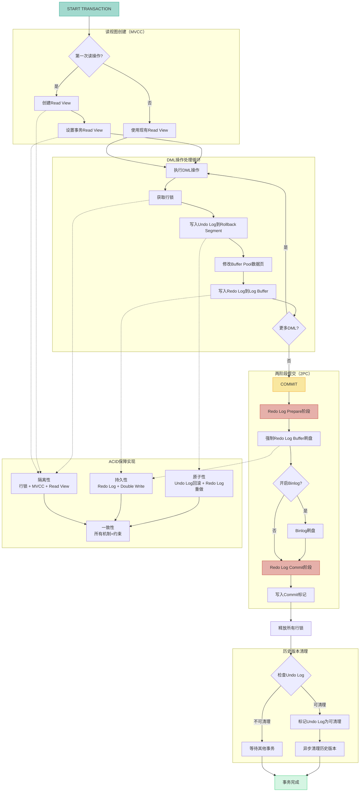
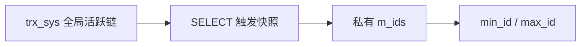
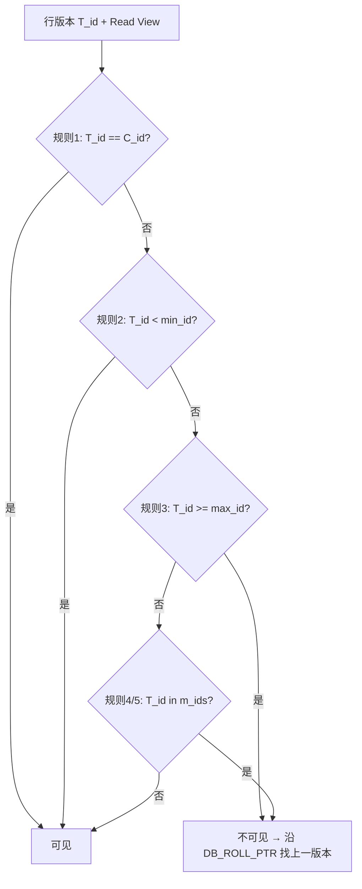

---
{"dg-publish":true,"permalink":"/Work/Databases/MySql/Basics/Mysql Basics/","title":"Mysql Basics","tags":["#flashcards"],"noteIcon":"","created":"2026-03-10T22:34:01.000+08:00","updated":"2026-07-17T11:54:44.180+08:00","dg-note-properties":{"title":"Mysql Basics","tags":["#flashcards"],"reference linking":null}}
---

# 概念
## DBMS
DBMS(Database Management System)「数据库管理系统」: 用于管理、组织和控制数据库的软件。
### 1. 核心类型
* **RDBMS (关系型数据库)**：以**表 (行/列)** 形式存储，数据间有关联 (Key)。
* **KVDBMS (键值对数据库)**：通过**唯一键**访问 **值**。
* **ODBMS (对象型数据库)**：存储对象数据，支持面向对象特性。
### 2. 常见 RDBMS 实例
* MySQL
* Oracle
* SQL Server
* SQLite
* DB2
### 3. RDBMS 数据结构层级
1.  **数据库** (Database)
2.  **表** (Table)
3.  **列** (Column) - 属性
4.  **行** (Row) - 记录
## SQL
SQL(Structured Query Language)「结构化查询语言」是用于管理 RDBMS 的标准语言分为**DQL、DML、DDL、DCL**
# 认识
## 下载
[http://www.mysql.com/downloads/mysql/](http://www.mysql.com/downloads/mysql/)
## 基本操作
服务器，客户端
连接：`-h 连接域名(默认是127.0.0.1) -u 用户名 -p密码(-p后不允许有空格) -P 端口号`
```mysql
mysql -h 127.0.0.1 -u root –proot -P 3306
```
# 常用数据类型
### 整数类型
`tinyint、smallint、mediumint、int/integer、bigint`
#### 特点:
1. 不设置无符号还是有符号,**默认是有符号**,如果想设置无符号,需要添加**unsigned**关键字
2. 插入的数值超出了整型的范围,会报**out of range异常**,并且插入临界值 **(字符范围最大值或最小值)**
3. 不设置长度,会有默认的长度, 长度代表显示最大宽度,不够会用0在左侧填充,但必须搭配**zerofill**使用

| 整数类型         |  字节  |  范围                                           | 大概位数 |
| ------------ | ---- | --------------------------------------------- | ---- |
| Tinyint      | 1    | 有符号：-128~127                                  | 百    |
|              |      | 无符号：0~255                                     |      |
| Smallint     | 2    | 有符号：-32768~32767                              | 万    |
|              |      | 无符号：0~65535                                   |      |
| Mediumint    | 3    | 有符号：-8388608~8388607                          | 百万   |
|              |      | 无符号：0~1677215                                 |      |
| Int、integer  | 4    | 有符号：-2147483648~2147483647                    | 十亿   |
|              |      | 无符号：0~4294967295                              |      |
| Bigint       | 8    | 有符号： -9223372036854775808~9223372036854775807 | 最大   |
|              |      | 无符号：0~ 9223372036854775807\*2+1               |      |
### 小数类型
#### 1.浮点型
float(M, D) 、double(M, D)
#### 2.定点型
decimal(M, D) (定点型的**精确度较高**,如果要求插入数值的精度较高如**货币运算等则考虑使用**)
##### 精度定义
1. **M (总长度)**
    - 表示**整数部分 + 小数部分**的总位数长度。
2. **D (小数位数)**
    - 表示小数部分的位数长度。
3. **超限处理：** 如果插入的数值长度或精度超过 `(M, D)` 的定义范围，系统会插入**临界值**（而不是报错）。
### 默认值 (省略 M 和 D)
- 如果只写 `DECIMAL`：
    - **M 默认值为 10**。
    - **D 默认值为 0**。
> **对比：** `FLOAT` 和 `DOUBLE` (浮点型) 在省略精度时，它们的精度会**根据插入的实际数值**来决定。

| 浮点数类型  | 字节  | 范围 |
| - | - | - |
| Float(M,D) | 4 | ±1.75494351E-38~±3.402823466E+38 |
| Double(M,D) | 8 | ±2.2250738585072014E-308~ <br>±1.7976931348623157E+308  |
| 定点数类型  |  字节  | 范围 |
| Dec(M,D)<br>Decimal(M,D) | 对DECIMAL(M,D) ，如果M&gt;D，为M+2否则为D+2 | 最大取值范围与double相同,给定decimal的有效取值范围由M和D决定 |
### 字符类型
#### 较短文本
##### varchar(M) 、char(M)
| 类型 | 写法 | M的意思 | 特点 | 空间的消耗 | 效率 |
| - | - | - | - | - | - |
| char | char(M) | 最大的字符数,可以省略,默认为1 | 固定长度的字符 | 比较耗费 | 高 |
| varchar | varchar(M) | 最大的字符数,不可以省略 | 可变长度的字符 | 比较节省 | 低 |
**使用场景**：存储性别用char,存储姓名用varchar

| 字符串类型      | 最多字符数 | 描述及存储需求        |
| ---------- | ----- | -------------- |
| char(M)    | M     | M为0~255之间的整数   |
| varchar(M) | M     | M为0~65535之间的整数 |
##### binary、varbinary
**说明**: 类似于char和varchar,不同的是它们**包含二进制字符串(如图片)** 而不包含非二进制字符串。
##### enum
**说明**: 又称为**枚举类型**,要求插入的值必须属于列表中指定的值之一。
- 如果列表成员为1-255,则需要1个字节存储
- 如果列表成员为255-65535,则需要2个字节存储
- 最多需要65535个成员!
##### set
**说明**: 和enum类型类似，里面可以保存0~64个成员。
**与enum区别是**: set类型一次可以选取多个成员，而enum只能选一个根据成员个数不同，存储所占的字节也不同

| 成员数 | 字节数 |
| - | - |
| 1~8 | 1 |
| 9~16 | 2 |
| 17~24 | 3 |
| 25~32 | 4 |
| 33~64  | 8 |
```mysql
CREATE TABLE `test_table` (
    `id` INT(11) PRIMARY KEY AUTO_INCREMENT,
    `first_name` CHAR(25),
    `last_name` VARCHAR(25),
    `icon` BINARY(25),
    `img` VARBINARY(25),
    `sex` ENUM('男','女'),
    `follow` SET('a', 'b', 'c')
);

INSERT INTO test_table
VALUES (1, 'first_name', 'last_name', 'aaa', 'bbb', '男', 'a,b')
```
#### 较长文本
| 类型         | 大小                | 用途                 |
| ---------- | ----------------- | ------------------ |
| TINYBLOB   | 0-255字节           | 不超过 255 个字符的二进制字符串 |
| TINYTEXT   | 0-255字节           | 短文本字符串             |
| BLOB       | 0-65 535字节        | 二进制形式的长文本数据        |
| TEXT       | 0-65 535字节        | 长文本数据              |
| MEDIUMBLOB | 0-16 777 215字节    | 二进制形式的中等长度文本数据     |
| MEDIUMTEXT | 0-16 777 215字节    | 中等长度文本数据           |
| LONGBLOB   | 0-4 294 967 295字节 | 二进制形式的极大文本数据       |
| LONGTEXT   | 0-4 294 967 295字节 | 极大文本数据             |
### 日期时间类型
date(日期)、datetime(日期时间)、timestamp(时间戳)、time(时间)、year(年)

| 日期和时间类型 | 字节 | 最小值 | 最大值 |
| - | - | - | - |
| date | 4 | 1000-01-01 | 9999-12-31 |
| datetime | 8 | 1000-01-01 00:00:00 | 9999-12-31 23:59:59 |
| timestamp | 4 | 19700101080001 | 2038年的某个时刻 |
| time | 3 | -838:59:59 | 838:59:59 |
| year | 1 | 1901 | 2155 |
**datetime和timestamp的区别**
1. 取值范围:
	1. Timestamp 19700101080001~2038年的某个时间 **(支持的时间范围较小)**
	2. Datetime：取值范围：1000-1-1~9999-12-31
2. timestamp和**实际时区**有关,更能反映实际的日期,而datetime则只能反映出**插入时的当地时区**
3. timestamp的属性受 **Mysql** 版本和 **SQLMode** 的影响很大
```mysql
CREATE TABLE `test_table` (
  `id` int(11) PRIMARY KEY AUTO_INCREMENT,
  `t1` date default null,
  `t2` datetime default null,
  `t3` timestamp null default null,
  `t4` time default null,
  `t5` year(4) default null
);
INSERT INTO test_table
VALUES(
    1,
    '2018-12-19',
    '2018-12-19 14:02:00',
    '2018-12-19 14:02:00',
    '14:02:00',
    '2018'
)
```
# 基本语法
### select
```
select 列名称 from 表名称

select * from 表名称
```
### join
```mysql
join……on(连接表)、left join(以左边表为基准链接)、right join(以右边表为基准链接)
```
### as
```mysql
select 列名称 as 别名 from 表名称 as 别名
```
### Order by
```mysql
……from 表名 order by 列名1 asc, 列名2 desc
```
### 示例
```mysql
# 别名
select
    field,
    field2
from `table` as a
left join `table2` as b on a.id = b.aid

# 降序排列
select * from user join ext on id=eid order by id desc, info desc
```
### where
#### 逻辑运算符
```
=、<>、>=、<=、<、>
and、or、not、()、binary(区分大小写)
```
#### 空判断
```
is null、is not null(不为空)、ifnull()
```
#### 范围
```
between 起始值 and 结束值、in() (选择指定条件)、not in()(指定条件除外的条件)
```
#### 模式
`"_"`允许一个任意字符  `"__"`允许两个任意字符  `"%"`允许许多个任意字符
```
like ‘值%’、not like ‘值%’、%，_
```
#### 示例
```mysql
select * from user where name is null; # 查询name为null的数据
select * from user where name is not null; # 查询name不为null的数据

select ifnull(name, '匿名') from user; # name为null则查询name为匿名
select * from user binary name = 'a'; # 区分大小写

# 显示id为2到4的数据between
select * from user where id between 2 and 4;

# 显示id为1 2 3的数据in
select * from user where id in(1, 2, 3);

# like联合concat使用
select * from contact where name like concat('%', 变量名, '%');
# 模糊查找like
select * from user where name like '%关键字%';
select * from user where name not like '%关键字%';
select * from user where name like '_关键字_';
```
# 表关系
### 一对一
```mysql
DROP DATABASE IF EXISTS test_relation;
CREATE DATABASE test_relation CHARSET=UTF8MB4;
USE test_relation;

CREATE TABLE administrator(
    id INT(11) PRIMARY KEY AUTO_INCREMENT,
    name VARCHAR(25)
);
INSERT INTO administrator(name) VALUES
('超级管理员'),
('管理员'),
('普通用户');

CREATE TABLE user(
    id INT(11) PRIMARY KEY AUTO_INCREMENT,
    login VARCHAR(25),
    password VARCHAR(25),
    aid INT(11) NOT NULL,
    CONSTRAINT `fk_aid` FOREIGN KEY(aid) REFERENCES administrator(id)
);
INSERT INTO user(login, password, aid) VALUES
('admin1', '123456', 1),
('admin2', '123456', 2),
('admin3', '123456', 3),
('admin4', '123456', 3),
('admin5', '123456', 3),
('admin6', '123456', 3);

# 一对一关联查询
SELECT a.id, a.name, b.login, b.password, b.aid
FROM administrator AS a
JOIN user AS b ON a.id = b.aid;
```
### 多对多关联、联合主键
```mysql
# 清除表
DROP TABLE IF EXISTS `teacher`;
DROP TABLE IF EXISTS `student`;
DROP TABLE IF EXISTS `teacher_student_map`;
# 老师表
CREATE TABLE `teacher`
(
  `id`   INT(11) UNSIGNED PRIMARY KEY AUTO_INCREMENT,
  `name` VARCHAR(25)
);
# 学生表
CREATE TABLE `student`
(
  `id`   INT(11) UNSIGNED PRIMARY KEY AUTO_INCREMENT,
  `name` VARCHAR(25)
);
# 老师学生对照表
CREATE TABLE `teacher_student_map`
(
  `teacher_id` INT(11) UNSIGNED DEFAULT 0,
  `student_id` INT(11) UNSIGNED DEFAULT 0,
  PRIMARY KEY (`teacher_id`, `student_id`), # 联合主键
  CONSTRAINT `fk_teacher_id` FOREIGN KEY (`teacher_id`) REFERENCES `teacher` (`id`),
  CONSTRAINT `fk_teacher_id` FOREIGN KEY (`student_id`) REFERENCES `student` (`id`)
);
INSERT INTO `student`(`name`)
VALUES ('魏同学'),
       ('朱同学'),
       ('宋同学');
INSERT INTO `teacher`(`name`)
VALUES ('魏老师'),
       ('朱老师'),
       ('宋老师');
INSERT INTO `teacher_student_map`(`teacher_id`, `student_id`)
VALUES (1, 1),
       (1, 2),
       (1, 3),
       (2, 1),
       (2, 2),
       (2, 3),
       (3, 1),
       (3, 2),
       (3, 3);

# 多对多关联查询(查询每个老师下面的同学信息)
SELECT teacher.id, teacher.name, GROUP_CONCAT(student.name) AS student_name
FROM `teacher`
       JOIN `teacher_student_map` ON teacher.id = teacher_student_map.teacher_id
       JOIN `student` ON student.id = teacher_student_map.student_id
GROUP BY teacher.id;
```
# SQL
## 测试sql
[myemployees.sql](https://weichengjun2.dpdns.org/d/Attachment/myemployees.sql?sign=W84_760ZsUyVLFIoMV0a7IsPqnhdF5AnoO7HSbOz5kY=:0)
[girls.sql](https://weichengjun2.dpdns.org/d/Attachment/girls.sql?sign=67B_yNtbi8jD_Sq9ua2vh0NIVP-BWkrWp-tbUq1xRus=:0)
## SQL 语言分类完整对比
| 对比项           | **DQL**                            | **DML**                          | **DDL**                                     | **DCL**                              | **TCL**                                                       |
| :------------ | :--------------------------------- | :------------------------------- | :------------------------------------------ | :----------------------------------- | :------------------------------------------------------------ |
| **全称**        | Data Query Language                | Data Manipulation Language       | Data Definition Language                    | Data Control Language                | Transaction Control Language                                  |
| **核心目的**      | **查询**数据                           | **操作/修改**数据内容                    | **定义/修改**数据库结构                              | **控制权限**和安全                          | **控制事务**执行                                                    |
| **关键操作（关键字）** | `SELECT`                           | `INSERT`、`UPDATE`、`DELETE`       | `CREATE`、`ALTER`、`DROP`、`TRUNCATE`、`RENAME` | `GRANT`、`REVOKE`                     | `BEGIN` / `START TRANSACTION`、`COMMIT`、`ROLLBACK`、`SAVEPOINT` |
| **操作对象**      | 表中的数据（只读）                          | 表中的数据（行级）                        | 数据库、表、索引、视图等结构                              | 用户/角色权限                              | 事务边界与状态                                                       |
| **是否改变数据**    | 否（只读）                              | 是                                | 否（改结构，不直接改业务数据）                             | 否                                    | 否（控制是否持久化变更）                                                  |
| **是否改变结构**    | 否                                  | 否                                | 是                                           | 否                                    | 否                                                             |
| **是否可回滚**     | —                                  | 通常可以（在事务内）                       | 通常不可以（隐式提交）                                 | 通常不可以                                | 本身即用于回滚/提交                                                    |
| **是否自动提交**    | 不涉及                                | 取决于事务设置                          | 多数数据库隐式提交                                   | 多数隐式提交                               | 显式控制                                                          |
| **典型示例**      | `SELECT * FROM users WHERE id = 1` | `INSERT INTO users VALUES (...)` | `CREATE TABLE users (...)`                  | `GRANT SELECT ON db.* TO 'user'@'%'` | `START TRANSACTION; ... COMMIT;`                              |
| **执行频率**      | 极高                                 | 高                                | 低（建表、改表时）                                   | 很低（初始化/运维）                           | 高（业务写操作常包在事务里）                                                |
| **权限要求**      | 需 `SELECT` 权限                      | 需 `INSERT`/`UPDATE`/`DELETE`     | 需 `CREATE`/`ALTER`/`DROP` 等                 | 通常仅 DBA / 管理员                        | 与 DML 写操作权限相关                                                 |
| **备注**        | 有时被归入 DML                          | 核心业务写操作                          | `TRUNCATE` 在 MySQL 中属 DDL                   | MySQL 无 `DENY`，用撤销权限实现               | 保证 ACID 中的 A、C、I                                              |
### 补充说明
1. **DQL 与 DML**：教材常把 `SELECT` 单独列为 DQL；也有分类把 DQL 并入 DML，只保留四类（DQL/DML/DDL/DCL）。
2. **`TRUNCATE`**：清空表、重置自增，在 MySQL 中按 **DDL** 处理，行为接近 `DROP` + 重建，不是 DML 里的 `DELETE`。
3. **`DENY`**：SQL Server 有 `DENY`；**MySQL 没有 `DENY`**，一般用 `REVOKE` 或不授予权限来限制。
4. **DCL 权限**：涉及安全，通常只有 DBA、管理员或 `root` 等高级账号可执行。
## 定义语言(DDL)
```mysql
CREATE DATABASE 数据库名; # 创建数据库
DROP DATABASE 数据库名; # 删除数据库
SHOW DATABASES; # 查看数据库
USE 数据库名; # 选择数据库
CREATE TABLE 表名; # 创建数据表
SHOW TABLES; # 查看数据库
DESC 表名; # 选择数据表
SHOW CREATE TABLE O2O_CITY \G; # 查看表结构 \G格式化
DROP TABLE 表名; # 删除表，表结构一并删除
# 清空数据,表结构不删除,且初始化AUTO_INCREMENT从1开始,没有返回值
TRUNCATE TABLE 表名;
SHOW VARIABLES LIKE '%AUTO_INCREMENT%'; # 查看自增参数
EXPLAIN SELECT * FROM O2O_CITY WHERE ID=1; # 查看索引信息
```
#### charset=UTF8
```mysql
DROP DATABASE IF EXISTS test_database;
DROP TABLE IF EXISTS test_table;

# 创建数据库并设置字符集
# 1
CREATE DATABASE test_database CHARSET=UTF8;
# 2
CREATE DATABASE test_database DEFAULT CHARACTER SET UTF8MB4
COLLATE UTF8MB4_GENERAL_CI;

USE test_database;
CREATE TABLE test_table(
    id INT(11) PRIMARY KEY AUTO_INCREMENT
);
```
#### alter {table|database}
```mysql
# 更改数据库编码
ALTER DATABASE test_database CHARACTER SET UTF8MB4;
# 更改表编码
ALTER TABLE test CHARACTER SET UTF8MB4;
# 更改表中所有字段编码
ALTER TABLE test CONVERT TO CHARACTER SET UTF8MB4;
```
#### 修改表和字段
```mysql
# 添加列
ALTER TABLE 表名 ADD 列名 新列类型;
# 添加列到指定列后面
ALTER TABLE 表名 ADD 列名 新列类型 AFTER 列名;
# 添加列到最前面
ALTER TABLE 表名 ADD 列名 新列类型 FIRST;

# 删除列
ALTER TABLE 表名 DROP 列名;

# 修改列的类型、约束
ALTER TABLE 表名 MODIFY 列名 新列类型;

# 修改列名、类型
ALTER TABLE 表名 CHANGE 旧列名 新列名 新/旧列类型;

# 修改表名
ALTER TABLE 表名 RENAME 新表名;
RENAME TABLE 表名 TO 新表名;
# 修改表注释
ALTER TABLE 表名 COMMENT '测试表';
```
#### 导入、导出
##### 导入
(由于mysqldump导出的是完整的SQL语句，所以用mysql客户程序很容易就能把数据导入了)
```shell
mysql -u root -p new_oa_test < t1.sql
```
##### 导出
```shell
# 导出库
# 1.导出结构、不导出数据
mysqldump --opt -d new_oa_test -u root -p > t1.sql
# 2.不导出结构、导出数据
mysqldump -t new_oa_test -u root -p > t2.sql
# 3.导出表结构、数据
mysqldump new_oa_test -u root -p > t3.sql

# 导出特定表
# 1.导出结构、不导出数据
mysqldump -d new_oa_test -uroot -p --tables staff > staff.sql
# 2.不导出结构、导出数据
mysqldump -t new_oa_test -uroot -p --tables staff > staff.sql
# 3.导出表的数据及结构
mysqldump new_oa_test -uroot -p --tables staff > staff.sql

# 备份数据库
mysqldump new_oa_test >new_oa_test_bk
mysqldump -A -u root -p new_oa_test > new_oa_test_bk
mysqldump -d -A --add-drop-table -u root -p > t1_bk.sql
```
## 查询语言(DQL)
### 逻辑权重排序
#### 核心语法
`ORDER BY CASE WHEN [条件] THEN [权重1] ELSE [权重2] END [ASC|DESC]`
#### 逻辑解析
1. **本质**：在排序前，先通过逻辑判断为每一行数据临时生成一个“虚拟权重列”。
2. **执行流程**：数据库先计算 `CASE WHEN` 的值，再根据这个值进行物理位置排序。
3. **布尔转换**：在 SQL 中，`IS NOT NULL` 返回布尔值，结合 `CASE WHEN` 可以人为定义 `1`（真）或 `0`（假）的先后顺序。
#### 示例代码
```mysql
# 需求：将有权重的记录置顶，NULL 的排在后面
SELECT *
FROM `prts`
ORDER BY CASE WHEN `weight` IS NOT NULL THEN 1 ELSE 0 END DESC, `weight` DESC;

# 需求：特定 ID 的数据强制置顶（如：广告位、公告）
SELECT *
FROM `news`
ORDER BY CASE WHEN `id` = 99 THEN 1 ELSE 0 END DESC, `publish_time` DESC;
```
#### 特点与注意事项
* **层级性**：通常作为第一排序条件，用来区分数据的“性质”（如：置顶 vs 普通）。
* **灵活性**：比简单的 `ASC/DESC` 更强大，可以实现非线性的自定义顺序。
* **数据库差异**：
    * **MySQL**: 可以简写为 `ORDER BY (weight IS NOT NULL) DESC`（布尔值直接参与排序）。
    * **Oracle/PostgreSQL**: 提供原生 `NULLS FIRST` 或 `NULLS LAST` 语法，效果类似但 `CASE WHEN` 兼容性最广。
#### 关联知识：多字段排序
* **规则**：`ORDER BY` 后可以跟多个字段，用逗号隔开。只有当前一个字段的值相同时，才会启用后一个字段的排序规则。
```mysql
ORDER BY
    CASE WHEN `prts`.`weight` IS NOT NULL THEN 1 ELSE 0 END DESC, -- 第一优先级：有值的排前面
    `prts`.`weight` DESC, -- 第二优先级：有值的按照权重从大到小排
    `created_at` DESC -- 第三优先级：权重相同的按时间排
```
### limit、distinct
`limit()用法: offset 起始索引,从0开始, size 显示条数`

特点:**limit语句放在查询语句的最后**
```mysql
SELECT 列名 FROM 表名 LIMIT((页数-1)*size, size);
SELECT DISTINCT job_id FROM employees LIMIT 0, 20;
```
笛卡尔乘积：如果连接条件省略或无效则会出现
```mysql
SELECT * FROM employees a, departments b; # SQL92写法
```
join on 、inner join on、equi join(等同于join on)、natural join
```mysql
# 内联查询,两张表的交集，和join on效果一样，可以省略inner
SELECT *
FROM employees AS a
INNER JOIN departments AS b ON a.department_id = b.department_id;
```
### natural join
自然连接是在两张表中寻找那些**数据类型**和**列名**都**相同的字段**, 然后**自动地**将他们连接起来, 并返回所
有符合条件按的结果。
**注意**: 如果两个表有多个字段都满足有相同名称和类型，那么他们**都会被作为自然连接的条件**
```mysql
# 自然连接查询
SELECT *
FROM locations AS a
NATURAL JOIN departments AS b;
```
**注:三种查询方式,结果是一样的,表的连接顺序可变**
```mysql
# SQL92 语法
SELECT *
FROM employees a, departments b
WHERE a.department_id = b.department_id;

# SQL99 语法
SELECT *
FROM employees a
JOIN departments b ON a.department_id = b.department_id;

SELECT *
FROM employees a
INNER JOIN departments b ON a.department_id = b.department_id;
```
### using()
使用指定键进行关联,要求连接两表的该字段名必须一致
```mysql
SELECT *
FROM locations AS a
JOIN departments AS b USING(location_id);
```
### cross join、left join、right join、full outer join(不支持)、self join、
```mysql
# 交叉连接(笛卡尔积)
SELECT b.*, bo.*
FROM beauty b
CROSS JOIN boys bo;

# 左联表 以左边为主查询
select * from table1 left join table2 on id=table1.id
# 右联表 以右边为主查询
select * from table1 right join table2 on id=table1.id

# 自身联表
SELECT a.last_name as '上司', b.last_name as '员工'
FROM employees a
JOIN employees b ON a.`manager_id` = b.`employee_id`;
```
### union、union all
**使用场景: 要查询的结果来自多个表, 如全站搜索**
**注: 查询字段的 数量、数据类型、顺序必须一致。**
```mysql
# 多张表一起查询，会剔除重复数据，节约计算机性能
select name,info from table1 left join table2 on id=table1.id
union
select name,info from table1 right join table2 on id=table1.id;

# 多张表一起查询，会全部显示
select name,info from table1 left join table2 on id=table1.id
union all
select name,info from table1 right join table2 on id=table1.id;
```
### sub queries
子查询
**含义:**
一条查询语句中又嵌套了另一条完整的select语句，其中被嵌套的select语句，称为子查询或内查询
在外面的查询语句，称为主查询或外查询
**特点:**
1. 子查询都放在小括号内
2. 子查询可以放在from、select、where、having、exists后面，但一般放在条件的右侧
3. 子查询优先于主查询执行，主查询使用了子查询的执行结果**
4. 子查询根据查询结果的行数不同分为以下两类：
#### where后面
##### ① 单行单列子查询
一般搭配单行操作符使用：> < = <> >= <=
非法使用子查询的情况：
1. 子查询的结果为一组值
2. 子查询的结果为空
```mysql
# 案例1: 谁的工资比Abel高?
SELECT *
FROM employees
WHERE salary > (
    SELECT salary
    FROM employees
    WHERE last_name = 'Abel'
);

# 案例2:
# 返回job_id与141号员工相同,工资比143号员工多的员工姓名、job_id、工资
SELECT last_name, job_id, salary
FROM employees
WHERE job_id = (
    SELECT job_id
    FROM employees
    WHERE employee_id = 141
) AND salary > (
    SELECT salary
    FROM employees
    WHERE employee_id = 143
);

# 案例3: 查询最低工资大于50号部门最低工资的部门id和其最低工资
SELECT MIN(salary), department_id
FROM employees
GROUP BY department_id
HAVING MIN(salary) > (
    SELECT MIN(salary)
    FROM employees
    WHERE department_id = 50
);
```
##### ② 多行单列子查询
一般搭配多行操作符使用：any、all、in、not in
in: 属于子查询结果中的任意一个就行
any和all往往可以用其他查询代替
```mysql
# 案例1: 返回location_id是1400或1700的部门中的所有员工姓名
SELECT last_name
FROM employees
WHERE department_id IN(
    SELECT DISTINCT department_id
    FROM departments
    WHERE location_id IN (1400, 1700)
);

# 案例2:
# 返回其它工种中比job_id为'IT_PROG'部门任一工资低的员工的
# 员工号、姓名、job_id以及salary
SELECT last_name, employee_id, job_id, salary
FROM employees
WHERE salary < ANY (
    SELECT DISTINCT salary
    FROM employees
    WHERE job_id = 'IT_PROG'
) AND job_id <> 'IT_PROG';

# 案例3:
# 返回其它部门中比job_id为'IT_PROG'部门所有工资都低的员工的
# 员工号、姓名、job_id以及salar
SELECT last_name, employee_id, job_id, salary
FROM employees
WHERE salary < ALL (
    SELECT DISTINCT salary
    FROM employees
    WHERE job_id = 'IT_PROG'
) AND job_id <> 'IT_PROG';
#或
SELECT last_name, employee_id, job_id, salary
FROM employees
WHERE salary < (
    SELECT MIN(salary)
    FROM employees
    WHERE job_id = 'IT_PROG'
) AND job_id <> 'IT_PROG';
```
##### ③ 多行多列子查询(结果集一行多列或多行多列)
```mysql
# 案例: 查询员工编号最小并且工资最高的员工信息
SELECT *
FROM employees
WHERE (employee_id, salary) = (
    SELECT MIN(employee_id), MAX(salary)
    FROM employees
);
```
#### select后面
```mysql
# 案例: 查询每个部门的员工个数
SELECT (
    SELECT COUNT(*)
    FROM employees
    WHERE department_id = d.department_id
) AS counts
FROM departments AS d;

# 案例2: 查询员工号=102的部门(仅支持标量子查询，即只能有一行一列)
SELECT (
    SELECT d.department_name
    FROM departments d
    JOIN employees e ON d.department_id = e.department_id
    WHERE e.employee_id=102
) 部门名;
```
#### from后面
将子查询结果集充当一张表，要求必须起别名
```mysql
# 案例: 查询每个部门的平均工资的工资等级
# 写法一(sql 92)
SELECT a.department_id, a.avg, b.grade_level
FROM (
    SELECT AVG(salary) AS avg, department_id
    FROM employees
    GROUP BY department_id
) a, job_grades b
WHERE a.avg BETWEEN b.lowest_sal AND b.highest_sal;

# 写法二(sql 99)(筛掉没有部门的员工的平均薪资)
SELECT c.avg, c.department_id, d.grade_level
FROM (
	SELECT AVG(salary) as avg, a.department_id,
	FROM departments a
	LEFT JOIN employees b ON a.department_id = b.department_id
	GROUP BY department_id
) c
INNER JOIN job_grades d
ON c.avg BETWEEN d.lowest_sal AND d.highest_sal;
```
#### exists后面
(相关子查询)
语法: exists(完整的查询语句) 结果: 1或0
```mysql
# 案例1: 查询有员工的部门名
# 写法一
SELECT department_name
FROM departments d
WHERE EXISTS(
    SELECT *
    FROM employees e
    WHERE d.department_id = e.department_id
);
# 写法二
SELECT department_name
FROM departments
WHERE department_id IN (
    SELECT DISTINCT department_id
    FROM employees
);

# 案例2: 查询没有女朋友的男神信息
# 写法一
SELECT *
FROM boys b
WHERE NOT EXISTS(
    SELECT *
    FROM beauty
    WHERE b.id = boyfriend_id
);
# 写法二
SELECT *
FROM boys b
WHERE b.id NOT IN(
    SELECT DISTINCT boyfriend_id
    FROM beauty
);
```
### exists、not exists;
in、not in、any|some(和子查询返回的某一个值比较)、all(和子查询返回的所有值比较)
### 分组函数
group by  having  with rollup、group_concat()、count()、max()、min()、sum()、avg()、
#### having
注: having  聚合函数条件一般写在group by的后面, 如不写在group后相当于where

误区：不要错误的认为having和group by 必须配合使用。
[mysql group by结合排序 - mabiao008 - 博客园 (cnblogs.com)](https://www.cnblogs.com/mabiao008/p/13183311.html)

下面以一个例子来具体的讲解：
##### 1. where和having都可以使用的场景
```mysql
SELECT `goods_price`, `goods_name` FROM `sw_goods` WHERE `goods_price` > 100
SELECT `goods_price`, `goods_name` FROM `sw_goods` HAVING `goods_price` > 100
```
解释：上面的having可以用的前提是我已经筛选出了goods_price字段，在这种情况下和where的效果是等效的，但是如果我没有select goods_price 就会报错！！

**因为having是从查询的字段中再筛选，而where是从数据表中的字段直接进行的筛选的。**
##### 2. 只可以用where，不可以用having的情况
```mysql
SELECT `goods_name`, `goods_number` FROM `sw_goods` WHERE `goods_price` > 100
# `报错！！！因为前面并没有筛选出goods_price` 字段
SELECT `goods_name`, `goods_number` FROM `sw_goods` HAVING `goods_price` > 100
```
##### 3. 只可以用having，不可以用where情况
查询每种goods_category_id商品的价格平均值，获取平均价格大于1000元的商品信息
>注: 起别名时, 用反引号(``), 别用单双引号('')(""), 否则会导致筛选失效
```mysql
# 注: 起别名时, 用反引号(``), 别用单双引号('')(""), 否则会导致筛选失效
SELECT `goods_category_id`, avg(`goods_price`) AS `ag` FROM `sw_goods` GROUP BY `goods_category` HAVING `ag` > 1000
# `报错！！因为from` sw_goods 这张数据表里面没有ag这个字段
SELECT `goods_category_id`, avg(`goods_price`) AS `ag` FROM `sw_goods` WHERE `ag` > 1000 GROUP BY `goods_category`
```
>注意：**where** 后面要跟的是数据 **表里的字段**，如果我把ag换成avg(goods_price)也是错误的！因为表里没有该字段。而 **having** 后面要跟的是**数据集结果的字段**。
#### group by
1. group by的含义: 将查询结果按照1个或多个字段进行分组，字段值相同的为一组
2. group by可用于单个字段分组，也可用于多个字段分组
```mysql
select * from employee;
+------+------+--------+------+------+-------------+
| num  | d_id | name   | age  | sex  | homeaddr    |
+------+------+--------+------+------+-------------+
|    1 | 1001 | 张三   |   26 | 男   | beijinghdq   |
|    2 | 1002 | 李四   |   24 | 女   | beijingcpq   |
|    3 | 1003 | 王五   |   25 | 男   | changshaylq  |
|    4 | 1004 | Aric   |   15 | 男   | England     |
+------+------+--------+------+------+-------------+

select * from employee group by d_id,sex;
+------+------+--------+------+------+-------------+
| num  | d_id | name   | age  | sex  | homeaddr    |
+------+------+--------+------+------+-------------+
|    1 | 1001 | 张三   |   26 | 男   | beijinghdq   |
|    2 | 1002 | 李四   |   24 | 女   | beijingcpq   |
|    3 | 1003 | 王五   |   25 | 男   | changshaylq  |
|    4 | 1004 | Aric   |   15 | 男   | England     |
+------+------+--------+------+------+-------------+

select * from employee group by sex;
+------+------+--------+------+------+------------+
| num  | d_id | name   | age  | sex  | homeaddr   |
+------+------+--------+------+------+------------+
|    2 | 1002 | 李四   |   24 | 女   | beijingcpq  |
|    1 | 1001 | 张三   |   26 | 男   | beijinghdq  |
+------+------+--------+------+------+------------+
```
根据sex字段来分组，sex字段的全部值只有两个('男'和'女')，所以分为了两组当group by单独使用时，只显示出每组的第一条记录,**所以group by单独使用时的实际意义不大**
#### group by + having
1. having 条件表达式：用来分组查询后指定一些条件来输出查询结果(分组后的筛选)
2. having作用和where一样，但having只能用于group by
```mysql
SELECT
    sex,
    count( sex )
FROM
    employee
GROUP BY
    sex
HAVING
    count( sex ) > 2;
+------+------------+
| sex  | count(sex) |
+------+------------+
| 男   |          3 |
+------+------------+
```
#### group by + group_concat()
`GROUP_CONCAT()` 是 MySQL 的**聚合函数**，将分组内多条记录的某个（或多个）字段值**拼接成一条字符串**返回。常用于「一行展示一对多关系」，例如每个部门对应的所有员工姓名、每个订单下的所有商品名。

**完整语法：**
```sql
GROUP_CONCAT(
    [DISTINCT] expr [, expr ...]
    [ORDER BY {unsigned_integer | col_name | expr} [ASC | DESC] [, col_name ...]]
    [SEPARATOR str_val]
)
```
| 子句 | 说明 |
|------|------|
| `expr` | 要拼接的表达式，可以是字段、常量或函数结果；多个表达式用逗号分隔 |
| `DISTINCT` | 去重，同一分组内重复值只保留一次 |
| `ORDER BY` | 拼接**之前**先对组内值排序；默认升序 `ASC`，可用 `DESC` 降序 |
| `SEPARATOR` | 分隔符，默认是英文逗号 `,`；设为 `''` 表示无分隔符直接相连 |
**返回值与 NULL 行为：**
- 分组内**没有非 NULL 值**时，返回 `NULL`（不是空字符串 `''`）
- `GROUP_CONCAT()` **自动忽略 NULL**，不会把 `NULL` 拼进结果
- 返回类型：默认 `VARCHAR`；当 `group_concat_max_len > 512` 时返回 `BLOB`
- 结果长度受 `group_concat_max_len` 限制（默认 **1024** 字节），超出部分会被**截断**；实际上限还受 `max_allowed_packet` 约束

**修改最大长度（运行时）：**
```mysql
-- 仅当前会话
SET SESSION group_concat_max_len = 4096;

-- 全局（需 SUPER 权限，重启后仍生效需写入 my.cnf）
SET GLOBAL group_concat_max_len = 4096;
```
##### 1. 基础用法
`group_concat(字段名)` 可作为 SELECT 输出列，配合 `GROUP BY` 将每组某字段的值集合拼成字符串。
```mysql
select sex, group_concat(name) from employee group by sex;
+------+--------------------+
| sex  | group_concat(name) |
+------+--------------------+
| 女   | 李四                |
| 男   | 张三,王五,Aric       |
+------+--------------------+

select sex, group_concat(d_id) from employee group by sex;
+------+--------------------+
| sex  | group_concat(d_id) |
+------+--------------------+
| 女   | 1002               |
| 男   | 1001,1003,1004     |
+------+--------------------+
```
##### 2. DISTINCT 去重
同一分组内字段值有重复时，加 `DISTINCT` 只保留唯一值。
```mysql
-- 假设 employee 表 d_id 有重复
select sex, group_concat(d_id) from employee group by sex;
-- 男: 1001,1003,1004,1001  （含重复）

select sex, group_concat(distinct d_id) from employee group by sex;
-- 男: 1001,1003,1004       （去重后）
```
##### 3. ORDER BY 排序
`ORDER BY` 写在 `GROUP_CONCAT` 内部，只影响**组内**拼接顺序，与外层 SQL 的 `ORDER BY` 无关。
```mysql
-- 按年龄升序拼接
select sex, group_concat(name order by age asc) from employee group by sex;
+------+--------------------+
| sex  | group_concat(name) |
+------+--------------------+
| 女   | 李四                |
| 男   | Aric,王五,张三       |
+------+--------------------+

-- 按年龄降序拼接
select sex, group_concat(name order by age desc) from employee group by sex;
+------+--------------------+
| sex  | group_concat(name) |
+------+--------------------+
| 女   | 李四                |
| 男   | 张三,王五,Aric       |
+------+--------------------+
```
##### 4. SEPARATOR 自定义分隔符
```mysql
-- 空格分隔
select sex,
       group_concat(name order by age desc separator ' ')
from employee group by sex;
+------+--------------------+
| sex  | group_concat(name) |
+------+--------------------+
| 女   | 李四                |
| 男   | 张三 王五 Aric       |
+------+--------------------+

-- 竖线分隔（常见于导出或前端解析）
select sex,
       group_concat(name separator ' | ')
from employee group by sex;

-- 无分隔符（SEPARATOR ''）
select sex, group_concat(age separator '') from employee group by sex;
-- 男: 262515
```
##### 5. 组合 DISTINCT + ORDER BY + SEPARATOR
```mysql
select sex,
       group_concat(distinct d_id order by d_id desc separator ' ')
from employee
group by sex;
```
等价于官方示例写法：
```mysql
SELECT student_name,
       GROUP_CONCAT(DISTINCT test_score
                    ORDER BY test_score DESC SEPARATOR ' ')
FROM student
GROUP BY student_name;
```
##### 6. 拼接多个字段 / 表达式
可在 `GROUP_CONCAT` 内拼接多个表达式，或用 `CONCAT()` 组合字段。
```mysql
-- 拼接「姓名(年龄)」形式
select sex,
       group_concat(concat(name, '(', age, ')') order by age)
from employee
group by sex;
-- 男: 张三(26),王五(25),Aric(15)

-- 多个字段分别拼接（逗号分隔各 expr）
select sex,
       group_concat(name, '-', age order by age separator '; ')
from employee
group by sex;
```
##### 7. NULL 值处理
```mysql
-- 假设部分员工 homeaddr 为 NULL
select sex, group_concat(homeaddr) from employee group by sex;
-- NULL 被自动跳过，不会出现在结果中

-- 若组内全部为 NULL，整组返回 NULL
select sex, group_concat(homeaddr) from employee where homeaddr is null group by sex;
-- 无结果行，或对应分组 group_concat 结果为 NULL
```
若希望 NULL 显示为占位符，用 `IFNULL`：
```mysql
select sex,
       group_concat(ifnull(homeaddr, '未知') order by name)
from employee
group by sex;
```
##### 8. 与 HAVING、子查询等配合
```mysql
-- 只显示组内人数 > 1 的分组及其姓名列表
select sex,
       count(*) as cnt,
       group_concat(name order by name) as names
from employee
group by sex
having count(*) > 1;

-- 子查询中先聚合再过滤
select * from (
    select d_id,
           group_concat(name order by age) as members
    from employee
    group by d_id
) t
where t.members like '%张三%';
```
##### 9. 常见业务场景
```mysql
-- 场景1：每个部门一行，列出所有员工（部门-员工一对多）
select d_id,
       group_concat(name order by age desc separator '、') as employee_list
from employee
group by d_id;

-- 场景2：生成 IN 列表风格的 ID 串（注意长度限制）
select d_id,
       group_concat(num) as id_list
from employee
group by d_id;
-- 结果如: 1,2,3  可用于程序侧 split 后二次查询（大数据量慎用）

-- 场景3：标签/权限集合展示
select user_id,
       group_concat(distinct tag_name order by tag_name separator ',') as tags
from user_tag
group by user_id;
```
##### 10. 与 CONCAT / CONCAT_WS 的区别
| 函数 | 作用 | 典型场景 |
|------|------|----------|
| `CONCAT(str1, str2, ...)` | 将**单行**多个字符串连接 | `CONCAT(last_name, first_name)` |
| `CONCAT_WS(sep, str1, str2, ...)` | 带分隔符连接**单行**多个字符串；自动跳过 NULL | `CONCAT_WS('-', year, month, day)` |
| `GROUP_CONCAT(expr ...)` | 将**分组内多行**的值聚合成一个字符串 | 按部门汇总员工姓名 |
**注意：**

- `GROUP_CONCAT` 结果过长会被截断，**不会报错**；生产环境拼接大量 ID 时务必调大 `group_concat_max_len` 或改用其他方案（如 JSON_ARRAYAGG、中间表）
- 在严格 SQL 模式下，SELECT 中非聚合列必须出现在 `GROUP BY` 中；`GROUP_CONCAT` 本身是聚合函数，可与其他聚合函数（`COUNT`、`SUM` 等）同列使用
- MySQL 8.0+ 可考虑 `JSON_ARRAYAGG()` / `JSON_OBJECTAGG()` 作为结构化替代方案
#### group by + 集合函数
(1) 通过group_concat()的启发，我们既然可以统计出每个分组的某字段的值的集合，那么我们也可以通过集合函数来对这个"值的集合"做一些操作
```mysql
# 分别统计性别为男/女的人年龄平均值
select sex,avg(age) from employee group by sex;
+------+----------+
| sex  | avg(age) |
+------+----------+
| 女   |  24.0000 |
| 男   |  22.0000 |
+------+----------+

# 分别统计性别为男/女的人的个数
select sex,count(sex) from employee group by sex;
+------+------------+
| sex  | count(sex) |
+------+------------+
| 女   |          1 |
| 男   |          3 |
+------+------------+
```
#### group by + with rollup
(1) with rollup的作用是：在最后新增一行，来记录当前列里所有记录的总和
```mysql
SELECT
    sex,
    count( age )
FROM
    employee
GROUP BY
    sex WITH ROLLUP;
+------+------------+
| sex  | count(age) |
+------+------------+
| 女   |          1 |
| 男   |          3 |
| NULL |          4 |
+------+------------+

SELECT
	sex,
	group_concat( age )
FROM
	employee
GROUP BY
	sex WITH ROLLUP;
+------+-------------------+
| sex  | group_concat(age) |
+------+-------------------+
| 女   | 24                |
| 男   | 26,25,15          |
| NULL | 24,26,25,15       |
+------+-------------------+
```
```mysql
#1 函数都忽略null值
SELECT count(field) AS '计数';
SELECT max(field) AS '最大';
SELECT min(field) AS '最小';
SELECT sum(field) AS '求和';
SELECT avg(field) AS '平均数';

#2 可以和distinct搭配
SELECT count(distinct field) AS '去重计数';
SELECT max(distinct field) AS '去重最大';
SELECT min(distinct field) AS '去重最小';
SELECT sum(distinct field) AS '去重求和';
SELECT avg(distinct field) AS '去重平均数';

#3 count函数详细介绍
SELECT count(field) FROM table1;
SELECT count(*) FROM table1;
SELECT count(1) FROM table1;
/*
MYISAM存储引擎下,count(*)的效率高
INNODB存储引擎下,count(*)和count(1)的效率差不多,比count(字段)要高
*/
```
### 数学函数
round()、ceil()、floor()、truncate()、mod()、rand()
```mysql
SELECT round(1.55);# 2 整数四舍五入
SELECT round(-1.556, 2);# -1.56 (小数点后两位四舍五入)
SELECT ceil(1.1);# 2 (向上取整,返回>=该参数的最小整数)
SELECT floor(1.1);# 1 (向下取整,返回<=该参数的最小整数)
SELECT truncate(1.123, 2);# 1.12 (截断,小数点后保留指定位数)
SELECT mod(10, 3);# 1 (取余数, 运算方法: a-a/b*b)
SELECT rand();# 0.335000979094767 获取随机数,返回0-1之间的小数
```
### 字符串函数
concat()、left()、right()、substr/substring()、substring_index
lower()、upper()、instr()、trim()、lpad()、rpad()、replace()、length()
```mysql
SELECT concat('hello', '_', 'wolrd'); # hello_wolrd

SELECT LEFT ('abcdefg', 3); # abc
SELECT LEFT (FIELD, 3) FROM TABLE; # 字段前三位

SELECT RIGHT ('abcdefg', 3); # efg
SELECT RIGHT (FIELD, 3) FROM TABLE; # 字段后三位

# 截取从指定索引处指定字符长度的字符
SELECT SUBSTRING('hello_wolrd', 1, 2); # he
SELECT SUBSTR('hello_wolrd', 1, 2); # he
# 截取从指定索引处后面所有字符
SELECT SUBSTRING('hello_world', 7); # wolrd
SELECT SUBSTR('hello_world', 7); # wolrd

# 截取从指定索引处前面字符
SELECT SUBSTRING_INDEX('hello_world', '_', 1); # hello
SELECT SUBSTRING_INDEX('hello_world', '_', -1); # world

SELECT LOWER('HELLO_WOLRD'); # hello_wolrd
SELECT UPPER('hello_wolrd'); # HELLO_WOLRD

# 返回子串第一次出现的索引,如果找不到返回0
SELECT INSTR('ABCD', 'B') AS STR; # 2

# 去除首尾空格
SELECT TRIM('   ABCD   ') AS STR; # ABCD
# 去除首尾指定字符
SELECT TRIM('x' FROM 'xxxABxxxCDxxx') AS STR; # ABxxxCD

# 用指定字符左填充至指定长度
SELECT LPAD('ABCD', 6, 'x') AS STR; # xxABCD
# 用指定字符右填充至指定长度
SELECT RPAD('ABCD', 6, 'x') AS STR; # ABCDxx

# 替换字符
SELECT REPLACE('ABBBBA', 'B', 'A') AS STR; # AAAAAA

# 字符串长度
SELECT LENGTH('AABB'); # 4

# 判断是否为null或空字符串
SELECT ISNULL(`name`) || LENGTH(TRIM(`name`)) < 1; # true
```
### 时间函数
now()、 sysdate()、 current_timestamp()、curdate()、curtime()
day()、week()、month()、monthname()、year()……
unix_timestamp()、from_unixtime()
date_format() 、str_to_date() 、datediff()、timediff()、timestampdiff
```mysql
select now(); # 2018-06-21 10:12:14
select sysdate(); # 2018-06-21 10:12:14
select current_timestamp(); # 2019-03-08 14:32:41
select curdate(); # 2018-06-21
select curtime(); # 10:12:14
select day(now()); # 21 (天数)
select week(now()); # 24 (周数)
select month(now()); # 6 (月数)
select monthname('2018-06-1'); # June (月名称)
select year(now()); # 2018
select unix_timestamp('2017-08-08'); # 1502121600
select unix_timestamp(); # 1452001082 (当前时间 Unix时间戳)

# 2018-10-11 14:22:51 (将时间戳转换成字符)
select from_unixtime(1539238971, '%Y-%m-%d %h:%i:%s');

# 2018年12月14日 08点18分59秒 (将日期转换成字符)
select date_format(now(), '%Y年%m月%d日 %h点%i分%s秒');

# 2018-06-21 10:12:15 (将字符转换成日期)
select str_to_date('2018-6-21 10:12:15', '%Y-%m-%d %h:%i:%s');

SELECT datediff('2018-12-15', '1994-04-28'); # 8997 (计算两个日期之差)
SELECT timediff('23:59:59', '01:01:01'); # 22:58:58 (计算两个时间之差)
# 两个时间秒级差
SELECT timestampdiff(second , '2018-6-21 10:12:15', '2018-6-21 10:12:25');

# 查询三月份的金额总和
select
    sum(money)
from
    oderform
where
    date_format (dt_finish, '%m') = 3;
```

### 其他函数
version()、database()、user()、md5()、last_insert_id()、FIND_IN_SET
```mysql
SELECT VERSION(); # 查看当前数据库版本
SELECT DATABASE(); # 查看当前数据库
SELECT USER(); # 查看当前用户
# 返回该字符的md5加密形式
SELECT MD5('hello'); # 5d41402abc4b2a76b9719d911017c592
SELECT LAST_INSERT_ID() AS '最后一个ID'; # 获取最后插入的数据的ID
```
#### FIND_IN_SET
**注:逗号之间不能有任何字符(空格、换行符等)**

FIND_IN_SET和like的区别
like是广泛的**模糊**匹配，字符串中没有分隔符，Find_IN_SET 是**精确**匹配，字段值以英文”,”分隔，Find_IN_SET查询的结果要小于like查询的结果。
##### 1. 按指定顺序排序
```mysql
#1
SELECT *
FROM `fa_user_rule`
WHERE `id` IN (1, 2, 3, 4, 5)
ORDER BY FIND_IN_SET(`id`, '3,1,5,4,2');
#2
SELECT *
FROM `fa_user_rule`
WHERE `id` IN (1, 2, 3, 4, 5)
ORDER BY SUBSTRING_INDEX('3,1,5,4,2', `id`, 1);
#3
SELECT *
FROM `fa_user_rule`
WHERE `id` IN (1, 2, 3, 4, 5)
ORDER BY FIELD(`id`, 3, 1, 5, 4, 2);
```

##### 2. 查询包含指定字符的数据
```mysql
# 下面我想查询area中包含"1"这个参数的记录
SELECT * FROM test WHERE FIND_IN_SET('1', area);
```

#### if()、case、if
##### if()
流程控制函数和分支结构
```mysql
SELECT IF(10 < 5, '小', '大'); # 大
```
##### case
###### 1. 类似switch(只能比较等值)
```mysql
/*
案例: 查询员工的工资,要求
部门号=30,显示的工资为1.1倍
部门号=40,显示的工资为1.2倍
部门号=50,显示的工资为1.3倍
其他部门, 显示的工资为原工资
*/
SELECT salary AS 原始工资, department_id,
CASE department_id
WHEN 30 THEN salary*1.1
WHEN 40 THEN salary*1.2
WHEN 50 THEN salary*1.3
ELSE salary
END AS 新工资
FROM employees;
```
###### 2. 类似多重if
```mysql
/*
案例:查询员工的工资的情况
如果工资>20000,显示A级别
如果工资>15000,显示B级别
如果工资>10000,显示c级别
否则,显示D级别
*/
SELECT salary,
CASE
WHEN salary>20000 THEN 'A'
WHEN salary>15000 THEN 'B'
WHEN salary>10000 THEN 'C'
ELSE 'D'
END AS '工资级别'
FROM employees;
```
###### 3. begin end中要加end case
```mysql
/* 案例
创建存储过程, 根据传入的成绩, 来显示等级
比如传入的成绩:
90-100 显示A
80-90  显示B
60-80  显示c
否则   显示D
*/

DROP PROCEDURE IF EXISTS test_case;
CREATE PROCEDURE test_case(IN score INT(11))
BEGIN
    CASE
        WHEN 90 <= score AND score <= 100  THEN SELECT 'A';
        WHEN 80 <= score AND score < 90  THEN SELECT 'B';
        WHEN 60 <= score AND score < 80  THEN SELECT 'C';
        ELSE SELECT 'D';
    END CASE;
END
```
###### 指定字段优先级排序
```sql
SELECT * FROM user_game_skill
WHERE status = 1 AND is_active = 1 -- 仅查询启用且上架的数据
ORDER BY
    -- 第一优先级：国家匹配（权重最高）
    (CASE WHEN country_code = 1 THEN 0 ELSE 1 END) ASC,

    -- 第二优先级：语言区匹配
    (CASE WHEN language_id = 10 THEN 0 ELSE 1 END) ASC,

    -- 第三优先级：业务推荐分数（如推荐分、评分等）
    recommend_score DESC,

    -- 第四优先级：创建时间
    created_at DESC;
```
##### IF结构
>只能应用在begin end中
```mysql
/* 案例
创建函数, 根据传入的成绩, 来显示等级
比如传入的成绩:
90-100 显示A
80-90  显示B
60-80  显示c
否则   显示D
*/

DROP FUNCTION IF EXISTS test_if;
CREATE FUNCTION test_if(score INT(11)) RETURNS VARCHAR(25)
BEGIN
    IF     90 <= score AND score <= 100  THEN RETURN 'A';
    ELSEIF 80 <= score AND score < 90    THEN RETURN 'B';
    ELSEIF 60 <= score AND score < 80    THEN RETURN 'C';
    ELSE RETURN 'D';
    END IF;
END

# 调用
SELECT test_if(100);
```
## 操纵语言(DML)
```mysql
insert into 表名 [(列名)] values(值) 注:列名、值 必须保持顺序、数量一致

select 列名 from 表名

update 表名 set 列名1=新值1,列名2=新值2 where 条件

delete from 表名 where 条件
```
```mysql
update boys set boyName='张三丰', userCP=10;
```
### 修改多表的记录
案例1: 修改张无忌的女朋友的手机号为114
```mysql
UPDATE boys a
INNER JOIN beauty b ON a.id = b.boyfriend_id
SET a.boyName = '张无能', b.phone = 114
WHERE a.boyName = '张无忌';
```
案例2: 修改没有男朋友的女神的男朋友编号都为2号
```mysql
UPDATE beauty a
LEFT JOIN boys b ON a.boyfriend_id = b.id
SET a.boyfriend_id = 2
WHERE b.id IS NULL;
```
`insert [into] 表名 [ ( 列名 ) ]   values ( [ 值 ] )`
`insert……select(方便表之间的数据复制)`
```mysql
insert into boys2(id, boyName) select id, boyName from boys;
```
### 有则更无则增 **「💡注意：高并发会导致死锁，仅低并发时使用」**
>**条件：** 插入的数据必须有**主键**或者是**唯一索引**！
(否则`replace into、on duplicate key update`会直接插入数据，这将**导致**表中出现**重复**的数据。)
#### replace into
```mysql
# replace into 表名 [(列名)] values ([值])
replace into boys(id, boyName) values (1, '张无忌');
```
#### on duplicate key update
理解：INSERT INTO有冲突的情况下才会执行ON DUPLICATE KEY更新数据
```mysql
# insert into 表名 [(列名)] values ([值]) on duplicate key update
INSERT INTO `my`(`id`, `name`, `age`)
VALUES (1, 'z3', 18)
ON DUPLICATE KEY UPDATE `id` = 1, `name` = 'z3', `age` = 18;
```
### 多表数据删除
#### 案例1：删除张无忌的女朋友的信息
```mysql
DELETE a
FROM beauty a
INNER JOIN boys b ON a.boyfriend_id = b.id
WHERE b.boyName = '张无忌';
```
#### 案例2：删除郭靖和他女朋友的信息
```mysql
DELETE a, b
FROM boys a
INNER JOIN beauty b ON a.id = b.boyfriend_id
WHERE a.boyName = '郭靖'
```
### delete PK truncate
| 对比项                | DELETE                  | TRUNCATE                                              |
| ------------------ | ----------------------- | ----------------------------------------------------- |
| **WHERE 条件**       | **可以**加 `WHERE`，支持按条件删除 | **不能**加 `WHERE`，只能清空整张表                               |
| **执行效率**           | 相对**较慢**（逐行删除，写日志）      | 相对**较快**（释放数据页，类似 DDL）                                |
| **AUTO_INCREMENT** | 删除后自增值**不变**，下次插入继续递增   | 删除后自增值**重置为 1**（或表定义的起始值）                             |
| **返回值**            | 有返回值，表示**实际删除的行数**      | **无行数返回值**（不逐行统计）                                     |
| **事务回滚**           | 在事务中可**回滚**             | 在 MySQL 中通常**不可回滚**（InnoDB 下 TRUNCATE 是 **DDL**，隐式提交） |
#### 补充说明
- **DELETE**：DML 语句，可删部分行，会写 undo/redo 日志，适合需要条件删除或可能回滚的场景。
- **TRUNCATE**：本质是 **DDL**（MySQL 中），清空整表、重置自增，速度快，但无法按条件删、一般不能回滚。
- 若需「清空表 + 重置自增 + 可回滚」，可考虑 `DELETE FROM table`（不加 WHERE），但效率低于 TRUNCATE。
### 表的复制
```mysql
# 1.仅复制表结构
CREATE TABLE boys_copy LIKE boys;
# 2.复制表的结构+全部数据
CREATE TABLE boys_copy2 SELECT * FROM boys;
# 3.复制表的结构+部分数据
CREATE TABLE boys_copy3 SELECT * FROM boys
WHERE id IN (1, 2);
# 4.复制表的部分结构+部分数据
CREATE TABLE boys_copy4 SELECT id, boyName FROM boys
WHERE id IN (1, 2);
```
# 约束(Constraint)
- primary key(主键)、primary key(列名1,列名2)(联合主键)
- auto_increment(标识列、自动递增)
- unique(唯一索引)、unique key 键名 (列名1，列名2)(联合键唯一索引)
- not null(不允许为空)
- default(默认值)
- enum(枚举类型, 如'男','女')
- foreign(外键)
	- foreign key(列名) references 参照表(参照列)
```mysql
# 写法一 INDEX
CREATE TABLE `test`
(
    `id` BIGINT(20),
    `a`  BIGINT(20),
    `b`  VARCHAR(25),
    `c`  VARCHAR(25),
    `d`  VARCHAR(25),
    `e`  GEOMETRY NOT NULL,
    PRIMARY KEY `idx_id` (`id`), # 主键索引(联合主键)
    UNIQUE INDEX `idx_a` (`a`),  # 唯一索引
    INDEX `idx_b` (`b`),         # 普通索引
    INDEX `idx_bc` (`b`, `c`),   # 联合索引
    FULLTEXT `idx_d` (`d`),      # 全文索引(只支持MyISAM引擎))
    SPATIAL `idx_e` (`e`),       # 空间索引(不能为空，只支持MyISAM引擎)
    CONSTRAINT `fk_pid` FOREIGN KEY (`a`) REFERENCES `test2` (`id`)
) ENGINE = MyISAM DEFAULT CHARSET = `utf8mb4`;

# 写法二 KEY
CREATE TABLE `test`
(
    `id` BIGINT(20),
    `a`  BIGINT(20),
    `b`  VARCHAR(25),
    `c`  VARCHAR(25),
    `d`  VARCHAR(25),
    `e`  GEOMETRY NOT NULL,
    PRIMARY KEY `idx_id` (`id`), # 主键索引(联合主键)
    UNIQUE `idx_a` (`a`),        # 唯一索引
    KEY `idx_b` (`b`),           # 普通索引
    KEY `idx_bc` (`b`, `c`),     # 联合索引
    FULLTEXT `idx_d` (`d`),      # 全文索引(只支持MyISAM引擎))
    SPATIAL `idx_e` (`e`),       # 空间索引(不能为空，只支持MyISAM引擎)
    CONSTRAINT `fk_pid` FOREIGN KEY (`a`) REFERENCES `test2` (`id`)
) ENGINE = MyISAM DEFAULT CHARSET = `utf8mb4`;
```
**要求:**
1. 要求在从表设置外键关系
2. 从表的外键列的类型和主表的关联列的类型要求一致或兼容
3. 主表的关联列必须是一个key(一般是主键或唯一键)
4. 插入数据时,先插入主表,再插入从表
5. 删除数据时,先删除从表,再删除主表

on update、on delete 「
	restrict 强制约束，每个外键默认情况
	cascade 级联
	set null 使关联为空
	no action 无作为
」
```mysql
CREATE TABLE table1 (
    # 主键约束、标识列自增
    id INT(11) PRIMARY KEY AUTO_INCREMENT,
    # 非空、默认约束
    name VARCHAR(25) NOT NULL DEFAULT '',
    # 唯一约束
    id_card CHAR(25) UNIQUE,
    # 外键约束、级联删除
    CONSTRAINT `fk_key1` FOREIGN KEY(key1) REFERENCES table2(key2) ON DELETE CASCADE
    # 外键约束、级联置空
    CONSTRAINT `fk_key1` FOREIGN KEY(key1) REFERENCES table2(key2) ON DELETE SET NULL
);
```
### 标识列
auto_increment
特点:
1. 标识列必须和主键搭配吗?不一定,但要求是一个key
2. 一个表可以至多一个标识列
3. 标识列的类型只能是数值型
4. 标识列可以通过SET auto_increment_increment=3;设置步长 可以通过手动插入值,设置起始值
```mysql
ALTER TABLE `order` AUTO_INCREMENT = 1943762; # 置order表的自增值（AUTO_INCREMENT）为 1943762
```
**如果在表创建好了以后再加约束，则格式分别为：**
```mysql
# 外键约束
ALTER TABLE `student` ADD CONSTRAINT `fk_id` FOREIGN KEY (`id`)
REFERENCES `teacher` (`id`) ON UPDATE CASCADE;
# 删除约束
ALTER TABLE `student` DROP FOREIGN KEY `fk_id `;
```
# 事务(Transaction)
## 含义
通过**一组逻辑操作单元**(一组DML——sql语句)，**将数据从一种状态切换到另外一种状态**
## 核心特性: ACID
在 MySQL 中，**InnoDB** 引擎通过 ACID 特性确保了数据的可靠性与一致性。以下是精简后的核心定义：
### 原子性 (Atomicity)
* **核心**：**“全有或全无”**。
* **定义**：事务是不可分割的最小单元。其中的操作要么全部提交成功，要么在失败时全部回滚（Rollback），不允许停留在中间状态。
* **实现基础**：依赖 `undo log`（回滚日志）。
### 一致性 (Consistency)
* **核心**：**“状态合法”**。
* **定义**：事务执行前后，数据库必须从一个一致性状态转换到另一个一致性状态。所有业务规则（如余额不为负）和物理结构（如 B+ 树索引）都必须保持正确。
* **实现基础**：是事务追求的**最终目标**，由原子性、隔离性和持久性共同保障。
### 隔离性 (Isolation)
* **核心**：**“互不干扰”**。
* **定义**：数据库允许**多个并发事务**同时对其数据进行读写，隔离性保证事务在处理过程中不受外部并发操作的影响，中间状态对外界不可见。
* **实现基础**：依赖锁机制（Locking）与多版本并发控制（MVCC）。
### 持久性 (Durability)
* **核心**：**“落盘为安”**。
* **定义**：事务一旦提交，其产生的修改将永久保存到磁盘中。即使随后发生系统崩溃或宕机，数据也不会丢失。
* **实现基础**：依赖 `redo log`（重做日志）。
### ACID 特性对照表
| 特性      | 缩写    | 侧重点    | 解决的问题       |
| ------- | ----- | ------ | ----------- |
| **原子性** | **A** | 过程的完整性 | 操作一半时系统崩溃   |
| **一致性** | **C** | 结果的正确性 | 逻辑坏账、索引损坏   |
| **隔离性** | **I** | 并发的独立性 | 脏读、幻读、不可重复读 |
| **持久性** | **D** | 存储的永久性 | 掉电或硬件故障     |
<?e?>
## 生命周期
<?l?>

### 第一阶段：事务启动与MVCC
1. **开始事务** (`START TRANSACTION`)
2. **创建Read View**：第一次读操作时创建，决定了事务能看到的数据版本
3. **后续读操作**：复用已有的Read View（可重复读隔离级别）
### 第二阶段：DML操作处理
1. **执行DML**：INSERT/UPDATE/DELETE操作
2. **获取行锁**：防止其他事务并发修改
3. **写入Undo Log**：记录修改前的值，用于回滚和MVCC
4. **修改Buffer Pool**：更新内存中的数据页
5. **写入Redo Buffer**：记录修改操作到重做日志缓冲区
6. **循环处理**：重复4-8步，直到所有DML完成
### 第三阶段：提交（两阶段提交）
[[Work/Script/PHP/Learn/分布式事务#两段式提交（2PC / XA）\|分布式事务#两段式提交（2PC / XA）]]
1. **发出COMMIT**
2. **Redo Log Prepare**：Redo Log缓冲区强制刷盘
3. **Binlog刷盘**：如果开启，将Binlog刷盘
4. **Redo Log Commit**：写入提交标记，事务正式提交
### 第四阶段：清理工作
1. **释放行锁**：其他事务可以访问修改的数据
2. **清理历史版本**：异步清理不再需要的Undo Log版本
### ACID保障
- **原子性**：通过Undo Log回滚和Redo Log重做保障
- **持久性**：通过Redo Log强制刷盘和Double Write机制保障
- **隔离性**：通过行锁、MVCC和Read View机制保障
- **一致性**：所有上述机制共同保障
### 关键点说明
1. **Read View创建时机**：
	- 可重复读：事务第一次读操作时创建，整个事务使用同一个Read View
	- 读已提交：每个读操作都创建新的Read View
2. **Undo Log的作用**：
	- 事务回滚：记录修改前的值
	- MVCC：为其他事务提供历史版本数据
3. **两阶段提交（2PC）**：
	- Prepare阶段：Redo Log刷盘，确保数据修改不会丢失
	- Commit阶段：写入提交标记，事务可见
4. **异步清理**：
	- 历史版本不会立即删除，需要确保没有其他事务需要访问
	- 由purge线程异步清理，避免影响事务性能
### 断电发生时的处理（崩溃恢复）
| **断电发生阶段**                  | **状态描述**                                      | **恢复处理方式**   | **结果**                                                                 |
| --------------------------- | --------------------------------------------- | ------------ | ---------------------------------------------------------------------- |
| **A. Redo Log 已刷盘，但数据页未刷盘** | 事务日志记录了所有修改，但修改后的数据页仍在内存（Buffer Pool）中或未写入磁盘。 | **Redo（重做）** | 系统重启后，通过读取 Redo Log，**重做**所有已提交事务的修改，将数据页写入磁盘。**事务被提交**。               |
| **B. Redo Log 未刷盘**         | 事务的所有修改记录仍在内存的 Redo Log Buffer 中，未写入磁盘。       | **Undo（回滚）** | 由于事务的提交记录（日志）没有持久化，系统重启后认为该事务未提交。通过 **Undo Log**，撤销该事务的所有修改。**事务被回滚**。 |
<!--SR:!2026-09-01,64,230-->
<?e?>
## 分类
### 隐式事务
没有明显的开启和结束事务的标志, 如 `insert、update、delete` 语句本身就是一个事务
### 显式事务
具有明显的开启和结束事务的标志
1. 开启事务,取消自动提交事务的功能
2. 编写事务的一组逻辑操作单元（多条sql语句）insert、update、delete
3. 提交事务或回滚事务
## 使用
```mysql
SET autocommit = 0;
START TRANSACTION;
DELETE FROM test_table WHERE id = 1;
DELETE FROM test_table WHERE id = 2;
COMMIT;# 提交事务
# 或
ROLLBACK;# 回滚事务
```
## SAVEPOINT的使用
```mysql
SET autocommit = 0;
START TRANSACTION;
DELETE FROM test_table WHERE id = 1;
SAVEPOINT a;# 保存到这个断点
DELETE FROM test_table WHERE id = 2;
ROLLBACK TO a;# 回滚到这个断点
COMMIT;
```
<?e?>
## 隔离级别
### 并发事务问题
| **并发问题**                        | **发生机制 (事务 A 读取/操作)**                     | **核心结果 (一句话总结)**             | **涉及操作**             | **隔离级别要求**                     |
| ------------------------------- | ----------------------------------------- | ---------------------------- | -------------------- | ------------------------------ |
| **更新丢失** (Lost Update)          | 两个事务基于旧值同时更新同一行。                          | **最后的写入覆盖了前一个事务的更新。**        | 仅写入 (Write-Write)    | 需高于 <br>==1;;Read Committed==  |
| **脏读** (Dirty Read)             | 事务 A 读取了事务 B ==1;;未提交==的修改。               | **读取了不确定、可能回滚的“脏”数据。**       | 读取未提交 (Read-Write)   | 避免于 <br>==1;;Read Committed==  |
| **不可重复读** (Non-Repeatable Read) | 事务 A 两次读取同一行数据，发现数据被事务 B ==1;;修改并提交==。    | **同一事务内，同一行数据读取结果前后不一致。**    | 读取已提交修改 (Read-Write) | 避免于 <br>==1;;Repeatable Read== |
| **幻读** (Phantom Read)           | 事务 A 两次按条件范围查询，发现范围结果集被事务 B ==1;;新增并提交==。 | **同一事务内，按条件查询的记录“数量”前后不一致。** | 读取已提交新增 (Read-Write) | 避免于 ==1;;Serializable==        |
#### 区分要点
- **脏读 vs 不可重复读：** 都是读取到另一事务的修改，但**脏读**是读取了==1;;未提交==的修改；**不可重复读**是读取了==1;;已提交==的修改。
- **不可重复读 vs. 幻读：**
    - **不可重复读**关注行的数据值被==1;;修改（`UPDATE`/`DELETE`）==
    - **幻读**关注行记录的数量被==1;;新增（`INSERT`）==
### 事务隔离级别
| 读数据一致性及允许的并发副作用<br>隔离级别            | 读数据一致性               | 解决脏读     | 解决不可重复读  | 解决幻读     |
| ---------------------------------- | -------------------- | -------- | -------- | -------- |
| ==1;;未提交读 <br>(READ UNCOMMITTED)== | 最低级别,只能保证不读取物理上损坏的数据 | ==1;;❌== | ==1;;❌== | ==1;;❌== |
| ==1;;已提交读<br> (READ COMMITTED)==   | 语句级                  | ==1;;✅== | ==1;;❌== | ==1;;❌== |
| ==1;;可重复读 <br>(REPEATABLE READ)==  | 事务级                  | ==1;;✅== | ==1;;✅== | ==1;;❌== |
| ==1;;可串行化的<br> (SERIALIZABLE)==    | 最高级别,事务级             | ==1;;✅== | ==1;;✅== | ==1;;✅== |
查看当前数据库的事务隔离级别: ==1;;`show variables like '%isolation%';`==
设置隔离级别：
READ UNCOMMITTED、READ COMMITTED、REPEATABLE READ、SERIALIZABLE
```mysql
set session | global transaction isolation level 隔离级别名;
set session | global tx_isolation 隔离级别名;
```
<!--SR:!2026-10-31,147,250-->
<?e?>
# 多版本并发控制(MVCC)
多版本并发控制（==1;;**M**ulti-**V**ersion **C**oncurrency **C**ontrol==）是 InnoDB 实现高==1;;并发==和事务==1;;隔离==的**核心**。
它遵循 ==1;;读==不加锁，==1;;读写==不冲突 的原则，通过保存数据的==1;;多个历史==版本，使得==1;;读取==操作可以访问**历史快照**，从而**无需等待**==1;;写==操作释放==1;;锁==。
## 核心组件
| 组件名称        | **核心标识/存储**                       | 作用和描述                                                                                |
| :---------- | :-------------------------------- | :----------------------------------------------------------------------------------- |
| ==1;;隐藏列==  | `DB_TRX_ID、DB_ROLL_PTR、DB_ROW_ID` | **数据标记**：**最后修改**该行的**事务 ID** 、**回滚指针**(上一个版本的指针)、**隐藏主键**                           |
| ==1;;版本链==  | Undo Log 链条                       | **时间机器**：**Undo Log** 中通过**指针**将旧版本数据串联的==1;;链式==结构，记录==1;;数据==的==1;;演变==史。          |
| ==1;;回滚日志== | Undo Log                          | **存储底座**：物理存放历史快照，支持事务==1;;回滚==与==1;;快照(MVCC)==读。                                    |
| ==1;;读视图==  | Read View / Snapshot              | **可见性裁判**：事务执行 `SELECT` 时生成，包含当时系统中==1;;活跃(未提交)==事务ID列表 ($m\_ids$) ，是判断数据版本可见性的核心依据。 |
### 隐藏列深度解析
#### `DB_TRX_ID` (Transaction ID)
- **赋值时机**：仅在事务执行==1;;写(`INSERT`, `UPDATE`, `DELETE`)==操作时分配。
- **判定逻辑**：在快照读时，作为 $T_{id}$ 参与 Read View 的可见性算法。
- **删除处理**：`DELETE` 在底层被视为一种特殊的 `UPDATE`，会更新 `DB_TRX_ID` 并将 `delete_bit` 标记位置为 1。
#### `DB_ROLL_PTR` (Roll Pointer)
- **存储内容**：包含回滚段（Rollback Segment）的 ID、页号、页内偏移量。
- **溯源路径**：当 $T_{id}$ 被判定为==1;;不可见==时，系统通过此指针从 Undo Log 栈中提取历史版本数据，重建出该事务==1;;应该==看到的旧快照。
#### `DB_ROW_ID` (Row ID)
- **存在条件**：它是 InnoDB 存储引擎的保底机制。如果用户显式定义了==1;;主键==，该列则==1;;不会==出现在物理记录中。
- **全局性**：在一个实例中，所有没有主键的表共享同一个全局自增计数器。
<!--SR:!2026-07-28,28,270-->
<?e?>
## Read View 核心要素
| **要素**        | **含义与物理来源**                       | **存在形式与生成时机**                                                               | **逻辑目的**                                                          |
| ------------- | --------------------------------- | --------------------------------------------------------------------------- | ----------------------------------------------------------------- |
| **$C_{id}$**  | ==1;;当前==事务ID<br>`creator_trx_id` | **内存变量**：事务开启并执行首个==1;;写==操作时由系统分配；若为==1;;只读==事务则为 0。                       | **自我判定**：判断当前数据版本是否为==1;;自己==所修改。                                 |
| **$T_{id}$**  | ==1;;最后==修改该行的事务ID<br>`DB_TRX_ID` | **持久化字段**：存储在==1;;聚簇==索引行的==1;;隐藏==列中。当执行==1;;写==事务时写入该行。                   | **版本标识**：标记该版本由哪个事务修改，是 MVCC 判断可见性的“被检对象”。                        |
| **$m\_ids$**  | ==1;;活跃(未提交)==事务ID列表              | **内存快照**：执行 `SELECT` 生成 Read View 时，从系统事务管理器中**瞬间获取**的所有==1;;未==提交事务 ID 集合。 | **判定边界**：标识哪些事务在快照创建时仍在运行，其修改不可见。                                 |
| **$min\_id$** | ==1;;活跃最小==事务ID<br>`up_limit_id`  | **内存计算值**：生成 Read View 时，取 $m\_ids$ 中的最小值。                                  | **低水位线**：$T_{id} < min\_id$ 的版本属于过去已==1;;提交==的事务，可见范围为==1;;是==。   |
| **$max\_id$** | ==1;;预分配==事务ID<br>`low_limit_id`  | **系统全局变量**：生成 Read View 时，读取系统当前==1;;即将分配==的==1;;下一个==事务 ID。                | **高水位线**：$T_{id} \ge max\_id$ 的版本属于未来==1;;未开启==的事务，可见范围为==1;;否==。 |
### $m\_ids$ 来源与生成机制
$m\_ids$ 不是实时查询结果，而是 `SELECT` 瞬间从==1;;全==实例**共享**的 `trx_sys` ==1;;活跃==链表**拷贝**到当前事务==1;;私有== Read View 的快照。

| **对象**                | **范围**          | **说明**                               |
| --------------------- | --------------- | ------------------------------------ |
| `trx_sys` ==1;;活跃==链表 | 整个 InnoDB 实例一份  | ==1;;所有==连接==1;;未==提交==1;;写==事务的统一名册 |
| **`m_ids`**           | 当前 Read View 私有 | 生成后静态，不随别人提交而变（RR）                   |
| **`max_trx_id`**      | 全局计数器           | ==1;;下一个==待分配 ID，即 $max\_id$ 来源      |
#### 1. 物理来源：`trx_sys` 内存对象
$m\_ids$ 的底层数据源于 ==1;;InnoDB 全局==内存变量 **`trx_sys` (Transaction System)**。
- **存储内容**：维护一个==1;;全局活跃==事务链表，以及==1;;全局== `max_trx_id` 计数器。
- **筛选标准**：状态为 `TRX_STATE_ACTIVE` 且已分配 `trx_id`的==1;;写==事务才**进入**链表；纯 `BEGIN; SELECT` ==1;;只读==事务不分配 ID，**不进**链表。
- **trx_id 计数器性质**（以下描述的是 ID 分配器，**不是** $m\_ids$ 数组本身的性质）：
    - **自增性**：==1;;全==实例单调==1;;递增==，跨==1;;连接==、跨==1;;库==共用同一计数器。
    - **重复性**：不会重复，是数据行在时间轴上的唯一坐标。
    - **连续性**：ID 单调递增但不一定==1;;连续==，**空洞**有两类来源：
        - **只读不占号**：`BEGIN; SELECT` 不分配 `trx_id`，写事务拿到的号不会为每个连接连续编号。
        - **回滚不回收**：写事务拿 `trx_id=200` 后 `ROLLBACK`，下一写事务拿 `201`，`200` 永不复用。
        - **与 MVCC 无关**：可见性只比 $T_{id}$ 与 $min\_id$/$max\_id$/$m\_ids$ 的大小与归属，不要求 ID 序列无空洞。
##### 补充：trx_id 字段容量
| **特性**   | **描述**                                                     |
| -------- | ---------------------------------------------------------- |
| **字段长度** | **6 字节（48 位）**。                                            |
| **容量上限** | $2^{48} - 1$，大约可以容纳 **281 万亿**个事务 ID。                      |
| **溢出后果** | 如果达到上限，ID 会回绕到 0。但在实际生产中，即便每秒产生 100 万个事务，也需要约 **9 年**才能用完。 |
#### 2. 多连接示例：全局链如何变成 $m\_ids$
| **时刻** | **操作**                   | **全局活跃链**       | **连接 C 的 Read View（RR）**                         |
| ------ | ------------------------ | --------------- | ------------------------------------------------ |
| **T1** | 连接 A：`BEGIN; UPDATE ...` | `[100]`         | —                                                |
| **T2** | 连接 B：`BEGIN; UPDATE ...` | `[100, 101]`    | —                                                |
| **T3** | 连接 C：`BEGIN; SELECT ...` | `[100, 101]`    | $m\_ids=[100,101]$, $min\_id=100$, $max\_id=102$ |
| **T4** | 连接 A：`COMMIT`            | `[101]`（移除 100） | $m\_ids$ **仍为** $[100,101]$                      |
| **T5** | 连接 C：再 `SELECT`（RR）      | `[101]`         | 复用 T3 快照，仍看不到 A 的修改                              |
- **全局链会变；Read View 里的 $m\_ids$（RR）不变** —— 见 T4/T5。
- **只读事务不进 $m\_ids$** —— 连接 D 仅 `BEGIN; SELECT`，不占 `trx_id`，不出现在任何快照的活跃名单中。
- 此例中 $T_{id}=100$ 落在 $m\_ids$ 内，正是后文 [[Work/Databases/MySql/Basics/Mysql Basics#可见性解析\|#可见性解析]] 规则 4 判定「不可见」的依据。
#### 3. 抓取路径：Read View 实例化
当执行 `SELECT` 触发快照读时，系统对 `trx_sys` 执行以下原子操作：
- **加锁快照**：当前 `SELECT` 短暂同步 `trx_sys`，保证活跃链表与 `max_trx_id` 在同一时刻一致。
- **遍历拷贝**：将==1;;全局活跃==链上所有事务 ID **拷贝**至 Read View 的==1;;私有==数组 $m\_ids$。
- **派生水位线**：$min\_id = \min(m\_ids)$；$max\_id$ = `trx_sys.max_trx_id`（系统即将分配的下一个 ID）。

#### 4. 隔离级别与快照生命周期
| **隔离级别**                 | **抓取频率**               | **读者感受**                  |
| ------------------------ | ---------------------- | ------------------------- |
| **Read Committed (RC)**  | ==1;;每次== SELECT 重新拍快照 | 能看见别人刚提交的修改，$m\_ids$ 随之缩小 |
| **Repeatable Read (RR)** | ==1;;首次== SELECT 拍一次   | 整个事务沿用同一张「名册照片」，实现可重复读    |
- **非实时性**：$m\_ids$ 生成后即为静态镜像，见上文 T4/T5。
- **写事务限定**：仅已分配 `trx_id` 的写事务进入全局链并被拷贝，见上文「连接 D」。
- **在线观测**：如何近似查看 $m\_ids$ → 见 [[Work/Databases/MySql/Basics/Mysql Basics#2. 内存读视图：m_ids\|#2. 内存读视图：m_ids]]。
生成机制搞清楚后，继续看 [[Work/Databases/MySql/Basics/Mysql Basics#可见性解析\|#可见性解析]] 的五条规则。
<!--SR:!2026-08-07,27,230-->
<?e?>
## 隐藏列查询
由于 MVCC 的底层数据涉及 **存储引擎的==1;;物理==结构** 和 **==1;;私有==内存变量**，无法直接通过常规 `SELECT` 语句获取，需借助以下调试手段：
### 1. 物理隐藏列：`DB_TRX_ID`、`DB_ROLL_PTR`
隐藏列在磁盘 **==1;;物理==行** 中，MySQL 协议层 ==1;;无==直接 SELECT（ubuntu 8.0.34 / `basic.mvcc_test`，Bytebase MCP 实测：`SELECT DB_TRX_ID` → `Unknown column`）。
- **物理解析**：innodb_ruby（`innodb_space`）读 `datadir` 下 `db/table.ibd`；
	- 路径如 `/var/lib/mysql/basic/mvcc_test.ibd`（**需本地安装 gem，容器未预装**）。
- **间接推断**：`information_schema.INNODB_TRX WHERE trx_id > 0` 查未提交==1;;写==事务 `trx_id`，对应行 $T_{id}$。
#### innodb_space 常用命令
实验验证表：`basic.mvcc_test`（`mvcc_test.ibd`，`id` INT UNSIGNED + `text` VARCHAR(40)，显式主键）。
```shell
# 扫描表空间：页类型、层级、记录数、空闲空间
innodb_space -f mvcc_test.ibd space-index-pages-summary
# 索引摘要：主键 / 二级索引 index_id
innodb_space -f mvcc_test.ibd space-indexes-summary
# 列出指定页内所有记录摘要（-p 为页号，需先用上一步确定）
innodb_space -f mvcc_test.ibd -p 4 page-records
# 解析指定页内偏移处的单条记录（-R 为页内字节偏移）
innodb_space -f mvcc_test.ibd -p 4 -R 154 record-dump
# 按自定义结构强制解析，提取隐藏列 DB_TRX_ID / DB_ROLL_PTR
innodb_space -f mvcc_test.ibd -p 4 -r "id:INT,DB_TRX_ID:6,DB_ROLL_PTR:7" record-dump
# 按 B+ 树顺序递归打印记录及所在页码（-i 为 index_id，需 space-indexes-summary 查 PRIMARY）
innodb_space -f mvcc_test.ibd -i <PRIMARY_index_id> index-recurse
# 十六进制搜索 INT UNSIGNED 主键 id=1（80000001），往前 13 字节为 DB_TRX_ID
hexdump -C mvcc_test.ibd | grep -A 2 "80 00 00 01"
```
#### 物理行前缀布局
| **场景**    | **偏移** | **长度** | **字段**             |
| --------- | ------ | ------ | ------------------ |
| **有显式主键** | +0     | 6 B    | ==1;;DB_TRX_ID==   |
|           | +6     | 7 B    | ==1;;DB_ROLL_PTR== |
|           | +13    | …      | 主键列 + 业务列          |
| **无显式主键** | +0     | 6 B    | ==1;;DB_ROW_ID==   |
|           | +6     | 6 B    | **`DB_TRX_ID`**    |
|           | +12    | 7 B    | **`DB_ROLL_PTR`**  |
|           | +19    | …      | 业务列                |
- **Hex 捷径**（有主键、INT UNSIGNED）：`id=9` → 搜 `==1;;80000009==`，往前 **13** 字节为 `DB_TRX_ID` 起点。
- **验证**：`UPDATE` + `COMMIT` 后重跑 `record-dump`，`DB_TRX_ID` 增大、`DB_ROLL_PTR` 指向新 **Undo** 节点。
### 2. 内存读视图：`m_ids`
`m_ids` 是 InnoDB 内存结构 `ReadView::m_ids`，事务==1;;私==有，SQL/系统表==1;;不==可直接读出某会话私有 Read View 的 $m\_ids$。
#### 无法直接观测
- 8.0 源码 `ReadView::print_limits()`（打印 excluded trx ids）**存在但未接入** ==1;;SHOW ENGINE INNODB STATUS==。
- STATUS 仅见 `Trx id counter X`（**$max\_id$**）、`N read views open`；`performance_schema` / `sys` / `INNODB_METRICS` 均无 $m\_ids$ 字段。
- 旧文档中的 `Trx read view will not see...` / `excluded trx ids` 行在 8.0 **通常不可见**，勿作常规手段（ubuntu 8.0.34 STATUS 实测确认无此行）。
#### 间接观测（近似）
前提：目标会话 `START TRANSACTION` 且已执行 `SELECT`、未 `COMMIT`，连接保持打开；观测会话与其**并发**执行。

| **步骤** | **手段** | **得到什么** |
| -------- | -------- | ---------- |
| **max_id** | `SHOW ENGINE INNODB STATUS` → `Trx id counter X` | 下一个待分配 trx_id |
| **近似 m_ids** | `INNODB_TRX WHERE trx_id > 0` | `==1;;trx_sys->rw_trx_ids==` 实时镜像（非私有冻结副本） |
| **近似 min_id** | `MIN(trx_id) WHERE trx_id > 0` | 活跃写事务最小 ID |
| **验证 MVCC** | 对比目标会话 `SELECT` 与未提交写 | 应读到旧值 |
> [!question]- 命令
> ```mysql
> # 查看 InnoDB 引擎完整状态（含锁等待、死锁、事务等，重点看 TRANSACTIONS / LATEST DETECTED DEADLOCK 段）
> SHOW ENGINE INNODB STATUS\G
>
> # 查询当前所有活跃 InnoDB 事务（含状态、线程 ID、正在执行的 SQL）
> SELECT
>     `trx_id`              AS '事务ID',
>     `trx_state`           AS '事务状态',
>     `trx_mysql_thread_id` AS 'MySQL线程ID',
>     `trx_query`           AS '当前SQL'
> FROM `information_schema`.`INNODB_TRX`
> WHERE `trx_id` > 0
> ORDER BY `trx_id`;
>
> # 获取当前活跃事务中的最小事务 ID（用于估算 trx_id 下界，排查长事务/锁堆积时可作参考）
> SELECT MIN(trx_id) AS approx_min_id FROM information_schema.INNODB_TRX WHERE trx_id > 0;
> ```

无活跃写事务时上两查询返回空集 / NULL（ubuntu 8.0.34 实测）。
#### INNODB_TRX 与私有 m_ids
| **维度** | **`INNODB_TRX`（trx_id > 0）**               | **Read View 私有 $m\_ids$**                                            |
| ------ | ------------------------------------------ | -------------------------------------------------------------------- |
| **时序** | ==1;;实时==，随提交变化                            | 首条快照读瞬间==1;;冻结==（RR 下不变）                                             |
| **成员** | 含所有活跃写 trx_id；只读 trx 为内存地址，**不进** $m\_ids$ | 仅已分配 trx_id 的写事务；`copy_trx_ids` **排除** ==1;;当前事务ID`creator_trx_id`== |
### 3. 事务子系统：`trx_sys`
`trx_sys` 维护系统全局的事务分配进度和活跃状态。
- 查询下一个 **==1;;全局==事务ID** ($max\_id$ 来源)：
> [!question]- 命令
> - 执行 `SHOW ENGINE INNODB STATUS;`。
> - 搜索 `Max trx id counter`或`Trx id counter`，其数值即为 `trx_sys` 即将分配的下一个**全局事务ID**。
> ```mysql
> ------------
> TRANSACTIONS
> ------------
> Trx id counter 20901546
> ```
（ubuntu 8.0.34 实测快照，数值随实例运行递增。）
- 查询当前**活跃写事务**（$m\_ids$ 的==1;;近似==来源，非私有快照）：同一时刻未提交且 `trx_id > 0` 的写事务 ID 列表。
> [!question]- 命令
> ```mysql
> SELECT trx_id, trx_state, trx_mysql_thread_id, trx_query, trx_started
> FROM information_schema.INNODB_TRX
> WHERE trx_id > 0
> ORDER BY trx_id;
> ```
### 💡核心总结对照表
| **监控目标**          | **查询层级**     | **主要手段**                                                                 |
| ----------------- | ------------ | ------------------------------------------------------------------------ |
| **$T_{id}$ / 指针** | ==1;;磁盘物理==层 | `innodb_ruby` 工具解析 `.ibd` 文件                                             |
| **$m\_ids$ / 视图** | ==1;;内存逻辑==层 | **无直接 SQL**；`INNODB_TRX` 近似 + STATUS（counter / read views 计数）+ MVCC 行为验证 |
| **`trx_sys` 状态**  | ==1;;系统全局==层 | 下一个**全局事务ID**和**活跃事务链表**                                                 |
<!--SR:!2026-08-06,26,230-->
<?e?>
## 可见性解析
`InnoDB` 的快照读（Snapshot Read）会生成一个 **Read View**。
行版本的可见性，取决于==1;;最后修改该行的事务 ID $T_{id}$== 与 Read View 中==1;;活跃未提交 $m\_ids$== 的相对关系；不可见时沿 `DB_ROLL_PTR` 回溯 **Undo Log** 直至可见。`SELECT ... FOR UPDATE` 等当前读不走此算法，见 [[Work/Databases/MySql/Basics/Mysql Basics#区分快照读与当前读\|#区分快照读与当前读]]。
InnoDB 源码 `ReadView::changes_visible()` 按 **规则 1 → 2 → 3 → 4 → 5** 短路判定（与下表行序一致）：
1. 先判==1;;自己的修改==
2. 再判==1;;水位线==
3. 最后在中间区间查 $m\_ids$

当 $min\_id \le T_{id} < max\_id$ 时，**唯一分歧**是 $T_{id}$ 是否在快照瞬间冻结的 $m\_ids$ 中（规则 4/5）。$C_{id}$ 拷贝进 $m\_ids$ 时被排除，由规则 1 单独处理（见 [[Work/Databases/MySql/Basics/Mysql Basics#INNODB_TRX 与私有 m_ids\|#INNODB_TRX 与私有 m_ids]]）。

| **规则**   | **条件**                                                  | **可见** | **一句话**                                  |
| -------- | ------------------------------------------------------- | ------ | ---------------------------------------- |
| **规则 1** | $T_{id} = C_{id}$                                       | ✅      | **自己**的修改，未提交也可见                         |
| **规则 2** | $T_{id} < min\_id$                                      | ✅      | 快照前已**提交**的历史版本                          |
| **规则 3** | $T_{id} \ge max\_id$                                    | ❌      | Read View 创建后**才启动**的事务                  |
| **规则 4** | $min\_id \le T_{id} < max\_id$ 且 $T_{id} \in m\_ids$    | ❌      | 拍快照瞬间仍**未提交**（RR 下 $m\_ids$ 冻结，后续提交也不可见） |
| **规则 5** | $min\_id \le T_{id} < max\_id$ 且 $T_{id} \notin m\_ids$ | ✅      | 快照瞬间已提交并退出活跃链                            |
**边界**：$m\_ids$ 为空时 $min\_id = max\_id$（InnoDB `up_limit_id = low_limit_id`）。此时无中间区间，规则 4/5 不触发——即后文 [[Work/Databases/MySql/Basics/Mysql Basics#MVCC 版本的「时空回溯」\|#MVCC 版本的「时空回溯」]] 中 $m\_ids = [ ]$、$max\_id = 100$ 的场景。
### 示例：可重复读 (RR)
**前提**：事务 A 已执行过 `UPDATE`（已分配 $C_{id} = 100$），在 RR 下首次 `SELECT` 生成 Read View 后事务仍未提交。纯 `BEGIN; SELECT` 的只读事务 $C_{id} = 0$，规则 1 不适用。
**Read View (事务 A) 状态**：
* $C_{id} = 100$
* $min\_id = 200$
* $max\_id = 400$
* $m\_ids = \{200, 300\}$（当前活跃未提交的事务 ID 列表）
#### 规则 1：当前事务自己的修改
| 场景      | $T_{id}$ | 判定             | 结果     | 原因                                |
| :------ | :------- | :------------- | :----- | :-------------------------------- |
| 事务 A 修改 | 100      | $100 = C_{id}$ | **可见** | 引擎**最先**检查规则 1，即使 $100 < min\_id$ |
#### 规则 2：太旧的已提交版本
| 场景 | $T_{id}$ | 判定 | 结果 | 原因 |
| :--- | :--- | :--- | :--- | :--- |
| 事务 X 已提交 | 150 | $150 < 200$ | **可见** | 早于 $min\_id$，快照前已结束 |
#### 规则 3：未来的版本
| 场景              | $T_{id}$ | 判定            | 结果      | 原因          |
| :-------------- | :------- | :------------ | :------ | :---------- |
| 事务 Z 在 A 拍快照后启动 | 401      | $401 \ge 400$ | **不可见** | **未来**事务的修改 |
#### 规则 4：快照瞬间仍活跃（$m\_ids$ 内，RR 反直觉点）
| 场景               | $T_{id}$ | 判定               | 结果      | 原因                                                              |
| :--------------- | :------- | :--------------- | :------ | :-------------------------------------------------------------- |
| 事务 B 拍快照时未提交，后提交 | 200      | $200 \in m\_ids$ | **不可见** | 拍快照时 B 仍**未提交**故进入 $m\_ids$；RR 下名单**冻结**，B 后续提交也不会从 $m\_ids$ 移除 |
#### 规则 5：已提交但不在活跃列表内
| 场景 | $T_{id}$ | 判定 | 结果 | 原因 |
| :--- | :--- | :--- | :--- | :--- |
| 事务 Y 快照前已提交 | 250 | $250 \notin m\_ids$ | **可见** | 在 $[min\_id, max\_id)$ 内但快照前已退出活跃链 |
### 结论总结（RR 隔离性的实现）
1. 当 $T_{id}$ 处于 $min\_id$ 和 $max\_id$ 之间，核心就是查看 $T_{id}$ 是否在 $m\_ids$ 列表里：
	1. **在列表里** $\rightarrow$ 规则 4 $\rightarrow$ 拍快照时仍==1;;未提交== $\rightarrow$ **不可见**（RR 下即使对方后来提交也不变）；
	2. **不在列表里** $\rightarrow$ 规则 5 $\rightarrow$ 快照创建前已提交 $\rightarrow$ **可见**。
2. **Read View 永不改变**是实现 ==1;;可重复读== 的关键（RC 则每次 `SELECT` 重建，B 提交后 A 再读走规则 5 可见——详见 [[Work/Databases/MySql/Basics/Mysql Basics#MVCC 与事务隔离级别\|#MVCC 与事务隔离级别]]）。
3. 不可见则沿 ==1;;Undo== 版本链回溯；完整并发时间线见 [[Work/Databases/MySql/Basics/Mysql Basics#MVCC 版本的「时空回溯」\|#MVCC 版本的「时空回溯」]]。
<!--SR:!2026-08-04,32,270-->
<?e?>
## MVCC 与事务隔离级别
| 隔离级别          | Read View 生成时机                           | 解决了什么问题？        | 副作用（未解决或产生）                        |
| :------------ | :--------------------------------------- | :-------------- | :--------------------------------- |
| **读已提交 (RC)** | ==1;;每==次执行 `SELECT` 时生成新的 Read View。    | 脏读 (Dirty Read) | 仍可能出现==1;;不可重复==读。                 |
| **可重复读 (RR)** | ==1;;首==次执行 `SELECT` 时生成Read View，此后都沿用。 | 脏读、**不可重复读**    | 理论上仍有==1;;幻==读（InnoDB 通过间隙锁解决大部分）。 |
MVCC 机制通过控制 **Read View (快照)** 的生成时机，来实现两种主流的隔离级别。
## MVCC 的实践
本节在 **RR** 下用双会话复现 [[Work/Databases/MySql/Basics/Mysql Basics#可见性解析\|#可见性解析]] 的回溯：物理行已更新，快照读仍返回旧值。建表 SQL 见 [[Work/Databases/MySql/Advance/4、MySql锁机制#SQL 准备\|4、MySql锁机制#SQL 准备]]（表名 `lock_test`）。
### 前置检查
- **引擎**：MVCC 仅 ==1;;InnoDB== 支持；`SHOW CREATE TABLE lock_test` 确认引擎（详见上文 [[Work/Databases/MySql/Basics/Mysql Basics#核心组件\|#核心组件]]）
- **隔离级别**：MVCC 仅在 ==1;;RC/RR== 生效；本节实验用 RR，详见 [[Work/Databases/MySql/Basics/Mysql Basics#MVCC 与事务隔离级别\|#MVCC 与事务隔离级别]]
### 区分快照读与当前读
| **维度** | **快照读 (Snapshot Read)** | **当前读 (Current Read)** |
| -------- | ------------------------ | ----------------------- |
| **触发 SQL** | 普通 `SELECT`（无 `FOR UPDATE`/`LOCK IN SHARE MODE`） | `SELECT ... FOR UPDATE/SHARE`、`INSERT`/`UPDATE`/`DELETE` |
| **读取内容** | 历史版本（可能非最新） | B+ 树最新物理行 |
| **底层** | MVCC + Undo Log + Read View | 行锁 + 间隙锁（RR 下 Next-Key Lock） |
| **RR 行为** | 首次 `SELECT` 生成 Read View，后续复用 | 读最新并加锁，基本防幻读 |
| **并发** | 读不加锁，高并发 | 可能阻塞 |
**关键点**：需要最新数据并准备修改时，用 `FOR UPDATE` 等当前读，绕过==1;;快照==直接读物理最新行。
**幻读跨界（RR）**：A 快照读（无行）→ B `INSERT` 提交 → A `UPDATE`（当前读）会看到 B 的行；此后 A 快照读也能看到。全流程保持同一读取模式才可真正避免幻读（详见 [[Work/Databases/MySql/Advance/4、MySql锁机制\|4、MySql锁机制]]）。
### MVCC 版本的「时空回溯」
双会话并发，观察事务 A 如何通过 Undo Log 抵抗事务 B 的修改；A 全程保持事务未结束。事务 ID 在首次需要时才分配，`BEGIN` 和纯快照读通常不会分配事务 ID。
**实验准备**：
```mysql
SET SESSION TRANSACTION ISOLATION LEVEL REPEATABLE READ;
-- 假设此时下一待分配 trx_id 为 100，物理行 DB_TRX_ID=50
UPDATE lock_test SET text = '初始值' WHERE id = 1;
```

| 时间线 | 事务 A（查询者）                             | 事务 B（修改者）                                                 | MVCC 内部状态解析                                                                                    |
| --- | ------------------------------------- | --------------------------------------------------------- | ---------------------------------------------------------------------------------------------- |
| T1  | `BEGIN;`                              |                                                           | 事务 A 启动；只读事务尚未分配事务 ID，也尚未创建 Read View。                                                         |
| T2  | `SELECT * FROM lock_test WHERE id=1;` |                                                           | 生成 Read View：$m\_ids=[]$，$min\_id=max\_id=100$。物理行 $T\_id=50$，**规则 2：$50 < 100$ 可见**。输出：`初始值`。 |
| T3  |                                       | `BEGIN;`                                                  | 事务 B 启动；尚未执行写操作，因此尚未分配事务 ID。                                                                   |
| T4  |                                       | `UPDATE lock_test SET text='新值' WHERE id=1;`<br>`COMMIT;` | B 首次写入时分配 $T\_id=100$；旧版本 $T\_id=50$ 写入 Undo Log；<br>当前物理行的 $T\_id$ 更新为 $100$。B 提交后不再处于活跃事务集合。 |
| T5  | `SELECT * FROM lock_test WHERE id=1;` |                                                           | A 复用 T2 创建的 Read View。当前物理行 $T\_id=100$，<br>**规则 3：$100 \ge max\_id(100)$ 不可见**                |
| T6  | 自动回溯 Undo Log                         |                                                           | 沿 `DB_ROLL_PTR` 找到历史版本 $T\_id=50$，<br>规则 2：$50 < min\_id(100)$，可见。输出：`初始值`。                    |
### 实践结论
1. **两次读相同**：物理行 $T\_id$ 已变为 $100$，A 的 Read View 仍冻结 $max\_id=100$，因此回溯并读取 Undo 旧版本。
2. **当前读打破快照**：T5 若改为 `SELECT ... FOR UPDATE`，会直接读到 `新值`，完全绕过 Read View 判定。
```mysql
SELECT * FROM lock_test WHERE id = 1 FOR UPDATE;
```
3. **快照 vs 当前**：快照读 = Read View + $T\_id$ + Undo（逻辑==1;;历史==）；当前读 = 锁 + 物理行最新 $DB_TRX_ID$（物理==1;;现实==）。
<!--SR:!2026-08-31,45,250-->
<?e?>
# 视图(VIEW)
### 含义
MySQL从5.0.1版本开始提供视图功能。一张虚拟的表，行和列的数据来自定义视图的查询中使用的表 ，并且是在使用视图时动态生成的，不保存查询结果, 只保存了sql逻辑
### 视图和表的区别
| 类型  | 使用方式 | 占用物理空间          |
| --- | ---- | --------------- |
| 视图  | 完全相同 | 不占用，仅仅保存的是sql逻辑 |
| 表   | 完全相同 | 占用              |
### 应用场景
- 多个地方用到同样的查询结果
- 该查询结果使用的sql语句较复杂
```mysql
# 示例
CREATE VIEW my_v1
AS SELECT studentname, majorname
FROM student s
INNER JOIN major m ON s.majorid = m.majorid
WHERE s.majorid = 1;
```
### 视图的好处
1. 提高SQL**重用**性，效率高
2. 和表实现了分离，提高了**安全性**
### 视图的创建
语法
```mysql
CREATE VIEW 视图名 AS 查询语句;
```
案例1:查询邮箱中包含a字符的员工名、部门名和工种信息
```mysql
# 创建视图
CREATE VIEW my_v1
AS
SELECT
    a.last_name, b.department_name, b.department_id, c.job_title
FROM
    employees AS a
JOIN departments AS b ON a.department_id = b.department_id
JOIN jobs AS c ON a.job_id = c.job_id
WHERE a.email LIKE '%a%';

# 使用视图
SELECT last_name, email, department_name, job_title
FROM my_v1
WHERE email LIKE '%a%';
```
### 视图的增删改查
1、查看视图的数据
```mysql
SELECT * FROM my_v1;
SELECT * FROM my_v1 WHERE last_name='Partners';
```
2、插入视图的数据
```mysql
INSERT INTO my_v1(last_name,department_id) VALUES('虚竹', 90);
```
3、修改视图的数据
```mysql
UPDATE my_v1 SET last_name ='梦姑' WHERE last_name='虚竹';
```
4、删除视图的数据
```mysql
DELETE FROM my_v1;
```
### 某些视图不能更新
包含以下关键字的sql语句:
分组函数、distinct、group  by、having、union或者union all、
常量视图、 Select中包含子查询、join 、from一个不能更新的视图、
where子句的子查询引用了from子句中的表
### 常量视图
```mysql
CREATE OR REPLACE VIEW const
AS
SELECT 'constant' AS const;
```
### 视图逻辑的更新
```mysql
#1
CREATE OR REPLACE VIEW test_v7
AS
SELECT last_name FROM employees WHERE employee_id > 100;
#2
ALTER VIEW test_v7
AS
SELECT employee_id FROM employees;
```
### 视图的删除
```mysql
DROP VIEW test_v1,test_v2,test_v3;
```
### 视图结构的查看
```mysql
DESC test_v7;
SHOW CREATE VIEW test_v7 \G
```
# 触发器(Trigger)
### 概念
触发器（trigger）：监视某种情况，并触发某种操作，它是提供给程序员和数据分析员来保证数据完整性的一种方法，它是与**表事件**相关的**特殊**的**存储过程**，它的执行不是由程序调用，也不是手工启动，而是由**事件**触发，例如当对一个表进行操作（ insert，delete， update）时就会激活它执行。
>触发器经常用于加强**数据**的**完整性约束**和**业务规则**等。
### 语法四要素
1. 监视地点(table)
2. 监视事件(insert/update/delete)
3. 触发时间(after/before)
4. 触发事件(insert/update/delete)
```mysql
CREATE TRIGGER triggerName
AFTER/BEFORE INSERT/UPDATE/DELETE ON 表名
FOR EACH ROW # 这句话在mysql是固定的
BEGIN
    SQL语句;
END;
```
# 变量(Varible)
### 系统变量
#### 一、全局变量
作用域: 针对于**所有会话(连接)有效，但不能跨重启**
```mysql
# 查看所有全局变量
SHOW GLOBAL VARIABLES;
# 查看满足条件的部分系统变量
SHOW GLOBAL VARIABLES LIKE '%char%';

# 查看指定的系统变量的值
SELECT @@global.autocommit;

# 为某个系统变量赋值
SET @@global.autocommit=0;
SET GLOBAL autocommit=0;
```
#### 二、会话变量
作用域: 针对于**当前会话(连接)有效**
```mysql
# 查看所有会话变量
SHOW SESSION VARIABLES;
# 查看满足条件的部分会话变量
SHOW SESSION VARIABLES LIKE '%char%';

# 查看指定的会话变量的值
SELECT @@autocommit;
SELECT @@session.tx_isolation;

# 为某个会话变量赋值
SET @@session.tx_isolation='read-uncommitted';
SET SESSION tx_isolation='read-committed';
```
### 自定义变量
#### 一、用户变量
作用域: **针对于当前会话(连接)有效**,同于会话变量的作用域应用在任何地方
```mysql
# 赋值
SET @变量名=值; # 写法1
SET @变量名:=值; # 写法2
SELECT @变量名:=值; # 写法3
SELECT 字段名或表达式 INTO @变量名 FROM 表; # 写法4
# 查询
SELECT @变量名;

# 实例1
SET @name = 'a1';
SET @name := 'a2';
SELECT @name := 'a3'
SELECT COUNT(employee_id) INTO @name FROM employees;
# 查询
SELECT @name;

# 实例2(声明两个变量、并赋初始值、求和、并打印)
SET @one = 1, @two = 2;
SELECT (@one+@two); # 3
```
#### 二、局部变量
**作用域**: 仅仅在定义它的**begin end中有效**
```mysql
# 声明
DECLARE 变量名 类型;
DECLARE 变量名 类型 DEFAULT 值;
# 赋值
SET 局部变量名=值; # 写法1
SET 局部变量名:=值; # 写法2
SELECT @局部变量名:=值; # 写法3
SELECT 字段名或表达式 INTO 局部变量名 FROM 表; # 写法4
# 查询
select 变量名

# 实例1: 声明两个变量、并赋初始值、求和、并打印
DROP PROCEDURE IF EXISTS test_sum;
CREATE PROCEDURE test_sum()
BEGIN
    DECLARE a INT DEFAULT 1;
    DECLARE b INT DEFAULT 1;
    DECLARE c INT DEFAULT 0;
    SET c = a + b;
    SELECT c;
END;
call test_sum();
```
### 二者的区别
| 类型   | 作用域            | 定义位置               | 语法            |
| ---- | -------------- | ------------------ | ------------- |
| 用户变量 | 当前会话           | 会话的任何地方            | 加@符号，不用指定类型   |
| 局部变量 | 定义它的BEGIN END中 | **BEGIN END的第一句话** | 一般不用加@,需要指定类型 |
# 存储过程
### 含义
一组经过预先编译的sql语句的集合
### 好处
1. 提高了sql语句的重用性，减少了开发程序员的压力
2. 减少了编译次数、传输次数、数据库服务器的连接次数，提高了效率
### 分类
1. 无返回无参
2. 仅仅带in类型，无返回有参
3. 仅仅带out类型，有返回无参
4. 既带in又带out，有返回有参
5. 带inout，有返回有参
	注意：in、out、inout都可以在一个存储过程中带多个
### 创建存储过程
#### 语法
```mysql
CREATE PROCEDURE 存储过程名(IN|OUT|INOUT 参数名  参数类型,...)
BEGIN
    存储过程体(一组合法的SQL语句)
END
```
#### 注意
1. **需要设置新的结束标记, delimiter 新的结束标记**
2. 存储过程体中可以有多条sql语句，如果仅仅一条sql语句，则可以省略begin end
3. 存储过程体的每一条sql语句都需要用 **;分号结尾**
#### 符号的意思
1. in: 该参数只能作为输入 **(该参数不能做返回值)**
2. out: 该参数只能作为输出 **(该参数只能做返回值)**
3. inout: 既能做输入又能做输出
```mysql
#示例：
DELIMITER $
CREATE PROCEDURE 存储过程名(IN|OUT|INOUT 参数名  参数类型,...)
BEGIN
    SQL语句1;
    SQL语句2;
END $
```
#### 调用存储过程
```mysql
call 存储过程名(实参列表)
```
创建带**in**模式的存储过程 **(注意:在命令行执行代码需要先设置DELIMITER)**
```mysql
# 案例: 插入到boys表中五条记录
# 创建表
DELIMITER $
DROP PROCEDURE IF EXISTS five;
CREATE PROCEDURE five(IN count INT(5))
BEGIN
    DECLARE i INT DEFAULT 0;
    SET AUTOCOMMIT = 0;
    REPEAT
        SET i = i + 1;
        INSERT INTO boys(boyName)
        VALUES (RAND());
        UNTIL i = count# 注意这里不写;(分号)
    END REPEAT;
    COMMIT;
END $
```
创建带**out**模式的存储过程
```mysql
# 案例:根据女神名,返回对应的男神名
DROP PROCEDURE IF EXISTS get;# 删除相同存储过程
CREATE PROCEDURE get(IN arg VARCHAR(25), OUT arg2 VARCHAR(25))
BEGIN
    SELECT boyName INTO arg2
    FROM boys AS a
    JOIN beauty AS b ON a.id = b.boyfriend_id
    WHERE b.name LIKE CONCAT('%', arg, '%');
END

# 调用
SET @name = '';
CALL get('柳岩', @name);
SELECT @name;
```
创建带**inout**模式的存储过程
```mysql
# 案例:传入a和b两个值,最终a和b都翻倍并返回
DROP PROCEDURE IF EXISTS two;# 删除相同存储过程
CREATE PROCEDURE two(INOUT a INT(11), INOUT b INT(11))
BEGIN
    SET a = a*2; SET b = b*2;
END

# 调用
SET @one = 10;
SET @two = 20;
CALL two(@one, @two);
SELECT @one, @two;
```
查看存储过程
```mysql
SHOW CREATE PROCEDURE five \G
```
删除存储过程
```mysql
DROP PROCEDURE five;
```
# 函数
创建函数
学过的函数：LENGTH、SUBSTR、CONCAT等
### 语法
```mysql
CREATE FUNCTION 函数名(参数名 参数类型,...) RETURNS 返回类型
BEGIN
    函数体
    RETURN 返回值
END
```
### 调用函数
```mysql
SELECT 函数名(实参列表)
```
```mysql
# 案例:根据部门名,返回该部门的平均工资
DROP FUNCTION IF EXISTS myf;
CREATE FUNCTION myf(department_name VARCHAR(25)) RETURNS INT
BEGIN
    SET @avg_salary = 0;# 用户变量
    SELECT AVG(a.salary) INTO @avg_salary
    FROM employees AS a
    JOIN departments AS b ON a.department_id = b.department_id
    WHERE b.department_name LIKE CONCAT('%', department_name, '%')
    GROUP BY b.department_id;
    RETURN @avg_salary;
END

# 调用
SELECT myf('shi');
```
### 查看函数
```mysql
SHOW CERATE FUNCTION myf;
```
### 删除函数
```mysql
DROP FUNCTION myf;
```
### 函数和存储过程的区别
| 类别   | 关键字       | 调用语法        | 返回值    | 应用场景        |
| ---- | --------- | ----------- | ------ | ----------- |
| 函数   | FUNCTION  | SELECT 函数() | 有且仅有一个 | 处理数据后返回一个结果 |
| 存储过程 | PROCEDURE | CALL 存储过程() | 有0个或多个 | 做批量插入、更新    |
# 循环
### 分类
while、loop、repeat
### 应用场景
只能应用于**BEGIN END**中
### 循环控制
**iterate** 类似于continue,继续,结束本次循环,继续下一次
**leave** 类似于 break; 跳出,结束当前所在的循环
#### while
语法
```mysql
【标签:】WHILE 循环条件  DO
    循环体
END WHILE 【标签】;
```
#### loop(可以用来模拟简单的死循环)
语法
```mysql
【标签:】 LOOP
    循环体
END LOOP 【标签】;
```
#### repeat(类似do while, 先执行一遍再判断)
语法：
```mysql
【标签:】 REPEAT
    循环体
UNTIL 结束循环的条件# 注意这里不写;(分号)
END REPEAT 【标签】;
```
```mysql
# 案例 向表t插入指定个数的,随机的字符串
DROP TABLE IF EXISTS t;
CREATE TABLE t(
    id INT PRIMARY KEY AUTO_INCREMENT,
    description VARCHAR(25)
);

# 创建存储过程
DROP PROCEDURE IF EXISTS tt;
CREATE PROCEDURE tt(IN count INT(11))
BEGIN
    # 注意DECLARE必须放在第一句
    DECLARE start_tt VARCHAR(100) DEFAULT '';
    DECLARE end_tt   VARCHAR(100) DEFAULT '';
    SET @str = 'abcdefghijklmnopqrstuvwxyzABCDEFJHIJKLMNOPQRSTUVWXYZ';
    SET @i = 0;

    # 取消自动提交
    SET AUTOCOMMIT = 0;

    # 循环写法一
    a:WHILE @i < count DO
        SET start_tt = FLOOR(RAND()*52);
        SET end_tt   = CEIL(RAND()*52);

        INSERT INTO t(description)
        VALUES(SUBSTR(@str, start_tt, end_tt));

        SET @i = @i + 1;
    END WHILE a;

    # 循环写法二
    a:LOOP
        IF @i >= count THEN LEAVE a;# 终止循环
        END IF;

        SET start_tt = FLOOR(RAND()*52);
        SET end_tt   = CEIL(RAND()*52);

        INSERT INTO t(description)
        VALUES(SUBSTR(@str, start_tt, end_tt));

        SET @i = @i + 1;
    END LOOP a;

    # 循环写法三
    a:REPEAT
        SET start_tt = FLOOR(RAND()*52);
        SET end_tt   = CEIL(RAND()*52);

        INSERT INTO t(description)
        VALUES(SUBSTR(@str, start_tt, end_tt));

        SET @i = @i + 1;
        UNTIL @i = count# 注意这里不写;(分号)
    END REPEAT a;

    # 提交
    COMMIT;
END

# 调用
CALL tt(500);# 插入500条随机数据
```
