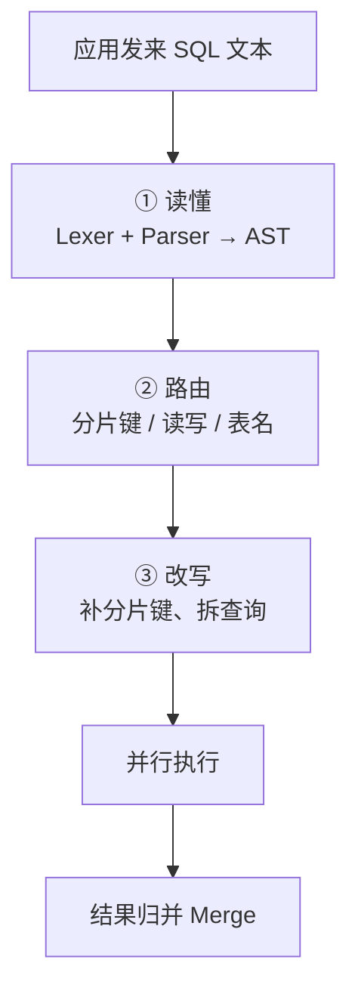
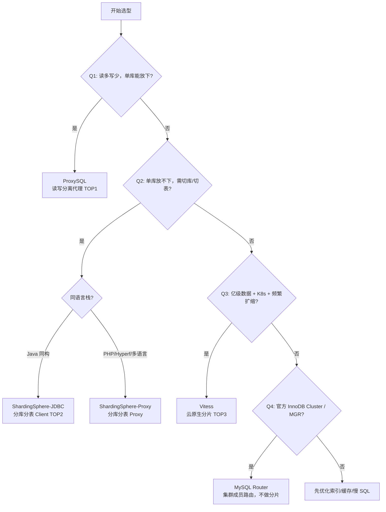
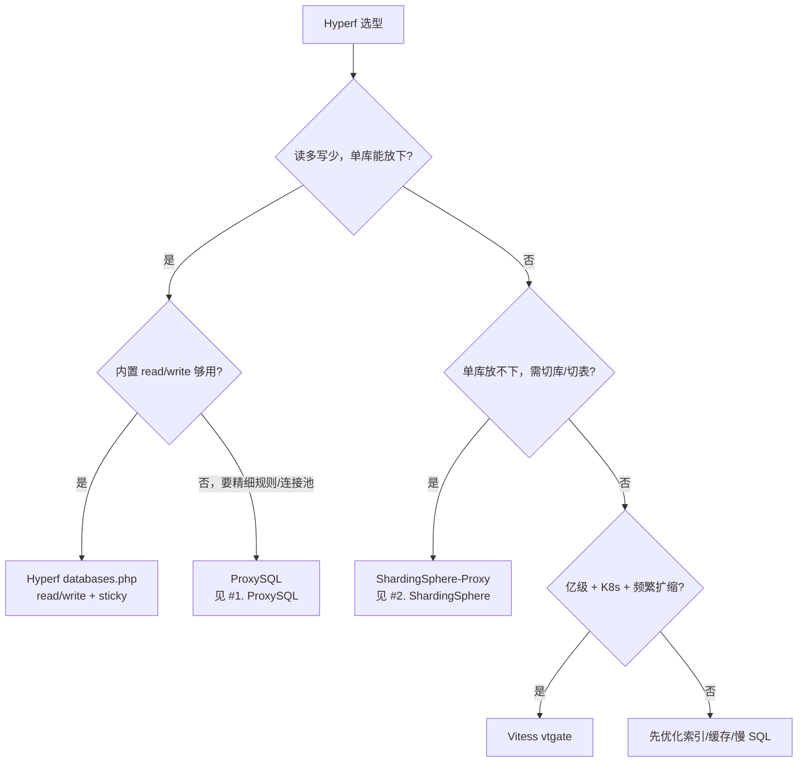

---
{"dg-publish":true,"permalink":"/Work/Databases/MySql/Basics/Mysql 中间件/","title":"Mysql 中间件","tags":["flashcards"],"noteIcon":"","created":"2026-09-08T09:51:42.000+08:00","updated":"2026-09-08T09:51:42.000+08:00","dg-note-properties":{"title":"Mysql 中间件","tags":["flashcards"],"reference linking":null}}
---

# 一句话结论
MySQL 中间件不是性能优化的起点；先确认瓶颈，再按 **读流量 → 数据规模 → 运维能力** 逐级选型。
## 解决什么
当单机 MySQL 的能力边界已明确时，中间件可替应用统一处理四类问题：
1. **多实例怎么连** — 连接池复用、MySQL 协议代理
2. **SQL 怎么路由** — 解析 SQL、按规则改写与转发
3. **读写怎么分** — 读走从库、写走主库（读写分离）
4. **分片怎么扩** — 按分片键水平切库切表
## 选型速查
三者解决不同层次问题，不是同级别互替；口诀 **分流读 → 切数据 → 管海量扩缩**，详表见 [[Work/Databases/MySql/Basics/Mysql 中间件#产品详解 TOP 3\|#产品详解 TOP 3]]。

| 顺位  | 产品                    | 定位          | 何时上                   |
| --- | --------------------- | ----------- | --------------------- |
| 1   | ==1;;ProxySQL==       | **读写分离**代理  | 读多写少、单库容量够            |
| 2   | ==1;;ShardingSphere== | **分库分表**中间件 | 单库放不下；能 JDBC 就别 Proxy |
| 3   | ==1;;Vitess==         | **云原生分片**集群 | 亿级数据 + K8s + 在线扩缩容    |
<!--SR:!2026-11-02,74,250-->
<?e?>
## 架构原则
能不分就不分；确定使用 Java 同构技术栈且团队能接受应用依赖时，**Client 嵌入**（应用内嵌驱动）通常优于 **Proxy**（独立代理进程，多一跳延迟）。多语言、遗留系统或需要集中治理时，选 Proxy。
# 阅读路线
## 路径 A — 通用
建立全局心智，按序阅读：
1. [[Work/Databases/MySql/Basics/Mysql 中间件#先判断：是否需要中间件\|#先判断：是否需要中间件]] — 要不要上、Scale Up/Out
2. [[Work/Databases/MySql/Basics/Mysql 中间件#核心原理\|#核心原理]] — SQL 解析 + MySQL 协议代理
3. [[Work/Databases/MySql/Basics/Mysql 中间件#架构选型\|#架构选型]] — 三类部署 + [[Work/Databases/MySql/Basics/Mysql 中间件#决策树（通用）\|#决策树（通用）]]
4. [[Work/Databases/MySql/Basics/Mysql 中间件#产品详解 TOP 3\|#产品详解 TOP 3]] — ProxySQL / ShardingSphere / Vitess
5. [[Work/Databases/MySql/Basics/Mysql 中间件#落地清单（避坑）\|#落地清单（避坑）]] — 上线前检查
## 路径 B — Hyperf
PHP 协程栈；走完路径 A 第 1–4 步后再看：
1. [[Work/Databases/MySql/Basics/Mysql 中间件#Hyperf 场景选型\|#Hyperf 场景选型]] — 决策树 + 接入要点
<?e?>
# 先判断：是否需要中间件
## 先别上中间件
以下情况应先治理 MySQL 与应用本身：慢 SQL 和索引未优化、缓存未使用、连接池参数不合理，或单库容量仍有余量。中间件会增加 **运维面、故障点和一致性边界**，不是单机调优的替代品。
## 何时需要
单机 MySQL 瓶颈通常来自三方面：==1;;数据==量（单表/单库过大）、==1;;连接==数（应用实例多、短连接风暴）、==1;;读写==比（读远大于写）。
扩展路径有两条：
1. **Scale Up**（垂直扩展）：加 CPU/内存/SSD，==1;;单机==升配，简单但有==1;;天花板==，适合早期。
2. **Scale Out**（水平扩展）：==1;;多==实例 + 中间件路由，横向加机器，是长期方案。
中间件可提供 **读写分离、分库分表、连接池/复用、负载均衡、SQL 监控、故障切换**；具体能力取决于产品。
<!--SR:!2026-12-14,97,290-->
<?e?>
# 核心原理
无论 `ProxySQL/ShardingSphere/Vitess`，底层都绕不开两件事：
## SQL 解析与路由
**一句话**：中间件收到的是一串 SQL **文本**，必须先「读懂它在干什么」，才能决定发往哪台 MySQL。
### 三步心法（所有中间件本质相同）：
1. **读懂 SQL** — ==1;;词==法、==1;;语==法分析，生成==1;;语法==树 AST（不能靠正则硬匹配）
2. **决定去哪个库** — 看==1;;分片==键、读写类型、表名
3. **执行并合并** — 必要时改写==1;;SQL==，并行发往多个库，再==1;;汇总==结果
<!--SR:!2026-10-06,43,250-->
<?e?>

### 为什么不能只用正则？
SQL 可有子查询、函数、别名、注释，简单 `if-else` 字符串匹配**无法可靠识别**「查哪张表、带不带分片键」；
ShardingSphere、Vitess 等都用 **Parser**（常见工具 **ANTLR4** + `MySQLParser.g4`）。
### 走一遍例子（分库分表场景）
| 步骤   | 输入                                        | 中间件做什么                                                    |
| ---- | ----------------------------------------- | --------------------------------------------------------- |
| 应用发出 | `SELECT * FROM t_order WHERE user_id = 1` | 收到 SQL 文本                                                 |
| 读懂   | 解析出：表 `t_order`，条件 `user_id = 1`          | `user_id` 是分片键 → 算出落在 `ds_1.t_order_2`                    |
| 执行   | 改写或直接路由                                   | 只向 **一个** 分片发请求（无需扫全库）                                    |
| 若跨分片 | `WHERE create_time > '2026-01-01'`（无分片键）  | 需==1;;广播==到 **所有** 分片 → 并行执行 → ==1;;Merge== 归并（慢，生产应尽量避免） |
## MySQL 协议代理
Proxy 类中间件（ProxySQL、MySQL Router、Vitess vtgate）对应用 **伪装成一台 MySQL**：
- 监听 TCP（通常 3306/6033），说MySQL ==1;; 二进制==协议（握手、COM_QUERY、结果集包）。
- 应用无感知：连接串只改 host/port，不改驱动。
- 代价：中间件要完整实现/转发协议，并处理 ==1;;预处理语句==(Prepared Statement)、==1;;多==结果集、字符集协商等边界。
<!--SR:!2026-10-30,58,250-->
<?e?>
# 架构选型
中间件按部署位置分三类，选型比「选哪个产品」更重要：

| 类型                   | 代表                                         | 原理                           | 优点                     | 缺点                  | 适用                  |
| -------------------- | ------------------------------------------ | ---------------------------- | ---------------------- | ------------------- | ------------------- |
| ==1;;Proxy==         | ProxySQL、ShardingSphere-Proxy、MySQL Router | 独立进程监听 3306，伪装成 MySQL Server | 跨==1;;语言==、对应用零侵入、集中治理 | 多一跳延迟、Proxy 本身是高可用点 | 多语言栈、遗留系统、需统一审计     |
| ==1;;Client 嵌入==     | ShardingSphere-JDBC、MyBatis-Plus 分片        | 在应用进程内解析 SQL、改写路由            | 无==1;;网络==跳转、性能最高      | 绑定语言/框架、规则分散在各服务    | Java 同构微服务、性能敏感     |
| ==1;;Sidecar / 云原生== | Vitess（vtgate + vttablet）                  | K8s 侧车或集群组件，协议层代理            | ==1;;弹性==扩缩、在线 Reshard | 运维复杂、学习曲线陡          | 亿级行、多租户 SaaS、K8s 环境 |
<!--SR:!2026-09-18,31,230-->
<?e?>
## 决策树（通用）

PHP/Hyperf 栈无 JDBC，读写分离可先用框架内置，分片走 Proxy —— 详见 [[Work/Databases/MySql/Basics/Mysql 中间件#Hyperf 场景选型\|#Hyperf 场景选型]]。
# 产品详解 TOP 3
| 维度         | ProxySQL               | ShardingSphere                        | Vitess                                   |
| ---------- | ---------------------- | ------------------------------------- | ---------------------------------------- |
| **定位**     | 读写分离 + 连接池             | 分库分表                                  | 云原生超大规模分片                                |
| **✅痛点解决**  | 读太多、连接数打满              | 单库/单表放不下                              | 数据量亿级 + 要不停机扩缩容                          |
| **负责**     | 读流量分发、Query Rules、连接复用 | 分片路由、绑定表/广播表、分布式 ID                   | 在线 Reshard、vtgate 路由、Topo 管理             |
| **❌不负责**   | 分库分表、跨库 Join           | 精细读写分离（不如 ProxySQL）                   | 小团队轻量运维                                  |
| **是否分片**   | ❌                      | ✅                                     | ✅                                        |
| **部署形态**   | 独立 Proxy（:6033）        | JDBC 嵌入 **或** Proxy                   | vtgate + vttablet（K8s 侧车）                |
| **应用改动**   | 只改 host/port           | Java 改依赖；其他语言改 host                   | 连 vtgate，改连接串                            |
| **运维复杂度**  | 低                      | 中                                     | 高                                        |
| **典型数据规模** | 单库能放下即可                | GB～TB 级                               | 亿行 / 数十 Shard 起                          |
| **首选场景**   | 读多写少、单库容量够             | 单库放不下；**Java 用 JDBC**，**PHP 用 Proxy** | K8s + 亿级 + 频繁扩缩容                         |
| **与另两者关系** | 不分片；单库够用时首选            | 需要水平切库切表时上；不必叠 ProxySQL               | 分片规模超出 ShardingSphere 舒适区；通常不再叠 ProxySQL |
## 1. ProxySQL — 读写分离与连接池
### 定位
生产环境读写分离的 **事实标准**；不负责分库分表，专注 **读流量分发 + 连接复用 + 查询路由**。
### 典型架构
```text
App ──→ ProxySQL(:6033) ──→ Writer Hostgroup (主库)
                        └──→ Reader Hostgroup (从库 × N)
```
### 核心机制
- ==1;;主机组==（Hostgroup）：把后端 MySQL 实例分组（如 hg10=写、hg20=读）。
- ==1;;查询规则==（Query Rules）：按 SQL 类型/正则/表名路由（`SELECT ... FOR UPDATE` 必须走写组）。
- ==1;;连接复用==（Connection Multiplexing）：前端连接数 ≫ 后端连接数，缓解 MySQL `max_connections` 压力。
- ==1;;查询缓存 / 查询摘要==（Query Cache / Query Digest）：热点查询缓存、慢 SQL 聚合统计。
### 最佳实践
1. **读写分离规则**：默认 `SELECT → 读组`；带 ==1;;FOR UPDATE==、LAST_INSERT_ID()、写后立刻读同一行的场景 **强制走写组**。
2. **连接池参数**：`mysql-max_connections` 按后端容量设；`mysql-query_cache_size_MB` 只对幂等读开；监控 `ConnUsed / ConnFree`。
3. **高可用**：ProxySQL 自身至少 2 节点 + Keepalived/VIP；后端用 Orchestrator/MHA 做主从切换后，同步更新 `mysql_servers` 或接 Consul 服务发现。
4. **不要指望它做分片**：跨库 Join、分布式事务不在其职责内。
配置示例见 [[Work/Databases/MySql/Basics/Mysql 中间件#配置参考\|#配置参考]]。
<!--SR:!2026-10-22,52,250-->
<?e?>
## 2. ShardingSphere — 分库分表
### 定位
国内 Java 生态分片 **首选**；Apache TLP，提供 **JDBC（嵌入）** 和 **Proxy（独立进程）** 两种模式。
### 典型架构
JDBC 模式，推荐：
```text
App + ShardingSphere-JDBC Driver
  ├─ 解析 SQL → 改写（分片键补全）→ 路由到 ds_0 / ds_1
  └─ 结果归并（ORDER BY / GROUP BY / 分页）
```
### 核心机制
- ==1;;分片键==（Sharding Key）：决定数据落在哪个库/表，如 `user_id % 4`；**几乎所有路由都依赖它**。
- ==1;;绑定表==（Binding Table）：相同分片键的多表 Join 可下推到同一分片，避免笛卡尔积广播。
- ==1;;广播表==（Broadcast Table）：字典/配置等小表全分片复制，本地 Join。
- ==1;;分布式主键==：Snowflake 等，避免分片间自增 ID 冲突。
- **读写分离**：内置，可叠加在分片之上（通常不如 ProxySQL 精细）。
<!--SR:!2026-11-04,60,250-->
<?e?>
### 绑定表与广播表：两种相反的放置策略
| 概念 | 数据放置 | 典型用途 | Join 时的效果 |
| --- | --- | --- | --- |
| **绑定表** | 关联数据按同一分片键、同一规则切分 | 订单与订单明细 | 只访问同一个分片 |
| **广播表** | 同一份小数据复制到每个分片 | 地区、字典、配置 | 在每个分片本地 Join |
- **绑定表**：例如 `t_order` 与 `t_order_item` 都按 `order_id % 4` 分片。`order_id = 101` 的订单及其明细必在同一分片；按订单查 Join 时，中间件只路由到该分片，不必向所有分片广播。
- **广播表**：例如 `t_region` 是很小的地区字典表，每个分片都有一份完整副本。订单落在哪个分片，就能在那里直接关联地区名称；代价是写入、更新或删除字典时，必须同步到所有分片，因此只适合**小且变更少**的表。
### 最佳实践
1. **分片键选择**：选 ==1;;高==基数、==1;;查询==必带、分布==1;;均匀== 的列（`user_id`、`order_id`）；**禁止**用低基数列（省份、性别）做唯一分片键。
2. **Client 优先**：Java 同构用 JDBC 嵌入；**PHP/Hyperf 无 JDBC，分片用 Proxy**；多语言异构也上 Proxy。
3. **SQL 约束**：跨分片 **不做** 复杂 Join / 子查询 / 全局 `ORDER BY` 无分片键；分页用 **流式归并** 或 **禁止深分页**（`LIMIT 1000000,10`）。
4. **扩容**：分片数建议 **2 的幂次**（2→4→8），提前规划；在线扩容用 **弹性伸缩** 或双写迁移，别硬改 `% N`。
5. **事务**：单分片走本地事务；跨分片默认 **弱一致**，强一致用 [[Work/Script/PHP/Learn/分布式事务#Seata 分布式事务\|分布式事务#Seata 分布式事务]] 等 **柔性事务**，接受最终一致的业务用消息补偿。
<!--SR:!2026-10-24,53,250-->
<?e?>
配置示例见 [[Work/Databases/MySql/Basics/Mysql 中间件#配置参考\|#配置参考]]。
## 3. Vitess — 云原生超大规模水平分片
### 定位
YouTube 开源、CNCF 项目；适合 **K8s + 亿级行 + 频繁扩缩容**。
### 典型架构
```text
App ──→ vtgate（无状态路由层，等价于增强版 Proxy）
         └──→ vttablet × N（每 Shard 一个 Sidecar，管理 MySQL + 复制）
                └──→ MySQL 实例（通常一主多从）
```
### 核心机制
- VSchema：声明 Keyspace、分片键、路由规则（类似 ShardingSphere 逻辑表，但集群级管理）。
- Reshard / MoveTables：在线迁移分片、双写切换，**不停机扩缩容**是 Vitess 相对 ShardingSphere 的最大优势。
- VTGate 连接池：集中管理到 vttablet 的连接，应用只连 vtgate。
- Topo Server（etcd/ZK）：存储拓扑，vtgate 无状态可水平扩展。
### 最佳实践
1. **前置条件**：团队有 K8s运维能力；数据量确实到 **单库 TB 级 / Shard 数十以上**，否则 ShardingSphere 更简单。
2. **分片键**：与 ShardingSphere 相同原则；Vitess 用 **Sequence 表** 或 **Vitess Sequences** 生成分布式 ID。
3. **查询模式**：vtgate 支持有限跨 Shard 聚合，但 **跨 Shard Join 仍应极力避免**；复杂分析走 **CDC → OLAP**（ClickHouse 等）。
4. **高可用**：vttablet 管理 MySQL 主从切换；vtgate 多副本 + LB；定期 `vtctlclient` 检查 Shard 健康。
5. **与 ProxySQL 关系**：Vitess 场景下 vtgate 已含路由，**通常不再叠 ProxySQL**。
<?e?>
# Hyperf 场景选型
Hyperf 是 **PHP + Swoole 协程** 栈：**无 JDBC**，不能用 ShardingSphere-JDBC；分片只能走 **Proxy** 或应用层手写路由。
## 决策树（Hyperf）

## 场景对照
| 场景               | Hyperf 推荐                   | 接入方式                                      | 备注                                |
| ---------------- | --------------------------- | ----------------------------------------- | --------------------------------- |
| 读多写少，单库够         | ==1;;Hyperf 内置读写分离==        | `databases.php` 配 `read`/`write`/`sticky` | 零额外组件，协程连接池原生支持                   |
| 读写分离 + 精细路由/连接复用 | ==1;;ProxySQL==             | `.env` 的 `DB_HOST` 指向 ProxySQL            | 机制见 [[Work/Databases/MySql/Basics/Mysql 中间件#1. ProxySQL — 读写分离与连接池\|#1. ProxySQL — 读写分离与连接池]]   |
| 分库分表             | ==1;;ShardingSphere-Proxy== | `.env` 的 `DB_HOST` 指向 Proxy               | 机制见 [[Work/Databases/MySql/Basics/Mysql 中间件#2. ShardingSphere — 分库分表\|#2. ShardingSphere — 分库分表]] |
| 亿级 + K8s         | ==1;;Vitess==               | 连 vtgate                                  | 机制见 [[Work/Databases/MySql/Basics/Mysql 中间件#3. Vitess — 云原生超大规模水平分片\|#3. Vitess — 云原生超大规模水平分片]]  |
| 小范围按用户/租户拆库      | **应用层多连接**                  | `databases.php` 多 connection + Service 路由 | 仅规则简单、表少；别冒充通用分片                  |
<!--SR:!2026-10-30,63,270-->
<?e?>
## 接入要点
- **`sticky => true`**：当前请求内**写过**则后续读走==1;;主库==，缓解主从延迟。
- **写后立刻读同一行**：关键路径用 `Db::connection('default')->useWritePdo()` 或事务包一层写+读。
- 叠 ProxySQL 或 ShardingSphere-Proxy 时，应用只改 `DB_HOST` 与端口；ORM/Model **无需改代码**。
- 分片 SQL 仍受 [[Work/Databases/MySql/Basics/Mysql 中间件#2. ShardingSphere — 分库分表\|#2. ShardingSphere — 分库分表]] 的约束：必带分片键、禁跨分片 Join、使用分布式 ID。
- 完整配置见 [[Work/Databases/MySql/Basics/Mysql 中间件#配置参考\|#配置参考]]。
## Hyperf 落地注意
1. **连接与事务隔离**：非 `default` 连接须 `Db::connection('mysql1')->beginTransaction()`，否则事务失效。
2. **协程连接池**：按 ==1;;Worker 数== × ==1;;pool.max_connections== 估算后端总连接，别打满 MySQL `max_connections`。
3. **多连接分片手写**：仅适合 `user_id % N` 等极简规则；复杂分片上 Proxy。
4. **写后读一致**：见 [[Work/Databases/MySql/Basics/Mysql 中间件#落地清单（避坑）\|#落地清单（避坑）]] 第 3 条。
5. **不推荐**：`hyperf/sharding` 等小众 PHP 分片库；新项目分片优先 **ShardingSphere-Proxy**。
<!--SR:!2026-10-21,53,250-->
<?e?>
# 落地清单（避坑）
1. **先==1;;优化==再==1;;分片==**：索引、慢 SQL、缓存（Redis）、读写分离往往够撑很久；分片是不可逆的复杂度跃迁。
2. **分片键一旦上线极难更改**：选型阶段用==1;;数据分布==模拟验证均匀性。
3. **写后读一致**：读写分离 + 主从延迟 → 用户刚注册却查不到；
	- 方案：关键读走主库、会话粘滞、或 ==1;;GTID(Global Transaction Identifier，全局事务标识)==等位等待（见 [[Work/Databases/MySql/Advance/5、主从复制\|5、主从复制]]）。
4. **分布式 ID**：禁用分片表自增主键全局唯一假设；用 ==1;;Snowflake== / DB Sequence / UUID（按业务择）。
5. **跨分片事务**：默认不支持 ACID 跨库；强一致上 Seata/XA（性能差），高并发用 Saga/消息==1;;最终==一致。
6. **全局表/字典表**：小且读多 → 广播表或独立缓存，别每张业务表都 Join 它。
7. **可观测性**：中间件层暴露 QPS、路由命中率、跨分片查询比例、连接池水位；ProxySQL 的 `stats_mysql_query_digest`、ShardingSphere 的 SQL 审计、Vitess 的 vtgate 指标必接监控。
8. **中间件自身 HA**：`Proxy / vtgate / ShardingSphere-Proxy` 都是单点候选，必须==1;;多==实例 + 健康检查 + 配置持久化。
<!--SR:!2026-09-13,15,190-->
<?e?>
## GTID 等位等待
**GTID** 是一次已提交事务的**全局唯一标识**，格式通常为 `源库 UUID:事务序号`，如 `3E11FA47-...:1024`。主库提交事务时生成 GTID；从库执行该事务后，也会把它记入已执行集合。
### 先处理 `GTID_MODE = OFF`
报错 `[HY000][3062] Cannot use WAIT_FOR_EXECUTED_GTID_SET when GTID_MODE = OFF` 表示当前执行等待语句的 MySQL 未启用 GTID；此时不能用 GTID 实现写后读一致。
先在**主库和全部从库**检查：
```sql
SHOW VARIABLES WHERE Variable_name IN ('gtid_mode', 'enforce_gtid_consistency', 'log_bin', 'binlog_format');
SHOW REPLICA STATUS\G
```
新建的 GTID 复制拓扑，各实例都需要设置唯一的 `server_id`，并启用二进制日志、GTID 与一致性检查；`ROW` 是复制的推荐格式：
```ini
[mysqld]
server_id = 1 # 每个实例必须不同
log_bin = mysql-bin
binlog_format = ROW
gtid_mode = ON
enforce_gtid_consistency = ON
```
从库随后改用 GTID 自动定位：
```mysql
STOP REPLICA;
CHANGE REPLICATION SOURCE TO SOURCE_AUTO_POSITION = 1;
START REPLICA;
```
已有的**非 GTID**生产复制链路不能只在一台从库改为 `ON`：需先在所有节点以 `WARN` 检查不兼容 SQL，再按 `OFF → OFF_PERMISSIVE → ON_PERMISSIVE → ON` 逐级切换，确认匿名事务清零后才进入 `ON`。切换会影响复制和故障恢复，应按版本与拓扑演练；详见 [MySQL 官方在线启用流程](https://dev.mysql.com/doc/refman/8.0/en/replication-mode-change-online-enable-gtids.html)。
### 为什么要逐级切换
旧复制以 **binlog 文件名 + position** 标识事务，称为**匿名事务**；直接进入 `ON` 后只接受带 GTID 的事务，复制链路中**遗留的匿名事务可能无法继续应用**。四个模式是兼容新旧事务格式的过渡带：

| 状态 | 本机新事务 | 接收并复制的事务 |
| :-- | :-- | :-- |
| `OFF` | 只能匿名事务 | 只能匿名事务 |
| `OFF_PERMISSIVE` | 仍产生匿名事务 | 匿名、GTID 都能接收 |
| `ON_PERMISSIVE` | 新事务开始产生 GTID | 匿名、GTID 都能接收 |
| `ON` | 只能 GTID 事务 | 只能 GTID 事务 |

迁移的含义是：
1. 所有节点先设 `enforce_gtid_consistency = WARN`，从错误日志找出不兼容 SQL 并先修复；不能带着告警强行开启。
2. 所有节点进入 `OFF_PERMISSIVE`，让整个拓扑先具备接收 GTID 事务的能力。
3. 所有节点进入 `ON_PERMISSIVE`，此后主库新写入带 GTID，但从库仍可处理复制链路中积压的匿名旧事务。
4. 等匿名事务全部执行完、相应旧 binlog 和备份不再需要后，所有节点才进入 `ON`；此后全链路只使用 GTID。

例如从库还积压着主库切换前写入的匿名事务；若直接切到 `ON`，从库可能拒绝继续应用它。`ON_PERMISSIVE` 让旧事务收尾与新 GTID 事务并存。所有节点必须按相同顺序完成每一阶段，避免某个节点先进入无法接收对方事务格式的状态而中断复制。
### 写后读一致如何使用
写后读一致不是等待从库“差不多追上”，而是等待**本次写入**已经在目标从库执行：
1. 用户注册写入主库，应用或中间件记录这次提交的 GTID，例如 `uuid:1024`。
2. 下一次需要读到注册结果时，先把该 GTID 传给将要读取的从库；不要在并发写入后直接读取 `@@GLOBAL.gtid_executed`，它可能包含其他请求的事务。需要精确追踪本次提交时，可使用驱动/中间件的会话状态跟踪（`session_track_gtids = OWN_GTID`）取得本事务的 GTID。
3. 在目标从库上执行：
```sql
SELECT WAIT_FOR_EXECUTED_GTID_SET('3E11FA47-...:1024', 1);
```
4. 返回 `0`：该从库已执行这次写入，可以在此读取；返回 `1`：等待 1 秒仍未追上，应降级到主库读取，不能直接返回从库的旧数据；函数报错则按故障处理，也读主库或返回失败。

**时序示例：** 注册写入获得 `uuid:1024` → 请求携带 `uuid:1024` → 从库等待此 GTID → 等到后读从库；超时则读主库。等待应只用于“用户必须立刻看到自己写入”的关键读，并设置短超时；所有读都等待会把主从延迟转化为应用请求延迟。
**GTID 自动定位**用于复制断点续传、主从切换；**GTID 等位等待**才是读写分离中的写后读一致方案。它需要先启用 GTID 复制，并能取得每次写入对应的 GTID。
# 附录
## 历史与其他中间件对照
| 年代    | 中间件           | 状态                 | 架构     | 说明                                 |
| ----- | ------------- | ------------------ | ------ | ---------------------------------- |
| ~2012 | Cobar         | 停止维护               | Proxy  | 阿里早期，TDDL 前身                       |
| ~2014 | MyCat         | 社区维护，存量多           | Proxy  | Cobar 二次开发，国内老项目常见                 |
| ~2014 | Atlas         | 基本停更               | Proxy  | 360 基于 MySQL-Proxy 改写              |
| ~2014 | MaxScale      | MariaDB 官方         | Proxy  | MariaDB/Galera 生态                  |
| ~2015 | Kingshard     | 基本停更               | Proxy  | Atlas 作者离职后用 Go 重写                 |
| ~2015 | OneProxy      | 商业                 | Proxy  | 性能导向，小众                            |
| ~2016 | Sharding-JDBC | 已并入 ShardingSphere | Client | 现用 ShardingSphere-JDBC             |
| ~2016 | MySQL Router  | Oracle 官方活跃        | Proxy  | **InnoDB Cluster / MGR 成员路由**，不做分片 |
| ~2018 | MyCat2        | 社区维护               | Proxy  | MyCat 重构版；**新项目优先 ShardingSphere** |
## 配置参考
以下配置用于理解关键字段；上线前仍需按实例容量、主从拓扑和版本核对官方文档。
### ProxySQL：后端分组与查询路由
```sql
INSERT INTO mysql_servers(hostgroup_id, hostname, port) VALUES
  (10, 'master', 3306),
  (20, 'slave1', 3306),
  (20, 'slave2', 3306);
LOAD MYSQL SERVERS TO RUNTIME; SAVE MYSQL SERVERS TO DISK;

INSERT INTO mysql_query_rules(rule_id, active, match_pattern, destination_hostgroup, apply)
VALUES (1, 1, '^SELECT', 20, 1);
INSERT INTO mysql_query_rules(rule_id, active, match_pattern, destination_hostgroup, apply)
VALUES (2, 1, 'FOR UPDATE', 10, 1);
LOAD MYSQL QUERY RULES TO RUNTIME; SAVE MYSQL QUERY RULES TO DISK;
```
### ShardingSphere：按 `order_id` 分表
```yaml
rules:
  - !SHARDING
    tables:
      t_order:
        actualDataNodes: ds_${0..1}.t_order_${0..3}
        tableStrategy:
          standard:
            shardingColumn: order_id
            shardingAlgorithmName: order_mod
    shardingAlgorithms:
      order_mod:
        type: MOD
        props:
          sharding-count: 4
```
### Hyperf：内置读写分离
`config/autoload/databases.php`：
```php
return [
    'default' => [
        'driver' => env('DB_DRIVER', 'mysql'),
        'read' => ['host' => [env('DB_READ_HOST', '192.168.1.2')]],
        'write' => ['host' => [env('DB_WRITE_HOST', '192.168.1.1')]],
        'sticky' => true,
        'database' => env('DB_DATABASE', 'hyperf'),
        'username' => env('DB_USERNAME', 'root'),
        'password' => env('DB_PASSWORD', ''),
        'charset' => env('DB_CHARSET', 'utf8'),
        'collation' => env('DB_COLLATION', 'utf8_unicode_ci'),
        'prefix' => env('DB_PREFIX', ''),
        'pool' => [
            'min_connections' => 1,
            'max_connections' => 10,
            'connect_timeout' => 10.0,
            'wait_timeout' => 3.0,
            'heartbeat' => -1,
            'max_idle_time' => (float) env('DB_MAX_IDLE_TIME', 60),
        ],
    ],
];
```
### Hyperf：接入 ProxySQL 或 ShardingSphere-Proxy
```dotenv
# ProxySQL
DB_HOST=proxysql.lan
DB_PORT=6033

# ShardingSphere-Proxy
# DB_HOST=shardingsphere-proxy.lan
# DB_PORT=3307
```
# 行动口诀
**先优化、再读写分离、最后才分片**；分片键选错比选错产品代价更大；中间件本质是 **SQL 解析 + 路由 + MySQL 协议代理**。
