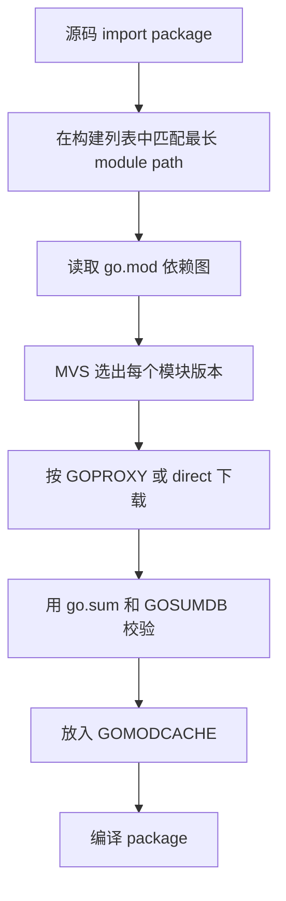
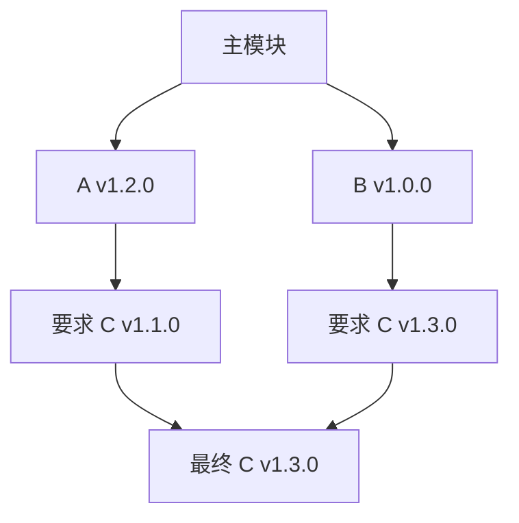
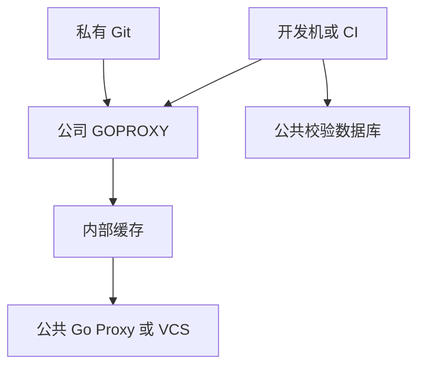
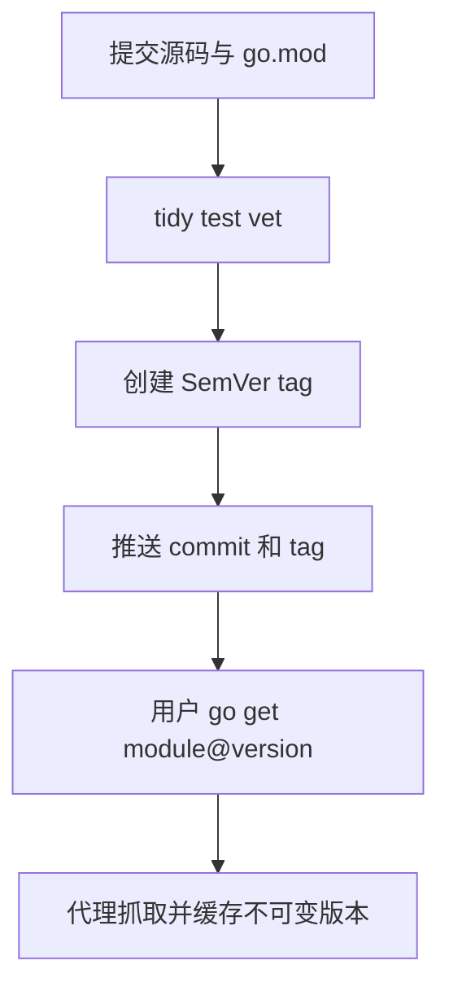
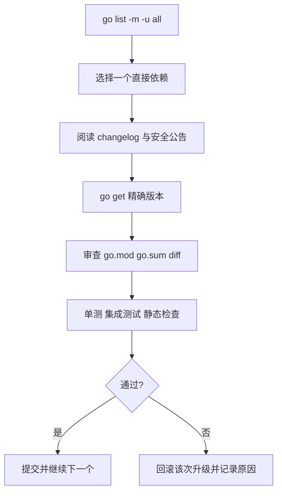

---
{"dg-publish":true,"permalink":"/Work/Script/Go/Go Modules 完全操作指南/","title":"Go Modules 完全操作指南","tags":["Go","GoModules","依赖管理","flashcards"],"noteIcon":"","created":"2026-09-11T15:10:05.000+08:00","updated":"2026-09-11T15:10:05.000+08:00","dg-note-properties":{"title":"Go Modules 完全操作指南","tags":["Go","GoModules","依赖管理","flashcards"],"created":"2026-09-11","reference linking":null}}
---

# Go Modules 完全操作指南
以现代 **Go Modules** 为准：先理解 **模块模型** 与模块文件，再掌握依赖、版本和命令，最后处理私有仓库、发布、工作区、CI 与治理。
# 一页结论
| 主题 | 必须记住的结论 |
| :-- | :-- |
| **模块定义** | 一个目录树由根目录的 `go.mod` 定义为一个模块，模块可包含多个 package |
| **导入单位** | 源码 `import` 的是 package path，版本管理的单位是 module path |
| **版本声明** | `require module v1.2.3` 表示**最低要求**，不是 Composer 的 `^1.2.3` 范围 |
| **版本算法** | **MVS** 对同一 module path 选择依赖图中要求的最高版本，不主动追逐最新版本 |
| **可重复构建** | `go.mod` 的选定版本与 `go.sum` 的内容校验共同保证；`go.sum` **不是锁文件** |
| **增加依赖** | 先在代码中 `import`，再执行 `go mod tidy`；或显式执行 `go get module@version` |
| **安装工具** | 修改项目依赖用 `go get`；安装独立命令用 `go install package@version` |
| **清理依赖** | 删除源码中的 import 后执行 `go mod tidy`，不要只手改 `go.mod` |
| **本地联调** | 多模块长期联调用 `go.work`；临时替换可用 `replace`，发布前不能遗留本地路径 |
| **大版本** | 从 `v2` 起 module path 和 import path 必须带 `/v2`，不同大版本可以并存 |
| **生产构建** | 提交 `go.mod` 与 `go.sum`，**CI** 使用 `-mod=readonly`，有 vendor 时明确策略 |
| **私有模块** | 配置 `GOPRIVATE` 和 Git 凭据，避免私有路径泄露给公共代理与校验数据库 |
# 核心模型
## Package、Module、Repository
| 概念 | 含义 | 示例 |
| :-- | :-- | :-- |
| **package** | 同一目录中共同编译的一组 `.go` 文件 | `github.com/gin-gonic/gin/binding` |
| **module** | 一起发布、一起版本化的一组 package，由 `go.mod` 定义 | `github.com/gin-gonic/gin` |
| **repository** | Git 等版本控制仓库，可包含一个或多个 module | GitHub 上的源码仓库 |
| **main module** | 当前命令所处的主模块，其 `go.mod` 的 `replace` 等规则生效 | 当前应用 |
| **build list** | MVS 为每个 module path 最终选中的版本集合 | 构建实际使用的模块版本 |

**模块路径**是包路径的前缀：`example.com/shop` 中 `internal/order` 的包路径为 `example.com/shop/internal/order`。
## 依赖解析流程

## 四个最重要的路径
```bash
# 查看 Go 安装目录，标准库和工具链位于这里
go env GOROOT
# 查看工作区目录，默认模块缓存和 GOBIN 的回退路径基于它
go env GOPATH
# 查看模块下载缓存，通常是 $GOPATH/pkg/mod
go env GOMODCACHE
# 查看当前生效的 go.mod；输出 /dev/null 表示当前不在模块中
go env GOMOD
```
# GOPATH 模式为什么被淘汰
Go Modules 在 Go 1.11 引入，并从 Go 1.16 起成为默认模式。旧 **GOPATH** 要求项目置于单一工作区，无法可靠管理多版本依赖或保证跨机器构建一致。

| 特性 | GOPATH 模式 | Go Modules |
| :-- | :-- | :-- |
| 项目位置 | 必须位于 `GOPATH/src` | 任意目录 |
| 版本控制 | 无项目级精确版本模型 | `go.mod` + MVS |
| 依赖隔离 | 全局共享源码 | 项目级模块图 |
| 可重复构建 | 依赖本机工作区状态 | 由模块声明和校验和支撑 |
| 离线能力 | 依赖已有工作区源码 | 使用模块缓存或 `vendor/` |
# 五分钟上手
## 创建第一个项目
```bash
# 创建并进入项目目录；目录可位于任意位置，不必放进 GOPATH
mkdir hello
cd hello
# 初始化模块；可发布项目应使用代码仓库地址作为模块路径
go mod init github.com/yourname/hello
```
创建 `main.go`：
```go
package main

import (
	"fmt"

	"rsc.io/quote"
)

func main() {
	fmt.Println(quote.Hello())
}
```
继续执行：
```bash
# 根据源码 import 添加缺失依赖、删除无用依赖并更新 go.sum
go mod tidy
# 编译当前模块全部 package；缺失源码会下载到模块缓存
go build ./...
# 测试当前模块全部 package；发布或提交前必须执行
go test ./...
# 查看最终模块构建列表，第一行通常是主模块
go list -m all
```
## 首次提交
```bash
# 检查 go.mod 与源码是否一致；命令可能修改 go.mod 和 go.sum
go mod tidy
# 验证模块缓存内容是否仍与 go.sum 记录一致
go mod verify
# 检查应提交的依赖元数据；go.mod 和 go.sum 都应纳入 Git
git status --short go.mod go.sum
```
# 第一个模块练习
在上面的 `hello` 项目中完成以下闭环；无需再创建一份相同的 `main.go`。
```bash
# 运行程序；随后以 tidy 规范化模块文件
go run .
go mod tidy
# 检查模块声明、构建列表和内容校验
go mod edit -print
go list -m all
go mod verify
```
# 命令总览
| 分类 | 命令 | 用途与副作用 |
| :-- | :-- | :-- |
| **初始化** | `go mod init module-path` | 创建 `go.mod` |
| **整理** | `go mod tidy` | 增加缺失依赖、删除无用依赖、更新校验和 |
| **添加/调整** | `go get package@query` | 调整当前模块依赖并修改 `go.mod`、`go.sum` |
| **移除指定模块** | `go get module@none` | 移除或降级相关依赖，需再运行测试 |
| **下载** | `go mod download [modules]` | 预下载到模块缓存，不安装到项目目录 |
| **查询版本** | `go list -m -versions module` | 查看已发布版本 |
| **查询升级** | `go list -m -u all` | 查看构建列表及可升级版本，不执行升级 |
| **查询详情** | `go list -m -json module@query` | 输出机器可读的模块路径、版本、时间等信息 |
| **依赖原因** | `go mod why [-m] module-or-package` | 输出从主模块到目标的最短依赖链 |
| **依赖图** | `go mod graph` | 输出模块需求图，不等同于最终 package 导入图 |
| **校验** | `go mod verify` | 校验缓存中的模块是否被修改 |
| **供应依赖** | `go mod vendor` | 重建 `vendor/` 和 `vendor/modules.txt` |
| **编辑文件** | `go mod edit flags` | 供脚本精确编辑 `go.mod`，不负责解析源码 |
| **格式化** | `go mod edit -fmt` | 规范化 `go.mod` 格式 |
| **缓存清理** | `go clean -modcache` | 删除整个模块缓存，下次会重新下载 |
| **安装命令** | `go install package@version` | 安装可执行程序，不修改当前项目依赖 |
| **查看二进制来源** | `go version -m binary` | 查看二进制内嵌模块和构建信息 |
| **初始化工作区** | `go work init [dirs]` | 创建 `go.work` 并加入本地模块 |
| **加入工作区** | `go work use [-r] dir` | 增删 `use` 项并维护工作区 |
| **同步工作区** | `go work sync` | 将工作区构建列表同步回各模块 |
| **工作区 vendor** | `go work vendor` | 为整个工作区生成 `vendor/` |
# go.mod 完整指南
## 完整示例
下面展示现代 `go.mod` 的主要指令。具体指令是否可用受 `go` 版本和工具链版本限制。
```go.mod
module example.com/shop

go 1.27.0

toolchain go1.27.1

godebug default=go1.27

require (
	github.com/google/uuid v1.6.0
	golang.org/x/text v0.29.0
)

require example.com/transitive v1.2.0 // indirect

tool golang.org/x/tools/cmd/stringer

ignore (
	./node_modules
	./third_party/generated
)

exclude example.com/broken v1.4.0

replace example.com/internal/lib => ../lib

retract v1.2.0 // Published with a critical regression.
```
## module
`module` 定义模块的**唯一身份**和 package import path 前缀。可发布模块使用实际仓库地址；修改已发布路径属于**破坏性变更**。
```bash
# 在当前目录创建 go.mod，并将仓库地址设置为 module path
go mod init github.com/acme/payments
```
## go
`go` 声明**最低 Go 版本**，并影响语言语义、模块图裁剪和工具行为。Go 1.21 起它不能低于依赖模块的 `go` 行。
```bash
# 将当前模块要求的最低 Go 版本调整到明确版本；会修改 go.mod
go get go@1.27.0
# 升级到命令能够解析的最新已发布 Go 版本；升级前应阅读 release notes
go get go@latest
```
## toolchain
`toolchain` 是主模块建议使用的**工具链**，不得低于 `go` 指令；自动切换受 `GOTOOLCHAIN` 控制。
```bash
# 将建议工具链更新到当前工具链系列的最新补丁版本
go get toolchain@patch
# 查看自动工具链选择策略；auto 允许按 go.mod 自动下载或切换
go env GOTOOLCHAIN
```
## require
`require` 声明模块路径和**最低版本**。`// indirect` 表示主模块未直接导入，但模块图仍需它；**不等于无用**。
```go.mod
require (
	github.com/google/uuid v1.6.0
	golang.org/x/sys v0.36.0 // indirect
)
```
优先让 `go get` 和 `go mod tidy` 管理 `require`，避免手工制造不一致。
## replace
`replace` 仅在**主模块或工作区**生效；依赖模块中的规则会被忽略。它只改变内容来源，仍需 `require` 将模块加入依赖图。
```go.mod
// 所有版本替换为本地模块；右侧目录必须有 go.mod
replace example.com/lib => ../lib

// 只替换一个精确版本
replace example.com/lib v1.2.3 => ../lib-fix

// 使用 fork；源码中的 import path 仍保持原路径
replace example.com/lib => github.com/acme/lib v1.2.4-acme.1
```
用命令编辑可减少语法错误：
```bash
# 将 example.com/lib 的全部版本临时映射到相邻本地模块
go mod edit -replace=example.com/lib=../lib
# 删除替换规则，恢复从代理或版本库获取正式模块
go mod edit -dropreplace=example.com/lib
# 整理替换前后产生的依赖变化并验证测试
go mod tidy
go test ./...
```
**生产边界：** 指向 `../lib` 或绝对路径的 `replace` 无法在其他机器稳定构建，通常不能提交到发布分支；多模块本地开发优先用 `go.work`。
## exclude
`exclude module version` 仅在主模块中排除一个精确版本；可阻止 MVS 选择已知坏版本，**不是漏洞治理系统**。
```bash
# 排除一个已知损坏版本；后续 tidy 可能选择更高的可用版本
go mod edit -exclude=example.com/lib@v1.2.3
# 问题解除后删除排除规则
go mod edit -dropexclude=example.com/lib@v1.2.3
```
## retract
`retract` 由**模块作者**发布，声明某个版本或闭区间不应被新用户选择。版本不会删除，已有构建仍可复现。
```go.mod
retract (
	v1.5.0 // Tag points to the wrong commit.
	[v1.6.0, v1.6.2] // Security regression.
)
```
作者必须把 retract 放进更高版本的 `go.mod` 后再打新 tag；消费者可这样检查：
```bash
# 列出全部版本并显示被撤回版本，否则默认会隐藏 retract 版本
go list -m -versions -retracted example.com/lib
# 查看当前模块是否使用了已撤回或已弃用的依赖
go list -m -u all
```
## tool
Go 1.24 起，`tool` 将开发工具纳入**模块依赖管理**，替代传统 `tools.go` 占位文件。
```bash
# 添加 stringer 为项目工具，同时补充相应 require；会修改 go.mod 和 go.sum
go get -tool golang.org/x/tools/cmd/stringer@latest
# 使用 go.mod 锁定的版本运行工具，不依赖全局 PATH
go tool stringer -type=Status
# 列出当前工具链内置工具和 go.mod 声明的工具
go tool
# 从 tool 指令移除工具并清理不再需要的依赖
go get -tool golang.org/x/tools/cmd/stringer@none
go mod tidy
```
## godebug
`godebug key=value` 为当前模块编译出的 main package 设置兼容行为，类似 `//go:debug`；仅在理解对应版本变化后使用。
```go.mod
godebug default=go1.26
godebug panicnil=1
```
## ignore
`ignore` 让 Go 命令匹配 package pattern 时忽略目录。`./` 开头时相对模块根，否则匹配任意深度同名路径；这是**较新指令**，先确认团队最低工具链支持。
```go.mod
ignore (
	./node_modules
	generated/legacy
)
```
## go mod edit
`go mod edit` 适合**脚本化编辑**；它不会像 `tidy` 那样扫描源码补齐依赖。
```bash
# 输出 JSON，供 jq 或程序读取模块、require、replace 等结构
go mod edit -json
# 添加或更新精确 require；只改文件，不验证 package 是否真的被使用
go mod edit -require=example.com/lib@v1.2.3
# 删除指定 require；若源码仍导入它，后续构建或 tidy 会报错或重新添加
go mod edit -droprequire=example.com/lib
# 设置模块路径；对已发布模块执行此操作会改变所有 import path
go mod edit -module=example.com/new/path
# 规范化 go.mod 排版，适合生成脚本结束后执行
go mod edit -fmt
```
# go.sum、缓存与校验
## go.sum 到底是什么
`go.sum` 保存下载过的模块 zip 与其 `go.mod` 哈希，用于检测同一 `module@version` 是否被篡改；它可能保留构建列表外的历史校验项。

| 常见说法 | 正确结论 |
| :-- | :-- |
| “`go.sum` 锁版本” | 错；版本由 `go.mod`、依赖图和 MVS 决定 |
| “`go.sum` 可删除” | 能重建不代表应删除；提交它可保留已验证内容并减少供应链风险 |
| “每个依赖只有一行” | 错；常同时有模块 zip 与 `/go.mod` 两种哈希 |
| “`go mod verify` 会联网审计漏洞” | 错；它检查本地缓存内容，没有漏洞扫描能力 |
## 下载与缓存命令
```bash
# 下载当前构建列表所需模块；适合 CI 在构建前预热缓存
go mod download
# 下载指定版本并以 JSON 返回缓存路径、校验和及错误信息
go mod download -json example.com/lib@v1.2.3
# 校验缓存中的模块 zip 和解压目录是否与下载时记录一致
go mod verify
# 查看模块缓存位置；不要直接修改其中的只读源码
go env GOMODCACHE
# 删除整个模块缓存；代价是全部重新下载，仅在缓存损坏等场景使用
go clean -modcache
```
## 校验数据库
公共模块默认由 `sum.golang.org` 的**透明校验数据库**验证：

| 环境变量 | 作用 | 常见值 |
| :-- | :-- | :-- |
| `GOSUMDB` | 校验数据库及公钥配置 | 默认 `sum.golang.org`；`off` 会关闭公共校验 |
| `GONOSUMDB` | 不访问校验数据库的模块路径模式 | 通常由 `GOPRIVATE` 提供默认值 |
| `GOPRIVATE` | 声明私有模块前缀，同时作为 `GONOPROXY`、`GONOSUMDB` 默认值 | `git.example.com/acme/*` |

**安全原则：** 不要为解决单个下载错误而全局设置 `GOSUMDB=off`。私有模块应精确配置 `GOPRIVATE`，公共模块继续接受透明校验。
# 版本系统
## SemVer 规则
Go 模块版本以 `v` 开头，遵循 **SemVer**：`vMAJOR.MINOR.PATCH`。

| 版本变化 | 含义 | 兼容承诺 |
| :-- | :-- | :-- |
| `v0.3.0` → `v0.4.0` | 0 大版本开发期 | 不保证兼容 |
| `v1.2.3` → `v1.2.4` | Patch，修复 | 应向后兼容 |
| `v1.2.3` → `v1.3.0` | Minor，新增兼容能力 | 应向后兼容 |
| `v1.2.3` → `v2.0.0` | Major，允许破坏性变化 | module path 必须变成 `/v2` |
| `v1.3.0-beta.1` | 预发布 | 排在正式 `v1.3.0` 之前，通常需显式选择 |
## Go 没有 Composer 式范围
`go.mod` 不支持 Composer 的版本范围。`require example.com/lib v1.2.3` 表示**最低要求**；MVS 可能因其他依赖选择更高版本。
## 版本查询语法
| 查询 | 含义 | 典型用途 |
| :-- | :-- | :-- |
| `@v1.2.3` | 精确版本 | 可重复升级或降级 |
| `@latest` | 最新非 retract 的 release，必要时才考虑预发布或伪版本 | 主动跟进最新版 |
| `@upgrade` | 不低于当前版本的最新可用版本 | 默认升级查询 |
| `@patch` | 当前大/小版本线的最新 patch | 保守升级 |
| `@none` | 移除该模块要求 | 删除依赖 |
| `@master` / `@branch` | 分支最新提交，最终写入伪版本 | 临时验证未发布代码 |
| `@commit` | 指定提交，最终写入伪版本 | 精确测试修复提交 |
| `@<v1.5.0` | 小于目标的最高版本 | 规避边界版本 |
| `@2026-01-01` | 不晚于时间点的版本或提交 | 历史回溯，依 VCS 支持情况 |
## 伪版本
未打 tag 的提交会被规范化为 **伪版本**，如 `v0.0.0-20260911093000-abcdef123456`。它由基础版本、UTC 时间和提交哈希组成；不要手写，让 Go 根据 branch/commit 生成。
```bash
# 请求具体提交；Go 会把提交转换成合法伪版本并写入 go.mod
go get example.com/lib@abcdef1
# 查看该提交被解析后的规范版本，不修改当前依赖
go list -m -json example.com/lib@abcdef1
```
## v2 及更高版本
从 `v2` 起，模块路径必须包含 major suffix。`example.com/lib` 和 `example.com/lib/v2` 是两个不同模块，可同时存在。
```go
import (
	libv1 "example.com/lib"
	libv2 "example.com/lib/v2"
)
```
发布 `v2` 时必须同时满足：
1. `go.mod` 写成 `module example.com/lib/v2`。
2. 模块内部和消费者 import path 改为 `/v2/...`。
3. 仓库根模块常用 `v2.0.0` tag；若模块位于 `v2/` 子目录，tag 规则需与模块子目录对应。
4. `v0` 和 `v1` 不能加 `/v0`、`/v1`。
## +incompatible
`v2.0.0+incompatible` 多见于早期未按 `/v2` 迁移的旧仓库，表示版本号大于 1 但模块路径仍未遵循现代 major suffix 规则。新项目不应主动采用这种发布方式。
# MVS 最小版本选择
## 算法直觉
主模块要求 `A v1.2.0`、`B v1.0.0`；它们分别要求 `C v1.1.0`、`C v1.3.0`，最终选择 `C v1.3.0`。**最小**指满足所有最低要求的最小构建列表，不是全图最低版本。

## MVS 的重要后果
- 普通 `go build` 不会因为仓库出现新版本就自动升级。
- 同一个 module path 在构建列表中只有一个版本，通常是所有最低要求中的最高者。
- `/v1` 与 `/v2` 路径不同，所以两个大版本可并存。
- 降级一个模块可能迫使其他模块一起降级或移除，以维持一致依赖图。
- `replace` 改变内容来源，但版本选择仍由左侧 module path 的图关系决定。
## 查看最终选择
```bash
# 列出最终构建列表；不要只看 go.mod 的直接 require 判断实际版本
go list -m all
# 以 JSON 查看目标模块的选定版本、替换来源、GoVersion 等字段
go list -m -json example.com/lib
# 输出每条 module@version 对 module@version 的需求边
go mod graph
# 显示主模块为何需要目标模块；-m 按模块而不是 package 分析
go mod why -m example.com/lib
```
## 图裁剪与懒加载
现代 Go 依据各模块的 `go` 版本进行**图裁剪与懒加载**，减少读取的传递 `go.mod`；因此较多 `// indirect` 是正常的，它们帮助稳定选版。
# 日常依赖操作
## 添加依赖
推荐流程：先写 import，再执行 `tidy`：
```bash
# 扫描源码、测试、平台相关文件，添加缺失模块并删除无用模块
go mod tidy
# 运行全部测试，确认新依赖与选定版本可用
go test ./...
```
需要主动选择版本时：
```bash
# 添加目标 package 所在模块的最新稳定版本并更新 go.mod
go get example.com/lib/pkg@latest
# 添加或切换到精确版本，适合可重复变更和代码审查
go get example.com/lib@v1.4.2
# 加入预发布版本；预发布通常不会被 @latest 自动优先选择
go get example.com/lib@v2.0.0-rc.1
```
## 查看版本
```bash
# 列出模块所有可见 tag；默认隐藏 retract 版本
go list -m -versions example.com/lib
# 同时显示被作者撤回的版本，适合事故调查
go list -m -versions -retracted example.com/lib
# 查看当前版本及方括号中的可升级版本，不修改任何文件
go list -m -u example.com/lib
# 查看全部依赖的可升级版本；输出可能很长，适合定期治理
go list -m -u all
```
## 升级依赖
```bash
# 只升级目标模块到最新可用版本，不主动升级它的全部依赖
go get example.com/lib@latest
# 升级目标 package，并允许其依赖升级到新的 minor 或 patch
go get -u example.com/lib/...
# 只允许目标及相关依赖进行 patch 级升级，风险相对较低
go get -u=patch example.com/lib/...
# 升级当前模块全部 package 的依赖；影响面大，必须审查 diff 和完整测试
go get -u ./...
go mod tidy
go test ./...
```
**生产建议：** 不要日常执行全量 `go get -u ./...`。按模块升级，审查 `go.mod`/`go.sum` diff，并运行测试与静态检查。
## 降级依赖
```bash
# 将目标模块降到精确旧版本；MVS 可能连带降级其他模块
go get example.com/lib@v1.3.1
# 查看此次降级造成的完整模块文件变化
git diff -- go.mod go.sum
# 整理并运行回归测试，确认没有因联动降级破坏其他功能
go mod tidy
go test ./...
```
## 删除依赖
首选删除源码 import 后 tidy：
```bash
# 删除所有源码引用后，自动移除不再需要的直接和间接模块
go mod tidy
```
强制移除指定模块：
```bash
# 请求模块版本为 none；可能导致依赖它的其他模块被降级或删除
go get example.com/lib@none
# 整理文件并执行完整测试，确认依赖图仍然成立
go mod tidy
go test ./...
```
## 仅下载不升级
```bash
# 按 go.mod 的构建列表预下载全部模块，不改变选定版本
go mod download
# 仅下载指定 module@version 到缓存，不将它加入 require
go mod download example.com/lib@v1.4.2
```
## 安装命令行工具
```bash
# 安装固定版本命令到 GOBIN；不修改当前项目 go.mod
go install golang.org/x/tools/cmd/stringer@v0.37.0
# 查看二进制安装目录；GOBIN 为空时通常使用 $GOPATH/bin
go env GOBIN GOPATH
```
不要用 `go get` 安装全局 CLI；项目工具固定版本时，Go 1.24+ 优先用 `tool` 和 `go tool`。
# Composer 用户迁移速查
两者都管理依赖，但 **Composer** 以版本范围和 lock file 为中心，**Go Modules** 以最低 `require`、MVS 和内容校验为中心。

| Composer | Go Modules | 关键差异 |
| :-- | :-- | :-- |
| `composer.json` | `go.mod` | 都声明项目和依赖，但 Go 通常记录具体最低版本 |
| `composer.lock` | 无完全等价单文件 | Go 的构建列表来自 `go.mod` 和 MVS |
| 内容完整性信息 | `go.sum` | `go.sum` 校验下载内容，不负责锁住最终版本 |
| `composer require a/b:^1.2` | `go get example.com/a@v1.2.3` | Go 的 `require` 不支持 `^`、`~`、`*` 范围语法 |
| `composer install` | `go mod download` / `go build` | Go 构建命令可按需下载依赖 |
| `composer update` | `go get -u` | Go 不会在普通构建时自动升级到最新版 |
| `repositories` | `GOPROXY` | Go 代理通常由环境变量统一配置 |
| path repository | `replace` / `go.work` | 多模块本地开发优先使用 `go.work` |
| Packagist 发布 | Git tag + module proxy 抓取 | Go 没有必须注册的中心包仓库 |
| `vendor/` | `vendor/` | Go 使用 `go mod vendor` 生成并以 `-mod=vendor` 构建 |
# go mod 子命令完整参考
## go mod init
**语法：**
- `go mod init [module-path]`
```bash
# 新项目显式指定可发布模块路径；创建 go.mod，已存在时会报错
go mod init git.example.com/acme/order
```
## go mod tidy
**语法：**
- `go mod tidy [-e] [-v] [-x] [-diff] [-go=version] [-compat=version]`
```bash
# 整理依赖并直接写入 go.mod、go.sum
go mod tidy
# 仅显示本应产生的 diff；有变化时返回非零，适合 CI 门禁
go mod tidy -diff
# 打印被移除模块等详情，适合排查为何文件发生变化
go mod tidy -v
# 即使加载部分 package 出错也尽量继续整理；不能替代修复源码错误
go mod tidy -e
# 按目标 Go 版本更新 go 指令及模块图；会改变兼容语义，升级前先测试
go mod tidy -go=1.27.0
# 校验依赖图可被指定兼容版本加载；跨旧工具链发布库时使用
go mod tidy -compat=1.26
```
## go mod download
**语法：**
- `go mod download [-x] [-json] [-reuse=file] [modules]`
```bash
# 下载当前模块图需要的模块，常用于 CI 缓存层
go mod download
# 输出指定模块下载信息 JSON，包括 Dir、Zip、Sum、GoModSum
go mod download -json example.com/lib@v1.4.2
# 打印底层下载命令，定位代理或 VCS 问题时使用
go mod download -x example.com/lib@v1.4.2
```
## go mod graph
**语法：**
- `go mod graph [-go=version] [-x]`
```bash
# 输出完整模块需求边，格式为“父模块 子模块”
go mod graph
# 使用目标 Go 版本的图裁剪语义分析依赖图
go mod graph -go=1.27.0
```
## go mod verify
**语法：**
- `go mod verify`
```bash
# 校验缓存内已下载模块未被本地修改；不扫描 CVE，也不验证业务正确性
go mod verify
```
## go mod why
**语法：**
- `go mod why [-m] [-vendor] packages...`
```bash
# 输出为何需要某个 package 的最短导入链
go mod why example.com/lib/pkg
# 按 module 分析为何进入依赖图，排查 indirect 依赖时更实用
go mod why -m example.com/lib
# 使用 vendor 中可用 package 进行分析，仅在 vendor 场景使用
go mod why -vendor example.com/lib/pkg
```
## go mod vendor
**语法：**
- `go mod vendor [-e] [-v] [-o outdir]`
```bash
# 删除旧 vendor 内容并重建生产和测试所需依赖源码
go mod vendor
# 打印被复制的模块和 package，便于审计供应内容
go mod vendor -v
# 输出到临时目录而不覆盖默认 vendor，适合比对或打包
go mod vendor -o /tmp/project-vendor
```
`go mod vendor` 不复制依赖自身的 `go.mod`、`go.sum`，通常也不含依赖 package 的测试文件。
## go mod edit
**语法：**
- `go mod edit [editing-flags] [-fmt|-print|-json] [go.mod]`
`editing-flags` 可重复并按出现顺序执行：`-module=path`、`-go=version`、`-toolchain=name`、`-godebug=key=value`、`-dropgodebug=key`、`-require=path@version`、`-droprequire=path`、`-exclude=path@version`、`-dropexclude=path@version`、`-replace=old[@v]=new[@v]`、`-dropreplace=old[@v]`、`-retract=version`、`-dropretract=version`、`-tool=path`、`-droptool=path`、`-ignore=path`、`-dropignore=path`。还支持通用的 `-C`、`-n`、`-x`。
```bash
# 只打印格式化结果到标准输出，不修改文件
go mod edit -print
# 输出 JSON 结构，推荐自动化脚本读取而不是正则解析 go.mod
go mod edit -json
# 同时添加 require 和 replace；replace 右侧是本地路径时不能带版本
go mod edit -require=example.com/lib@v0.0.0 -replace=example.com/lib=../lib
# 添加项目工具并忽略前端依赖目录；只编辑 go.mod，不下载模块
go mod edit -tool=golang.org/x/tools/cmd/stringer -ignore=./node_modules
# 为模块作者添加带原因注释前的 retract 更适合手工编辑；此命令仅添加版本区间
go mod edit -retract='[v1.4.0,v1.4.1]'
```
# 构建模式与 Vendor
## -mod 三种模式
| 模式 | 行为 | 推荐场景 |
| :-- | :-- | :-- |
| `-mod=readonly` | 禁止自动修改 `go.mod`，缺依赖直接失败 | CI、生产构建 |
| `-mod=mod` | 允许解析网络依赖并更新模块文件 | 本地整理或明确允许写入时 |
| `-mod=vendor` | 仅使用 `vendor/`，忽略网络模块缓存 | 离线、审计、供应链固定场景 |

```bash
# CI 强制模块文件只读；缺失 require 或 sum 时立即失败
go test -mod=readonly ./...
# 明确允许 Go 修复模块文件；执行后必须审查文件 diff
go build -mod=mod ./...
# 只使用已提交 vendor；vendor 与 go.mod 不一致会失败
go build -mod=vendor ./...
```
当 `go` 版本至少为 1.14 且 `vendor/modules.txt` 一致时，Go 通常自动使用 vendor 模式。**CI 仍应显式指定策略**，避免本地与 CI 来源不同。
## 是否提交 vendor
| 场景 | 建议 |
| :-- | :-- |
| 普通互联网服务 | 通常只提交 `go.mod`、`go.sum`，用代理和 CI 缓存 |
| 严格离线构建 | 提交 vendor，并用 `-mod=vendor` 验证 |
| 强供应链审计 | 可提交 vendor，但要配合许可证、漏洞和来源审计 |
| 开源库 | 通常不提交 vendor，消费者不会使用库仓库中的 vendor |
| Monorepo 多模块工作区 | 可使用 `go work vendor` 生成工作区 vendor |
# GOPROXY 与镜像
## 代理查找规则
常见默认值为 `https://proxy.golang.org,direct`；逗号和竖线的回退语义不同：

| 分隔符 | 何时尝试下一个地址 | 风险与用途 |
| :-- | :-- | :-- |
| `,` | 当前代理返回 `404` 或 `410` | 严格回退，企业代理返回 403/500 时不会绕过 |
| `\|` | 当前代理出现任意 HTTP/网络错误 | 可用性更高，但可能绕过策略或掩盖服务异常 |

```bash
# 查看当前代理链，确认是否被 shell 环境变量覆盖
go env GOPROXY
# 中国网络常见配置：先走镜像，仅模块不存在时直连源码仓库
go env -w GOPROXY=https://goproxy.cn,direct
# 企业严格模式：只允许访问公司代理，代理失败时禁止直连公网
go env -w GOPROXY=https://goproxy.corp.example.com
# 临时关闭网络模块查找；适合验证缓存或 vendor 是否完整
GOPROXY=off go test ./...
# 删除 go env -w 持久配置，恢复 Go 默认值或上层环境值
go env -u GOPROXY
```
## 企业代理数据流

企业代理应统一开发机、Jenkins 与 Docker 的来源策略；**凭据和内部 CA** 通过安全注入，绝不写入仓库或镜像层。
# 私有模块
## 最小配置
假设私有模块前缀是 `git.example.com/acme/*`：
```bash
# 声明私有模块，默认同时避免向公共 GOPROXY 和 GOSUMDB 泄露这些路径
go env -w 'GOPRIVATE=git.example.com/acme/*'
# 检查私有模块、代理绕过和校验绕过的最终配置
go env GOPRIVATE GONOPROXY GONOSUMDB GOPROXY GOSUMDB
```
`GOPRIVATE` 使用 Go `path.Match` 风格的逗号分隔 glob，匹配**模块路径前缀**；多组织示例为 `github.com/acme/*,git.example.com/*`。
## HTTPS 凭据
优先使用系统凭据管理器、Git credential helper、`.netrc` 或 **CI secret**：
```text
machine git.example.com
login ci-user
password TOKEN_FROM_SECRET_STORE
```

```bash
# 限制仅当前用户可读；包含 token 的文件绝不能提交 Git
chmod 600 ~/.netrc
# 在不修改项目依赖前先验证 Git 凭据和仓库访问权限
git ls-remote https://git.example.com/acme/lib.git
# 下载具体模块并打印底层 VCS 命令，认证失败时便于定位
go mod download -x git.example.com/acme/lib@v1.2.3
```
## SSH 凭据
```bash
# 将指定主机的 HTTPS 拉取重写为 SSH；这是用户级 Git 配置，会影响所有仓库
git config --global url."ssh://git@git.example.com/".insteadOf "https://git.example.com/"
# 验证 SSH key、known_hosts 和服务端权限，不经过 Go 工具
ssh -T git@git.example.com
```
CI 使用只读 deploy key 或短期 token，并预置可信 `known_hosts`；**不要关闭主机密钥检查**。
## GONOPROXY 与 GONOSUMDB
企业私有代理可服务私有模块时，让其继续走代理、但绕过公共校验库：
```bash
# 私有模块由公司代理提供，因此不要绕过 GOPROXY
go env -w 'GOPRIVATE=git.example.com/acme/*'
go env -w GONOPROXY=none
# 私有模块无公共 sumdb 记录，明确跳过公共校验数据库
go env -w 'GONOSUMDB=git.example.com/acme/*'
# 所有模块统一走企业代理，不允许 direct 绕过
go env -w GOPROXY=https://goproxy.corp.example.com
```
## GOINSECURE
`GOINSECURE` 允许匹配模块使用不安全连接，只影响 direct 获取；它不替代 `GOPRIVATE`，也不关闭校验库。生产环境应使用**可信 CA 与 HTTPS**，而非 `GOINSECURE=*`。
```bash
# 仅为遗留内网主机临时允许不安全 direct 获取；应尽快迁移 HTTPS
go env -w 'GOINSECURE=legacy-git.corp.example.com/*'
# 修复证书后移除持久配置
go env -u GOINSECURE
```
## GOVCS
`GOVCS` 限制公共和私有模块可用的 VCS，可降低**供应链风险**。
```bash
# 公共模块只允许 Git/Hg，私有模块允许全部已知 VCS；修改前评估团队仓库类型
go env -w 'GOVCS=public:git|hg,private:all'
# 查看最终规则，排查“GOVCS disallows using...”错误
go env GOVCS
```
# 发布自己的模块
## 发布模型
Go 模块无需提交中心仓库：推送到可访问的 VCS 并创建合规 **Git tag**，代理与 `go get` 会按 module path 发现它。

## 发布前检查
```bash
# 整理所有生产、测试和工具依赖；发布后 go.mod 会被消费者读取
go mod tidy
# 确认模块缓存完整性；这不是漏洞扫描
go mod verify
# 测试模块全部 package
go test ./...
# 运行官方静态检查，发现可疑 API 使用和格式问题
go vet ./...
# 查看将被发布的文件，确认没有密钥、临时 replace 或错误模块路径
git status --short
git diff -- go.mod go.sum
# 查看模块路径，确认与仓库地址及目标 major version 一致
go list -m
```
发布前还要确认：
- `go.mod` 无本地路径 `replace`。
- License、README、文档与示例完整。
- tag 对应 commit 已推送，工作区干净。
- API 遵守 **SemVer**；`v1+` 的 minor/patch 不破坏兼容。
- 最低 `go` 版本符合用户范围，未被本机工具链意外抬高。
## 发布 v0、v1 和预发布
```bash
# 创建开发期首个版本；v0 不承诺兼容，但仍应谨慎变更
git tag -a v0.1.0 -m "release v0.1.0"
git push origin v0.1.0
# 创建候选版本；消费者必须显式请求该预发布版本
git tag -a v1.0.0-rc.1 -m "release v1.0.0-rc.1"
git push origin v1.0.0-rc.1
# 创建首个稳定版；从此 v1 minor/patch 应保持向后兼容
git tag -a v1.0.0 -m "release v1.0.0"
git push origin v1.0.0
```
## 发布子目录模块
仓库 `repo` 下模块位于 `sdk/`，module path 为 `example.com/repo/sdk`，tag 必须带子目录前缀，例如 `sdk/v1.2.3`。如果是 `example.com/repo/sdk/v2`，常见 tag 为 `sdk/v2.0.0`。
```bash
# 为 sdk 子目录模块创建 tag；前缀必须与模块子目录匹配
git tag -a sdk/v1.2.3 -m "release sdk v1.2.3"
git push origin sdk/v1.2.3
```
## 发布 v2
```bash
# 将模块身份升级为 /v2；必须同步修改模块内所有自引用 import
go mod edit -module=example.com/lib/v2
# 整理新路径依赖并执行全量测试
go mod tidy
go test ./...
# 发布首个 v2 tag；根目录模块 tag 使用 v2.0.0
git tag -a v2.0.0 -m "release v2.0.0"
git push origin v2.0.0
```
## 撤回坏版本
**不要删除已发布 tag。** 代理可能已永久缓存它；应在更高版本写 `retract` 并发布新 tag。
```go.mod
retract (
	v1.4.0 // Panics when configuration is empty.
	v1.4.1 // Retraction-only release.
)
```

```bash
# 提交包含 retract 的 go.mod，并发布更高版本让代理能够读取撤回信息
git add go.mod
git commit -m "retract broken v1.4 releases"
git tag -a v1.4.1 -m "retract broken v1.4 releases"
git push origin main v1.4.1
```
# 多模块工作区 go.work
## 何时使用
`go.work` 适合**多模块联调**、monorepo 多服务和跨模块重构。它将本地目录加入工作区构建列表，免去在每个 `go.mod` 提交 `replace ../...`。
## 创建工作区
目录示例：
```text
workspace/
├── go.work
├── app/go.mod
└── lib/go.mod
```

```bash
# 在共同父目录创建 go.work，并立即加入 app 与 lib 两个模块
go work init ./app ./lib
# 递归扫描当前目录并加入发现的模块；大仓库中会改动 use 列表，先审查范围
go work use -r .
# 查看当前工作区文件路径；off 表示工作区模式被关闭
go env GOWORK
```
生成内容类似：
```go.work
go 1.27.0

use (
	./app
	./lib
)
```
## 工作区命令
```bash
# 将一个本地模块加入 use 列表；路径必须指向包含 go.mod 的目录
go work use ./service
# 当目录已删除时同步清理失效 use 项；也会加入参数指定模块
go work use
# 把工作区 MVS 选定版本同步回各模块 go.mod；可能产生多个文件 diff
go work sync
# 为整个工作区生成 vendor；适合统一离线构建
go work vendor
# 以 JSON 输出工作区结构，供自动化脚本读取
go work edit -json
# 关闭当前 shell 的工作区模式，验证单个模块独立构建能力
GOWORK=off go test ./...
```
## go.work 是否提交
| 场景 | 建议 |
| :-- | :-- |
| 团队共享 monorepo 布局 | 可以提交，CI 必须明确使用它 |
| 个人临时跨仓库联调 | 通常不提交，加入本地 ignore |
| 发布独立库 | 必须用 `GOWORK=off` 验证库脱离本地工作区仍可构建 |
| CI 单模块任务 | 设置 `GOWORK=off`，避免父目录意外存在 go.work |

**关键风险：** 本地模块会掩盖已发布版本的文件、tag 或 `go.mod` 错误；发布前必须用 `GOWORK=off` 测试。
# CI/CD 与 Docker
## CI 基线
CI 应验证**模块文件无漂移**、依赖可下载和测试通过，并缓存 `GOMODCACHE` 与构建缓存。
```bash
# 禁用本机偶然存在的 go.work，按单模块发布语义执行
export GOWORK=off
# 下载 go.mod 已声明依赖，失败时尽早暴露代理和认证问题
go mod download
# 仅检查 tidy 差异，不写文件；有差异时让 CI 失败
go mod tidy -diff
# 强制只读模块模式运行测试，禁止 CI 悄悄修复 go.mod
go test -mod=readonly ./...
# 运行静态分析
go vet ./...
# 构建最终程序并移除本机绝对路径，提升可重复性
go build -mod=readonly -trimpath -o bin/app ./cmd/app
```
最低 Go 版本不支持 `go mod tidy -diff` 时，执行 `go mod tidy` 后用版本控制检查工作区变化。
## GitHub Actions 示例
```yaml
name: test
on:
  push:
  pull_request:
jobs:
  test:
    runs-on: ubuntu-latest
    steps:
      # 检出源码，go.mod 和 go.sum 必须已提交。
      - uses: actions/checkout@v4
      # 安装 go.mod 声明兼容的 Go，并启用官方依赖缓存。
      - uses: actions/setup-go@v6
        with:
          go-version-file: go.mod
          cache: true
      # 禁用父目录工作区影响，确保模块能够独立构建。
      - run: go env -w GOWORK=off
      # 预下载依赖，让网络或校验错误在测试前暴露。
      - run: go mod download
      # 模块文件有任何应整理变化时直接失败。
      - run: go mod tidy -diff
      # 只读依赖模式运行完整测试。
      - run: go test -mod=readonly ./...
      # 执行官方静态检查。
      - run: go vet ./...
```
## Docker 缓存友好构建
```dockerfile
# syntax=docker/dockerfile:1
FROM golang:1.27 AS build

WORKDIR /src
# 先只复制模块文件，让依赖下载形成稳定缓存层。
COPY go.mod go.sum ./
# 缓存模块源码和编译结果；secret 或私有 CA 应通过 BuildKit 单独挂载。
RUN --mount=type=cache,target=/go/pkg/mod \
    --mount=type=cache,target=/root/.cache/go-build \
    go mod download
# 依赖层完成后再复制高频变化的业务源码。
COPY . .
# 禁用 CGO 生成静态 Linux 二进制，并强制模块文件只读。
RUN --mount=type=cache,target=/go/pkg/mod \
    --mount=type=cache,target=/root/.cache/go-build \
    CGO_ENABLED=0 GOOS=linux \
    go build -mod=readonly -trimpath -ldflags="-s -w" -o /out/app ./cmd/app

FROM gcr.io/distroless/static-debian12:nonroot
COPY --from=build /out/app /app
USER nonroot:nonroot
ENTRYPOINT ["/app"]
```
私有依赖认证必须用 BuildKit `--mount=type=secret` 或 SSH mount；不要用 `ARG TOKEN` 写进 Git URL，构建参数和镜像层可能泄密。
## 可重复构建清单
- 固定 Go 最低版本与团队工具链策略。
- 提交 `go.mod`、`go.sum`，CI 使用 `-mod=readonly`。
- 不提交本地路径 `replace`。
- 固定代码生成器和 linter 版本，现代 Go 使用 `tool`。
- 统一 `GOPROXY`、私有模块规则和企业 CA。
- 缓存用于加速，不把缓存当作唯一依赖来源。
- 构建发布物时记录 commit、dirty 状态和模块信息。
```bash
# 查看二进制嵌入的 Go 版本、主模块、依赖、replace 和 VCS 信息
go version -m ./bin/app
```
# 常见故障排查
## 通用诊断顺序
```bash
# 第一步：确认 Go、工具链、模块和工作区上下文
go version
go env GOMOD GOWORK GOTOOLCHAIN
# 第二步：确认代理、私有模块、校验数据库和 VCS 策略
go env GOPROXY GOPRIVATE GONOPROXY GOSUMDB GONOSUMDB GOVCS
# 第三步：查看目标模块当前版本、替换来源和可升级版本
go list -m -json -u example.com/lib
# 第四步：解释模块进入依赖图的原因
go mod why -m example.com/lib
# 第五步：打印下载过程；输出可能包含内部地址，分享日志前先脱敏
go mod download -x example.com/lib@v1.2.3
# 第六步：只在确认缓存损坏时清空全部模块缓存并重新下载
go clean -modcache
go mod download
```
## 错误速查
| 现象 | 常见根因 | 处理方式 |
| :-- | :-- | :-- |
| `go.mod file not found` | 不在模块或工作区中 | `go env GOMOD GOWORK`，在项目根执行 `go mod init` |
| `updates to go.mod needed` | `-mod=readonly` 下依赖声明不完整 | 本地执行 `go mod tidy`，审查并提交 diff |
| `missing go.sum entry` | 校验项缺失或只读模式禁止补齐 | 执行 `go mod download` 或 `go mod tidy` 后提交 `go.sum` |
| `checksum mismatch` | 上游同版本内容被改写、代理异常或本地缓存损坏 | 不要忽略；比对来源、清缓存重试并调查供应链 |
| `unknown revision` | tag/branch/commit 不存在或无权限 | `git ls-remote` 检查版本和认证 |
| `module declares its path as X but was required as Y` | `go.mod` module path 与请求路径不一致 | 改用声明路径，或修复模块发布路径 |
| `package ... is not in std` | import path 错、缺模块或在错误目录运行 | 检查 import、`GOMOD`、目标版本是否含该 package |
| `ambiguous import` | 两个模块同时提供相同 package path | 检查 `go list -m all`、拆分模块历史和 replace |
| `inconsistent vendoring` | `vendor/modules.txt` 与 `go.mod` 不一致 | 执行 `go mod vendor` 并提交完整变化 |
| `private repository not found` | `GOPRIVATE`、Git 凭据或 URL 重写错误 | 检查环境变量和 `git ls-remote` |
| `terminal prompts disabled` | CI 无法交互输入 Git 凭据 | 注入 `.netrc`、credential helper、SSH key 或 GOAUTH |
| `GOVCS disallows using` | VCS 类型被策略禁止 | 审查仓库类型并精确调整 `GOVCS` |
| `toolchain not available` | `go`/`toolchain` 要求过高或无法下载 | 安装所需工具链或审查 `GOTOOLCHAIN` 与代理 |
| 本地正常、CI 失败 | go.work、replace、私有凭据、大小写或 Go 版本差异 | 用 `GOWORK=off`、干净容器和 CI 同版本复现 |
## checksum mismatch
这是**安全错误**；不要删除 `go.sum` 或关闭 `GOSUMDB` 绕过。
1. 确认报错的 `module@version` 和来源代理。
2. 在干净环境通过可信代理重新下载。
3. 检查上游是否移动 tag 或重写历史。
4. 检查企业代理是否缓存损坏。
5. 私有模块确认 `GOPRIVATE`/`GONOSUMDB` 配置是否精确。
6. 无法解释时停止发布，把它当供应链事件处理。
## 为什么 indirect 删不掉
```bash
# 查看哪个导入链需要目标模块
go mod why -m example.com/indirect
# 查看最终选定版本和 replace 来源
go list -m -json example.com/indirect
# 整理依赖；若仍存在，说明源码、测试、工具或模块图仍需要它
go mod tidy
```
测试文件、平台文件、tool 依赖或图裁剪所需的显式要求都可能保留 `indirect`。
## 为什么选中了更高版本
```bash
# 查找所有对目标模块的版本要求边，定位是谁抬高最低版本
go mod graph
# 查看目标模块最终版本和替换信息
go list -m -json example.com/lib
```
不要直接降低 `go.mod` 版本；只要依赖图存在更高最低要求，**MVS** 仍选高版本。
## 本地 replace 没生效
检查以下条件：
- 命令是否运行在正确 main module 或 workspace 中。
- 左侧 module path 是否与实际构建列表完全一致。
- `replace` 左侧若带版本，是否与被选版本一致。
- 右侧目录是否包含 `go.mod`。
- 右侧 `go.mod` 的 module path 是否满足替换规则。
- 模块是否真的被 `require` 或传递依赖加入图中。
```bash
# 查看 Go 最终识别的替换来源；Replace 字段为空说明规则未应用
go list -m -json example.com/lib
```
# 安全与依赖治理
## 基础审计
```bash
# 查看所有模块和可用升级，关注 deprecated 与 retracted 提示
go list -m -u all
# 安装固定版本 govulncheck；全局工具安装不修改当前模块
go install golang.org/x/vuln/cmd/govulncheck@latest
# 扫描当前模块可达代码中的已知 Go 漏洞；CI 中应固定工具版本
govulncheck ./...
# 查看构建产物实际包含的模块版本，适合发布物和事故调查
go version -m ./bin/app
```
## 供应链原则
- 依赖 tag 应视为不可变；作者不得移动已发布 tag。
- 公共依赖保留 `GOSUMDB` 校验，不因网络问题永久关闭。
- 私有凭据使用最小权限和短期 token，不写进 `go.mod`、Git URL、Docker layer 或日志。
- 企业 GOPROXY 应具备缓存、访问控制、审计、备份和上游来源策略。
- 升级按模块分批进行，评审直接与传递依赖变化。
- `replace` 到 fork 时，明确补丁来源、同步策略和退出计划。
- 漏洞扫描不等于兼容性测试，测试不等于漏洞扫描，两者都要做。
# 从旧项目迁移
## 从 GOPATH 或 dep 迁移
```bash
# 在代码仓库根创建模块；module path 必须与真实 import 前缀一致
go mod init github.com/acme/legacy
# 根据源码 import 和旧依赖元数据补齐模块，并删除不可达依赖
go mod tidy
# 在模块模式下运行全部测试，发现路径和版本兼容问题
go test ./...
# 提交模块元数据，后续不再依赖开发机 GOPATH 中的偶然源码
git add go.mod go.sum
```
迁移时重点检查大小写不一致的 import、相对 import、被移动的仓库、无 `go.mod` 的旧依赖、`+incompatible` 版本和生成代码遗漏。
## 从 vendor 迁移
先初始化并 tidy，再决定是否继续保留 vendor。不能把旧 vendor 目录直接当作准确模块图。
```bash
# 生成现代模块声明并解析源码真实依赖
go mod init github.com/acme/legacy
go mod tidy
# 若组织仍要求 vendor，则根据新模块图重新生成，禁止混用旧内容
go mod vendor
# 强制使用新 vendor 验证全部测试
go test -mod=vendor ./...
```
# 大师级实践
## 设计模块边界
- 一个模块应有统一发布节奏和兼容承诺，不要为每个 package 创建模块。
- 只有需要独立版本、独立依赖或独立访问控制时才拆子模块。
- `internal/` 用于限制仓库内 API 可见性，不能替代模块版本治理。
- 应用仓库通常一个模块最简单；大型 monorepo 多模块会增加 tag、工作区和 CI 复杂度。
- 库应尽量减少依赖面，避免强迫消费者升级大量传递依赖。
## 升级策略

## 保持库兼容
- `v1+` 的 patch 只修复问题，minor 只做向后兼容扩展。
- 删除导出标识符、修改函数签名或改变关键行为应发布新 major。
- 给公开 struct 增加字段也可能破坏使用无键字面量的消费者，发布前运行兼容性检查。
- 降低不必要的最低 Go 版本和依赖最低版本，扩大消费者兼容范围。
- 发布前在无 `go.work`、无本地 replace、干净缓存的环境验证。
## 读懂 go list JSON
```bash
# 输出所有模块 JSON，可用于生成 SBOM、许可证清单和升级报告
go list -m -json all
# 输出当前模块全部 package 及所属 module，定位 package 到 module 的映射
go list -deps -json ./...
# 仅打印模块路径、选定版本和替换来源，适合人工审查
go list -m -f '{{.Path}} {{.Version}} {{with .Replace}}=> {{.Path}} {{.Version}}{{end}}' all
```
常用字段包括 `Path`、`Version`、`Main`、`Dir`、`GoMod`、`GoVersion`、`Indirect`、`Replace`、`Retracted`、`Deprecated`、`Update` 和 `Error`。
## 临时备用 go.mod
`-modfile` 让构建使用**备用模块文件**，项目根 `go.mod` 仍用于识别模块根；`example.mod` 配套使用 `example.sum`。
```bash
# 使用实验依赖文件运行测试，不修改正式 go.mod/go.sum
cp go.mod experiment.mod
cp go.sum experiment.sum
go get -modfile=experiment.mod example.com/lib@latest
go test -modfile=experiment.mod ./...
```
适合升级实验与自动化对比；**不要**把它变成长期分叉的依赖真相源。
# 团队标准模板
## 新项目
```bash
# 初始化真实仓库路径，禁止使用最终会冲突的随意短名称
go mod init git.example.com/acme/service
# 编写源码后同步全部依赖
go mod tidy
# 提交前执行完整质量门禁
go mod verify
go test ./...
go vet ./...
git add go.mod go.sum
```
## 每次新增依赖
```bash
# 精确加入经过评估的版本，避免无法复现“当时的 latest”决策
go get example.com/lib@v1.4.2
# 整理并检查代码质量
go mod tidy
go test ./...
go vet ./...
# 评审直接和传递依赖变化
git diff -- go.mod go.sum
```
## 每次发版
```bash
# 关闭工作区影响，以消费者视角验证模块
GOWORK=off go mod tidy
GOWORK=off go test ./...
GOWORK=off go vet ./...
# 确认没有未提交变更、本地 replace 和错误 module path 后再打 tag
git status --short
go list -m
git tag -a v1.2.3 -m "release v1.2.3"
git push origin v1.2.3
```
## CI 门禁
```bash
# 模块必须脱离个人 go.work 独立工作
export GOWORK=off
# 所有依赖必须可从约定来源下载并通过校验
go mod download
go mod verify
# go.mod/go.sum 必须已经由开发者整理，CI 不接受隐式漂移
go mod tidy -diff
# 测试和静态检查不得修改依赖声明
go test -mod=readonly ./...
go vet ./...
```
# 反模式
| 反模式 | 为什么错 | 正确做法 |
| :-- | :-- | :-- |
| **删除重建 `go.sum`** | 丢失已验证历史并误解版本来源 | 提交并评审 `go.mod`、`go.sum` |
| **手写伪版本** | 时间、hash、基础版本须严格校验 | `go get module@commit` |
| **用 `go get` 安装全局工具** | 污染项目依赖或沿用旧语义 | `go install package@version` |
| **每次执行 `go get -u ./...`** | 变更面过大，难定位回归 | 按依赖分批升级 |
| **发布后移动 tag** | 破坏不可变性并触发 checksum mismatch | 发新 patch；坏版本用 retract |
| **提交本地 `replace`** | 其他机器没有对应路径 | 本地用 `go.work`，正式依赖用 tag |
| **私有模块设置 `GOSUMDB=off`** | 公共依赖也失去校验 | 精确设置 `GOPRIVATE`/`GONOSUMDB` |
| **为证书设置 `GOINSECURE=*`** | 扩大中间人攻击面 | 部署可信 CA 和 HTTPS |
| **只看直接 require** | 忽略 MVS 最终选择和传递依赖 | `go list -m all`、`go mod graph` |
| **库依赖 `go.work` 才能通过** | 消费者无法获得本地模块 | `GOWORK=off` 发布前验证 |
# 能力自测
完成以下任务，才算真正掌握 **Go Modules**：
1. 区分 **package path**、**module path** 与 **repository**。
2. 解释 `go.sum` 不锁版本，以及实际选版机制。
3. 用 `go get` 精确升级、降级和删除依赖。
4. 用 `go mod why`、`go mod graph` 找到 `indirect` 来源。
5. 解释 **MVS** 的高版本选择。
6. 正确发布 `v0`、`v1`、预发布和 `/v2` 模块。
7. 用 `retract` 处理坏版本而不删除 tag。
8. 用 `go.work` 联调，并以 `GOWORK=off` 验证独立构建。
9. 配置 `GOPROXY`、`GOPRIVATE`、Git 凭据和校验策略。
10. 在只读模块模式下稳定 CI 构建并缓存依赖。
11. 诊断 checksum mismatch、unknown revision、路径和 vendor 不一致。
12. 从二进制读取模块与 VCS 信息，支撑发布审计。
# 模块闪卡
1. Go Modules 于 Go ==1;;1.11== 引入，并在 Go ==1;;1.16== 成为默认依赖管理模式。
2. 模块由目录树中的 ==1;;go.mod== 文件定义。
3. `go.mod` 记录模块路径、Go 版本要求和 ==1;;直接==依赖。
4. `go.sum` 保存依赖模块的 ==1;;加密哈希==，用于校验模块内容。
5. `go mod init` 用于 ==1;;初始化==模块；`go mod tidy` 用于整理依赖声明。
6. `go get` 用于 ==1;;添加==或==1;;调整==依赖版本；`go mod download` 只下载依赖到本地缓存。
7. Go Modules 使用 ==1;;最小版本选择（MVS: Minimum version selection）== 算法确定依赖版本。
<?e?>
# 官方资料
- [Go Modules Reference](https://go.dev/ref/mod)
- [Go command reference](https://pkg.go.dev/cmd/go)
- [Managing dependencies](https://go.dev/doc/modules/managing-dependencies)
- [Module release and versioning workflow](https://go.dev/doc/modules/release-workflow)
- [Go toolchains](https://go.dev/doc/toolchain)
- [Module version numbering](https://go.dev/doc/modules/version-numbers)
- [Go vulnerability management](https://go.dev/security/vuln/)
# 一句话总结
**Go Modules 的高手不是会背命令，而是能用 `go.mod` 表达最低版本要求、用 MVS 解释最终构建列表、用 `go.sum` 和代理保护供应链，并让本地、CI、发布环境得到同一份可验证结果。**
