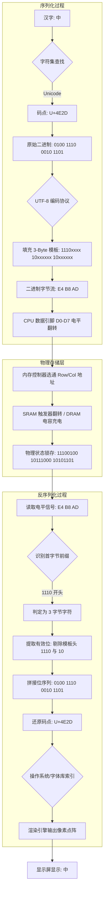

---
{"dg-publish":true,"permalink":"/Work/Script/PHP/Basics/PHP/","title":"PHP","tags":["flashcards"],"noteIcon":"","created":"2026-03-10T22:33:54.000+08:00","updated":"2026-03-12T10:31:25.366+08:00"}
---


# 基本语法 [¶](https://www.php.net/manual/zh/language.basic-syntax.php#language.basic-syntax)
## 命名规范
```
只能由“字母、_、数字”构成
不能以数字开始
不能和关键字重名
```
## 注释
```
/**/ // #
```
# 类型 [¶](https://www.php.net/manual/zh/language.types.php#language.types)
## 数据类型
### 内置类型
- 标量类型：
	- [bool](https://www.php.net/manual/zh/language.types.boolean.php) 类型
	- [int](https://www.php.net/manual/zh/language.types.integer.php) 类型
	- [float](https://www.php.net/manual/zh/language.types.float.php) 类型
	- [string](https://www.php.net/manual/zh/language.types.string.php) 类型
- [array](https://www.php.net/manual/zh/language.types.array.php) 类型
- [object](https://www.php.net/manual/zh/language.types.object.php) 类型
- [resource](https://www.php.net/manual/zh/language.types.resource.php) 类型
- [never](https://www.php.net/manual/zh/language.types.never.php) 类型
- [void](https://www.php.net/manual/zh/language.types.void.php) 类型
- [相对类类型](https://www.php.net/manual/zh/language.types.relative-class-types.php)：self、parent 和 static
- [单例类型](https://www.php.net/manual/zh/language.types.singleton.php)
	- [false](https://www.php.net/manual/zh/language.types.singleton.php)
	- [true](https://www.php.net/manual/zh/language.types.singleton.php)
- 单值类型
	- [null](https://www.php.net/manual/zh/language.types.null.php)
### 用户定义的类型（通常称为类类型）
- [接口](https://www.php.net/manual/zh/language.oop5.interfaces.php)
- [类](https://www.php.net/manual/zh/language.oop5.basic.php#language.oop5.basic.class)
- [枚举](https://www.php.net/manual/zh/language.types.enumerations.php)
### [callable](https://www.php.net/manual/zh/language.types.callable.php) 类型
### [Mixed](https://www.php.net/manual/zh/language.types.mixed.php) 类型
### 类型判断
- is_a() (是否是该对象的实例)
- is_array() (是否为数组)
- is_bool() (是否为布尔值)
- is_float() (是否为浮点型)
- is_int() (是否为整型, 字符串型整数为false)
- is_numeric() (检测是否是数字, 只要是数字就返回true, 与数据类型无关)
- is_null() (是否为null)
- is_string() (是否为字符串)
- is_resource() (是否为资源类型)
- is_callable() (是否为合法的可调用结构)……
- gettype() (获取变量的类型) settype() (设置变量的类型)
#### is_numeric
检测是否为string类型数字串或int、float类型数字，可为负数和小数
(注: 只要是数字就返回true, 与数据类型无关)
```php
var_export(is_numeric(123));// 输出结果: true
var_export(is_numeric('123'));// 输出结果: true
var_export(is_numeric(-123));// 输出结果: true
var_export(is_numeric('-123'));// 输出结果: true
var_export(is_numeric(123.123));// 输出结果: true
var_export(is_numeric('123.123'));// 输出结果: true
var_export(is_numeric(-123.123));// 输出结果: true
var_export(is_numeric('-123.123'));// 输出结果: true
```
#### ctype_digit
检测字符串中的字符是否都是数字，int、float类型数字、负数和小数都不通过
```php
var_dump(ctype_digit('123'));// 输出结果: true

// 注：当被检验的数字位数>=4并<=10会返回true
var_dump(ctype_digit(1234));// 输出结果: true
// 注：当被检验的数字位数<3会返回false
var_dump(ctype_digit(123));// 输出结果: false

var_dump(ctype_digit(-123));// 输出结果: false
var_dump(ctype_digit('-123'));// 输出结果: false
var_dump(ctype_digit(123.123));// 输出结果: false
var_dump(ctype_digit('123.123'));// 输出结果: false
var_dump(ctype_digit(-123.123));// 输出结果: false
var_dump(ctype_digit('-123.123'));// 输出结果: false
```
### 类型转换
- int,string,float的自动转换 .连接字符转字符串类型 +连接转整型/浮点型
- intval()(获取变量的整数值)
- doubleval()/floatval() (获取变量的浮点值)
- strval() (获取变量的字符串值)
#### 方式一
```php
$str = '123.9abc';
var_dump(intval($str)); // int(123)
var_dump(floatval($str)); // float(123.9)
var_dump(doubleval($str)); // float(123.9)
var_dump(strval($str)); // string(8) "123.9abc"

$str = 'aa123.9abc'; // 注: 当数字前有字符串数字类型转换后都为0
var_dump(intval($str)); // int(0)
var_dump(floatval($str)); // double(0)
var_dump(doubleval($str)); // double(0)
var_dump(strval($str)); // string(8) "aa123.9abc"
```
#### 方式二
```php
$foo = "5bar";
$bar = true;

var_dump($foo); // string(4) "5bar"
var_dump($bar); // bool(true)

settype($foo, "integer");
settype($bar, "string");

var_dump($foo); // int(5)
var_dump($bar); // string(1) "1"

echo "\n----------------------\n";

var_dump($foo . '1'); // string(2) "51" .连接字符转字符串类型
var_dump($bar + 1);   // int(2) +连接转整型/浮点型
var_dump($bar + 1.1); // float(2.1)
```
## 打印数据结构
调试用（带类型） → var_dump($var)
查看数组结构（简洁） → print_r($var)
需要复制粘贴代码 → var_export($var)
### var_dump
显示数据类型和值
```php
$data = [
    'name' => 'Tom',
    'age' => 25,
    'active' => true,
];
var_dump($data);
/*
array(3) {
  ["name"]=>
  string(3) "Tom"
  ["age"]=>
  int(25)
  ["active"]=>
  bool(true)
}
*/
```
### var_export
类似于 var_dump()，但输出的是**有效的 PHP 代码**。
默认不返回值，可设置 true 返回字符串。
```php
$data = [
    'name' => 'Tom',
    'age' => 25,
    'active' => true,
];
var_export($data);
/*
array (
  'name' => 'Tom',
  'age' => 25,
  'active' => true,
)
*/
```
### print_r
默认不返回值，可设置 true 返回字符串。
```php
$data = [
    'name' => 'Tom',
    'age' => 25,
    'active' => true,
];
print_r($data);
/*
Array
(
    [name] => Tom
    [age] => 25
    [active] => 1
)
*/
```
## 常用值操作
```php
echo '<pre>' // 格式化输出
```
### empty、isset、unset
**注意**：如果变量不存在，`isset()`和`empty()`都不会报错；`is_null()`、`is_numeric()`会报错
#### 1.empty
如果 var 是非空或非零的值，则 empty() 返回 FALSE
true: ''、0、'0'、null、false、`[]`、$var
#### 2.isset
检测变量是否设置, 如果 var 存在则返回 TRUE，否则返回 FALSE
```
true: 0、null、''、false、[]
false:  0、null、$var
```
如何区别如下数组中 `[0,'',null]` 三个元素？
##### 区别0:
```php
$a = 0;
var_dump($a === 0); // true
```
##### 区别''
```php
$a = '';
var_dump(is_string($a)); // true
```
##### 区别null
```php
$a = NULL;
var_dump(is_null($a)); // true
```
另外在做表单提交的时候可能经常要检测一个变量是否存在
```php
$_REQUEST['status'] = 0;
var_dump(!empty($_REQUEST['status'])); // false
var_dump(isset($_REQUEST['status'])); // true
```
#### 3. is_null
检测变量是否为NULL
当参数满足下面三种情况时，is_null()将返回TRUE，其它的情况就是FALSE
1. 它被赋值为NULL
2. 它还没有赋值
3. 它未定义，相当于unset(),将一个变量unset()后
```php
var_dump(is_null(null)); // true
var_dump(is_null($b)); // true Notice: Undefined variable

$num = 520;
unset($num);
var_dump(is_null($num)); // true Notice: Undefined variable

var_dump(is_null(0));// false
var_dump(is_null(FALSE));// false
var_dump(is_null(''));// false
```
# 变量 [¶](https://www.php.net/manual/zh/language.variables.php#language.variables)
## 基础
有效的变量名由字母（`A-Z`、`a-z` 或 128 到 255 之间的字节）或者下划线开头，后面跟上任意数量的字母，数字，或者下划线。 按照正常的正则表达式，它将被表述为：`^[a-zA-Z_\x80-\xff][a-zA-Z0-9_\x80-\xff]*$`。
命名规范：驼峰命名法 **变量名区分大小写**
## 预定义变量
- [超全局变量](https://www.php.net/manual/zh/language.variables.superglobals.php) — 在全部作用域中始终可用的内置变量
- [`$GLOBALS`](https://www.php.net/manual/zh/reserved.variables.globals.php) — 引用全局作用域中可用的全部变量
- [`$_SERVER`](https://www.php.net/manual/zh/reserved.variables.server.php) — 服务器和执行环境信息
- [`$_GET`](https://www.php.net/manual/zh/reserved.variables.get.php) — HTTP GET 变量
- [`$_POST`](https://www.php.net/manual/zh/reserved.variables.post.php) — HTTP POST 变量
- [`$_FILES`](https://www.php.net/manual/zh/reserved.variables.files.php) — HTTP 文件上传变量
- [`$_REQUEST`](https://www.php.net/manual/zh/reserved.variables.request.php) — HTTP Request 变量
- [`$_SESSION`](https://www.php.net/manual/zh/reserved.variables.session.php) — Session 变量
- [`$_ENV`](https://www.php.net/manual/zh/reserved.variables.environment.php) — 环境变量
- [`$_COOKIE`](https://www.php.net/manual/zh/reserved.variables.cookies.php) — HTTP Cookies
- [$php_errormsg](https://www.php.net/manual/zh/reserved.variables.phperrormsg.php) — 前一个错误信息
- [$http_response_header](https://www.php.net/manual/zh/reserved.variables.httpresponseheader.php) — HTTP 响应头
- [$argc](https://www.php.net/manual/zh/reserved.variables.argc.php) — 传递给脚本的参数数目
- [$argv](https://www.php.net/manual/zh/reserved.variables.argv.php) — 传递给脚本的参数数组
### 示例「预定义变量」
```php
// 当前正在执行脚本的文件名，与 document root相关
echo $_SERVER['PHP_SELF'], PHP_EOL;
// 传递给该脚本的参数。
echo $_SERVER['argv'], PHP_EOL;
// 包含传递给程序的命令行参数的个数（如果运行在命令行模式）。
echo $_SERVER['argc'], PHP_EOL;
// 服务器使用的 CGI 规范的版本。例如，“CGI/1.1”。
echo $_SERVER['GATEWAY_INTERFACE'], PHP_EOL;
// 当前运行脚本所在服务器主机的名称。
echo $_SERVER['SERVER_NAME'], PHP_EOL;
// 服务器标识的字串，在响应请求时的头部中给出。
echo $_SERVER['SERVER_SOFTWARE'], PHP_EOL;
// 请求页面时通信协议的名称和版本。例如，“HTTP/1.0”。
echo $_SERVER['SERVER_PROTOCOL'], PHP_EOL;
// 访问页面时的请求方法。例如：“GET”、“HEAD”，“POST”，“PUT”。
echo $_SERVER['REQUEST_METHOD'], PHP_EOL;
// 查询(query)的字符串。
echo $_SERVER['QUERY_STRING'], PHP_EOL;
// 当前运行脚本所在的文档根目录。在服务器配置文件中定义。
echo $_SERVER['DOCUMENT_ROOT'], PHP_EOL;
// 当前请求的 Accept: 头部的内容。
echo $_SERVER['HTTP_ACCEPT'], PHP_EOL;
// 当前请求的 Accept-Charset: 头部的内容。例如：“iso-8859-1,*,utf-8”。
echo $_SERVER['HTTP_ACCEPT_CHARSET'], PHP_EOL;
// 当前请求的 Accept-Encoding: 头部的内容。例如：“gzip”。
echo $_SERVER['HTTP_ACCEPT_ENCODING'], PHP_EOL;
// 当前请求的 Accept-Language: 头部的内容。例如：“en”。
echo $_SERVER['HTTP_ACCEPT_LANGUAGE'], PHP_EOL;
// 当前请求的 Connection: 头部的内容。例如：“Keep-Alive”。
echo $_SERVER['HTTP_CONNECTION'], PHP_EOL;
// 当前请求的 Host: 头部的内容。
echo $_SERVER['HTTP_HOST'], PHP_EOL;
// 链接到当前页面的前一页面的 URL 地址。
echo $_SERVER['HTTP_REFERER'], PHP_EOL;
// 当前请求的 User_Agent: 头部的内容。
echo $_SERVER['HTTP_USER_AGENT'], PHP_EOL;
// 如果通过https访问,则被设为一个非空的值(on)，否则返回off
echo $_SERVER['HTTPS'], PHP_EOL;
// 正在浏览当前页面用户的 IP 地址。
echo $_SERVER['REMOTE_ADDR'], PHP_EOL;
// 正在浏览当前页面用户的主机名。
echo $_SERVER['REMOTE_HOST'], PHP_EOL;
// 用户连接到服务器时所使用的端口。
echo $_SERVER['REMOTE_PORT'], PHP_EOL;
// 当前执行脚本的绝对路径名。
echo $_SERVER['SCRIPT_FILENAME'], PHP_EOL;
// 管理员信息
echo $_SERVER['SERVER_ADMIN'], PHP_EOL;
// 服务器所使用的端口
echo $_SERVER['SERVER_PORT'], PHP_EOL;
// 包含服务器版本和虚拟主机名的字符串。
echo $_SERVER['SERVER_SIGNATURE'], PHP_EOL;
// 当前脚本所在文件系统（不是文档根目录）的基本路径。
echo $_SERVER['PATH_TRANSLATED'], PHP_EOL;
// 包含当前脚本的路径。这在页面需要指向自己时非常有用。
echo $_SERVER['SCRIPT_NAME'], PHP_EOL;
// 访问此页面所需的 URI。例如: /index.html
echo $_SERVER['REQUEST_URI'], PHP_EOL;
// 当 PHP 运行在 Apache 模块方式下，并且正在使用 HTTP 认证功能，这个变量便是用户输入的用户名。
echo $_SERVER['PHP_AUTH_USER'], PHP_EOL;

// 实例
echo $_SERVER['SERVER_NAME']; // www.test.com
echo $_SERVER['HTTP_HOST']; // www.test.com
echo $_SERVER['PHP_SELF']; // /index.php
echo $_SERVER['QUERY_STRING']; // a=1
echo $_SERVER['REQUEST_URI']; // /index.php?a=1
echo $_SERVER['HTTP_REFERER']; // 返回上一个页面的链接
echo $_SERVER['REMOTE_ADDR']; // 显示客户端IP
echo $_SERVER['SERVER_ADDR']; // 服务器IP
echo $_SERVER['REQUEST_TIME']; // 请求时间

echo 'http://' , $_SERVER['SERVER_NAME'] , $_SERVER['PHP_SELF'] , '?' , $_SERVER ['QUERY_STRING'];
// http://www.test.com/index.php?a=1
```
### `$varName、${varName}(推荐)、$$var、${$var}`
```php
$a = 'c';
${$a} = 'cc';
echo $c; // cc

// ${}作用在于,当代码有多种解析时,让php解释器正确解析代码
$c = ['d' => 'e'];
echo "${c['d']}"; // e

// null 的代码也有歧义
$var = "hello";
$var_ = "world";
echo "{$var}_ $var_"; //hello_ world

$var = "hello";
$var_ = "world";
echo "{$var_} $var_"; // world world
```
## 变量作用域
### 概念
变量仅在它申明的语句块中可以访问
`global、static、局部、$GLOBALS`
用`global $var`声明一个变量时, 实际上建立了一个到全局变量的引用。相当于: `$var =& $GLOBALS["var"]`;
```php
$a = 'test'; // 全局变量
function get()
{
    global $a; // 方式1, 声明全局变量$a「`global` 关键字用于将变量从全局作用域绑定到局部作用域, 且建立引用关系」
    $a = 233;
    echo $a, PHP_EOL;
    echo $GLOBALS['a'], PHP_EOL; // 方式2, 声明全局变量$a
}
get();
echo $a, PHP_EOL; // 因建立引用关系导致被修改
/*
233
233
233
*/
```
在函数内部,也可以通过引用内部变量进行赋值,但该引用只在函数内部可见:
```php
$a='test';
$b='done';
function Sorted(){
	global $a,$b;
	$a=&$b; //将$a对'test'的引用,变为对'done'的引用;
	echo $a; //done, 在函数内部生效;
}
Sorted();
echo $a; // test,函数外部变量没有变化
```
### 全局变量
申明在所有语句块之外的变量
global
### 局部变量
申明在语句块中的变量
## 可变变量
```php
$a = 'hello';
$a = 'world';
echo "$a $hello"; // hello world
```
## 来自 PHP 之外的变量 [¶](https://www.php.net/manual/zh/language.variables.external.php#language.variables.external)
当一个表单提交给 PHP 脚本时，表单中的信息会自动在脚本中可用。
```php
if ($_POST) {
    echo '<pre>';
    echo htmlspecialchars(print_r($_POST, true));
    echo '</pre>';
}
?>
<form action="" method="post">
    Name:  <input type="text" name="personal[name]" /><br />
    Email: <input type="text" name="personal[email]" /><br />
    Beer: <br />
    <select multiple name="beer[]">
        <option value="warthog">Warthog</option>
        <option value="guinness">Guinness</option>
        <option value="stuttgarter">Stuttgarter Schwabenbräu</option>
    </select><br />
    <input type="submit" value="submit me!" />
</form>
```
# 常量 [¶](https://www.php.net/manual/zh/language.constants.php#language.constants)
## 语法 [¶](https://www.php.net/manual/zh/language.constants.syntax.php#language.constants.syntax)
可以使用 `const` 关键字或 [define()](https://www.php.net/manual/zh/function.define.php) 函数两种方法来定义一个常量。
## 定义
define()
命名规范：全大写,单词间用_分割
```php
define('USER_NAME', '大圣');
const ADDRESS = '花果山';
echo USER_NAME, AGE, ADDRESS; // 大圣花果山
```
## 常量类型(只能是标量)
boolean、integer、float、string
## 预定义常量 [¶](https://www.php.net/manual/zh/reserved.constants.php#reserved.constants)
```php
// 显示PHP版本
echo PHP_VERSION; // 7.1.13
// 显示操作系统名称
echo PHP_OS; // WINNT
// 换行符号,相较\n,以提高代码的源代码级可移植性
echo PHP_EOL;
...
```
## 常量调用
### 1. 使用常量名直接获取值
```php
define('π', 3.1415926);
$r = 2;
echo π * $r * $r; // 计算圆的面积
```
### 2. 使用constant()函数
```php
define('π', 3.1415926);
$r = 2;
echo constant('π') * $r * $r; // 计算圆的面积
```
## 判定常量是否被定义
### defined()
函数可以帮助我们判断一个常量是否已经定义
```php
define('π', 3.1415926);
var_export(defined('π'));// true
var_export(defined('π2'));// false
```
## 魔术变量
### `__DIR__ `
返回当前文件路径名
```php
echo __DIR__; // C:\test
```
### `__FILE__ `
返回当前文件名
```php
echo __FILE__; // C:\test\index.php
```
### `__LINE__`
返回当前行数
```php
echo __LINE__; // 2
```
### `__FUNCTION__`
返回该函数被定义时的名字(区分大小写)
```php
function test()
{
    echo '函数名为：' . __FUNCTION__;
}

test(); // 函数名为：test ()
```
### `__CLASS__`
返回该类被定义时的名字(区分大小写)
```php
class Test
{
    function _print()
    {
        echo '类名为：' . __CLASS__ . PHP_EOL;
        echo '函数名为：' . __FUNCTION__;
    }
}

$t = new test(); // 类名为：Test 
$t->_print(); // 函数名为：_print
```
### `__TRAIT__`
返回Trait 的名字(区分大小写)
```php
class Base
{
    public function sayHello()
    {
        echo 'Hello ';
    }
}

trait SayWorld
{
    public function sayHello()
    {
        echo __TRAIT__;
    }
}

class MyHelloWorld extends Base
{
    use SayWorld;
}

$o = new MyHelloWorld();
$o->sayHello(); // SayWorld
```
### `__METHOD__`
返回该方法被定义时的名字(区分大小写)
```php
function test()
{
    echo '函数名为：' . __METHOD__;
}

test(); // 函数名为：test
```
### `__NAMESPACE__`
当前命名空间的名称(区分大小写)
```php
namespace MyProject;

echo '命名空间为："', __NAMESPACE__, '"'; // 命名空间为："MyProject"
```
# 原码、反码、补码
## 原码 (Sign-Magnitude)
原码是最直观的表示方法，但现代计算机很少使用。
* **最高位 (MSB)**：用作符号位（$0$ 为正，$1$ 为负）。
* **其余位**：表示该数字的**绝对值**。
#### 原码示例（8 位）：
* $+5 = \mathbf{0}0000101$
* $-5 = \mathbf{1}0000101$
* **缺点：** 存在**两种表示零的方式**（$+0 = 00000000$ 和 $-0 = 10000000$），**且加减运算复杂**。
## 反码 (One's Complement)
反码是介于原码和补码之间的方法。
* **正数：** 与原码相同。
* **负数：** 正数的二进制表示**所有位取反**（$0$ 变 $1$，$1$ 变 $0$）。
#### 反码示例（8 位）：
* $+5 = 00000101$
* $-5 = 11111010$ (将 $00000101$ 的所有位取反)
* **缺点：** 与原码一样，存在**两种表示零的方式**（$+0 = 00000000$ 和 $-0 = 11111111$）。
## 补码 (Two's Complement) - 现代计算机标准
**在学习计算机科学时，请重点理解和掌握补码。**
补码是最流行和最高效的方法，它有以下关键特征：
### 补码的表示方法
在一个 $N$ 位系统中：
1.  **最高位 (Most Significant Bit, MSB) 为符号位：**
    * **0** 代表**正数**或零。
    * **1** 代表**负数**。
2.  **正数和零：** **正数的补码**就是它本身的二进制表示。
    * 例如(8位)：$+5 = 00000101$
3.  **负数：** **负数的补码**是通过以下三个步骤计算得到的：
    * **步骤 1：** 找出该数字绝对值（正数）的二进制表示（原码）。
    * **步骤 2：** 取反码（将所有 $0$ 变成 $1$，所有 $1$ 变成 $0$）。
    * **步骤 3：** 在反码的基础上**加 $1$**。
#### 补码示例（以 8 位表示 -5）：
| 步骤         | 操作                     | 结果                                 |
| :--------- | :--------------------- | :--------------------------------- |
| **Step 1** | 找出该数字绝对值（正数）的二进制表示（原码） | $00000101$                         |
| **Step 2** | 取反码（所有位取反）             | $11111010$                         |
| **Step 3** | 在反码的基础上**加 $1$**       | $11111010 + 1 = \mathbf{11111011}$ |
所以，$-5$ 的 8 位补码表示是 $11111011$。
### 补码的优势
#### 唯一表示零
* 只有一种方式表示 $0$ ($000\dots000$）。
#### 简化加法运算
* 补码的优点在于**加减法统一** (减法 $A - B$ 可以**直接用 $A + (-B)$ 来实现**)，可以直接使用**二进制加法器**进行计算，**简化了硬件设计**。
**示例**
- 因为：$11111111 + 00000001 = 100000000$
- 在 8 位系统中，最前面的进位（第 9 位）会被截断（溢出），结果就是 **$00000000$**，符合 $-1 + 1 = 0$ 的运算规则。
这是一个关于补码系统设计原理的优秀问题。这个范围限制 $(\text{Range} = -2^{N-1} \text{ 到 } 2^{N-1} - 1)$ 的出现，完全是由 **补码的性质** 和 **位数的分配** 决定的。
对于 $N=8$ 位系统，我们有 8 个二进制位来存储数据。
### 为什么 8 位补码范围是 -128 到 127？
#### 1. 符号位 (Sign Bit)
在补码系统中，最高的 1 位被专门用作**符号位 (Sign Bit)**：$\underbrace{X}_{符号}\underbrace{X X X X X X X}_{数值}$
* $N=8$
* 符号位占用 1 位。
* 剩下的 **$N-1 = 7$ 位**用于表示数字的大小。
#### 2. 正数范围的确定
正数（包括 $0$）的符号位是 **$0$**。剩下的 7 位用来表示数值。
* **最小正数:** $0\ \underbrace{0000000}_{7个0}=0$
* **最大正数:** $0\ \underbrace{1111111}_{7个1}=127$
最大正数二进制数的值是：$2^{8-1} - 1 = 2^7 - 1 = 127$
因此，正数的范围是**从 $0$ 到 $127$**。
#### 3. 负数范围的确定（不对称性）
负数使用补码表示，符号位是 **$1$**。
* **最小负数（最大正数绝对值）：** 其补码表示是 $\mathbf{1} \underbrace{0000000}_{7个0} = \mathbf{-2^{N-1}} = -2^{8-1} = -2^7 = -128$
* **最大负数（最小正数绝对值）：** 其补码表示是 $\mathbf{1} \underbrace{1111111}_{7个1}=-1$
##### 为什么负数比正数多一个？（不对称性）
这个范围 $[-128, 127]$ 之所以不对称，是因为 **$0$ 占据了一个正数的位置**：
1. **正数的数量:** 正数从 $0$ 到 $127$，共有 $128$ 个数字。
    * 它们使用了 $00000000$ 到 $01111111$ 的 $128$ 个组合。
2. **负数的数量:** 负数从 $-1$ 到 $-128$，共有 $128$ 个数字。
    * 它们使用了 $11111111$ 到 $10000000$ 的 $128$ 个组合。
$$\text{总共的数字数量} = 128 (\text{正数和零}) + 128 (\text{负数}) = 256 = 2^8$$
如果补码是对称的，它应该表示 $-127$ 到 $127$。
但由于**补码**系统**消除了原码和反码中 $\pm 0$ 的冗余**，它将 $-0$ 那个编码 ($\mathbf{10000000}$) 重新分配给了多出来的那个负数 $\mathbf{-128}$，从而实现了最大的利用率。
这就是为什么对于 $N$ 位系统，范围是 $-2^{N-1} \text{ 到 } 2^{N-1} - 1$
## 总结和重点
| 表示法    | 正数表示  | 负数表示                                    | $0$ 的表示         | 现代应用              |
| :----- | :---- | :-------------------------------------- | :-------------- | :---------------- |
| **补码** | 直接二进制 | 原码 $\rightarrow$ 取反 $\rightarrow$ 加 $1$ | 唯一（$00\dots00$） | **主流**（用于 CPU 运算） |
| **原码** | 直接二进制 | 符号位为 $1$，其余为绝对值                         | 两种（$+0$ 和 $-0$） | 早期理论/浮点数尾数        |
| **反码** | 直接二进制 | 所有位取反                                   | 两种（$+0$ 和 $-0$） | 几乎不用              |
# 运算符 [¶](https://www.php.net/manual/zh/language.operators.php#language.operators)
## 算术
`- * / % = += -= *= /= %= ++ -- **`
## 字符串运算符 [¶](https://www.php.net/manual/zh/language.operators.string.php#language.operators.string)
有两个字符串（[string](https://www.php.net/manual/zh/language.types.string.php)）运算符。第一个是连接运算符（“.”），它返回其左右参数连接后的字符串。第二个是连接赋值运算符（“`.=`”），它将右边参数附加到左边的参数之后。更多信息见[赋值运算符](https://www.php.net/manual/zh/language.operators.assignment.php)。
```php
$a = "Hello ";
$b = $a . "World!"; // 现在 $b 包含 "Hello World!"

$a = "Hello ";
$a .= "World!";     // 现在 $a 包含 "Hello World!"
```
### Heredoc、Nowdoc
#### Heredoc 变量会被解析
1. 开始标记和结束标记使用相同的字符串，通常以大写字母来写。
2. 开始标记后不能出现空格或多余的字符。
3. 结束标记必须顶头写，不能有缩进和空格，且在结束标记末尾要有分号。
4. 位于开始标记和结束标记之间的变量可以被正常解析，但是函数则不可以。在heredoc中，变量不需要用连接符 . 或 , 来拼接 。
```php
// #1 非方法内使用EOF后面不可以跟;
$s = '德玛西亚';
echo <<<EOF
aaaaa
~!@#$%^&*()_+
{}:"|<>?"
$s
EOF
;

/*
aaaaa
~!@#$%^&*()_+
{}:"|<>?"
德玛西亚
*/

// #2 方法内使用EOF后面可以跟;
class My
{
    public static function test()
    {
        $s = '德玛西亚';
        echo <<<EOF
<html>
<head><title>主页</title></head>
<body>主页内容 $s</body>
</html>
EOF;
    }
}
My::test();

/*
<html>
<head><title>主页</title></head>
<body>主页内容 德玛西亚</body>
</html>
*/
```
#### Nowdoc 变量不会被解析
1. 标识符要用单引号括起来，即 <<<'EOF'
```php
// #1 非方法内使用EOF后面不可以跟;
$s = '德玛西亚';
echo <<<'EOF'
aa
$s
bb
EOF
;

/*
aa
$s
bb
*/

// #2 方法内使用EOF后面可以跟;
class My
{
    public static function test()
    {
        $s = '德玛西亚';
        echo <<<'EOF'
<html>
<head><title>主页</title></head>
<body>主页内容 $s</body>
</html>
EOF;
    }
}
My::test();

/*
<html>
<head><title>主页</title></head>
<body>主页内容 $s</body>
</html>
*/
```
## 赋值运算符 [¶](https://www.php.net/manual/zh/language.operators.assignment.php#language.operators.assignment)
### `&`「引用」 `=&`「引用赋值」
#### 核心逻辑
```php
$a = 1;
$b =& $a;
$c = $b;
$c = 7;
var_dump($a);
/*
结果是int(1)，为什么不是7呢？关键在第三步，$c=$b，这里的赋值只是将value进行传递，并没有建立引用$c和1的引用关系。
如果我们把第三步掉过来，变成$b=$c，那么$a的值就会变为7，因为$b的值是7.
需要注意的是，引用关联必须通过&进行传递，对于没有&的赋值，并不会传递引用关系，即便其中变量和其他变量有引用关系。
*/
```
#### 函数中的引用
引用返回与普通return的区别在于：
- 普通return只会影响**被赋值变量一次**;
- 而引用型的return,在**每次函数被调用之后,都会影响被赋值变量**. 这也合乎引用的核心逻辑.
```php
function &color(): array
{
    static $c1 = [];
    $c1[] = 'a'; // 每次调用，加一个 "a";
    return $c1; // 返回新数组;
}

$t1 =& color(); // 调用函数,并进行引用赋值,建立引用关系;
$t1[] = 'b'; // 加一个 "b"

$t2 = color(); // 调用函数,普通赋值,没有建立引用关系
color(); // 再次调用函数,添加一个 "a"

print_r($t1);// [a,b,a,a]，4次调用，都会对变量值有影响
print_r($t2);// [a,b,a]，只有前3次有影响，赋值后，变量值没有变化
```
#### 数组引用
##### 元素级别的引用关系
它可以通过普通数组间赋值来传递引用关系.
```php
// 这是引用在数组中的一般应用,和普通赋值没有什么区别:
$a = [1, 2];
$b =& $a[1]; // $b和$a[1]都指向了2
$c = 3;
$a[1] =& $c;// $c给$a[1]赋予新的引用，都指向了3
echo $a[1], PHP_EOL; // 3
echo $b, PHP_EOL; // 2「$p的指向并没变」

// 这个是数组引用特殊的地方,不注意的话会出问题:
$arr1 = [1, 2];
$x = &$arr1[1]; // x和$arr1[1]指向同一个变量
$arr2 = $arr1; // 这里是数组对数组整体的赋值,将其中元素的引用关系,也进行了传递!
$arr2[1] = 22; // 更改[0]不会影响$arr1
var_dump($arr2, $x); // 同时修改了$arr1[1]
/*
array(2) {
  [0]=>
  int(1)
  [1]=>
  &int(22)
}
int(22)
*/
```
##### 数组级别的引用关系
它不可以通过普通数组间赋值来传递引用关系.
```php
$a = [1, 2, 3, 4];
$b = [5, 6, 7, 8];
$c =& $a; // 建立c和a的引用关系;
$b = $c; // 对b进行整体赋值
$c[3] = 100;
var_export($b);
/*
array (
    0 => 1,
    1 => 2,
    2 => 3,
    3 => 4,
)
*/
var_export($a);
/*
array (
  0 => 1,
  1 => 2,
  2 => 3,
  3 => 100,
)
*/
var_export($c);
/*
array (
  0 => 1,
  1 => 2,
  2 => 3,
  3 => 100,
)
*/
```
##### foreach()引用的小尾巴
###### **现象**
```php
$arr = [1, 2, 3];
foreach ($arr as &$v) {
    $v = $v * 2;
}
var_dump($arr); // [2,4,6] 通过引用实现了对数组所有元素的修改
/*
array(3) {
  [0]=>
  int(2)
  [1]=>
  int(4)
  [2]=>
  &int(6) // 数组最后一个元素的 $v 引用在 foreach 循环之后仍会保留。这个就是 foreach引用的小尾巴.
}
 */
 
foreach ($arr as $k => $v) {
    echo $k, ' => ', $v, PHP_EOL;
}
/*
0 => 2
1 => 4
2 => 4 // 此时$[2] = 4，因为引用小尾巴导致的
*/
/* 解析步骤
$v = $arr[0] = 2, 此时$arr[2] = 2;
$v = $arr[1] = 4, 此时$arr[2] = 4;
$v = $arr[2] = 4, 此时$arr[2] = 4; 
*/
```
###### **如何解决**
1. unset, 每次foreach遍历后,都对引用变量$value进行unset, 解除它与数组元素的引用关系.
2. 手动赋值
```php
foreach ($arr as $k => $v) {
    $arr[$k] = $v * 2;
}
```
3. unset, 每次foreach遍历后,都对引用变量$value进行unset, 解除它与数组元素的引用关系.
```php
$arr = [1, 2, 3];
foreach ($arr as &$v) {
    $v = $v * 2;
}
unset($v);
foreach ($arr as $k => $v) {
    echo $k, ' => ', $v, PHP_EOL;
}
/*
0 => 2
1 => 4
2 => 6 
*/
```
## 位运算
位运算符的优先级从高到低依次为：`~、<<>>、&、^、|`
### 概述
从现代计算机中所有的数据二进制的形式存储在设备中。即 0、1 两种状态，计算机对二进制数据进行的运算`(+、-、*、/)`都是叫位运算，即将符号位共同参与运算的运算。
口说无凭，举一个简单的例子来看下 CPU 是如何进行计算的，比如这行代码：
```php
$a = 35;
$b = 47;
$c = $a + $b;
```
计算两个数的和，因为在计算机中都是以二进制来进行运算，所以上面我们所给的 int 变量会在机器内部先转换为二进制在进行相加：
```shell
35:  0 0 1 0 0 0 1 1
47:  0 0 1 0 1 1 1 1
————————————————————
82:  0 1 0 1 0 0 1 0
```
所以，相比在代码中直接使用`(+、-、*、/)`运算符，合理的运用位运算更能显著提高代码在机器上的执行效率。
### 位运算概览
| 符号  | 描述  | 运算规则                                                            |
| --- | --- | --------------------------------------------------------------- |
| &   | 与   | 两个位都为1时，结果才为1                                                   |
| \|  | 或   | 两个位都为0时，结果才为0                                                   |
| ^   | 异或  | 两个位相同为0，相异为1                                                    |
| ~   | 取反  | 0变1，1变0                                                         |
| <<  | 左移  | 各二进位全部左移若干位，高位丢弃，低位补0                                           |
| >>  | 右移  | 各二进位全部右移若干位，对无符号数，高位补0，有符号数，各编译器处理方法不一样，有的补符号位（算术右移），有的补0（逻辑右移） |
### 按位与 &
#### 定义
参加运算的两个数据，按二进制位进行"与"运算。
运算规则：
```shell
0&0=0  0&1=0  1&0=0  1&1=1
```
总结：两位同时为1，结果才为1，否则结果为0。
例如：3&5 即 0000 0011& 0000 0101 = 0000 0001，因此 3&5 的值得1。
注意：负数按补码形式参加按位与运算。
#### 用途
1. 设置位为0
如果想将一个单元清零，即使其全部二进制位为0，只要与一个各位都为零的数值相与，结果为零。
2. 取指定位
比如取数 `X=1010 1110` 的低4位，只需要另找一个数Y，令Y的低4位为1，其余位为0，即`Y=0000 1111`，然后将X与Y进行按位与运算（`X&Y=0000 1110`）即可得到X的指定位。
3. 判断奇偶
只要根据最未位是0还是1来决定，为0就是偶数，为1就是奇数。因此可以用`if ((a & 1) == 0)`代替`if (a % 2 == 0)`来判断a是不是偶数。
```php
$a = [1, 2, 3];
foreach ($a as $v) {
    // 判断奇偶数, 奇数返回1, 偶数返回0
    echo ($v & 1 ? '奇数' : '偶数') . ", 十进制: $v, 二进制: " . decbin($v) . PHP_EOL;
}
/*
奇数, 十进制: 1, 二进制: 1
偶数, 十进制: 2, 二进制: 10
奇数, 十进制: 3, 二进制: 11
*/
```
### 按位或 |
#### 定义
参加运算的两个对象，按二进制位进行"或"运算。
运算规则：
```shell
0|0=0  0|1=1  1|0=1  1|1=1
```
总结：参加运算的两个对象只要有一个为1，其值为1。
例如：3|5即 0000 0011| 0000 0101 = 0000 0111，因此，3|5的值得7。
注意：负数按补码形式参加按位或运算。
#### 用途
设置位为1
比如将数 X=1010 1110 的低4位设置为1，只需要另找一个数Y，令Y的低4位为1，其余位为0，即Y=0000 1111，然后将X与Y进行按位或运算（X|Y=1010 1111）即可得到。
### 按位异或 ^
#### 定义
参加运算的两个数据，按二进制位进行"异或"运算。
运算规则：
```shell
0^0=0  0^1=1  1^0=1  1^1=0
```
总结：参加运算的两个对象，如果两个相应位相同为0，相异为1。
#### 异或的性质
1. 交换律
2. 结合律(a^b)^c == a^(b^c)
3. 对于任何数x，都有 x^x=0，x^0=x
4. 自反性: a^b^b=a^0=a;
#### 用途
1. 翻转指定位
比如将数 X=1010 1110 的低4位进行翻转，只需要另找一个数Y，令Y的低4位为1，其余位为0，即Y=0000 1111，然后将X与Y进行异或运算（X^Y=1010 0001）即可得到。
2. 与0相异或值不变
例如：1010 1110 ^ 0000 0000 = 1010 1110
3. 交换两个数
```php
$a = 666;
$b = 888;
$a = $a ^ $b;
$b = $b ^ $a;
$a = $b ^ $a;
echo $a, '-', $b; // 888-666
```
### 按位取反 ~
#### 定义
参加运算的一个数据，按二进制进行"取反"运算。
运算规则：
```shell
~1=0
~0=1
```
总结：对一个二进制数按位取反，即将0变1，1变0。
#### 用途
使一个数的最低位为零
使a的最低位为0，可以表示为：a & ~1。~1的值为 1111 1111 1111 1110，再按"与"运算，最低位一定为0。因为" ~"运算符的优先级比算术运算符、关系运算符、逻辑运算符和其他运算符都高。
### 按位左移 <<
#### 定义
将一个数的各二进制位，全部左移若干位右边补0。
相当于该数乘以2。
#### 用途
 乘以2
```php
echo 2 << 1; // 4
```
### 按位右移 >>
#### 定义
将一个数的各二进制位，全部右移若干位，正数左补0，负数左补1，右边丢弃。
相当于该数除以2。
#### 用途
 除以2
```php
echo 2 >> 1; // 1
```
### 复合赋值运算符
位运算符与赋值运算符结合，组成新的复合赋值运算符，它们是：
```php
&= // 例：a&=b 相当于 a=a&b
|= // 例：a|=b 相当于 a=a|b
>>= // 例：a>>=b 相当于 a=a>>b
<<= // 例：a<<=b 相当于 a=a<<b
^= // 例：a^=b 相当于 a=a^b
```
#### 运算规则
和前面讲的复合赋值运算符的运算规则相似。不同长度的数据进行位运算：如果两个不同长度的数据进行位运算时，系统会将二者按右端对齐，然后进行位运算。
以"与运算"为例说明如下：我们知道在C语言中long型占4个字节，int型占2个字节，如果一个long型数据与一个int型数据进行"与运算"，右端对齐后，左边不足的位依下面三种情况补足，
1. 如果整型数据为正数，左边补16个0。
2. 如果整型数据为负数，左边补16个1。
3. 如果整形数据为无符号数，左边也补16个0。
## 错误控制
### 错误控制
- `@ or die`(显示要输入的内容)
- `error_reporting`
- `error_reporting(E_ALL);` 显示所有错误
- `error_reporting(E_ALL || ~E_NOTICE);` 只抛出致命错误，一般提示性错误不显示
- `error_reporting(0);` 什么都不显示
```php
@$ret = 3/0 or die('11'); // 抑制所有错误信息
var_export($ret); // INF

error_reporting(0); // 不显示任何错误信息
$ret = 3/0 or die('11');
echo $ret; // INF
```
### PHP错误配置
```php
// 错误回显，错误回显会暴露出非常多的敏感信息, 一般常用于开发环境。
ini_set('display_errors', 'On');

// 用日志记录错误信息, 一般常用于生产环境。
ini_set('log_errors', 'On'); // 错误日志
ini_set('error_log', '/var/log/php-error.log '); // 错误日志路径
```
## 类型运算符 [¶](https://www.php.net/manual/zh/language.operators.type.php#language.operators.type)
- 确定一个 PHP 变量是否属于某一类 [class](https://www.php.net/manual/zh/language.oop5.basic.php#language.oop5.basic.class) 的实例
- 确定一个变量是不是**继承**自某一**父类**的**子类的实例**
- 虽然 `instanceof` 通常直接与类名一起使用，但也可以使用对象或字符串变量
- 将 `instanceof` 与任意表达式一起使用
```php
class MyClass {}
class ChildClass extends MyClass {}
class NotMyClass {}
$a = new ChildClass;
var_dump($a instanceof MyClass);    // bool(true)
var_dump($a instanceof ChildClass); // bool(true)
var_dump($a instanceof NotMyClass); // bool(false)

// 也可以使用对象或字符串变量
$b = new MyClass();
var_dump($a instanceof $b); // bool(true)
$c = 'MyClass';
var_dump($a instanceof $c); // bool(true)
// 与任意表达式一起使用
var_dump($a instanceof ('ChildClass')); // bool(true)
```
- 确定一个变量是不是实现了某个[接口](https://www.php.net/manual/zh/language.oop5.interfaces.php)的对象的实例
```php
interface MyInterface {}
class MyClass implements MyInterface {}
$a = new MyClass;
var_dump($a instanceof MyClass); // true
var_dump($a instanceof MyInterface); // true
```
# 流程控制 [¶](https://www.php.net/manual/zh/language.control-structures.php#language.control-structures)
## 简介 [¶](https://www.php.net/manual/zh/control-structures.intro.php#control-structures.intro)
任何 PHP 脚本都是由一系列语句构成的。
## 语句
```php
// 单分支
if (条件) {
    条件成立执行
}
// 双分支
if (条件) {
    条件成立执行
} else {
    条件不成立执行
}
// 多分支
if (条件) {
    执行语句
} else if (条件) {
    执行语句
} else {
    执行语句
}
// 嵌套if
if (条件) {
    执行语句
    if (条件) {
        执行语句
    }
}

// switch
switch (被比较值) {
    case 比较值1:
        比较值1成功时执行;
        break;
        ……
    default:
        比较不成功时执行;
}

// #1 松散比较
foreach ([1, 2, 3] as $v) {
    switch ($v) {
        case true;
            echo $v;
            break;
        case 2;
            echo $v;
            break;
        case '3';
            echo $v;
            break;
        default:
            echo 0;
    }
}
// 123

// #2 表达式比较
switch (true) {
    case ($a === true):
        echo '$a is true';
        break;
    case ($a === false):
        echo '$a is false';
        break;
    case ($a === 0):
        echo '$a is 0';
        break;
}
// $a is 01

// #3 多条件比较
switch ('bar') {
    case ('foo'):
    case ('bar'):
        echo 1;
        break;
    case ('other'):
        echo 0;
        break;
    default:
}
// 1
```
## 循环
能够根据条件重复执行的语句块
开始条件、循环条件、中止条件
```php
while(){}、do{}while()、for(){}、foreach(){}
```
### 循环中断语句
```php
break、continue、exit、return
```
### 常见循环
```php
while、for、do…while、goto（不建议使用）
```
示例
```php
// while 循环
while (条件) {
    循环体
}

// for循环
for (初始化; 条件; 增量表达式) {
    循环体
}

// do…while与循环中断语句
do {
    循环体
} while (条件);
```
### break 与 continue 的多层级跳出机制
在 PHP 中，跳出多层嵌套循环不像 Go 语言（使用 `label`）或 Python 那样需要复杂的逻辑判断。[[Work/Script/Go/Golang开发新手常犯的50个错误#14、for switch 与 for select 的跳出机制\|Golang开发新手常犯的50个错误#14、for switch 与 for select 的跳出机制]]
PHP 的 `break` 和 `continue` 关键字原生支持**数字参数**，用于指定要跳出的循环层数。
#### 1. 核心语法：`break n`
* **`break 1;`**：跳出当前最内层循环（等同于直接写 `break;`）。
* **`break 2;`**：跳出当前循环及其直接外层循环。
* **`break n;`**：向上跳出  层循环。
##### 代码示例：
```php
$matrix = [
    [1, 2, 3],
    [4, 9, 6], // 假设我们找到 9 就停止全部搜索
    [7, 8, 5],
];

foreach ($matrix as $row) {
    foreach ($row as $item) {
        if ($item === 9) {
            echo "找到了 9，退出全部循环。", PHP_EOL;
            break 2; // 同时跳出内层 foreach 和外层 foreach
        }
        echo "检查数字: $item", PHP_EOL;
    }
}
/*
检查数字: 1
检查数字: 2
检查数字: 3
检查数字: 4
找到了 9，退出全部循环。
*/
```
#### 2. 核心语法：`continue n`
`continue` 同样接受可选的数字参数，表示跳到第  层循环的下一次迭代。
* **`continue 2;`**：结束当前内层循环，直接触发**外层循环**的下一次迭代。
##### 代码示例：
```php
for ($i = 1; $i <= 3; $i++) {
    for ($j = 1; $j <= 3; $j++) {
        if ($i === $j) {
            continue 2; // 跳过当前行剩余部分，直接开始下一行 ($i++)
        }
        echo "i=$i, j=$j", PHP_EOL;
    }
}
/*
i=2, j=1
i=3, j=1
i=3, j=2
*/
```
#### 3. 与其他语言的差异
| 特性      | PHP                         | Go                       | Java / JS                |
| ------- | --------------------------- | ------------------------ | ------------------------ |
| **机制**  | **数字标识** (`break 2`)        | **标签标识** (`break Label`) | **标签标识** (`break label`) |
| **易读性** | 中（需手动数层数）                   | 高（明确知道跳到哪）               | 高                        |
| **灵活性** | 高（支持动态变量 `break $var`，但不推荐） | 稳定                       | 稳定                       |
#### 4. 专家建议与最佳实践
1. **限制层数**：尽量**避免写超过 3 层的嵌套循环**。如果必须跳出 3 层以上，通常说明代码需要重构，建议将内层逻辑封装成函数并使用 `return`。
2. **避免动态参数**：虽然 PHP 允许 `break $i;`，但这会让代码逻辑变得极难调试，严禁在生产环境使用。
3. **替代方案 (Return)**：在函数或方法中，使用 `return` 直接结束执行，往往比 `break 2` 更优雅且不易出错。
#### 5. 补充：如果层数不确定怎么办？
如果你在处理递归或极深层级时，可以使用 **`try...catch`** 配合自定义异常来强制中断：
```php
try {
    // 极其复杂的嵌套结构
    foreach ($a as $v) {
        foreach ($b as $v2) {
            if ($condition) throw new Exception("Finish");
        }
    }
} catch (Exception $e) {
    // 达到“跳出全部”的效果
}
```
[[Work/Script/PHP/Frame/Laravel/Laravel basics#集合中优雅实现“退出”或“中断”逻辑\|Laravel basics#集合中优雅实现“退出”或“中断”逻辑]]
## 三目运算
```php
// #1
$a = 1;
$b = $a == 1 ? 1 : 0;
var_export($b); // 1

// #2
// false: ''、0、'0'、null、false、[]
// error: $a undefined
$a = 1;
$b = $a ?: 0; // $a ? $a : 0; 的缩写
var_export($b); // 1

// #3
$a = 1;
$b = $a ?? 0; // isset()的简写
var_export($b); // 1
```
## 流程处理语句
```php
die、exit、sleep、return、include、include_once、require、require_once
```
### return
作用: 
1. 在函数里调用程序将会马上结束运行并返回参数
2. 在`include()、require()`语句包含的文件中被调用，程序执行将会马上返回到调用该文件的程序，而返回值将作为`include()`或者`require()`的返回值。
3. 在主程序中调用，那么主程序将会马上停止执行
4. 在循环中调用，那么**会终止此次循环**「视循环的层数，中止时到达的层数不同」
### include_once问题 
`struct.php`
```php
declare (strict_types=1);

class <?= $modelName ?>Struct extends <?= $stBaseName ?>

{
    // 模型字段
<?php foreach ($numberField as $attr) { ?>
    public <?= $attr['COLUMN_TYPE'] ?> $<?= $attr['COLUMN_NAME'] ?> = <?= $attr['COLUMN_DEFAULT'] ?>; // <?= $attr['COLUMN_COMMENT'].PHP_EOL ?>
<?php } ?>
}
```
`template.php`
```php
$tables = ["My", "My2"];
foreach ($tables as $table) {
    $context = [
        "modelName"   => $table,
        "stBaseName"  => "MyStruct",
        "numberField" => [
            "id"   => [
                'COLUMN_TYPE'    => 'int',
                'COLUMN_NAME'    => 'id',
                'COLUMN_DEFAULT' => '0',
                'COLUMN_COMMENT' => 'ID',
            ],
            "name" => [
                'COLUMN_TYPE'    => 'string',
                'COLUMN_NAME'    => 'name',
                'COLUMN_DEFAULT' => '0',
                'COLUMN_COMMENT' => '姓名',
            ],
        ],
    ];
    extract($context);
    ob_start();
    /**
     * 注意：此处必须使用 include
     * include_once 在第二次循环时会因“已加载”而跳过执行，导致无法接收新的 $context 变量。
     * include 则保证每次循环都重新解析并渲染模板。
     */
    // include_once "struct.php"; // ❌无法动态更新上下文
    include "struct.php"; // ✅将文件作为 PHP 代码执行，变量经过 PHP 解析器处理，每次调用都会重新执行
    $res = ob_get_contents();
    ob_end_clean();
    echo $res;
}
```
#### 核心原因：函数作用域与加载状态
`include_once` 的底层机制是：在脚本执行期间，**PHP 会记录已经加载过的文件路径**。如果该路径**已被加载**，后续的调用将**直接返回 `true`**，而不再执行文件中的代码。
步骤：
1. **第一次循环 ($table = "My")**：
	* 调用 `include_once "struct.php"`。
	* PHP 发现该文件从未加载，于是读取文件，将其中的 PHP 代码与 HTML 模板进行解析。
	* 由于使用了 `extract($context)`，此时变量 `$modelName` 等在当前作用域可用。
	* 解析结果存入缓冲区，第一次成功生成代码。
2. **第二次循环 ($table = "My2")**：
	* 再次调用 `include_once "struct.php"`。
	* **关键点**：PHP 检查已加载列表，发现 `struct.php` 已经加载过了。
	* PHP 为了节省性能，**不再重新读取和解析该文件**，直接返回 `true`。
	* **后果**：由于文件代码没有被重新执行，新的 `$context` 变量（即 "My2"）没有机会被填充到模板中。此时缓冲区获取的是空内容或上一次的结果。
#### 原理解析：Include vs Include_once
| 特性        | `include`                     | `include_once`              |
| --------- | ----------------------------- | --------------------------- |
| **执行频率**  | 每次调用都会重新读取、解析并执行代码。           | 全局仅执行一次，后续调用被忽略。            |
| **变量作用域** | 继承调用点的当前作用域。每次执行都会读取当前最新的变量值。 | 仅在第一次执行时读取当时的变量。            |
| **典型用途**  | **模板渲染**、循环生成内容、配置文件加载。       | **类定义**、函数库、常量定义（防止重复定义报错）。 |
# 函数 [¶](https://www.php.net/manual/zh/language.functions.php#language.functions)
## 概念
系列指令的集合，以方便统一调用重复的系列指令
形式参数、实际参数
函数名不区分大小写
## 语法
```php
function 函数名 (形参=默认值) {
    方法体
    return 返回值
}
```
## 可变函数 [¶](https://www.php.net/manual/zh/functions.variable-functions.php#functions.variable-functions)
PHP 支持可变函数的概念。这意味着如果一个变量名后有圆括号，PHP 将寻找与变量的值同名的函数，并且尝试执行它。可变函数可以用来实现包括回调函数，函数表在内的一些用途。
### 示例
```php
function foo() {
    echo "In foo()<br />\n";
}

function bar($arg = '')
{
    echo "In bar(); argument was '$arg'.<br />\n";
}

// 使用 echo 的包装函数
function echoit($string)
{
    echo $string;
}

$func = 'foo';
$func();        // 调用 foo()

$func = 'bar';
$func('test');  // 调用 bar()

$func = 'echoit';
$func('test');  // 调用 echoit()
```
### 动态调用
#### call_user_func
把第一个参数作为回调函数调用
**支持多种回调类型**：
- 函数：`call_user_func('myFunction')`
- 静态方法：`call_user_func(['MyClass', 'staticMethod'])`
- 闭包：`call_user_func($closure)`
```php
function barber($a, $b, $c)
{
    echo "$a $b $c";
}
// 调用函数，其余参数作为回调函数的参数
call_user_func('barber', 1, 2, 3); // 1 2 3
```
#### call_user_func_array
调用回调函数，并把一个数组参数作为回调函数的参数
```php
// #1 使用两个参数调用foobar()函数
function foobar($arg, $arg2): void
{
    echo __FUNCTION__, " got $arg and $arg2", PHP_EOL;

}
call_user_func_array('foobar', ['one', 'two']);
// foobar got one and two

// #2 使用两个参数调用Foo类的bar方法
class foo  
{  
    function bar($arg, $arg2)  
    {  
        echo __METHOD__, " got $arg and $arg2", PHP_EOL;  
    }  
}  
$foo = new Foo;  
call_user_func_array([$foo, 'bar'], ['three', 'four']);
// foo::bar got three and four
```
#### 动态调用 vs call_user_func
**动态调用更快**
```php
class MyClass
{
    public function m()
    {
    }
}

$c = 'MyClass';
$o = new $c(); // 对象
$n = 1000000; // 迭代次数

echo "--- 基准测试 ($n 次迭代) ---\n\n";

// 方式一：call_user_func()
$s = microtime(true);
for ($i = 0; $i < $n; $i++) {
    call_user_func([$o, 'm']);
}
// 直接使用方法名字符串
$t1 = microtime(true) - $s;
printf("call_user_func: %.6f 秒\n", $t1);

// 方式二：直接动态调用
$s = microtime(true);
for ($i = 0; $i < $n; $i++) {
    $o->m();
}
// 直接调用方法，不再通过变量
$t2 = microtime(true) - $s;
printf("动态调用: %.6f 秒\n", $t2);

printf("\n直接动态调用快 %.2fx。\n", $t1 / $t2);
/*
--- 基准测试 (1000000 次迭代) ---

call_user_func: 0.081223 秒
动态调用: 0.059938 秒

直接动态调用快 1.36x。
*/
```
## 匿名函数 [¶](https://www.php.net/manual/zh/functions.anonymous.php#functions.anonymous)
也叫闭包(Closures), 经常被用来临时性地创建一个无名函数，用于回调函数等用途
```php
// #1 匿名函数调用
$a = function () {
    echo 'h1';
}; // 记得写;
$a(); // h1

// #2 匿名函数还可以用 use 关键字来捕捉外部变量
function arrayPlus(&$array, $num)
{
    array_walk($array, function (&$v) use ($num) {
        $v += $num;
    });
}
$b = [1,2,3];
arrayPlus($b, 1);
print_r($b);
/*
Array
(
    [0] => 2
    [1] => 3
    [2] => 4
)
*/

// #3 获取闭包对象的值
class ExampleClass {
    public function test() {
        $example = 10;
        return function() use ($example) {
            return $example;
        };
    }
}
$instance = new ExampleClass();
$closure = $instance->test();
print_r($closure);
/*
Closure Object
(
    [static] => Array
    (
        [example] => 10
    )

    [this] => ExampleClass Object
    (
    )
)
*/
print_r((new ReflectionFunction($closure))->getStaticVariables());
// 获取闭包对象的值
/*
Array
(
    [example] => 10
)
*/
```
### bindTo
`bindTo` 是 PHP **Closure (匿名函数/闭包)** 类的一个方法，它主要用于动态地改变闭包的 **上下文 (Context)** 和 **作用域 (Scope)**，尤其是在处理面向对象编程中的私有/保护属性和方法时非常有用。
简而言之，bindTo 允许你**借用**另一个对象的私有方法和属性。
它接收两个主要参数：
1. **`$newthis` (新对象):** 闭包内部 `$this` 关键字将指向的新对象。
2. **`$newscope` (新作用域):** 闭包将继承其私有/保护成员访问权限的类名或对象。
#### 作用于对象
```php
// PHP7以前版本
class A  
{  
    private $str = 'hello';  
}  
// PHP7之前版本的代码  
$a = function () {  
    $this->str = 'world';  
    echo $this->str;  
};  
$b = $a->bindTo(new A(), 'A'); // 中间层闭包,返回closure  
$b(); // world  
  
// PHP7+及更高版本的代码  
$getX = function ($num) {  
    $this->str = 'world';  
    ++$num;  
    return [$this->str, $num];  
};  
// 返回闭包的返回值  
$ret = $getX->call(new A, 1);  
print_r($ret);
/*
Array
(
[0] => world
[1] => 2
)
*/
```
#### 绑定闭包到对象
```php
class App
{
    protected $routes              = [];
    protected $responseStatus      = '200 ok';
    protected $responseContentType = 'text/html';
    protected $responseBody        = 'Hello world';

    public function addRoute($routePath, $routeCallback)
    {
        $this->routes[$routePath] = $routeCallback->bindTo($this, __CLASS__);
    }

    public function dispatch($currentPath)
    {
        foreach ($this->routes as $routePath => $callback) {
            if ($routePath == $currentPath) {
                $callback();
            }
        }
        header('http/1.1' . $this->responseStatus);
        header('Content-type' . $this->responseContentType);
        header('Content-length' . mb_strlen($this->responseBody));
        echo $this->responseBody;
    }
}

$app = new App();
$app->addRoute('/user/json', function () {
    $this->responseContentType = 'application/json;charset=utf8';
    $this->responseBody        = '{"name":"jsao"}';
});
$app->dispatch('/user/json'); // {"name":"jsao"}
```
#### 动态修改对象的私有状态
```php
class User
{
    private $name;
}
$user = new User();
// 闭包用于设置私有属性
$setName      = function ($newName) {
    $this->name = $newName;
};
$boundSetName = $setName->bindTo($user, 'User');
$boundSetName('Jax');
// 闭包用于设置私有属性
$getName = function () {
    return $this->name;
};
// 确认私有属性已被修改
$checkName = $getName->bindTo($user, 'User');
echo $checkName(); // 输出: Jax
```
### is_callable
检测参数是否为合法的可调用结构
```php
namespace App\Controller;
function test() {
    echo 'h1';
};

var_export(is_callable('test')); // false
var_export(is_callable('App\Controller\test')); // true


function a(){
    echo 'true function'.PHP_EOL;
}
function b($c){
    if (is_callable($c)) { // 判断是否是可调用结构
        $c();
    }
}
b('a'); // true function
```
## 箭头函数 [¶](https://www.php.net/manual/zh/functions.arrow.php#functions.arrow)
箭头函数是 **PHP 7.4** 的新语法，是一种更简洁的 匿名函数 写法。
```php
$y = 1;

$fn1 = fn($x) => $x + $y;
// 相当于通过 value 使用 $y：
$fn2 = function ($x) use ($y) {
    return $x + $y;
};

var_export($fn1(3));
```
## 多参数传入
### func_get_args()
### ... 「func_get_args 的简写方式」
```php
// #1 func_get_args()
function f()
{
    var_export(func_get_args()); // 允许传入多个参数
}

f(1, 3.14, 'a', true);
/*
array (
  0 => 1,
  1 => 3.14,
  2 => 'a',
  3 => true,
)
*/
// #2 ...
function f(...$data) // 允许传入多个参数
{
    var_export($data);
}

f(1, 3.14, 'a', true);
/*
array (
  0 => 1,
  1 => 3.14,
  2 => 'a',
  3 => true,
)
*/
```
## static
```php
/*
php静态变量仅在局部函数域中存在，但当程序执行离开此作用域时，
其值并不丢失。
*/
function test()
{
    static $a = 0;
    $a++;
    echo $a;
}

test(); // 1
test(); // 2
test(); // 3

/*
说明：
如果在声明中用表达式的结果对其赋值会导致解析错误。
static $a=0+1;
static $a=sqrt(121);
像上面的赋值方式会报错。
*/
```
## 常用函数
### 随机数
#### random_bytes、openssl_random_pseudo_bytes
openssl_random_pseudo_bytes：生成一个伪随机字节串 **PHP < 7 推荐**
random_bytes：获取加密安全的随机字节  **PHP >= 7 推荐**
```php
$bytes = random_bytes(5);
// bin2hex 二进制字符串转换为十六进制值
var_dump(bin2hex($bytes)); // d9c97c04d4

$bytes = openssl_random_pseudo_bytes(5);
// bin2hex 二进制字符串转换为十六进制值
var_dump(bin2hex($bytes)); // 3bbd13a597
```
使用场景: 生成一个任意长度的密码随机字节字符串 适合加密使用,如在生成盐,钥匙或 初始化向量。
#### random_int
新增生成指定长度的随机整数,用来代替php5的mt_rand() ​​​​。
```php
echo random_int(10, 100); // 24
```
使用场景: 生成密码随机整数,适合使用公正的结果是至关重要的,比如当洗牌扑克牌 扑克游戏。
#### mt_rand
生成更好的随机数(速度是 rand() 函数的 4 倍)
```php
echo(mt_rand() . PHP_EOL); // 1353874600
echo(mt_rand() . PHP_EOL); // 1684054720
echo(mt_rand(1, 3)); // 3 (包含1和3的随机数)
```
### 数学函数
```php
rand、max、min、floor、ceil、round
```
# 数组
## 概念
一组连续的变量
## 语法
```php
$arr[] = XXX;
$arr = array(2,3,4);
count($arr)
```
## 函数
### count()
计算数组中的单元数目，或对象中的属性个数
```php
# +----------------------------------------------------------------------
# | 计算一维数组的元素数量
# +----------------------------------------------------------------------
// null转为空字符串, true转为1, false转为0
$a = [
    null => 'a',
    true => 'b',
    false => 'c',
    0 => 'd',
    1 => 'e',
    '' => 'f'
];
echo count($a), PHP_EOL; // 3
var_export($a);
/*
array (
  '' => 'f',
  1 => 'e',
  0 => 'd',
)
*/

echo count(["apple", "banana", "orange", "grape"]); // 输出: 4

# +----------------------------------------------------------------------
# | 递归计算多维数组的所有元素数量 (`COUNT_RECURSIVE`)
# +----------------------------------------------------------------------
$data = [
    "fruits"     => ["apple", "banana"],
    "vegetables" => ["carrot", "potato", "onion"],
    "meat"       => "chicken",
];
echo count($data, COUNT_RECURSIVE); // 输出 8
// 解释：
// count($data, COUNT_RECURSIVE) 会计算：
// 1. 顶级元素数量：'fruits', 'vegetables', 'meat' (3个)
// 2. 加上 'fruits' 数组内部的元素数量：'apple', 'banana' (2个)
// 3. 加上 'vegetables' 数组内部的元素数量：'carrot', 'potato', 'onion' (3个)
// 所以总共是 3 + 2 + 3 = 8。
// 注意：它不计算数组本身作为额外的“元素”，除非数组是空数组。
// 例如：
$empty_array = [[]];
echo count($empty_array, COUNT_RECURSIVE); // 输出 1 (只计算外部数组的1个空数组元素)
$empty_array_2 = [[], []];
echo count($empty_array_2, COUNT_RECURSIVE); // 输出 2 (计算外部数组的2个空数组元素)
```
### 字符串索引(关联数组)
```php
$a = ['name' => '大圣', 'age' => 9999, 'address' => '花果山'];
foreach ($a as $k => $v) {
    echo $k, '=>', $v, PHP_EOL;
}
/*
name=>大圣
age=>9999
address=>花果山
*/

foreach ($a as $v) {
    echo $v . PHP_EOL; // 缺省输出值
}
/*
大圣
9999
花果山
*/
```
### in_array
检查数组中是否存在某个值
```php
// #1 判断一维数组是否存在某个值, 如果 needle 是字符串，则比较是区分大小写的。
var_export(in_array('riven', ['Riven', 'loren', 'gamer'])); // false
// #2 判断一维数组是否存在某个值, 严格校验, 区分数据类型
var_export(in_array('3.14', [3.14, '123'], true)); // false
// #3 用数组作为 needle, 判断二维数组是否存在某个值「数组比较」
var_export(in_array([1, 1], [[1, 1], [1, 2]])); // true
```
### array_key_exists
检查数组里是否有指定的键名或索引, 注: 仅仅搜索第一维的键。 多维数组里嵌套的键不会被搜索到。
```php
// #1
var_export(array_key_exists('riven', ['riven' => 666, 'loren' => 555])); // true
// #2 array_key_exists() 与 isset() 的对比
// isset() 对于数组中为 NULL 的值不会返回 TRUE，而 array_key_exists() 会。
$search_array = ['first' => null, 'second' => 4];
var_export(isset($search_array['first'])); // false
var_export(array_key_exists('first', $search_array));  // true
```
### array_search
在数组中搜索给定的值，如果成功则返回首个相应的键名, 注: 如果 needle 是字符串，则比较以区分大小写的方式进行
```php
var_export(array_search(1, ['riven' => 1, 'loren' => 2])); // riven
var_export(array_search('RIVEN', ['riven', 'loren'])); // false
```
### array_filter
用回调函数过滤数组中的单元(过滤所有等值为false的元素)
```php
// #1 不使用回调函数, 过滤所有等值为false的元素
var_export(array_filter([0 => 'foo', 1 => false, 2 => -1, 3 => null, 4 => '', 5 => 0]));
/*
array (
  0 => 'foo',
  2 => -1,
)
*/

// #2 使用回调, 当回调内返回false时会被过滤, 并使用数组元素
// ARRAY_FILTER_USE_KEY - callback接受键名作为的唯一参数
// ARRAY_FILTER_USE_BOTH - callback同时接受键名和键值
// 若不传参数则默认为键值
$arr = ['a' => 1, 'b' => 2, 'c' => 3, 'd' => 4];
var_export(array_filter($arr, function ($k) {
    return $k == 'b';
}, ARRAY_FILTER_USE_KEY));

var_export(array_filter($arr, function ($v, $k) {
    return $k == 'b' || $v == 4;
}, ARRAY_FILTER_USE_BOTH));

var_export(array_filter($arr, function ($v) {
    return $v == 4;
}));
/*
array (
  'b' => 2,
)
array (
  'b' => 2,
  'd' => 4,
)
array (
  'd' => 4,
)
 */
```
### array_column
返回数组中指定的一列
```php
var_export(array_column(
    [
        [
            'id' => 1,
            'name' => 'Riven'
        ],
        [
            'id' => 2,
            'name' => 'Game'
        ],
    ],
    'name'
));
/*
array (
  0 => 'Riven',
  1 => 'Game',
)
*/
```
### sort
元素升序排序
### rsort
元素降序排序
```php
$arr = ['e', 'd', 'c', 'b', 'a'];
sort($arr);
var_export($arr);
/*
array (
  0 => 'a',
  1 => 'b',
  2 => 'c',
  3 => 'd',
  4 => 'e',
)
*/
 
$arr = [1, 2, 3, 4, 5];
rsort($arr);
var_export($arr);
/*
array (
  0 => 5,
  1 => 4,
  2 => 3,
  3 => 2,
  4 => 1,
)
*/
```
### ksort
按键升序排序
```php
$arr = [5 => 'e', 4 => 'd', 3 => 'c', 2 => 'b', 1 => 'a']; 
ksort($arr); // 数字键值升序排序
var_export($arr);
/*
array (
  1 => 'a',
  2 => 'b',
  3 => 'c',
  4 => 'd',
  5 => 'e',
)
 */

$arr = ['e' => 5, 'd' => 4, 'c' => 3, 'b' => 2, 'a' => 1]; 
ksort($arr); // 字母键值升序排序
var_export($arr);
/*
array (
  'a' => 1,
  'b' => 2,
  'c' => 3,
  'd' => 4,
  'e' => 5,
)
 */
```
### asort
对数组进行排序并保持索引关系
```php
$fruits = ['d' => 'lemon', 'a' => 'orange', 'b' => 'banana', 'c' => 'apple'];
asort($fruits);
var_export($fruits);
/*
array (
  'c' => 'apple',
  'b' => 'banana',
  'd' => 'lemon',
  'a' => 'orange',
)
*/
```
### array_rand
从数组中随机取出一个或多个单元 
```php
var_export(array_rand(range(1, 5), 3)); // 返回包含3个随机键的数组
/*
array (
  0 => 0,
  1 => 2,
  2 => 3,
)
 */
```
### shuffle
打乱数组
```php
$arr = range(1, 5);
shuffle($arr);
var_dump($arr);
/**
array(5) {
    [0] =>
    int(4)
    [1] =>
    int(3)
    [2] =>
    int(5)
    [3] =>
    int(1)
    [4] =>
    int(2)
}
*/
```
# 类与对象
## 简介
PHP 具有完整的对象模型。特性包括： [访问控制](https://www.php.net/manual/zh/language.oop5.visibility.php)，[抽象类](https://www.php.net/manual/zh/language.oop5.abstract.php)和 [final](https://www.php.net/manual/zh/language.oop5.final.php) 类与方法，附加的[魔术方法](https://www.php.net/manual/zh/language.oop5.magic.php)，[接口](https://www.php.net/manual/zh/language.oop5.interfaces.php)，[对象复制](https://www.php.net/manual/zh/language.oop5.cloning.php)。
PHP 对待对象的方式等同于引用或句柄，即每个变量都持有对象的引用，而不是整个对象的复制。参见 [对象和引用](https://www.php.net/manual/zh/language.oop5.references.php)。
## 四大特征
### 封装
将数据和操作数据的方法绑定在一起，隐藏内部实现细节，只暴露必要的接口，提高代码的安全性和可维护性。
### 继承
子类可以继承父类的属性和方法，避免重复编写代码，提高代码复用性和可扩展性。
### 多态
多态的定义<?:?>同一个行为，对于不同的对象，会产生不同的结果。
<!--SR:!2026-05-17,75,270-->
>站在C++角度，这不是多态，这只是不同类对象的不同表现而已。
>C++里的多态指运行时对象的具体化，指同一类对象调用相同的方法而返回不同的结果。
#### C++多态
* **非多态 (您的现象):** **不同类**同名函数 $\rightarrow$ **静态绑定**（编译时决定）。
* **真多态 (C++运行时):** **基类指针/引用**调用**虚函数** $\rightarrow$ **动态绑定**（运行时决定）。
**核心:** C++多态是实现**同一接口**下的**动态行为**。
```c++
#include <iostream>

// 1. 基类
class Shape {
public:
    // 关键: 'virtual' 关键字，启用动态绑定
    virtual void draw() const {
        std::cout << "Drawing a generic Shape." << std::endl;
    }
    // 必须有虚析构函数（Good Practice）
    virtual ~Shape() {}
};

// 2. 派生类 A
class Circle : public Shape {
public:
    void draw() const override { // 'override' 强调重写虚函数
        std::cout << "Drawing a Circle (Red)." << std::endl;
    }
};

// 3. 派生类 B
class Square : public Shape {
public:
    void draw() const override {
        std::cout << "Drawing a Square (Blue)." << std::endl;
    }
};

// 4. 主函数和多态体现
int main() {
    // 基类指针（同一类对象）
    Shape* s1 = new Circle();
    Shape* s2 = new Square();

    // 调用相同的方法 'draw()'
    std::cout << "--- Polymorphism ---" << std::endl;
    s1->draw(); // 运行时调用 Circle::draw()
    s2->draw(); // 运行时调用 Square::draw()
    std::cout << "--------------------" << std::endl;

    delete s1;
    delete s2;
    return 0;
}
```
运行结果 (体现多态)
```
--- Polymorphism ---
Drawing a Circle (Red).
Drawing a Square (Blue).
--------------------
```
#### PHP多态
PHP 由于其弱类型和缺乏像 C++/Java 那样的**对象转型/动态指向**机制，虽然支持方法的重写，但无法实现 C++ 意义上那种通过**基类接口**来调用**运行时动态决定**的派生类方法，因此**不具备 C++ 意义上的运行时多态**。
##### 接口（Interface）实现多态
在PHP的例子中，对象都是**确定的**，是不同类的对象。
下面代码中 `doprint` 函数的参数是一个**接口类型的变量**，符合 **“同一个行为，对于不同的对象，会产生不同的结果”** 这一条件，具有多态性的一般特征。
因此，**这是多态**。
```php
interface Employee
{
    public function working();
}

class Teacher implements Employee
{
    public function working()
    {
        echo '教书';
    }
}

class Coder implements Employee
{
    public function working(): void
    {
        echo '敲代码';
    }
}

function doprint(Employee $i)
{
    $i->working();
}

$a = new Teacher;
$b = new Coder;

doprint($a);
doprint($b);
```
##### 继承实现多态
```php
abstract class Employee
{
    abstract protected function work();
}

class Teacher extends Employee
{
    public function work(): void
    {
        echo 'teach', PHP_EOL;
    }
}

class Coder extends Employee
{
    public function work(): void
    {
        echo 'coding', PHP_EOL;
    }
}

// 核心逻辑：函数通过判断属性实现不同行为
function polymorphic(Employee $obj)
{
    $obj->work();
}

$a = new Teacher();
$b = new Coder();

polymorphic($a); // 输出：teach
polymorphic($b); // 输出：code
```
#### 总结
多态指同一类对象在运行时的具体化。
- PHP语言是弱类型的，实现多态更简单、更灵活。
- 类型转换不是多态。
- **PHP中**父类和子类看作“继父”和“继子”关系，它们存在继承关系，但不存在血缘关系。因此**子类无法向上转型为父类**，从而**失去多态最典型的特征**。
- 多态的本质就是if…else，只不过实现的层级不同。
### 抽象
将具有共性的事物抽象出来，形成类或接口，隐藏具体实现细节，提高代码的可读性和可维护性。
## 基本概念
### 语法
```php
class 类名{}
```
### 操作
```php
class Person
{
}

$person = new Person();
$person->name = '大圣';
$person->age = '9999';
$person->address = '花果山';

unset($person->age); // 删除age属性
var_dump($person);
/*
class Person#1 (2) {
  public $name =>
  string(6) "大圣"
  public $address =>
  string(9) "花果山"
}
 */
```
### Nullsafe 方法和属性 [¶](https://www.php.net/manual/zh/language.oop5.basic.php#language.oop5.basic.nullsafe)
自 PHP **8.0.0** 起，类属性和方法可以通过 "nullsafe" 操作符访问： ?->。 除了一处不同，nullsafe 操作符和以上原来的属性、方法访问是一致的： 对象引用解析（dereference）为 null 时不抛出异常，而是返回 null。 并且如果是链式调用中的一部分，剩余链条会直接跳过。

此操作的结果，类似于在每次访问前使用 is_null() 函数判断方法和属性是否存在，但更加简洁。
```php
// 自 PHP 8.0.0 起可用
$result = $repository?->getUser(5)?->name;

// 上边那行代码等价于以下代码
if (is_null($repository)) {
    $result = null;
} else {
    $user = $repository->getUser(5);
    if (is_null($user)) {
        $result = null;
    } else {
        $result = $user->name;
    }
}
```

## 属性 [¶](https://www.php.net/manual/zh/language.oop5.properties.php#language.oop5.properties)
类的变量成员叫做_属性_，或者叫_字段_，在本文档统一称为_属性_。 属性开头至少使用一个修饰符（比如 [访问控制（可见性）](https://www.php.net/manual/zh/language.oop5.visibility.php)、[静态（static）关键字](https://www.php.net/manual/zh/language.oop5.static.php)或者自 PHP 8.1.0 起支持的 [readonly](https://www.php.net/manual/zh/language.oop5.properties.php#language.oop5.properties.readonly-properties)）， 除了 `readonly` 属性之外都是可选的，然后自 PHP 7.4 起可以跟一个类型声明，然后跟一个普通的变量声明来组成。属性中的变量可以初始化，但是初始化的值必须是 [常量](https://www.php.net/manual/zh/language.constants.php)值。
## 类常量 [¶](https://www.php.net/manual/zh/language.oop5.constants.php#language.oop5.constants)
### 动态调用
```php
class Father  
{  
    const STR = 'hello world';  
  
    public static function get($className, $str)  
    {  
        echo constant($className . '::' . $str), PHP_EOL;  
    }  
}  
  
$class = new Father();  
$str = 'STR';  
  
// 动态调用常量  
echo constant($className . '::' . $str), PHP_EOL; // hello world  
// 动态调用常量, 自 5.3.0 起  
echo $className::STR, PHP_EOL; // hello world  
// 动态调用常量, 自 5.3.0 起  
echo $class::STR, PHP_EOL; // hello world  
```
## 类的自动加载 [¶](https://www.php.net/manual/zh/language.oop5.autoload.php#language.oop5.autoload)
在编写面向对象（OOP）程序时，很多开发者为每个类新建一个 PHP 文件。 这会带来一个烦恼：**每个脚本**的开头，都需要包含（**include**）一个长长的列表（每个类都有个文件）。

[spl_autoload_register()](https://www.php.net/manual/zh/function.spl-autoload-register.php) 函数可以注册任意数量的自动加载器，当使用尚未被定义的类（class）和接口（interface）时自动去加载。通过注册自动加载器，脚本引擎在 PHP 出错失败前有了最后一个机会加载所需的类。

像 class 一样的结构都可以以相同方式自动加载。包括类、接口、trait 和枚举。
>**注意**:
[spl_autoload_register()](https://www.php.net/manual/zh/function.spl-autoload-register.php) 可以多次调用以便注册多个自动加载器。但从自动加载函数中抛出异常会中断该过程并且禁止继续执行。因此强烈建议不要从自动加载函数中抛出异常。
### spl_autoload_register
注册给定的函数作为 `__autoload` 的实现
该函数有三个参数：
- autoload_function：欲注册的自动装载函数。如果没有提供任何参数，则自动注册autoload的默认实现函数spl_autoload()。
- throw：该参数设置了autoload_function无法成功注册时，spl_autoload_register()是否抛出异常。
- prepend：**如果是true**，spl_autoload_register()会添加函数到**队列之首**，而不是队列尾部。当一个项目中存在多个自动加载器的时候，这个参数很有用。
记忆: spl(杀破狼)
```php
// function __autoload($class) {
//     include 'classes/' . $class . '.class.php';
// } 该特性在PHP 7.2.0中已经被弃用

// #1 字符串注入
function my_autoloader($class)
{
    include 'classes/' . $class . '.class.php';
}
spl_autoload_register('my_autoloader');

// #2 匿名函数注入(PHP5.3后可使用)
spl_autoload_register(function ($class) {
    include 'classes/' . $class . '.class.php';
});

// #3 注册自加载(当前目录文件)
use php\Test;
spl_autoload_register(function ($class) {
    $path = __DIR__ . '/../' . $class . '.php';
    $class = strtr($path, '\\', '/');
    echo $class . PHP_EOL; // D:/test/php/../php/Test.php
    require $class;
});
echo (new Test('老大'))->get(); // 老大

// #4.1 使用类的方法加载
// 当对类方法使用spl_autoload_register()时，
// 它似乎只能使用公共方法, 如果是从类内部注册的,
// 也可以使用私有/受保护的方法
class AutoLoader
{
    public function __construct()
    {
        spl_autoload_register([$this, 'loader']);
    }
    private function loader($className)
    {
        echo 'Trying to load ', $className , PHP_EOL;
        include $className . '.php';
    }
}
$autoloader = new AutoLoader();
new Class1(); // Trying to load Class1
new Class2(); // Trying to load Class2

// #4.2 静态调用
class AutoLoader
{
    private static $_instance = null; // 实例
    public static function _instance($config = [])
    {
        if (!self::$_instance) {
            self::$_instance = new self;        
        }
        return self::$_instance;
    }
    public static function run()
    {
        spl_autoload_register([self::_instance(), 'loader']);
    }
    private function loader($className)
    {
        echo 'Trying to load ', $className , PHP_EOL;
        include $className . '.php';
    }
}
AutoLoader::run();
new Class1(); // Trying to load Class1
new Class2(); // Trying to load Class2
```
### spl_autoload_functions
`spl_autoload_functions()`：返回一个包含所有**已注册的自动加载函数**（包括具名函数和匿名函数）的**数组**。
**作用**：用于调试，检查已注册的自动加载器及其顺序。
**示例**：
```php
// 注册一个具名函数
spl_autoload_register('my_autoloader');
function my_autoloader($className) {
    // ... 加载逻辑
}
// 注册一个匿名函数
spl_autoload_register(function($className) {
    // ... 加载逻辑
});
// 获取并打印所有已注册的自动加载器
var_dump(spl_autoload_functions());
/*
array(2) {
    [0]=>
  string(13) "my_autoloader"
    [1]=>
  object(Closure)#1 (1) {
  ["parameter"]=>
    array(1) {
        ["$className"]=>
      string(10) "<required>"
    }
  }
}
*/
```
### 使用 Composer 的自动加载器
Composer 会生成 `vendor/autoload.php` 文件，用于自动加载 `Composer` 管理的软件包。通过 include 此文件，无需任何额外工作即可使用这些软件包。
```php
require __DIR__ . '/vendor/autoload.php';

$uuid = Ramsey\Uuid\Uuid::uuid7();

echo "Generated new UUID -> ", $uuid->toString(), "\n";
```
## 对象和引用 [¶](https://www.php.net/manual/zh/language.oop5.references.php#language.oop5.references)
在 PHP 对象编程经常提到的一个关键点是“默认情况下对象是通过引用传递的”。但其实这不是完全正确的。下面通过一些例子来说明。

PHP 的引用是别名，就是两个不同的变量名字指向相同的内容。在 PHP 中，一个**对象变量**不再保存整个对象的值。**只是保存**一个**标识符**来访问真正的对象内容。 
当对象作为**参数传递**，作为结果**返回**，或者**赋值**给另外一个变量，另外一个变量跟原来的**不是引用**的关系，只是他们都保存着同一个**标识符的拷贝**，这个标识符指向同一个对象的真正内容。
### 示例1
```php
class A
{
    public $foo = 1;
}

$a = new A;
$b = $a; // $a ,$b都是同一个标识符的拷贝「($a) = ($b) = <id>」
$b->foo = 2;
echo $a->foo . PHP_EOL;

$c = new A;
$d = &$c; // $c ,$d是引用「($c,$d) = <id>」

$d->foo = 2;
echo $c->foo . PHP_EOL;

$e = new A;
function foo($obj)
{
    // ($obj) = ($e) = <id>
    $obj->foo = 2;
}

foo($e);
echo $e->foo . PHP_EOL;
```
### 示例2
```php
class Foo {
    private static $used;
    private $id;
    public function __construct() {
        $id = self::$used++; // 修正：应使用 self::$used
    }
    public function __clone() {
        $id = self::$used++; // 修正：应使用 self::$used
    }
}

$a = new Foo; // $a 是一个指向 Foo 对象 0 的指针
$b = $a; // $b 是一个指向 Foo 对象 0 的指针，然而，$b 是 $a 的一个副本（值拷贝，但拷贝的是指针指向的地址）
$c = &$a; // $c 和 $a 现在是同一个指针（该指针指向 Foo 对象 0）的引用
$a = new Foo; // $a 和 $c 现在是同一个指针（该指针指向 Foo 对象 1）的引用，$b 仍然是一个指向 Foo 对象 0 的指针
unset($a); // 引用计数为 1 的引用会自动转换回一个值。现在 $c 是一个指向 Foo 对象 1 的指针
$a = &$b; // $a 和 $b 现在是同一个指针（该指针指向 Foo 对象 0）的引用
$a = NULL; // $a 和 $b 现在都变成了指向 NULL 的引用。Foo 对象 0 现在可以被垃圾回收了
unset($b); // $b 不再存在，$a 现在是 NULL
$a = clone $c; // $a 现在是一个指向 Foo 对象 2 的指针，$c 仍然是一个指向 Foo 对象 1 的指针
unset($c); // Foo 对象 1 现在可以被垃圾回收了。
$c = $a; // $c 和 $a 都是指向 Foo 对象 2 的指针
unset($a); // Foo 对象 2 仍然被 $c 指向
$a = &$c; // Foo 对象 2 只有一个指针指向它，那个指针现在有两个引用：$a 和 $c；
const ABC = TRUE;
if(ABC) {
    $a = NULL; // Foo 对象 2 现在可以被垃圾回收了，因为 $a 和 $c 现在都是同一个 NULL 值的引用
} else {
    unset($a); // Foo 对象 2 仍然被 $c 指向
}
```
## 构造函数和析构函数 [¶](https://www.php.net/manual/zh/language.oop5.decon.php#language.oop5.decon)
### 构造函数 [¶](https://www.php.net/manual/zh/language.oop5.decon.php#language.oop5.decon.constructor)
`__construct()`
PHP 允许开发者在一个类中定义一个方法作为构造函数。具有构造函数的类会在每次创建新对象时先调用此方法，所以非常适合在使用对象之前做一些**初始化**工作。
### 析构函数 [¶](https://www.php.net/manual/zh/language.oop5.decon.php#language.oop5.decon.destructor)
`__destruct()`
PHP 有析构函数的概念，这类似于其它面向对象的语言，如 C++。析构函数会在到某个对象的所有引用都被删除或者当对象被显式销毁时执行。

static(静态)、const(常量)、self(当前类)、`::`(域运算符号)(可调用静态字段和常量)

parent(调用父类定义的字段,方法;与java的super相似)、clone(克隆)
## 访问控制（可见性） [¶](https://www.php.net/manual/zh/language.oop5.visibility.php#language.oop5.visibility)
### public
`public` 是 PHP 中最宽松的访问控制级别。
- **定义：** 声明为 `public` 的属性和方法可以在**任何地方**被访问。
- **访问范围：**
    - 在定义它们的类内部。
    - 在子类内部。
    - 在类实例的外部。
- **用途：** 通常用于定义类的公共接口，即该类提供给外部调用的功能和数据。
### protected
`protected` 提供了中等程度的访问限制。
- **定义：** 声明为 `protected` 的属性和方法**只能**在定义它们的类以及其**子类**中被访问。
- **访问范围：**
    - 在定义它们的类内部。
    - 在子类内部。
    - **不能**从类实例的外部访问。
- **用途：** 用于定义仅供类及其派生类使用的内部功能或数据，实现继承体系内部的逻辑。
### private
`private` 是最严格的访问控制级别。
- **定义：** 声明为 `private` 的属性和方法**只能**在定义它们的**类内部**被访问。
- **访问范围：**
    - 仅在定义它们的类内部。
    - **不能**从子类内部访问。
    - **不能**从类实例的外部访问。
- **用途：** 用于定义类的内部实现细节，封装数据和方法，确保它们不会被外部代码或子类意外地修改或依赖。这有助于维护类的内部一致性和独立性。
```php
class A
{
    public static function a1()
    {
        echo __FUNCTION__, PHP_EOL;
    }

    protected static function a2()
    {
        echo __FUNCTION__, PHP_EOL;
    }

    private static function a3()
    {
        echo __FUNCTION__, PHP_EOL;
    }

    public static function a4()
    {
        B::b4();
    }
}

class B extends A
{
    public static function b1()
    {
        parent::a1();
    }

    public static function b2()
    {
        parent::a2();
    }

    public static function b3()
    {
        # error, 无法调用私有的方法, Call to private method A::a3()
//        parent::a3();
    }

    protected static function b4()
    {
        echo __FUNCTION__, PHP_EOL;
    }
}

# 公共方法可以调用
A::a1();
# 父类可调用子类受保护的方法
A::a4();
# error, 无法调用受保护的方法, Call to protected method A::a2()
//A::a2();
# error, 无法调用私有的方法, Call to private method A::a3()
//A::a3();

# 公共方法可以调用
B::b1();
# 子类可调用父类受保护的方法
B::b2();
# error, 无法调用私有的方法, Call to private method A::b3()
//B::b3();
```
## Final 关键字 [¶](https://www.php.net/manual/zh/language.oop5.final.php#language.oop5.final)
final 关键字通过在定义方法、属性和常量之前加上 `final` 来防止被子类覆盖。 如果一个类被声明为 final，则不能被继承。
### final
1. 修饰类：final类不能被继承，不可与abstract合用
2. 修饰方法：final方法不能被重写
3. 修饰变量：变量不可被重新赋值
```php
class BaseClass {
   public function test() {
       echo "BaseClass::test() called\n";
   }
   
   final public function moreTesting() {
       echo "BaseClass::moreTesting() called\n";
   }
}

class ChildClass extends BaseClass {
   public function moreTesting() {
       echo "ChildClass::moreTesting() called\n";
   }
}
// 产生 Fatal error: Cannot override final method BaseClass::moreTesting()
```
## 对象继承 [¶](https://www.php.net/manual/zh/language.oop5.inheritance.php#language.oop5.inheritance)
### PHP 对象继承精简总结
1. **定义与目的：**
    - **继承**让**子类**从**父类**获取属性和方法，实现代码复用、多态性、可扩展性和类层次结构。
2. **基本语法：**
    - 使用 `extends` 关键字：`class ChildClass extends ParentClass {}`。
    - PHP 不支持多重继承。
3. **成员继承规则：**
    - **`public` 和 `protected`** 成员会被子类继承并可直接访问。
    - **`private`** 成员不被继承（对子类不可见）。
    - 子类继承时**不能降低**非构造方法的可见性（如 `public` 不能变 `protected`）。**构造方法是个例外**，子类可将父类 `public` 构造方法改为 `protected` 或 `private` 来限制实例化。
4. **方法重写（Override）：**
    - 子类可定义与父类**同名**方法来改变行为，并可用 `parent::methodName()` 调用父类实现。
5. **构造函数继承：**
    - 子类若无构造函数，则继承父类；若有，通常需显式调用 `parent::__construct()`。
6. **`final` 关键字：**
    - `final class`：类**不能被继承**。
    - `final public function`：方法**不能被子类重写**。
7. **抽象类与抽象方法：**
    - **`abstract class`：** 不能直接实例化，作基类使用，可含抽象方法。
    - **`abstract public function`：** 无具体实现，**非抽象子类**必须实现。
8. **接口（Interfaces）：**
	- 定义了一组必须实现的方法签名，是实现多态的重要方式。
	- 一个类可以 `implements` 多个接口。

不允许使用[只读属性](https://www.php.net/manual/zh/language.oop5.properties.php#language.oop5.properties.readonly-properties)覆盖可读写属性，反之亦然。
```php
class A {
    public int $prop;
}
class B extends A {
    // Illegal: read-write -> readonly
    public readonly int $prop;
}
```
## 抽象类 [¶](https://www.php.net/manual/zh/language.oop5.abstract.php#language.oop5.abstract)
PHP 有抽象类、抽象方法和抽象属性。定义为抽象的类无法实例化。
任何一个类，如果它里面有一个**方法**或者**属性**是声明为**抽象**，那么这个**类**就必须被声明为**抽象**。
定义为抽象的方法仅声明方法的签名以及它是 public 还是 protected；但无法定义实现。
定义为抽象的属性可以声明 `get` 或 `set` 行为的要求，并且可以为一个（但不是全部）操作提供实现。
### abstract
## 对象接口 [¶](https://www.php.net/manual/zh/language.oop5.interfaces.php#language.oop5.interfaces)
使用接口（interface），可以**指定**某个类**必须实现**哪些**方法**和**属性**，但不需要定义这些方法或属性的具体内容。 
由于接口（interface）和类（class）、trait 共享了命名空间，所以它们不能重名。
### 总结几个概念
- 接口作为一种规范和契约存在。作为规范，接口应该保证可用性；作为契约，接口应该保证可控性。
- 接口只是一个声明，一旦使用interface关键字，就应该实现它。可以由程序员实现（外部接口），也可以由系统实现（内部接口）。接口本身什么都不做，但是它可以告诉我们它能做什么。
- PHP中的接口存在两个不足，一是没有契约限制，二是缺少足够多的内部接口。
### 契约不足
- Java：通过**严格的类型系统**在**编译期**锁定了接口的调用行为，确保了接口作为规范的最高语义；
- PHP：则由于其**弱类型特性**，虽然支持接口，但对接口实现类的**行为约束相对松散**，调用者仍可访问未在接口中声明的方法，从而**削弱了接口的契约作用**。
```php
interface Move
{
    public function run(): void;
}

class Plain implements move
{
    public function run(): void
    {
        echo "Plain run", PHP_EOL;
    }

    public function fly(): void
    {
        echo "Plain fly", PHP_EOL;
    }
}

class Car implements move
{
    public function run(): void
    {
        echo "Car run", PHP_EOL;
    }
}

class Machine
{
    public function move(move $move)
    {
        $move->fly();
    }
}

$obj = new Machine();
$obj->move(new Plain());
$obj->move(new Car()); // 运行失败: Call to undefined method Car::fly()
```
### interface、implements
#### 接口多继承
```php
interface A
{
    public static function get();
}

interface B
{
    public static function getTwo();
}

interface C extends A, B
{
    public static function getThree();
}


class D implements C
{

    public static function get()
    {
        echo 1;
    }

    public static function getTwo()
    {
        echo 2;
    }

    public static function getThree()
    {
        echo 3;
    }
}

D::get(); // 1
D::getTwo(); // 2
D::getThree(); // 3
```
## 抽象类vs接口
| 接口                          | 抽象类                              |
| --------------------------- | -------------------------------- |
| 关键字 implements              | 关键字 extends                      |
| 不能定义：构造函数、成员变量、静态变量，能定义常量   | 能定义：构造函数、成员变量、静态变量、常量            |
| 子类必须实现接口定义的所有方法，访问控制：public | 子类必须实现父类定义的所有抽象方法，访问控制：和父类一样或更宽松 |
| 不能实例化, 方法不能有主体              | 不能实例化, 抽象方法不能有主体、普通方法能有主体        |
| 方法访问控制必须为：public            | 方法访问控制为：public、protected、private |
| 可以实现多个接口                    | 只能继承于一个抽象类                       |
|                             | 如一个类中有一个抽象方法，则该类必须定义为抽象类         |
#### 选择抽象类还是接口
##### 抽象类
1. 创建一个模型，这个模型将由一些紧密相关的对象采用，就用抽象类
2. 如果知道所有类都会共享一个公共的行为实现，并在其中实现该行为，就用抽象类
##### 接口
1. 创建将由一些不相关对象采用的功能，就用接口
2. 如果必须从多个来源继承行为，就用接口
##### 实例
```php
# +----------------------------------------------------------------------
# | 定义接口
# +----------------------------------------------------------------------
interface Human
{
    # 能定义常量
    const INTERFACE = 'const interface';
    # error，不能定义变量
//    public string $name;
    # error，不能定义静态变量
//    public static string $count;

    # 接口不可定义构造函数 error
//    public function __construct()
//    {
//        echo 'father init', PHP_EOL;
//    }

    # 子类必须实现接口定义的所有方法，访问控制为 public
    public function speak();

    # 子类必须实现接口定义的所有方法，访问控制为 public
    public function walk();

    # 子类必须实现接口定义的所有方法，访问控制为 public
    public function run();
}

# 「普通类」实现接口
class Mother implements Human
{
    public function __construct()
    {
        echo 'mother init', PHP_EOL;
    }

    # 子类必须实现接口定义的所有方法
    public function walk()
    {
        echo 'mother walk skill', PHP_EOL;
    }

    # 子类必须实现接口定义的所有方法
    public function speak()
    {
        echo 'mother speak skill', PHP_EOL;
    }

    # 子类必须实现接口定义的所有方法
    public function run()
    {
        echo 'mother run skill', PHP_EOL;
    }

}

# 普通类
class Daughter extends Mother
{
    public function run($name = '')
    {
        echo "$name run skill", PHP_EOL;
    }
}

# +----------------------------------------------------------------------
# | 定义抽象类
# +----------------------------------------------------------------------
abstract class Father
{
    # 能定义常量
    const ABSTRACT = 'const abstract';
    # 能定义变量
    public string $name = 'father';
    # 能定义静态变量
    public static string $count;

    # 抽象类可定义构造函数
    public function __construct(string $name)
    {
        $this->name = $name;
        echo "$this->name init", PHP_EOL;
    }

    # 方法访问控制为：public、protected、private
    public function speak()
    {
        echo "$this->name speak skill", PHP_EOL;
    }

    # 子类必须定义父类定义的所有抽象方法，这些方法的访问控制必须和父类中一样或更宽松
    # 方法访问控制为：public、protected、private
    abstract protected function walk();

    # 方法访问控制为：public、protected、private
    private function run()
    {
        echo "$this->name run skill", PHP_EOL;
    }
}

# 普通类
class Son extends Father
{
    public function speak()
    {
        echo "$this->name speak skill", PHP_EOL;
    }

    # 子类必须定义父类定义的所有抽象方法，这些方法的访问控制必须和父类中一样或更宽松
    public function walk()
    {
        echo "$this->name walk skill", PHP_EOL;
    }

    # 受保护的方法
    protected function sport()
    {
        echo "$this->name sport skill", PHP_EOL;
    }

    # 最终方法, 不可被重写
    final public function notTeach()
    {
        echo "$this->name has not to teach skill", PHP_EOL;
    }

}

// 终类
final class GrandChild extends Son
{
    // 访问控制必须和父类中一样(或者更为宽松)
    public function sport()
    {
        echo "$this->name sport skill", PHP_EOL;
    }

    # error, 无法覆盖最终方法 Son::notTeach()
//    public function notTeach(){}
}

# error, 无法继承最终类 (GrandChild)
// class Orphan extends GrandChild{}

// 实例调用
(new Son('Son'))->speak(); // 子类重写父类方法
(new Daughter())->run('Daughter'); // 女儿类重写母类方法
(new GrandChild('GrandChild'))->sport(); // 孙子类重写子类方法
echo Human::INTERFACE, PHP_EOL; // 能直接调用接口的常量
echo Father::ABSTRACT, PHP_EOL; // 能直接调用抽象类的常量
```
## Trait
### 前言
- php从以前到现在一直都是单继承的语言，无法同时从两个基类中继承属性和方法，为了解决这个问题，php5.4出了Trait这个特性
- PHP中**无法进行多重继承**，但**一个类可以包含多个Trait**
### 用法
通过在类中使用use 关键字，声明要组合的Trait名称，具体的Trait的声明使用Trait关键词，
### 特点
1. Trait**不能实例化, 但可静态调用「不推荐」**
2. 同名属性或方法的**优先级: self>trait「多个trait时按引入的倒序」>extends**
3. 当前类、Trait类属性可以相互调用
### 示例
```php
class Animal
{
    public static function drive()
    {
        echo 'This is animal drive', PHP_EOL;
    }

    public static function eat()
    {
        echo 'This is animal eat', PHP_EOL;
    }
}

trait Dog
{
    private static $name = 'efficiency';

    public static function drive()
    {
        echo 'This is dog drive', PHP_EOL;
    }

    public static function eat()
    {
        echo 'This is dog eat', PHP_EOL;
    }

    public static function info2()
    {
        echo self::$name, ' ', self::$age, PHP_EOL;
    }
}

class Cat extends Animal
{
    use Dog;

    private static $age = 18;

    public static function drive()
    {
        echo 'This is cat drive', PHP_EOL;
    }

    public static function info()
    {
        echo self::$name, ' ', self::$age, PHP_EOL;
    }
}
// +----------------------------------------------------------------------
// | 优先级: 当前类>Trait>基类
// +----------------------------------------------------------------------
Cat::drive(); // This is cat drive「当前类」
Cat::eat();   // This is dog eat「Trait类」

// +----------------------------------------------------------------------
// |self、trait类属性可以相互调用
// +----------------------------------------------------------------------
Cat::info();  // efficiency 18
Cat::info2(); // efficiency 18
```
### 一个类可以组合多个Trait
```php
use trait1,trait2
```
当不同的trait中，却有着同名的方法或属性，会产生冲突，可以使用 instead of （进行替代） 或 as（别名）进行解决
```php
trait trait1
{
    public static function eat()
    {
        echo 'This is trait1 eat', PHP_EOL;
    }

    public static function drive()
    {
        echo 'This is trait1 drive', PHP_EOL;
    }
}

trait trait2
{
    public static function eat()
    {
        echo 'This is trait2 eat', PHP_EOL;
    }

    public static function drive()
    {
        echo 'This is trait2 drive', PHP_EOL;
    }
}

class Cat
{
    use trait1, trait2 {
        trait1::eat insteadof trait2;
        trait1::drive insteadof trait2;
    }
}

class Dog
{
    use trait1, trait2 {
        trait1::eat insteadof trait2;
        trait1::drive insteadof trait2;
        trait2::eat as eaten;
        trait2::drive as driven;
    }
}

Cat::eat(); // This is trait1 eat
Cat::drive(); // This is trait1 drive

Dog::eat(); // This is trait1 eat
Dog::drive(); // This is trait1 drive
Dog::eaten(); // This is trait2 eat
Dog::driven(); // This is trait2 drive
```
as 还可以修改方法的访问控制
```php
trait Animal
{
    public static function eat()
    {
        echo 'This is Animal eat', PHP_EOL;
    }
}

class Dog
{
    use Animal {
        eat as protected;
    }
}

class Cat
{
    use Animal {
        Animal::eat as private eaten;
    }
}

Dog::eat(); // 报错，因为已经把eat改成了保护
Cat::eat(); // 正常运行，不会修改原先的访问控制
Cat::eaten(); // 报错，已经改成了私有的访问控制
```
### Trait也可以互相组合
可以使用构造方法、抽象方法、普通属性、静态属性，静态方法等
```php
trait Cat
{
    public static function eat()；
    {
        echo 'This is Cat eat', PHP_EOL;
    }
}

trait Dog
{
    use Cat;

    public static function drive()
    {
        echo 'This is Dog drive', PHP_EOL;
    }

    abstract public static function getName();

    public static function test()
    {
        static $num = 0;
        $num++;
        echo $num, PHP_EOL;
    }

    public static function say()
    {
        echo 'This is Dog say', PHP_EOL;
    }
}

class Animal
{
    use Dog;

    public static function getName()
    {
        echo 'This is animal name', PHP_EOL;
    }
}

Animal::getName(); // This is animal name
Animal::eat(); // This is Cat eat
Animal::drive(); // This is Dog drive
Animal::say(); // This is Dog say
Animal::test(); // 1
Animal::test(); // 2
```
## 匿名类 [¶](https://www.php.net/manual/zh/language.oop5.anonymous.php#language.oop5.anonymous)
匿名类很有用，可以创建一次性的简单对象。
可以传递参数到匿名类的构造器，也可以继承其他类、实现接口（implement interface），以及像其他普通的类一样使用 trait：
```php
class SomeClass {}
interface SomeInterface {}
trait SomeTrait {}

var_dump(new class(10) extends SomeClass implements SomeInterface {
    private $num;

    public function __construct($num)
    {
        $this->num = $num;
    }

    use SomeTrait;
});
/*
object(SomeClass@anonymous)#1 (1) {
  ["num":"SomeClass@anonymous":private]=>
  int(10)
}
*/
```
匿名类被嵌套进普通 Class 后，不能访问这个外部类（Outer class）的 private（私有）、protected（受保护）方法或者属性。 为了访问外部类（Outer class）protected 属性或方法，匿名类可以 extend（扩展）此外部类。 为了使用外部类（Outer class）的 private 属性，必须通过构造器传进来：
```php
class Outer
{
    private $prop = 1;
    protected $prop2 = 2;

    protected function func1()
    {
        return 3;
    }

    public function func2()
    {
        return new class($this->prop) extends Outer {
            private $prop3;

            public function __construct($prop)
            {
                $this->prop3 = $prop;
            }

            public function func3()
            {
                return $this->prop2 + $this->prop3 + $this->func1();
            }
        };
    }
}

echo (new Outer)->func2()->func3();
```
## 重载 [¶](https://www.php.net/manual/zh/language.oop5.overloading.php#language.oop5.overloading)
PHP所提供的重载（overloading）是指动态地创建类属性和方法。我们是通过魔术方法（magic methods）来实现的。

当调用当前环境下未定义或不[可见](https://www.php.net/manual/zh/language.oop5.visibility.php)的类属性或方法时，重载方法会被调用。本节后面将使用不可访问属性（inaccessible properties）和不可访问方法（inaccessible methods）来称呼这些未定义或不可见的类属性或方法。

所有的重载方法都必须被声明为 `public`
> **注意**:
> 这些魔术方法的参数都不能[通过引用传递](https://www.php.net/manual/zh/functions.arguments.php#functions.arguments.by-reference)。

> **注意**:
> PHP中的重载**与其它绝大多数面向对象语言不同**。传统的重载是用于提供**多个同名**的类方法，但各方法的参数**类型**和**个数**不同。
1. **传统重载**（如Java/C++）：
    - 同一个类中定义多个**同名方法**，通过**参数类型**或**参数个数**的不同区分。
    - 编译时确定调用哪个方法（静态绑定）。
2. **PHP的重载**：
    - 通过**魔术方法**（如 `__get`、`__set`、`__call`）动态处理**未定义或不可见的属性/方法**。
    - 运行时通过魔术方法动态响应属性访问、赋值或方法调用，而非预定义的固定方法。
    - 不支持传统方法重载（**无法直接定义多个同名方法**），需通过魔术方法模拟。
3. **核心区别**：
    - PHP的“重载”本质是**动态属性/方法管理**，而非传统意义的多态方法覆盖。
    - 传统重载依赖**参数差异**，PHP重载依赖**魔术方法**对未定义成员的拦截。
## 协变与逆变 [¶](https://www.php.net/manual/zh/language.oop5.variance.php#language.oop5.variance)
1. **协变 (Covariance)**:
    - 指的是**子类方法**的返回类型可以比父类方法声明的返回类型**更具体**（即子类型）。
    - 简单来说，如果父类承诺返回一个“交通工具”，那么子类可以更具体地承诺返回一辆“汽车”（汽车是交通工具的一种）。
2. **逆变 (Contravariance)**:
    - 指的是**子类方法**接受的参数类型可以比父类方法声明的参数类型**更宽泛**（即父类型）。
    - 简单来说，如果父类要求输入一辆“汽车”，那么子类可以更宽泛地要求输入一个“交通工具”（因为汽车始终是交通工具的一种）。
## 范围解析操作符 `::` [¶](https://www.php.net/manual/zh/language.oop5.paamayim-nekudotayim.php#language.oop5.paamayim-nekudotayim)
范围解析运算符（也称作 Paamayim Nekudotayim）或更简单地说是双冒号，是一种允许访问类或其中一个父类的常量、static 属性或 static 方法的标记。
```php
class MyClass {
    const CONST_VALUE = 'A constant value';
}

$classname = 'MyClass';
echo $classname::CONST_VALUE;

echo MyClass::CONST_VALUE;
```
## 后期静态绑定
#### 原理
存储了在上一个“非转发调用”（non-forwarding call）的类名
#### 调用
1. 静态方法调用时：该类名即为明确指定的那个（通常在 `::` 运算符左侧部分）；
2. 非静态方法调用时：即为该对象所属的类。
#### 转发调用（forwarding call）
通过以下几种方式进行的静态调用：`self::`，`parent::`，`static::` 以及 forward_static_call()
```php
class A
{
    public static $a = 666;

    public static function get()
    {
        echo static::$a; // 后期静态绑定
    }
}

class B extends A
{
    public static $a = 777;

    public function getOne()
    {
        self::get();
    }
}

(new B())->getOne(); // 777
```
#### 注意事项
##### 1. 非静态环境
在非静态环境下，所调用的类即为该对象实例所属的类。
由于 $this-> 会在同一作用范围内尝试调用私有方法，而 `static::` 则可能给出不同结果。
另一个区别是 `static::` 只能用于静态属性。
```php
class A
{
    private function foo()
    {
        echo 'success', PHP_EOL;
    }

    public function test()
    {
        $this->foo();
        static::foo();
    }
}

class B extends A
{
    /* foo()将被复制到B，因此它的作用域仍然是A，调用成功 */
}

class C extends A
{
    private function foo()
    {
        /* 原方法被替换; 新规则的范围是C */
    }
}

(new B())->test();
// success
// success
(new C())->test();
// success
// error, Call to private method C::foo() from context 'A'
```
##### 2. 一直解析
后期静态绑定的解析会一直到取得一个完全解析了的静态调用为止。
另一方面，如果静态调用使用 `parent::` 或者 `self::` 将转发调用信息。
```php
class A {
    public static function foo() {
        static::who(); // 后期静态绑定
    }

    public static function who() {
        echo __CLASS__, PHP_EOL; // 输出类名 A
    }
}

class B extends A {
    public static function test() {
        A::foo();      // 显式调用 A::foo()
        parent::foo(); // 调用父类 A::foo()
        self::foo();   // 调用当前类（B）的 foo()（但 B 没有重写 foo()，所以继承自 A）
    }

    public static function who() {
        echo __CLASS__; // 输出类名 B
    }
}

class C extends B {
    public static function who() {
        echo __CLASS__; // 输出类名 C
    }
}

C::test();
/*
A
C
C
*/
```
#### new self()和new static()的区别
new static() **php5.3引入**
无论是 new static 还是 new self() 都是对象实例化
1. 无继承、那么二者没有任何区别
2. 有继承、new self() 是父类实例、new static() 是子类实例
```php
class Father
{
    public static function getSelf()
    {
        echo get_class(new self()) . PHP_EOL;
    }

    public static function getStatic()
    {
        echo get_class(new static()) . PHP_EOL;
    }
}

Father::getSelf(); // Father
Father::getStatic(); // Father

class Son extends Father
{
}

Son::getSelf(); // Father
Son::getStatic(); // Son
```
## 静态类vs静态变量
### 总结
#### 普通方法
1. **可**用**普通**调用**静态**方法
2. **可**用**静态**调用**静态**方法
3. **可**用**静态**调用**普通**方法「warning, 有**错误提示**：不应该静态地调用「PHP8以下版本，不影响运行」」
#### 静态方法
1. **不可**用**静态**调用**普通**方法
2. **不可**出现$this
#### `$object->…`
1. 使用$object->…需要实例化对象
2. 静态属性不能通过$object->…访问(但静态方法可以)
#### `class::...`
1. 使用`class::...`不需要实例化对象
2. 调静态方法不能用$this
3. 调普通方法/变量, (PHP8以下:类内部可调用，类外部会提示错误，但不影响运行)
- **对象属性：**
    - 每个对象实例都有自己的对象属性。
    - 更改一个对象的对象属性不会影响其他对象的属性。
- **静态属性：**
    - 静态属性属于类，而不是类的实例。
    - 所有类实例共享同一个静态属性。
```php
Class Person
{
    public static $a = 0; // 定义静态成员属性
    public $b = 1; // 定义普通成员属性

    // 静态变量不能用表达式的方式声明
    public static $c = 0 + 1;
    public static $d = sqrt(121);// error, 表达式不能作为默认值

    // 静态方法
    public static function get()
    {
        static self::$a = 2; // error, 错误的修饰
        ++self::$a;
        echo self::$a, PHP_EOL;
    }

    // 非静态方法
    public function getTwo()
    {
        static $this->b = 2; // error, 错误的修饰
        ++$this->b;
        echo $this->b, PHP_EOL;
    }
}
```
### 实例1
```php
# 父类
class Person
{
    # 定义静态属性
    public static $country = '中国';

    # 定义构造方法
    public function __construct()
    {
        echo '执行构造方法', PHP_EOL;
    }

    # 普通方法内, 静态调用静态属性
    public function study()
    {
        echo '我是', self::$country, '人', PHP_EOL;
    }

    # 静态方法内, 静态调用静态属性
    public static function myCountry()
    {
        echo '我是', self::$country, '人', PHP_EOL;
    }
}

# 子类
class Student extends Person
{
    # 普通方法内, 静态调用静态属性
    public function study()
    {
        echo '俺是', parent::$country, '人', PHP_EOL;
    }
}

# 执行构造方法
$person = new Person();
$person->study(); // 我是中国人

# error, 静态属性不能实例化调用
//$person->$country;

# 静态方法能实例化调用
$person->myCountry(); // 我是中国人
# 静态调用静态方法
Person::myCountry(); // 我是中国人

# 静态调用普通方法，warning, 有错误提示：不应该静态地调用「PHP8以下版本，不影响运行」
Person::study(); // 我是中国人
```
### 实例2
```php
# 执行构造方法
$student = new Student();
$student->study();// 俺是中国人
class A
{
    public static int $static  = 1;
    public int        $general = 2;
    public const CONSTANT = 'constant';

    # 构造方法
    function __construct()
    {
        echo 'construct', PHP_EOL;
    }

    # 析构方法
    function __destruct()
    {
        echo 'destruct';
    }

    # 获取常量
    static function getConstant()
    {
        echo A::CONSTANT, PHP_EOL;
        echo constant('CONSTANT'), PHP_EOL; # error, 找不到常量
    }

    # 获取静态变量
    static function getStatic()
    {
        echo self::$static, PHP_EOL; # 可用self::调用
        echo A::$static, PHP_EOL; # 可用A::调用
    }

    # 设置静态变量
    function setStatic()
    {
        ++self::$static;
    }

    # 获取变量
    function getGeneral()
    {
        echo $this->general, PHP_EOL; # 当前类的$general
    }

    # 设置变量
    function setGeneral()
    {
        ++$this->general; # 当前类的$general
    }
}

$a = new A();
//$a->getConstant(); # PHP Fatal error:  Uncaught Error: Undefined constant "CONSTANT"
$a->setGeneral();
$a->getGeneral();
$a->getStatic();
$a->setStatic();
$a->getStatic();
/*
construct
3
1
1
2
2
destruct
*/
```
### 实例3
```php
class Index
{
    const CON = 'con';
    public static $a = 'a';
    public $b = 'b';

    // 普通方法
    public function generalFunc()
    {
        // 静态调用静态方法
        self::staticFunc(); // self::
        // 普通调用静态方法
        $this->staticFunc(); // $this->
        // 静态调用静态方法
        Index::staticFunc(); // Index::

        // 静态调用普通方法
        self::generalFunc(); // self::
        // warning, 有错误提示：不应该静态地调用, 但不影响运行
        $this->generalFunc(); // $this->
        Index::generalFunc(); // Index::

        // 调用常量
        echo self::CON; // self::
        echo Index::CON; // Index::

        // 调用静态属性
        echo self::$a; // self::
        echo Index::$a; // Index::

        // 调用属性
        echo $this->b;
    }

    // 静态方法
    public static function staticFunc()
    {
        // 调用静态方法
        $this->staticFunc(); // error, 静态方法内不能出现$this
        self::staticFunc(); // self::
        Index::staticFunc(); // Index::
        
        // 静态方法内
        $this->generalFunc(); // error, 不能出现$this
        self::generalFunc(); // error, 不能静态调用普通方法
        Index::generalFunc(); // error, 不能静态调用普通方法

        // 调用常量
        echo self::CON; // self::
        echo Index::CON; // Index::

        // 调用静态属性
        echo self::$a; // self::
        echo Index::$a; // Index::

        // 调用属性
        echo $this->b; // error, 静态方法内不能出现$this
    }
}
```
## $this、self、static、parent 区别
#### $this
是指向**当前对象实例的指针**「谁调用该函数,this就指的是谁」
```php
class MyClass {
    public $property = 'Hello';
    public function method() {
        echo $this->property; // 访问当前对象的属性
    }
}

$obj = new MyClass();
$obj->method(); // 输出：Hello
```
#### self
是指向**当前类的指针**「**抑制多态行为**，引用当前类的函数而非子类中覆盖的实现」
1. 类本身的引用若未赋值给变量, 打印的是相同类
2. 类本身的引用若已赋值给变量, 打印的是不同类, 且ID自增
3. self不能调用非静态变量
##### self 引用的补充
```php
class A
{
    public static function getHandle()
    {
        return new static;
    }
}

// 类本身的引用若未赋值给变量, 打印的则依然是同一个类本身
var_dump(A::getHandle());
var_dump(A::getHandle());
/*
class A#1 (0) {
}
class A#1 (0) {
}
*/

// 类本身的引用若赋值给变量「创建新的实例」, 打印的则不是同一个类本身, 且类的ID自增
$a1 = A::getHandle();
var_dump($a1);
$a2 = A::getHandle();
var_dump($a2);
/*
class A#1 (0) {
}
class A#2 (0) {
}
*/
```
#### static
是**指向当前调用类的指针**
- `static` 也指向当前类，但它支持后期静态绑定。
- 后期静态绑定允许在继承上下文中引用调用该方法的子类。
- `static` 通常用于访问静态属性和方法，以及常量。
- `static` 可以在静态和非静态方法中使用。
```php
class ParentClass {
    public static function getClassName() {
        return static::class; // 使用 static 获取调用类的名称
    }
}

class ChildClass extends ParentClass {}

echo ParentClass::getClassName(); // 输出：ParentClass
echo ChildClass::getClassName(); // 输出：ChildClass
```
#### parent
是**指向当前类的父类的指针**
- `parent` 指向当前类的父类。
- 它用于访问父类的静态和非静态属性和方法。
- `parent` 只能在子类中使用。
```php
class ParentClass {
    public function method() {
        echo 'Parent';
    }
}

class ChildClass extends ParentClass {
    public function method() {
        parent::method(); // 调用父类的方法
        echo 'Child';
    }
}

$obj = new ChildClass();
$obj->method(); // 输出：ParentChild
```
## 魔术方法 [¶](https://www.php.net/manual/zh/language.oop5.magic.php#language.oop5.magic)
### 1. `__construct()`
在创建对象时自动调用。用于初始化对象属性或执行其他设置任务。
```php
class BaseClass
{
    function __construct()
    {
        echo 'In BaseClass constructor' , PHP_EOL;
    }
}

class SubClass extends BaseClass
{
    function __construct()
    {
        parent::__construct();
        echo 'In SubClass constructor' , PHP_EOL;
    }
}

$obj = new BaseClass();
/*
In BaseClass constructor
*/
$obj = new SubClass();
/*
In BaseClass constructor
In SubClass constructor
*/
```
### 2. `__destruct()`
在对象被销毁之前自动调用。用于释放资源或执行清理任务。
```php
class A
{
    public string $name;
    function __destruct()
    {
        echo 'Destroying', PHP_EOL;
    }
}
$obj = new A(); // Destroying
```
### 3. `__call()`
当调用对象中不存在的方法时自动调用
### 4. `__callStatic()`
当调用对象中不存在的静态方法时自动调用
```php
class A
{
    public function __call($method, $arg)
    {
        echo '调用不存在的普通方法:', $method, PHP_EOL;
        echo '参数:', print_r($arg, true), PHP_EOL;
    }

    public static function __callStatic($method, $arg)
    {
        echo '调用不存在的静态方法:', $method, PHP_EOL;
        echo '参数:', print_r($arg, true), PHP_EOL;
    }

}

$list = new A();
$list->say(1, 2, 3);
/*
调用不存在的普通方法:say
参数:Array
(
    [0] => 1
    [1] => 2
    [2] => 3
)
 */
test::cry('a', 'b', 'c');
/*
调用不存在的静态方法:cry
参数:Array
(
    [0] => a
    [1] => b
    [2] => c
)
 */
```
### 5. `__get()`
当访问对象中不存在的属性时自动调用
### 6. `__set()`
当设置对象中不存在的属性时自动调用
### 7. `__isset()`
当使用 isset() 或 empty() 函数检查对象属性是否存在时自动调用
### 8. `__unset()`
当使用 unset() 函数销毁对象属性时自动调用
```php
class A
{
    public function __set($name, $value)
    {
        echo '__set ', $name, '->', $value, PHP_EOL;
    }

    public function __get($name)
    {
        echo '__get ', $name, PHP_EOL;
    }

    public function __isset($name)
    {
        echo '__isset ', $name, PHP_EOL;
    }

    public function __unset($name)
    {
        echo '__unset ', $name, PHP_EOL;
    }

}

$a = new A();
$a->a = 1; // __set a->1
$a->a; // __get a
$ret = empty($a->a); // __isset a
$ret = isset($a->a); // __isset a
unset($a->a); // __unset a
```
### 9. `__sleep()`
在对象**序列化**之前自动调用。用于清理对象或指定要序列化的属性
### 10. `__wakeup()`
在对象**反序列化**之后自动调用。用于重新建立连接或执行其他初始化任务
```php
class A
{
    public $id = 1;
    public $name;
    function __sleep()
    {
        return ['name']; // 只序列化 name 属性
    }
    function __wakeup()
    {
        $this->id = 2;
    }
}
$a = new A();
$a->name = 'riven';
$b = serialize($a); // 不串行化id属性，id值被抛弃
$c = unserialize($b); // 反串行化，id值被重新赋值
print_r($b); // O:1:"A":1:{s:4:"name";s:5:"riven";}
print_r($c);
/*
A Object
(
    [id] => 2
    [name] => riven
)
*/
```
### 11. `__serizlize()`
自定义对象的**序列化**过程「PHP 7.4引入，取代之前的 `__sleep()`，优先级高于`__sleep()`」
### 12. `__unserizlize()`
自定义对象的**反序列化**过程「PHP 7.4引入，取代之前的`__wakeup()`，优先级高于`__wakeup()`」
```php
class Person
{
    public string $name;
    public int    $age;

    public function __construct($name, $age)
    {
        $this->name = $name;
        $this->age  = $age;
    }

    public function __serialize(): array
    {
        return [
            'age'  => $this->age, // 只选择序列化 age 属性
            'addr' => 'cd', // 可以序列化与对象属性无关的数据「PHP8.2版本后弃用动态属性」
        ];
    }
	// $data 为 `__serialize()` 返回的数组
    public function __unserialize($data): void
    {
        $this->age  = $data['age'];
        $this->addr = $data['addr']; // 可以反序列化与对象属性无关的数据「PHP8.2版本后弃用动态属性」
    }
}

$serialize = serialize(new Person('z3', 18));
print_r($serialize); // O:6:"Person":2:{s:3:"age";i:18;s:4:"addr";s:2:"cd";}
$unserialize = unserialize($serialize);
print_r($unserialize);
/*
Person Object
(
    [age] => 18
    [addr] => cd
)
*/
```
### 13. `__tosring()`
当对象被当作字符串使用时自动调用
```php
class A
{
    public $foo;

    public function __construct($foo)
    {
        $this->foo = $foo;
    }

    public function __toString()
    {
        return $this->foo;
    }
}

$class = new A('Hello');
echo $class; // Hello
```
### 14. `__invoke()`
当对象被当作函数调用时自动调用
```php
class A
{
    public function __invoke($str)
    {
        echo '__invoke ', $str, PHP_EOL;
    }
}
$a = new A;
$a('Hello World'); // __invoke Hello World
```
### 15. `__set_state()`
当使用 var_export() 函数导出对象时自动调用
```php
class Point
{
    public int $x, $y;
    public static function __set_state($array)
    {
        $point    = new Point();
        $point->x = $array['x'];
        $point->y = $array['y'];

        return $point;
    }
}
$point    = new Point();
$point->x = 10;
$point->y = 20;
$exported = var_export($point, true);
$newPoint = eval("return $exported;");
print_r($newPoint);
/*
Point Object
(
    [x] => 10
    [y] => 20
)
*/
```
### 16. `__clone()`
当使用 `clone` 关键字克隆对象时自动调用
#### 简单来说
- **默认**情况下，`clone` 关键字 是**浅拷贝**。
- 可以通过在 `__clone()` 方法中添加代码，实现深拷贝。
#### 浅拷贝
- 当使用 `clone` 关键字**复制一个对象时**，PHP会创建一个新对象，并将原始对象的所有属性值复制到新对象中。
- 如果属性值是**基本类型**（如整数、字符串、布尔值），则会直接**复制这些值**。
- 如果属性值是**对象引用**，则只会**复制对象的引用**，而**不是**创建该对象的**副本**。这意味着**原始对象和克隆对象将共享同一个内部对象**。
#### 深拷贝
- 深拷贝不仅复制对象本身，还会递归地复制对象引用的所有内部对象。
- 这意味着**原始对象和克隆对象完全独立**，对其中一个对象的修改不会影响另一个对象。
#### `__clone()` 方法的作用
- 尽管 `clone` 默认执行浅拷贝，但您可以在 `__clone()` 方法中自定义克隆行为，以实现深拷贝。
- 通过在 `__clone()` 方法中手动克隆对象引用的内部对象，您可以确保**克隆对象拥有完全独立的副本**。
#### 克隆属性vs克隆类
| **特性**   | **return clone $this->model; (克隆属性)** | **$cloneTestRepository = clone $testRepository; (克隆对象)** |
| -------- | ------------------------------------- | -------------------------------------------------------- |
| **克隆对象** | 仅克隆 `Repository` 类的 `$model` 属性       | 克隆整个 `TestRepository` 实例                                 |
| **结果类型** | `Model` 对象                            | `TestRepository` 对象                                      |
| **内部状态** | 每次调用都返回**全新的** `Model` 实例             | `TestRepository` 实例被克隆，但其内部的 `Model` 实例被**共享** (浅克隆)     |
| **用途**   | **工厂/原型模式**：创建新的、独立的模型数据对象            | **浅拷贝**：复制容器对象，但共享内部数据对象                                 |
| **操作机制** | **复制内容的主动机制**：开发者**手动**克隆内部对象。        | **复制容器的默认机制**：PHP引擎**自动**浅拷贝外部对象。                        |
**说明：**
- **`return clone $this->model;`** 是一种**主动**且**局限于内部**的操作，它明确要求复制 `$model` 属性所引用的对象，因此结果是**深拷贝**。
- **`$cloneTestRepository = clone $testRepository;`** 是 PHP 语言层面**默认**的克隆操作，其本质是**浅拷贝**，因此 `$testRepository` 实例的**容器**被复制了，但内部的对象引用（如 `$model`）是**共享**的。
```php
class Model
{
    public $id;

    public function __construct($id)
    {
        $this->id = $id;
    }
}

class Repository
{
    public Model $model;

    public function __construct(Model $model)
    {
        $this->model = $model;
    }

    public function create(): Model
    {
        return clone $this->model;
    }
}

class TestRepository extends Repository
{
}

# +----------------------------------------------------------------------
# | 克隆属性
# +----------------------------------------------------------------------
$testRepository       = new TestRepository(new Model(1)); // $testRepository 内部有一个 Model(id=1)
$cloneTestRepository  = $testRepository->create(); // 返回 一个全新的 Model 对象
$cloneTestRepository2 = $testRepository->create(); // 另一个全新的 Model 对象
// 它们在内存中是“三个不同的 Model 实例”，修改其中一个 Model 不会影响其他两个。
var_dump($testRepository->model, $cloneTestRepository, $cloneTestRepository2);
// object(Model)#1 (1) { ["id"]=> int(1) }
// object(Model)#3 (1) { ["id"]=> int(1) }
// object(Model)#4 (1) { ["id"]=> int(1) }
// 它们拥有不同的对象 ID (#1, #3, #4)

# +----------------------------------------------------------------------
# | 克隆类
# +----------------------------------------------------------------------
$testRepository       = new TestRepository(new Model(1)); // $testRepository 内部的 Model 属性 (id=1)
// 克隆 TestRepository 实例「$cloneTestRepository 内部的 Model 属性 (id=1)」
$cloneTestRepository  = clone $testRepository;
// 另一个克隆的 TestRepository 实例「$cloneTestRepository2 内部的 Model 属性 (id=1)」
$cloneTestRepository2 = clone $testRepository;
// 由于是“浅克隆”，这三个 TestRepository 实例的内部 $model 属性实际上“指向内存中的同一个 Model 对象”。
var_dump($testRepository->model, $cloneTestRepository->model, $cloneTestRepository2->model);
// object(Model)#1 (1) { ["id"]=> int(1) }
// object(Model)#1 (1) { ["id"]=> int(1) }
// object(Model)#1 (1) { ["id"]=> int(1) }
// 它们拥有"相同的对象 ID" (#1)，修改 $testRepository->model 会影响 $cloneTestRepository->model。
```
#### 示例1：
```php
class SubObject {
    public $value;
    public function __construct($value) {
        $this->value = $value;
    }
}

class MyObject {
    public $subObject;
    public function __construct(SubObject $subObject) {
        $this->subObject = $subObject;
    }
    public function __clone() {
        // 实现深拷贝
        $this->subObject = clone $this->subObject;
    }
}

$originalSubObject = new SubObject(10);
$originalObject = new MyObject($originalSubObject);

$clonedObject = clone $originalObject;

// 修改克隆对象的内部对象
$clonedObject->subObject->value = 20;

echo $originalObject->subObject->value; // 输出 10
echo $clonedObject->subObject->value; // 输出 20
```
#### 示例2：
```php
class SubObject
{
    public int        $instance;
    public static int $instances = 0;
    public function __construct()
    {
        $this->instance = ++self::$instances; // 创建一次对象则+1
    }
    public function __clone()
    {
        $this->instance = ++self::$instances; // 克隆一次对象则+1
    }
}
class MyCloneable
{
    public SubObject $object1;
    public SubObject $object2;
    // 当访问权限设置为private禁止克隆
    public function __clone()
    {
        // 强制复制一份this->object， 否则仍然指向同一个对象
        $this->object1 = clone $this->object1;
    }
}
$obj = new MyCloneable();
$obj->object1 = new SubObject();
$obj->object2 = new SubObject();
$obj2 = clone $obj;
echo $obj->object1->instance, PHP_EOL; // 1
echo $obj->object1::$instances, PHP_EOL; // 3
echo $obj->object2->instance, PHP_EOL; // 2
echo $obj->object2::$instances, PHP_EOL; // 3

echo $obj2->object1->instance, PHP_EOL; // 3
echo $obj2->object1::$instances, PHP_EOL; // 3
echo $obj2->object2->instance, PHP_EOL; // 2
echo $obj2->object2::$instances, PHP_EOL; // 3
```
##### 关键概念回顾
* **对象克隆 (`clone`)：**
    - `clone` 关键字创建对象的新副本。
    - 如果类定义了 `__clone()` 方法，则在克隆过程中会调用该方法。
* **对象属性：**
    - 每个对象实例都有自己的对象属性。
    - 更改一个对象的对象属性不会影响其他对象的属性。
* **静态属性：**
	- 静态属性属于类，而不是类的实例。
	- 所有类实例共享同一个静态属性。
##### 代码分析
###### **1.  对象创建**
```php
$obj = new MyCloneable();
$obj->object1 = new SubObject();
$obj->object2 = new SubObject();
```
- `$obj` 是 `MyCloneable` 类的一个新实例。
- `$obj->object1` 和 `$obj->object2` 都是 `SubObject` 类的新实例。
- `SubObject` 的构造函数将 `self::$instances` 递增，并将其赋给 `$this->instance`。
- 因此，`$obj->object1->instance` 的值为 1，`$obj->object2->instance` 的值为 2。
###### **2.  对象克隆**
```php
$obj2 = clone $obj;
```
- 这行代码创建了 `$obj` 的一个新副本，即 `$obj2`。
- 由于 `MyCloneable` 类定义了 `__clone()` 方法，因此会调用该方法。
###### **3.  `MyCloneable` 类的 `__clone()` 方法**
```php
public function __clone()
{
	$this->object1 = clone $this->object1;
}
```
- 这行代码创建了 `$obj2->object1` 的一个新副本，并将其赋给 `$obj2->object1`。
- 重要的是，它只克隆了 `$obj2->object1`，并没有克隆原始对象 `$obj->object1`。
###### **4.  `SubObject` 类的 `__clone()` 方法**
```php
public function __clone()
{
	$this->instance = ++self::$instances;
}
```
- 由于 `$obj2->object1` 被克隆，因此会调用 `SubObject` 类的 `__clone()` 方法。
- 该方法将 `self::$instances` 递增，并将其赋给 `$obj2->object1->instance`。
- 因此，`$obj2->object1->instance` 的值会递增，但 `$obj->object1->instance` 的值不会受到影响。
###### **为什么 `$obj->object1->instance` 不受影响**
* `clone $obj;` 只克隆了 `$obj` 对象，并且仅仅在 `$obj2`对象内部，克隆了`$obj2->object1`属性。
* `$obj->object1` 和 `$obj2->object1` 是两个独立的对象。
* 克隆 `$obj2->object1` 只会影响 `$obj2->object1` 的属性，而不会影响 `$obj->object1` 的属性。
###### **总结：**
* `$obj->object1->instance` 没有受到影响，是因为 `$obj2 = clone $obj;` 的克隆操作，和`$obj2->object1 = clone $obj2->object1;`的克隆操作，他们影响的，是两个完全不同的对象，所以他们之间没有相互影响。
### 17. `__debuginfo()`
当使用 `var_dump()、print_r()` 函数打印对象时自动调用。用于自定义对象的调试信息「PHP 5.6中添加的」
```php
class A
{
    private int $prop;
    public function __construct($val)
    {
        $this->prop = $val;
    }
    public function __debugInfo()
    {
        return [
            'propSquared' => $this->prop ** 2,
        ];
    }
}
$a = new A(20);
print_r($a);
var_dump($a);
/*
A Object
(
    [propSquared] => 400
)
object(A)#1 (1) {
  ["propSquared"]=>
  int(400)
}
*/
```
### 实例
#### 简单的ORM模型
基于`__get、__set、__call、__callStatic`
```php
abstract class ActiveRecord
{
    protected static string $table;
    protected array         $fields;
    public string           $select;

    public static function findById($id)
    {
        return self::createDomain("select * from " . static::$table . " where id = $id");
    }

    public function __get($fieldName)
    {
        return $this->fielddvalues[$fieldName];
    }

    public static function __callStatic($method, $args)
    {
        // 使用正则匹配 'findBy'Xxx 形式的方法名
        $field = preg_replace('/^findBy(\w*)$/', '$1', $method);
        // 取参数数组的第一个参数作为查询条件的值
        $value = $args[0];
        // 构建 SQL 查询
        $query = "select * from " . static::$table . " where $field = '$value'";

        // 调用创建域对象的方法
        return self::createDomain($query);
    }

    // --- 私有静态方法：创建域对象 ---
    private static function createDomain($query)
    {
        // 获取调用方的类名 (如 'Customer' 或 'Sales')
        /* @var ActiveRecord $class */
        $class = get_called_class();
        // 实例化域对象
        $domain = new $class();
        // 初始化属性和查询
        $domain->fields = [];
        $domain->select = $query;
        // 遍历调用方定义的静态 $fields 数组
        foreach ($class->fields as $field => $type) {
            // 假设从 SQL 结果中设置值
            $domain->fieldvalues[$field] = 'TODO: set from sql result';
        }

        return $domain;
    }
}

class Customer extends ActiveRecord
{
    protected static string $table  = 'custdb';
    protected array         $fields = [
        'id'       => 'int',
        'email'    => 'varchar',
        'lastname' => 'varchar',
    ];
}

class Sales extends ActiveRecord
{
    protected static string $table  = 'salesdb';
    protected array         $fields = [
        'id'   => 'int',
        'item' => 'varchar',
        'qty'  => 'int',
    ];
}

// 示例 1: 使用 findById 获取查询 SQL
assert("SELECT * FROM `custdb` WHERE `id`=123" == Customer::findById(123)->select);
// 示例 2: 使用 findById 获取对象属性（通过 __get 访问 $fieldvalues）
assert("TODO: set from sql result" == Customer::findById(123)->email);
// 示例 3: Sales 类 findById 获取查询 SQL
assert("SELECT * FROM `salesdb` WHERE `id`=321" == Sales::findById(321)->select);
// 示例 4: 使用 __callStatic 实现动态查询 findByLastname
assert("SELECT * FROM `custdb` WHERE `lastname` = 'Denoncourt'" == Customer::findByLastname('Denoncourt')->select);
```
## 序列化对象 [¶](https://www.php.net/manual/zh/language.oop5.serialization.php#language.oop5.serialization)
所有 PHP 里面的值都可以使用函数 [serialize()](https://www.php.net/manual/zh/function.serialize.php) 来返回一个包含**字节流的字符串**来表示。[unserialize()](https://www.php.net/manual/zh/function.unserialize.php) 函数能够重新把字符串变回 PHP 原来的值。
序列化一个对象将会保存对象的所有变量，但是**不会保存对象的方法**，只会保存类的名字。

在 PHP 中，要成功地对一个对象进行反序列化（`unserialize()`），该对象对应的**类定义必须在反序列化操作之前就已经存在**。否则，**系统将报错**。
实现该类定义加载的方法包括：
1. **手动文件包含**：在反序列化前使用 `include` 或 `require` 语句包含定义了该类的文件。
2. **自动加载**：使用 [spl_autoload_register()](https://www.php.net/manual/zh/function.spl-autoload-register.php)  函数注册自动加载机制，以便在反序列化需要该类时自动加载其定义。
```php
// A.php:
class A {
    public $one = 1;

    public function show_one() {
        echo $this->one;
    }
}

// page1.php:
include "A.php";

$a = new A;
$s = serialize($a); // O:1:"A":1:{s:3:"one";i:1;}
// 把变量$s保存起来以便文件page2.php能够读到
file_put_contents('store', $s);

// page2.php:

// 要正确反序列化，必须包含下面一个文件
include "A.php";

$s = file_get_contents('store');
$a = unserialize($s);

// 现在可以使用对象$a里面的函数 show_one()
$a->show_one();
```
### 对象和数组序列化后的区别
区别在于：对象包含一个指向其所属类的**指针**。序列化时，此指针以类标识符（如“Student”）的形式保留，确保反序列化后对象能够正确调用其类方法。
```php
class Student
{
    public      $name   = 'Sam';
    public      $gender = 'female';
    public Shoe $shoe;
}

class Shoe
{
    public $name = 'nike';
}

$student = new Student();
// 序列化对象「O:7:"Student" 指针」  
echo serialize($student), PHP_EOL; // O:7:"Student":2:{s:4:"name";s:3:"Sam";s:6:"gender";s:6:"female";}  

// 嵌套对象 Shoe「O:4:"Shoe" 指针」  
$student->shoe = new Shoe();
echo serialize($student), PHP_EOL; // O:7:"Student":3:{s:4:"name";s:3:"Sam";s:6:"gender";s:6:"female";s:4:"shoe";O:4:"Shoe":1:{s:4:"name";s:4:"nike";}}  

// 序列化数组  
$student_arr = ['name' => 'Tom', 'gender' => 'male'];
echo serialize($student_arr), PHP_EOL; // a:2:{s:4:"name";s:3:"Tom";s:6:"gender";s:4:"male";}
```
#### 核心区别的理解
1. **对象指针（类标识符）的包含：**
    - 当序列化 `Student` 类中包含 `Shoe` 对象时，`Shoe` 的序列化内容开头是 **`O:4:"Shoe":1:`**。
    - 这里的 **`O:4:"Shoe"`** 正是对象的**类标识符（“指针”）**，表明其类型是 `Shoe` 类。这与您之前提到的 `Student` 对象序列化开头 `O:7:"Student"` 的作用一致。
2. **递归与完整性：**
    - 序列化器不是简单地将 `Shoe` 视作一个变量，而是**递归地调用了对象的序列化机制**。
    - 这确保了在反序列化时，PHP 知道如何**重建**一个 `Shoe` 对象（类型），并正确地将它的属性（`name` 和 `nike`）赋值进去。
3. **与基本类型的区别：**
    - 像 `name` 和 `gender` 这样的基本类型属性，其序列化格式是 `s:4:"name";s:3:"Sam";`（类型为 `s`，即 string）。
    - 而 `Shoe` 属性的内容则以 **`O` (Object)** 开头，**包含了类名和属性的完整信息**。
**总结：** 嵌套对象 `Shoe` 在序列化后的区别在于，它不是被存储为一个简单值，而是被存储为一个**完整的、带有类标识符的嵌套序列化字符串**，确保了反序列化时能够恢复其原始的对象类型和结构。
### 字节流、字符流的概念
- **二进制字节流**：处理**任何类型**的数据。如图片（`.jpg`, `.png`）、音频（`.mp3`）、视频（`.mp4`）、压缩包（`.zip`）、可执行程序（`.exe`）。这些文件如果当成文本来打开，你会看到一堆乱码。
    
- **字符流**：专门用于处理**文本数据**（如 `.txt`, `.html`, `.csv` 文件）。字符流在字节流的基础上，增加了一个关键步骤：**编码/解码**。它会根据指定的字符集（如UTF-8, GBK）将字符转换成字节（写入时）或将字节转换成字符（读取时）。
#### 总结与类比
| 特性         | **字节流 / 二进制字节流**                       | **字符流**                          |
| ---------- | -------------------------------------- | -------------------------------- |
| **处理数据类型** | **所有类型**（原始二进制数据）                      | **仅文本类型**                        |
| **核心单位**   | **字节** (8 bits)                        | **字符** (Char)                    |
| **关键过程**   | 直接读写原始字节                               | **编码(Encode)** 和 **解码(Decode)**  |
| **文件示例**   | `.jpg`, `.png`, `.mp3`, `.exe`, `.zip` | `.txt`, `.java`, `.html`, `.xml` |
| **编程类**    | `InputStream`, `OutputStream`          | `Reader`, `Writer`               |
| **类比**     | **原浆**（最原始的材料）                         | **瓶装饮料**（已经加工好，可以直接喝）            |
#### 结论
1. **字节流**是描述**连续字节数据**在传输过程的抽象概念。
2. **二进制字节流**通常就是字节流的另一种说法，强调其处理的是**原始二进制数据**，以区别于处理文本的字符流。
3. 所有数据在底层都是二进制字节流。**字符流是建立在字节流之上的一层包装**，它帮我们自动化了编码转换这个麻烦但至关重要的步骤。

## 延迟对象 [¶](https://www.php.net/manual/zh/language.oop5.lazy-objects.php#language.oop5.lazy-objects)
# 命名空间概述 [¶](https://www.php.net/manual/zh/language.namespaces.php#language.namespaces)
namespace(相当于包)
use(选择包) as(别名)
>注: 在声明命名空间代码前仅允许 `declare` 语句设置文件编码，其他任何代码（包括空格）均不可出现
# 枚举 [¶](https://www.php.net/manual/zh/language.enumerations.php#language.enumerations)
### 原生枚举（PHP 8.1+）
```php
// 1. 基础字符串枚举
enum Status: string {
    case DRAFT = 'draft';
    case PUBLISHED = 'published';
    case ARCHIVED = 'archived';

    // 获取中文标签
    public function label(): string {
        return match($this) {
            self::DRAFT => '草稿',
            self::PUBLISHED => '已发布',
            self::ARCHIVED => '已归档',
        };
    }
}

// 使用示例
$status = Status::PUBLISHED;
echo $status->value; // 输出 'published'
echo $status->label(); // 输出 '已发布'

// 2. 整数枚举（权限标志）
enum Permission: int {
    case READ = 1;
    case WRITE = 2;
    case DELETE = 4;

    // 组合权限
    public static function combine(array $permissions): int {
        return array_reduce($permissions, fn(int $carry, self $p) => $carry | $p->value, 0);
    }
}

// 使用示例
$perms = Permission::combine([Permission::READ, Permission::WRITE]);
if ($perms & Permission::READ->value) {
    echo '有读取权限';
}

// 3. 带注解的枚举（OpenAPI/Swagger）
use OpenApi\Attributes as OA;

#[OA\Schema(
    type: 'string',
    enum: ['admin', 'user', 'guest']
)]
enum Role: string {
    case Admin = 'admin';
    case User = 'user';
    case Guest = 'guest';

    public static function fromString(string $value): ?self {
        return self::tryFrom($value);
    }
}

// 使用示例
$role = Role::fromString('user');
echo $role?->name; // 输出 'User'
```
### 高级用法（PHP 8.1+）
```php
// 1. 枚举与反射
enum Direction: string {
    case North = 'N';
    case South = 'S';
    case East = 'E';
    case West = 'W';
}

// 获取所有枚举值
foreach (Direction::cases() as $dir) {
    echo $dir->name . ' => ' . $dir->value . PHP_EOL;
}

// 2. 枚举反查（from/tryFrom）
$dir = Direction::from('E'); // 返回 Direction::East
$invalid = Direction::tryFrom('X'); // 返回 null

// 3. 枚举与接口/trait
trait Loggable {
    public function log(): string {
        return "Enum: {$this->name}";
    }
}

enum LogLevel: int {
    use Loggable;

    case INFO = 1;
    case WARNING = 2;
    case ERROR = 3;
}

echo LogLevel::WARNING->log(); // 输出 'Enum: WARNING'
```
### 旧版模拟枚举（PHP 8.1 之前）
```php
// 1. 使用类常量模拟枚举（PHP 5.3+）
class Color {
    const RED = 'red';
    const GREEN = 'green';
    const BLUE = 'blue';

    public static function isValid(string $value): bool {
        return in_array($value, [self::RED, self::GREEN, self::BLUE]);
    }
}

// 使用示例
$color = Color::GREEN;
if (Color::isValid($color)) {
    echo '有效颜色';
}

// 2. 使用 SplEnum 扩展（需安装）
class StatusEnum extends \SplEnum {
    const PENDING = 'pending';
    const APPROVED = 'approved';
    const REJECTED = 'rejected';
}

// 使用示例
$status = new StatusEnum(StatusEnum::APPROVED);
echo $status; // 输出 'approved'

// 3. 自定义抽象类实现枚举（兼容 PHP 5.3+）
abstract class Enum {
    private $value;
    protected static $instances = [];

    protected function __construct($value) {
        $this->value = $value;
    }

    public static function __callStatic($name, $arguments) {
        $class = get_called_class();
        if (!isset(static::$instances[$class][$name])) {
            static::$instances[$class][$name] = new $class($name);
        }
        return static::$instances[$class][$name];
    }

    public function getValue() {
        return $this->value;
    }
}

// 使用示例
class Suit extends Enum {}
$spades = Suit::SPADES();
echo $spades->getValue(); // 输出 'SPADES'
```
# 注解 [¶](https://www.php.net/manual/zh/language.attributes.php#language.attributes)
# 异常与错误
**异常（exception）** 和 **错误（error）** 的概念是**不一样**的。在PHP里，遇到任何**自身错误**都会触发一个**错误**

* **异常 (Exception)**：程序运行中不符合预期、逻辑中断的情况（非语法错误）。PHP 通常**不会自动抛出**逻辑异常，需要程序员手动 `throw`。
* **错误 (Error)**：非法语法或环境问题导致的编译器无法通过或运行中断。
* **关键差异**：
* **Java**：拥有一套完整的内置异常体系（如除零会触发 `ArithmeticException`），强制或自动捕获。
* **PHP**：除零等情况被视为 **Warning（错误）** 而非异常，程序不会自动进入 `catch` 块。
### 异常处理的应用场景
* **对程序的悲观预测**：预判高并发下的死锁等不可控情况，并提前准备补救逻辑。
* **保护业务数据一致性**：
* **场景**：如“上传文件 + 数据库记录”是一个整体事务。
* **补救**：若数据库写入失败触发异常，在 `catch` 块中执行“删除已上传文件”的善后操作。
* **程序解耦与关注业务**：避免代码中充斥大量的 `if...else` 调试信息，使主流程更清晰。
### 两种处理策略
| 策略       | 适用场景        | 特点                            |
| -------- | ----------- | ----------------------------- |
| **分散捕获** | 核心业务、重要数据   | 异常发生后立刻在局部捕获并补救，防止影响扩散，保证一致性。 |
| **集中捕获** | MVC 框架、次要业务 | 在程序单一入口处统一处理，强调业务流程的专一性和代码整洁。 |
## 异常
### Exception
message、line、file
### Throwable
PHP7 实现了一个全局的**Throwable**接口，原来的**Exception**和**部分Error**都实现了这个接口（interface），以接口的方式定义了异常的继承结构。
PHP7 增强了错误处理能力，允许开发者将默认导致程序中断的 **Error** 转换为可捕获和处理的异常，从而实现程序**更灵活的控制和不中断的继续执行**。
```php
$a = null;
try {
    $a = 5 / 0;
    echo $a, PHP_EOL;
} catch (Throwable $e) {
    echo '捕获到异常：' . $e->getMessage(), PHP_EOL; // 捕获到异常：Division by zero
}
```
### set_exception_handler
全局异常统一处理
```php
set_exception_handler(function($e){
    echo '统一处理异常';
}); 
throw new Exception('一个异常');
// 统一处理异常
```
### 基本语法结构
捕获异常, 按顺序捕获
```php
try {
    if ($condition) {
        throw new Exception("错误消息", 错误码);
    }
} catch (CustomException $e) {
    // 捕获自定义异常
} catch (Exception $e) {
    // 捕获基类异常（需放在最后）
} finally {
    // 无论是否出错都会执行
}
```
## 错误
遇到任何**自身错误**都会触发一个**错误**，而不是抛出异常（对于一些情况，会同时抛出异常和错误）
### 自定义错误处理 (`set_error_handler`)
通过 `set_error_handler()` **全局错误统一处理**，可以**接管 PHP 原生的错误报告机制**，实现个性化的错误记录或展示。
* **函数原型：** `set_error_handler(callback $error_handler, int $error_types = E_ALL)`
* **回调函数要求：** 必须接受四个核心参数：`$errno` (等级), `$errstr` (信息), `$errfile` (文件), `$errline` (行号)。
* **局限性：** 无法捕获致命错误（如 `E_ERROR`）、解析错误（`E_PARSE`）及核心/编译错误。
* **副作用：** 使用自定义处理后，PHP 的错误抑制符 `@` 将失效。
* **恢复：** 使用 `restore_error_handler()` 可取消接管。

>如果使用该函数，会**完全绕过标准PHP错误处理函数**，如果有必要，用户定义的错误处理程序必须终止（die()）脚本。
```php
set_error_handler(function ($e) {
    var_dump('统一处理错误：', $e->getMessage());
});
$resource = fopen('none.txt', 'r+'); // 当系统没有 none.txt 文件会抛出错误
```
### 错误与异常的桥接
由于 PHP 无法自动将错误转化为异常，开发者常在自定义错误处理函数中手动抛出 `Exception`，从而实现用 `try...catch` 捕获非致命错误。
```php
set_error_handler(function ($e) {
    throw $e; // 将错误转为异常
});
set_exception_handler(function ($e) {
    var_dump('错误转成异常：', $e);
});
$resource = fopen('none.txt', 'r+');
```
### 致命错误的回光返照 (`register_shutdown_function`)
对于无法接管的致命错误（Fatal Error），可以使用**脚本停机函数**进行 **“扫尾”** 工作。
* **触发时机：** 脚本执行完毕、调用 `die()` 或发生致命错误导致流程终止时。
* **应用场景：** 结合 `error_get_last()` 获取最后的错误详情，进行日志记录或资源清理。
* **限制：** 只能做收尾工作，无法恢复程序执行。
### 主动触发错误 (`trigger_error`)
类似于 `throw` 抛出异常，`trigger_error()` 用于在代码逻辑中手动触发一个 PHP 错误。
* **语法：** `trigger_error("错误信息", E_USER_ERROR)`
* **错误等级：** 通常使用 `E_USER_ERROR`、`E_USER_WARNING` 或 `E_USER_NOTICE`。
### 无法干预的错误（Parse Error）
对于语法解析错误（Parse Error），PHP 脚本根本无法运行，因此所有代码层面的处理（Handler）均无效。
* **对策：** 必须在 `php.ini` 中开启 `log_errors` 并配置 `error_log` 路径，通过系统日志进行排查。
### 核心区别总结
| 特性       | PHP 错误 (Error)          | PHP 异常 (Exception) |
| -------- | ----------------------- | ------------------ |
| **触发方式** | 系统自动触发或 `trigger_error` | 必须由 `throw` 手动抛出   |
| **处理方式** | `set_error_handler` 接管  | `try...catch` 捕获   |
| **性质**   | 传统的程序运行报告               | 面向对象的错误处理逻辑        |
<?e?>
# 字符处理与编码
## 演进
### 1. ASCII (1963)
* **逻辑**：7 位编码，127 个字符。
* **局限**：只能表达==1;;英文==字符，是==1;;所有==现代编码的共同==1;;祖先==。
### 2. 编码割据时代 (MBCS)
* **GBK (中国)** / **Shift-JIS (日本)** / **Big5 (繁体)**。
* **逻辑**：在 ASCII 基础上，利用高位字节扩展，通常用 ==1;;2== 字节表示一个汉字。
* **代价**：不同国家的文档交换时，因为编码表不一致，必然产生==1;;乱码==。
### 3. Unicode (万国码)
* **本质**：它是一张==1;;表==，不是一种压缩算法。它给全球每一个字符（包括 Emoji）定了一个唯一的==1;;编号（码点）==。
* **实现（UTF）**：
	* **UTF-8**：==1;;变长==编码。英文字符 ==1;;1== 字节，中文 ==1;;3== 字节。互联网**统治级标准**。
	* **UTF-16**：定长/变长结合，Java 和 Windows 内存底层常用。
	* **UTF-32**：完全定长（4 字节），浪费空间，仅在**极少数**内存处理场景使用。
### 通用性 vs 空间效率
| **维度**   | **ASCII** | **GBK (国家标准)** | **UTF-8 (互联网标准)** | **UTF-16**      |
| -------- | --------- | -------------- | ----------------- | --------------- |
| **涵盖范围** | 基础英文/符号   | 汉字、日韩汉字        | **全球文字、Emoji**    | 全球文字            |
| **中文占用** | 不支持       | **2 字节** (空间优) | 3 字节 (兼容性优)       | 2 或 4 字节        |
| **英文占用** | 1 字节      | 2 字节 (冗余)      | **1 字节** (极致)     | 2 字节            |
| **兼容性**  | 基石        | 兼容 GB2312      | **兼容 ASCII**      | 不兼容 ASCII       |
| **通用性**  | 极高        | 较低 (跨国易乱码)     | **极高** (国际标准)     | 跨语言交换较少         |
| **底层特点** | 单字节定长     | 双字节变长          | **多字节变长** (自解释位)  | 定长/变长结合         |
| **推荐场景** | 基础系统底层    | 老旧/离线纯中文文档     | **Web、App、现代开发**  | 内存处理 (Java/Win) |
### 字节序（Endianness）的陷阱
当使用 **UTF-16** 或 **UTF-32** 时，涉及多个字节的先后顺序：
- **Big-Endian (BE)**：高位在前（大端）。
- **Little-Endian (LE)**：低位在前（小端）。
- **BOM (Byte Order Mark)**：文件开头的不可见标记（如 `FE FF`），用于告知程序应按哪种字节序读取。**注意：UTF-8 建议不带 BOM。**
## 序列化与反序列化链路
### 链路图

### 硬核细节补充
#### 1. 汉字 “中” 码点 (Code Point)
* **十六进制：** `U+4E2D`
* **十进制：** `20013`
#### 2. UTF-8 转换二进制详细过程
UTF-8 是一种变长编码。对于码点在 `U+0800` 到 `U+FFFF` 之间的字符（大多数常用汉字），UTF-8 使用 **3 个字节** 存储。
##### 第一步：将十六进制码点转为原始二进制
将 `4E2D` 按位拆解：
* `4` $\rightarrow$ `0100`
* `E` $\rightarrow$ `1110`
* `2` $\rightarrow$ `0010`
* `D` $\rightarrow$ `1101`
* **原始二进制序列：** `0100 1110 0010 1101` (共 16 位)
##### 第二步：应用 UTF-8 三字节模板
3 字节字符的固定格式（模板）如下，其中 `x` 是待填充位：
`1110xxxx 10xxxxxx 10xxxxxx`
##### 第三步：填充比特流
将 16 位原始二进制按顺序填入模板中的 16 个 `x` 位：
1. 前 4 位 (`0100`) 填入第一个字节：`1110` **0100**
2. 中间 6 位 (`111000`) 填入第二个字节：`10` **111000**
3. 最后 6 位 (`101101`) 填入第三个字节：`10` **101101**
##### 第四步：计算最终结果
* **字节 1：** `11100100` $\rightarrow$ **0xE4**
* **字节 2：** `10111000` $\rightarrow$ **0xB8**
* **字节 3：** `10101101` $\rightarrow$ **0xAD**
**最终 UTF-8 编码：** `E4 B8 AD`
#### 3. 物理存储层
| 步骤       | 数据状态                            | 物理表现                    |
| -------- | ------------------------------- | ----------------------- |
| **字符**   | 中                               | 逻辑概念                    |
| **码点**   | `U+4E2D`                        | 逻辑地址（索引）                |
| **编码**   | `E4 B8 AD`                      | 存储在内存中的**数据真值**         |
| **电信号**  | `11100100`...                   | 数据引脚 D0-D7 的高低电平        |
| **物理单元** | **SRAM (6T)** / **DRAM (1T1C)** | 晶体管的**锁存状态**或电容的**电荷量** |
#### 纠错提示
在你的 TC5517 (SRAM) 实验中，如果你要存储“中”字：
1. 地址 `n` 存储 `0xE4` (字节 1)
2. 地址 `n+1` 存储 `0xB8` (字节 2)
3. 地址 `n+2` 存储 `0xAD` (字节 3)
**关键点：** 内存芯片本身并不知道它存的是“中”字，它只负责精确地维护这 24 个 Bit 的电平状态。
**BOM 陷阱「Byte Order Mark」**：在 PHP 读取文件时，如果文件带 BOM (十六进制 `EF BB BF`)，某些函数可能无法识别导致输出异常。
### 代码演示
```php
/**
 * 验证序列化与反序列化
 * "中" -> Unicode: U+4E2D (20013)
 * "中" -> UTF-8 Hex: E4 B8 AD
 */
$str = "中";

// --- 获取 统一码 码点 ---
// 方法 A：使用内置函数（PHP 7.2+）
$codepointDec = mb_ord($str, 'UTF-8');
$codepointHex = dechex($codepointDec);

echo "十进制码点: " . $codepointDec . PHP_EOL; // 20013
echo "十六进制码点: U+" . $codepointHex . PHP_EOL; // U+4e2d

// --- 序列化过程 Serialization ---
$hex = bin2hex($str);
$dec = hexdec($hex);

echo "十六进制字节流「Hex Stream」: " . $hex . PHP_EOL; // E4B8AD
echo "十进制表示「Decimal Value」: " . $dec . PHP_EOL; // 14989485

// --- 反序列化过程 Deserialization ---
// 模拟从硬盘读取二进制并还原
$originalChar = hex2bin($hex);
echo "还原字符「Original Char」: " . $originalChar . PHP_EOL; // 中

// --- 长度校验 Length Validation ---
echo "字节长度「Byte Length」: " . strlen($str) . PHP_EOL; // 3
echo "逻辑长度「Logic Length」: " . mb_strlen($str, 'UTF-8') . PHP_EOL; // 1
```
### 开发规约
> [!danger] 核心注意事项 (Critical Notes)
> 1. **数据库存储「Database」**：必须指定 `utf8mb4`。十六进制 `0xF09F9880` (Emoji) 在传统 `utf8` 下会由于超过 3-Byte 导致序列化失败。
> 2. **HTTP 传输「Transport」**：响应头 `Content-Type: text/html; charset=utf-8` 告知浏览器解码层应使用的“字典”。
> 3. **截断安全「Truncation」**：在反序列化之前严禁手动按字节截断，否则会破坏 UTF-8 的位模式「Bit Pattern」，产生无效字节。
> 4. **内存处理层**：现代语言（Python 3, Java, Go）内部通常使用 Unicode 处理字符串。
> 5. **IDE 源码文件编码**：统一设置为 `UTF-8 without BOM`。
> 6. **URL 编码 (Percent-encoding)**
> 	- 浏览器无法直接发送非 ASCII 字符。
> 	- `中` 被 UTF-8 编码为 `E4 B8 AD`，URL 传输时变为 `%E4%B8%AD`。
> 7. **转码中的“不可逆”损失**
> 	- 从 **UTF-8** 转为 **ASCII** 时，无法表示的字符会被替换为 `?`。
> 	- 一旦信息变成 `?`，原始信息即宣告丢失，不可逆转。
## 全球化工程：i18n 与 l10n
### i18n 与 l10n：软件全球化的两翼
这两个概念是开发者在处理多语言需求时必须区分的。简单来说，**i18n 是“骨架”，l10n 是“血肉”**。
#### 1. i18n (Internationalization - 国际化)
* **核心目标**：解耦。
* **具体做法**：
	* 将代码中的字符串（如“确定”、“取消”）提取到资源文件中。
	* 支持动态切换语言包。
	* 设计能够容纳不同长度文字的 UI 布局（例如德文通常比英文长得多）。
* **关键点**：i18n 是一次性的设计过程，目的是让软件**具备支持多语言的能力**。
#### 2. l10n (Localization - 本地化)
* **核心目标**：适配。
* **具体做法**：
	* 翻译文本。
	* 适配特定地区的习惯：如日期格式（MM/DD/YYYY vs YYYY-MM-DD）、货币单位、度量衡。
	* 甚至包括特定地区的法律法规适配。
* **关键点**：l10n 是针对**特定地区**的重复过程。
### 编码与 i18n 的关系
字符编码是 i18n 的底层基石。如果一个程序的底层逻辑不支持 UTF-8（Unicode），那么它的 i18n 设计就是不完整的，因为在进行某些语种的 l10n（如阿拉伯语或泰语）时，会出现严重的乱码或显示错误。
<!--SR:!2026-04-04,23,252-->
<?e?>
# 内置函数
## 常用函数
### strlen
获取字符串长度
```php
// 当前utf-8编码
echo strlen('abc大圣'); // 9
```
### explode
对字符串以指定字符分割，并返回数组
#### 参数 ¶
**separator**
边界上的分隔字符。
**string**
输入的字符串。
**limit**
如果设置了 limit 参数并且是**正数**，则返回的数组包含**最多 limit 个元素**，而最后那个元素将包含 string 的剩余部分。
如果 limit 参数是**负数**，则返回**除了最后的 -limit 个元素**外的所有元素。
如果 limit 是 **0**，则会被当做 1。
```php
var_export(explode(',', 'a,b,c'));
/*
array (
  0 => 'a',
  1 => 'b',
  2 => 'c',
)
 */
# 只返回两个
var_export(explode(',', 'a,b,c', 2));
/*
array (
  0 => 'a',
  1 => 'b,c',
)
*/
```
### join、implode
对数组以指定字符拼接
```php
$arr = ['a', 'b', 'c'];
echo implode(',', $arr); // a,b,c
echo join(',', $arr); // a,b,c
```
### sprintf
格式化数据不打印，返回格式化后的文字，并可以赋值给一个变量
### vsprintf
功能：与 sprintf 相同，只是它接受一个数组作为参数。
### printf
格式化数据并打印，返回字符长度
```php
// 用法一: 处理数值
// 位数为6, 不足位数则用0填充, 保留3位小数
echo sprintf('%06.3f', 8.88).PHP_EOL; // 08.880

// 浮点数优先级 小数位数(.之后位数) > 变量宽度(.之前位数)
echo sprintf("%02.3f", '8.88').PHP_EOL; // 8.880

// 字符串优先级 变量宽度(.之前位数) > 小数位数(.之后位数)
echo sprintf("%03.2s", "riven").PHP_EOL; // 0ri

// 用法二: SQL预处理
$format = 'select %s from %s where %s = %d';
$field = 'name, age, addres';
$table = 'test';
$condition = 'age';
$value = 18;
echo sprintf($format, $field, $table, $condition, $value);
// select name, age, addres from test where age = 18

// vsprintf
$values = ["Tom", 25];
echo vsprintf("Name: %s, Age: %d", $values);
// 输出: Name: Tom, Age: 25
```
### str_pad
```php
echo str_pad('11',6,0); // 110000
```
### strtolower
将字符串转换成小写
### strtoupper
将字符串转换成大写
```php
$str = "hello world";
echo strtoupper($str) . PHP_EOL; // HELLO WORLD

$str = "HELLO WORLD";
echo strtolower($str) . PHP_EOL; // hello world
```
### md5
以32 字符十六进制数字形式返回散列值(检验字符串是否被修改)
```php
echo md5('hello world'); // 5eb63bbbe01eeed093cb22bb8f5acdc3
```
### trim
去除字符串首尾处的普通空格符、制表符、换行符、回车符、空字节符、垂直制表(或者其他字符)
```php
echo trim('xxxhello worldxxx', 'x'); // hello world
echo trim('   hello world   '); // hello world
echo trim('Hello World', 'Hed'); // llo Worl
```
### strip_tags
剥去字符串中的 HTML、XML、PHP的标签
```php
echo strip_tags("hello <b><i>world</i></b>");// hello world
```
### str_replace
字符串替换
注:由于 str_replace() 的替换时从左到右依次进行的，进行多重替换的时候可能会替换掉之前插入的值
1. 如果 search 和 replace 为数组，那么 str_replace() 将对 subject 做二者的映射替换。
2. 如果 replace 的值的个数少于 search 的个数，多余的替换将使用空字符串来进行。
3. 如果 search 是一个数组而 replace 是一个字符串，那么 search 中每个元素的替换将始终使用这个字符串。该转换不会改变大小写
```php
// #1 字符替换
echo str_replace('a', 'b', 'aaa'); // bbb

// #2 数组替换
echo str_replace(['a', 'a'], ['c', 'c'], 'aabb'); // ccbb
echo str_replace(['h', 'e', 'l'], '', 'hello world'); // o word

// #3.$count如果被指定，它的值将被设置为替换发生的次数
str_replace('h', 'e', 'hello', $count); echo $count; // 1

// #4 由于从左到右依次替换，即 B换A、C换B、以此类推...，最终F换E
echo str_replace(['A', 'B', 'C', 'D', 'E'], ['B', 'C', 'D', 'E', 'F'], 'A'); // F
```
### strpos 
1. 函数返回字符串在另一个字符串中第一次出现的位置。
```php
echo strpos('01b34b67', 'b'); // 2
```
2. 找出相同字符后面的位置
```php
echo strpos('01b34b67', 'b', 3); // 5
```
3. 判断字符串中是否包含另一个字符串, 没找到返回false
```php
echo strpos('How are you?', 'are') === false ? 0 : 1; // 1
```
4. 位置是按字节计算的，如中文的时候下面的例子将会输出 9:
```php
echo strpos('我爱你中国', '中国'); // 9
```
### strrpos
1. 函数返回字符串在另一个字符串中最后一次出现的位置。
2. 更多用法与strpos()一致
```php
echo strrpos('01b34b67', 'b'); // 5
```
### substr
截取字符串
```php
echo substr('abc', 0, 2); // ab
// 从索引位置起截取到最后
echo substr('abc', 1); // bc
// 位置是按字节计算的
echo substr('我们', 0, 3); // 我

// 返回 '.' 最后一次出现之前的字符串部分
$str = 'a.b.c.d';
echo mb_substr($str, 0, mb_strrpos($str, '.')); // a.b.c
```
### iconv
将指定字符串转码
```php
// 将GBK编码字符串转为UTF-8
echo iconv('gbk', 'utf-8', '我们'); // 鎴戜滑

// 将UTF-8编码字符串转为GBK
echo iconv('utf-8', 'gbk', '鎴戜滑'); // 我们
```
### mb(扩展函数，依赖mbstring扩展)
mb_strlen()、mb_substr()、mb_strpos、mb_strrpos()
- mb_internal_encoding — 设置/获取内部字符编码
- mb_convert_encoding — 转换字符的编码
- mb_detect_encoding — 检测字符的编码
#### mb_strlen
获取字符串的长度
```php
// 默认1个字符1个长度
echo mb_strlen('世界你好'); // 4
// UTF-8中, 1个中文字符当成1个长度
echo mb_strlen('世界你好', 'utf-8'); // 4
// gbk中, 1个中文字符当成1.5个长度
echo mb_strlen('世界你好', 'gbk'); // 6
// gb2312中, 1个中文字符当成2个长度
echo mb_strlen('世界你好', 'gb2312'); // 8

// 8bit 表示将字符串视为 8 位字节序列，即每个字符都是一个字节。
$key = random_bytes(32);
echo mb_strlen($key, '8bit'); // 32
```
#### mb_substr
截取针对中文字符串(注意编码类型)
```php
// 内部字符编码中
echo mb_substr('世界你好', 2, 2), PHP_EOL; // 你好
// UTF-8中, 1个中文字符当成1个长度
echo mb_substr('世界你好', 2, 2, 'UTF-8'), PHP_EOL; // 你好
// gbk中, 1个中文字符当成1.5个长度
echo mb_substr('世界你好', 0, 3, 'GBK'), PHP_EOL; // 世界
// gb2312中, 1个中文字符当成2个长度
echo mb_substr('世界你好', 0, 2, 'GB2312'), PHP_EOL;// 世
```
#### mb_strpos
查找字符串在另一个字符串中首次出现的位置
```php
var_export(mb_strpos('世界你好', '我')); // false
var_export(mb_strpos('世界你好', '你')); // 2
var_export(mb_strpos('世界你好你', '你', 3)); // 4

// UTF-8中, 1个中文字符当成1个长度
echo mb_strpos('世界你好', '你', 2, 'UTF-8'); // 2
// gbk中, 1个中文字符当成1.5个长度
echo mb_strpos('世界你好', '你', 3, 'GBK'); // 3
// gb2312中, 1个中文字符当成2个长度
echo mb_strpos('世界你好', '你', 2, 'GB2312');// 4
```
#### mb_strrpos
查找字符串在一个字符串中最后出现的位置
```php
// 返回 '.' 最后一次出现之前的字符串部分
$str = 'a.b.c.d';
echo mb_substr($str, 0, mb_strrpos($str, '.')); // a.b.c
```
#### mb_internal_encoding
设置/获取内部字符编码
```php
// 设置内部字符编码为 UTF-8
mb_internal_encoding("UTF-8");
// 显示当前的内部字符编码
echo mb_internal_encoding(); // UTF-8
```
#### mb_convert_encoding
转换字符的编码
```php
// 将UTF-8编码转为GBK
echo mb_convert_encoding('浣犲ソ涓栫晫', 'GBK', 'UTF-8'); // 你好世界
```
#### mb_detect_encoding
检测字符的编码
```php
echo mb_detect_encoding('浣犲ソ涓栫晫'); // UTF-8
```
## 正则
### preg_match
正则匹配，只匹配一次，搜索匹配到一个后终止
```php
// 模式分隔符后的"i"标记这是一个大小写不敏感的搜索
$str = 'PHP is the web scripting language of choice.';
if (preg_match('/php/i', $str)) {
    echo "查找到匹配的字符串 php";
} else {
    echo "未发现匹配的字符串 php";
}

// 匹配域名
$str = "http://www.baidu.com";
preg_match("/^(http:\/\/)?([^\/]+)/i", $str, $matchs);
print_r($matchs);
/*
Array
(
    [0] => http://www.baidu.com
    [1] => http://
    [2] => www.baidu.com
)
 */
```
### preg_match_all
执行一个全局正则表达式匹配，即所有跟表达式一致的都找出来
```php
$str = '<aaa>1234<bbb>1234<ccc>';
$reg = '/<(\w+)>+/';
// 注: <.+>因.会匹配<>符号所以会贪婪匹配（<aaa>1234<bbb>1234<ccc>）
preg_match_all($reg, $str, $arr); // 将匹配的所有元素整合到一个数组
print_r($arr);
/*
Array
(
    [0] => Array
        (
            [0] => <aaa>
            [1] => <bbb>
            [2] => <ccc>
        )
    [1] => Array
        (
            [0] => aaa
            [1] => bbb
            [2] => ccc
        )
)
*/
```
### preg_replace
执行一个正则表达式的搜索和替换
```php
$str = '<aaa>1234<bbb>1234<ccc>1234<ddd>';
$reg = '/<\w+>/';
$str = preg_replace($reg, '《aaa》', $str); // 替换
echo $str; // 《aaa》1234《aaa》1234《aaa》1234《aaa》
```
### preg_replace_callback
执行一个正则表达式搜索并且使用一个回调进行替换
```php
$str = '<aaa>1234<bbb>1234<ccc>1234<ddd>';
$reg = '/(<(\w+)>+)/';
$str = preg_replace_callback($reg, function($v){
    return '《'.strtoupper($v[2]).'》';
}, $str); // 替换
echo $str; // 输出结果:《AAA》1234《BBB》1234《CCC》1234《DDD》
```
### preg_replace_callback_array
使用回调函数执行正则表达式的搜索和替换
```php
$subject = 'Aaa Bbb';
preg_replace_callback_array(
    [
        '/[a]+/i' => function ($match) {
            echo strlen($match[0]), '个a', PHP_EOL;
        },
        '/[b]+/i' => function ($match) {
            echo strlen($match[0]), '个b', PHP_EOL;
        }
    ],
    $subject
);
// 3个a
// 3个b
```
## 时间函数
### DateTime 对象 vs. 传统函数
这是两种开发范式的对比：**对象化管理** vs. **全局时间戳管理**。

|**特性**|**DateTime / DateTimeImmutable (对象)**|**date / time / strtotime (函数)**|
|---|---|---|
|**范式**|面向对象 (OOP)|过程式 (Procedural)|
|**时区处理**|**强**。每个对象可绑定独立时区。|**弱**。依赖全局 `date.timezone` 设置。|
|**时间范围**|几乎无限（受 64 位系统限制）。|受限（32位系统存在 2038 年问题）。|
|**可读性**|高。`modify('+1 day')` 语义清晰。|中。多次计算需要嵌套大量 `strtotime`。|
|**不可变性**|`DateTimeImmutable` 支持函数式编程。|不支持，每次都是返回新字符串/整数。|
#### 核心区别总结：
1. **内部状态**：`DateTime` 对象封装了“时刻”和“时区”。而 `time()` 仅返回一个 Unix 时间戳（UTC 秒数），它本身不包含时区信息。
2. **转换开销**：使用 `date()` 时，系统每次都要查询全局时区并进行数学计算；使用 `DateTime` 对象，时区转换只是对象属性的操作。
3. **复杂性**：处理“下个月最后一天”或“跨时区跨夏令时”的计算时，`strtotime` 极易出错，而 `DateTime` 的 `modify()` 方法处理得非常严谨。

### strtotime
注意: '0000-00-00 00:00:00' 转换返回的是负数, 直接存到mysql字段若为无符号则报错

PHP 5.1.0 之前，不是所有的平台都支持负的时间戳，那么日记范围就被限制为不能早于 Unix 纪元。这意味着在 1970 年 1 月 1 日之前的日期将不能用在 Windows，一些 Linux 版本，以及几个其它的操作系统中。
[`PHP: DateTimeInterface::format - Manual`](https://www.php.net/manual/zh/datetime.format.php)
```php
echo strtotime('0000-00-00 00:00:00'); // -62169984000

// 时间戳转日期格式
echo date('Y-m-d H:i:s', strtotime('now')); // 2019-01-07 11:34:09

// 现在的时间戳「从1970 1 1到现在的秒数」
echo strtotime("now"), "\n"; // 1546832167
// 2000-9-1 的时间戳
echo strtotime("10 September 2000"), "\n"; // 968515200
// 一天后 的时间戳
echo strtotime("+1 day"), "\n"; // 1546918567
// 一周后 的时间戳
echo strtotime("+1 week"), "\n"; // 1547436967
// 1周零2天4小时2秒 的时间戳 1547624169
echo strtotime("+1 week 2 days 4 hours 2 seconds"), "\n";
// 下个星期四 的时间戳
echo strtotime("next Thursday"), "\n"; // 1547049600
// 最后一个月 的时间戳
echo strtotime("last Monday"), "\n"; // 1546185600
// 指定时间的三周后的星期天24点
date('Y-m-d H:i:s', strtotime("Sunday +3 Week +1 Day -1 Second", strtotime('2021-09-27 16:50:00'))); // 2021-10-24 23:59:59
```
### DateTime 与 DateTimeZone 常用示例
#### 基础初始化与格式化
```php
// 获取当前时间
$dt = new DateTime('now', new DateTimeZone('Asia/Shanghai'));
// 格式化输出 (类似 date 函数)
echo $dt->format('Y-m-d H:i:s'); 
```
#### 时间加减修改 (极其方便)
```php
$dt = new DateTime('2026-01-01');
// 修改时间：加 1 个月，减 2 天
$dt->modify('+1 month -2 days');
// 或者使用 DateInterval 更加语义化
$dt->add(new DateInterval('P1DT12H')); // 加 1 天 12 小时
echo $dt->format('Y-m-d H:i:s');
```
#### 时区转换 (核心强项)
这是 `DateTime` 最强大的地方：**同一个时间点在不同时区的自由转换**。
```php
// 创建一个纽约时间
$nyTime = new DateTime('2026-01-14 12:00:00', new DateTimeZone('America/New_York'));
// 切换时区到东京
$nyTime->setTimezone(new DateTimeZone('Asia/Tokyo'));
// 此时输出的是东京对应的时间
echo $nyTime->format('Y-m-d H:i:s'); 
```
#### 时间比较与差值
```php
$start = new DateTime('2026-01-01');
$end   = new DateTime('2026-01-14');
$interval = $start->diff($end); // 返回 DateInterval 对象
echo $interval->format('%R%a days'); // 输出 +13 days
```
### 建议使用 DateTimeImmutable
在 PHP 8.x 中，更推荐使用 **`DateTimeImmutable`**。
- **原因**：`DateTime` 是可变的（Mutable）。当你把 `$dt` 传给一个函数并在里面修改了时间，外部的 `$dt` 也会跟着变，这常导致难以排查的 Bug。
- **特性**：`DateTimeImmutable` 的所有修改方法都会返回一个**全新的对象**，原始对象保持不变。
```php
$dynamic   = new DateTime('2026-01-01');
$nextMonth = $dynamic->modify('+1 month');
// $dynamic 被污染为 2026-02-01
echo $dynamic->format("Y-m-d H:i:s"), PHP_EOL;
echo $nextMonth->format("Y-m-d H:i:s"), PHP_EOL;
/*
2026-02-01 00:00:00
2026-02-01 00:00:00
*/

$fixed     = new DateTimeImmutable('2026-01-01');
$nextMonth = $fixed->modify('+1 month');
echo $fixed->format("Y-m-d H:i:s"), PHP_EOL;
echo $nextMonth->format("Y-m-d H:i:s"), PHP_EOL;
// $fixed 依然是 2026-01-01，不会被污染

/*
2026-01-01 00:00:00
2026-02-01 00:00:00
*/
```
## 加密
[[Work/Script/PHP/Basics/Encrypt\|Encrypt]]
# 文件和目录函数
## 文件
- r：**只读**。在文件的开头开始。
- r+：**读/写**。在文件的开头开始。
- b：表示以**二进制模式**打开文件。
- w：**只写**。打开并清空文件的内容；如果文件不存在，则创建新文件。
- w+：**读/写**。打开并清空文件的内容；如果文件不存在，则创建新文件。
- a：**追加**。打开并向文件末尾进行写操作，如果文件不存在，则创建新文件。
- a+：**读/追加**。通过向文件末尾写内容，来保持文件内容。
- x：**只写**。创建新文件。如果文件已存在，则返回 FALSE 和一个错误。
- x+：**读/写**。创建新文件。如果文件已存在，则返回 FALSE 和一个错误。
### 文件系统函数
- [basename](https://www.php.net/manual/zh/function.basename.php) — 返回路径中的文件名部分
- [chgrp](https://www.php.net/manual/zh/function.chgrp.php) — 改变文件所属的组
- [chmod](https://www.php.net/manual/zh/function.chmod.php) — 改变文件模式
- [chown](https://www.php.net/manual/zh/function.chown.php) — 改变文件的所有者
- [clearstatcache](https://www.php.net/manual/zh/function.clearstatcache.php) — 清除文件状态缓存
- [copy](https://www.php.net/manual/zh/function.copy.php) — 拷贝文件
- [delete](https://www.php.net/manual/zh/function.delete.php) — 参见 unlink 或 unset
- [dirname](https://www.php.net/manual/zh/function.dirname.php) — 返回路径中的目录部分
- [disk_free_space](https://www.php.net/manual/zh/function.disk-free-space.php) — 返回目录中的可用空间
- [disk_total_space](https://www.php.net/manual/zh/function.disk-total-space.php) — 返回一个目录的磁盘总大小
- [diskfreespace](https://www.php.net/manual/zh/function.diskfreespace.php) — disk_free_space 的别名
- [fclose](https://www.php.net/manual/zh/function.fclose.php) — 关闭一个已打开的文件指针
- [fdatasync](https://www.php.net/manual/zh/function.fdatasync.php) — 同步文件数据（不包含元数据）
- [feof](https://www.php.net/manual/zh/function.feof.php) — 测试文件指针是否到了文件结束的位置
- [fflush](https://www.php.net/manual/zh/function.fflush.php) — 将缓冲内容输出到文件
- [fgetc](https://www.php.net/manual/zh/function.fgetc.php) — 从文件指针中读取字符
- [fgetcsv](https://www.php.net/manual/zh/function.fgetcsv.php) — 从文件指针中读入一行并解析 CSV 字段
- [fgets](https://www.php.net/manual/zh/function.fgets.php) — 从文件指针中读取一行
- [fgetss](https://www.php.net/manual/zh/function.fgetss.php) — 从文件指针中读取一行并过滤掉 HTML 标记
- [file](https://www.php.net/manual/zh/function.file.php) — 把整个文件读入一个数组中
- [file_exists](https://www.php.net/manual/zh/function.file-exists.php) — 检查文件或目录是否存在
- [file_get_contents](https://www.php.net/manual/zh/function.file-get-contents.php) — 将整个文件读入一个字符串
- [file_put_contents](https://www.php.net/manual/zh/function.file-put-contents.php) — 将数据写入文件
- [fileatime](https://www.php.net/manual/zh/function.fileatime.php) — 取得文件的上次访问时间
- [filectime](https://www.php.net/manual/zh/function.filectime.php) — 取得文件的 inode 修改时间
- [filegroup](https://www.php.net/manual/zh/function.filegroup.php) — 取得文件的组
- [fileinode](https://www.php.net/manual/zh/function.fileinode.php) — 取得文件的 inode
- [filemtime](https://www.php.net/manual/zh/function.filemtime.php) — 取得文件修改时间
- [fileowner](https://www.php.net/manual/zh/function.fileowner.php) — 取得文件的所有者
- [fileperms](https://www.php.net/manual/zh/function.fileperms.php) — 获取文件权限
- [filesize](https://www.php.net/manual/zh/function.filesize.php) — 取得文件大小
- [filetype](https://www.php.net/manual/zh/function.filetype.php) — 取得文件类型
- [flock](https://www.php.net/manual/zh/function.flock.php) — 可移植的协同文件锁定
- [fnmatch](https://www.php.net/manual/zh/function.fnmatch.php) — 用模式匹配文件名
- [fopen](https://www.php.net/manual/zh/function.fopen.php) — 打开文件或者 URL
- [fpassthru](https://www.php.net/manual/zh/function.fpassthru.php) — 输出文件指针处的所有剩余数据
- [fputcsv](https://www.php.net/manual/zh/function.fputcsv.php) — 将行格式化为 CSV 并写入文件指针
- [fputs](https://www.php.net/manual/zh/function.fputs.php) — fwrite 的别名
- [fread](https://www.php.net/manual/zh/function.fread.php) — 读取文件（可安全用于二进制文件）
- [fscanf](https://www.php.net/manual/zh/function.fscanf.php) — 从文件中格式化输入
- [fseek](https://www.php.net/manual/zh/function.fseek.php) — 在文件指针中定位
- [fstat](https://www.php.net/manual/zh/function.fstat.php) — 通过已打开的文件指针取得文件信息
- [fsync](https://www.php.net/manual/zh/function.fsync.php) — 同步文件变更（包括元数据）
- [ftell](https://www.php.net/manual/zh/function.ftell.php) — 返回文件指针读/写的位置
- [ftruncate](https://www.php.net/manual/zh/function.ftruncate.php) — 将文件截断到指定的长度
- [fwrite](https://www.php.net/manual/zh/function.fwrite.php) — 写入文件（可安全用于二进制文件）
- [glob](https://www.php.net/manual/zh/function.glob.php) — 寻找与模式匹配的文件路径
- [is_dir](https://www.php.net/manual/zh/function.is-dir.php) — 判断给定文件名是否是一个目录
- [is_executable](https://www.php.net/manual/zh/function.is-executable.php) — 判断给定文件名是否可执行
- [is_file](https://www.php.net/manual/zh/function.is-file.php) — 判断给定文件名是否为一个正常的文件
- [is_link](https://www.php.net/manual/zh/function.is-link.php) — 判断给定文件名是否为一个符号连接
- [is_readable](https://www.php.net/manual/zh/function.is-readable.php) — 判断给定文件名是否可读
- [is_uploaded_file](https://www.php.net/manual/zh/function.is-uploaded-file.php) — 判断文件是否是通过 HTTP POST 上传的
- [is_writable](https://www.php.net/manual/zh/function.is-writable.php) — 判断给定的文件名是否可写
- [is_writeable](https://www.php.net/manual/zh/function.is-writeable.php) — is_writable 的别名
- [lchgrp](https://www.php.net/manual/zh/function.lchgrp.php) — 修改符号链接的所有组
- [lchown](https://www.php.net/manual/zh/function.lchown.php) — 修改符号链接的所有者
- [link](https://www.php.net/manual/zh/function.link.php) — 建立一个硬连接
- [linkinfo](https://www.php.net/manual/zh/function.linkinfo.php) — 获取一个连接的信息
- [lstat](https://www.php.net/manual/zh/function.lstat.php) — 给出一个文件或符号连接的信息
- [mkdir](https://www.php.net/manual/zh/function.mkdir.php) — 新建目录
- [move_uploaded_file](https://www.php.net/manual/zh/function.move-uploaded-file.php) — 将上传的文件移动到新位置
- [parse_ini_file](https://www.php.net/manual/zh/function.parse-ini-file.php) — 解析一个配置文件
- [parse_ini_string](https://www.php.net/manual/zh/function.parse-ini-string.php) — 解析配置字符串
- [pathinfo](https://www.php.net/manual/zh/function.pathinfo.php) — 返回文件路径的信息
- [pclose](https://www.php.net/manual/zh/function.pclose.php) — 关闭进程文件指针
- [popen](https://www.php.net/manual/zh/function.popen.php) — 打开进程文件指针
- [readfile](https://www.php.net/manual/zh/function.readfile.php) — 输出文件
- [readlink](https://www.php.net/manual/zh/function.readlink.php) — 返回符号连接指向的目标
- [realpath](https://www.php.net/manual/zh/function.realpath.php) — 返回规范化的绝对路径名
- [realpath_cache_get](https://www.php.net/manual/zh/function.realpath-cache-get.php) — 获取真实目录缓存的详情
- [realpath_cache_size](https://www.php.net/manual/zh/function.realpath-cache-size.php) — 获取真实路径缓冲区的大小
- [rename](https://www.php.net/manual/zh/function.rename.php) — 重命名一个文件或目录
- [rewind](https://www.php.net/manual/zh/function.rewind.php) — 倒回文件指针的位置
- [rmdir](https://www.php.net/manual/zh/function.rmdir.php) — 删除目录
- [set_file_buffer](https://www.php.net/manual/zh/function.set-file-buffer.php) — stream_set_write_buffer 的别名
- [stat](https://www.php.net/manual/zh/function.stat.php) — 给出文件的信息
- [symlink](https://www.php.net/manual/zh/function.symlink.php) — 建立符号连接
- [tempnam](https://www.php.net/manual/zh/function.tempnam.php) — 建立一个具有唯一文件名的文件
- [tmpfile](https://www.php.net/manual/zh/function.tmpfile.php) — 建立一个临时文件
- [touch](https://www.php.net/manual/zh/function.touch.php) — 设定文件的访问和修改时间
- [umask](https://www.php.net/manual/zh/function.umask.php) — 改变当前的 umask
- [unlink](https://www.php.net/manual/zh/function.unlink.php) — 删除文件
### file_put_contents()
file_put_contents()将字符串写入指定文件, 返回写入到文件内数据的字节数，失败时返回FALSE
该函数访问文件时，遵循以下规则：
1. 如果设置了 FILE_USE_INCLUDE_PATH，那么将检查 *filename* 副本的内置路径
2. 如果文件不存在，将创建一个文件
3. 如果设置了 LOCK_EX，那么将锁定文件
4. 如果设置了 FILE_APPEND，那么将移至文件末尾。否则，将会覆盖文件的内容
5. 关闭文件并对所有文件解锁
6. 如果成功，该函数将返回写入文件中的字符数。如果失败，则返回 False。
```php
echo file_put_contents('t.php', '你好'); // 6
```
### file_get_contents()
file_get_contents() 把整个文件读入一个字符串中。
```php
// 读取文件内容
echo file_get_contents('index.php'); // 你好世界

// get请求方式获取网页内容
echo file_get_contents('http://www.baidu.com/');
```
## 目录
chdir — 改变目录  
chroot — 改变根目录  
closedir — 关闭目录句柄  
dir — 返回一个 Directory 类实例  
getcwd — 取得当前工作目录  
opendir — 打开目录句柄  
readdir — 从目录句柄中读取条目  
rewinddir — 倒回目录句柄  
scandir — 列出指定路径中的文件和目录
### 示例
```php
if (!copy('t1.php', 't2.php')) echo '拷贝失败';
echo file_exists('code.php'); // true
echo is_dir('.idea'); // true

/** 链接文件创建、读取 **/
$target = 't.txt';
$link = 't.link';
if (is_link($link)) {
    // 返回符号链接的目标
    echo readlink($link); // t.php
    // 读取链接内容
    readfile('t.link'); // aaa
} else {
    // 建立符号链接
    symlink($target, $link);
}

// 递归删除指定目录下所有文件和目录
function del_dir($path)
{
    // 抑制所有错误
    error_reporting(0);
    // 规范路径
    $path = strtr($path, '\\', '/');
    // 若最后字符不是斜杠, 则加斜杠/
    if (substr($path, -1) != '/') {
        $path = $path . '/';
    }
    // 不是目录则返回false
    if (!is_dir($path)) {
        return false;
    }
    // 扫描一个文件夹内的所有文件夹和文件
    foreach (scandir($path) as $v) {
        // 排除目录中的.和..
        if ($v != '.' && $v != '..') {
            // 如果是目录则递归子目录，继续操作
            if (is_dir($path . $v)) {
                // 子目录中操作删除文件夹和文件
                del_dir($path . $v . '/');
                // 目录清空后删除空文件夹
                rmdir($path . $v . '/');
            } else {
                // 如果是文件直接删除
                unlink($path . $v);
            }
        }
    }
    rmdir($path); // 删除指定目录
    return true;
}
del_dir('/home/test/t'); // 调用函数、设置需要删除的文件夹
```
### 命令行输入、标准输入
```php
// #1
$stdin = fopen('php://stdin', 'r'); // 打开标准输入流
$input = fgets($stdin); // 从文件指针中读取一行
// #2
fread(STDIN, 1000); // 打开标准输入流&从文件指针中读取一行
```
### 文件读写
```php
$fileName = 'test2.php';
// 注释：如果 fopen() 函数无法打开指定文件，则返回 0 (false)
$handle = fopen($fileName, 'r+'); // 以读写方式打开文件
// 将文件截断到指定长度
ftruncate($handle, mt_rand(1, filesize($fileName)));
// rewind($handle); // 倒回文件指针的位置
echo fread($handle, filesize($fileName)); // 读取文件
fclose($handle); // 关闭文件指针
```
### 逐行读取
```php
// 实例1
$file = fopen('log.txt', 'r');
$data = [];
// 输出文本中所有的行，直到文件结束为止。
while (!feof($file)) {
    // 逐行读取
    $data[] = fgets($file);
}
fclose($file);
print_r(array_filter($data));
------------------------------------------------------------
// 实例2
print_r(file('log.txt', FILE_IGNORE_NEW_LINES | FILE_SKIP_EMPTY_LINES));

/*
Array
(
    [0] => 2020-11-10 06:35:07 123
    [1] => 2020-11-10 06:35:07 123
    [2] => 2020-11-10 06:35:07 123
    [3] => 2020-11-10 06:35:07 123
    [4] => 2020-11-10 06:35:07 123
)
*/
```
### 限制文件日志写入的行数和大小
```php
function logToFile($message)
{
    // 日志文件名
    $logFile = 'debug_sql.log';
    // 有效数据行数
    $maxLines = 5000;
    // 打开文件以读取内容
    $handle = fopen($logFile, 'w+');
    if ($handle === false) {
        throw new RuntimeException("无法打开日志文件 $logFile");
    }

    // 计算文件中的行数
    $currentLines = 0;
    while (fgets($handle)) {
        $currentLines++;
    }
    // 当文件行数超过5000限制或文件大小超过5M限制时，清空文件指针之后的所有内容
    if ($currentLines >= $maxLines || filesize($logFile) > 5242880) {
        // 移动文件指针到文件开头
        fseek($handle, 0);
        // 按行移动指针
        for ($i = 1; $i < $maxLines; $i++) {
            fgets($handle);
        }
        // 清空文件指针之后的所有内容
        ftruncate($handle, ftell($handle));
    }
    // 关闭文件
    fclose($handle);
    // 追加新的日志到文件
    file_put_contents($logFile, $message . PHP_EOL, FILE_APPEND);
}

// 示例：写入一条日志
logToFile('SQL query: SELECT * FROM table');
```
### flock
1、协同锁
　　协同锁要求参与操作的进程之间协同合作。假设进程“A”获得一个WRITE锁，并开始向文件中写入内容；此时，进程“B”并没有试图获取一个锁，它仍然可以打开文件并向文件中写入内容。在此过程中，进程“B”就是一个非合作进程。如果进程“B”试图获取一个锁，那么整个过程就是一个合作的过程，从而可以保证操作的“序列化”。

　　只有当参与操作的进程是协同合作的时候，协同锁才能发挥作用。协同锁有时也被称为“非强制”锁。

2、强制锁
　　强制锁不需要参与操作的进程之间保持协同合作。它利用内核来查检每个打开、读取、写入操作，从而保证在调用这些操作时不违反文件上的锁规则。
而flock使用协同锁，它要求进程都要遵守先拿锁，后操作的约定，这样才能实现文件锁的功能。

```php
// 确保多个进程同时写入同一个文件成功
$fp = fopen('lock.txt', 'w+');
if (flock($fp, LOCK_EX)) {
    //获得写锁，写数据
    fwrite($fp, 'write something');
    // 解除锁定
    flock($fp, LOCK_UN);
} else {
    echo 'file is locking...';
}
fclose($fp);
----------------------------------------------------------------
// 实例
$pid = pcntl_fork();
$fp = fopen('log.txt', 'a');
if ($pid == 0) {
    for ($i = 0; $i < 10; $i++) {
        if (flock($fp, LOCK_EX)) {
            fwrite($fp, '黄河远上白云间，');
            fflush($fp);
            fwrite($fp, '一片孤城万仞山。');
            fflush($fp);
            fwrite($fp, '羌笛何须怨杨柳，');
            fflush($fp);
            fwrite($fp, '春风不度玉门关。' . PHP_EOL);
            fflush($fp);
            flock($fp, LOCK_UN);
        }
    }
} else if ($pid > 0) {
    for ($i = 0; $i < 10; $i++) {
        if (flock($fp, LOCK_EX)) {
            fwrite($fp, '葡萄美酒夜光杯，');
            fflush($fp);
            fwrite($fp, '欲饮琵琶马上催。');
            fflush($fp);
            fwrite($fp, '醉卧沙场君莫笑，');
            fflush($fp);
            fwrite($fp, '古来征战几人回。' . PHP_EOL);
            fflush($fp);
            flock($fp, LOCK_UN);
        }
    }
}
```
指向内核中同一个打开文件句柄的文件描述符（或文件句柄）是共享一个文件锁的，对其中任何一个文件句柄的加锁操作都会反映到其他的文件句柄。对于一个已经获得锁的内核打开文件句柄，再次加锁会先释放之前的锁，然后再次加新锁，可以理解是更新了一次锁。
```php
// 更新锁(没有达到控制并发的目的)
$fp = fopen("demo.log", "a");
$pid = pcntl_fork();
if ($pid == 0) {
    if (flock($fp, LOCK_EX)) {
        echo '子进程加锁成功', PHP_EOL;
        while (1) {
            sleep(1);
        }
    }
} elseif ($pid > 0) {
    sleep(1);
    if (flock($fp, LOCK_EX)) {
        echo '父进程加锁成功', PHP_EOL;
    }
}
/*
子进程加锁成功
父进程加锁成功
*/
```
# 图形
## GD and Image
- imagecreate(创建基于调色板的图像)
- imagecreatefrom*(由文件或URL创建一个新图象)
- imagecolorallocate(为一幅图像分配颜色)
- imagecolorallocatealpha(分配颜色,多了透明度)
- imagepng(查看png图片)、imagegif、imagejpeg(查看jpg图片)
- imagefttext(使用自由字体写入图像)
- imageline(画一条线段)、imagesetstyle(画线的风格)
- imagefilledellipse(画一椭圆并填充)
- imagerectangle(画一个矩形)、imagearc(画椭圆弧)
- imagefill(区域填充)、imagecopy(拷贝图像一部分)、imagedestroy(销毁图像)
```php
header('Content-Type:image/png');
$imgUrl = 'C:/Users/Administrator/Desktop/test_icon/1.png';
$fonts = 'C:/Windows/Fonts/simhei.ttf';
$text = '这是水印';

// 由文件或URI创建一个新图象
$image = imagecreatefromjpeg($imgUrl);
// 为一幅图像分配颜色(添加了诱明度)
$color = imagecolorallocatealpha($image, 255, 0, 0, 0);
// 使用自由字体写入图像
imagefttext($image, 100, 15, 300, 300, $color, $fonts, $text);
imageline($image, 0, 0, 500, 400, $color); // 画一条线段
imagejpeg($image); // 查看图片
```
## imagecopy
```php
header('Content-Type:image/jpeg');
$imgUrl = 'C:/Users/Administrator/Desktop/test_icon/1.png';
$imgUrlTwo = 'C:/Users/Administrator/Desktop/test_icon/2.jpg';
// 由文件或URL创建一个新图象
$img = imagecreatefromjpeg($imgUrl);
// 由文件或URL创建一个新图象
$imgTwo = imagecreatefromjpeg($imgUrlTwo);
// 从imgTwo拷贝部分图象替换img部分图象
imagecopy($img, $imgTwo, 0, 0, 0, 0, 500, 300);
imagejpeg($img);// 查看图象
```
## Captcha
用途：防止机器破解
- imagecreate() (创建图片)、imagecolorallocate() (为一幅图像分配颜色)
- imagepng() (显示png图片)、imagefttext() (将文本写入图像,有字体)、 imageline() (干扰线)
- rand() (随机数)
- header头
- 下载头: header('Content-Disposition:attachment')
- 图像头:header("Content-Type:image/png");
## 生成图形验证码「图片」
```php
session_start(); // 开启会话
function createImage()
{
    $x = mt_rand(0, 255); // 随机元素
    $y = mt_rand(0, 255); // 随机元素
    $z = mt_rand(0, 255); // 随机元素
    $r = mt_rand(-15, 15); // 随机元素
    $code = mt_rand(1000, 10000); // 随机4个数字
    $_SESSION['code'] = $code;
    $image = imagecreate(60, 30); // 创建图片
    // 为一幅图像分配颜色
    imagecolorallocate($image, $x, $y, $z);
    // 为一幅图像分配颜色
    $color = imagecolorallocate($image, $z, $x, $x);
    // 将文本写入图像,有字体
    imagefttext($image, 15, $r, 10, 25, $color, 'C:/Windows/Fonts/simhei.ttf', $code);
    imageline($image, 0, $r, 60, $r, $color); // 干扰线
    imageline($image, $r, $y, 60, $x, $color); // 干扰线
    imageline($image, $x, $r, 60, $y, $color); // 干扰线
    return imagepng($image); // 显示图片
}
return createImage();
```
## 生成图形验证码「base64」
```php
function buildCaptcha(): array  
{  
    $width    = 100;  
    $height   = 30;  
    $size     = 4;  
    $fontSize = 10;  
    $image    = imagecreatetruecolor($width, $height);  
    $bgColor  = imagecolorallocate($image, 171, 197, 178);  
    imagefill($image, 0, 0, $bgColor);  
    $content = ['A', 'B', 'C', 'D', 'E', 'F', 'G', 'H', 'I', 'J', 'K', 'L', 'M', 'N', 'O', 'P', 'Q', 'R', 'S', 'T', 'U', 'V', 'W', 'X', 'Y', 'Z', 'a', 'b', 'c', 'd', 'e', 'f', 'g', 'h', 'i', 'j', 'k', 'l', 'm', 'n', 'o', 'p', 'q', 'r', 's', 't', 'u', 'v', 'w', 'x', 'y', 'z', '0', '1', '2', '3', '4', '5', '6', '7', '8', '9'];  
    $captcha = "";  
    for ($i = 0; $i < $size; $i++) {  
        $lineColor   = imagecolorallocate($image, mt_rand(0, 255), mt_rand(0, 255), mt_rand(0, 255));  
        $fontcolor   = imagecolorallocate($image, mt_rand(0, 120), mt_rand(0, 120), mt_rand(0, 120));  
        $fontContent = $content[array_rand($content, 1)];  
        $captcha     .= $fontContent;  
        // 干扰线  
        imageline($image, 0, mt_rand(-15, 15), 60, mt_rand(-15, 15), $lineColor);  
        imagestring($image, $fontSize, ($i * $width / 4) + mt_rand(5, 10), mt_rand(5, 10), $fontContent, $fontcolor);  
    }  
    ob_start();  
    imagepng($image);  
    $content = ob_get_clean();  
    imagedestroy($image);  
  
    return [$captcha, 'data:image/png;base64,' . base64_encode($content)];  
}
```
## index.html
```html
<!DOCTYPE html>
<html lang="en">
<head>
    <!-- 简单的表单提交代码 -->
    <meta charset="UTF-8">
    <meta name="viewport" content="width=device-width, initial-scale=1.0">
    <meta http-equiv="X-UA-Compatible" content="ie=edge">
    <title>简单验证码的实现</title>
</head>
<body>
<form method="post" action="form.php">
    <p>验证码图片:点击图片可更换验证码
    </p>
    <p>请输入图片中的内容:<input type="text" name="code" value=""/></p>
    <p><input type="submit" width="20px" height=19px value="提交"></input></p>
</form>
</body>
</html>
```
## form.php
```php
<?php
session_start(); // 开启会话

function check($code)
{
    if (empty($code)) die('验证码不能为空'."<a href='/'>【点击返回】</a>");
    if (strlen($code) != 4) die('验证码格式错误'."<a href='/'>【点击返回】</a>");

    $temporary = $_SESSION['code'] ?? '';
    unset($_SESSION['code']);
    die(($code == $temporary ? '验证码正确' : '验证码错误') . "<a href='/'>【点击返回】</a>");
}

return check($_POST['code']);
```
# 连接数据库
## 数据库三范式
- 第一范式（**列不能再分**）：每字段只能存一个值，每一行都是唯一的
- 第二范式（**行不能重复**）：所有非主键的字段都一定依赖主键字段
- 第三范式：所有非主键的字段之间**不能相互依赖**
## 数据库范式与反范式设计
### 1. 范式理论的背景与目标
* **定义：** 数据库范式是为了规范数据库设计，确保设计出高效率、优雅的数据库而逐渐形成的理论，包含五大范式（层次递进）。
* **历史背景：** 范式理论诞生于 20 世纪 70-80 年代，当时的系统特征是：
    * **存储器资源极其有限**（磁盘小，存储昂贵）。
    * **网络不成熟**，主要关注单机计算性能。
* **范式目标：** 在资源受限的背景下，范式强调**减少依赖**和**降低冗余**，以节省存储空间。
### 2. 反范式的原因：背景变化与性能需求
随着时代发展，系统特征发生巨大变化：硬盘容量极大增加、价格低廉，同时系统面临**高并发、业务逻辑复杂、低延迟**的要求。
在新的背景下，一味固守范式设计已不合时宜。**反范式的核心思想是：适当降低范式，增加冗余，用空间来换取时间（查询效率）。** 范式最低可以降到第一范式。
### 3. 数据库设计原则（范式与反范式的结合）
| 序号    | 原则                 | 适用场景                         | 核心目的                                                             |
| :---- | :----------------- | :--------------------------- | :--------------------------------------------------------------- |
| **1** | **核心业务使用范式**       | 交易相关的敏感和核心业务。                | 强调 **数据安全和一致性**，保证核心数据不被破坏 (遵循 ACID)。                            |
| **2** | **弱一致性需求——反 ACID** | 对数据一致性要求不高的场合（如在线人数、静态页）。    | 可容忍适当的数据不一致，以**换取效率**。NoSQL 技术就是基于此原理。                           |
| **3** | **空间换时间，冗余换效率**    | **数据量大**时，多表联查费时费力，如统计报表、视图。 | 通过**冗余表**或**总结表**（通常符合第一或第二范式），避免复杂的联表查询导致数据库宕机。冗余表通常需要**定期转储**。 |
| **4** | **避免不必要的冗余**       | 所有不必要的冗余。                    | 反范式不是不要范式，而是**在必要时**创建冗余。应变通规则，而不是固守规则。                          |
## Mysql(该方法PHP5.5版本以上已弃用)
```php
mysql_connect、mysql_featchXXX
```
### Mysql **PHP>=5.5已弃用**
```php
mysql_connect('localhost', 'root');
mysql_select_db('ufo');
$result = mysql_query('select name, phone, home from txl;');
while ( $row = mysql_fetch_object($result) /* 读取这一行 */ ) {
    var_dump($row);
}

/*
    mysql_fetch_array($result) // 返回【数字, 关联】双重索引的数组
    mysql_fetch_object($result) // 返回【对象】形式的结果集
    mysql_fetch_row($result) // 返回【纯数字】索引的数组
*/
```
## Mysqli
```php
mysqli_connect、mysqli_featchXXX
```
### mysql_fetch_assoc
函数从结果集中取得一行作为关联数组，如果没有更多行，则返回 false
```php
$host     = 'localhost';
$user     = 'root';
$password = 'root';
$database = 'mydb001';
$port     = '3306';

$link = mysqli_connect($host, $user, $password, $database, $port);
mysqli_set_charset($link, 'utf8');
$ret = mysqli_query($link, 'select * from mytable');

// 获取一条数据,输出数字索引数组
echo "<pre> ".print_r(mysqli_fetch_row($ret), true)." </pre>";
/**
 Array
(
    [0] => 1
    [1] => a
)
**/

// 获取一条数据,输出数字、键值对索引数组
echo "<pre> ".print_r(mysqli_fetch_array($ret), true)." </pre>";
/**
 Array
(
    [0] => 1
    [id] => 1
    [1] => a
    [name] => a
)
**/

// 获取一条数据,输出对象
echo "<pre> ".print_r(mysqli_fetch_object($ret), true)." </pre>";
/**
 stdClass Object
(
    [id] => 1
    [name] => a
)
**/

// 获取一条数据,输出键值对数组
echo "<pre> ".print_r(mysqli_fetch_assoc($ret), true)." </pre>";
/**
 Array
(
    [id] => 1
    [name] => a
)
**/

// 获取全部数据,输出二维数组
echo "<pre> ".print_r(mysqli_fetch_all($ret, MYSQLI_ASSOC), true)." </pre>";
/**
 Array
(
    [0] => Array
        (
            [id] => 1
            [name] => a
        )

    [1] => Array
        (
            [id] => 2
            [name] => b
        )
)
**/
```
## PDO(PHP Data Objects)
PHP里连接数据库的使用接口
### PDO
```php
mysql:host=localhost; dbname=testdb; charset=UTF8MB4
prepare()
```
### PDOstatement
```php
execute(array(name=>value))、
fetch()、fetchAll()
PDO::FETCH_NAMED
PDO::FETCH_OBJ(数组包含对象)
```

| 值                  | 说 明                                                                  |
| ------------------ | -------------------------------------------------------------------- |
| `PDO::FETCH_ASSOC` | 关联数组形式。如果**结果集中包含多个名称相同的列**，则`PDO::FETCH\_ASSOC`每个列名 **返回一个包含值的数组**。 |
| `PDO::FETCH_NAMED` | 关联数组形式。如果**结果集中包含多个名称相同的列**，则`PDO::FETCH\_ASSOC`每个列名 **返回一个包含值的数组**。 |
| `PDO::FETCH_NUM`   | 数字索引数组形式。                                                            |
| `PDO::FETCH_BOTH`  | 两者数组形式都有，这是**默认的**。                                                  |
| `PDO::FETCH_OBJ`   | 按照对象的形式，类似于以前的mysql\_fetch\_object()函数。                              |
| `PDO::FETCH_BOUND` | 以布尔值的形式返回结果，同时将获取的列值赋给bindParam()方法中指定的变量。                           |
| `PDO::FETCH_LAZY`  | 以关联数组、数字索引数组和对象3种形式返回结果。                                             |
```mysql
CREATE DATABASE `my` DEFAULT CHARACTER SET `utf8mb4` COLLATE `utf8mb4_general_ci`;
USE `my`;
CREATE TABLE `test`
(
    `id`      INT(11)      NOT NULL AUTO_INCREMENT COMMENT 'ID',
    `name`    VARCHAR(255) NOT NULL DEFAULT '' COMMENT '名称',
    `age`     INT(11)      NOT NULL DEFAULT 0 COMMENT '年龄',
    `address` VARCHAR(255) NOT NULL DEFAULT '' COMMENT '地址',
    PRIMARY KEY (`id`)
) ENGINE = InnoDB
  AUTO_INCREMENT = 1
  DEFAULT CHARSET = `utf8mb4`;
```

```php
// 连接数据库
try {
    $host = '127.0.0.1';
    $dbName = 'my';
    $charset = 'utf8mb4';
    $connect = sprintf('mysql:host=%s;dbname=%s;charset=%s', $host, $dbName, $charset);
    $userName = 'root';
    $password = '123456';
    // 设置默认查询模式为关联数组形式返回
    $option = [PDO::ATTR_DEFAULT_FETCH_MODE => PDO::FETCH_ASSOC];
    $pdo = new PDO($connect, $userName, $password, $option);
} catch (PDOException $e) {
    echo '数据库连接失败!' . $e->getMessage();
}

// 查询全部数据
$sth = $pdo->prepare('select * from test');
$sth->execute();
print_r($sth->fetchAll(PDO::FETCH_NAMED));
/* PDO::FETCH_NAMED
Array
(
    [0] => Array
        (
            [id] => 1
            [name] => test1
            [age] => 1
            [address] => 1
        )

    [1] => Array
        (
            [id] => 2
            [name] => test2
            [age] => 2
            [address] => 2
        )

)
*/
/* PDO::FETCH_OBJ
Array
(
    [0] => stdClass Object
        (
            [id] => 1
            [name] => test1
            [age] => 1
            [address] => 1
        )

    [1] => stdClass Object
        (
            [id] => 2
            [name] => test2
            [age] => 2
            [address] => 2
        )

)
*/

// 预编译查询指定id数据
$sth = $pdo->prepare('select * from test');
$sth->execute();
print_r($sth->fetchAll(PDO::FETCH_OBJ));
/*
Array
(
    [id] => 1
    [name] => test1
    [age] => 1
    [address] => 1
)
*/

// 插入数据
$sth = $pdo->prepare(
    'insert into test(name, age) values(:name, :age)'
);
// [':name' => 'test3', ':age' => 3] (:可加可不加)
print_r($sth->execute(['name' => 'test3', 'age' => 3])); // 1

// 修改数据
$sth = $pdo->prepare(
    'update test set name="test4" where id=:id'
);
$id = 1;
$sth->bindParam(':id', $id); // ':id', $id (:可加可不加)
print_r($sth->execute(['id' => '1'])); // 1
```
# Cookie与Session
## Cookie
```php
setcookie()、_COOKIE
```
session 与 cookie的关系 https://www.jb51.net/article/53938.htm
## JsCookie
```
document.cookie
```
## Session
```php
session_start、session_destroy
_SESSION
php.ini(PHP配置文件)
session.name、
session.auto_start、
session.gc_maxlifetime(最长生命周期,用于session的生命周期)
session.cookie_lifetime(最长生命周期,用于cookie的生命周期)
```
## 示例
### 操作Session
```php
session_start(); // 开启session
ini_set('session.save_path', '/tmp/');
ini_set('session.gc_maxlifetime', 6 * 3600); // 有效时间6个小时
$time = $_SERVER['REQUEST_TIME'] + 24 * 3600; // 有效时间24个小时
setcookie('name', 'value', $time, "/"); // 设置cookie
echo $_COOKIE['session_name']; // value 
```
### 设置一个时效性(10秒)的cookie
```php
$time = $_SERVER['REQUEST_TIME'] + 10; // 有效时间10秒
setcookie('cookie', 'hello', $time); // 设置cookie
echo $_COOKIE['cookie']; // hello
```
### php中Session的生成机制、回收机制和存储机制探究

#### 1、session的生成机制
当调用session_start()时，PHP会同时往SESSION的存放目录(默认为/tmp/)和客户端的cookie目录各生成一个文件。
session文件名称像这样：

格式为`sess_{SESSIONID}`，这时session文件中没有任何内容，当执行代码：
```php
$_SESSION['cookie'] = 'z3';
```
这时文件就有内容了：
```json
cookie|s:3:"z3";
```
cookie文件名称像这样：

- 使用session时，PHP就先生成一个唯一的SESSIONID，然后在服务器的session保存默认目录下生成一个文件，文件名为sess_{SESSIONID}，同时在当前用户的客户端生成一个cookie
- 当这个用户以后访问时，浏览器会带上这个cookie，PHP在拿到cookie后就读出里面的SESSIONID
#### 2、session的过期回收机制
在php.ini中
`session.gc_maxlifetime`为`session`设置了生存时间(默认为1440s)
```shell
# session设置了生存时间
session.gc_maxlifetime = 1440

# 配置检测概率为每100次请求检测1次session是否过期
session.gc_probability = 1 # 检测次数
session.gc_divisor = 100 # 请求次数
```
session.cookie_lifetime 默认是0，代表浏览器一关闭SESSIONID就失效。
```shell
session.cookie_lifetime = 0
```
session.gc_maxlifetime和session.cookie_lifetime设置成同一个值就可以控制session的失效时间了
#### 3、禁用cookie时怎样使用session
```shell
session.use_trans_sid = 1
```
设置php.ini的`session.use_trans_sid`为1，PHP会自动在链接上添加SESSIONID参数
像这样：`nextpage.php?SESSIONID=2bd170b3f86523f1b1b60b55ffde0f66`
**缺点: 不够安全**
# 服务器交互
## vhost
```
mod_vhost_alias.so、httpd-vhosts.conf
127.0.0.1-127.255.255.254
%windir%\System32\drivers\etc\hosts
```
## 虚拟主机实例(Apache)
```shell
<VirtualHost *:80>
    DocumentRoot "D:/a_php_work/o2o/public"
    ServerName 127.0.0.1
    ServerAlias localhost
    ErrorLog "logs/dummy-host.localhost-error.log"
    CustomLog "logs/dummy-host.localhost-access.log" common
</VirtualHost>
```
# 服务器特性
```
<form>: 标签用于为用户输入创建 HTML 表单。
action: 属性规定 当提交表单时，向何处发送表单数据。
method: 属性规定 如何发送表单数据(表单数据发送到 action 属性所规定的页面)。
session_start(): 会创建新会话或者重用现有会话。 如果通过GET或者POST方式，或者使用
cookie提交了会话ID, 则会重用现有会话。
```

预定义变量
```
_GET、_POST、_REQUEST、Session
$_SESSION、
session_start()、session_destroy()、header()                 
Content-Type、Location
Refresh:int;url=newurl
```
## 服务器交互示例
```php
session_start(); // 开启会话
$_SESSION['name'] = '大圣';
$_SESSION['age'] = 9999;
$_SESSION['address'] = '花果山';

var_export($_SESSION); // 打印session数据
/*
array (
  'name' => '大圣',
  'age' => 9999,
  'address' => '花果山',
)
*/

session_destroy(); // 销毁会话
```
## header() // 设置页面内容是html编码格式是utf-8
```php
<?php
    header('Content-type:text/html; charset=utf8');
?>
<!doctype html>
<html lang="en">
<head>
    <meta charset="UTF-8"/>
    <title>测试</title>
</head>
<body>
    测试
</body>
</html>
```
## 延时自动跳转
```html
<html lang="zh-cn">
<head>
<meta charset="UTF-8">
<title>会员登录</title>
<meta http-equiv="refresh" content="3;URL=success.php" />
</head>
</html>
```
## 转到百度
```php
header('Location: http://www.baidu.com');
```
## 延时跳转
```php
header('refresh:3; url=http://www.baidu.com'); // 3秒跳转百度
```