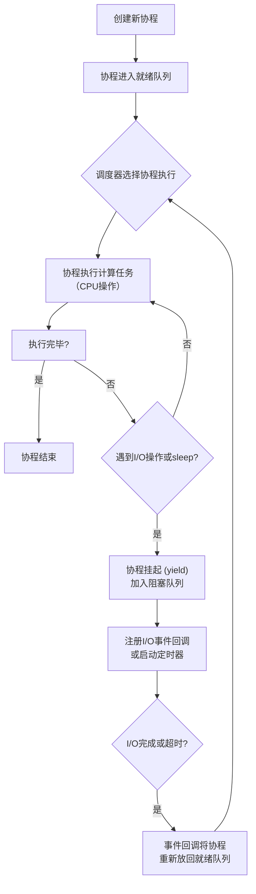

---
{"dg-publish":true,"permalink":"/Work/Script/PHP/Frame/Hyperf/Hyperf 协程解析/","title":"Hyperf 协程解析","tags":["flashcards"],"noteIcon":"","created":"2026-04-06T17:02:57.000+08:00","updated":"2026-04-06T17:02:57.000+08:00","dg-note-properties":{"title":"Hyperf 协程解析","tags":["flashcards"],"reference linking":null}}
---

### 一、协程是什么？
你可以把协程理解为**一种轻量级的线程**，是用户态下的任务调度单位。它由用户代码来调度和管理，而不是由操作系统内核来进行调度。一个 Worker 进程可以拥有大量的协程（例如，默认配置下一个进程最多可创建 100,000 个协程）。
### 二、Hyperf 协程的核心实现
Hyperf 的协程能力主要构建在 **Swoole** 扩展之上。
#### 1. 协作式调度 (Cooperative Scheduling)
Hyperf 的协程调度器采用**协作式调度**。这意味着：
*   **主动让出（Yield）**：一个协程在执行过程中，如果遇到 **I/O** 操作（如数据库查询、HTTP 请求、Redis 操作）或通过 `co::sleep()` 主动休眠，它会**主动让出**当前 CPU 的使用权。
*   **恢复执行（Resume）**：当该协程等待的 I/O 操作完成或休眠时间到后，调度器会在合适的时机**恢复其执行**。
#### 2. 协程调度器：智慧的“大脑”
协程调度器就像是协程的“指挥中心”，它主要包含以下几个部分：
*   **就绪队列 (Ready Queue)**：存放那些已经准备好、可以马上被执行的协程。调度器会从这里选择下一个要运行的协程。
*   **阻塞队列 (Blocking Queue)**：存放那些正在等待 I/O 操作完成而暂时挂起的协程。一旦它们等待的事件完成，就会被移回就绪队列。
*   **计时器 (Timer)**：管理协程的睡眠和超时设置。
*   **调度算法**：目前 Hyperf（Swoole）的调度器默认是**非抢占式**的，主要遵循 **FIFO（先进先出）** 和**事件驱动**的原则。
##### 协程调度器工作流程图


#### 3. 协程的创建
在 Hyperf 中，你可以使用 `co()` 函数或 `Coroutine::create()` 来创建协程：
```php
co(function () {
// 你的协程代码
$result = someAsyncOperation();
});
```
### 三、协程间的通信与同步
因为协程是共享内存的，所以当它们需要协作或共享数据时，就需要安全的通信和同步机制。
#### Channel
类似于 Go 语言的 `chan`，为**多生产者**协程和**多消费者**协程模式提供支持。Channel 底层自动实现了协程的切换和调度。
*   `push()`：生产数据。如果通道已满，则协程挂起。
*   `pop()`：消费数据。如果通道为空，则协程挂起，直到有数据到来。
#### WaitGroup
基于 Channel 实现，用于**等待一组协程全部执行完毕**。
```php
use Hyperf\Utils\WaitGroup; // 注意：新版本中可能在 Utils\Coroutine 下

$wg = new WaitGroup();
$wg->add(2); // 计数器加2

co(function () use ($wg) {
	// 任务A
	$wg->done(); // 计数器减1
});

co(function () use ($wg) {
	// 任务B
	$wg->done(); // 计数器减1
});

$wg->wait(); // 阻塞，直到计数器变为0
```
#### Parallel
这是对 WaitGroup 的一个更高级的封装，让你能更方便地**并行执行多个任务并收集结果**。你还可以**限制最大并发数**，防止瞬时并发过高压垮下游服务。
```php
use Hyperf\Utils\Coroutine\Parallel; // 注意：新版本中命名空间可能有所不同

$parallel = new Parallel(5); // 最大并发数限制为5
for ($i = 0; $i < 20; $i++) {
	$parallel->add(function () use ($i) {
		return doSomeJob($i);
	});
}
$results = $parallel->wait(); // 获取所有任务的结果数组
```
#### Concurrent
用于**控制一个代码块内同时运行的最大协程数量**。
```php
use Hyperf\Utils\Coroutine\Concurrent;

$concurrent = new Concurrent(10);
for ($i = 0; $i < 15; ++$i) {
	$concurrent->create(function () {
		// Do something... 最多同时10个协程执行这个代码块
	});
}
```
### 四、透传协程上下文
这是 Hyperf 协程编程中一个**非常重要且容易踩坑的概念**。
*   **隔离性**：每个协都有自己**独立**的上下文存储空间（一个哈希表）。默认情况下，协程间的上下文是**隔离的**，子协程**不会**自动继承父协程的上下文。
*   **传递挑战**：在中间件中设置的请求级数据（如用户信息`Context::set('user', $user)`），在新创建的并行子协程中无法直接通过 `Context::get('user')` 获取，因为上下文隔离了。
#### 解决方案
##### 显式复制
在创建子协程时，手动将父协程的上下文复制过去。
```php
$cid = SwooleCo::getCid(); // 获取当前协程ID
$pid = SwooleCo::getPcid($cid); // 获取父协程ID
co(function () use ($pid) {
	Context::copy($pid); // 关键：复制父协程上下文
	// ... 现在可以获取到父协程的上下文数据了
	$requestId = Context::get(self::TRACE_ID);
});
```
##### 链式查找
通过 `SwooleCo::getPcid($coId)` 获取父协程 ID，然后逐级向上查找需要的上下文数据。
```php
/**
 * 获取请求ID
 * @return string
 */
public static function getRequestId(): string
{
	// 获取当前协程ID
	$currCoId = $coId = SwooleCo::getCid();
	// 获取当前协程里没有请求ID时，会去查询父协程中的请求ID，直到顶级协程为止
	do {
		$requestId = Context::get(self::TRACE_ID, '', $coId);
	} while (!$requestId && $coId > 0 && ($coId = SwooleCo::getPcid($coId)));
	// 父子协程共享trace_id
	if ($requestId && $currCoId != $coId) {
		Context::set(self::TRACE_ID, $requestId);
	}
	// 创建请求ID
	if (empty($requestId)) {
		$requestId = IdGenTool::uuidV4();
		Context::set(LogTool::TRACE_ID, $requestId);
	}
	return $requestId;
}
```