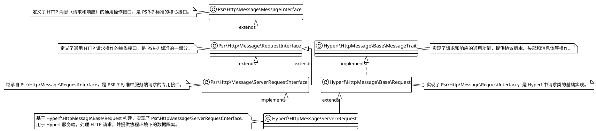
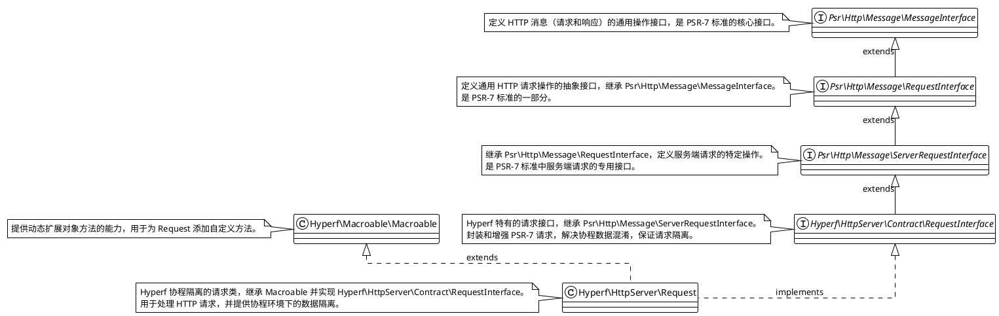
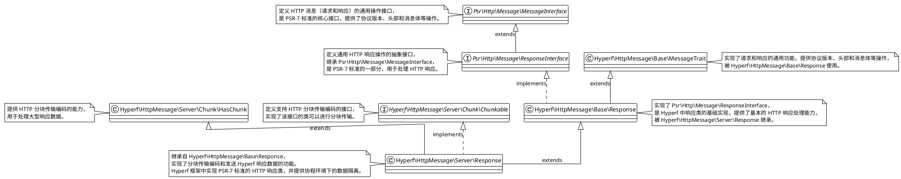
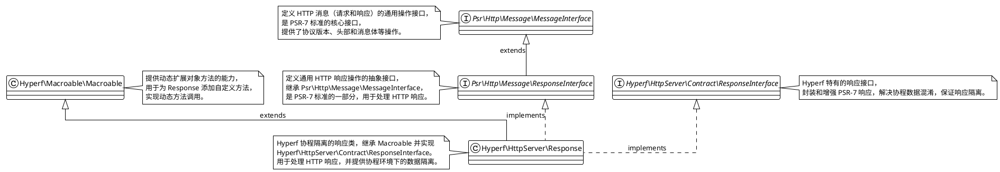

---
{"dg-publish":true,"permalink":"/Work/Script/PHP/Frame/Hyperf/Hyper中的 Request和Response/","title":"Hyper中的 Request和Response","tags":["flashcards"],"noteIcon":"","created":"2023-10-04T02:47:54.000+08:00","updated":"2026-03-24T17:31:56.026+08:00","dg-note-properties":{"title":"Hyper中的 Request和Response","tags":["flashcards"],"reference linking":null}}
---

# 请求
```php
use Swoole\Http\Request; # Swoole 请求对象，为 Hyperf 构建 PSR-7 请求提供数据，框架内不直接使用。
use Swoole\Http2\Request; # Swoole 请求对象，为 Hyperf 构建 PSR-7 请求提供数据，框架内不直接使用。
```
## 类图 `Hyperf\HttpMessage\Server\Request`

## 类图 `Hyperf\HttpServer\Request`


## `Hyperf\HttpServer\Contract\RequestInterface` 的作用
Hyperf是一个协程框架，Hyperf里面DI容器管理的对象都是长生命周期的对象。
如我们在Hyperf里的一个Controller里使用了一个Request对象，而一个Request对象他跟随的就是一个请求。
一个请求就是一个协程，Controller会在多个协程之间来回切换使用的。
所以假设我们将一个Request对象绑定在这个Controller的一个成员属性上，就非常容易出现协程间**数据混淆**的问题。
因此Hyperf提供了 **`Hyperf\HttpServer\Contract\RequestInterface`** ，其目的在于保持在Controller的成员属性上，直接Inject注入的这种用法同时又不会导致协程间的数据混淆。
## Hyperf\HttpServer\Request 核心实现：
- 通过 `Inject Hyperf\HttpServer\Contract\RequestInterface` 注入的是一个代理类，它代理的是 `Hyperf\HttpServer\Request` 对象。
- `Hyperf\HttpServer\Request` 是标准的 PSR-7 实现类，与每次用户请求绑定，**绝对不能在协程之间共享**。
- Hyperf 框架通过协程上下文自动选择与当前协程关联的 `Hyperf\HttpServer\Request` 对象。
- 获取 `Hyperf\HttpServer\Request` 对象，**必须通过 `Inject Hyperf\HttpServer\Contract\RequestInterface` 得到代理对象**。
### 代码示例
文件`hyperf/vendor/hyperf/http-server/src/Request.php`
```php
public function query(?string $key = null, $default = null)
{
    if ($key === null) {
        return $this->getQueryParams();
    }
    return data_get($this->getQueryParams(), $key, $default);
}

public function getQueryParams()
{
    return $this->call(__FUNCTION__, func_get_args());
}

protected function call($name, $arguments)
{
    $request = $this->getRequest();
    if (!method_exists($request, $name)) {
        throw new \RuntimeException('Method not exist.');
    }
    return $request->{$name}(...$arguments);
}

protected function getRequest(): ServerRequestInterface
{
    return Context::get(ServerRequestInterface::class);
}
```
代码分析：
- `query()` 和 `getQueryParams()` 方法通过 `call()` 方法调用实际的 `Hyperf\HttpServer\Request` 对象的方法。
- `call()` 方法从协程上下文获取 `Hyperf\HttpMessage\Server\Request` 对象，并调用相应方法。
- `getRequest()` 方法负责从协程上下文获取 `Hyperf\HttpMessage\Server\Request` 对象。
# 响应
```php
use Swoole\Http\Response; # Swoole 响应对象，为 Hyperf 构建 PSR-7 响应提供数据，框架内不直接使用。
use Swoole\Http2\Response; # Swoole 响应对象，为 Hyperf 构建 PSR-7 响应提供数据，框架内不直接使用。
```
## 类图 `Hyperf\HttpMessage\Server\Response`

## 类图 `Hyperf\HttpServer\Response`

## `Hyperf\HttpMessage\Server\Response`
1. 是 `Hyperf\HttpMessage\Base\Response` 的子类。
2. 在服务端环境中，负责将构建好的 Response 对象的内容响应给当前请求。
3. 其 send 方法是 **`Swoole\Http\Response` 与 `Hyperf\HttpMessage\Base\Response` 之间的桥接**，通过 Swoole 的 Response 对象将响应内容返回给请求。此过程类似于 `Hyperf\HttpMessage\Server\Request` 从协程上下文中获取请求对象并进行操作。
4. 除了提供 PSR-7 标准约束的方法外，还包含日常开发中常用的结果响应方法。
5. 核心作用是将 Hyperf 构建的 PSR-7 标准 Response 对象转换为 Swoole 可以理解和发送的格式，完成 HTTP 响应的发送。
6. 内部通过 Swoole 的 Response 对象进行实际的响应发送，实现了 Hyperf 的响应与底层 Swoole 之间的交互。
7. 确保在协程环境下，每个请求都能得到正确的响应数据，避免数据混淆。
# 总结
在 Hyperf 开发中，为了**保证协程环境下的数据隔离和方便性**，请求、响应最常用是：
**请求：**
- `Hyperf\HttpServer\Contract\RequestInterface`：用于接口约束，提高代码的可复用性。
- `Hyperf\HttpServer\Request`：提供了更高效的开发体验、深度框架集成和丰富的便捷方法（例如 `input()`、`all()`、`file()`、`json()`），推荐在 HTTP 服务器环境中使用。
>`Hyperf\HttpServer\Request` 提供更高效的开发体验、深度框架集成和丰富的便捷方法，而 `Hyperf\HttpMessage\Server\Request` 遵循 PSR-7 标准，确保兼容性和通用性。

**响应：**
- `Hyperf\HttpServer\Contract\ResponseInterface`：用于接口约束，提高代码的可复用性。
- `Hyperf\HttpServer\Response`：提供了更高效的开发体验、深度框架集成和丰富的便捷方法（例如 `json()`、`withHeaders()`、`withCookie()`、`redirect()`），并且是不可变对象。
>`Hyperf\HttpServer\Response` 提供更高效的开发体验、深度框架集成和丰富的便捷方法，而`Hyperf\HttpMessage\Server\Response` 遵循 PSR-7 标准，确保兼容性和通用性。

## 请求：
- **协程上下文存储：**
    - 请求对象以 `Psr\Http\Message\ServerRequestInterface` 为键，存储在协程上下文中，确保每个协程都能访问到独立的请求实例。
    - 存储的具体对象为 `Hyperf\HttpMessage\Server\Request`，它是 PSR-7 标准的**服务端请求实现**。
- **依赖注入与代理：**
    - 在日常开发中，通过依赖注入 `Hyperf\HttpServer\Contract\RequestInterface` 来获取请求对象。
    - 注入的实际上是一个代理对象，该代理对象内部代理了 `Hyperf\HttpServer\Request` 实例，实现了协程隔离和请求对象生命周期管理。
- **核心作用：**
    - Hyperf 通过这种方式，解决了在协程环境下直接使用请求对象可能导致的数据混淆问题。
    - 开发者通过 `Hyperf\HttpServer\Contract\RequestInterface` 接口，可以方便地访问请求数据，而无需关心底层的协程上下文管理。
- **Swoole 的作用：**
    - `Swoole\Http\Request` 和 `Swoole\Http2\Request` 对象作为底层数据源，用于构建 Hyperf 的 PSR-7 请求对象，框架内部使用，开发者无需直接操作。
## 响应：
- **响应处理类似请求：**
    - 响应处理的机制与请求处理类似，也涉及到协程上下文、依赖注入和代理模式。
    - 通过 `Hyperf\HttpServer\Contract\ResponseInterface` 接口，开发者可以方便地构建和发送响应，框架底层负责协程隔离和响应数据管理。
- **Hyperf\HttpMessage\Server\Response 的作用：**
    - `Hyperf\HttpMessage\Server\Response` 充当了 Hyperf 响应对象和 Swoole 响应对象之间的桥梁。
    - 它将 Hyperf 构建的 PSR-7 响应数据转换为 Swoole 可以理解和发送的格式，实现了响应的发送。
- **核心作用：**
    - Hyperf 通过这种方式，统一了请求和响应的处理方式，简化了开发流程，提高了代码的可维护性和可读性。