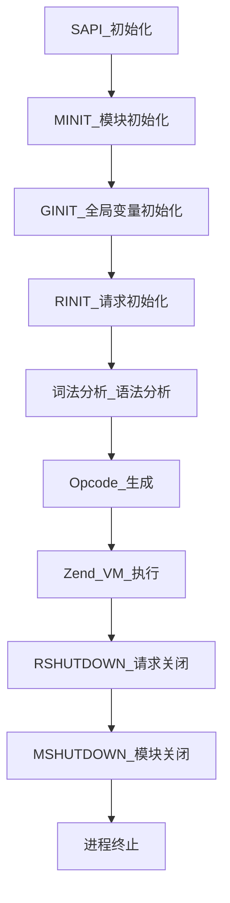

---
{"dg-publish":true,"permalink":"/Work/Script/PHP/Function/CLI/","title":"CLI","tags":["flashcards"],"noteIcon":"","created":"2025-07-18T11:16:41.837+08:00","updated":"2026-03-24T17:38:14.472+08:00"}
---

# 核心
### CLI脚本基础结构
#### 1. 可执行脚本规范
```php
// 必须包含此行才能直接执行
echo "Hello CLI!";
```
- **系统适配**  
  Windows需指定绝对路径：`#!C:\php\php.exe`
- **权限设置**  
  Linux/Mac需：`chmod +x script.php`
#### 2. 参数解析
##### `$_SERVER['argv']`
```php
print_r($_SERVER['argv']);
/*
执行: php test.php arg1 arg2
输出:
Array
(
    [0] => test.php
    [1] => arg1
    [2] => arg2
)
*/
```
- `$_SERVER['argc']`：参数数量（含脚本名）  
- `$_SERVER['argv'][0]`：永远是脚本文件名
##### `getopt`
- [getopt](https://www.php.net/manual/zh/function.getopt.php) — 从命令行参数列表中获取选项
```php
$options = getopt("f:hp:");  
var_dump($options);
```
执行命令`php example.php -fvalue -h`输出如下
```
array(2) {
  ["f"]=>
  string(5) "value"
  ["h"]=>
  bool(false)
}
```
### I/O通道操作
#### 1. 标准输入（STDIN）
```php
// 从终端读取单行输入
echo "Name: ";
$name = fgets(STDIN); 
echo "Hello, $name!";

// 非阻塞读取（需安装扩展）
stream_set_blocking(STDIN, false);
$input = fread(STDIN, 1024);
```
> **底层原理**：`STDIN`对应`php://stdin`流，Zend引擎通过`sapi_module_struct`的`ub_write`函数指针处理IO
#### 2. 标准输出/错误（STDOUT/STDERR）
```php
// 显式写入STDOUT
fwrite(STDOUT, "Normal message\n"); 
// 写入STDERR（不缓存，直接输出）
fwrite(STDERR, "Error occurred!\n"); 
// 重定向错误流示例
$ phpscript.php 2> errors.log
```
### 进程与系统交互
#### 1. 后台守护进程
```php
// 脱离终端成为守护进程
if (pcntl_fork() !== 0) exit; 
posix_setsid();

// 主循环
while (true) {
    file_put_contents('log.txt', date('Y-m-d H:i:s')."\n", FILE_APPEND);
    sleep(10);
}
```
- 启动命令：`nohup php daemon.php > /dev/null 2>&1 &`
#### 2. 信号处理
```php
// 注册SIGTERM信号处理器
pcntl_async_signals(true);
pcntl_signal(SIGTERM, function($sig) {
    fwrite(STDERR, "Graceful shutdown...");
    exit(0); // 正常退出
});
```
#### 3. 进程管理（需pcntl扩展）
```php
$pid = pcntl_fork();
if ($pid == -1) die("Fork failed");
elseif ($pid) { // 父进程
    pcntl_wait($status); 
} else { // 子进程
    exec('php worker.php');
}
```
### 高级应用场景
#### 1. 定时任务调度
```php
// 简易定时任务引擎
set_time_limit(0);
while (true) {
    if (date('i') % 5 == 0) { // 每5分钟执行
        do_scheduled_task(); 
    }
    sleep(60);
}
```
#### 2. 队列消费Worker
```php
// Redis队列消费者
$redis = new Redis();
$redis->connect('127.0.0.1', 6379);

while ($job = $redis->brpop('jobs', 30)) {
    process_job(json_decode($job[1], true));
}
```
#### 3. Swoole常驻服务（需swoole扩展）
```php
$server = new Swoole\HTTP\Server("0.0.0.0", 9501);
$server->on('request', function ($req, $res) {
    $res->end("Hello Swoole!");
});
$server->start();
```
> **热更新配置**：修改代码后需执行`php think swoole restart`重启服务
### 调试与优化
#### 1. Opcache调优参数
```bash
php -d opcache.enable_cli=1 \
     -d opcache.jit_buffer_size=64M \
     -d opcache.jit=1235 \
     script.php
```
#### 2. 内存泄漏检测
```bash
USE_ZEND_ALLOC=0 valgrind --leak-check=full php script.php
```
#### 3. 生成Opcode（需vld扩展）
```bash
php -d vld.active=1 -d vld.execute=0 test.php
```
> **底层机制**：vld通过覆盖`zend_execute`函数指针实现
### 附：CLI与Web模式差异总结
| **特性**         | CLI模式                  | Web模式               |
|------------------|--------------------------|----------------------|
| **生命周期**     | 单次执行（进程级）       | 多请求复用           |
| **超时控制**     | 默认无限制               | 受max_execution_time限制 |
| **I/O通道**      | 直接使用STDIN/STDOUT     | HTTP协议流           |
| **内存管理**     | 脚本结束完全释放         | 需避免跨请求泄漏     |
| **$_SERVER**内容 | 命令行环境信息           | HTTP请求信息         |
掌握这些模式差异可避免踩坑，尤其涉及资源持久化或内存管理的场景。
> 笔记建议：实际使用时注意常驻进程的内存回收（定期unset大变量），并善用`register_shutdown_function`处理异常退出逻辑。
### CLI 终端常用命令
```shell
# --- PHP 基础信息查询 ---
php -v                       # 查看 PHP 版本号
php -m                       # 查看当前已安装并启用的模块
php -i                       # 查看完整的 PHP 配置信息 (CLI 模式下的 phpinfo)
php --ri swoole              # 查看 swoole 扩展的详细版本及编译参数
php --re swoole              # 查看 swoole 扩展提供的所有类、方法和常量
php -h                       # 查看 PHP 命令行参数帮助

# --- 启动内置 Web 服务器 ---
# 参数详解
# -S: 启动内置 Web 服务器的参数标识符
# 0.0.0.0:8838 - 服务器绑定地址和端口
# -t: 指定文档根目录的参数
# .: 当前目录作为文档根目录
php -S 0.0.0.0:8838 -t . 是一个 PHP 内置 Web 服务器的启动命令，用于快速启动一个开发环境下的 HTTP 服务器。

# --- 配置文件 (php.ini) 相关 ---
php --ini                    # 显示加载的 php.ini 路径及扫描到的附加 .ini 目录
php -i | grep php.ini        # 通过 phpinfo 过滤查看配置文件信息
php -i | grep "extension_dir" # 查看扩展存放目录的物理路径
php -i | grep "memory_limit" # 查看 PHP 脚本可使用的最大内存限制

# --- 代码执行与语法检查 ---
php -f <file>                # 解析并执行指定的 PHP 文件
php -r "phpinfo();"          # 在命令行中直接运行引号内的 PHP 代码
php -r "print_r(gd_info());" # 快速查看 GD 库支持信息
php -l <file>                # 语法检查 (Lint)，仅检查语法是否有错，不运行代码
php -a                       # 进入交互式 Shell 模式

# --- 进程管理与性能诊断 (Linux) ---
ps aux | grep php-fpm        # 列出所有 php-fpm 进程详情
ps aux | grep -c php-fpm     # 统计 php-fpm 进程的总数
/usr/bin/php -i | grep mem   # 查看当前 PHP 运行环境的内存相关配置
top -p `pgrep -d , php-fpm`  # 实时监控所有 php-fpm 进程的 CPU/内存 占用
netstat -lntp | grep 9000    # 查看 php-fpm 默认端口 9000 是否在监听

# --- php-fpm 专项操作 ---
php-fpm -t                 # 测试 php-fpm 配置文件语法是否正确
php-fpm -v                 # 查看 php-fpm 版本
php-fpm -m                 # 查看 php-fpm 加载的模块 (可能与 CLI 模式不同)
```
# 生命周期
### PHP CLI 底层生命周期（Zend Engine 视角）


### 阶段 1: SAPI 初始化 (sapi/cli/php_cli.c)
1. **入口点**：`main()` 函数启动 (`sapi/cli/php_cli.c`)
2. **SAPI 结构注册**：
```c
sapi_module_struct cli_sapi_module = {
   "cli",                     // 名称
   "Command Line Interface",  // 描述
   php_cli_startup,           // 初始化函数
   php_module_shutdown        // 关闭函数
   // ... 其他函数指针
};
```
1. **参数解析**：
   - 处理 `-f`, `-r`, `-B`/`-R`/`-F`/`-E` 等命令行参数
   - 设置 `argc`/`argv` 到 `$_SERVER['argv']`
### 阶段 2: 模块初始化 (MINIT)
1. **扩展初始化**：
```c
// 每个扩展的 MINIT 函数
PHP_MINIT_FUNCTION(extension_name) {
   REGISTER_INI_ENTRIES();    // 注册 INI 设置
   zend_register_functions(); // 注册函数
   zend_register_classes();   // 注册类
   return SUCCESS;
}
```
2. **核心引擎初始化**：
   - 初始化 Zend 内存管理器 (`zend_mm_init`)
   - 启动垃圾回收器 (`gc_init`)
   - 注册核心常量 (`TRUE`/`FALSE`/`NULL`)
### 阶段 3: 请求初始化 (RINIT)
1. **创建全局符号表**：
```c
zend_hash_init(&EG(symbol_table), 50, NULL, NULL, 0);
```
2. **设置超全局变量**：
   - `$_SERVER`, `$_ENV` 填充 CLI 环境信息
   - `$_GET`, `$_POST` 在 CLI 中为空但结构存在
3. **激活输出缓冲**：
   - 默认启用 `output_buffering=0` (直接输出到 stdout)
### 阶段 4: 脚本编译与执行
#### 编译阶段 (zend_compile)
1. **词法分析**：`re2c` 生成的 `zend_language_scanner.l`
2. **语法分析**：`Bison` 生成的 `zend_language_parser.y`
3. **生成 Opcode**：
```c
zend_op_array *op_array = compile_file(&file_handle, ...);
```
   - 若启用 Opcache：
```c
if (opcache && cached = opcache_get_script(hash)) {
	use cached op_array;
} else {
	compile_and_cache();
}
```
#### 执行阶段 (zend_execute)
```c
ZEND_API void zend_execute(zend_op_array *op_array, zval *return_value)
{
    zend_vm_enter();  // 进入 Zend VM
    // ... 循环执行 opcodes
}
```
- **Opcode 分发**：基于 `zend_vm_execute.h` 的巨型 switch 或直接线程代码
- **变量管理**：
  - `zval` 结构处理引用计数 (`refcount__gc`)
  - 循环引用检测由垃圾回收器处理
### 阶段 5: 请求关闭 (RSHUTDOWN)
1. **执行顺序**：
```c
zend_call_destructors();      // 调用 __destruct()
zend_objects_store_del_ref(); // 释放对象
shutdown_destructors();       // 调用 register_shutdown_function()
```
2. **内存清理**：
   - 销毁全局符号表 (`zend_hash_destroy(&EG(symbol_table))`)
   - 释放请求级内存池 (`efree(请求内存块)`)
### 阶段 6: 模块关闭 (MSHUTDOWN)
1. **扩展卸载**：
```c
PHP_MSHUTDOWN_FUNCTION(extension_name) {
   UNREGISTER_INI_ENTRIES();
   zend_unregister_functions();
   return SUCCESS;
}
```
2. **核心引擎关闭**：
   - 销毁全局类表 (`zend_hash_destroy(CG(class_table))`)
   - 关闭内存管理器 (`zend_mm_shutdown`)
### 内存管理深度解析
1. **内存池结构**：
```c
struct _zend_mm_heap {
   zend_mm_segment *segments; // 内存段链表
   size_t size;                // 当前使用量
   // ... 其他统计信息
};
```
2. **分配策略**：
   - 小内存 (< 2KB)：使用预分配块 (small_buckets)
   - 大内存：直接从系统分配 (`mmap` 或 `malloc`)
3. **垃圾回收**：
   - 引用计数为主
   - 周期回收器处理循环引用：
```c
zend_gc_collect_cycles(); // 当缓冲区满时触发
```
### CLI 特有优化技术
1. **Opcache 调优**：
```bash
php -d opcache.enable_cli=1 -d opcache.jit=1205 -d opcache.jit_buffer_size=64M script.php
```
2. **持久化资源复用**：
```php
// 连接池示例 (伪代码)
if (!isset($global_pool)) {
   $global_pool = new ConnectionPool(max: 5);
}
$conn = $global_pool->get();
```
2. **信号处理最佳实践**：
```php
pcntl_async_signals(true);
pcntl_signal(SIGTERM, function() {
   // 清理资源后退出
   posix_kill(getmypid(), SIGKILL);
});
```
### 调试与性能分析
1. **GDB 调试示例**：
```bash
gdb --args php -r 'echo "test";'
(gdb) b zend_execute
(gdb) run
```
2. **Valgrind 内存检测**：
```bash
USE_ZEND_ALLOC=0 valgrind --leak-check=full php script.php
```
3. **JIT 反汇编**：
```bash
php -d opcache.jit=1205 -d opcache.jit_debug=1 script.php
```
### ⚠️ 高级注意事项
1. **全局状态污染**：
```php
// 危险：静态变量在长运行脚本中持续存在
function counter() {
   static $i = 0;
   return $i++;
}
```
2. **扩展兼容性问题**：
   - 某些扩展（如 `apc`）在 CLI 中行为不同
   - 检查扩展的 `PHP_MINFO_FUNCTION` 输出
3. **ZTS (Zend Thread Safety) 影响**：
   - CLI 通常使用 NTS 构建
   - 线程安全版本有额外锁开销
4. **内存泄漏预防**：  
- 避免全局变量长期引用对象（如静态数组）。  
- 定时调用 `gc_collect_cycles()` 主动触发垃圾回收。  