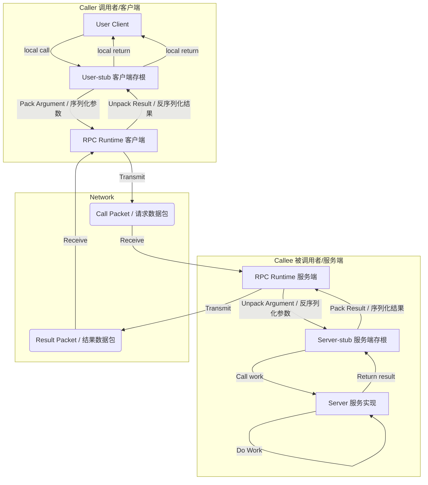
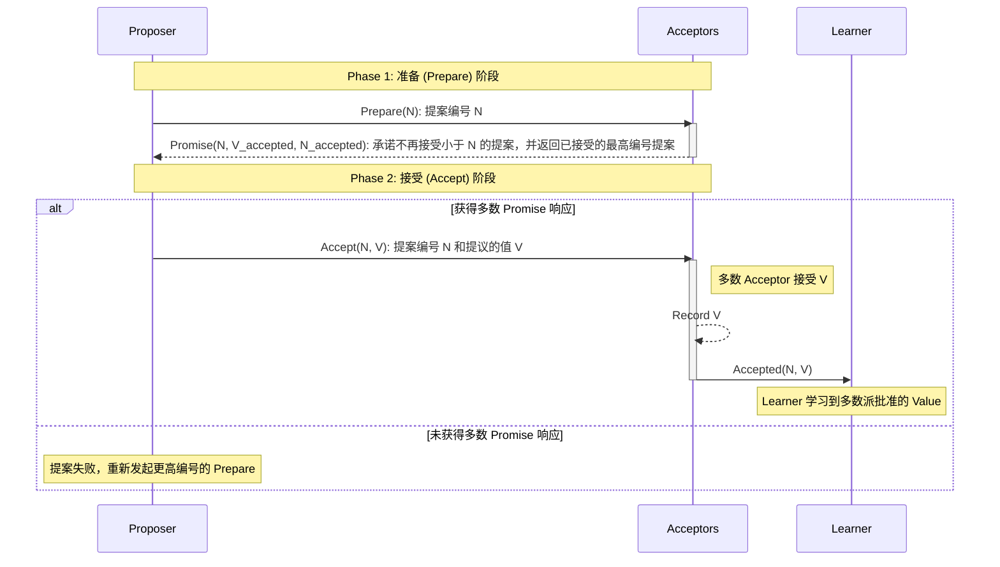

---
{"dg-publish":true,"permalink":"/Work/Script/PHP/Function/Network/RPC/","title":"RPC","tags":["flashcards"],"noteIcon":"","created":"2026-03-10T22:33:54.000+08:00","updated":"2026-03-24T17:35:33.917+08:00","dg-note-properties":{"title":"RPC","tags":["flashcards"],"reference linking":null}}
---

## RPC（远程过程调用）
### RPC 的通信协议分类
| 分类               | 协议基础        | 示例                             |
| :--------------- | :---------- | :----------------------------- |
| **基于文本协议的 RPC**  | HTTP (文本协议) | XML-RPC, WebService            |
| **基于二进制协议的 RPC** | 自定义二进制协议    | Thrift, gRPC (使用 HTTP/2 + 二进制) |
### RPC 的调用过程分类
| 分类         | 行为特点                                         |
| :--------- | :------------------------------------------- |
| **同步 RPC** | 客户端**必须等待**调用完成并返回结果。                        |
| **异步 RPC** | 客户端调用后**不等待**结果，通过 **回调 (Callback)** 获取返回信息。 |
### RPC 的三代历史发展
| 代数     | 典型代表                              | 核心特点与演进                                                                    | 限制                                   |
| :----- | :-------------------------------- | :------------------------------------------------------------------------- | :----------------------------------- |
| **一代** | CORBA, DCOM, Java RMI             | **起源：** 巨头私有实现。                                                            | **实现复杂，跨平台性差**，无统一标准。                |
| **二代** | XML-RPC, SOAP, JSON-RPC, Thrift   | **跨平台：** 使用 **HTTP + XML/JSON** 解决了跨平台问题。**发展：** 后期 (如 Thrift) 兼容多语言和动态调用。 | **早期效率低** (因 XML 规范复杂)，设计仍停留在方法调用为主。 |
| **三代** | Dubbo, Motan, **gRPC**, ZeroC Ice | **服务治理：** 除了方法调用，更侧重提供**服务治理**功能。                                          | 在跨语言方面可能有所取舍，偏重方法治理。                 |
## RPC 原理与 Nelson 模型总结
### RPC 的核心目标与动机
* **本质：** 一种**远程调用服务器端代码**的方法。
* **原动机 (Nelson, 1983)：**
    * **简单：** 将远程调用做得与**本地过程调用完全类似**，使程序员使用起来毫无障碍。
    * **高效：** 过程调用机制简单高效。
    * **通用：** “过程”是算法部分间最重要的通信机制。
* **总目标：** 简化分布式计算的构建，使远程调用像本地调用一样熟悉和易用。
### RPC 的五大理论模型组件（Nelson 模型）
Nelson 论文指出了 RPC 实现包含 5 个理论模型部分，其核心流程是实现**透明化调用**：

| 组件 | 所在端 | 核心作用 |
| :--- | :--- | :--- |
| **User (Client)** | 调用者 (Caller) | 发起远程调用请求。 |
| **User-stub** | 调用者 (Caller) | 负责将调用信息（接口、方法、参数）进行**编码 (Pack)**，并接收并**解码 (Unpack) 结果**。 |
| **RPC Runtime** | 客户端/服务端 | **传输核心：** 负责请求的**传输 (Transmit)**、等待 (Wait) 和接收 (Receive)，处理网络通信细节。 |
| **Server-stub** | 被调用者 (Callee) | 接收请求后进行**解码 (Unpack Argument)**，调用本地 Server，并将结果**编码 (Pack Result)** 返回。 |
| **Server** | 被调用者 (Callee) | 接收到本地调用后，执行**实际的业务逻辑 (Work)**，并返回结果。 |
### 流程简述
客户端的 **User-stub** 将参数**打包** $\rightarrow$ **RPC Runtime** 通过网络传输 (Call Packet) $\rightarrow$ 远端 **Server-stub** **解包**并调用本地 **Server** $\rightarrow$ Server 执行工作 $\rightarrow$ 结果原路返回 (Result Packet)。
**提示：** 图中所示的 **User-stub 的 Pack/Unpack** 过程以及 **Server-stub 的 Unpack/Pack** 过程，在现代 RPC 中通常被称为 **序列化 (Serialization)** 和 **反序列化 (Deserialization)**，而这个过程由 **数据协议** 规范。

## RPC 框架的组成元素与协议核心
### RPC 框架的 8 个组成部分
| 组件                  | 角色定位      | 核心职责                                            |
| :------------------ | :-------- | :---------------------------------------------- |
| **Server**          | 服务提供者     | 暴露远程接口，供远程调用。                                   |
| **Client**          | 服务消费者     | 负责调用RPC服务。                                      |
| **Proxy (代理)**      | 客户端接口     | 通过**动态代理**，提供远程接口的本地实现。                         |
| **Invoker (执行器)**   | 客户端/服务端逻辑 | **客户端：** 编码、发送请求、等待结果。**服务端：** 处理调用逻辑、返回结果。     |
| **Protocol (协议管理)** | 编解码核心     | 负责整个 RPC 通信协议的**编/解码**。                         |
| **Connector**       | 连接管理      | 负责维持客户端和服务端的**长连接通道**。                          |
| **Processor**       | 后台调度      | 负责整个调用过程的管理调度，包括**线程池、分发、异常处理**等。               |
| **Channel**         | 数据通道      | 客户端和服务器端之间的数据传输通道（通常由 Netty/Swoole 等高性能网络框架实现）。 |
### RPC 协议的核心要素
协议是 RPC 调用在网络传输中约定的数据封装方式，包括 **编解码、消息头、消息体** 三个部分。
#### 1. 编解码 (Serialization/Deserialization)
##### A. 调用编码（Client $\to$ Server）
需要编码的信息包括：**接口名、方法名、方法参数**（类型和值），以及**调用属性**（超时时间、隐式参数）。
##### B. 返回编码（Server $\to$ Client）
需要编码的信息包括：**返回结果、返回码、返回异常信息**。
#### 2. 消息头 (Header)
* **作用：** 包含 RPC 调用的**元信息**（如协议版本、消息长度、唯一ID、压缩类型等）。
* **目的：** 方便程序进行编解码和未来扩展。
### 传输机制
* **传输协议：** 通常选择**长连接**方式的 **TCP 协议**，以获得更高效率。
* **消息流：** RPC 本质上是一种**可靠的请求-应答消息流**。
* **连接复用：** 协议层面定义**消息的唯一 ID**，可更容易地复用连接。
#### 3. 消息体（数据编码方式）
| 方式        | 示例                             | 关注点                      |
| :-------- | :----------------------------- | :----------------------- |
| **文本编码**  | XML-SOAP, JSON-RPC             | 易于理解，但效率和长度通常不如二进制。      |
| **二进制编码** | Thrift, Hessian, Kryo, MsgPack | **效率高，长度小**，但需要关注跨语言兼容性。 |
> 序列化方式的选取需权衡：**效率**（越快越好）、**长度**（越小越好）、**兼容性**（字段变更的兼容）。
## 服务治理 (Service Governance) 
### 什么是服务治理？
服务治理是第三代 RPC 框架的主要特色，它不仅关注远程过程的执行结果，更关注**后端处理模块的可靠性、稳定性和可维护性**。
**核心目标：** 解决大规模服务化、微服务架构下，服务数量多、依赖关系复杂、运维挑战大等问题。
### 服务治理解决的核心问题与功能组件
服务治理通过引入一系列组件和机制来解决以下问题：

| 解决的问题 | 对应功能/组件 | 核心机制 |
| :--- | :--- | :--- |
| **服务位置管理** | **服务注册与发现 (注册中心)** | 使服务位置透明化，动态注册和发现服务。 |
| **高可用与性能** | **负载均衡 (软负载)** | 在消费方实现软负载均衡和故障转移 (Failover)。 |
| **系统稳定性** | **服务降级** | 在非核心业务中适当降低优先级，保障核心业务的稳定性。 |
| **系统容量规划** | **服务容量评估 / 监控中心** | 统计调用量、响应时间等指标，作为容量规划的参考。 |
| **复杂依赖关系**| **依赖关系图 / 关键链路分析** | 自动描绘应用间依赖关系，帮助架构师理清结构。 |
| **服务流量控制**| **服务路由 / 并发控制** | 实现精确流量分配，管理线程池与超时等待。 |
| **运维响应速度**| **服务监控与报警** | 实时监测服务异常，第一时间通知系统负责人。 |
### 第三代治理型 RPC 框架代表
* **Dubbo** (阿里巴巴，Java)：国内服务治理型 RPC 的典范，功能全面。
* **gRPC** (Google)：底层基于 Protocol Buffers，在跨语言的基础上实现了服务治理功能。
* **Motan** (微博)：国内实现的类似 Dubbo 的治理型 RPC 框架。
#### Dubbo 服务治理示意图

### 总结要点
治理型 RPC 框架是目前 RPC 发展的重点。它将传统的远程方法调用功能与现代微服务所必须的 **注册中心、负载均衡、服务降级、监控报警** 等能力集成在一起，极大地提高了分布式系统的管理效率和稳定性。

好的，这是对您提供的文本内容进行精简、总结和优化的笔记：
## 服务发现与服务注册 (RPC框架的核心治理功能)
服务发现是**服务治理**的关键环节，用于记录分布式系统中所有服务的网络位置信息，以便客户端或其他服务能找到并访问它们。
### 核心概念
* **服务发现**：记录分布式系统中所有服务实例的信息（如网络位置、元数据），并提供查询、健康监控、实时更新等功能。
* **服务注册表** (Service Registry)：服务发现机制的关键部分，是可用服务实例的数据库。
    * 提供**注册管理API**：供服务实例注册和注销。
    * 提供**请求API**：供客户端查询。
* **服务实例注册**：服务实例启动时将网络位置注册到注册表，终止时删除，通常通过**心跳机制**定期刷新注册信息，确保实时性。
### 两种服务发现模式
| 模式                                   | 客户端职责                | 发现机制                                | 负载均衡           | 对客户端的透明性                | 类似技术              |
| :----------------------------------- | :------------------- | :---------------------------------- | :------------- | :---------------------- | :---------------- |
| **1. 客户端发现** (Client-Side Discovery) | 负责查询注册表、选择实例、实现负载均衡。 | 客户端直接从注册表查询所有可用实例的**网络位置**（IP）。     | 客户端执行负载均衡算法。   | **低**：客户端知道后端真实服务器的身份。  | 基于 **DNS** 的负载均衡。 |
| **2. 服务端发现** (Server-Side Discovery) | 仅向一个代理/网关提出请求。       | 代理/网关查询注册表，根据负载均衡算法将请求**转发**到合适的实例。 | 代理/网关执行负载均衡算法。 | **高**：客户端不知道后端真实服务器的身份。 | **Nginx** 负载均衡。   |
### 成熟的服务注册表
| 组件                   | 核心特性                                   | 开发语言   | 背景/著名案例                                             |
| :------------------- | :------------------------------------- | :----- | :-------------------------------------------------- |
| **Apache ZooKeeper** | 高性能、整合的服务，提供分布式应用协调。                   | Java   | 曾是 Hadoop 子项目，现为顶级项目。                               |
| **etcd**             | 高可用、分布式、一致性的键值存储。                      | Golang | 广泛用于共享配置和服务发现，如 **Kubernetes** 和 **Cloud Foundry**。 |
| **Consul**           | 用于服务发现和配置，提供 API 注册和发现服务，包含**健康检查**功能。 | Golang | 由商业公司运营，有社区版和商业版。                                   |
> **备注：** PHP 社区目前尚缺乏成熟的通用服务发现组件，ZooKeeper 是较为成熟的选择。在讨论 ZooKeeper 前，需了解其底层机制 **Paxos 协议**。
## Paxos 协议
### 核心概念
* **定义：** Paxos 是少数在工程实践中被证实有效的、实现**强一致性**和**高可用性**的**去中心化分布式协议**。
* **基本思想：** 类似于人类社会的投票过程。
* **高可用性：** 只要集群中**超过一半**的节点正常工作，系统就能继续运行，有效对抗宕机、网络分区等异常情况。
* **一致性目标：** 对于同一轮 Paxos 过程，尽管不同的提案者 (Proposer) 可能提出不同的值 (Value)，但**最多只能有一个 Value 被批准**。
### 角色划分 (三类节点)
| 角色                 | 职责                                               | 数量    | 批准条件                                                                     |
| :----------------- | :----------------------------------------------- | :---- | :----------------------------------------------------------------------- |
| **Proposer** (提案者) | 提出议案 (Value)。Value 是抽象的操作，如修改变量值、设置 Primary 节点等。 | 多个    | N/A                                                                      |
| **Acceptor** (批准者) | 对 Proposer 提出的 Value 进行批准。                       | $N$ 个 | Value 必须获得**超过半数** ($W = N/2 + 1$) 的 Acceptor 批准后才能生效。Acceptor 之间完全对等独立。 |
| **Learner** (学习者)  | 学习被批准的 Value。                                    | N/A   | 通过读取**至少 $N/2 + 1$ 个** Acceptor 的结果，来确定哪个 Value 获得多数批准。                  |

### 工程实践中的应用
* **Chubby：** 由 Google 设计开发，是**最早基于 Paxos** 的分布式系统之一。它利用 Paxos 实现高可用存储、分布式锁等服务，间接提供了 Paxos 功能，而不是直接提供开发库。
* **ZooKeeper：** 参考了 Chubby 的设计，但使用了**修改后的 Paxos 协议**来实现其功能。
## 高性能网络库「Swoole」
### 1. Swoole 简介
* **定义：** PHP 的异步、并行、高性能**网络通信引擎**。
* **特点：** 使用**纯 C 语言编写**，为 PHP 提供了强大的底层能力。
* **主要功能：**
    * **异步支持：** 异步多线程服务器、异步 TCP/UDP 客户端、异步 MySQL/Redis、异步文件读写、异步 DNS 查询。
    * **内置服务：** 内置 HTTP/WebSocket/HTTP2.0 服务器端和客户端。
    * **并发工具：** 提供多种并发数据结构和 IPC (进程间通信) 机制，简化多进程编程（如原子计数器、HashTable、Channel、Lock 等）。
* **高性能原因：**
    * 底层 I/O 模型的优化。
    * 提供了基于内存共享的并发功能组件。
    * 对多种网络协议的封装。
### 2. 常见的四种 I/O 模型
| 模型              | 简称              | 核心机制                                           | 阻塞/非阻塞                   | 同步/异步  | 特点                           |
| :-------------- | :-------------- | :--------------------------------------------- | :----------------------- | :----- | :--------------------------- |
| **1. 传统 I/O**   | 阻塞 IO           | 单一 I/O 操作直到完成才返回。                              | **阻塞**                   | **同步** | 传统、低效。                       |
| **2. 非阻塞 I/O**  | Non-blocking IO | I/O 操作被调用后立即返回状态值，程序需轮询。                       | **非阻塞**                  | **同步** | 需要用户线程持续轮询。                  |
| **3. I/O 多路复用** | IO Multiplexing | 依赖 #select #epoll #kqueue 等函数同时阻塞并监听多个 I/O 操作。 | **阻塞** (在 `select` 等调用时) | **同步** | 经典 **Reactor** 模式，能同时处理多个连接。 |
| **4. 异步 I/O**   | Asynchronous IO | 用户发起请求后立即返回，内核完成操作后通知或调用回调函数。                  | **非阻塞**                  | **异步** | 经典 **Proactor** 模式，真正的异步。    |
**核心区分：**
- **同步 vs 异步：** 描述用户线程与内核的交互方式（发起请求后是否需要等待结果才能继续执行）。
- **阻塞 vs 非阻塞：** 描述用户线程调用内核 I/O 操作的方式（是否需要等待 I/O 操作彻底完成后才返回）。
### 3. Swoole 的 I/O 优化
- **PHP 原生支持：** PHP 自带 `socket` 库支持同步阻塞、同步非阻塞，以及 I/O 多路复用中的 **`select`** 模型。
- **Swoole 增强：** Swoole 实现了基于 `libevent` 的 **`epoll` 模型** (更高效的多路复用) 和 **AIO 模型** (真正的异步 I/O)。
高性能网络通信库在中间件领域已成为标配（例如 ZooKeeper 就使用了 Netty）。Swoole 为 PHP 带来了与这些标配组件相当的高性能通信能力。
## 微服务架构简介
微服务 (Microservices) 概念源于 2014 年 Martin Fowler 的文章，虽然架构风格没有精确定义，但其核心思想与早期的 SOA (面向服务架构) 有异曲同工之妙。
### 核心特性 (Martin Fowler 分析)
| 特性类别      | 描述                                                                          | 核心理念                           |
| :-------- | :-------------------------------------------------------------------------- | :----------------------------- |
| **组件化**   | **通过服务实现应用组件化：** 将应用切分成可独立部署和升级的软件单元（微服务）。                                  | 独立替换和升级                        |
| **组织模式**  | **围绕业务能力组织服务：** 团队组织结构必须是跨功能、强搭配的 **DevOps** 一体化团队（“谁开发，谁运营”）。              | 产品而非项目模式                       |
| **通信**    | **智能端点与管道扁平化：** 业务逻辑/智能放在服务（端点）侧，通信机制（管道）应简单松耦合。                            | 常使用 **RESTful HTTP** 或轻量级异步机制。 |
| **治理/数据** | **“去中心化”治理：** 鼓励每个微服务选用**最合适**的编程语言和工具。                                     | 技术多样性                          |
| **数据管理**  | **“去中心化”数据管理：** 倡导**多样性持久化 (Polyglot Persistence)**，每个微服务管理自己的数据库，允许技术选型不同。 | 数据自治                           |
| **运维**    | **基础设施自动化：** 利用云化和自动化部署实现持续集成/持续交付 (CI/CD)。                                 | 加速上市                           |
| **鲁棒性**   | **故障处理设计：** 必须考虑服务的失败容错机制，重视**实时监控和日志**机制。                                  | 容错设计                           |
| **演进**    | **演进式的设计：** 系统设计随时间不断变化和演进，支持快速更新。                                          | 快速变化适应                         |
### 优点与复杂性 (权衡)
#### 优点
* **架构松耦合：** 服务间独立性高。
* **技术最佳实践：** 可针对性地为每个服务选择最合适的语言和工具。
* **持续交付 (CD)：** 各团队可独立开发和部署，提升发布频率和系统稳定性。
#### 复杂性/挑战
* **运维开销及成本：** 需要构建、测试、部署和运行数十个独立服务，管理复杂性高。
* **隐式接口问题：** 简单改动可能需要协调和发布多个组件。集成点增加导致发布风险变高。
* **分布式系统的复杂性：** 引入网络延迟、容错性、序列化、不可靠网络等问题。
* **异步机制复杂化：** 跨微服务的事务性处理实现复杂。
* **可测性的挑战：** 动态环境下服务间交互行为微妙，全面测试困难（常依赖监控和快速回滚）。
### 知名微服务套件
微服务套件提供了实现上述特性的集成工具集：
1.  **Spring Cloud：** 目前最为完善的微服务套件，主要服务于 Java/Spring 生态。
2.  **Istio：** 由 Google、IBM 和 Lyft 联合开源，是一个强大的**服务网格 (Service Mesh)** 解决方案。
#### Spring Cloud 的主要功能组件 (已在前面章节中涉及或将在后续讨论)：
* **服务发现 (Service Discovery)**
* **配置管理 (Configuration Management)**
* **断路器 (Circuit Breakers)**
* **智能路由 (API-Gateway)**
* 集群状态管理、领导选举、分布式会话等。