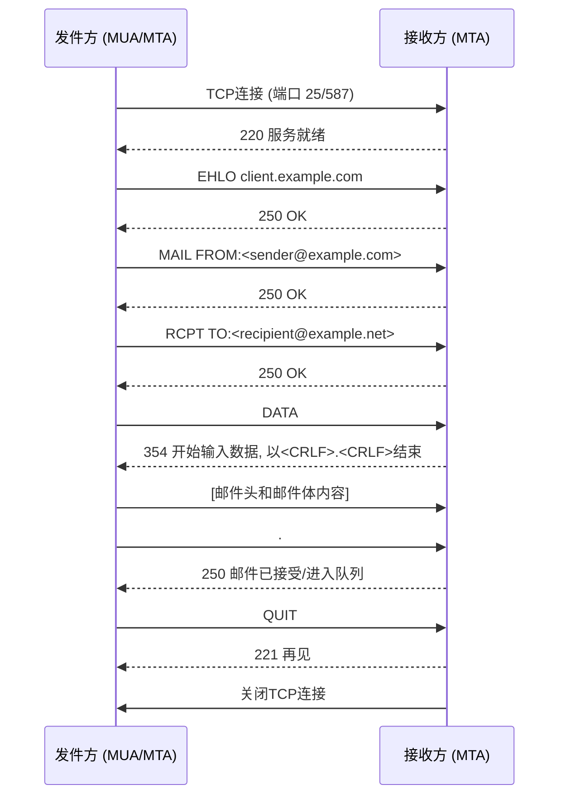

---
{"dg-publish":true,"permalink":"/Work/Script/PHP/Function/Network/SMTP/","title":"SMTP","tags":["flashcards"],"noteIcon":"","created":"2025-11-19T16:37:35.316+08:00","updated":"2026-03-24T17:35:30.388+08:00"}
---

SMTP（Simple Mail Transfer Protocol，简单邮件传输协议）是互联网中用于**发送电子邮件**的核心协议。
## 1\. SMTP 协议的工作原理
SMTP 协议的工作模式基于**客户端-服务器**（C/S）模型，它定义了邮件客户端和邮件服务器之间，以及不同邮件服务器之间传输邮件的规则。
### 工作流程概述
1.  **连接建立 (Establishment):** 发件人的邮件客户端（MUA, Mail User Agent）或发送邮件服务器（MTA, Mail Transfer Agent）通过 TCP **25 号端口**（或加密的 465/587 端口）连接到接收方邮件服务器。
2.  **身份确认 (Identification):** 发送方发送 **`HELO`** 或 **`EHLO`** 命令向服务器表明身份。服务器回复 **`250 OK`** 表示准备就绪。
3.  **邮件事务 (Mail Transaction):**
      * **发送方：** 使用 **`MAIL FROM:`** 命令指明发送者邮箱地址。
      * **接收方：** 使用 **`RCPT TO:`** 命令指明接收者邮箱地址。该命令可以重复多次（支持多个收件人）。
4.  **数据传输 (Data Transfer):**
      * 发送方使用 **`DATA`** 命令通知服务器，邮件内容将开始传输。
      * 服务器回复 `354 Go ahead`，发送方开始逐行发送邮件头（Header）和邮件体（Body）。
      * 当邮件内容全部发送完毕后，发送方发送一个**独立的行，内容仅为句点 `.`**。
5.  **连接终止 (Termination):**
      * 发送方发送 **`QUIT`** 命令。
      * 服务器回复 `221 Goodbye` 并关闭连接。
### 关键特点
  * **端口：** 默认使用 **TCP 端口 25**。
  * **交互：** 采用**问答式交互**，客户端（发送方）发出命令，服务器（接收方）返回数字状态码和文本信息。
  * **非持久：** 传统的 SMTP 连接在完成一次邮件发送后即关闭。
  * **不负责接收：** SMTP 仅负责**发送和转发**邮件。接收邮件通常由 POP3 或 IMAP 协议处理。
## 2\. SMTP 协议工作流程 Mermaid 图示


## 3\. SMTP 协议常用命令表格
| **功能类别**  | **命令**         | **协议类型** | **使用阶段**    | **核心作用**                       |
| --------- | -------------- | -------- | ----------- | ------------------------------ |
| **连接与身份** | **HELO**       | SMTP     | 建立连接后       | 标识发送方主机名（传统）。                  |
|           | **EHLO**       | ESMTP    | 建立连接后       | 标识发送方，请求并启用扩展功能（推荐）。           |
|           | **AUTH**       | ESMTP    | EHLO 成功后    | 客户端提供用户名和密码进行身份验证。             |
|           | **STARTTLS**   | ESMTP    | EHLO 成功后    | 将当前连接升级为加密的安全连接 (TLS)。         |
| **邮件事务**  | **MAIL FROM:** | SMTP     | 身份确认后       | 指定邮件的**发件人地址**。                |
|           | **RCPT TO:**   | SMTP     | MAIL FROM 后 | 指定邮件的**收件人地址**（可重复）。           |
|           | **DATA**       | SMTP     | RCPT TO 后   | 通知服务器开始发送邮件内容（邮件头和邮件体）。        |
| **事务控制**  | **RSET**       | SMTP     | 任何时候        | 重置当前事务状态，准备开始新的邮件发送。           |
|           | **NOOP**       | SMTP     | 任何时候        | 无操作，用于保持连接或测试服务器响应。            |
|           | **QUIT**       | SMTP     | 任何时候        | 请求服务器关闭 TCP 连接。                |
| **辅助与查询** | **VRFY**       | SMTP     | 身份确认后       | 验证邮箱地址是否存在（现较少用）。              |
|           | **EXPN**       | SMTP     | 身份确认后       | 请求展开邮件列表（现较少用）。                |
|           | **HELP**       | SMTP     | 任何时候        | 请求服务器提供命令帮助信息。                 |
|           | **SIZE**       | ESMTP    | MAIL FROM 中 | 声明邮件总字节数（在 `MAIL FROM` 命令参数中）。 |
## 4\. PHP Socket 发送邮件示例
以下示例使用 PHP 的 `fsockopen` 函数（Socket 接口）手动发送一个简单的纯文本邮件。
**请注意：** 实际生产环境应使用 PHPMailer 或 Symfony Mailer 等成熟的库，因为手动编写代码复杂且容易出错。
```php
// ----------------------------------------------------
// 配置信息 (请替换为您的实际邮箱、授权码和服务器信息)
// ----------------------------------------------------
$server          = 'ssl://smtp.qq.com';      // 您的 SMTP 服务器地址
$port            = 465;                      // 推荐使用 587 或 465 端口
$username        = '1014129578@qq.com';      // 邮箱账号
$password        = 'kkgbbmzflkprbcbj';       // 注意：这里应使用授权码，而非登录密码
$sender_email    = $username;
$recipient_email = '1054487195@qq.com';
$subject         = 'Test Subject via PHP Socket (with AUTH)';
$message_body    = "This email was sent using a raw PHP socket connection with AUTH LOGIN.\r\nIt works!";
// ----------------------------------------------------
// 1. 构建邮件内容 (RFC 2822 格式)
// ----------------------------------------------------
$email_content = "To: <{$recipient_email}>\r\n";
$email_content .= "From: <{$sender_email}>\r\n";
$email_content .= "Subject: {$subject}\r\n";
$email_content .= "MIME-Version: 1.0\r\n";
$email_content .= "Content-type: text/plain; charset=utf-8\r\n\r\n";
$email_content .= $message_body;
// ----------------------------------------------------
// 辅助函数 (保持不变)
// ----------------------------------------------------
function sendCommand($fp, $command)
{
    // SMTP 交互函数... (略，保持原有逻辑)
    fwrite($fp, $command . "\r\n");
    echo "C: " . trim($command) . "\n";
    $response = '';
    while (!feof($fp)) {
        $line     = fgets($fp, 512);
        $response .= $line;
        echo "S: " . trim($line) . "\n";

        if (preg_match('/^\d{3} /', $line)) {
            break;
        }
    }
    return $response;
}

// ----------------------------------------------------
// 2. 建立连接
// ----------------------------------------------------
$fp = @fsockopen($server, $port, $errno, $errstr, 30);
if (!$fp) {
    die("Error connecting to SMTP server: [$errno] $errstr\n");
}
stream_set_timeout($fp, 5);
// ----------------------------------------------------
// 3. SMTP 交互过程 (添加 AUTH 步骤)
// ----------------------------------------------------
// 接收服务器 220 问候语
fgets($fp, 512);
// EHLO 身份确认
sendCommand($fp, "EHLO localhost");
// --- 启动身份验证（身份验证登录） ---
// 1. 发送 AUTH LOGIN 命令
$response = sendCommand($fp, "AUTH LOGIN");
// 服务器应回复 334 VXNlcm5hbWU6 (要求输入用户名)
// 2. 发送 Base64 编码的用户名
$response = sendCommand($fp, base64_encode($username));
// 服务器应回复 334 UGFzc3dvcmQ6 (要求输入密码)
// 3. 发送 Base64 编码的密码/授权码
$response = sendCommand($fp, base64_encode($password));
// 服务器应回复 235 Authentication successful
// 检查认证是否成功 (简单检查，生产环境需更严谨)
if (strpos($response, '235') === false) {
    // 认证失败，关闭连接并退出
    sendCommand($fp, "QUIT");
    fclose($fp);
    die("\nAuthentication failed. Check your username and authorization code.\n");
}
// --- 身份验证结束 ---
// MAIL FROM: 发件人
sendCommand($fp, "MAIL FROM:<{$sender_email}>");
// RCPT TO: 收件人
sendCommand($fp, "RCPT TO:<{$recipient_email}>");
// DATA 命令，准备发送内容
sendCommand($fp, "DATA");
// 发送邮件内容和结束符
fwrite($fp, $email_content . "\r\n.\r\n");
echo "C: [Mail Content + .]\n";
fgets($fp, 512); // 读取 250 OK 响应
// QUIT 终止连接
sendCommand($fp, "QUIT");
// 关闭连接
fclose($fp);
echo "\nEmail sending process completed (check server response for success).\n";
```