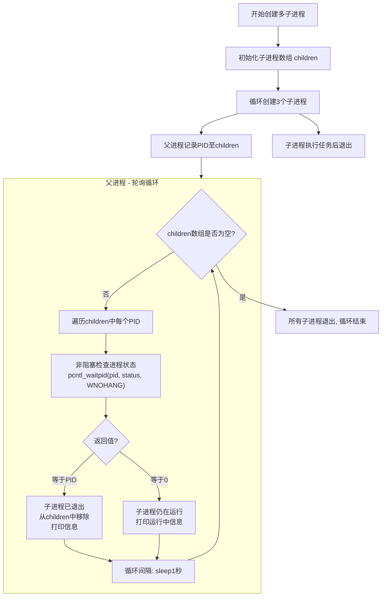
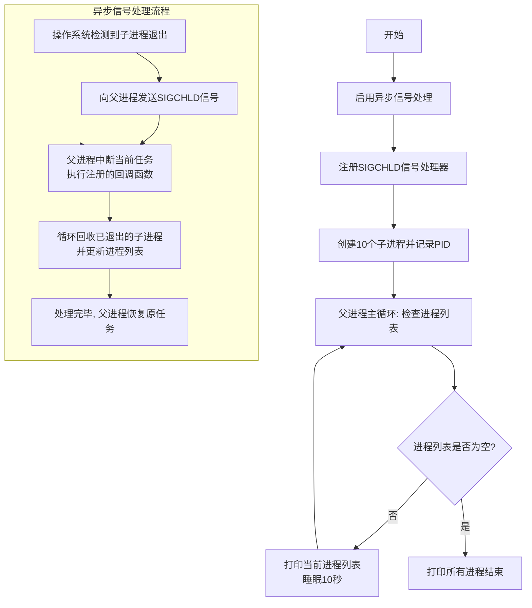

---
{"dg-publish":true,"permalink":"/Work/Script/PHP/Function/Process/PCNTL/","title":"PCNTL","tags":["flashcards"],"noteIcon":"","created":"2025-05-29T13:46:57.137+08:00","updated":"2026-03-24T17:36:47.696+08:00"}
---

# 函数
1. [pcntl_alarm](https://www.php.net/manual/zh/function.pcntl-alarm.php) — 为进程设置 alarm 闹钟信号
2. [pcntl_async_signals](https://www.php.net/manual/zh/function.pcntl-async-signals.php) — 启用/禁用异步信号处理或返回旧设置
3. [pcntl_errno](https://www.php.net/manual/zh/function.pcntl-errno.php) — 别名 pcntl_get_last_error
4. [pcntl_exec](https://www.php.net/manual/zh/function.pcntl-exec.php) — 在当前进程空间执行指定程序
5. [pcntl_fork](https://www.php.net/manual/zh/function.pcntl-fork.php) — 在当前进程当前位置产生分叉（fork）
6. [pcntl_get_last_error](https://www.php.net/manual/zh/function.pcntl-get-last-error.php) — 检索上次pcntl函数失败时设置的错误号
7. [pcntl_getcpuaffinity](https://www.php.net/manual/zh/function.pcntl-getcpuaffinity.php) — - 获取进程的cpu亲和性
8. [pcntl_getpriority](https://www.php.net/manual/zh/function.pcntl-getpriority.php) — 获取任意进程的优先级
9. [pcntl_rfork](https://www.php.net/manual/zh/function.pcntl-rfork.php) — - 操纵过程资源
10. [pcntl_setcpuaffinity](https://www.php.net/manual/zh/function.pcntl-setcpuaffinity.php) — - 设置进程的cpu亲和性
11. [pcntl_setpriority](https://www.php.net/manual/zh/function.pcntl-setpriority.php) — 修改任意进程的优先级
12. [pcntl_signal](https://www.php.net/manual/zh/function.pcntl-signal.php) — 安装信号处理程序
13. [pcntl_signal_dispatch](https://www.php.net/manual/zh/function.pcntl-signal-dispatch.php) — 调用等待信号的处理程序
14. [pcntl_signal_get_handler](https://www.php.net/manual/zh/function.pcntl-signal-get-handler.php) — - 获取指定信号的当前处理程序
15. [pcntl_sigprocmask](https://www.php.net/manual/zh/function.pcntl-sigprocmask.php) — 设置或检索阻塞信号
16. [pcntl_sigtimedwait](https://www.php.net/manual/zh/function.pcntl-sigtimedwait.php) — 带超时机制的信号等待
17. [pcntl_sigwaitinfo](https://www.php.net/manual/zh/function.pcntl-sigwaitinfo.php) — 等待信号
18. [pcntl_strerror](https://www.php.net/manual/zh/function.pcntl-strerror.php) — 检索与给定errno相关联的系统错误消息
19. [pcntl_unshare](https://www.php.net/manual/zh/function.pcntl-unshare.php) — 分离流程执行上下文的各个部分
20. [pcntl_wait](https://www.php.net/manual/zh/function.pcntl-wait.php) — 等待或返回 fork 的子进程状态
21. [pcntl_waitid](https://www.php.net/manual/zh/function.pcntl-waitid.php) — 等待子进程改变状态
22. [pcntl_waitpid](https://www.php.net/manual/zh/function.pcntl-waitpid.php) — 等待或返回 fork 的子进程状态「`pcntl_waitpid` 看作是 `pcntl_wait` 的增强版。」
23. [pcntl_wexitstatus](https://www.php.net/manual/zh/function.pcntl-wexitstatus.php) — 返回一个中断的子进程的返回代码
24. [pcntl_wifexited](https://www.php.net/manual/zh/function.pcntl-wifexited.php) — 检查状态代码是否代表一个正常的退出
25. [pcntl_wifsignaled](https://www.php.net/manual/zh/function.pcntl-wifsignaled.php) — 检查子进程状态码是否代表由于某个信号而中断
26. [pcntl_wifstopped](https://www.php.net/manual/zh/function.pcntl-wifstopped.php) — 检查子进程当前是否已经停止
27. [pcntl_wstopsig](https://www.php.net/manual/zh/function.pcntl-wstopsig.php) — 返回导致子进程停止的信号
28. [pcntl_wtermsig](https://www.php.net/manual/zh/function.pcntl-wtermsig.php) — 返回导致子进程中断的信号
# pcntl_fork
当调用 `pcntl_fork()` 时，它会创建一个子进程，这个子进程几乎是父进程的一个完美克隆。子进程代码的执行细节可以总结为以下几个关键点：
### 1. 从 `pcntl_fork()` 处继续执行
子进程不会从脚本的开头重新执行，它会从 `pcntl_fork()` **被调用的那一行开始**继续执行。
- **父进程**的 `pcntl_fork()` 会返回子进程的 PID (进程ID)，一个大于0的整数。
- **子进程**的 `pcntl_fork()` 会返回 `0`。
根据这个返回值，你就可以在 `if/else` 结构中编写不同的逻辑，让父子进程走上不同的执行路径。
### 2. 完美的副本
子进程是父进程的一个完整副本。这意味着它**继承了**：
- **当前脚本的所有变量**：包括全局变量、局部变量以及堆上的所有数据。
- **所有文件描述符**：包括打开的文件、数据库连接和网络套接字。
- **进程状态**：包括当前的工作目录、用户ID、组ID等。
这就是为什么在 `pcntl_fork()` 之后，父子进程可以共享 `stream_socket_pair` 创建的套接字。
### 3. 写时复制（Copy-on-Write）
虽然子进程继承了父进程的所有内存，但操作系统并不会立即复制所有数据。为了节省内存和提高效率，它会使用**写时复制（Copy-on-Write, COW）** 机制。
- **初始状态**：父子进程共享同一份物理内存页。
- **修改时**：只有当父进程或子进程中的**任何一方**试图修改共享内存中的数据时，操作系统才会为修改的那一方**创建一份新的内存页副本**。
举个例子：
```PHP
$data = "Hello";
$pid = pcntl_fork();

if ($pid === 0) {
    $data .= ", Child"; // 此时操作系统会为子进程复制 $data 的内存页
}
```
在这个例子中，子进程修改 `$data` 时，才会真正发生内存复制。这种机制极大地减少了进程分叉的开销。
### 4. 独立的执行
一旦分叉完成，子进程就拥有了自己的**独立生命周期**。它有自己独立的 PID，可以独立地运行、终止。它的终止不会影响父进程，除非父进程主动去等待或处理子进程的结束。
这使得父进程可以分派任务给子进程，让它们在后台并行处理，而父进程可以继续执行其他任务。
# pcntl_wait vs pcntl_waitpid
| 特性                  | `pcntl_wait($status)` | `pcntl_waitpid($pid, $status, $options)`                                                                                                                 |
| ------------------- | --------------------- | -------------------------------------------------------------------------------------------------------------------------------------------------------- |
| **等待目标**            | **任意一个**子进程退出         | **指定的**某个或某一类子进程退出                                                                                                                                       |
| **控制精度**            | 低。谁先退出就处理谁。           | 高。可以指定等待哪个进程、或是否非阻塞。                                                                                                                                     |
| **进程ID参数**          | 没有                    | **`$pid`** 参数决定了等待谁：  <br>- `> 0`: 等待指定PID的子进程  <br>- `-1`: 等待**任意**子进程（同`wait`）  <br>- `0`: 等待与父进程**同进程组**的任意子进程  <br>- `< -1`: 等待进程组ID等于\|$pid\|的任意子进程 |
| **选项 (`$options`)** | 没有选项，**总是阻塞**。        | **`$options`** 参数提供额外控制：  <br>- `0`: 默认行为，阻塞等待  <br>- `WNOHANG`: **非阻塞**模式。立即返回，即使没有子进程退出。  <br>- `WUNTRACED`: 也返回已停止的子进程信息（不常用）。                        |
| **返回值**             | 退出子进程的PID，出错时返回-1。    | 退出子进程的PID；如果使用 `WNOHANG` 且没有子进程退出，则返回 **0**；出错时返回-1。                                                                                                     |
## 轮询式多进程管理
```php
$children = [];

// 创建多个子进程
for ($i = 0; $i < 3; $i++) {
    $pid = pcntl_fork();
    if ($pid == 0) {
        // 子进程
        sleep(rand(1, 3)); // 模拟工作
        exit($i);
    } else {
        $children[] = $pid;
    }
}

// 父进程 - 等待所有子进程退出
while (count($children) > 0) {
    foreach ($children as $key => $pid) {
        $res = pcntl_waitpid($pid, $status, WNOHANG);
        
        if ($res == $pid) {
            // 子进程已退出
            echo "子进程 $pid 退出，状态: " . pcntl_wexitstatus($status) . "\n";
            unset($children[$key]);
        } else if ($res == 0) {
            // 子进程仍在运行
            echo "子进程 $pid 仍在运行...\n";
        }
    }
    sleep(1); // 短暂休眠避免CPU过度使用
}
```
### 图示

## 信号驱动式多进程管理
```php
// 启用异步信号处理
pcntl_async_signals(true);
$pid = getmypid();
echo '父进程: ' . $pid . PHP_EOL;

pcntl_signal(SIGCHLD, function () {
    global $processes, $pid;
    while (!empty($processes[$pid])) {
        $exitPid = pcntl_waitpid(-1, $status, WNOHANG);
        $key     = array_search($exitPid, $processes[$pid]);
        unset($processes[$pid][$key]);
        // 子进程已退出
        echo "子进程 $exitPid 退出，状态: " . pcntl_wexitstatus($status) . PHP_EOL;
        sleep(1);
    }
});

$processes = [];
for ($i = 0; $i < 10; $i++) {
    $fork = pcntl_fork();
    if ($fork == -1) {
        die('fork error');
    } elseif ($fork) {
        $processes[$pid][] = $fork;
    } else {
        // 子进程会进入这里，因为 $pid 是 0
        echo "子进程: 我正在工作，我的PID是 " . getmypid() . "\n";
        sleep(30);
        exit(123); // 子进程工作完成，退出，退出码为123
    }
}

while (!empty($processes[$pid])) {
    echo "运行中的进程:" . var_export($processes, true) . PHP_EOL;
    sleep(10);
}
echo "所有进程已结束:" . PHP_EOL;
var_export($processes);
```
### 图示

# pcntl_alarm
```php
// 信号处理器函数
function alarmHandler($signo) {
    if ($signo === SIGALRM) {
        echo "收到 SIGALRM 信号：代码执行超时！\n";
        // 退出进程，或者抛出异常，或执行清理工作
        exit(1);
    }
}

// 注册信号处理器
pcntl_signal(SIGALRM, 'alarmHandler');

echo "开始执行耗时操作...\n";

// 设置 5 秒的警报。如果 5 秒内未清除警报，将发送 SIGALRM 信号。
pcntl_alarm(5);

// 模拟一个可能长时间运行的操作
for ($i = 0; $i < 1000000000; $i++) {
    // 确保信号能被分发 (特别是针对 CPU 密集型任务)
    // pcntl_signal_dispatch() 在每次循环迭代中检查是否有待处理的信号
    pcntl_signal_dispatch();
    // 假设这里有一些耗时操作
    // usleep(100); // 如果有IO操作，通常会自动处理信号
}

echo "耗时操作完成！\n";

// 如果操作在 5 秒内完成，取消警报
pcntl_alarm(0); // 设置为 0 取消当前的警报

echo "程序正常退出。\n";
```
# pcntl_signal
安装信号处理程序
>`pcntl` 是 **P**rocess **C**o**nt**ro**l** 的缩写。
它是 PHP 的一个扩展，提供了进程控制功能，允许 PHP 脚本执行类似 Unix 系统的进程创建、执行、信号处理等操作。`pcntl_signal` 就是其中一个函数，用于注册信号处理器。
## 函数写法
```php
// 启用异步信号处理。
// 当设置为 true 时，信号处理器会在接收到信号时立即被调用。
// 如果设置为 false（默认），信号处理器只会在 PHP 内部的“tick”事件发生时，
// 或者在调用特定的阻塞型 PCNTL 函数时才会被调用。
// 对于长时间运行的脚本（例如守护进程或消息消费者），启用异步信号处理至关重要，
// 这样你的脚本才能及时响应信号，而无需等待特定的执行点。
pcntl_async_signals(true);

/**
 * 信号处理函数。
 * 当 PHP 进程接收到信号时，就会执行这个函数。
 * $signo 参数包含了捕获到的信号的整数值。
 *
 * @param int $signo 信号编号。
 */
function sig_handler($signo)
{
    // 使用 switch 语句针对不同的信号进行具体处理。
    switch ($signo) {
        case SIGTERM: // 信号 15: 终止信号，通常由 'kill' 命令发送。
            // 在这里处理优雅停机的任务。
            // 例如，关闭数据库连接、保存进度或完成当前正在处理的任务。
            echo "捕获到 SIGTERM 信号。正在优雅退出...\n";
            exit; // 终止脚本执行。
            // break; // 在 exit 后 break 是多余的，但保留以示良好习惯。
        case SIGHUP: // 信号 1: 控制终端挂起或控制进程死亡。
            // 通常用于告诉守护进程重新加载其配置文件，而无需重启服务。
            echo "捕获到 SIGHUP 信号。正在重新加载配置（模拟操作）。..\n";
            // 处理重启或重新加载任务。
            // 例如：重新读取配置文件、重新初始化某些组件。
            break;
        case SIGUSR1: // 信号 10: 用户自定义信号 1。
            // 这些是自定义信号，你可以根据应用程序的特定需求来使用。
            echo "捕获到 SIGUSR1...\n";
            // 你可以在这里触发一个自定义动作，例如记录特定事件。
            break;
        default:
            // 处理所有未在上面明确捕获的其他信号。
            // 这是一个捕获意外信号的良好后备机制。
            echo "捕获到未知信号: {$signo}\n";
    }
}

echo "正在安装信号处理器...\n";

// 安装信号处理程序。
// pcntl_signal(信号编号, 处理函数回调)。
// 当接收到 SIGTERM 信号时，'sig_handler' 函数将被调用。
pcntl_signal(SIGTERM, "sig_handler");
// 当接收到 SIGHUP 信号时，'sig_handler' 函数将被调用。
pcntl_signal(SIGHUP, "sig_handler");
// 当接收到 SIGUSR1 信号时，'sig_handler' 函数将被调用。
pcntl_signal(SIGUSR1, "sig_handler");

echo "正在向自身进程发送 SIGUSR1 信号...\n";

// 向当前进程 ID 发送 SIGUSR1 信号。
// posix_kill(进程ID, 信号编号) 用于向进程发送信号。
// posix_getpid() 返回当前 PHP 进程的 ID。
// posix_* 函数需要启用 'posix' PHP 扩展。
// 在这个例子中，我们正在向自身正在运行的脚本发送信号。
posix_kill(posix_getpid(), SIGUSR1);

echo "完成\n";
```
## 对象写法
```php
// 确保启用了异步信号处理，以便信号能立即被捕获。
pcntl_async_signals(true);

/**
 * 一个模拟的守护进程类。
 * 它会处理一些内部状态，并响应外部信号。
 */
class MyDaemon
{
    private bool $isRunning = true;
    private int $taskCount = 0;

    public function __construct()
    {
        echo "MyDaemon 实例已创建。\n";
        // 在构造函数或初始化方法中注册信号处理器
        $this->registerSignalHandlers();
    }

    /**
     * 注册 PCNTL 信号处理器。
     * 将对象自身的公共方法绑定为信号回调。
     */
    private function registerSignalHandlers(): void
    {
        echo "注册信号处理器...\n";
        // 绑定 SIGTERM 到自身的 handleSigTerm 方法
        pcntl_signal(SIGTERM, [$this, "handleSigTerm"]);
        // 绑定 SIGUSR1 到自身的 handleSigUsr1 方法
        pcntl_signal(SIGUSR1, [$this, "handleSigUsr1"]);
        echo "信号处理器注册完成。\n";
    }

    /**
     * 处理 SIGTERM 信号的回调方法。
     * 用于优雅地停止守护进程。
     * @param int $signo 信号编号 (SIGTERM)
     */
    public function handleSigTerm(int $signo): void
    {
        echo "\n捕获到 SIGTERM ({$signo}) 信号。正在停止守护进程...\n";
        $this->isRunning = false; // 设置运行标志为 false，停止主循环
        // 在此处执行清理操作，如关闭数据库连接、保存当前进度等。
        echo "守护进程清理完成。\n";
    }

    /**
     * 处理 SIGUSR1 信号的回调方法。
     * 这是一个用户自定义信号，可以用于触发特定动作。
     * @param int $signo 信号编号 (SIGUSR1)
     */
    public function handleSigUsr1(int $signo): void
    {
        echo "\n捕获到 SIGUSR1 ({$signo}) 信号。触发自定义动作：报告当前任务计数。\n";
        echo "当前已完成任务数: " . $this->taskCount . "\n";
    }

    /**
     * 守护进程的主运行循环。
     */
    public function run(): void
    {
        echo "守护进程开始运行。\n";
        $counter = 0;
        while ($this->isRunning) {
            // 模拟守护进程正在执行一些任务
            $this->taskCount++;
            echo "执行任务 #{$this->taskCount}...\n";

            // 短暂暂停，避免 CPU 占用过高
            sleep(1);

            // 每隔一段时间发送一个 SIGUSR1 信号给自己，模拟外部触发
            if ($this->taskCount % 5 === 0) {
                echo "内部触发 SIGUSR1 信号...\n";
                posix_kill(posix_getpid(), SIGUSR1);
            }
        }
        echo "守护进程已停止运行。\n";
    }
}

// 实例化我们的守护进程类
$daemon = new MyDaemon();

// 启动守护进程的主循环
$daemon->run();

echo "脚本执行完毕。\n";
```
## 操作步骤
**运行PHP 脚本** (例如 `daemon.php`)：
```shell
php daemon.php
```
**查找进程 ID (PID)**：
这会直接返回进程 ID，例如 `12345`。
```shell
pgrep -f "php daemon.php"
```
**发送信号**：
假设你找到的 PID 是 `12345`。
- **发送 SIGUSR1** (用户自定义信号)： 在第二个终端窗口中输入：
```shell
kill -s USR1 12345
```

回到第一个终端窗口，你会看到你的 PHP 脚本的 `handleSigUsr1` 方法被触发，并打印出“捕获到 SIGUSR1...”的消息。
- **发送 SIGTERM** (终止信号)： 在第二个终端窗口中输入：
```shell
kill 12345
# 或者
kill -s TERM 12345
```

回到第一个终端窗口，你会看到你的 PHP 脚本的 `handleSigTerm` 方法被触发，打印出“捕获到 SIGTERM...正在停止守护进程...”等消息，然后脚本会退出。
- **发送 SIGKILL** (强制终止信号，如果 `SIGTERM` 不起作用)： 如果你的脚本没有正确处理 `SIGTERM`，或者卡住了，你可以使用 `SIGKILL`。
```shell
kill -9 12345
```
这会立即终止脚本，通常不会有任何优雅退出的输出，因为进程没有机会执行清理代码。
# pcntl_async_signals
以下是一个清晰展示 `pcntl_async_signals(true)` 作用的示例代码，通过对比同步和异步信号处理的行为，帮助理解其意义：
```php
/*
启用 ticks 机制（仅用于同步信号处理）「不推荐使用这个」
1. 性能开销较大（每个语句后都检查信号）
2. 在 PHP 7.1+ 中被认为已弃用（但仍可用）
3. 可能干扰其他代码
*/
// declare(ticks=1);

// 同步信号处理示例
function synchronousSignalHandler($signal) {
    echo "同步处理: 接收到信号 $signal\n";
}

// 异步信号处理示例
function asynchronousSignalHandler($signal) {
    echo "异步处理: 接收到信号 $signal\n";
}

// 注册同步信号处理（默认）
pcntl_signal(SIGUSR1, 'synchronousSignalHandler');

// 启用异步信号处理
pcntl_async_signals(true);
pcntl_signal(SIGUSR2, 'asynchronousSignalHandler');

// 模拟长时间运行的主循环
echo "主进程 PID: " . getmypid() . "\n";
echo "发送 SIGUSR1 或 SIGUSR2 测试信号处理\n";

while (true) {
    // 同步信号需要手动调用 dispatch
    pcntl_signal_dispatch(); // 仅处理同步信号

    // 模拟工作负载
    usleep(500000); // 0.5秒
}
```
### 运行步骤和测试
1. 保存代码为 `signal_example.php`
2. 在终端运行：
```bash
php signal_example.php
```
1. 在另一个终端窗口发送信号：
- **同步信号**（需等待 `pcntl_signal_dispatch()`）：
 ```bash
 kill -SIGUSR1 <PID>
 ```
- **异步信号**（立即触发）：
 ```bash
 kill -SIGUSR2 <PID>
 ```
### 关键说明
1. **同步信号处理（默认行为）**：
   - 需要定期调用 `pcntl_signal_dispatch()` 才能触发信号处理函数。

2. **异步信号处理（`pcntl_async_signals(true)`）**：
   - 信号处理函数在信号到达时**立即执行**，无需依赖 `pcntl_signal_dispatch()`。
   - 即使主循环在阻塞操作（如 `sleep()` 或 `pcntl_wait()`）中，也能立即响应信号。
### 对比示例
#### 场景 1：同步信号处理
```php
echo "主进程 PID: " . getmypid() . PHP_EOL;
pcntl_signal(SIGINT, function ($signal) {
    echo "同步处理 SIGINT $signal", PHP_EOL;
});
while (true) {
    sleep(10); // 长时间阻塞
    pcntl_signal_dispatch(); // 需要显示调用触发信号
}
```
- 发送 `SIGINT`（Ctrl+C）后，信号会被处理。
#### 场景 2：异步信号处理
```php
echo "主进程 PID: " . getmypid() . PHP_EOL;
pcntl_async_signals(true);
pcntl_signal(SIGINT, function($signal) {
    echo "异步处理 SIGINT\n";
});
while (true) {
    sleep(10); // 长时间阻塞
}
```
- 发送 `SIGINT`（Ctrl+C）后，信号会**立即**被处理完成。
### 实际应用场景
1. **实时响应信号**：
   - 在服务器进程中，需要立即处理 `SIGTERM`（终止）或 `SIGHUP`（重载配置）信号。
   - 示例：Web 服务器接收到 `SIGHUP` 后，立即加载新配置文件。

2. **多进程管理**：
   - 父进程通过 `SIGCHLD` 监听子进程退出，即使父进程在 `pcntl_wait()` 阻塞中，也能立即回收子进程资源。
### 注意事项
1. **信号处理函数的简洁性**：
   - 避免在信号处理函数中执行耗时操作（如数据库写入），否则可能导致信号丢失或程序不稳定。
   - 推荐将复杂逻辑放入主循环中，通过标志位或队列传递信号事件。

2. **兼容性**：
   - `pcntl_async_signals()` 需要 PHP 7.1+ 版本支持。
   - 在同步模式下，`pcntl_signal_dispatch()` 是必须的，但会消耗额外资源（如高频率调用）。
# pcntl_signal_dispatch
### 1. `sleep()` 的中断行为
在 PHP 中，`sleep()` 是通过底层的系统调用（如 Linux 的 `sleep()` 系统调用）实现的。当进程处于 `sleep()` 阻塞状态时，**如果收到信号（如 `SIGINT`），系统调用会立即中断**，并返回**剩余未睡眠**的时间。例如：
```php
$remaining = sleep(5); // 如果收到信号，立即返回剩余时间
```
这意味着：
- `sleep(5)` 并不会完全阻塞 5 秒，而是会在接收到信号时提前返回。
- **信号的到达会直接中断 `sleep()`，从而让程序继续执行后续代码**（即 `echo 'processing...'` 和 `pcntl_signal_dispatch()`）。
### 2. `pcntl_signal_dispatch()` 的调用时机
你的代码中，`pcntl_signal_dispatch()` 是在 `sleep(5)` **之后**调用的。由于 `sleep()` 被信号中断后，程序会立即执行 `pcntl_signal_dispatch()`，从而触发信号处理函数。
#### 关键流程：
1. **`sleep(5)` 被信号中断**：进程从 `sleep()` 返回，无需等待 5 秒。
2. **执行 `pcntl_signal_dispatch()`**：PHP 会检查是否有待处理的信号，并调用对应的处理函数（如 `SIGINT` 的回调）。
3. **信号处理函数执行**：`echo "异步处理 SIGINT\n"` 被输出。
### 3. 为什么不需要 `pcntl_async_signals(true)`？
`pcntl_async_signals(true)` 的作用是**启用异步信号处理模式**，允许信号处理函数在任意时刻（即使没有调用 `pcntl_signal_dispatch()`）被触发。但在你的代码中：
- **信号处理依赖 `sleep()` 的中断行为**：`sleep()` 本身会在信号到达时中断，从而确保 `pcntl_signal_dispatch()` 被调用。
- **`pcntl_signal_dispatch()` 在中断后立即执行**：信号处理函数被触发，无需依赖异步模式。
#### 对比两种场景：
| 场景       | 是否启用 `pcntl_async_signals(true)` | 信号处理方式                                             |
| -------- | -------------------------------- | -------------------------------------------------- |
| **你的代码** | 否                                | `sleep()` 中断 → `pcntl_signal_dispatch()` 调用 → 信号处理 |
| **异步模式** | 是                                | 信号到达时立即触发回调，无需 `pcntl_signal_dispatch()`           |
### 4. 代码行为的验证
你可以通过以下实验验证这一机制：
#### 步骤 1：运行代码并记录 PID
```php
pcntl_signal(SIGINT, function($signal) {
    echo "异步处理 SIGINT\n";
});
echo posix_getpid(); // 输出进程 PID
while (true) {
    $remaining = sleep(5); // 返回剩余未睡眠时间（若被信号中断）
    echo "Sleep interrupted after $remaining seconds\n";
    pcntl_signal_dispatch(); // 手动触发信号处理
}
```
#### 步骤 2：发送信号并观察输出
```bash
kill -INT <PID>  # 发送 SIGINT 信号
```
#### 预期输出：
```
<PID>
Sleep interrupted after 5 seconds  # 如果未发送信号
Sleep interrupted after 0 seconds  # 如果发送信号
异步处理 SIGINT
```
- **若信号发送时间在 `sleep(5)` 执行期间**：`sleep()` 会立即返回 `$remaining = 0`，随后 `pcntl_signal_dispatch()` 触发信号处理。
- **若信号发送时间在 `sleep(5)` 之后**：`sleep()` 正常返回 `$remaining = 5`，但 `pcntl_signal_dispatch()` 仍会检查是否有未处理的信号。
### 5. 深入理解信号处理机制
#### 同步信号处理（默认）
- 需要手动调用 `pcntl_signal_dispatch()`。
- 信号处理函数仅在 `pcntl_signal_dispatch()` 被调用时触发。
- **阻塞操作（如 `sleep()`）会延迟信号处理**，除非阻塞操作本身被信号中断。
#### 异步信号处理（`pcntl_async_signals(true)`）
- 信号处理函数在信号到达时**立即触发**，无需依赖 `pcntl_signal_dispatch()`。
- 适用于需要实时响应信号的场景（如多进程管理）。
### 6. 总结
你的代码能够及时响应 `SIGINT` 信号的原因是：
1. **`sleep()` 被信号中断**：信号到达时，`sleep()` 立即返回，程序继续执行。
2. **`pcntl_signal_dispatch()` 在中断后调用**：信号处理函数被触发。

**关键点**：`sleep()` 的中断行为和 `pcntl_signal_dispatch()` 的调用时机共同确保了信号的及时处理，无需依赖 `pcntl_async_signals(true)`。这种机制在简单的单线程脚本中有效，但在复杂的多进程或多任务场景中，建议使用异步信号处理（`pcntl_async_signals(true)`）以获得更好的实时性。
# 信号
```ini
# 15
; 终止信号 (Terminate Signal)
; 这是一个通用的终止请求信号。当程序收到 SIGTERM 信号时，它通常会尝试进行清理工作（例如保存数据、关闭文件等），然后优雅地退出。
; 它是关闭应用程序的首选方式，因为它允许程序在退出前完成必要的操作。
SIGTERM

# 2
; 中断信号 (Interrupt Signal)
; 这个信号通常由用户在终端按下 Ctrl+C 键时发送。
; 当程序收到 SIGINT 信号时，它通常会中断当前的执行并退出。
; 类似于 SIGTERM，它也允许程序在退出前进行清理。
SIGINT

# 1
; 挂起信号 (Hangup Signal)
; 当控制终端关闭或断开连接时，这个信号通常发送给进程。
; 例如，SSH 会话断开时，会话中运行的进程可能会收到 SIGHUP。
SIGHUP

# 3
; 终止信号 (Quit Signal)
; 类似于 SIGTERM，但它通常是由用户在终端按下 Ctrl+\ 键时触发。
; 收到 SIGQUIT 的程序通常会执行清理操作，并生成一个核心转储文件 (core dump)，以便进行调试。
SIGQUIT

# 4
; 非法指令信号 (Illegal Instruction Signal)
; 当程序尝试执行一个无效或非法的 CPU 指令时，会发送此信号。
SIGILL

# 5
; 陷阱信号 (Trap Signal)
; 通常用于调试器。当程序遇到一个断点或其他陷阱指令时，会发送此信号。
SIGTRAP

# 6
; 中止信号 (Abort Signal)
; 当程序调用 `abort()` 函数时，会发送此信号，导致程序异常终止并通常生成核心转储文件。
SIGABRT

# 7
; 总线错误信号 (Bus Error Signal)
; 当程序尝试访问无效的内存地址（例如，未对齐的内存访问）时，会发送此信号。
SIGBUS

# 11
; 段错误信号 (Segmentation Fault Signal)
; 当程序尝试访问它没有权限访问的内存区域时，会发送此信号。这是常见的编程错误。
SIGSEGV

# 13
; 管道破裂信号 (Broken Pipe Signal)
; 当程序尝试写入一个没有读取者的管道或套接字时，会发送此信号。
SIGPIPE

# 14
; 闹钟信号 (Alarm Clock Signal)
; 当通过 `alarm()` 系统调用设置的定时器到期时，会发送此信号。
SIGALRM

# 9
; 终止信号 (Termination Signal)
; 这是另一个通用终止信号，通常在进程无法响应 SIGTERM 时使用，它会强制终止进程，不进行清理。
SIGKILL

# 10
; 用户定义信号 1 (User-defined Signal 1)
; 这是一个可供应用程序自定义使用的信号。
SIGUSR1

# 12
; 用户定义信号 2 (User-defined Signal 2)
; 这是另一个可供应用程序自定义使用的信号。
SIGUSR2

# 17
; 子进程停止信号 (Child Stop Signal)
; 当子进程停止（例如，被调试器停止或收到 SIGTSTP）时，会发送此信号给其父进程。
SIGCHLD

# 18
; 继续信号 (Continue Signal)
; 用于恢复一个被停止（例如，通过 SIGSTOP 或 SIGTSTP）的进程。
SIGCONT

# 19
; 停止信号 (Stop Signal)
; 这是一个无法被捕获、阻塞或忽略的信号，它会立即停止进程。
SIGSTOP

# 20
; 终端停止信号 (Terminal Stop Signal)
; 当用户在终端按下 Ctrl+Z 键时，会发送此信号来停止（暂停）进程。
SIGTSTP

# 21
; 终端输入/输出中断信号 (Terminal Input/Output Interrupt Signal)
; 当后台进程尝试从终端读取输入或写入输出时，如果终端处于特定模式，会发送此信号。
SIGTTIN

# 22
; 终端输出中断信号 (Terminal Output Interrupt Signal)
; 与 SIGTTIN 类似，但针对的是后台进程尝试写入终端的情况。
SIGTTOU

# 23
; 紧急输入/输出可用信号 (Urgent I/O Available Signal)
; 当套接字上有紧急数据可用时，会发送此信号。
SIGURG

# 24
; CPU 时间限制超越信号 (CPU Time Limit Exceeded Signal)
; 当进程的 CPU 使用时间超过其软限制时，会发送此信号。
SIGXCPU

# 25
; 文件大小限制超越信号 (File Size Limit Exceeded Signal)
; 当进程尝试创建一个超过其软限制的文件时，会发送此信号。
SIGXFSZ

# 26
; 虚拟定时器信号 (Virtual Timer Signal)
; 当进程的虚拟定时器到期时，会发送此信号。虚拟定时器只计算进程实际执行的时间。
SIGVTALRM

# 27
; 概要定时器信号 (Profiling Timer Signal)
; 当概要定时器到期时，会发送此信号。概要定时器包括进程执行时间以及系统为进程执行的时间。
SIGPROF

# 28
; 窗口改变信号 (Window Change Signal)
; 当终端窗口大小改变时，会发送此信号。
SIGWINCH

# 29
; I/O 可用信号 (I/O Available Signal)
; 当异步 I/O 操作完成时，或者文件描述符准备好进行 I/O 时，会发送此信号。
SIGIO

# 30
; 电源失效信号 (Power Failure Signal)
; 通常由 UPS 软件发送，表示电源即将失效。
SIGPWR

# 31
; 系统调用错误信号 (Bad System Call Signal)
; 当程序尝试执行一个无效的系统调用时，会发送此信号。
SIGSYS
```
# 退出码
### 一、PHP `exit` 错误码规范
PHP CLI脚本通过`exit(int $status)`返回状态码，需遵守以下规范：
#### 1. 取值范围  
   - 成功状态：`0`  
   - 错误状态：`1-254`（避免使用`255`，因PHP保留）  
   - 非法值处理：  
     - `exit(-1)` → 转换为`255`  
     - `exit(256)` → 取模运算为`0`（因`256 % 256 = 0`）  
     - `exit(258)` → 取模运算为`2`（`258 % 256 = 2`）
#### 2. 常见错误码含义  
| 状态码   | 含义             | 触发场景举例                     |
| ----- | -------------- | -------------------------- |
| 1     | 通用错误（如逻辑异常）    | exit(1) 或未捕获的除零错误          |
| 2     | 系统调用错误（如权限不足）  | 执行无权限的命令                   |
| 126   | 不可执行文件         | 脚本无执行权限                    |
| 127   | 命令未找到          | 脚本路径错误                     |
| 128+n | 进程被信号终止（n=信号值） | 139 = 128+11（段错误 SIGSEGV）2 |
| 255   | 非法退出码转换结果      | exit(-1) 或 exit(300)       |
#### 3. 设计原则  
   - 业务错误码建议从`10`开始预留扩展空间（如`10`=参数错误，`11`=数据库连接失败）  
   - 避免与系统信号冲突
### 二、Supervisor 对PHP退出码的处理逻辑
Supervisor通过状态码判断进程是否异常，关键行为包括：  
1. **预期与非预期退出**  
   - **预期退出**：返回`0` → Supervisor记录`EXITED`但不会重启  
   - **非预期退出**：返回非`0` → Supervisor标记`not expected`并自动重启（若配置`autorestart=true`）  
   - **示例日志**：  
```plaintext
INFO exited: worker1 (exit status 1; not expected)  // 非0触发重启
INFO gave up: worker1 entered FATAL state           // 连续失败超阈值
```
2. **关键配置参数**  
```ini
[program:php_worker]
autorestart = true         ; 非0退出时重启
exitcodes = 0              ; 仅当退出码=0时视为正常退出
startretries = 3           ; 最大重启尝试次数
startsecs = 5              ; 进程持续5秒才视为启动成功
```
### 三、常见问题与解决方案
#### 1. 脚本立即退出（Exited too quickly）
   - **现象**：Supervisor报错`FATAL Exited too quickly`  
   - **原因**：  
     - PHP脚本路径错误 → 触发退出码`127`  
     - 文件权限问题 → 触发退出码`126`（如用户无权执行脚本）  
     - 脚本包含`exit(1)`（例如初始化失败后主动退出）  
   - **解决**：  
     - 检查路径：`command`配置使用**绝对路径**（如`/usr/bin/php /app/script.php`）
     - 验证权限：`chmod +x script.php` 并确认执行用户权限
     - 日志定位：查看`stderr_logfile`中的PHP错误输出
#### 2. 误重启（业务正常结束被重启）
   - **场景**：脚本正常结束（应返`0`），但误返非`0`导致Supervisor重启  
   - **解决**：  
	1. 显式指定退出码：脚本结束时调用`exit(0)`  
	2. 捕获异常统一处理：  
```php
try {
    // 业务逻辑
} catch (Throwable $e) {
    error_log($e->getMessage());
    exit(1); // 明确返回错误码
}
// 确保正常结束返回0
exit(0);
```
### 四、最佳实践建议
1. **PHP脚本规范**
    - 始终在脚本结束时显式返回状态码：`exit(0)`（成功）或`exit(n)`（自定义错误）
    - 避免在常驻进程（如队列Worker）中直接`exit` → 改用异常或`return`结束当前任务4
    - 资源清理：在`register_shutdown_function`中释放数据库连接/文件句柄39
2. **Supervisor配置优化**
```ini
[program:queue_worker]
command = /usr/bin/php /app/artisan queue:work
directory=/var/www/project
user = www-data          ; 避免使用root
startsecs = 5            ; 给予足够启动时间
stopsignal = SIGTERM     ; 允许优雅退出
stopwaitsecs = 30        ; 等待清理的超时时间:cite[4]
autorestart = true       ; 非0退出时重启
exitcodes=0,2            ; 允许正常退出(0)和Ctrl+C(2)
startsecs=0              ; 兼容快速退出脚本
startretries=10          ; 避免频繁重启
stdout_logfile=/var/log/worker.out.log
redirect_stderr=true     ; 错误日志合并到 stdout
```
3. **调试命令**
    - 直接运行脚本：`php /path/to/script.php && echo $?` 验证退出码
    - 模拟Supervisor环境：`su - www-data -c "php script.php"`
    - 查看信号终止码：`kill -l` 显示信号值与名称对应关系（如`11`=`SIGSEGV`）
> **关键总结**：PHP退出状态码需严格匹配系统规范，Supervisor依赖非`0`码判定进程失败。设计时需区分业务错误与系统错误，并通过日志明确记录退出原因24。