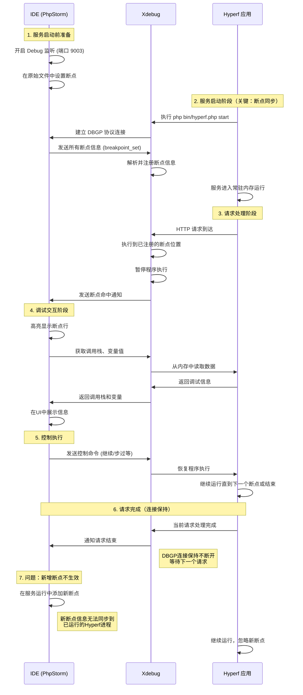

---
{"dg-publish":true,"permalink":"/Work/Script/PHP/Learn/Debug/","title":"Debug","tags":["flashcards"],"noteIcon":"","created":"2026-03-10T22:33:54.000+08:00","updated":"2026-03-24T17:47:21.234+08:00","dg-note-properties":{"title":"Debug","tags":["flashcards"],"reference linking":null}}
---

# Debug 的原理

## Xdebug 远程调试 Hyperf 原理
>核心原理是：**Xdebug (客户端)** 读取配置，**主动**连接到 **PhpStorm (服务器)** 监听的端口，实现 **逆向连接**。
### 远程调试环境的三个核心角色
#### 1. 调试器 (PhpStorm)
- **角色定位：** **服务器 (Server)**。IDE 充当 TCP 服务器，监听连接。
- **主要功能：** **监听**连接，**发送**指令（如“单步”、“继续”），**接收**程序数据（变量、堆栈），并处理**路径映射**。
#### 2. 调试扩展 (Xdebug)
- **角色定位：** **客户端 (Client)**。
- **主要功能：** **主动连接** IDE 端口，**暂停** PHP 脚本执行，**接收并执行** IDE 命令，收集运行时信息并**回传**给 IDE。
#### 3. 被调试程序 (Hyperf)
- **角色定位：** **承载者**。
- **主要功能：** 运行 PHP 脚本。其执行流程完全被加载的 **Xdebug 扩展**所控制和监视。
#### 时序图

这个过程的核心是 **DBGP (Debugger Protocol)**，一个专门为调试器通信设计的协议。Xdebug 和 PhpStorm 都遵循这个协议，所以它们能相互理解。
### 远程调试的 4 个关键步骤详解
#### 1. PhpStorm 开启监听 (IDE Server)
* **操作：** 在 PhpStorm 中点击 **“Start Listening for PHP Debug Connections”** (小电话图标)。
* **逻辑：** PhpStorm 成为一个 TCP 服务器，监听特定端口（默认 **9003** for Xdebug 3），等待 Xdebug 客户端连接。
#### 2. 建立连接 (Connection Setup)
* **操作：** 无需手动操作，由 Xdebug 自动进行。
* **逻辑：** Xdebug 读取配置中的 **`client_host`** (PhpStorm IP) 和 **`client_port`**，并向其发起 TCP 连接请求。
* **Hyperf/Docker/远程特点：** 必须确保 `client_host` 配置正确，保证网络可达性（可能需要 **SSH Tunnel** 或正确的 Docker/网络配置）。
#### 3. 断点同步与程序暂停 (Breakpoint and Halt)
* **握手：** 连接建立后，Xdebug 向 PhpStorm 发送 `init` 包。
* **断点传递：** PhpStorm 确认连接后，**立即**通过 TCP 连接将**所有**设置的**断点信息**（文件路径和行号）发送给 Xdebug。
* **路径映射：** PhpStorm 基于预设的 **Path Mapping**，匹配本地文件路径与服务器上的代码路径。
* **程序暂停：** Xdebug 接收断点并加载。程序执行流到达任何匹配的断点行时，**暂停执行**，并通过 TCP 通知 PhpStorm。
#### 4. Hyperf 进程触发 Xdebug (Client Trigger)
* **操作：** Hyperf 应用接收到 HTTP 请求，开始执行 PHP 代码。
* **逻辑：** Xdebug 检查配置 (`xdebug.mode=debug`, `xdebug.start_with_request=yes`) 或特定的触发器（如 `XDEBUG_SESSION` Cookie参数）。一旦条件满足，**调试会话启动**。
> **核心结论：** 断点数据是**从 PhpStorm 发送给 Xdebug 扩展**，通过网络连接实时同步，**而不是**由 Xdebug 记录在程序中。
## 关键技术点剖析
### 1. 断点 (Breakpoint) 是如何实现的？
断点不是魔法。在机器层面，CPU 只是忠实地一条接一条地执行指令。调试器要实现断点，通常有两种方式：
*   **软件断点 (Software Breakpoint)**：这是最常用的方式。调试器会**将被调试程序中断点位置的机器指令临时替换为一个特殊的“陷阱指令”**（例如 `INT 3` 在 x86 架构上）。当 CPU 执行到这条陷阱指令时，会触发一个中断，操作系统会将这个中断信号传递给调试扩展，扩展再通知调试器：“你的断点到了！”。调试器在向你展示完状态后，会悄悄地把原来的指令换回去，执行一步，再换回陷阱指令，为下一次命中做准备。
*   **硬件断点 (Hardware Breakpoint)**：利用 CPU 提供的调试寄存器。可以设置当 CPU 访问某个特定的内存地址（读或写）时触发断点。这在调试内存被意外修改的问题时非常有用，但数量有限。
### 2. 如何获取变量和调用栈？
*   **变量**：调试扩展（Xdebug）作为 PHP 的一个模块，可以直接访问 Zend 引擎的内存管理（Zend Memory Manager）。它知道所有符号表（Symbol Table）和变量的存储位置。当调试器请求变量值时，Xdebug 只需从内存中读取并通过 DBGP 协议发送即可。
*   **调用栈 (Call Stack)**：Zend 引擎在执行过程中维护着一个称为“执行上下文”的结构，其中包含了函数调用的层次关系。Xdebug 可以遍历这个结构，获取每一层调用的函数名、文件名、行号、参数等信息，从而构建出完整的调用栈。
## Hyperf (Swoole) 调试的特殊性
>**在 Hyperf 中，断点是在服务启动时一次性同步的，后续添加的新断点需要重启服务才能生效**。

Hyperf 基于 Swoole 运行在**常驻进程**中，导致与传统短生命周期 PHP (php-fpm) 环境有以下两点差异：
1.  **进程模式：** Xdebug 在 Hyperf 进程启动时即已加载，**不会**为每个请求重新加载。
2.  **触发方式：** 必须确保 Xdebug 能够被**每一次 HTTP 请求**正确触发。最稳定的方法是依赖 **`xdebug.mode=debug`** 和 **`xdebug.start_with_request=yes`**（或通过 HTTP 头/参数的 trigger 模式）。
#### 调试成功的两大关键配置：
1.  **网络连接：** 确保 **`client_host`** 配置正确，让 Hyperf 容器/服务器能够找到并连接到 PhpStorm 所在的 **宿主机 IP**。
2.  **路径映射：** 在 PhpStorm 中正确配置 **Path Mapping**，实现本地代码路径与远程 Hyperf 代码路径的精确匹配。
## 总结
Debug 的原理是：
1.  **协作**：调试器、调试扩展、被调试程序三者通过标准协议（DBGP）协作。
2.  **中断**：通过插入**陷阱指令**（软件断点）实现执行流的暂停。
3.  **检查**：调试扩展利用其内部权限，从运行时内存中**抽取状态信息**（变量、堆栈）并发送给调试器。
4.  **控制**：调试器通过协议命令**控制程序的执行流程**（继续、步过、步入）。
# Xdebug
## 自动分析和下载
### 1. 检测环境
Xdebug和当前使用的PHP环境版本有密切的关系，在下载时需要选择与之对应的版本。
在选择版本时可以借助Xdebug官方提供的一个检测工具来快捷地选择合适的版本。
在本地站点中新建一个后缀为.php 文件，在该文件中输入以下代码：
```php
echo phpinfo();
```

### 2. 分析版本信息
- 运行上面的.php 文件，文件结果如上图，全选复制该页面中的所有信息。
- 在浏览器中访问该链接 [Xdebug: Support — Tailored Installation Instructions](https://xdebug.org/wizard)，将之前复制的信息粘贴到下图所示的文本框中，然后单击红色方框中的按钮。

### 3. Xdebug官网会自动分析
提交的PHP 环境信息并给出下载链接，按照给出的提示信息进行下载即可。提示信息如下：

### 4. 验证成功
重新运行第一步中创建的.php 文件，如果返回信息中包含下图所示的xdebug相关信息，则说明安装成功。

## 编译安装
配置参考地址：[PhpStorm配置Xdebug(超详细)-CSDN博客](https://blog.csdn.net/m0_46641521/article/details/120107786)
下载：[Xdebug: Support — Tailored Installation Instructions](https://xdebug.org/wizard.php)
[xdebug-2.7.2.tgz](https://weichengjun2.dpdns.org/d/Attachment/xdebug-2.7.2.tgz?sign=qLLPUBUUjdzFxJ4rpy2oZ9DdrGpl-IPvqyUF8fnIdas=:0)
[xdebug-3.0.3.tgz](https://weichengjun2.dpdns.org/d/Attachment/xdebug-3.0.3.tgz?sign=aGPJRluAHI-Ke22urGCESxMwkSxdu8Uj6iCsrcNodng=:0)
### 1、解压编译安装
```shell
tar -xvzf xdebug-3.0.3.tgz
cd xdebug-3.0.3
phpize
./configure
make -j 4
cp modules/xdebug.so /usr/local/php/lib/php/extensions/no-debug-zts-20170718
```
### 2、添加扩展
```shell
php --ini
# Configuration File (php.ini) Path: /usr/local/php
# Loaded Configuration File:         /usr/local/php/php.ini
# Scan for additional .ini files in: (none)
# Additional .ini files parsed:      (none)
zend_extension=xdebug.so
```
### 3.重启php-fpm服务
```shell
service php-fpm restart
```
## 配置
### Xdebug 常用配置
```bash
;;;;;;;;;;;;;;;;;;;;;;;;;;
; Xdebug 常用配置 (v3.x) ;
;;;;;;;;;;;;;;;;;;;;;;;;;;

;================================
; 核心配置
;================================

; 指定 Xdebug 扩展文件的路径
; 在 Linux/macOS 上通常是 .so 文件，Windows 上是 .dll 文件
; 确保这是你环境中唯一启用的 zend_extension
zend_extension=xdebug

;================================
; 功能模式 (Mode)
;================================

; Xdebug 3 的核心变化：使用 xdebug.mode 来启用不同功能，可组合使用（用逗号分隔）
; off: 禁用所有 Xdebug 功能，性能影响最小。生产环境建议设为 off。
; develop: 开启开发者辅助功能，例如美化 var_dump 输出、显示更多错误信息。
; debug: 开启著名的“单步调试”功能，可以连接 IDE 进行断点调试。
; profile: 开启性能分析，用于生成性能报告文件，分析代码瓶颈。
; trace: 开启函数调用追踪，记录每个函数调用的详细信息（参数、返回值等）。
; gcstats: 开启垃圾回收统计信息收集。
;
; 示例：
; xdebug.mode=off                   ; 生产环境推荐
; xdebug.mode=develop               ; 仅开启开发者辅助
; xdebug.mode=debug                 ; 仅开启单步调试
xdebug.mode=develop,debug           ; 同时开启开发者辅助和单步调试

;================================
; 触发器 (Trigger)
;================================

; 控制 Xdebug 功能何时被激活。
; no (默认值): 功能始终关闭（除非 mode 设为 always on 的模式）。
; yes: 对于每个请求都自动启动相应模式（例如，每次请求都尝试连接 IDE 或生成性能报告）。这会对性能产生较大影响。
; trigger: 推荐值。通过特定的请求参数、Cookie 或环境变量来按需触发。
xdebug.start_with_request = trigger

; 当 start_with_request 设置为 trigger 时，用于触发功能的特定值。
; 如果为空，任何值都可以触发。如果设置了值，则触发值必须匹配。然后通过在请求中「GET、POST、COOKIE 任选其一」添加 `XDEBUG_TRIGGER=PHPSTORM` 参数来触发。
xdebug.trigger_value = "PHPSTORM"

;================================
; 远程调试/单步调试 (Debug Mode)
;================================

; IDE (客户端) 所在的主机 IP 地址。
; 对于本地开发环境（IDE 和服务都在本机），通常是 127.0.0.1。
; 如果在 Docker 或虚拟机中运行 PHP，这里需要填写宿主机的 IP 地址。
; Xdebug 3+ 推荐使用 xdebug.discover_client_host = true 来自动发现。
xdebug.client_host = 127.0.0.1

; IDE 监听 Xdebug 连接的端口「Xdebug 3 默认为 9003，Xdebug 2 的默认端口是 9000」
; 确保你的 IDE 设置与此端口一致，且该端口未被防火墙或其它程序占用。
xdebug.client_port = 9003

; Xdebug 在发生错误或异常时是否自动尝试连接 IDE。
; yes: 当 PHP 抛出 Notice、Warning、Error 或 Exception 时，即使没有设置断点，也会暂停执行并连接 IDE。
; no: 仅在断点处暂停。
xdebug.start_upon_error = yes

; IDE 中设置的唯一标识 key，用于多用户调试或特定项目识别。
; 通常与 PhpStorm 等 IDE 中的配置保持一致。
; xdebug.idekey = "PHPSTORM"

;================================
; 性能分析 (Profile Mode)
;================================

; 性能分析文件的输出目录。
; PHP 进程必须对该目录有写入权限。
xdebug.output_dir = "/tmp/xdebug/profiling"

; 是否压缩
xdebug.use_compression = false

; 性能分析文件的命名格式。
; %c - crc32 of the current working directory
; %p - process ID (PID)
; %r - random number
; %s - script name
; %t - timestamp (seconds)
; %u - timestamp (microseconds)
; %H - $_SERVER['HTTP_HOST']
; %R - $_SERVER['REQUEST_URI']
; %% - literal '%'
; 推荐使用 %t 和 %p/r 组合以避免文件名冲突。
xdebug.profiler_output_name = "cachegrind.out.%t.%p"

;================================
; 函数追踪 (Trace Mode)
;================================

; 函数调用追踪文件的输出目录。
xdebug.trace_output_dir = "/tmp/xdebug/tracing"

; 追踪文件的命名格式，与 profiler_output_name 类似。
xdebug.trace_output_name = "trace.%t"

; 追踪文件的格式。
; 0: 人类可读的格式。
; 1: 计算机可读的格式。
; 2: HTML 格式。
xdebug.trace_format = 0

;================================
; 杂项
;================================

; 控制 var_dump() 输出的最大嵌套层级，-1 表示不限制。
xdebug.var_display_max_depth = 5

; 控制 var_dump() 输出数组和对象时显示的最大元素数量，-1 表示不限制。
xdebug.var_display_max_children = 256

; 控制 var_dump() 输出字符串的最大长度，-1 表示不限制。
xdebug.var_display_max_data = 1024
```
### php.ini 配置 xdebug
#### v2
```ini
[XDebug]
;开启远程调试
xdebug.remote_enable = 1
;约定的调试码，在phpstorm里面设定
xdebug.idekey = PHPSTORM
xdebug.remote_handler = "dbgp"
;宿主ip, Mac和Windows系统用host.docker.internal, 其他的用真实IP
xdebug.client_host = host.docker.internal
;IDE 监听 Xdebug 连接的端口「Xdebug 3 默认为 9003，Xdebug 2 的默认端口是 9000」
xdebug.client_port = 9000
;日志
xdebug.remote_log = /var/log/php/xdebug.log
```
#### v3
**这个是准确的**
```ini
[XDebug]
;开启远程调试
xdebug.mode=debug
xdebug.remote_handler = "dbgp"
;约定的调试码，在phpstorm里面设定
xdebug.idekey = PHPSTORM
;宿主ip, Mac和Windows系统用host.docker.internal, 其他的用真实IP
xdebug.client_host = host.docker.internal
;IDE 监听 Xdebug 连接的端口「Xdebug 3 默认为 9003，Xdebug 2 的默认端口是 9000」
xdebug.client_port = 9003
xdebug.remote_log = /var/log/php/xdebug.log
xdebug.start_with_request = trigger
xdebug.trigger_value = "PHPSTORM"
xdebug.output_dir = /var/log/php/profiling
xdebug.use_compression = false
xdebug.profiler_output_name = "cachegrind.out.%t.%p"

SERVER_ENV=develop

yaf.use_spl_autoload=1
```
# PhpStorm配置Xdebug
## 配置phpstorm

## 配置DBGp Proxy
### 直接连接模式 
**可以不用设置** Phpstorm 中的 DBGp Proxy 参数，适用于本地或同网段调试，它依赖于正确的 `xdebug.client_host` 和 `xdebug.client_port` 设置。
### DBGp 代理模式 
**需要设置** Phpstorm 中的 DBGp Proxy 参数，适用于复杂的跨网络调试场景，它依赖于正确的 `dbgp.remote_host` 和 `dbgp.remote_port` 设置。

## 配置Servers
在 “Settings” 对话框中，选择 “PHP” ----> “Servers” 选项，创建本地调试服务器，点击应用即可。操作步骤如下：
>host 需为被调试应用的 域名「IP」

## 断点测试
在项目中新建一个名为“test.php”的文件，单击代码视图行号的位置新增一个断点。在窗口右上角选择 “testDebug" 的调试配置，单击 “Start | Stop Listening for PHP Debug Connections” 按钮，如下图所示：


# Hyperf 的 PhpStorm 调试指南
对于 Hyperf 这种基于 Swoole 的常驻内存框架，传统的调试方式可能不太直接，但通过 Xdebug 或 Yasd，你可以在 PhpStorm 中高效地进行断点调试。
下面是一个对比表，帮助你快速了解两种调试方式的主要特点，以便选择最适合你的工具：

| 特性        | Xdebug (搭配 `hyperf-xdebug` 插件) | Yasd (Yet Another Swoole Debugger) |     |
| :-------- | :----------------------------- | :--------------------------------- | --- |
| **基本原理**  | 通过 Xdebug 扩展与 IDE 通信           | 专为 Swoole 环境设计的调试器                 |     |
| **性能影响**  | 对性能有较大影响，不建议在生产环境使用            | 相对 Xdebug 性能更好，对 Swoole 支持更佳       |     |
| **配置复杂度** | 中等，需安装插件并配置环境变量                | 稍复杂，需编译安装，并正确配置 `php.ini` 和包装脚本    |     |
| **主要优点**  | 配置相对直观，与传统 FPM 调试体验类似          | 更适应 Swoole 协程环境，调试常驻内存应用更合适        |     |
| **适用场景**  | 适合大多数调试场景，尤其是 HTTP 请求调试        | 适合深入调试 Swoole 协程、进程等复杂场景           |     |
## 使用 Xdebug（搭配 `hyperf/xdebug` 插件）
这是目前较为方便的一种方式，社区提供的插件简化了配置流程。
### 在 PhpStorm 中配置 Xdebug
1.  **设置 PHP 解释器**：
    *   打开 **File -> Settings -> Languages & Frameworks -> PHP**。
    *   确保选择了正确的 PHP 解释器（CLI Interpreter），该解释器应包含 Xdebug 扩展。

2.  **配置服务器（Server）**：
    *   进入 **Settings -> Languages & Frameworks -> PHP -> Servers**。
    *   点击 **"+"** 添加一个新服务器。
    *   Name：填写 `xdebug.php` 配置中的 `server_name`（例如 'Unnamed'）。
    *   Host：填写你的项目域名或 IP（如 `localhost` 或你的开发环境域名）。
    *   Port：通常是 `80` 或 `9501`（Hyperf 默认端口）。
    *   Debugger：选择 **Xdebug**。
    *   **非常重要**：勾选 **"Use path mappings"**，然后在下方将你的**项目本地路径**映射到服务器上的**绝对路径**（如果 Hyperf 运行在 Docker 或虚拟机中，这里的“服务器上的路径”指的是容器/虚拟机内的项目路径）。

3.  **开启调试监听**：
    *   点击 PhpStorm 右上角的 **"电话"图标 (Start Listening for PHP Debug Connections)"**，使其处于监听状态。
### 启动调试
在你的 Hyperf 项目根目录下，使用以下命令启动框架并开始调试：
```bash
php -dxdebug.mode=debug -dxdebug.start_with_request=yes bin/hyperf.php start
```
## 使用 Yasd 调试器
Yasd 是专为 Swoole 环境设计的调试器，在某些场景下可能比 Xdebug 更有优势。
### 步骤 1: 安环境检查与准备
1.  **安装 Boost 库** (Yasd 的依赖)：
    *   **macOS**: `brew install boost`
    *   **Ubuntu/Debian**: `sudo apt install libboost-all-dev`
    *   **CentOS/RHEL**: `sudo yum install boost boost-devel`

2.  **编译安装 Yasd**：
```bash
git clone https://github.com/swoole/yasd.git && cd yasd
phpize --clean && \
phpize && \
./configure && \
make clean && \
make -j 8 && \
make install
```
### 步骤 2: 配置 PHP 启用 `Yasd`
在你的 `php.ini` 中启用并配置 `Yasd`：
```ini
zend_extension="yasd.so" ; 或绝对路径 zend_extension=/path/to/yasd.so
yasd.debug_mode=remote ; 调试模式，目前支持`cmd`模式「yasd.debug_mode=cmd」 和`remote`模式。 
yasd.remote_host=127.0.0.1 ; `IDE`监听的`IP`。该配置只在`remote`模式下生效。
yasd.remote_port=9999      ; `IDE`监听的`Port`。该配置只在`remote`模式下生效。避免与 PHP-FPM 默认的 9000 冲突
yasd.open_extended_info=1 ; 开启这个配置项之后，默认会在执行`php`的时候添加`-e`选项，这样，就不需要每次执行脚本的时候，添加`-e`选项了：
```
验证扩展是否安装成功。
```bash
php --ri yasd
```
### 步骤 3: 在 PhpStorm 中配置 Yasd
1.  **配置 CLI 解释器**：
    *   进入 **Settings -> Languages & Frameworks -> PHP**。
    *   添加一个新的 CLI Interpreter (`+`)。
    *   如果你创建了包装脚本，**选择该脚本** (`~/bin/php_debug`)。否则，确保选择的 PHP 解释器已加载 Yasd 扩展。
    *   在 **"PHP -> Debug"** 设置中，将 **"Debug port"** 修改为与 `yasd.remote_port` 一致的端口（如 `9999`）。

2.  **配置服务器和路径映射**：
    *   此步骤与 Xdebug 配置中的 **步骤 4.2** 类似。
    *   **非常重要**：在 **Settings -> Languages & Frameworks -> PHP -> Servers** 中添加一个服务器，设置好 **Name**, **Host**, **Port**，并勾选 **"Use path mappings"** 正确映射项目路径。

3.  **开启调试监听**：
    *   点击 PhpStorm 右上角的 **"电话"图标 (Start Listening for PHP Debug Connections)"**。
### 步骤 4: 配置 Hyperf 并启动调试
#### Slow Start Framework  慢启动框架「hyperf」
使用 `yasd` 时，如果框架启动缓慢（大多数时候是因为框架正在扫描大量文件），您可以执行以下命令。
```bash
composer dump-autoload -o
```
然后修改以下配置 `config/config.php`：
- 设置为 true 时：框架会**缓存注解扫描结果**，加快应用启动速度，适合生产环境
- 设置为 false 时：每次启动都会**重新扫描注解**，适合开发环境以便及时反映代码变更
```php
'scan_cacheable' => env('SCAN_CACHEABLE', true)
```
#### 启动调试 Hyperf
使用 Yasd 启动你的 Hyperf 项目：
```bash
php -e bin/hyperf.php start
```
或者，如果你配置了包装脚本并为 PhpStorm 指定了该解释器，理论上可以直接在 PhpStorm 中点击 Debug 按钮来启动并调试。
现在，当访问你的应用或执行代码时，PhpStorm 就应该能在断点处停下来了。
## 💡 调试技巧与注意事项
*   **断点打在代理类上**：Hyperf 使用了依赖注入和 AOP，很多类会动态生成代理类。如果你的断点不生效，尝试**将断点打在生成的代理类上**，而不是原始类。
*   **路径映射是关键**：无论用 Xdebug 还是 Yasd，只要 Hyperf 运行环境与 PhpStorm 不在同一台机器（包括 Docker、虚拟机），**正确配置 "Use path mappings"** 是调试成功的关键，务必保证双方路径正确映射。
*   **调试完毕记得停止监听**：调试完成后，记得点击 PhpStorm 的 **"Stop Listening"** (电话图标上的红色方块)，否则可能会干扰正常的运行或下次调试。
*   **单元测试调试**：调试 Hyperf 的单元测试时，应使用 `vendor/bin/co-phpunit` 而不是普通的 `phpunit`。 在 **Settings -> Languages & Frameworks -> PHP -> Test Frameworks** 中配置 PHPUnit 时，指定 Path to phpunit.phar 为 `vendor/bin/co-phpunit`。
*   **耐心尝试**：Swoole 常驻内存模式下的调试可能会遇到各种情况，如果一种方式暂时不成功，可以换另一种方式尝试，或者检查环境变量、端口冲突等问题。
# Postman 使用xdebug
1. Cookie中加参数

```shell
XDEBUG_SESSION=PHPSTORM; Path=/; Domain=.dev-api-oa.yuzhua-test.com; Expires=Wed, 24 Nov 2021 03:43:02 GMT;
```
2. Header中加明文Cookie参数
xdebug
```json
[{"key":"Cookie","value":"XDEBUG_SESSION=PHPSTORM","description":"","type":"text","enabled":true}]
```

profile
```json
[{"key":"Cookie","value":"XDEBUG_SESSION=XDEBUG_PFOFILER","description":"","type":"text","enabled":true}]
```

trace
```json
[{"key":"Cookie","value":"XDEBUG_SESSION=XDEBUG_TRACE","description":"","type":"text","enabled":true}]
```
# Apifox 使用xdebug
在前置操作中添加如下代码
```js
// 需要修改的参数，不同端请求header
var cookie = pm.environment.get("cookie");
request.headers['Content-Type'] = "application/json";
request.headers.Cookie = "XDEBUG_SESSION=PHPSTORM";
Object.keys(request.headers).forEach(key => {
   postman.__execution.request.headers.members.push({key:key,value:request.headers[key]});
});
```