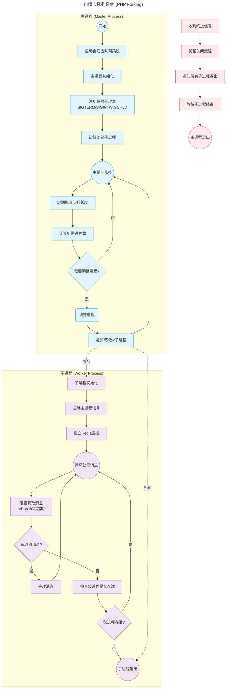

---
{"dg-publish":true,"permalink":"/Work/Script/PHP/Learn/Redis 队列消费自动伸缩/","title":"Redis 队列消费自动伸缩","tags":["flashcards"],"noteIcon":"","created":"2025-08-19T09:39:37.988+08:00","updated":"2026-03-24T17:47:47.833+08:00"}
---

### 设计思路
1. **主进程**：负责监控队列、管理子进程生命周期
2. **子进程**：实际处理Redis队列消息
3. **动态调整**：
   - 定期检查各队列长度
   - 为堆积队列增加子进程
   - 释放空闲进程资源
4. **进程通信**：使用信号控制子进程
#### 流程图

### 代码实现
#### 生产者
```php
class AdaptiveQueueProducer
{
    /**
     * 监听的队列列表
     * @var array|string[]
     */
    private array $queues = ['queue1', 'queue2', 'queue3'];
    /**
     * @var Redis
     */
    private Redis $redis;
    /**
     * @var string
     */
    private string $redisHost = 'host.docker.internal';
    /**
     * @var int
     */
    private int $redisPassword = 123456;

    public function __construct()
    {
        $this->redisConnection(); // 创建Redis连接
    }

    /**
     * 主进程入口
     * @return void
     */
    public function runMaster(): void
    {
        echo "开始添加消息...", PHP_EOL;
        foreach ($this->queues as $queue) {
            echo "正在处理队列: $queue", PHP_EOL;
            $randInt = rand(1, 100);
            for ($i = 0; $i < $randInt; $i++) {
                // 修正pipeline使用方式，添加exec()执行
                try {
                    $this->redis->pipeline()->lpush($queue, "Message $i")->exec();
                } catch (RedisException $e) {
                    echo "Redis操作失败: " . $e->getMessage(), PHP_EOL;
                }
            }
            echo "队列 $queue 处理完成", PHP_EOL;
        }

        echo "所有消息添加完成!", PHP_EOL;
    }

    /**
     * 创建Redis连接
     * @return void
     */
    protected function redisConnection(): void
    {
        try {
            $this->redis = new Redis();
            $this->redis->connect($this->redisHost, 6379);
            $this->redis->auth($this->redisPassword);
        } catch (RedisException $e) {
            echo "Redis连接失败: " . $e->getMessage(), PHP_EOL;
        }
    }
}

// 启动主进程
$consumer = new AdaptiveQueueProducer();
$consumer->runMaster();
```
#### 消费者
```php
/**
 * 动态队列消费者
 */
class AdaptiveQueueConsumer
{
    /**
     * 队列检查间隔(秒)
     */
    const int CHECK_INTERVAL = 5;
    /**
     * 单队列最大进程数
     */
    const int MAX_PROCESSES_PER_QUEUE = 10;
    /**
     * 单队列最小进程数
     */
    const int MIN_PROCESSES_PER_QUEUE = 1;
    /**
     * 每进程处理阈值(消息数)
     */
    const int PROCESS_THRESHOLD = 5;
    /**
     * 监听的队列列表
     * @var array|string[]
     */
    private array $queues = ['queue1', 'queue2', 'queue3'];
    /**
     * 子进程信息 [pid => [queue, start_time]]
     * @var array
     */
    private array $childProcesses = [];
    /**
     * @var Redis
     */
    private Redis $redis;
    /**
     * @var string
     */
    private string $redisHost = 'host.docker.internal';
    /**
     * @var int
     */
    private int $redisPassword = 123456;
    /**
     * @var int
     */
    private int $ppid = 0;

    /**
     * @throws RedisException
     */
    public function __construct()
    {
        $this->redisConnection(); // 创建Redis连接
        pcntl_async_signals(true); // 启用异步信号处理
    }

    /**
     * 主进程入口
     * @return mixed
     */
    public function runMaster(): mixed
    {
        // 注册信号处理器
        pcntl_signal(SIGTERM, [$this, 'shutdown']);      // 终止信号 (Terminate Signal)
        pcntl_signal(SIGINT, [$this, 'shutdown']);       // 中断信号 (Interrupt Signal)
        pcntl_signal(SIGCHLD, [$this, 'reapProcesses']); // 子进程停止信号 (Child Stop Signal)

        $this->ppid = getmypid();
        echo "Master process started. PID: $this->ppid", PHP_EOL;

        while (true) {
            // 调整工作进程
            $this->adjustWorkers();
            sleep(self::CHECK_INTERVAL);
        }
    }

    /**
     * 创建Redis连接
     * @return void
     * @throws RedisException
     */
    protected function redisConnection(): void
    {
        $this->redis = new Redis();
        $this->redis->connect($this->redisHost, 6379);
        $this->redis->auth($this->redisPassword);
    }

    /**
     * 动态调整工作进程
     * @return void
     * @throws RedisException
     */
    private function adjustWorkers(): void
    {
        echo "Ppid: $this->ppid", PHP_EOL;
        foreach ($this->queues as $queue) {
            $queueLength    = $this->redis->lLen($queue);
            $currentWorkers = $this->countWorkersForQueue($queue);
            echo "Queue: $queue, Length: $queueLength, Current Workers: $currentWorkers", PHP_EOL;
            // 计算需要的进程数
            $required = min(
                ceil($queueLength / self::PROCESS_THRESHOLD),
                self::MAX_PROCESSES_PER_QUEUE
            );

            $required = max($required, self::MIN_PROCESSES_PER_QUEUE);

            if ($required > $currentWorkers) {
                $this->startWorker($queue, $required - $currentWorkers);
            } elseif ($required < $currentWorkers) {
                $this->stopWorkers($queue, $currentWorkers - $required);
            }
        }
    }

    /**
     * 启动工作进程
     * @param string $queue
     * @param int    $count
     * @return void
     */
    private function startWorker(string $queue, int $count): void
    {
        for ($i = 0; $i < $count; $i++) {
            $pid = pcntl_fork();

            if ($pid == -1) {
                die("Could not fork");
            } elseif ($pid) { // 父进程
                $this->childProcesses[$pid] = [
                    'queue'      => $queue,
                    'start_time' => time(),
                ];
                echo "Started worker for $queue (PID: $pid)", PHP_EOL;
            } else { // 子进程
                $this->runWorker($queue);
            }
        }
    }

    /**
     * 工作进程执行逻辑
     * @param $queue
     */
    private function runWorker($queue): void
    {
        // 子进程忽略主进程信号
        pcntl_signal(SIGTERM, SIG_DFL);
        pcntl_signal(SIGINT, SIG_IGN);

        $workerPid = getmypid();
        echo "Worker $workerPid started for $queue", PHP_EOL;

        try {
            $this->redisConnection();
            while (true) {
                // 阻塞获取消息（30秒超时）
                $msg = $this->redis->brPop([$queue], 30);
                if ($msg) {
                    $this->processMessage($msg[1]); // 实际处理消息
                }

                // 检查父进程是否存活
                if (posix_getppid() == 1) {
                    exit(0); // 父进程已终止
                }
            }
        } catch (RedisException $e) {
            echo "Redis error: " . $e->getMessage(), PHP_EOL;
        }
    }

    /**
     * 停止指定数量的工作进程
     * @param $queue
     * @param $count
     * @return void
     */
    private function stopWorkers($queue, $count): void
    {
        $stopped = 0;
        foreach ($this->childProcesses as $pid => $info) {
            if ($info['queue'] === $queue && $stopped < $count) {
                posix_kill($pid, SIGTERM);
                unset($this->childProcesses[$pid]);
                $stopped++;
                echo "Stopping worker $pid for $queue", PHP_EOL;
            }
        }
    }

    /**
     * 回收子进程
     * @return void
     */
    public function reapProcesses(): void
    {
        while (($pid = pcntl_waitpid(-1, $status, WNOHANG)) > 0) {
            if ($pid > 0 && isset($this->childProcesses[$pid])) {
                $queue = $this->childProcesses[$pid]['queue'];
                unset($this->childProcesses[$pid]);
                echo "Worker $pid for $queue exited", PHP_EOL;
            }
        }
    }

    /**
     * 计算指定队列的工作进程数
     * @param $queue
     * @return int
     */
    private function countWorkersForQueue($queue): int
    {
        $count = 0;
        foreach ($this->childProcesses as $info) {
            if ($info['queue'] === $queue) {
                $count++;
            }
        }

        return $count;
    }

    /**
     * 处理消息（示例）
     * @param $message
     * @return void
     */
    private function processMessage($message): void
    {
        echo "Processing: $message", PHP_EOL;
        // 实际业务处理逻辑
        sleep(5); // 模拟处理耗时
    }

    /**
     * 优雅关闭
     * @return void
     */
    public function shutdown(): void
    {
        echo PHP_EOL . "Shutting down...", PHP_EOL;

        // 通知所有子进程退出
        foreach (array_keys($this->childProcesses) as $pid) {
            posix_kill($pid, SIGTERM);
        }

        // 等待子进程退出
        while (true) {
            $pid = pcntl_waitpid(0, $status);
            if ($pid === -1) {
                break;
            }
            echo "Worker $pid  exited", PHP_EOL;
        }
        exit(0);
    }
}

// 启动主进程
$consumer = new AdaptiveQueueConsumer();
$consumer->runMaster();
```
### 关键功能说明
1. **动态进程管理**
   - 每5秒检查队列长度
   - 计算理想进程数：`ceil(队列长度 / 处理阈值)`
   - 确保进程数在最小/最大值之间
   - 自动增减工作进程

2. **进程通信**
   - 主进程通过SIGTERM通知子进程退出
   - 子进程定期检查父进程是否存活
   - 使用pcntl_waitpid回收僵尸进程

3. **优雅退出**
   - 捕获SIGTERM/SIGINT信号
   - 通知所有子进程退出
   - 等待所有子进程结束后主进程退出

4. **消息处理**
   - 使用brPop阻塞获取消息
   - 30秒超时防止永久阻塞
   - 实际处理逻辑在processMessage中实现

### 使用方式
1. 保存为`consumer.php`
2. 添加可执行权限：`chmod +x consumer.php`
3. 启动：`./consumer.php`
4. 停止：`kill <master-pid>`
### 优化建议
1. **配置参数调整**
```php
// 根据实际需求调整
const PROCESS_THRESHOLD = 50;       // 每进程处理能力
const CHECK_INTERVAL = 10;          // 监控灵敏度
const MAX_PROCESSES_PER_QUEUE = 20; // 最大并发控制
```
2. **增加队列监控**
```php
private function adjustWorkers() {
   foreach ($this->queues as $queue) {
	   // 添加异常处理
	   try {
		   $queueLength = $this->redis->lLen($queue);
	   } catch (RedisException $e) {
		   // 处理Redis异常
		   continue;
	   }
	   // ...其余逻辑
   }
}
```
3. **进程健康检查**
```php
private function checkWorkerHealth() {
   foreach ($this->childProcesses as $pid => $info) {
	   // 检查运行时间过长的进程
	   if (time() - $info['start_time'] > 3600) {
		   posix_kill($pid, SIGTERM);
		   unset($this->childProcesses[$pid]);
		   $this->startWorker($info['queue'], 1);
	   }
   }
}
```
4. **平滑重启**
```php
public function reload() {
   // 通知所有子进程在处理完当前消息后退出
   foreach (array_keys($this->childProcesses) as $pid) {
	   posix_kill($pid, SIGHUP);
   }
   
   // 启动新版本进程
   $this->adjustWorkers();
}
```

这个实现提供了：
- 动态进程池管理
- 基于队列负载的自动缩放
- 优雅的进程生命周期管理
- 防止消息丢失的设计
- 简单的故障处理机制

可根据实际业务需求调整参数和处理逻辑，特别是`processMessage`中的具体业务实现。