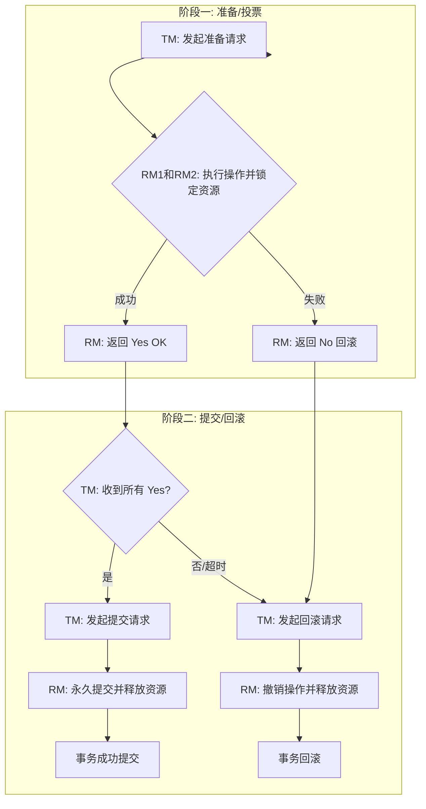
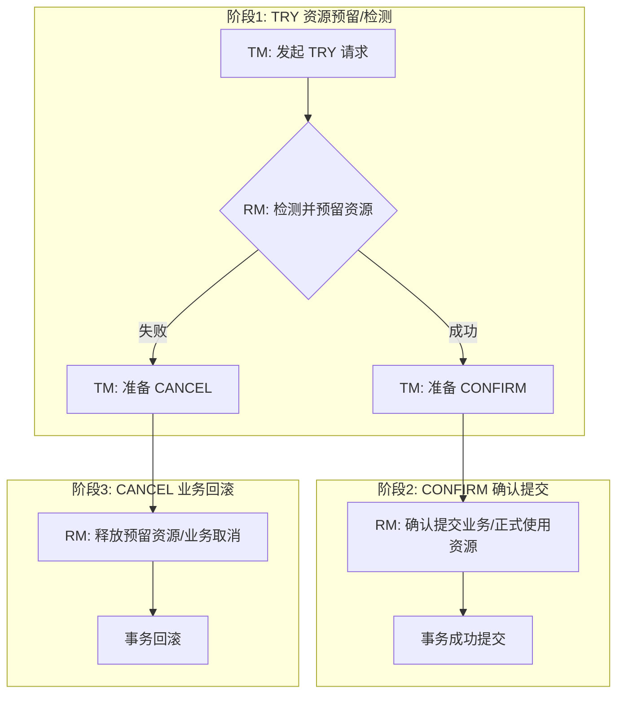
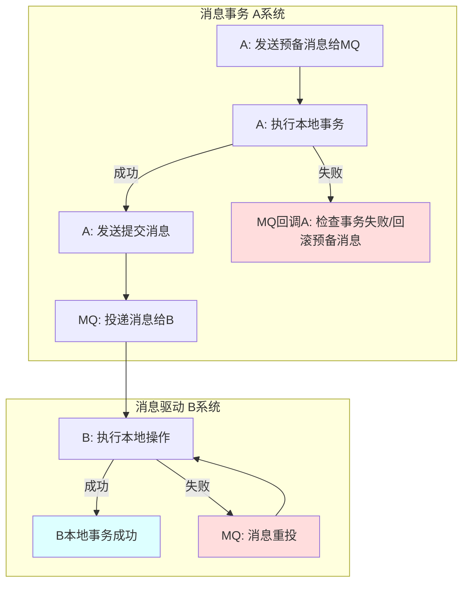
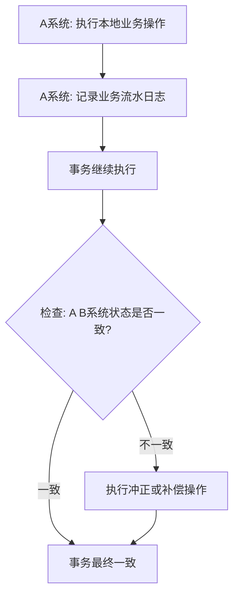
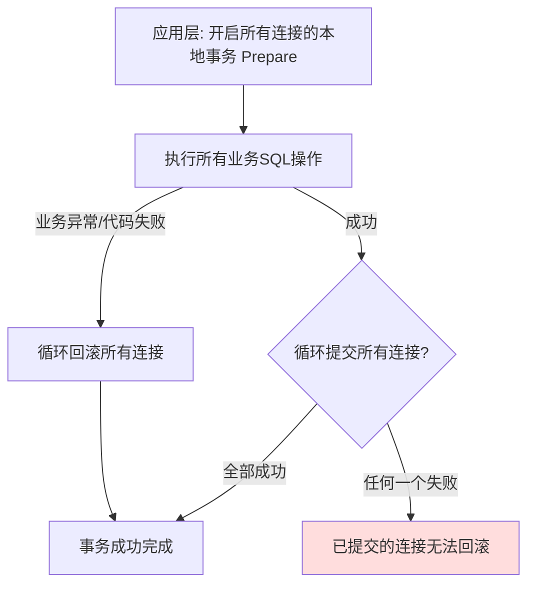

---
{"dg-publish":true,"permalink":"/Work/Script/PHP/Learn/分布式事务/","title":"分布式事务","tags":["flashcards"],"noteIcon":"","created":"2025-05-26T15:32:56.025+08:00","updated":"2026-03-24T17:46:59.981+08:00"}
---

Seata 分布式事务
[Home | DTM开源项目文档](https://dtm.pub/#star)
[Apache Seata](https://seata.apache.org/zh-cn/)
# 概念与场景
* **分布式事务**：一个事务涉及跨多台服务器、多个数据库或跨RPC调用（SOA化）的操作，需要保证这些操作要么**全部提交**，要么**全部回滚**，以确保数据一致性。
* **SOA化示例**：电商网站拆分为订单中心、用户中心、库存中心，每个中心有独立的数据库，操作订单和库存时就需要分布式事务。
* **事务对象**：本地事务处理的是单个数据库内部操作；**全局事务**处理的是分布式环境下的多个数据库操作。
# X/Open DTP 模型（1994）
该模型定义了分布式事务处理的四大组成部分：
* **AP** (Application)：应用程序。
* **TM** (Transaction Manager)：事务管理器（常见的如交易中间件）。
* **RM** (Resource Manager)：资源管理器（常见的如数据库）。
* **CRM** (Communication Resource Manager)：通信资源管理器（常见的如消息中间件）。
# 分布式事务的常见处理方案
| **方案**     | **英文全称/简称**                                                  | **一致性级别**         | **性能** | **原理与特点 / 优劣势**                                                                                                                                                       |
| ---------- | ------------------------------------------------------------ | ----------------- | ------ | --------------------------------------------------------------------------------------------------------------------------------------------------------------------- |
| **两段式提交**  | Two-Phase Commit<br>(2PC)<br>eXtended Architecture<br>(XA)   | **强一致性** (完全控制)   | 低      | **原理**：TM 通知 RM **准备**提交，全部 OK 后再通知实际 **提交**。<br>**优势**：一致性最高，协议简单，数据库厂商通常支持。<br>**劣势**：性能低，长时间锁定数据库资源，容易导致**阻塞**（悬挂），不适合高并发。                                         |
| **TCC**    | Try-Confirm-Cancel<br>(TCC)                                  | **强一致性** (完全控制)   | 中      | **原理**：2PC 变种，分为 **Try** (资源预留/检测)、**Confirm** (确认提交)、**Cancel** (业务取消)。<br>**优势**：通过**业务逻辑**实现**资源预留**，锁定**粒度小**，阻塞**时间短**，性能比 XA 高。<br>**劣势**：对业务代码有**强侵入性**，开发成本高。 |
| **消息事务**   | Transactional Message<br>**TM** <br>(或称为 **MQ Transaction**) | **最终一致性** (部分控制)  | 高      | **原理**：保证 A 系统**本地操作**和**发预备消息**的原子性，通过消息重投驱动 B 系统操作。<br>**优势**：将**同步事务变为异步**，**性能大幅提升**，适用于高并发。<br>**劣势**：牺牲了严格一致性，B 失败时需重试，若长期失败则一致性可能被破坏。                          |
| **补偿机制**   | Sagas<br>**SAGA** (通常将基于补偿的事务归类为 SAGA 模式)                    | **最终一致性** (不控制)   | 最高     | **原理**：先处理业务，使用定时任务或回调检查状态，不一致时执行**冲正操作**<br>**优势**：实现简单，**性能最高**，并发能力强。<br>**劣势**：对一致性要求不高的场景，需设计复杂的**冲正逻辑**，依赖业务流水日志。                                               |
| **伪二阶段提交** | Pseudo Two-Phase Commit (**Pseudo 2PC**)                     | **局部弱一致性** (依赖代码) | 中高     | **原理**：在应用层开启多个本地事务，执行完毕后循环提交或回滚。<br>**优势**：实现简单，可解决**代码运行期异常**导致的数据不一致。<br>**劣势**：**无法保证提交阶段的原子性**，一旦部分提交成功后发生故障，已提交的资源无法回滚，**不适合生产环境的关键分布式事务**。                     |
**说明：**
1. **2PC** 是协议名称，**XA** 是该协议在分布式事务处理模型 (DTP) 中的具体实现规范。
2. **SAGA** 是一种长事务模式，它通过执行一系列**补偿事务**来实现回滚，因此基于补偿的最终一致性方案通常被视为 SAGA 模式的一种实现。
## 两段式提交（2PC / XA）
XA 是 X/Open DTP 模型的具体实现规范，也是最经典、**一致性最强**的分布式事务方案。
### 核心原理
TM（事务管理器）协调所有的 RM（资源管理器，如数据库）完成一个全局事务，流程分为**两个必须统一行动的阶段**。

### 阶段 I：投票阶段（Prepare Phase）
1.  **准备请求（Vote Request）**：TM 向所有 RM 发送一个 **`准备`** 事务的指令，询问它们是否可以提交事务。
2.  **RM 锁定资源**：每个 RM 执行本地事务操作，将数据修改写入日志，并锁定所有涉及的资源，但**不提交**。
3.  **RM 投票响应（Vote Response）**：
    * 如果 RM 成功执行了所有操作并准备就绪，它返回 **`Yes`** (ok)。
    * 如果 RM 无法执行操作（例如资源不足），它返回 **`No`** (失败)。
### 阶段 II：决策阶段（Commit / Rollback Phase）
TM 根据所有 RM 的投票结果做出最终决策：
#### A. 提交分支（Commit）
1.  **前提**：当且仅当 TM 收到了**所有** RM 的 `Yes` 投票。
2.  **提交请求**：TM 向所有 RM 发送 **`提交`** 事务的指令。
3.  **RM 执行提交**：RM 释放锁定的资源，并最终完成提交。
4.  **提交确认**：RM 向 TM 返回 `Commit Complete` 消息。
#### B. 回滚分支（Rollback）
1.  **前提**：只要有**任一** RM 返回了 `No` 投票，或者 TM 在等待过程中**超时**。
2.  **回滚请求**：TM 向所有 RM 发送 **`回滚`** 事务的指令。
3.  **RM 执行回滚**：RM 根据日志撤销事务操作，释放锁定的资源。
4.  **回滚确认**：RM 向 TM 返回 `Rollback Complete` 消息。
### 优缺点
* **优点**：实现了**最高的强一致性**，协议简单，通常数据库厂商会提供支持。
* **缺点**：
    * **性能差**：存在反复协商过程，且锁定的资源时间长，不适合高并发。
    * **阻塞问题**：在准备阶段，如果 TM 或某个 RM 宕机，其他 RM 将一直持有资源锁并处于阻塞状态，直到恢复。
    * **数据不一致风险**：MySQL 的 XA 实现没有记录 `prepare` 阶段日志，主备切换可能导致数据不一致。
### 示例
**银行跨行转账**，XA 最常用于对数据一致性要求极高、且并发量相对可控的金融或传统企业级应用。

| 步骤 | 事务管理器 (TM) / 协调者 | 银行 A (RM1) | 银行 B (RM2) | 状态 |
| :--- | :--- | :--- | :--- | :--- |
| **阶段 1 (准备)** | TM 发起 Prepare 请求 | 检查账户是否有足够余额。**锁定账户 A 的余额行**，写入 Prepare Log。回复 "OK"。 | 检查账户是否有效。**锁定账户 B 的余额行**，写入 Prepare Log。回复 "OK"。 | **资源被锁定。** 其他业务无法操作这两个账户。 |
| **阶段 2 (提交)** | 收到所有 "OK"，TM 发起 Commit 请求 | **正式扣减**账户 A 余额。释放行锁。回复 "Commit Complete"。 | **正式增加**账户 B 余额。释放行锁。回复 "Commit Complete"。 | **事务成功。** 两个账户的变动同时生效。 |
| **失败示例** | 收到 "OK" 和 "No"，TM 发起 Rollback 请求 | 收到 Rollback，撤销扣减操作。释放行锁。 | 收到 Rollback，撤销增加操作。释放行锁。 | **事务回滚。** 只要有一个 RM 失败，所有操作都撤销。 |
> **关键点：** 依赖数据库的**强行锁**来保证 Prepare 阶段的隔离性，锁定时间是最大的性能瓶颈。
```php
// 伪代码：假设 $dbA 和 $dbB 是支持 XA 的数据库连接对象
/**
 * 模拟 XA 事务协调器的主流程
 * @param PDO $dbA
 * @param PDO $dbB
 */
function distributeXaTransaction(PDO $dbA, PDO $dbB)
{
    $xid = 'trx-' . uniqid(); // 全局事务 ID
    try {
        // --- 阶段一：准备 (Prepare) ---
        echo "TM: Phase 1 - Preparing...\n";
        // 1. A 参与者准备
        $dbA->exec("XA START '{$xid}A'");
        $dbA->exec("UPDATE accounts SET balance = balance - 100 WHERE id = 1"); // 本地操作
        $dbA->exec("XA END '{$xid}A'");
        $dbA->exec("XA PREPARE '{$xid}A'");
        // 2. B 参与者准备
        $dbB->exec("XA START '{$xid}B'");
        $dbB->exec("UPDATE accounts SET balance = balance + 100 WHERE id = 2"); // 本地操作
        $dbB->exec("XA END '{$xid}B'");
        $dbB->exec("XA PREPARE '{$xid}B'");
        // --- 阶段二：提交 (Commit) ---
        echo "TM: Phase 2 - Committing...\n";
        // 3. A 提交
        $dbA->exec("XA COMMIT '{$xid}A'");
        // 4. B 提交
        $dbB->exec("XA COMMIT '{$xid}B'");
        echo "TM: Transaction successfully committed.\n";
    } catch (Exception $e) {
        // --- 阶段二：回滚 (Rollback) ---
        echo "TM: An error occurred, attempting rollback...\n";
        // 回滚操作 (XA ROLLBACK 即使在 PREPARE 失败后也可以调用)
        $dbA->exec("XA ROLLBACK '{$xid}A'");
        $dbB->exec("XA ROLLBACK '{$xid}B'");
        echo "TM: Transaction rolled back.\n";
        throw $e;
    }
}
// 实际运行需要配置支持 XA 的 PDO 实例
distributeXaTransaction($pdoA, $pdoB);
```
## TCC (Try, Confirm, Cancel)
TCC 是两段式提交的一个变种，它将 2PC 的准备和提交/回滚操作提升到**业务层面**来实现，而不是依赖数据库的 XA 协议。

### 流程阶段
TCC 将一个分布式事务拆分为三个阶段：
#### 1. Try 阶段 (资源预留)
* **目标**：对业务系统做检测，并**预留**所需的资源。
* **操作**：检查业务逻辑是否满足执行条件，并对即将使用的资源进行锁定或冻结（例如，冻结库存数量，但未真正扣减）。
#### 2. Confirm 阶段 (确认提交)
* **目标**：对业务进行确认提交，真正执行业务。
* **操作**：执行真正的业务操作（例如，正式扣减预留的库存）。
* **幂等性**：该阶段必须保证**幂等性**，即重复执行不产生副作用。
* **特性**：**假定 Confirm 阶段一定成功**（前提是 Try 阶段成功）。
#### 3. Cancel 阶段 (业务取消)
* **目标**：在 Try 阶段失败或超时时，回滚业务，释放预留资源。
* **操作**：取消 Try 阶段预留的所有资源（例如，解冻库存）。
* **幂等性**：该阶段也必须保证**幂等性**。
### 优缺点
* **优点**：不在数据库层面阻塞资源，**锁定粒度由业务决定**，性能比 XA 高，能够实现强一致性。
* **缺点**：对业务代码侵入性极强，需要为每个业务实现 Try、Confirm、Cancel 三套逻辑，开发成本高。
### 示例
**电商网站的积分兑换**，TCC 适用于需**要强一致性**，但**又要求高并发**的场景，例如积分兑换或秒杀。

| 阶段               | 事务协调者                      | 积分服务 (RM1)                                                               | 奖品服务 (RM2)                                                                 | 状态                                 |
| :--------------- | :------------------------- | :----------------------------------------------------------------------- | :------------------------------------------------------------------------- | :--------------------------------- |
| **Try (预留)**     | TM 发起 Try 请求               | 1. **检查**用户积分是否足够。<br>2. **冻结**所需积分（如将积分从 `可用积分` 转移到 `冻结积分` 字段）。回复 "OK"。 | 1. **检查**奖品库存是否足够。<br>2. **预留**一个库存单位（如将库存从 `可用库存` 转移到 `冻结库存` 字段）。回复 "OK"。 | **资源被逻辑锁定。** Try 快速完成，未长时间独占数据库行锁。 |
| **Confirm (提交)** | 收到所有 "OK"，TM 发起 Confirm 请求 | **正式扣减** `冻结积分`。                                                         | **正式扣减** `冻结库存`。                                                           | **事务成功。** 兑换完成。                    |
| **Cancel (回滚)**  | 收到 "No"，TM 发起 Cancel 请求    | **释放冻结**：将 `冻结积分` 退回到 `可用积分`。                                            | **释放预留**：将 `冻结库存` 退回到 `可用库存`。                                              | **事务回滚。** 积分和库存恢复原状。               |
> **关键点：** 使用**冻结/预留**的业务逻辑操作取代数据库行锁，大大提高了并发性。
```php
// 假设我们有一个资金服务类 (Service B)
class FundingService
{
    /**
     * TCC Try: 检查账户并冻结金额
     */
    public function tryFreezeFunds($userId, $amount, $transactionId)
    {
        // 伪代码：检查余额是否足够
        if ($this->getAvailableBalance($userId) < $amount) {
            throw new Exception("Balance not sufficient for freezing.");
        }
        // 伪代码：将 $amount 从可用余额转移到冻结余额
        $this->database->table('user_funds')->where('user_id', $userId)
            ->update(['available' => DB::raw("available - {$amount}"), 'frozen' => DB::raw("frozen + {$amount}")]);
        // 记录冻结日志
        $this->logTransactionState($transactionId, 'FROZEN');
        return true;
    }
    
    /**
     * TCC Confirm: 确认扣款（资源预留成功，正式提交）
     */
    public function confirmFunds($userId, $amount, $transactionId)
    {
        // 伪代码：确认扣款，将金额从冻结余额中扣除 (不需要再次检查余额)
        $this->database->table('user_funds')->where('user_id', $userId)
             ->update(['frozen' => DB::raw("frozen - {$amount}"), 'spent' => DB::raw("spent + {$amount}")]);
             
        $this->logTransactionState($transactionId, 'COMMITTED');
        
        return true;
    }
    
    /**
     * TCC Cancel: 取消操作（资源预留失败，释放资源）
     */
    public function cancelFunds($userId, $amount, $transactionId)
    {
        // 伪代码：释放冻结金额，将金额从冻结余额退回可用余额
        $this->database->table('user_funds')->where('user_id', $userId)
             ->update(['available' => DB::raw("available + {$amount}"), 'frozen' => DB::raw("frozen - {$amount}")]);
             
        $this->logTransactionState($transactionId, 'CANCELLED');
        
        return true;
    }
}

// --- 事务协调器伪代码 ---
try {
    // Phase 1: Try
    $resultA = $inventoryService->tryReserveStock($xid);
    $resultB = $fundingService->tryFreezeFunds($xid);
    
    if ($resultA && $resultB) {
        // Phase 2: Confirm
        $inventoryService->confirmStock($xid);
        $fundingService->confirmFunds($xid);
    } else {
        // Phase 2: Cancel
        $inventoryService->cancelStock($xid);
        $fundingService->cancelFunds($xid);
    }
} catch (Exception $e) {
    // 异常情况下，TM 触发全局 Cancel
    $inventoryService->cancelStock($xid);
    $fundingService->cancelFunds($xid);
}
```
## 消息事务(TM)
### 核心原理
基于消息中间件的两阶段提交，将一个全局事务拆分为一个**消息事务**（A 系统本地操作 + 发消息）和若干**消息驱动的本地事务**（B 系统操作）。
它保证了 A 系统的本地操作和消息发送的原子性。

### 流程细节
假设 A 系统操作成功后，需要通知 B 系统执行操作。
1.  **A 发送预备消息**：A 系统向消息中间件发送一条 **预备消息**（半消息/待确认消息）。
2.  **消息中间件保存**：消息中间件保存预备消息，但**不对外投递**，返回成功。
3.  **A 执行本地事务**：A 系统执行自身的本地数据库操作。
4.  **A 发送提交消息**：如果本地事务成功，A 系统向消息中间件发送 **提交** 消息。
### 容错机制
| 失败步骤                   | 影响              | 解决方案                                            |
| :--------------------- | :-------------- | :---------------------------------------------- |
| **步骤 1 或 2 失败**        | 事务失败            | 不会执行 A 的本地操作，全局事务失败。                            |
| **步骤 3 失败** (A 本地事务失败) | A 事务失败，消息待定     | 消息中间件会不断回调 A 系统的接口（检查器），发现 A 事务失败，则**回滚预备消息**。  |
| **步骤 4 失败** (提交消息失败)   | A 本地事务成功，但消息未提交 | 消息中间件通过回调 A 系统的接口，发现 A 事务已经成功，则**自动提交消息**，完成事务。 |
### 最终一致性实现
* 一旦消息事务成功，A 操作成功，消息也确定发出。
* B 系统收到消息后，执行自身的本地操作。
* 如果 B 操作失败，消息中间件会**重投**消息，直到 B 成功为止。
* 这样，A 和 B 最终会达成一致，但不是严格同步一致。
### 优缺点
* **优点**：高并发场景下的首选方案，性能大幅提升。实现了 A 系统操作和通知 B 系统的可靠性（原子性）。
* **缺点**：属于**最终一致性**。如果 B 系统**一直执行不成功（需要重试机制和人工干预）**，一致性会被破坏。对消息中间件有高度依赖。
### 示例
**下订单与发货通知**，适用于对实时一致性要求不高，但要求高吞吐量的场景。

| 阶段 | 订单系统 (A系统) | 消息中间件 (MQ) | 物流系统 (B系统) | 状态 |
| :--- | :--- | :--- | :--- | :--- |
| **消息预处理** | 1. A 向 MQ 发送**预备消息** (半消息)。 | 2. MQ 保存消息，回复成功。 | - | **消息待定。** A 系统可以继续。 |
| **本地事务** | 3. A **创建订单**，并扣减库存（本地事务）。 | - | - | **A 完成。** 订单创建成功。 |
| **消息提交** | 4. A **发送提交消息**给 MQ。 | MQ 将预备消息转为**正式消息**，并投递给 B。 | - | **A 事务完成。** |
| **消息驱动** | - | - | B 收到消息后，**开始创建物流单**（B 的本地事务）。 | **B 驱动。** 如果 B 失败，MQ 会重试投递。 |
> **关键点：** 牺牲了实时强一致性，换取了 A 和 B 系统的**解耦**和**高性能**。A 只需要保证自己的操作和发消息成功，B 会最终成功（除非一直失败）。

RabbitMQ 本身没有像 RocketMQ 那样内置的“事务消息”（半消息/回查机制），但它可以通过结合 **本地事务** 和 **发布者确认（Publisher Confirms）** 机制来实现消息发送的可靠性，进而实现消息事务 + 最终一致性的效果。
#### 核心思想：
1. **先本地事务**：在本地数据库中创建一条**待发送消息记录**，并与业务操作放在同一个本地事务中。
2. **后发消息**：本地事务提交成功后，发送消息到 RabbitMQ。
3. **确认机制**：使用 RabbitMQ 的 **Publisher Confirms** 确保消息被 Broker 接收。
4. **异步清理**：使用定时任务或回调机制，清理已确认发送的消息记录。
```php
// 伪代码：假设 $amqpConnection 是 RabbitMQ 连接对象，DB 是数据库操作对象
class OrderProcessor
{
    /**
     * 业务主流程：创建订单并发送通知消息
     */
    public function processOrderAndNotify($userId, $productId, $amount, $amqpConnection)
    {
        $orderId = uniqid('order-');
        $queueName = 'order_notification_q';
        // -----------------------------------------------------
        // 阶段 1: 本地事务 (保证订单创建与消息记录原子性)
        // -----------------------------------------------------
        try {
            DB::beginTransaction();
            // 1. A 系统执行本地核心业务：创建订单
            DB::table('orders')->insert(['id' => $orderId, 'user_id' => $userId, 'status' => 'CREATED']);
            // 2. 记录待发送消息（“本地消息表”）
            $messageData = json_encode(['order_id' => $orderId, 'action' => 'ORDER_CREATED']);
            DB::table('local_messages')->insert([
                'order_id' => $orderId,
                'body' => $messageData,
                'status' => 'PENDING'
            ]);
            DB::commit();
            // -----------------------------------------------------
            // 阶段 2: 发送消息到 RabbitMQ 并等待确认
            // -----------------------------------------------------
            // 3. 本地事务成功后，发送消息
            $this->publishMessageWithConfirmation($amqpConnection, $queueName, $messageData);
            // 4. 更新本地消息表状态
            DB::table('local_messages')->where('order_id', $orderId)->update(['status' => 'SENT']);
            echo "Order {$orderId} created and notification sent successfully.\n";
        } catch (Exception $e) {
            DB::rollBack();
            echo "Transaction failed: {$e->getMessage()}\n";
            // 异常退出，此时本地消息表仍存在 'PENDING' 记录
            throw $e;
        }
    }

    /**
     * 使用 Publisher Confirms 机制发送消息
     */
    private function publishMessageWithConfirmation($connection, $queue, $body)
    {
        // 伪代码：获取通道并开启确认模式
        $channel = $connection->channel();
        $channel->confirm_select();
        $msg = new AMQPMessage($body); // 假设 AMQPMessage 是 RabbitMQ 客户端的消息对象
        // 发送消息
        $channel->basic_publish($msg, '', $queue);
        // 等待 Broker 确认消息
        $channel->wait_for_pending_acks();
        // 实际上，Publisher Confirms 的回调逻辑更复杂，这里简化为等待。
        // 如果等待超时或收到Nack，则抛出异常，触发主流程中的 catch。
    }
}
// -----------------------------------------------------
// 阶段 3: 异步兜底 (定时任务)
// -----------------------------------------------------
/**
 * 定时任务：检查并重发失败的消息
 */
function messageResenderTask($amqpConnection)
{
    // 检查所有状态为 'PENDING' 或发送失败的消息
    $failedMessages = DB::table('local_messages')->whereIn('status', ['PENDING', 'FAILED'])->get();

    foreach ($failedMessages as $msg) {
        try {
            // 再次尝试发送消息
            $this->publishMessageWithConfirmation($amqpConnection, 'order_notification_q', $msg->body);

            // 发送成功后更新状态
            DB::table('local_messages')->where('id', $msg->id)->update(['status' => 'SENT']);

        } catch (Exception $e) {
            // 再次失败，记录日志，下次重试
            DB::table('local_messages')->where('id', $msg->id)->update(['status' => 'FAILED']);
        }
    }
}
// -----------------------------------------------------
// 阶段 4: 消费者 (B 系统)
// -----------------------------------------------------
// 消费者逻辑与 RocketMQ 类似，收到消息后执行本地事务，如果失败，则依赖 RabbitMQ 的重试机制 (Nack/Reject)。
function orderConsumer($msg)
{
    try {
        $data = json_decode($msg->body);

        DB::beginTransaction();
        // B 系统执行本地操作 (如：通知物流系统)
        $this->logisticsService->createShippingOrder($data->order_id);
        DB::commit();

        $msg->ack(); // 确认消息，MQ 删除
    } catch (Exception $e) {
        DB::rollBack();
        $msg->reject(true); // 拒绝消息并要求重回队列，MQ 将重试
    }
}
```
## 补偿机制(SAGA)
### 核心原理
**先完成业务，再检查一致性，不一致时通过逆向操作进行修正。** 它牺牲了严格的实时一致性，换取高可用性和高性能，属于最终一致性方案。

### 流程细节
1.  **执行业务**：A 系统先执行本地操作，可能涉及更新数据库。
2.  **记录流水**：在执行业务的同时，详细记录业务流水日志，这是**执行补偿的关键**。
3.  **不显式控制**：不立即进行跨系统的事务控制。
4.  **一致性检查**：
    * 使用**定时任务**或**回调方法**定期检查所有相关系统的状态是否一致（例如，检查订单状态和库存状态是否匹配）。
5.  **补偿/冲正**：
    * 如果发现状态不一致，根据记录的流水日志，采用预定的策略（如冲正操作），强制状态到达某个结束状态（通常是失败状态），以消除不一致性。
6.  **人工介入**：对于复杂的错误，可能需要通过人工干预来完成最终一致性。
### 优缺点
* **优点**：实现简单、效率高、性能好，并发能力强。
* **缺点**：属于最终一致性，不适合对一致性要求极高的场景（如银行转账）。对业务侵入性强，需要设计复杂的冲正逻辑。
### 示例
**充值卡充值到游戏账户**，适用于业务允许先做后补救的场景。

| 步骤        | 充值服务 (A系统)                                          | 定时任务 / 监控系统                                    | 游戏账户 (B系统)                    | 状态                            |
| :-------- | :-------------------------------------------------- | :--------------------------------------------- | :---------------------------- | :---------------------------- |
| **先执行业务** | 1. A 扣减充值卡余额，并**标记**充值已处理。<br>2. A **记录**详细的充值流水日志。 | -                                              | A 尝试调用 B 的接口进行充值，但假设**调用失败**。 | **不一致状态。** 充值卡已扣，但游戏账户未到账。    |
| **事后检查**  | -                                                   | **定时任务**启动，检查 A 系统的充值流水日志和 B 系统的账户状态。          | -                             | **触发检查。** 发现流水 A 成功，但账户 B 失败。 |
| **执行补偿**  | -                                                   | **执行冲正操作**：根据流水日志，发起对 B 系统的重试充值，或者将充值卡余额退回给用户。 | B 收到重试请求，**成功增加余额**。          | **最终一致。** 状态被强制同步。            |
> **关键点：** 流程不涉及分布式锁，效率最高。通过**流水日志**和**事后修正**来保证最终的一致性。
```php
// 假设 OrderService 负责订单创建，PaymentService 负责扣款
class OrderService
{
    /**
     * 业务主流程：创建订单，并尝试扣款
     */
    public function processOrder($orderData)
    {
        $orderId = uniqid('order-');
        // 1. 本地事务：创建订单，状态为 PENDING
        DB::table('orders')->insert(['id' => $orderId, 'status' => 'PENDING']);
        $this->logTransaction('Order Created', $orderId, 'A_SUCCESS'); // 记录流水
        try {
            // 2. 尝试远程调用扣款服务
            $paymentResult = $this->paymentService->deductFunds($orderId, $orderData['amount']);
            if ($paymentResult) {
                // 3. 扣款成功，更新订单状态
                DB::table('orders')->where('id', $orderId)->update(['status' => 'COMPLETED']);
            } else {
                // 扣款失败，需要补偿订单
                $this->compensateOrderCreation($orderId);
            }
        } catch (Exception $e) {
            // 远程调用失败，触发补偿
            $this->compensateOrderCreation($orderId);
        }
    }
    
    /**
     * 补偿操作：撤销订单创建
     */
    private function compensateOrderCreation($orderId)
    {
        echo "Compensation triggered for Order: {$orderId}\n";
        // 1. 更新订单状态为 CANCELLED
        DB::table('orders')->where('id', $orderId)->update(['status' => 'CANCELLED']);
        $this->logTransaction('Order Cancelled', $orderId, 'A_COMPENSATED');
        // 2. 补偿所有前置成功操作（如果有）
        // ... 通知库存服务，释放已扣减的库存 (如果 OrderService 做了预扣)
    }
}

// --- 定时任务伪代码 ---
// 定时任务每天运行，检查所有状态异常的订单
function checkAndRepairOrders()
{
    $pendingOrders = DB::table('orders')->where('status', 'PENDING')->get();
    
    foreach ($pendingOrders as $order) {
        $paymentStatus = $this->paymentService->checkPaymentStatus($order->id);
        
        if ($paymentStatus === 'FAILED') {
            // 发现 A 成功，B 失败，则对 A 进行冲正
            $this->orderService->compensateOrderCreation($order->id); 
        }
    }
}
```
## 伪二阶段提交 (Pseudo 2PC)
### 核心原理
**在应用层管理多个数据库的本地事务。** 它模仿了标准 2PC 的 `Prepare` 和 `Commit/Rollback` 阶段，但在 `Commit` 阶段缺乏原子性保证，**无法处理提交时的局部故障**。它适用于简化单个进程内、对高可靠性要求不高的多数据库操作。


### 流程细节
1.  **Prepare 模仿**：应用程序获取所有需要参与的数据库连接，并循环调用 `BEGIN TRANSACTION` 或 `beginTransaction()` 方法。
2.  **业务执行**：在事务开启后，执行所有的跨数据库业务操作（如在 DB1 上扣款，在 DB2 上增加记录）。
3.  **提交/回滚决策**：
      * **Rollback**：如果在执行业务操作或代码逻辑中发生异常 (`catch \Throwable`)，应用程序会立即循环调用 `ROLLBACK`，撤销所有连接上的操作。
      * **Commit (故障点)**：如果业务操作成功，应用程序会循环调用 `COMMIT`。
4.  **致命缺陷**：如果循环提交到第 $N$ 个连接时，发生网络中断或数据库故障，导致提交失败：
      * 第 $1$ 到 $N-1$ 个连接已经**永久提交**。
      * 应用程序捕获异常后，只能对第 $N$ 个及后续未提交的连接执行回滚。
      * **结果**：部分连接提交，部分连接回滚，**数据不一致**。
### 优缺点
  * **优点**：
      * **实现简单**：无需额外的协调器或消息队列，代码侵入性低。
      * **效率较高**：避免了标准的 XA 协议栈和网络协商开销。
      * 能够有效处理**代码逻辑**中发生的异常，保证回滚。
  * **缺点**：
      * **缺乏原子性保障**：不能保证 Commit 阶段的原子性，是该方案最主要的缺陷。
      * **局部弱一致性**：一旦提交过程中发生故障，必然导致数据不一致。
      * **不适用于**跨网络服务、要求高可靠性的分布式事务。
### 示例
**跨库更新用户信息**，适用于开发环境或低风险的后台操作。

| 步骤 | 协调者 (应用代码) | 用户主库 (DB1) | 积分副库 (DB2) | 状态 |
| :--- | :--- | :--- | :--- | :--- |
| **Prepare** | 调用 `beginTransaction()` | 开启本地事务 | 开启本地事务 | **事务开启。** |
| **业务执行** | 执行回调函数 | 更新用户基本信息 | 增加用户积分 | **操作完成。** |
| **提交 (故障点)** | 循环调用 `commit()` | 提交成功 | **提交失败** (假设网络中断) | **数据不一致。** 用户主库已提交，积分副库回滚，数据永久不一致。 |
| **回滚 (成功)** | 发生业务异常 | 回滚本地事务 | 回滚本地事务 | **事务回滚。** 如果是代码异常，所有操作安全撤销。 |
```php
// 假设 DB 是一个数据库连接管理器，能够获取不同的连接实例
/**
 * 伪二阶段提交 (Pseudo 2PC) PHP 示例
 */
public static function runPseudoTransaction(array $connectionNames, callable $callback)
{
    $connections = [];
    // 阶段一模仿: Prepare - 开启所有本地事务
    foreach ($connectionNames as $name) {
        $conn = DB::connection($name);
        $connections[] = $conn;
        $conn->beginTransaction();
    }
    try {
        // 执行业务操作
        $result = $callback();
        // 阶段二: Commit - 尝试提交所有事务
        echo "TM: Starting Commit Phase...\n";
        foreach ($connections as $conn) {
            $conn->commit();
        }
        echo "TM: Commit successful.\n";
        return $result;
    } catch (\Throwable $e) {
        // 阶段二: Rollback - 发生任何异常时回滚
        echo "TM: Exception caught, starting Rollback...\n";
        foreach (array_reverse($connections) as $conn) {
            $conn->rollBack();
        }
        echo "TM: Rollback complete.\n";
        throw $e;
    }
}
```