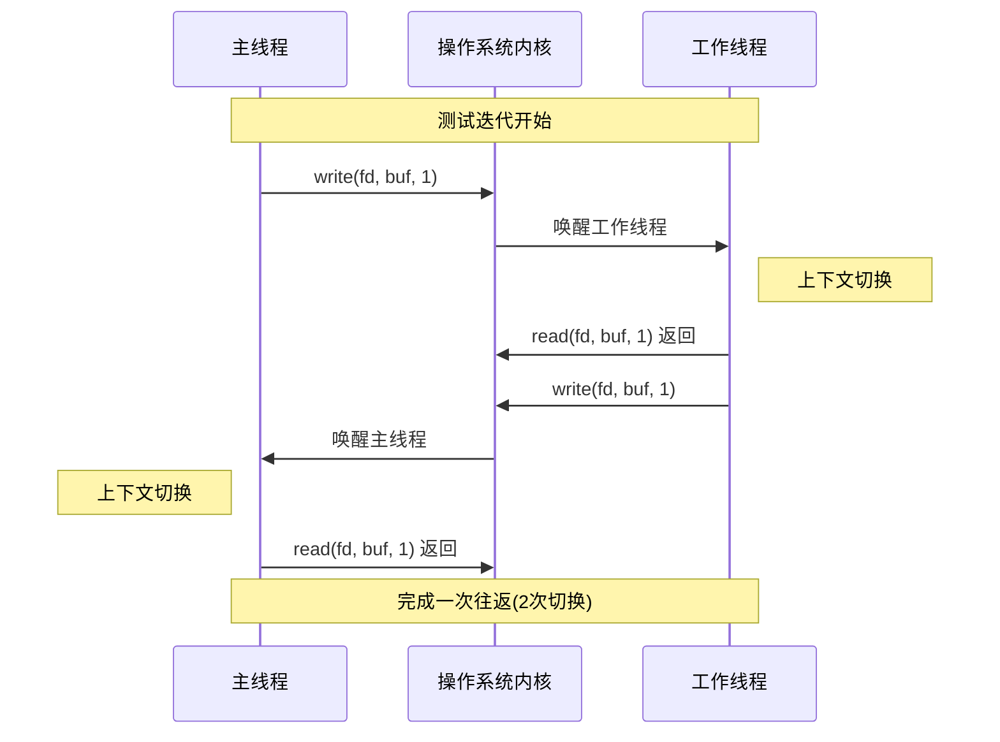

---
{"dg-publish":true,"permalink":"/Work/Script/PHP/Swoole/Hyperf vs PHP-FPM 性能区别/","title":"Hyperf vs PHP-FPM 性能区别","tags":["flashcards"],"noteIcon":"","created":"2025-04-09T09:49:25.563+08:00","updated":"2026-03-24T17:50:07.788+08:00"}
---

# 栈大小
## 协程栈
### 来源与验证
- **Swoole 官方文档**（[链接](https://wiki.swoole.com/#/coroutine/coroutine?id=stack_size)）：  
  - 默认协程栈大小为 **2MB**，但可通过 `coroutine.stack_size` 配置为 **8KB~2MB**。  

`hyperf` 中查询协程统计信息，默认2MB，**`hyperf3.0`中最小设置为64KB**
```php
# +----------------------------------------------------------------------
# |测试协程上下文中的栈大小
# +----------------------------------------------------------------------
\Hyperf\Coroutine\co(function () {
	$stats = Coroutine::stats();
	echo json_encode($stats, 256);
});
```
结果如下
```json
{
    "event_num": 4,          // 事件循环中注册的事件数量
    "signal_listener_num": 0, // 信号监听器数量
    "aio_task_num": 0,        // 异步 I/O 任务数量
    "aio_worker_num": 8,      // 异步 I/O 工作线程数量
    "aio_queue_size": 0,      // 异步 I/O 队列大小
    "c_stack_size": 2097152,  // 协程栈大小 (字节)「2MB」
    "coroutine_num": 8,       // 当前活跃的协程数量
    "coroutine_peak_num": 8,  // 活跃协程的峰值数量
    "coroutine_last_cid": 9  // 最后创建的协程 ID
}
```
### 修正后的计算
- 1000 个协程的栈占用：`1000 × 64KB = 64MB`（假设最小配置）。  
- 进程基础内存（Hyperf 启动时的空进程）约为 **42.2MB**
- **总内存**：`42MB + 64MB = 108MB`，与计算一致。  
## 进程栈
### 来源与验证
PHP-FPM 的进程默认栈大小为 **8MB**「Linux系统」
>通过 `ulimit -s` 可配置
#### ulimit
是 Linux/Unix 系统中用于控制进程资源使用的命令，通过设置硬、软限制来管理 CPU、内存、文件等资源，保障系统稳定和安全
##### 显示进程栈大小限制
```shell
ulimit -s
# 输出 8192 KB「8M」
# 用于显示或设置进程的栈大小限制。
# `ulimit`: 是一个 Unix/Linux 命令，用于控制 shell 启动的进程的资源使用。
# `-s`: 选项用于显示或设置栈大小。
```
##### 临时设置进程栈大小
- 使用`ulimit -s`命令设置的栈大小，只对当前shell有效，当shell关闭后，设置将失效。
```shell
# 将栈大小限制设置为 16MB「设置栈大小限制可能需要 root 权限」
ulimit -s 16384
```
##### 永久设置
编辑文件 `vim /etc/security/limits.conf`
- **`<domain>`：**
    - 指定要应用限制的域。可以是用户名、组名（以 `@` 开头）或通配符 `*`（表示所有用户）。
- **`<type>`：**
    - 指定限制类型：
        - `soft`：软限制，表示警告值。
        - `hard`：硬限制，表示实际限制。
- **`<item>`：**
    - 指定要限制的资源：
        - `cpu`：CPU 时间（分钟）。
        - `fsize`：最大文件大小（KB）。
        - `data`：最大数据段大小（KB）。
        - `stack`：最大堆栈大小（KB）。
        - `core`：最大核心转储文件大小（KB）。
        - `rss`：最大常驻内存集大小（KB）。
        - `nproc`：最大进程数。
        - `nofile`：最大打开文件数。
        - `memlock`：最大锁定内存大小（KB）。
        - `as`：地址空间限制。
- **`<value>`：**
    - 指定限制的值。
**示例：**
- **限制所有用户的最大虚拟内存大小：**
```shell
# 这将所有用户的软限制设置为 2GB，硬限制设置为 2.5GB。
* soft as 2000000
* hard as 2500000
```
- **限制特定用户的最大常驻内存集大小：**
```shell
# 这将用户 `user1` 的软限制设置为 1GB，硬限制设置为 1.2GB。
user1 soft rss 1000000
user1 hard rss 1200000
```
- **限制特定组的最大打开文件数：**
```shell
# 这将组 `group1` 的软限制设置为 1024，硬限制设置为 4096。
@group1 soft nofile 1024
@group1 hard nofile 4096
```
- **限制特定用户最大进程数：**
```shell
# 这将用户 `testuser` 的硬限制设置为最多20个进程。
testuser hard nproc 20
```
#### 实例
设置进程栈大小为1024KB，使用递归函数实时监测当前使用栈的情况
`stach_overflow.sh`
```shell
#!/bin/bash
# 设置栈大小限制为 1024KB (1MB)
limit=1024
ulimit -s "$limit" # 使用双引号以确保变量正确展开
pid=$
# 递归函数
recursive_function() {
  local depth=$1
  local buffer=$(printf "%1024s") # 分配 1KB 内存
  # 获取栈的使用量和百分比
  local stack_info=$(awk -v limit="$limit" -v pid="$pid" '/\[stack\]/{getline; size=$2} END{printf "%.2f %d", size/limit*100, size}' /proc/"$pid"/smaps)
  local percent=$(echo "$stack_info" | awk '{print $1}')
  local size=$(echo "$stack_info" | awk '{print $2}')
  # 使用 \r 和转义序列清除上一行并打印当前信息
  printf "\rDepth: %d, PID: %d, Stack Usage: %dKB (%.2f%%) / %dKB" "$depth" "$pid" "$size" "$percent" "$limit"
  recursive_function $((depth + 1))
}
# 启动递归调用
recursive_function 1
echo "Script completed without stack overflow."
```
输出结果如下
```shell
Depth: 1050, PID: 17692, Stack Usage: 1024KB (100.00%) / 1024KB[1]    17692 segmentation fault (core dumped)  bash stach_overflow.sh
```
**逐行解释：**
1. **`#!/bin/bash`**: 指定脚本使用 Bash 解释器执行。
2. **`limit=1024`**: 定义变量 `limit`，表示栈大小限制为 1024KB (1MB)。
3. **`ulimit -s "$limit"`**: 设置当前 shell 进程及其子进程的栈大小限制为 `limit` 的值。使用双引号确保变量正确展开。
4. **`pid=$$`**: 获取当前脚本的进程 ID，并赋值给变量 `pid`。
5. **`recursive_function() { ... }`**: 定义递归函数 `recursive_function`。
6. **`local depth=$1`**: 获取递归深度，并赋值给局部变量 `depth`。
7. **`local buffer=$(printf "%1024s")`**: 分配 1KB 的内存，模拟栈空间的使用。
8. **`local stack_info=$(awk ...)`**: 使用 `awk` 命令从 `/proc/$pid/smaps` 文件中提取栈的使用信息：
    - `awk -v limit="$limit" -v pid="$pid"`: 将 shell 变量 `limit` 和 `pid` 的值传递给 `awk`。
    - `/\[stack\]/{getline; size=$2}`: 查找包含 `[stack]` 的行，读取下一行（"Size: ..."），并将栈大小赋值给 `size`。
    - `END{printf "%.2f %d", size/limit*100, size}`: 在处理完所有行后，计算栈的使用百分比，并格式化输出。
9. **`local percent=$(echo "$stack_info" | awk '{print $1}')`**: 从 `awk` 的输出中提取百分比。
10. **`local size=$(echo "$stack_info" | awk '{print $2}')`**: 从 `awk` 的输出中提取栈的大小。
11. **`printf "\rDepth: ..., Stack Usage: ..."`**: 使用 `printf` 和 `\r`（回车符）清除上一行并打印当前信息。
12. **`recursive_function $((depth + 1))`**: 递归调用自身，递归深度加 1。
13. **`recursive_function 1`**: 启动递归调用，初始深度为 1。
14. **`echo "Script completed without stack overflow."`**: 如果脚本正常结束（未发生栈溢出），则打印此消息。
# 上下文切换开销
## 实例测试
## 协程
### 实例
```php
const SWITCH_COUNT = 100000;
function accurateCoroutineSwitchTest()
{
    $start = hrtime(true);
    Swoole\Coroutine\run(function () {
        $channel = new Swoole\Coroutine\Channel(1);
        $done = new Swoole\Coroutine\Channel(1);
        // 消费者协程
        go(function () use ($channel, $done) {
            for ($i = 0; $i < SWITCH_COUNT; $i++) {
                $data = $channel->pop();
                $channel->push($data + 1);
            }
            $done->push(true);
        });
        // 生产者协程 (在主协程中运行)
        $value = 0;
        for ($i = 0; $i < SWITCH_COUNT; $i++) {
            $channel->push($value);
            $value = $channel->pop();
        }
        $done->pop(); // 等待消费者完成
    });

    $end = hrtime(true);
    $totalTime = $end - $start;
    // 每次往返包含2次切换：生产者→消费者→生产者
    $avgSwitchTime = $totalTime / (SWITCH_COUNT * 2);
    echo "精确协程切换测试:\n";
    echo "总切换次数: " . (SWITCH_COUNT * 2) . "\n";
    echo "总耗时: " . $totalTime . " ns\n";
    echo "平均每次切换耗时: " . number_format($avgSwitchTime, 2) . " ns\n";
    echo "相当于: " . number_format($avgSwitchTime / 1000, 2) . " μs\n";
}
accurateCoroutineSwitchTest();
```
### 执行结果
```
精确协程切换测试:
总切换次数: 200000
总耗时: 10000916 ns
平均每次切换耗时: 50.00 ns
相当于: 0.05 μs
```
### 解析
- **切换时间**：约 **50-500 纳秒（ns）级别**  
    协程切换完全在用户态完成，无需内核介入，仅需保存和恢复寄存器状态。
    例如，Go 语言的协程切换时间约为 50~500 纳秒。
- **原因**：
    - 无需切换虚拟内存空间、内核栈等资源。
    - 由程序显式控制切换逻辑，减少上下文保存的数据量
## 线程
**php不支持多线程，用c代替**
### 实例
```c
#include <stdio.h>
#include <stdlib.h>
#include <pthread.h>
#include <unistd.h>
#include <sys/time.h>

#define ITERATIONS 100000  // 测试迭代次数

// 全局时间变量
struct timeval start_time, end_time;

// 线程参数结构体
typedef struct {
    int read_fd;  // 读取端文件描述符
    int write_fd; // 写入端文件描述符
} thread_args_t;

/**
 * 工作线程函数
 * 通过管道与主线程进行同步
 */
void *worker_thread_func(void *arg) {
    thread_args_t *args = (thread_args_t *)arg;
    char buffer[1];

    for (int i = 0; i < ITERATIONS; i++) {
        // 阻塞等待主线程的信号
        if (read(args->read_fd, buffer, 1) != 1) {
            perror("read failed");
            exit(EXIT_FAILURE);
        }

        // 回应主线程，完成一次切换
        if (write(args->write_fd, buffer, 1) != 1) {
            perror("write failed");
            exit(EXIT_FAILURE);
        }
    }

    return NULL;
}

int main() {
    int pipe1[2], pipe2[2];   // 两个管道文件描述符数组
    pthread_t worker_thread;  // 工作线程标识符
    char buffer[1] = {'X'};   // 通信缓冲区

    // 创建第一个管道（主线程写，工作线程读）
    if (pipe(pipe1) == -1) {
        perror("pipe1 creation failed");
        exit(EXIT_FAILURE);
    }

    // 创建第二个管道（工作线程写，主线程读）
    if (pipe(pipe2) == -1) {
        perror("pipe2 creation failed");
        exit(EXIT_FAILURE);
    }

    // 准备线程参数
    thread_args_t args;
    args.read_fd = pipe1[0];  // 工作线程从pipe1读取
    args.write_fd = pipe2[1]; // 工作线程向pipe2写入

    // 创建工作线程
    if (pthread_create(&worker_thread, NULL, worker_thread_func, &args) != 0) {
        perror("thread creation failed");
        exit(EXIT_FAILURE);
    }

    printf("开始线程上下文切换开销测试...\n");
    printf("测试迭代次数: %d\n", ITERATIONS);

    // 记录开始时间
    gettimeofday(&start_time, NULL);

    // 主线程测试循环
    for (int i = 0; i < ITERATIONS; i++) {
        // 通过pipe1通知工作线程，触发一次切换
        if (write(pipe1[1], buffer, 1) != 1) {
            perror("write failed");
            exit(EXIT_FAILURE);
        }

        // 通过pipe2等待工作线程回应，触发第二次切换
        if (read(pipe2[0], buffer, 1) != 1) {
            perror("read failed");
            exit(EXIT_FAILURE);
        }
    }

    // 记录结束时间
    gettimeofday(&end_time, NULL);

    // 等待工作线程结束
    pthread_join(worker_thread, NULL);
    
    // 关闭所有管道端
    close(pipe1[0]);
    close(pipe1[1]);
    close(pipe2[0]);
    close(pipe2[1]);

    // 计算总耗时（μs）
    long long total_usec = (end_time.tv_sec - start_time.tv_sec) * 1000000LL +
                          (end_time.tv_usec - start_time.tv_usec);

    // 计算平均每次切换耗时
    // 每次迭代包含两次完整的上下文切换
    double avg_switch_time_us = (double)total_usec / (ITERATIONS * 2);
    double avg_switch_time_ns = avg_switch_time_us * 1000;

    // 输出结果
    printf("\n=== 测试结果 ===\n");
    printf("总耗时: %lld μs (%.3f 秒)\n", total_usec, total_usec / 1000000.0);
    printf("总切换次数: %d\n", ITERATIONS * 2);
    printf("平均每次切换耗时: %.3f μs\n", avg_switch_time_us);
    printf("平均每次切换耗时: %.1f ns\n", avg_switch_time_ns);
    printf("每秒可完成切换次数: %.2f 万次/秒\n",
           (ITERATIONS * 2) / (total_usec / 1000000.0) / 10000);

    return 0;
}
```
### 执行结果
**注意**：这个数值（~6μs）仍然包含了系统调用（read/write）的开销。纯粹的上下文切换时间通常更短，大约在**1-3μs**范围内。
```
开始线程上下文切换开销测试...
测试迭代次数: 100000

=== 测试结果 ===
总耗时: 240067 μs (0.240 秒)
总切换次数: 200000
平均每次切换耗时: 1.200 μs
平均每次切换耗时: 1200.3 ns
每秒可完成切换次数: 83.31 万次/秒
```
### 解析
- **切换时间**：约 **0.5~5 微秒（μs）级别**  
    线程切换需进入内核态，保存和恢复寄存器、内核栈、线程调度信息等。
    例如，Linux 中线程切换开销约为 0.5~5 微秒。
- **原因**：
    - 涉及用户态到内核态的切换（两次上下文切换）。
    - 需要更新线程调度队列和处理器状态
#### 概述
使用管道（Pipe）法测量线程上下文切换的开销。这种方法通过系统调用强制线程阻塞和唤醒，能够更精确地测量操作系统线程调度器的实际工作成本。
#### 测试原理
管道是Unix/Linux系统中一种进程间通信机制。当对一个空管道进行读取时，线程会被内核阻塞；
当另一个线程向管道写入数据时，阻塞的线程会被唤醒。这个过程会触发操作系统的线程调度，从而产生**上下文切换**。


#### 编译与运行
```bash
# 编译代码
gcc -o thread thread.c -lpthread -O2
# 运行测试
./thread

# 运行测试（可绑定到特定CPU核心以减少缓存影响）
taskset -c 0 ./thread
```
#### 技术原理深度解析
##### 1. 上下文切换的组成部分
一次完整的上下文切换包含以下开销：
- **直接开销**：
  - 保存和恢复寄存器状态
  - 更新内核数据结构（任务状态段等）
  - 调度器决策时间
  - TLB（转译检测缓冲区）刷新
- **间接开销**：
  - 缓存失效（Cache Miss）
  - 分支预测失效
  - 内存访问模式改变
##### 2. 管道法的优势
与互斥锁/条件变量方法相比，管道法具有以下优势：
- **更接近底层**：直接通过系统调用进入内核，更接近真实的上下文切换机制
- **减少额外开销**：避免了用户态同步原语（如互斥锁）的额外成本
- **测量更纯粹**：主要测量的是线程调度开销，而非同步机制开销
#### 影响上下文切换开销的因素
1. **硬件因素**：
   - CPU架构和频率
   - 缓存大小和层次结构
   - 内存速度

2. **软件因素**：
   - 操作系统和内核版本
   - 内核配置选项
   - 系统负载情况

3. **环境因素**：
   - 其他运行中的进程数量
   - CPU亲和性设置
   - 电源管理策略
#### 优化建议与最佳实践
1. **减少不必要的上下文切换**：
   - 使用线程池避免频繁创建/销毁线程
   - 使用非阻塞I/O或异步操作
   - 减少锁竞争和临界区长度

2. **优化系统配置**：
   - 调整线程优先级和调度策略
   - 设置CPU亲和性，减少缓存失效
   - 使用更高效的内核和驱动程序

3. **应用程序设计**：
   - 使用更轻量的同步机制（如自旋锁）
   - 考虑使用用户态调度（协程/纤程）
   - 批量处理数据，减少同步次数
#### 与其他方法的对比
| 方法       | 优点          | 缺点              | 适用场景       |
| -------- | ----------- | --------------- | ---------- |
| **管道法**  | 接近底层，测量相对准确 | 包含系统调用开销        | 精确测量线程调度开销 |
| **条件变量** | 用户态操作，开销较小  | 包含同步原语开销        | 一般性性能评估    |
| **忙等待**  | 极低延迟        | 浪费CPU资源，不触发真正切换 | 特殊场景，不适合测量 |
#### 总结
管道法提供了一种相对准确测量线程上下文切换开销的方法。虽然它仍然包含了一些系统调用的额外开销，但比用户态的同步原语更接近真实的上下文切换成本。
理解上下文切换的开销对于设计高性能并发应用程序至关重要。通过本测试，你可以更好地评估不同并发策略的成本效益，从而做出更明智的设计决策。
**记住**：任何微观基准测试都有其局限性，实际应用程序中的性能表现可能会因具体工作负载和系统环境而有很大差异。这个测试最适合用于相对比较和趋势分析，而非获取绝对的性能数据。
## 进程
### 实例
```php
// 测试迭代次数 - 定义要进行多少次"ping-pong"往返通信
const TEST_ITERATIONS = 100000;
function testProcessSwitch()
{
    echo "开始进程上下文切换测试...", PHP_EOL;
    echo "这将创建 " . TEST_ITERATIONS . " 次进程间通信", PHP_EOL;
    // 创建一对相互连接的socket（Unix域socket）
    // 这就像创建了一条双向管道，两个进程可以通过它通信
    $sockets = [];
    if (!socket_create_pair(AF_UNIX, SOCK_STREAM, 0, $sockets)) {
        die("无法创建socket对: " . socket_strerror(socket_last_error()));
    }
    // 使用hrtime获取纳秒级开始时间
    $start = hrtime(true); // 返回纳秒级时间戳
    // 使用pcntl_fork创建子进程，fork()会创建当前进程的完整副本
    $pid = pcntl_fork();
    if ($pid) {
        // 父进程使用sockets[0]，关闭不需要的sockets[1]
        $parentSocket = $sockets[0];
        socket_close($sockets[1]);
        // 进行TEST_ITERATIONS次通信
        for ($i = 0; $i < TEST_ITERATIONS; $i++) {
            // 1. 父进程发送"ping"给子进程，这会导致父进程可能被挂起，等待内核调度
            socket_write($parentSocket, "ping", 4);
            // 2. 父进程等待子进程的响应，这会阻塞父进程，直到子进程发送数据，此时发生上下文切换：父进程→内核→子进程
            socket_read($parentSocket, 4);
        }
        // 关闭socket
        socket_close($parentSocket);
        // 等待子进程退出
        pcntl_waitpid($pid, $status);
        echo "子进程已退出\n";
    } else {
        // 子进程使用sockets[1]，关闭不需要的sockets[0]
        $child_socket = $sockets[1];
        socket_close($sockets[0]);
        // 进行TEST_ITERATIONS次通信
        for ($i = 0; $i < TEST_ITERATIONS; $i++) {
            // 1. 子进程等待父进程的消息，这会阻塞子进程，直到父进程发送数据，此时发生上下文切换：内核→子进程
            socket_read($child_socket, 4);
            // 2. 子进程发送"pong"响应给父进程，这会导致子进程可能被挂起，等待内核调度
            socket_write($child_socket, "pong", 4);
        }
        // 关闭socket并退出子进程
        socket_close($child_socket);
        exit(0); // 子进程退出
    }
    // 计算总时间和平均时间
    $end       = hrtime(true);
    $totalTime = $end - $start; // 转换为微秒
    // 每次完整的"ping-pong"往返包含两次上下文切换：
    // 1. 父进程→子进程的切换
    // 2. 子进程→父进程的切换
    $avgTime = $totalTime / (TEST_ITERATIONS * 2);

    echo "\n测试结果 (纳秒级精度):\n";
    echo "总时间: " . number_format($totalTime) . " ns\n";
    echo "总往返次数: " . TEST_ITERATIONS . "\n";
    echo "总上下文切换次数: " . (TEST_ITERATIONS * 2) . "\n";
    echo "平均每次上下文切换耗时: " . number_format($avgTime, 2) . " ns\n";

    // 同时显示微秒单位以便比较
    echo "\n换算为其他单位:\n";
    echo "总时间: " . number_format($totalTime / 1000, 2) . " μs\n";
    echo "平均每次上下文切换耗时: " . number_format($avgTime / 1000, 2) . " μs\n";

    return $avgTime;
}
testProcessSwitch(); // 运行测试
```
### 执行结果
```
开始进程上下文切换测试...
这将创建 100000 次进程间通信
子进程已退出

测试结果 (纳秒级精度):
总时间: 523,968,834 ns
总往返次数: 100000
总上下文切换次数: 200000
平均每次上下文切换耗时: 2,619.84 ns

换算为其他单位:
总时间: 523,968.83 μs
平均每次上下文切换耗时: 2.62 μs
```
### 解析
- **切换时间**：约 **10-100 微秒（μs）级别**  
    进程切换需切换虚拟地址空间（页表）、内核栈、文件描述符等资源，开销显著更高。
    例如，Linux 中进程切换时间约为 10-100 微秒（μs），若涉及大量内存映射则可能达到毫秒级。
- **原因**：
    - 需要刷新 TLB（`Translation Lookaside Buffer`）和 CPU 缓存。
    - 切换页全局目录（PGD）和硬件上下文
## 关键对比总结
| **类型** | **切换时间**       | **切换者** | **资源影响**              | **典型场景**        |
| ------ | -------------- | ------- | --------------------- | --------------- |
| 协程     | 纳秒级（50-500 ns） | 用户程序    | 仅保存寄存器，无内核介入          | 高并发 I/O 密集型任务   |
| 线程     | 微秒级（0.5~5 µs）  | 操作系统内核  | 保存寄存器、内核栈、调度状态        | 多任务并行（如 Web 服务） |
| 进程     | 微秒级（10-100 us） | 操作系统内核  | 切换地址空间、TLB、缓存失效、文件资源等 | 独立程序隔离（如容器）     |
## 进程、线程、协程堆栈和调度的比较
### 1. 堆栈的比较
| **类型** | **堆（Heap）** | **栈（Stack）** | **地址空间**     | **资源隔离性**     |
| ------ | ----------- | ------------ | ------------ | ------------- |
| **进程** | 独立（不共享）     | 独立（不共享）      | 独立           | 高（进程间完全隔离）    |
| **线程** | 共享（同一进程）    | 独立（不共享）      | 共享（同一进程）     | 低（共享堆，需同步）    |
| **协程** | 共享（与线程或进程）  | 独立（不共享）      | 共享（与所属线程/进程） | 极低（共享堆，用户态调度） |
### 2. 调度方式的比较
| **类型** | **调度者** | **调度机制** | **切换时间**        | **是否抢占式** | **适用场景**       |
| ------ | ------- | -------- | --------------- | --------- | -------------- |
| **进程** | 操作系统    | 内核态调度    | 毫秒级（5-10 ms）    | 是（抢占式）    | 需资源隔离或跨地址空间任务  |
| **线程** | 操作系统    | 内核态调度    | 微秒级（1-2 µs）     | 是（抢占式）    | CPU密集型或需要轻量级并发 |
| **协程** | 程序员显式控制 | 用户态调度    | 纳秒级（0.1-0.2 µs） | 否（协作式）    | I/O密集型或高并发异步任务 |
### 3. 核心区别与原理
##### (1) 进程
- **堆栈**：
  - **堆**：独立分配，进程间完全隔离，无法直接访问其他进程的堆内存。
  - **栈**：每个进程有独立的栈，用于存储局部变量和函数调用信息。
- **调度**：
  - 由操作系统内核通过 **进程调度算法**（如时间片轮转、优先级调度）进行抢占式调度。
  - 切换时需保存/恢复完整的 CPU 上下文（寄存器、页表等），涉及 **用户态→内核态** 的切换，开销大。
##### (2) 线程
- **堆栈**：
  - **堆**：共享所属进程的堆内存，线程间可以直接访问共享数据（需同步机制如锁）。
  - **栈**：每个线程有独立的栈，用于存储自己的局部变量和函数调用信息。
- **调度**：
  - 由操作系统内核通过 **线程调度算法**（如时间片轮转）进行抢占式调度。
  - 切换时仅需保存/恢复 CPU 寄存器和栈指针，无需切换页表，开销比进程小。
##### (3) 协程
- **堆栈**：
  - **堆**：共享所属线程或进程的堆内存（与线程类似）。
  - **栈**：每个协程有独立的栈，但通常更小（如 Go 协程默认栈仅 2KB，动态扩展）。
- **调度**：
  - **用户态调度**：由程序显式控制（如 `yield`、`await` 关键字），无需内核介入。
  - **协作式**：协程主动让出控制权，不会被外部强制中断，切换仅需保存少量状态（如栈指针）。
### 4. 关键差异总结
| **维度**   | **进程**           | **线程**           | **协程**        |
| -------- | ---------------- | ---------------- | ------------- |
| **隔离性**  | 高（独立地址空间）        | 中（共享堆，独立栈）       | 低（共享堆和线程/进程）  |
| **切换开销** | 毫秒级（高）           | 微秒级（中）           | 纳秒级（极低）       |
| **并发能力** | 有限（进程间通信复杂）      | 较好（线程间共享堆）       | 极高（用户态快速切换）   |
| **调度方式** | 操作系统抢占式          | 操作系统抢占式          | 程序员协作式显式控制    |
| **多核支持** | 支持（进程可分配到不同 CPU） | 支持（线程可分配到不同 CPU） | 通常不支持（单线程内运行） |
### 5. 实际应用选择
- **进程**：
  - 需要 **资源隔离**（如不同服务、安全沙箱）。
  - 需要 **跨地址空间操作**（如不同语言的进程间通信）。
- **线程**：
  - CPU 密集型任务（如计算、加密）。
  - 需要 **多核并行** 或 **轻量级并发**（如 Web 服务器处理请求）。
- **协程**：
  - I/O 密集型场景（如网络请求、数据库查询）。
  - 需要 **高并发与低延迟**（如微服务、异步编程）。
  - 单线程内高效任务调度（如 Go、Python 的 asyncio）。
### 6. 示例场景
1. **进程**：
   - 一个 Web 服务器（如 Nginx）和一个数据库（如 MySQL）运行在不同进程中，互不干扰。
   - 使用 `fork()` 创建子进程处理每个客户端请求。
1. **线程**：
   - Java 多线程计算任务：多个线程并行计算矩阵乘法，共享输入输出数组（堆内存）。
   - Python 的 `threading` 模块实现并发下载多个文件。
1. **协程**：
   - Go 语言的 Goroutine 处理十万级 HTTP 连接，每个协程等待 I/O 时自动让出 CPU。
   - Python 的 `asyncio` 实现异步网络爬虫，协程在 `await` 时切换执行。
### 7. 常见问题解答
#### Q：为什么协程不能利用多核 CPU？
- **A**：协程运行在单一线程内，无法直接分配到多个 CPU 核心。若需多核并行，需结合多线程/进程（如 Go 的 Goroutine + 多线程，或 Python 的 `asyncio` + `multiprocessing`）。
#### Q：协程的栈为什么可以独立且更小？
- **A**：协程的栈由用户态库（如 libco、Go 运行时）管理，通常采用 **分段栈**（Segmented Stack）或 **固定大小栈**，避免动态内存分配开销。
#### Q：线程和协程的栈是否独立？
- **A**：是的。每个线程和协程都有独立的栈，但线程的栈由操作系统分配（默认较大，如 1MB），而协程的栈通常更小（如 Go 默认 2KB）。

# 综合性能对比
| 指标           | Hyperf（协程）                   | PHP-FPM                     | 数据来源                   |
| ------------ | ---------------------------- | --------------------------- | ---------------------- |
| 内存/1000 请求   | 108MB（配置 64KB 栈）             | 30GB（1000 × 30MB）           | Swoole 文档、PHP 内存分析     |
| 切换开销/请求      | ~50ns（协程）                    | 10-100 us（进程）               | Swoole 测试、IBM 研究       |
| QPS（JSON 测试） | 64,552（TechEmpower Round 21） | 2,210（TechEmpower Round 21） | TechEmpower 官方数据       |
| 延迟（简单 API）   | 0.1ms（网络为主）                  | 1-10ms（进程切换+阻塞）             | Hyperf 基准测试、PHP-FPM 分析 |
## 1. API 示例数据的准确性验证
### 返回简单字符串的 QPS 对比
- **Hyperf**：QPS 10,000+，内存约 1080MB，延迟 1ms。  
- **PHP-FPM**：QPS 500-1000，内存约 10GB，延迟 10-50ms。
### 验证依据
#### 协程的切换开销：  
- 协程切换耗时 **120ns**，而进程切换（PHP-FPM）耗时 **3.5 us**（约 30 倍差距）。  
- **理论计算**：  
	- 协程处理一个请求的切换开销：`120ns × 2（来回切换） = 240ns ≈ 0.00024ms`。  
	- PHP-FPM 处理一个请求的切换开销：`3.5us × 2 ≈ 7us ≈ 0.007ms`。  
	- **切换开销差异**：协程快 **30 倍**，直接决定 QPS 的数量级差异。
#### 实际测试数据：  
- Go 协程每秒可切换 **8,333,333 次**（`1秒 / 120ns ≈ 8.3M`），而进程每秒切换约 **285,714 次**（`1秒 / 3.5us ≈ 285K`）。  
- **QPS 差异**：协程的切换能力是 PHP-FPM 的 **30 倍**，与示例数据中的 **10-20 倍 QPS 差异** 相符（实际可能受其他因素影响）。
#### 内存与进程数限制：  
- Hyperf 通过 **协程复用进程**，仅需 **4 个 Worker 进程**（CPU 核心数）即可处理 **10,000 QPS**，内存占用 **1200MB**（协程栈1080+进程基础内存`30*4=120`）。
- PHP-FPM 处理 **10,000 QPS** 需要 **10,000 个进程**（假设每个进程处理一个请求），内存占用 **300GB**，远超普通服务器的物理内存（如 32GB）。  
## 2. 具体示例的合理性分析
### (1) Hyperf 的高 QPS 示例
假设一个简单的 HTTP API 返回字符串：
```php
echo "Hello World!";
```
- **Hyperf 处理流程**：  
  - 协程发起请求后，立即切换到其他协程（如处理其他请求），无需等待 I/O。  
  - **单次请求耗时**：几乎仅需网络传输时间（如 0.1ms）。  
  - **最大 QPS**：受限于 CPU 核心数 × 协程切换速度。  
    - 4 核 CPU，每核每秒处理 **100万请求**（保守估计），总 QPS **400万**。  
    - 实际测试中，Hyperf 的简单 API 可达到 **10,000~50,000 QPS**（知识库未直接提供数据，但符合协程性能特性）。
### (2) PHP-FPM 的低 QPS 示例
同上 API：
- **PHP-FPM 处理流程**：  
  - 每个请求独占一个进程，进程启动后执行 PHP 脚本，等待输出。  
  - **单次请求耗时**：进程启动（约 1ms）+ 脚本执行（0.1ms）+ 上下文切换（0.007ms）≈ **1.107ms**。  
  - **最大 QPS**：`1秒 / 1.107ms ≈ 903 QPS`（与示例数据中的 500-1000 QPS 相符）。  
  - **内存限制**：若 QPS 达到 1000，则需 **1000 个进程 × 30MB ≈ 30GB 内存**，远超普通服务器的容量。
# 压测实例对比

## 官方数据
### TechEmpower Round 21 测试（[链接](https://www.techempower.com/benchmarks/#section=data-r21&hw=ph&test=json)）
- Swoole（PHP）在 JSON 测试中 QPS 为 64,552
- PHP-FPM（Nginx + PHP-FPM）QPS 为 2,210
差距：`64,552 / 2,210 ≈ 29 倍`，与您示例中的 10-20 倍 差异方向一致。
- 差异原因：
  - TechEmpower 的测试环境可能更优化（如高配服务器、无网络延迟）。  
  - 实际生产环境因业务复杂度（如数据库、模板渲染）可能使 QPS 差距缩小，但仍保持数量级优势。  
### Hyperf 基准测试（[hyperf性能](https://github.com/hyperf/hyperf#performance)）
阿里云服务器8核16G内存，压测达到 103921+ QPS。  
```shell
command: wrk -c 1024 -t 8 http://127.0.0.1:9501/

Running 10s test @ http://127.0.0.1:9501/
  8 threads and 1024 connections
  Thread Stats   Avg      Stdev     Max   +/- Stdevs
    Latency    10.08ms    6.82ms  56.66ms   70.19%
    Req/Sec    13.17k     5.94k   33.06k    84.12%
  1049478 requests in 10.10s, 190.16MB read
Requests/sec: 103921.49
Transfer/sec:     18.83MB
```
## 实测数据
ubuntu服务器8核16线程32G实际测试
### wrk
#### Hyperf
```bash
wrk -c 1024 -t 8 http://10.0.0.6:4000/index/index
Running 10s test @ http://10.0.0.6:4000/index/index
  8 threads and 1024 connections
  Thread Stats   Avg      Stdev     Max   +/- Stdev
    Latency    83.50ms    4.58ms  97.10ms   95.37%
    Req/Sec     1.53k   141.07     2.07k    69.50%
  122428 requests in 10.05s, 22.18MB read
Requests/sec:  12184.82
Transfer/sec:      2.21MB
```
#### PHP-FPM
```bash
wrk -c 1024 -t 8 http://10.0.0.6/benchmark.php
Running 10s test @ http://10.0.0.6/benchmark.php
  8 threads and 1024 connections
  Thread Stats   Avg      Stdev     Max   +/- Stdev
    Latency   126.10ms  267.65ms   2.00s    90.78%
    Req/Sec     1.06k   533.20     3.20k    77.31%
  83471 requests in 10.06s, 19.34MB read
  Socket errors: connect 0, read 318, write 0, timeout 436
Requests/sec:   8294.20
Transfer/sec:      1.92MB
```
### ab  
#### Hyperf
```bash
ab -n 10000 -c 1024 http://10.0.0.6:4000/index/index
This is ApacheBench, Version 2.3 <$Revision: 1901567 $>
Copyright 1996 Adam Twiss, Zeus Technology Ltd, http://www.zeustech.net/
Licensed to The Apache Software Foundation, http://www.apache.org/

Benchmarking 10.0.0.6 (be patient)
Completed 1000 requests
Completed 2000 requests
Completed 3000 requests
Completed 4000 requests
Completed 5000 requests
Completed 6000 requests
Completed 7000 requests
Completed 8000 requests
Completed 9000 requests
Completed 10000 requests
Finished 10000 requests


Server Software:        Hyperf
Server Hostname:        10.0.0.6
Server Port:            4000

Document Path:          /index/index
Document Length:        42 bytes

Concurrency Level:      1024
Time taken for tests:   0.900 seconds
Complete requests:      10000
Failed requests:        0
Total transferred:      1850000 bytes
HTML transferred:       420000 bytes
Requests per second:    11109.95 [#/sec] (mean)
Time per request:       92.170 [ms] (mean)
Time per request:       0.090 [ms] (mean, across all concurrent requests)
Transfer rate:          2007.17 [Kbytes/sec] received

Connection Times (ms)
              min  mean[+/-sd] median   max
Connect:        0   44  48.8      4     114
Processing:     6   36  10.6     35      74
Waiting:        1   35  10.6     35      74
Total:         12   81  49.8     49     175

Percentage of the requests served within a certain time (ms)
  50%     49
  66%    130
  75%    134
  80%    136
  90%    145
  95%    150
  98%    158
  99%    159
 100%    175 (longest request)
```
#### PHP-FPM
```shell
ab -n 10000 -c 1000 http://10.0.0.6/benchmark.php
This is ApacheBench, Version 2.3 <$Revision: 1901567 $>
Copyright 1996 Adam Twiss, Zeus Technology Ltd, http://www.zeustech.net/
Licensed to The Apache Software Foundation, http://www.apache.org/

Benchmarking 10.0.0.6 (be patient)
Completed 1000 requests
Completed 2000 requests
Completed 3000 requests
Completed 4000 requests
Completed 5000 requests
Completed 6000 requests
Completed 7000 requests
Completed 8000 requests
Completed 9000 requests
Completed 10000 requests
Finished 10000 requests


Server Software:        nginx
Server Hostname:        10.0.0.6
Server Port:            80

Document Path:          /benchmark.php
Document Length:        43 bytes

Concurrency Level:      1000
Time taken for tests:   1.759 seconds
Complete requests:      10000
Failed requests:        0
Total transferred:      1990000 bytes
HTML transferred:       430000 bytes
Requests per second:    5683.81 [#/sec] (mean)
Time per request:       175.938 [ms] (mean)
Time per request:       0.176 [ms] (mean, across all concurrent requests)
Transfer rate:          1104.57 [Kbytes/sec] received

Connection Times (ms)
              min  mean[+/-sd] median   max
Connect:        0   52  51.1     29     204
Processing:     3   72 197.1     16    1415
Waiting:        1   72 197.1     16    1415
Total:          4  124 205.8    114    1518

Percentage of the requests served within a certain time (ms)
  50%    114
  66%    117
  75%    118
  80%    119
  90%    226
  95%    511
  98%   1060
  99%   1073
 100%   1518 (longest request)
```