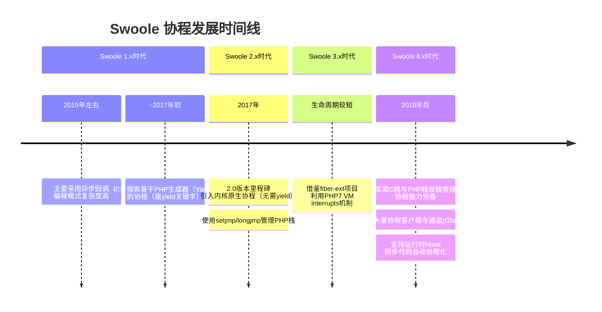

---
{"dg-publish":true,"permalink":"/Work/Script/PHP/Swoole/协程发展时间线/","title":"协程发展时间线","tags":["flashcards"],"noteIcon":"","created":"2025-09-16T21:43:38.537+08:00","updated":"2026-03-24T17:50:00.992+08:00"}
---

Swoole 协程的引入和发展是 PHP 高性能编程的一个重要里程碑。它从根本上改善了 PHP 处理高并发 IO 操作的方式。下面我将为你梳理 Swoole 协程的发展时间线、此前的机制，并解析其底层切换原理。
### ⏰ Swoole 协程发展时间线
Swoole 协程并非一蹴而就，其发展和完善经历了多个版本迭代。下面表格梳理了关键阶段及其核心特性：

### 🔄 引入协程前的异步回调机制
在协程诞生之前，Swoole 主要采用**异步回调**模式处理并发。
这种模式的**主要缺点**是：
 1. **回调地狱**：随着项目复杂度增加，回调嵌套多层，代码难以编写和维护。
 2. **违反直觉**：异步回调的编程方式与人类自然的同步思维模式相悖，出错几率高。
 3. **调试困难**：异常堆栈信息复杂，问题定位困难。
### 🧠 协程切换的底层原理
Swoole 协程的底层实现可以概括为 **“在用户态管理并切换不同协程的执行上下文”**。关键在于同时管理了 **C 栈** 和 **PHP 栈**。
#### 核心：双栈切换
当一个协程执行时，完整的运行时环境包括：
  - **C 栈**：保存了 C 函数调用的上下文（如局部变量、返回地址）。Swoole 使用类似 `make_fcontext`/`jump_fcontext` 的底层汇编函数来创建和切换。
  - **PHP 栈**（Zend VM 栈）：保存了 PHP 层的执行信息（如变量、执行位置）。
协程切换时，Swoole 需要同时保存和恢复这两个栈的上下文。
#### 触发切换的时机
协程的切换是**非抢占式**的，主要发生在以下时刻：
 1. **遇到 I/O 操作**：如协程版的 `Co::sleep`、`$mysql->connect`、`$redis->get` 等。这些操作会主动让出 CPU。
 2. **遇到 Channel 操作**：当协程向 Channel 读写数据而条件不满足时（如通道空或满），会自动挂起。
 3. **主动让出**：协程可主动调用 `Co::yield()` 让出执行权，由调度器选择另一个协程运行。
#### 详细示例解析
下面我们通过一个简单的例子，看看协程是如何工作的：
```php
Co\run(function () {
    go(function () { // 协程1
        echo "协程 1 开始\n";
        Co::sleep(1); // 触发点：遇到协程版sleep，让出CPU
        echo "协程 1 结束\n";
    });
    
    go(function () { // 协程2
        echo "协程 2 开始\n";
        Co::sleep(0.5); // 触发点：遇到协程版sleep，让出CPU
        echo "协程 2 结束\n";
    });
    
    echo "主协程逻辑\n"; 
});
// 输出顺序：
// 协程 1 开始
// 协程 2 开始
// 主协程逻辑
// (约0.5秒后) 协程 2 结束
// (约1秒后) 协程 1 结束
```
**执行流程解析**：
 1. **Co\run** 创建一个协程容器（调度器）。
 2. **go** 函数创建了两个新的协程（协程1和协程2），它们被加入到调度器的队列中。注意，此时**只是创建，并不立即执行**函数体内的所有代码。
 3. 协程调度器开始工作，**协程1**首先得到执行：
      - 执行 `echo "协程 1 开始\n";`。
      - 遇到 `Co::sleep(1);`，这是一个**模拟的耗时I/O操作**。协程1会**主动让出CPU**并将自己的状态设置为“等待”。
 4. 协程1挂起后，调度器选择**协程2**执行：
      - 执行 `echo "协程 2 开始\n";`。
      - 同样遇到 `Co::sleep(0.5);`，协程2也**主动让出CPU**并进入“等待”状态。
 5. 两个协程都挂起后，调度器继续执行**主协程**，输出 `echo "主协程逻辑\n";`。
 6. 此时，所有协程（包括主协程）都已执行完或处于等待状态，调度器开始**事件循环**，等待异步事件完成。
 7. 大约 **0.5秒**后，协程2的 Sleep 事件最先超时完成。调度器收到事件通知，**恢复协程2的执行**，输出 `echo "协程 2 结束\n";`。协程2执行完毕，资源被回收。
 8. 大约 **1秒**后，协程1的 Sleep 事件超时完成。调度器**恢复协程1的执行**，输出 `echo "协程 1 结束\n";`。协程1执行完毕。
 9. 所有协程任务结束，`Co\run` 返回，脚本结束。

这个过程的关键在于，**遇到I/O操作时，当前协程不是阻塞地等待，而是主动通知调度器：“我去等消息了，你先去处理其他事情吧”。** 调度器就会挂起这个协程，然后去执行其他已经准备好运行的协程。当网络、数据库、定时器等外部事件完成后，调度器会收到通知，再恢复相应协程的执行。
### 💡 总结与提示
Swoole 的协程从一个可选的编程特性，逐渐发展为支撑其高性能并发能力的核心机制。它通过**在用户态管理并切换执行上下文**，将复杂的异步回调逻辑转化为直观的同步代码风格，同时保持了高性能。
**重要提示**：
  - **协程非线程**：Swoole 协程是单线程内的并发，协程间切换由自身调度，无需操作系统介入，因此更轻量、高效。
  - **避免阻塞操作**：在协程中切忌使用 `sleep()` 等传统阻塞函数，而应使用 `Co::sleep()` 等协程版方法，否则会阻塞整个进程。
  - **协程间通信**：推荐使用 **Channel** 进行协程间通信和同步，它是 Go 语言中 CSP 模型的实现，是协程间的安全通信机制。
希望以上解释能帮助你理解 Swoole 协程。如果兴趣，你可以从 Swoole 4.x 的协程 TCP 服务器或 HTTP 服务器开始实践，感受协程带来的编程体验提升。