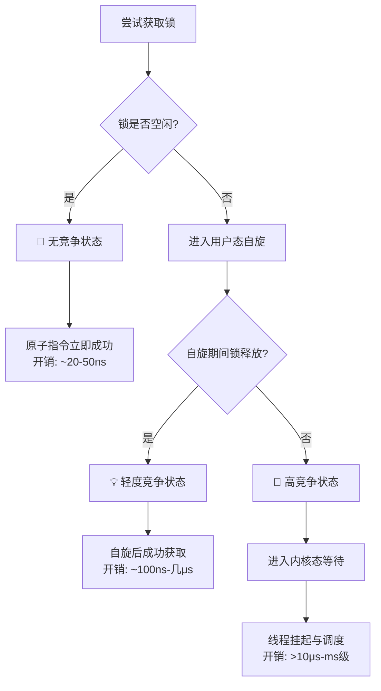

---
{"dg-publish":true,"permalink":"/Work/Script/PHP/Swoole/锁竞争状态/","title":"锁竞争状态","tags":["flashcards"],"noteIcon":"","created":"2025-09-17T09:48:52.142+08:00","updated":"2026-03-24T17:49:57.954+08:00","dg-note-properties":{"title":"锁竞争状态","tags":["flashcards"],"reference linking":null}}
---

# 锁竞争状态：从原理到实践的系统性分析

## 锁竞争的本质与分类
锁竞争程度反映了多个执行单元（进程/线程/协程）争抢共享资源的激烈程度，主要由四个维度决定：
- **等待队列长度**：同时争抢同一把锁的执行单元数量
- **持有时间**：锁被占用的平均时长
- **访问频率**：执行单元尝试获取锁的频次
- **性能影响**：等待锁的时间占总执行时间的比例

根据这些维度，锁竞争可分为三个明显状态：


## 各竞争状态详细分析
### 1. 无竞争 (No Contention)
**特征**：
- 等待队列长度为0
- 锁总是立即可用
- 性能开销可忽略不计（约20-50ns）
**技术原理**：
- 通过单条原子CPU指令（如CAS）完成获取
- 完全在用户态执行，无系统调用
- 内存屏障确保可见性和有序性
**实践意义**：
```php
// 无竞争时加锁：微小开销换取巨大安全性
if (flock($lockFile, LOCK_EX)) { // ~20-50ns开销
    // 临界区操作
    flock($lockFile, LOCK_UN);
}
```
>即使无竞争，加锁也是必要的防御性编程实践，保证了代码的未来安全性和自文档性。
### 2. 轻度竞争 (Mild Contention)
**特征**：
- 等待线程数 ≤ 2倍CPU核心数
- 自旋成功率 > 90%
- 等待时间占比 < 5%
**技术原理**：
- 原子指令失败后进入用户态自旋循环
- 乐观重试策略，避免立即进入内核
- 依赖缓存一致性协议（如MESI）检测锁状态变化
**性能特征**：
- 开销：100ns - 几μs
- 吞吐量影响较小
- 可接受的性能衰减
### 3. 高竞争 (High Contention)
**特征**：
- 等待线程数 ≫ CPU核心数
- 自旋成功率极低
- 等待时间占比 > 10%
- 系统态CPU使用率（sys%）显著升高
**技术原理**：
1. 用户态自旋失败
2. 执行系统调用（如futex）进入内核
3. 线程被挂起，放入等待队列
4. 触发完整的上下文切换
5. 锁释放时唤醒等待线程
6. 被唤醒线程重新竞争锁
**性能影响**：
- 开销：>10μs - ms级
- 吞吐量急剧下降
- 可能引发请求超时和级联故障
## 量化指标与诊断方法
### 关键量化指标
| 竞争程度 | 线程数 | 持有时间 | 等待占比 | 性能开销 |
|---------|--------|----------|----------|----------|
| 无竞争 | 0 | 任意 | 0% | ~20-50ns |
| 轻度竞争 | ≤2×核心 | 短 | <5% | ~100ns-几μs |
| 高竞争 | ≫核心数 | 长 | >10% | >10μs-ms |
### 诊断工具
- **Linux perf**：分析cycles消耗和缓存命中率
- **CPU Profilers**（VTune, async-profiler）：定位锁等待热点
- **语言特定工具**：
  - Java: jstack查看BLOCKED状态线程
  - Go: pprof互斥锁分析
  - PHP: 可通过xhprof分析文件锁争用
## 优化策略与实践
### 通用优化原则
1. **缩短临界区**：将非关键操作移出锁外
2. **降低锁粒度**：拆分粗粒度锁为多个细粒度锁
3. **减少锁频率**：合并操作，批量处理
### 针对高竞争的解决方案
#### 技术方案选择
```php
// 方案1：队列化 - 将竞争转为顺序处理
$queue = new Redis();
// 生产者：将任务放入队列而非直接竞争资源
$queue->lPush('task_queue', $taskData);

// 消费者：单线程或有限线程处理任务
$task = $queue->rPop('task_queue');
processTask($task);

// 方案2：原子操作 - 替代锁机制
$redis->incr('counter'); // 原子递增，无需锁

// 方案3：分片策略 - 分散竞争压力
$shardKey = $userId % 16; // 分为16个分片
$shardLock = "lock_{$shardKey}"; // 分散到不同锁
```
#### 架构层面优化
1. **读写分离**：读多写少场景使用读写锁
2. **资源副本**：为不同线程提供资源副本，定期同步
3. **无锁数据结构**：基于CAS实现无锁算法
4. **业务降级**：高竞争时降级为简化处理流程
## PHP特定实践建议
### 文件锁优化
```php
// 最佳实践：最小化临界区
$lockFile = fopen('resource.lock', 'w+');
if (flock($lockFile, LOCK_EX)) {
    // 只将必须同步的操作放在临界区内
    $data = file_get_contents('data.json');
    // 快速处理...
    file_put_contents('data.json', json_encode($data));
    flock($lockFile, LOCK_UN);
}
fclose($lockFile);

// 避免：在锁内进行耗时操作
if (flock($lockFile, LOCK_EX)) {
    // ❌ 错误示例：在锁内进行网络IO
    $result = file_get_contents('http://external.api/data'); 
    // ...
}
```
### 替代方案实施
```php
// 使用Redis实现分布式锁和原子操作
$redis = new Redis();
$redis->connect('127.0.0.1', 6379);

// 原子计数器替代文件锁
$counter = $redis->incr('my_counter');

// 分布式锁（带超时防止死锁）
$lockAcquired = $redis->set('resource_lock', 'locked', ['nx', 'ex' => 30]);
if ($lockAcquired) {
    try {
        // 处理共享资源
    } finally {
        $redis->del('resource_lock');
    }
}
```
## 总结与核心洞察
1. **锁竞争是系统性现象**：不能单纯通过线程数判断，需综合等待时间、持有时间和访问频率
2. **测量优于猜测**：必须使用性能分析工具定量评估竞争程度
3. **优化是渐进过程**：从缩短临界区开始，逐步采用更高级的并发控制策略
4. **架构决定并发上限**：高并发场景最终需要架构层面的解决方案（分片、队列、无锁）
5. **PHP特定考量**：在缺乏原生线程支持的环境中，重点考虑分布式锁、队列化和原子操作