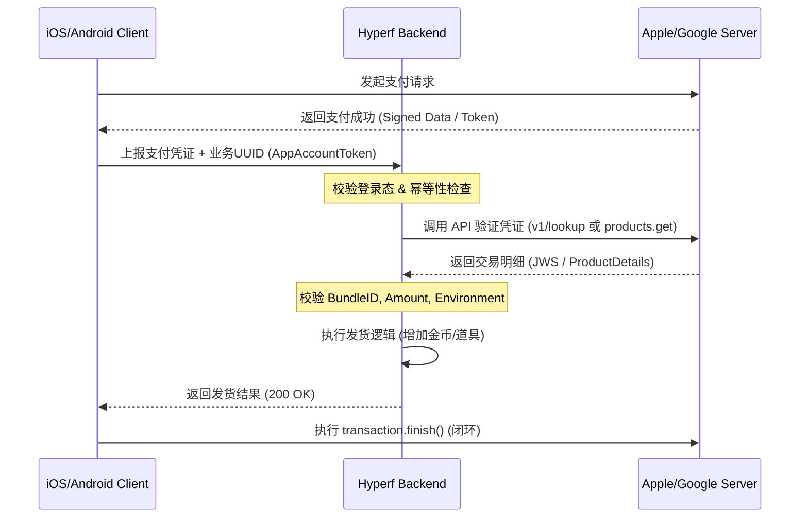

---
{"dg-publish":true,"permalink":"/Work/Tools/Common/Apple & Google 支付服务端集成全攻略/","title":"Apple & Google 支付服务端集成全攻略","tags":["flashcards","#ApplePay","#GooglePay","#Hyperf"],"noteIcon":"","created":"2026-05-07T11:48:40.225+08:00","updated":"2026-05-21T11:11:59.680+08:00","dg-note-properties":{"title":"Apple & Google 支付服务端集成全攻略","tags":["flashcards","#ApplePay","#GooglePay","#Hyperf"],"reference linking":null}}
---

## 🛠️ 核心对接流程图


## 📝 平台集成详解
### 1. iOS (StoreKit 2)
> [!abstract] 核心链接
> - [官方 API 首页](https://developer.apple.com/documentation/appstoreserverapi)
> - [密钥集成页面](https://appstoreconnect.apple.com/access/integrations/api)
#### 🔑 鉴权要素
- **Issuer ID**: 发行商 UUID。
- **Key ID**: 10 位字符串（如 `ABC1234567`）。
- **Private Key**: `.p8` 文件（仅下载一次，建议存放在 `storage/certs/`）。
- **Bundle ID**: 必须严格匹配（如 `com.xwl.PeiWan`）。
#### ⚠️ 核心注意项
- **UUID 格式**: `appAccountToken` 必须是标准 UUID。如果返回 `700004` 错误，说明格式非法。
- **环境切换**: 
  - 沙盒: `https://api.storekit-sandbox.itunes.apple.com`
  - 生产: `https://api.storekit.itunes.apple.com`
- **核销时机**: 必须在后端确认发货成功后，客户端再执行 `finish()`。否则未 Finish 就退款可能导致 `4040010` 交易找不到。
### 2. Android (Google Play Billing)
> [!abstract] 核心链接
> - [Google Play Developer API](https://developers.google.com/android-publisher)
> - [RTDN 指南](https://developer.android.com/google/play/billing/rtdn)
#### ⚠️ 核心注意项
- **必须 Acknowledge**: 3 天内未确认，Google 将强制退款。
- **RTDN 幂等**: Pub/Sub 可能多次推送，必须基于 `purchaseToken` 做防重逻辑。
- **权限延迟**: 关联服务账号后需等待约 24 小时生效。
## 📂 环境配置 (Hyperf .env 示例)
```shell
# =====================================================
# Apple支付配置 test
# =====================================================
APPLE_PAY_ISSUER_ID=57014232-xxxx-xxxx-xxxx-xxxxxxxxxxxx
APPLE_PAY_KEY_ID=ABC1234567
APPLE_PAY_BUNDLE_ID=com.xwl.PeiWan
APPLE_PAY_PRIVATE_KEY_PATH=storage/apple/SubscriptionKey_53RN8TU72V.p8
APPLE_PAY_APP_ID=6739400000
APPLE_PAY_CA=storage/apple/AppleRootCA-G3.cer
# 测试环境: Sandbox
# 生产环境: Production
APPLE_PAY_IS_ENVIRONMENT=Sandbox

# =====================================================
# Google充值配置
# =====================================================
# 用于标识你的应用，在 Google Play Console 中获取。
GOOGLE_PAY_CLIENT_ID=101678374159913826192
# Google Pay 服务账号的配置文件路径（JSON 格式）
GOOGLE_PAY_CONFIG_PATH=google/coplay-65651-9f066b0f0bf6.json
```